# 🌾 Kansas Frontier Matrix  
### _An Open-Source Geospatial-Historical Knowledge System for Kansas_

[](../../actions/workflows/site.yml)  
[](../../actions/workflows/stac-validate.yml)  
[](../../actions/workflows/codeql.yml)  
[](../../actions/workflows/trivy.yml)  
[](./docs/)  
[%20%7C%20CC--BY%204.0%20(docs)-blue)](./LICENSE)  
[](./docs/standards/)

---

```yaml
---
title: "Kansas Frontier Matrix — Root Repository"
version: "v6.3.0"
last_updated: "2025-10-14"
authors: ["Andy Barta et al."]
status: "Stable"
maturity: "Production"
tags: ["geospatial","historical","ai","timeline","maplibre","stac","cidoc","mcp"]
license: "MIT (code) | CC-BY 4.0 (docs)"
semantic_alignment:
  - CIDOC CRM
  - OWL-Time
  - GeoSPARQL
  - DCAT 2.0
  - STAC 1.0
---
````

---

## 📚 Overview

**Kansas Frontier Matrix (KFM)** is a reproducible, open-source **geospatial-historical knowledge system** that fuses Kansas’s environmental, geological, and cultural records into an interactive **map-timeline knowledge graph**.
It links **people ↔ places ↔ events ↔ documents** through a **Neo4j-based semantic graph**, powered by **AI/ML enrichment**, standardized **STAC metadata**, and rigorous **MCP-DL v6.2+** documentation.

---

## 🧭 Mission

> *To reconstruct Kansas’s frontier history and ecology as an auditable, reproducible digital atlas.*
> Every dataset, script, and document is versioned, traceable, and aligned to FAIR principles — *Findable, Accessible, Interoperable, Reusable.*

---

## 🏗️ System Architecture

```mermaid
flowchart LR
    A["External Sources<br/>(NOAA · USGS · FEMA · KHS · Treaties)"]
      --> B["Python ETL + AI Pipeline<br/>(OCR · NER · Geocoding · Summarization)"]
      --> C["Neo4j Knowledge Graph<br/>(People · Places · Events · Documents)"]
      --> D["FastAPI / GraphQL API"]
      --> E["React + MapLibre Web UI<br/>(Map · Timeline · AI Panels)"]
%% END OF MERMAID
```



| Layer                | Technology                    | Function                                               |
| :------------------- | :---------------------------- | :----------------------------------------------------- |
| **Data Extraction**  | Python ETL (`src/pipelines/`) | Harvest and normalize raw data from APIs & archives    |
| **AI/ML Processing** | spaCy · Transformers          | Named-entity recognition, OCR, summarization           |
| **Knowledge Graph**  | Neo4j (+ GeoSPARQL)           | Store and query entities with spatial/temporal indexes |
| **API Layer**        | FastAPI / GraphQL             | Serve data to frontend and external consumers          |
| **Frontend**         | React + MapLibre GL + D3      | Interactive map and timeline interface                 |
| **Docs / CI/CD**     | GitHub Actions · MkDocs       | Continuous validation & site deployment                |

---

## 🗂 Repository Layout (Monorepo)

```text
Kansas-Frontier-Matrix/
├─ src/           # Python ETL & AI pipelines (ingest, NER, graph integration)
├─ web/           # React frontend (MapLibre GL + timeline UI)
├─ data/
│  ├─ sources/    # JSON source manifests (pointer to external data)
│  ├─ raw/        # Immutable original data (DVC/LFS)
│  ├─ processed/  # Standardized outputs (COG, GeoJSON, CSV)
│  └─ stac/       # SpatioTemporal Asset Catalog metadata
├─ docs/          # Architecture, SOPs, model cards, MCP standards
├─ tools/         # Utilities (data conversion, deployment)
├─ tests/         # Unit & integration tests
└─ .github/       # CI/CD workflows + issue/PR templates
```

Each folder includes a local `README.md` compliant with MCP-DL v6.2 for provenance and usage.

---

## 🧮 Core Data Domains

| Domain                     | Example Datasets                             | Format / Standard                              |
| :------------------------- | :------------------------------------------- | :--------------------------------------------- |
| **Terrain & Elevation**    | USGS 3DEP LiDAR, KS DEM 1 m                  | Cloud-Optimized GeoTIFF (COG) · STAC Item JSON |
| **Hydrology**              | NHD flowlines, Kansas rivers                 | GeoJSON / Shapefile · GeoSPARQL                |
| **Climate & Hazards**      | NOAA Daymet, Storm Events, FEMA Disasters    | CSV / NetCDF / JSON · DCAT metadata            |
| **Historical Records**     | Kansas Memory, Chronicling America, Treaties | Text + OCR JSON · CIDOC CRM E73 docs           |
| **Cultural & Archaeology** | Site Inventories, Oral Histories             | GeoJSON + Transcripts · CRM E5 Events          |

Each dataset defines provenance, license, spatial extent, temporal range, and checksum ( SHA-256 ).

---

## 💠 Documentation & Standards

* **MCP-DL v6.2+** – Markdown Documentation Language for structured, semantic docs.
* **STAC 1.0 / DCAT 2.0** – dataset cataloging and metadata exchange.
* **CIDOC CRM · OWL-Time · GeoSPARQL** – semantic ontology alignment.
* **YAML front-matter + JSON-LD** embedded in docs for machine readability.
* **Docs Validation CI** – automated Markdown/STAC lint via GitHub Actions.

Refer to [`docs/standards/`](./docs/standards/) for templates and schema definitions.

---

## 🤖 AI and Analytics Modules

* **Entity Extraction (NER):** spaCy custom model trained on frontier texts.
* **Summarization:** BART/T5 Transformers for abstract summaries and captions.
* **Pattern Detection:** Spatio-temporal clustering with Bayesian and Fractal methods.
* **Symbolic Reasoning:** Ontology-driven inference rules over graph relations.

All AI components carry [MCP Model Cards](./docs/templates/model_card.md) for transparency and bias reporting.

---

## 🧩 Contributing

We welcome historians, developers, and citizens to extend the Kansas Frontier Matrix.
See [`CONTRIBUTING.md`](./CONTRIBUTING.md) for branch workflow, semantic commit rules, and MCP checklists.

**Pull Request requirements**

1. Updated README or STAC metadata for new data.
2. Passing tests and docs validation (`make test` · `make docs-validate`).
3. Verified data license (CC-BY or Public Domain preferred).

---

## 📜 License & Attribution

* **Code:** MIT License — reuse with attribution.
* **Data & Docs:** Creative Commons BY 4.0 (CC-BY-4.0).

> *Barta, A. et al. (2025). Kansas Frontier Matrix v6.3 — An Open Geospatial-Historical Knowledge System.*
> DOI pending (see `CITATION.cff`).

---

## 🧾 Version History

| Version  | Date       | Notes                                                                     |
| :------- | :--------- | :------------------------------------------------------------------------ |
| **v6.3** | 2025-10-14 | Expanded AI pipeline, added CI security audits, improved monorepo layout. |
| **v6.2** | 2025-10-13 | Adopted MCP-DL v6.2 standard and ontology alignment.                      |
| **v6.1** | 2025-09    | Initial repository standardization under MCP-DL series.                   |

---

### 🏛 “Document the Frontier · Reconstruct the Past · Illuminate Connections.”

© 2025 Kansas Frontier Matrix  ·  MIT / CC-BY 4.0

```
```
