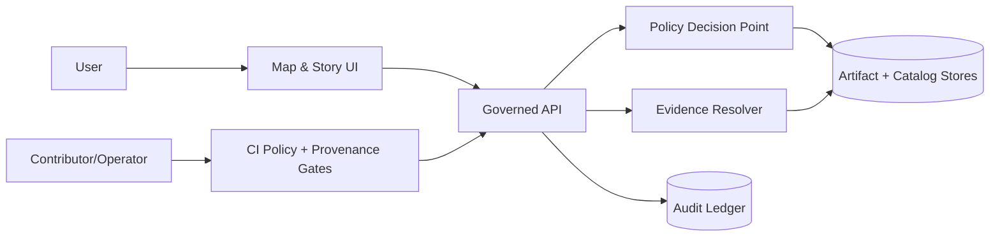

<!-- [KFM_META_BLOCK_V2]
doc_id: kfm://doc/7d7a9c1e-8a22-4c26-89c2-2a6c7b0a6a6d
title: SECURITY
type: standard
version: v2
status: draft
owners: KFM Security & Governance Stewards (TBD)
created: 2026-02-26
updated: 2026-02-27
policy_label: public
related:
  - kfm://doc/kfm-gdg-vnext-2026-02-20
  - ./README.md
  - ./.github/README.md
  - ./CONTRIBUTING.md
tags: [kfm, security, governance, policy-as-code]
notes:
  - Draft SECURITY.md aligned to governance-first, default-deny KFM posture.
  - Replace TODO contact + encryption fields before publishing.
  - Adds explicit threat-model invariants and “security gates” mapping to CI/rulesets.
[/KFM_META_BLOCK_V2] -->

<a id="top"></a>

# Kansas Frontier Matrix (KFM) — Security Policy


> **TL;DR:** In KFM, **security is governance**: policy labels, default‑deny, evidence resolution, and auditability are enforced in CI and at runtime.  
> If a control is uncertain, KFM **fails closed**.

---

## Quick navigation

- [Supported versions](#supported-versions)
- [Reporting a vulnerability](#reporting-a-vulnerability)
- [What counts as a security issue](#what-counts-as-a-security-issue)
- [Security objectives](#security-objectives)
- [KFM security model](#kfm-security-model)
- [Threat-model invariants](#threat-model-invariants)
- [Data sensitivity and privacy](#data-sensitivity-and-privacy)
- [Authentication and authorization](#authentication-and-authorization)
- [Secrets and credentials](#secrets-and-credentials)
- [Supply chain integrity](#supply-chain-integrity)
- [Audit logs and run receipts](#audit-logs-and-run-receipts)
- [Security testing and required gates](#security-testing-and-required-gates)
- [Incident response](#incident-response)
- [Coordinated disclosure](#coordinated-disclosure)
- [References](#references)

---

## Supported versions

> [!NOTE]
> Release/support policy is **TBD**. Until a formal policy exists, treat:
> - the default branch (often `main`) **and**
> - the latest release tag (if releases exist)
> as the only supported versions for security fixes.

| Version / branch | Supported | Notes |
|---|---:|---|
| Default branch (e.g., `main`) | ✅ | Active development line |
| Latest release tag | ✅ | Fixes SHOULD be backported here when feasible |
| Older tags/releases | ❌ | Upgrade to latest |

> [!PROPOSED]
> Once releases exist, define an explicit window (e.g., N-1 releases or a time window) and publish it here.

[Back to top](#top)

---

## Reporting a vulnerability

**Please do not open public issues for security reports.**

Preferred reporting paths (in order):

1) **GitHub private vulnerability reporting** *(if enabled for this repo)*  
   Repository **Security** tab → **Report a vulnerability**

2) **Private email to the security contact**
   - **Primary:** `TODO: security-contact@example.org`
   - **Backup:** `TODO: maintainer-contact@example.org`

3) **If neither is available:** open a GitHub issue **without details** and request a private channel.  
   (Do not include exploit payloads, sensitive coordinates, or PII.)

### Encryption (recommended)

> [!PROPOSED]
> Publish one of the following before moving this document to `published`:
> - a PGP public key fingerprint, or
> - an org-standard secure intake process (ticketing portal) that supports attachments safely.

- **PGP key:** `TODO`
- **Key fingerprint:** `TODO`

### What to include

- Clear description of the issue and **potential impact**
- Minimal reproduction steps (or proof-of-concept)
- Affected component(s): API, pipeline, UI, policy bundle, evidence resolver, catalogs, exports, CI gates
- Whether the issue involves **restricted data exposure**, **sensitive locations**, or **PII**
- If available: request IDs, run IDs, dataset_version_id, artifact digests (policy-safe identifiers)

### Data exposure reports (special handling)

If you believe you found any of the following, treat it as a **security incident**:

- `restricted` / `restricted_sensitive_location` data exposure
- PII or reidentifiable records
- “policy bypass” behavior (e.g., access without appropriate policy checks)
- export controls bypass (downloaded content that should be blocked)
- error-message leakage that reveals restricted dataset existence

> [!WARNING]
> Do **not** attach bulk data, precise coordinates, or personal information in the report.
> Prefer:
> - redacted screenshots
> - hashes/IDs (dataset_version_id, run_id, artifact digests)
> - minimal request/response metadata

### What you can expect (targets)

- Acknowledgement: **within 3 business days** *(target; may vary)*
- Triage + severity assignment: **within 10 business days** *(target; may vary)*
- Fix and advisory: coordinated with reporter, depending on impact and release cadence

> [!NOTE]
> KFM may ship a fail-closed mitigation (e.g., deny access or suppress exports) before a full fix.

[Back to top](#top)

---

## What counts as a security issue

KFM security issues include (non-exhaustive):

### Access control / policy enforcement
- **Policy bypass:** gaining access to data/evidence without satisfying policy checks
- **Cross-role leakage:** public user receives restricted content due to caching, routing, or index leakage
- **Policy-safe errors violated:** users can infer restricted dataset existence via error differences

### Sensitive location & privacy
- **Sensitive-location leakage:** exposing precise coordinates/geometries that must remain restricted
- **PII leakage:** exposing individual-level records or enabling reidentification
- **Unsafe aggregation:** releasing aggregates below minimum-count thresholds

### Evidence, catalogs, and provenance integrity
- **EvidenceRef tampering:** citations resolve to incorrect evidence (mismatched digest / wrong dataset_version_id)
- **Catalog/link integrity failure:** DCAT/STAC/PROV cross-links are wrong or point to non-canonical artifacts
- **Receipt/audit spoofing:** run receipts or audit entries can be deleted/rewritten/spoofed

### Supply chain & secrets
- **Secret leakage:** committing credentials/tokens/keys to the repo or logs
- **Supply chain compromise:** tampered dependencies, unverified build artifacts, missing attestations
- **Dependency confusion / typosquatting** risks in build pipelines

### Focus Mode & retrieval security
- **Prompt-injection leading to policy bypass** (retrieved content causes unauthorized tool use or leakage)
- **Cite-or-abstain failure:** Focus returns claims without resolvable citations for the requester’s role
- **Restricted evidence in “reasoning context”** that later leaks into output

[Back to top](#top)

---

## Security objectives

KFM’s security posture is defined by these objectives:

1. **Confidentiality:** restricted datasets, sensitive locations, and PII do not leak.
2. **Integrity:** DatasetVersions, catalogs, receipts, and evidence bundles are tamper-evident and consistent by digest.
3. **Availability (governed):** the system remains usable without relaxing policy gates.
4. **Non-repudiation / auditability:** governed actions emit receipts and audit references that can be reviewed.
5. **Least privilege:** operators, pipelines, and runtime services have only the access they need.

[Back to top](#top)

---

## KFM security model

### Trust membrane (conceptual)



**Key points**
- Policy decisions are enforced at **runtime** (API + evidence resolver) and in **CI** (policy/provenance gates).
- The UI may display policy status, but **does not make policy decisions**.
- Canonical truth is **processed artifacts + catalogs + receipts + audit**, not projections.

### Policy-as-code (concept)

KFM uses a policy bundle (OPA/Rego or equivalent) as shared semantics across:
- CI merge gates
- runtime API enforcement
- evidence resolution enforcement
- export controls

Example (illustrative only):

```rego
package kfm.authz

default allow = false

allow {
  input.user.role == "steward"
}

allow {
  input.user.role == "public"
  input.action == "read"
  input.resource.policy_label == "public"
}

# Obligations example: UI notice for generalized geometry
obligations[o] {
  input.resource.policy_label == "public_generalized"
  o := {"type": "show_notice", "message": "Geometry generalized due to policy."}
}
```

> [!IMPORTANT]
> A policy engine error must fail closed (deny) and produce a policy-safe error message.

[Back to top](#top)

---

## Threat-model invariants

These invariants must remain true. If any becomes uncertain, fail closed and escalate.

| ID | Invariant | MUST be true |
|---:|---|---|
| TM-001 | No direct client-to-storage/DB | UI/clients access data only via governed APIs |
| TM-002 | Policy-safe errors | Public users cannot infer restricted dataset existence by 403/404 differences |
| TM-003 | Export controls enforced | Downloads/exports checked against policy labels + rights |
| TM-004 | Prompt-injection defenses | Retrieved text cannot override policy, tools, or disclosure rules |
| TM-005 | Cite-or-abstain hard gate | Focus Mode returns only claims supported by resolvable citations |
| TM-006 | Restricted leakage scanning | Outputs are scanned for restricted patterns when required |
| TM-007 | Least-privileged credentials | Pipeline/runtime credentials are scoped, rotated, and non-reusable |
| TM-008 | Immutability by digest | Processed artifacts + catalogs for a DatasetVersion are immutable by digest |
| TM-009 | Supply-chain provenance | Builds have pinned inputs and (when enabled) attestations |
| TM-010 | Append-only audit ledger | Audit records cannot be rewritten; access-controlled |
| TM-011 | Audit redaction | Audit logs do not leak restricted data/PII |

[Back to top](#top)

---

## Data sensitivity and privacy

### Policy labels

KFM uses policy labels to drive access decisions and redaction/generalization obligations.

Starter labels (extend as needed):
- `public`
- `public_generalized`
- `internal`
- `restricted`
- `restricted_sensitive_location`
- `embargoed`
- `quarantine`

### Default-deny expectations

- If a dataset is `restricted` or `restricted_sensitive_location`, access is **deny by default**.
- If a public representation is permitted, create a **separate** `public_generalized` derivative.
- Error responses must not leak restricted metadata (including “does this exist?” signals).

### Sensitive location protection

For culturally sensitive or at-risk locations:
- Store **precise** geometry only in restricted datasets.
- Publish only generalized derivatives, or metadata-only records.
- Enforce policy at the serving layer (no bypass via static tile hosting or public object URLs).
- Include automated tests (e.g., “no restricted bbox leakage”, “no coordinate fields in public exports”).

### PII risk and aggregation thresholds

Some sources have reidentification risk (property, health, crime, etc.).
- Do not publish individual-level records publicly.
- Aggregate to safe geographies and enforce minimum-count thresholds.
- Document thresholds as policy obligations.
- Keep raw data restricted even when aggregated outputs are public.

[Back to top](#top)

---

## Authentication and authorization

> [!IMPORTANT]
> **DECISION NEEDED:** choose identity provider and access model.

Recommended baseline:
- OIDC for authentication
- RBAC + policy labels for authorization
- Add ABAC only when required for partner data

### Authorization boundary model

- **PDP (Policy Decision Point):** evaluates allow/deny + obligations
- **PEP (Policy Enforcement Point):** enforces PDP decision (API/evidence resolver/export service)
- **Obligation application:** transforms outputs or UI responses (generalize geometry, suppress export, show notice)

> [!NOTE]
> Cache policy-sensitive responses carefully (vary by auth/role). Tile caches must not leak restricted views.

[Back to top](#top)

---

## Secrets and credentials

- Never store secrets in the repository.
- Do not print secrets in logs (CI or runtime).
- Use a secrets manager for production credentials.
- Use **scoped** credentials per source integration / pipeline runner.
- Rotate secrets regularly and record rotation events in audit logs (policy-safe).

Recommended controls:
- secret scanning + push protection (if available)
- CI checks that fail if common secret patterns are detected
- least-privilege IAM for object storage, DB, and message queues

[Back to top](#top)

---

## Supply chain integrity

Recommended before broad public release:

- Pin dependencies and verify checksums where possible
- Generate SBOMs (SPDX) for build artifacts
- Generate build provenance attestations (SLSA/in-toto)
- Verify attestations server-side (or in the release lane)
- Pin container images by digest (no `:latest`)

> [!PROPOSED]
> Adopt keyless signing via OIDC-based identity for releases (organization policy permitting).  
> If attestations are required, the release lane should **block** when missing.

[Back to top](#top)

---

## Audit logs and run receipts

Audit logs and run receipts may contain sensitive operational details.

Minimum protections:
- Append-only storage
- Redaction for PII and restricted information
- Access restricted to authorized stewards/operators
- Defined retention policy (TBD) and deletion policy (TBD)

### Receipts as security artifacts

Run receipts should be treated as security-critical because they prove:
- which inputs produced which outputs
- which policy decisions and obligations were applied
- which environment and container digest executed the run

> [!IMPORTANT]
> If receipts are missing, incomplete, or unverifiable, treat the associated outputs as **not promotable**.

[Back to top](#top)

---

## Security testing and required gates

Security-related checks should be treated as **merge-required gates** (fail closed).

### CI security gate categories (recommended)

- **Policy tests:** fixtures-driven allow/deny/obligation outcomes
- **Schema/profile validation:** strict validation of DCAT/STAC/PROV and internal schemas
- **Contract tests:** OpenAPI / DTO compatibility checks
- **Integration tests:** evidence resolver resolves sample refs without policy bypass
- **E2E tests:** UI shows policy notices; citations resolve through the evidence resolver
- **Secret scanning:** fail if secrets are detected (or substitute)
- **Dependency review:** fail on risky dependency diffs (or substitute)

### Anti-skip requirement

> [!WARNING]
> A required security gate must not be skippable via `paths:` filters, `if:` conditions, or job fanout.
> Prefer a single always-runs gate-summary job marked as required in rulesets/branch protection.

See: `.github/README.md` for the governance-side “trust membrane” index (if present).

[Back to top](#top)

---

## Incident response

> [!NOTE]
> This is a minimal policy. Full incident runbooks should live in `docs/runbooks/` (if present).

### Severity (recommended levels)

- **SEV-1:** confirmed restricted/PII/sensitive-location exposure; active exploitation; policy bypass at runtime
- **SEV-2:** high-impact vulnerability with plausible exploitation; supply-chain integrity break
- **SEV-3:** moderate issues; defense-in-depth gaps; misconfigurations with limited impact
- **SEV-4:** low-impact issues; hardening tasks

### Immediate actions for suspected data exposure

1. **Contain:** disable exports / deny affected endpoints / revoke credentials as needed (fail closed).
2. **Preserve evidence:** record request IDs, run IDs, dataset_version_id, digests (avoid copying data).
3. **Assess scope:** identify affected roles, datasets, and time window.
4. **Remediate:** patch + add tests/gates; rebuild projections if needed.
5. **Notify:** coordinate with governance stewards for disclosure obligations.

[Back to top](#top)

---

## Coordinated disclosure

We aim to follow coordinated disclosure:
- Report privately
- Allow maintainers reasonable time to investigate and patch
- Public disclosure should be coordinated once fixes are available

> [!PROPOSED SAFE HARBOR — PENDING LEGAL REVIEW]
> We welcome good-faith security research that avoids:
> - privacy violations or exfiltration of restricted data,
> - social engineering,
> - physical disruption,
> - denial-of-service testing against shared infrastructure,
> - publishing exploit details before a fix is available.

[Back to top](#top)

---

## References

- Kansas Frontier Matrix (KFM) — Definitive Design & Governance Guide (vNext), 2026-02-20
- Repo root `README.md` (trust membrane + Promotion Contract)
- `.github/README.md` (required checks registry + CI gate index), if present

[Back to top](#top)
