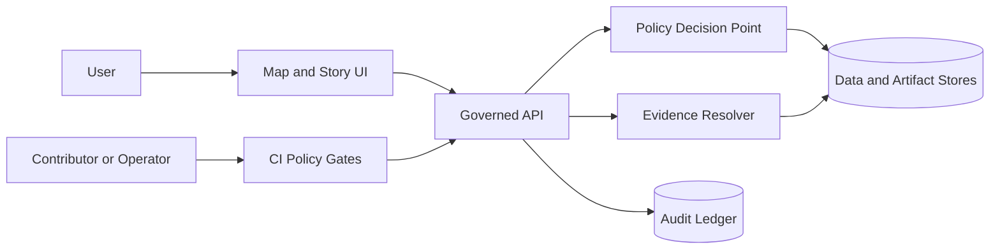

<!-- [KFM_META_BLOCK_V2]
doc_id: kfm://doc/7d7a9c1e-8a22-4c26-89c2-2a6c7b0a6a6d
title: SECURITY
type: standard
version: v1
status: draft
owners: KFM Security & Governance Stewards (TBD)
created: 2026-02-26
updated: 2026-02-26
policy_label: public
related:
  - kfm://doc/kfm-gdg-vnext-2026-02-20
tags: [kfm, security, governance, policy-as-code]
notes:
  - Draft SECURITY.md aligned to governance-first, default-deny KFM posture.
  - Replace TODO contact + support-policy fields before publishing.
[/KFM_META_BLOCK_V2] -->

# Kansas Frontier Matrix (KFM) — Security Policy


> **TL;DR:** For KFM, **security is governance**: policy labels, default‑deny, and auditability are enforced in CI and at runtime.

## Quick navigation
- [Supported versions](#supported-versions)
- [Reporting a vulnerability](#reporting-a-vulnerability)
- [What counts as a security issue](#what-counts-as-a-security-issue)
- [KFM security model](#kfm-security-model)
- [Data sensitivity and privacy](#data-sensitivity-and-privacy)
- [Authentication and authorization](#authentication-and-authorization)
- [Secrets and credentials](#secrets-and-credentials)
- [Supply chain integrity](#supply-chain-integrity)
- [Audit logs](#audit-logs)
- [Security testing](#security-testing)
- [Coordinated disclosure](#coordinated-disclosure)
- [References](#references)

---

## Supported versions

> **NOTE:** This repository’s release/support policy is **TBD**. Until it is defined, treat **only `main` and the latest release** as supported.

| Version / branch | Supported | Notes |
|---|---:|---|
| `main` | ✅ | Active development branch |
| Latest release tag | ✅ | Security fixes apply here first (when releases exist) |
| Older tags/releases | ❌ | Upgrade to latest |

---

## Reporting a vulnerability

**Please do not open public issues for security reports.**

Preferred reporting paths (in order):

1) **GitHub private vulnerability reporting** (if enabled for this repo)  
   Repository **Security** tab → **Report a vulnerability**.

2) **Private email to the security contact**  
   - **Email:** `TODO: security-contact@example.org`  
   - **Backup:** `TODO: maintainer-contact@example.org`

### What to include

- A clear description of the issue and potential impact
- Minimal reproduction steps (or proof-of-concept)
- Affected component(s): API, pipeline, UI, policy bundle, evidence resolver, etc.
- Whether the issue involves **restricted data exposure**, **sensitive locations**, or **PII**

### Data exposure reports (special handling)

If you believe you found any of the following, treat it as a **security incident**:

- `restricted` / `restricted_sensitive_location` data exposure
- PII or reidentifiable records
- “policy bypass” behavior (e.g., access without appropriate policy checks)

**Do not** attach bulk data, precise coordinates, or personal information in the report. Prefer:
- redacted screenshots
- hashes/IDs (dataset_version_id, run_id, artifact digests)
- minimal request/response metadata

### What you can expect (targets)

- Acknowledgement: **within 3 business days** *(target; may vary)*
- Triage + severity assignment: **within 10 business days** *(target; may vary)*
- Fix and advisory: coordinated with reporter, depending on impact and release cadence

---

## What counts as a security issue

KFM security issues include (non-exhaustive):

- **Policy bypass:** gaining access to data/evidence without satisfying policy checks
- **Sensitive-location leakage:** exposing precise coordinates/geometries that must remain restricted
- **PII leakage:** exposing individual-level records or enabling reidentification
- **Rights/licensing bypass:** distributing media/artifacts without enforced rights metadata
- **Secret leakage:** committing credentials/tokens/keys to the repo or logs
- **Supply chain compromise:** tampered dependencies, unverified build artifacts, missing attestations
- **Auditability break:** disabling, deleting, or spoofing run receipts / audit entries

---

## KFM security model

### Trust membrane (conceptual)



**Key invariants**
- Policy decisions are enforced at **runtime** (API + evidence resolver) and in **CI** (policy gates).
- The UI may display policy status, but **does not make policy decisions**.

### Policy-as-code

KFM uses a policy bundle (OPA/Rego or equivalent) as a shared source of truth across:
- CI merge gates
- runtime API enforcement
- evidence resolution enforcement

Example (illustrative) pattern:

```rego
package kfm.authz

default allow = false

allow {
  input.user.role == "steward"
}

allow {
  input.user.role == "public"
  input.action == "read"
  input.resource.policy_label == "public"
}

# Obligations example: UI notice for generalized geometry
obligations[o] {
  input.resource.policy_label == "public_generalized"
  o := {"type": "show_notice", "message": "Geometry generalized due to policy."}
}
```

---

## Data sensitivity and privacy

### Policy labels

KFM uses policy labels to drive access decisions and redaction/generalization obligations.

Starter labels (extend as needed):
- `public`
- `public_generalized`
- `internal`
- `restricted`
- `restricted_sensitive_location`
- `embargoed`
- `quarantine`

### Default-deny expectations

- If a dataset is `restricted` or `restricted_sensitive_location`, access is **deny by default**.
- If a public representation is permitted, create a **separate** `public_generalized` derivative.
- Error responses must not leak restricted metadata (including “does this exist?” signals).

### Sensitive location protection

For culturally sensitive or at-risk locations:
- Store **precise** geometry only in restricted datasets.
- Publish only generalized derivatives, or metadata-only records.
- Enforce policy at the serving layer (no bypass via static tile hosting).
- Include automated tests (e.g., “no restricted bbox leakage”, “no coordinate fields in public exports”).

### PII risk and aggregation thresholds

Some sources have reidentification risk (e.g., property, health, crime).
- Do not publish individual-level records publicly.
- Aggregate to safe geographies and enforce minimum-count thresholds.
- Document thresholds as policy obligations.
- Keep raw data restricted even when aggregated outputs are public.

---

## Authentication and authorization

**DECISION NEEDED:** choose identity provider and access model.

Recommended baseline:
- OIDC for authentication
- RBAC + policy labels for authorization
- Add ABAC only when required for partner data

---

## Secrets and credentials

- Never store secrets in the repository.
- Use a secrets manager for production credentials.
- Use scoped credentials per source integration / pipeline runner.
- Rotate secrets regularly and record rotation events in audit logs.

---

## Supply chain integrity

Recommended before broad public release:
- Generate SBOMs (SPDX) for build artifacts
- Generate build provenance attestations (SLSA/in-toto)
- Verify attestations server-side
- Pin dependencies and verify checksums

---

## Audit logs

Audit logs and run receipts may contain sensitive operational details.

Minimum protections:
- Append-only storage
- Redaction for PII and restricted information
- Access restricted to authorized stewards/operators
- Defined retention and deletion policies

---

## Security testing

Security-related checks should be treated as **required gates**:

- Policy tests: fixture-driven allow/deny/obligation outcomes
- Schema tests: strict validation of DCAT/STAC/PROV profiles
- Contract tests: OpenAPI / DTO compatibility checks
- Integration tests: evidence resolver resolves sample refs without policy bypass
- E2E tests: UI shows policy notices; citations resolve through the evidence resolver

---

## Coordinated disclosure

We aim to follow coordinated disclosure:
- Report privately
- Allow maintainers reasonable time to investigate and patch
- Public disclosure should be coordinated once fixes are available

> **Proposed safe harbor (pending legal review):** We welcome good-faith security research that avoids privacy violations, data exfiltration, social engineering, or service disruption.

---

## References

- Kansas Frontier Matrix (KFM) — Definitive Design & Governance Guide (vNext), 2026-02-20