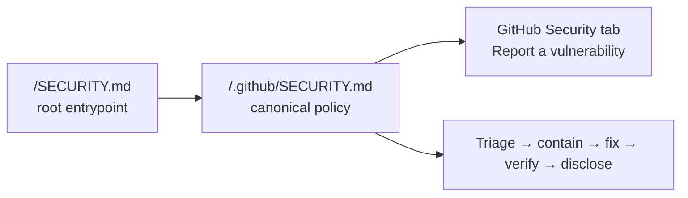

<!-- [KFM_META_BLOCK_V2]
doc_id: kfm://doc/REVIEW-REQUIRED-UUID
title: SECURITY
type: standard
version: v1
status: review
owners: @bartytime4life
created: [SET-ON-COMMIT]
updated: [SET-ON-COMMIT]
policy_label: public
related: [/README.md, /CONTRIBUTING.md, /.github/README.md, /.github/CODEOWNERS, /.github/PULL_REQUEST_TEMPLATE.md, /.github/SECURITY.md, /.github/workflows/README.md, /policy/README.md, /contracts/README.md, /schemas/README.md, /tests/README.md, /tools/README.md, /scripts/README.md]
tags: [kfm, security, vulnerability-disclosure, trust-membrane, governed-delivery]
notes: [Root entrypoint delegates to /.github/SECURITY.md to avoid current two-path drift. Commit-time fill still required for doc_id and created/updated dates.]
[/KFM_META_BLOCK_V2] -->

# SECURITY

Root-level security entrypoint for private vulnerability reporting and canonical handoff to `/.github/SECURITY.md`.


| Field | Value |
| --- | --- |
| **Status** | `experimental` |
| **Owners** | `@bartytime4life` |
| **Path** | `/SECURITY.md` |
| **Canonical disclosure path** | `/.github/SECURITY.md` |
| **Preferred private lane** | `GitHub Security → Report a vulnerability` |
| **Quick jumps** | [Scope](#scope) · [Repo fit](#repo-fit) · [Current public signals](#current-public-signals) · [Accepted inputs](#accepted-inputs) · [Exclusions](#exclusions) · [Report a vulnerability](#report-a-vulnerability) · [Canonical policy](#canonical-policy) · [Appendix](#appendix) |

> [!IMPORTANT]
> Current public `main` exposes both `/SECURITY.md` and `/.github/SECURITY.md`. Keep `/.github/SECURITY.md` authoritative, and keep this root file delegating or text-aligned so disclosure instructions do not drift.

## Scope

This file is KFM’s repo-root security entrypoint. Use it to find the preferred private reporting lane quickly and to route into the canonical repository policy without duplicating the full disclosure playbook.

KFM security is broader than classic application hardening. It includes failures that weaken the trust membrane, bypass policy or evidence resolution, expose restricted or sensitive material, or make a consequential claim appear more trustworthy than its evidence, review state, or release state supports.

## Repo fit

| Item | Value |
| --- | --- |
| **Path** | `/SECURITY.md` |
| **Role** | Root-level public security entrypoint and canonical handoff surface |
| **Upstream links** | [README.md](README.md) · [CONTRIBUTING.md](CONTRIBUTING.md) · [.github/README.md](.github/README.md) · [.github/CODEOWNERS](.github/CODEOWNERS) · [.github/PULL_REQUEST_TEMPLATE.md](.github/PULL_REQUEST_TEMPLATE.md) |
| **Downstream links** | [.github/SECURITY.md](.github/SECURITY.md) · [.github/workflows/README.md](.github/workflows/README.md) · [policy/README.md](policy/README.md) · [contracts/README.md](contracts/README.md) · [schemas/README.md](schemas/README.md) · [tests/README.md](tests/README.md) · [tools/README.md](tools/README.md) · [scripts/README.md](scripts/README.md) |
| **Accepted inputs** | Private vulnerability reports, trust-surface failures, policy or release-integrity failures, unsafe runtime exposure, disclosure-coordination requests |
| **Exclusions** | Feature requests, ordinary support, routine non-security corrections, public exploit drops, unrelated third-party systems, unauthorized destructive testing |

## Current public signals

| Signal | Status | Why it matters |
| --- | --- | --- |
| `/.github/SECURITY.md` exists | **CONFIRMED** | The canonical repository security policy already has a checked-in home. |
| The public Security tab shows **Report a vulnerability** | **CONFIRMED** | GitHub-native private reporting is the preferred lane. |
| Both `/SECURITY.md` and `/.github/SECURITY.md` exist | **CONFIRMED** | Root and gatehouse policy paths must stay aligned or drift will confuse reporters. |
| `.github/CODEOWNERS` gives global fallback and `/.github/` coverage to `@bartytime4life` | **CONFIRMED** | Public owner coverage exists, but it is broad and single-owner. |
| `.github/workflows/` is README-only on public `main` | **CONFIRMED** | Do not overclaim checked-in workflow YAMLs, required checks, or platform-side enforcement from repo prose alone. |
| GitHub Releases has no currently visible releases | **CONFIRMED** | Do not infer a precise supported-version matrix from Releases alone. |

> [!NOTE]
> Platform state is not the same thing as repo state. Checked-in Markdown can describe intended disclosure posture, but it does not by itself prove current rulesets, required checks, environment approvals, fallback inboxes, or other platform-only settings.

## Accepted inputs

Use this entrypoint for private reports involving the following categories.

| In scope | Examples |
| --- | --- |
| **Access-control or boundary failure** | auth bypass, privilege escalation, direct client → canonical-store access, direct client → model-runtime access, steward-surface privilege bleed |
| **Evidence or citation failure** | broken evidence resolution, consequential uncited output, stale or unsupported claims presented as current |
| **Policy or release-integrity failure** | missing proof objects, broken promotion gate, unsigned or unattested release artifacts, review-state drift |
| **Supply-chain or automation failure** | credential leaks, over-permissioned automation, review-bypass workflow logic, missing attestations |
| **Runtime exposure or unsafe serving** | public exposure of local model runtime, canonical-store exposure, unsafe service defaults |
| **Rights, sensitivity, or stewardship leakage** | exact-location exposure, unsafe redaction, unresolved rights posture, unsafe archival or ecological disclosure |
| **Security-affecting documentation failure** | broken private reporting instructions, misleading contributor guidance, unsafe public examples |

## Exclusions

| Exclusion | Route instead |
| --- | --- |
| Feature requests, product ideas, or normal UX feedback | [CONTRIBUTING.md](CONTRIBUTING.md) or normal issue flow |
| Ordinary data or content corrections without confidentiality, integrity, policy, or release impact | Normal correction or review workflow |
| Canonical policy rule bodies, schemas, or test fixtures | [policy/README.md](policy/README.md), [contracts/README.md](contracts/README.md), or [schemas/README.md](schemas/README.md) |
| Environment-specific incident commands or internal operator recovery steps | Internal runbooks and ops documentation |
| Public proof-of-concept disclosure before coordination | Private reporting lane only |
| Social engineering, retaliatory access, counterattack, or hackback | Prohibited |
| Unrelated third-party systems | Out of scope unless KFM-controlled configuration or handling created the issue |

## Report a vulnerability

1. Open the repository **Security** tab and select **Report a vulnerability**.
2. Include the affected surface, impact, reproduction steps, the smallest safe proof of concept, and any logs, screenshots, digests, or receipts needed to verify the issue.
3. Keep undisclosed findings out of public issues, pull requests, discussions, and code review comments.

| Lane | When to use | Current public status |
| --- | --- | --- |
| **GitHub Security → Report a vulnerability** | Preferred GitHub-native private intake for this repository | **CONFIRMED available** |
| **Published confidential fallback** | Use only if maintainers later publish a monitored non-GitHub confidential lane | **NEEDS VERIFICATION** |
| **Public issue / discussion / pull request** | Never for undisclosed security findings | **Do not use** |

> [!WARNING]
> Do not publish a fallback inbox, acknowledgement SLA, disclosure window, public key, or bug-bounty claim here unless it is real, monitored, and maintained.

## Canonical disclosure map


```mermaid
flowchart LR
    A["/SECURITY.md<br>root entrypoint"] --> B["/.github/SECURITY.md<br>canonical policy"]
    B --> C["GitHub Security tab<br>Report a vulnerability"]
    B --> D["Triage → contain → fix → verify → disclose"]
```

## Canonical policy

The full repository policy lives in [`.github/SECURITY.md`](.github/SECURITY.md).

Use that file for:

- supported scope and release posture
- longer-form safe-harbor and out-of-scope testing guidance
- coordinated disclosure flow
- security-affecting change checklist
- publication-ready verification backlog

If this root file and [`.github/SECURITY.md`](.github/SECURITY.md) ever diverge, treat [`.github/SECURITY.md`](.github/SECURITY.md) as authoritative until alignment is restored.

## Appendix

<details>
<summary>Private report template</summary>

```text
Subject: [KFM SECURITY] short title

Affected surface:
Environment/profile:
Impact:
Category:
Reproduction steps:
Minimal proof of concept:
Expected safe behavior:
Observed behavior:
Sensitive data touched (if any):
Suggested mitigation or containment:
Disclosure constraints or timing concerns:
Contact preference:
```

</details>

<details>
<summary>Maintainer alignment checklist</summary>

- confirm whether any non-GitHub confidential fallback lane actually exists
- publish acknowledgement and status-update windows only if maintainers intend to honor them
- decide whether `/SECURITY.md` remains a short delegator or a text-aligned mirror
- publish an explicit support window if support is narrower than current `main`
- verify bug-bounty status before mentioning any reward program
- verify rulesets, branch protection, required checks, and workflow claims against live GitHub settings before documenting them

</details>

[Back to top](#security)