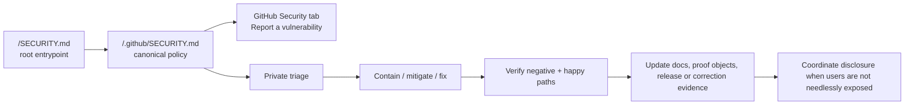

<!-- [KFM_META_BLOCK_V2]
doc_id: kfm://doc/REVIEW-REQUIRED-UUID
title: SECURITY
type: standard
version: v1
status: review
owners: @bartytime4life
created: [SET-ON-COMMIT]
updated: [SET-ON-COMMIT]
policy_label: public
related: [/README.md, /CONTRIBUTING.md, /.github/README.md, /.github/CODEOWNERS, /.github/PULL_REQUEST_TEMPLATE.md, /.github/SECURITY.md, /.github/workflows/README.md, /policy/README.md, /contracts/README.md, /schemas/README.md, /tests/README.md, /tools/README.md, /scripts/README.md]
tags: [kfm, security, vulnerability-disclosure, trust-membrane, governed-delivery]
notes: [Root entrypoint delegates to /.github/SECURITY.md to avoid current two-path drift. Commit-time fill still required for doc_id and created/updated dates.]
[/KFM_META_BLOCK_V2] -->

<a id="top"></a>

# SECURITY

Root-level security entrypoint for private vulnerability reporting and canonical handoff to [`/.github/SECURITY.md`](.github/SECURITY.md).


| Field | Value |
| --- | --- |
| **Status** | `experimental` |
| **Document state** | `review` |
| **Owners** | `@bartytime4life` |
| **Path** | `/SECURITY.md` |
| **Canonical disclosure policy** | [`/.github/SECURITY.md`](.github/SECURITY.md) |
| **Preferred private lane** | GitHub **Security → Report a vulnerability** |
| **Quick jumps** | [Scope](#scope) · [Repo fit](#repo-fit) · [Current public signals](#current-public-signals) · [Accepted inputs](#accepted-inputs) · [Exclusions](#exclusions) · [Report a vulnerability](#report-a-vulnerability) · [Canonical policy](#canonical-policy) · [Maintainer drift guard](#maintainer-drift-guard) · [Appendix](#appendix) |

> [!IMPORTANT]
> This root file is a **handoff surface**, not a second full policy. Keep [`/.github/SECURITY.md`](.github/SECURITY.md) authoritative so reporting instructions, support posture, safe-harbor language, and disclosure expectations do not drift across two public paths.

---

## Scope

Use this file to find the private reporting lane quickly, understand what KFM treats as security-relevant, and route into the canonical GitHub-facing security policy.

KFM security is broader than classic application hardening. It includes failures that weaken the **trust membrane**, bypass policy or evidence resolution, expose restricted or sensitive material, or make a consequential claim appear more trustworthy than its evidence, review state, or release state supports.

This root entrypoint is intentionally compact. The longer-form policy, safe-handling guidance, coordinated disclosure flow, support posture, and security-affecting change checklist belong in [`/.github/SECURITY.md`](.github/SECURITY.md).

[Back to top](#top)

---

## Repo fit

| Item | Value |
| --- | --- |
| **Path** | `/SECURITY.md` |
| **Role** | Root-level public security entrypoint and canonical handoff surface |
| **Audience** | Researchers, reporters, contributors, maintainers, reviewers, and stewards |
| **Upstream context** | [`README.md`](README.md) · [`CONTRIBUTING.md`](CONTRIBUTING.md) · [`.github/README.md`](.github/README.md) · [`.github/CODEOWNERS`](.github/CODEOWNERS) · [`.github/PULL_REQUEST_TEMPLATE.md`](.github/PULL_REQUEST_TEMPLATE.md) |
| **Canonical downstream policy** | [`.github/SECURITY.md`](.github/SECURITY.md) |
| **Related verification surfaces** | [`.github/workflows/README.md`](.github/workflows/README.md) · [`policy/README.md`](policy/README.md) · [`contracts/README.md`](contracts/README.md) · [`schemas/README.md`](schemas/README.md) · [`tests/README.md`](tests/README.md) · [`tools/README.md`](tools/README.md) · [`scripts/README.md`](scripts/README.md) |
| **Accepted here** | Private vulnerability reports, trust-surface failures, policy or release-integrity failures, unsafe runtime exposure, disclosure-coordination requests |
| **Not accepted here** | Feature requests, routine support, ordinary non-security corrections, public exploit drops, unrelated third-party systems, unauthorized destructive testing |

> [!NOTE]
> Platform state is not the same thing as repo state. Checked-in Markdown can describe intended disclosure posture, but it does **not** prove branch protection, required checks, environment approvals, fallback inboxes, security advisory settings, rulesets, or other platform-only controls.

[Back to top](#top)

---

## Current public signals

| Signal | Status | Why it matters |
| --- | --- | --- |
| GitHub Security exposes **Report a vulnerability** | **CONFIRMED** | GitHub-native private intake is the preferred reporting lane. |
| `/.github/SECURITY.md` exists and is rendered as the repository policy | **CONFIRMED** | The canonical disclosure policy already has a checked-in GitHub-facing home. |
| `/SECURITY.md` exists as a root entrypoint | **CONFIRMED** | Root and gatehouse policy paths must stay aligned. |
| `.github/CODEOWNERS` gives global fallback and `/.github/` coverage to `@bartytime4life` | **CONFIRMED** | Public owner coverage exists, but it is broad and single-owner. |
| `.github/workflows/` is documented as README-first on public `main` | **CONFIRMED** | Do not overclaim checked-in workflow YAMLs, required checks, or platform-side enforcement from repo prose alone. |
| GitHub Releases currently shows no releases | **CONFIRMED** | Do not infer a precise supported-version matrix from Releases alone. |
| Non-GitHub confidential fallback lane | **NEEDS VERIFICATION** | Do not publish a fallback inbox, SLA, public key, or escalation alias until it is real and monitored. |

> [!WARNING]
> Keep undisclosed security findings out of public issues, pull requests, discussions, review comments, commit messages, screenshots, and public artifacts.

[Back to top](#top)

---

## Accepted inputs

Use the private reporting lane for security-affecting findings in these categories.

| In scope | Examples | KFM-specific reason |
| --- | --- | --- |
| **Access-control or boundary failure** | auth bypass, privilege escalation, direct client → canonical-store access, direct client → model-runtime access, steward-surface privilege bleed | Weakens the trust membrane and least-privilege boundary. |
| **Evidence or citation failure** | broken EvidenceRef resolution, consequential uncited output, policy-bypass retrieval, stale or unsupported claims presented as current | In KFM, trust failures can become security failures. |
| **Policy or release-integrity failure** | missing proof objects, broken promotion gate, unsigned or unattested release artifact, spec-hash drift, missing redaction/generalization, incorrect review state | Publication and promotion are governed trust-state transitions. |
| **Supply-chain, workflow, or automation failure** | credential leaks, over-permissioned automation, review-bypass workflow logic, unsafe token use, missing attestations | Automation is part of governed delivery, not background convenience. |
| **Runtime exposure or unsafe serving** | public exposure of a local model runtime, canonical-store exposure, insecure service defaults, ungoverned internal surface exposed externally | Runtime exposure can break confidentiality, integrity, evidence resolution, and auditability. |
| **Availability or correction-path failure** | denial-of-service, rollback gap, correction failure, stale-without-warning behavior, release that cannot be withdrawn cleanly | KFM must preserve safe negative outcomes and recoverability. |
| **Rights, sensitivity, or stewardship leakage** | exact-location exposure, unsafe redaction, unresolved rights posture, unsafe archival, ecological, cultural, or heritage disclosure | Security includes stewardship and publication safety. |
| **Security-affecting documentation failure** | broken private reporting instructions, misleading contributor guidance, unsafe public examples, docs routing researchers into public exposure | Docs are part of KFM’s production trust surface. |

[Back to top](#top)

---

## Exclusions

| Exclusion | Route instead |
| --- | --- |
| Feature requests, product ideas, or normal UX feedback | [`CONTRIBUTING.md`](CONTRIBUTING.md) or normal issue flow |
| Ordinary data or content corrections without confidentiality, integrity, policy, release, or safety impact | Normal correction or review workflow |
| Canonical policy rule bodies, schemas, or test fixtures | [`policy/README.md`](policy/README.md), [`contracts/README.md`](contracts/README.md), or [`schemas/README.md`](schemas/README.md) |
| Environment-specific incident commands or internal operator recovery steps | Internal runbooks and ops documentation |
| Public proof-of-concept disclosure before coordination | Private reporting lane only |
| Social engineering, phishing, physical intrusion, retaliatory access, counterattack, or hackback | Prohibited |
| Unrelated third-party systems | Out of scope unless KFM-controlled configuration, exposure, or handling created the issue |
| Cosmetic documentation edits with no disclosure, trust, or safety consequence | Normal docs workflow |

[Back to top](#top)

---

## Report a vulnerability

1. Open the repository **Security** tab.
2. Select **Report a vulnerability**.
3. Submit the report privately.
4. Keep the finding out of public issues, pull requests, discussions, and code review until coordinated disclosure is appropriate.

| Lane | When to use | Current public status |
| --- | --- | --- |
| **GitHub Security → Report a vulnerability** | Preferred GitHub-native private intake for this repository | **CONFIRMED available** |
| **Published confidential fallback** | Use only if maintainers later publish a monitored non-GitHub confidential lane | **NEEDS VERIFICATION** |
| **Public issue / discussion / pull request** | Never for undisclosed security findings | **Do not use** |

A useful report includes:

- affected surface, path, workflow, route, or component
- clear impact statement
- reproduction steps
- smallest safe proof of concept
- expected safe behavior versus observed behavior
- whether the issue affects confidentiality, integrity, availability, policy enforcement, evidence linkage, release integrity, review state, correction behavior, or runtime trust
- logs, screenshots, digests, or receipts needed to reproduce the issue, with sensitive data minimized or redacted
- suggested mitigation, containment, rollback, redaction, correction, or withdrawal considerations
- disclosure constraints or timing concerns

> [!CAUTION]
> Do not publish a fallback inbox, acknowledgement target, status-update cadence, disclosure window, public key, or bug-bounty claim here unless it is real, monitored, and maintained.

[Back to top](#top)

---

## Canonical disclosure map


```mermaid
flowchart LR
    A["/SECURITY.md<br/>root entrypoint"] --> B["/.github/SECURITY.md<br/>canonical policy"]
    B --> C["GitHub Security tab<br/>Report a vulnerability"]
    B --> D["Private triage"]
    D --> E["Contain / mitigate / fix"]
    E --> F["Verify negative + happy paths"]
    F --> G["Update docs, proof objects, release or correction evidence"]
    G --> H["Coordinate disclosure when users are not needlessly exposed"]
```

[Back to top](#top)

---

## Canonical policy

The full repository security policy lives in [`.github/SECURITY.md`](.github/SECURITY.md).

Use that file for:

- supported scope and release posture
- private reporting details
- good-faith research and safe-harbor language
- out-of-scope and prohibited testing guidance
- triage, remediation, and coordinated disclosure flow
- security-affecting change checklist
- publication-ready verification backlog

If this root file and [`.github/SECURITY.md`](.github/SECURITY.md) ever diverge, treat [`.github/SECURITY.md`](.github/SECURITY.md) as authoritative until alignment is restored.

[Back to top](#top)

---

## Maintainer drift guard

Before merging security-documentation changes, verify the following against the active branch and live repository settings.

- [ ] `/.github/SECURITY.md` remains the canonical long-form policy.
- [ ] `/SECURITY.md` remains a short, aligned handoff surface.
- [ ] GitHub private vulnerability reporting is still enabled or the documented lane is corrected.
- [ ] Any fallback inbox, public key, acknowledgement target, disclosure window, or bounty language is real and maintained.
- [ ] Supported-version language is explicit if support is narrower than current `main`.
- [ ] Claims about workflow YAML, branch protection, required checks, rulesets, OIDC, environments, or advisory settings are verified from live settings or current checked-in files.
- [ ] Security-affecting docs changes update adjacent surfaces when needed: [`CONTRIBUTING.md`](CONTRIBUTING.md), [`.github/README.md`](.github/README.md), [`.github/PULL_REQUEST_TEMPLATE.md`](.github/PULL_REQUEST_TEMPLATE.md), and [`.github/SECURITY.md`](.github/SECURITY.md).

[Back to top](#top)

---

## Appendix

<details>
<summary>Private report template</summary>

```text
Subject: [KFM SECURITY] short title

Affected surface:
Environment/profile:
Impact:
Category:
Reproduction steps:
Minimal proof of concept:
Expected safe behavior:
Observed behavior:
Sensitive data touched (if any):
Suggested mitigation, containment, rollback, redaction, correction, or withdrawal:
Disclosure constraints or timing concerns:
Contact preference:
```

</details>

<details>
<summary>Root-versus-canonical policy split</summary>

| Surface | Purpose | Keep here? |
| --- | --- | --- |
| `/SECURITY.md` | Fast public entrypoint, private reporting lane, canonical handoff, drift guard | Yes |
| `/.github/SECURITY.md` | Full policy, scope, safe handling, disclosure flow, checklist, FAQ | Canonical home |
| Public issues / PRs / discussions | Normal non-security work only | Never for undisclosed findings |
| Internal runbooks | Operator commands, escalation details, environment-specific recovery | Not public root policy |
| `policy/`, `contracts/`, `schemas/`, `tests/` | Machine rules, contracts, fixtures, and verification | Link, do not duplicate |

</details>

<details>
<summary>Reviewer notes for future edits</summary>

- Preserve the `KFM_META_BLOCK_V2` wrapper exactly.
- Replace `REVIEW-REQUIRED-UUID` and `[SET-ON-COMMIT]` only during commit-time metadata finalization.
- Keep this root entrypoint shorter than `/.github/SECURITY.md`.
- Do not add operational secrets, private escalation paths, or unverified platform claims.
- Keep KFM-specific security scope visible: trust membrane, evidence resolution, policy gates, runtime exposure, release integrity, rights, sensitivity, and correction paths.

</details>

[Back to top](#top)