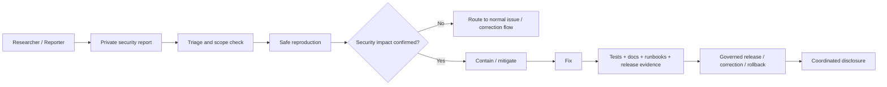

<!-- [KFM_META_BLOCK_V2]
doc_id: kfm://doc/<REVIEW-REQUIRED-UUID>
title: SECURITY
type: standard
version: v1
status: draft
owners: <REVIEW-REQUIRED>
created: <PRESERVE-IF-EXISTING-OR-SET-ON-COMMIT>
updated: 2026-03-14
policy_label: <REVIEW-REQUIRED>
related: [README.md, CONTRIBUTING.md, .github/CODEOWNERS, .github/README.md, .github/SECURITY.md]
tags: [kfm, security, vulnerability-disclosure, secure-development, governed-delivery]
notes: [Current-session workspace exposed PDF corpus only; exact repo path, owners, contact channel, release inventory, and GitHub advisory configuration need direct verification before commit.]
[/KFM_META_BLOCK_V2] -->

# SECURITY

Security reporting, disclosure, and hardening expectations for the Kansas Frontier Matrix (KFM).

| Field | Value |
| --- | --- |
| **Status** | draft |
| **Owners** | `<REVIEW-REQUIRED>` |
| **Badges** |     |
| **Quick jumps** | [Scope](#scope) · [Report a vulnerability](#report-a-vulnerability) · [Safe harbor](#good-faith-research-and-safe-harbor) · [Supported release scope](#supported-release-scope) · [Checklist](#security-affecting-change-checklist) · [FAQ](#faq) |

> [!IMPORTANT]
> This draft is evidence-bounded. The mounted workspace used for this pass exposed project PDFs, not a directly inspectable repo tree, workflow directory, release inventory, or active reporting inbox. Replace all review markers before commit, and verify whether this policy belongs at `./SECURITY.md`, `.github/SECURITY.md`, or both.

## Scope

This file defines how security issues should be reported, triaged, fixed, verified, and disclosed for KFM.

KFM is not a generic web app. It is a governed spatial evidence system. Security therefore includes more than classic software vulnerabilities. It also includes trust-membrane bypass, policy bypass, evidence-resolution failure, rights or sensitivity leakage, unsafe runtime exposure, release-integrity drift, and any path that lets a public or internal surface return stronger certainty than the evidence and policy state support.

## Repo fit

**Path:** `./SECURITY.md`  
**Upstream:** [README.md](README.md) · [CONTRIBUTING.md](CONTRIBUTING.md) · [.github/CODEOWNERS](.github/CODEOWNERS)  
**Downstream:** [.github/README.md](.github/README.md) · security-affecting contracts, policy bundles, runbooks, release manifests, correction notices, and deployment/recovery procedures

**Placement note:** prior repo-audit evidence indicates a `.github/SECURITY.md` may already exist. Verify final placement and deduplicate before merge.

## Accepted inputs

Use this policy for reports involving:

- unauthorized access, auth bypass, role escalation, or trust-membrane bypass
- direct or indirect access to canonical stores, raw artifacts, restricted data, or policy-protected surfaces
- evidence-resolution failure that could make a consequential claim, export, map surface, story, dossier, or Focus response appear more trustworthy than it is
- unsafe AI/runtime behavior, including uncited output, scope bypass, unresolved evidence returned as fact, or direct model/runtime exposure
- release-integrity issues such as missing proof objects, missing rollback posture, unsigned or mis-scoped artifacts, policy-bundle drift, or documentation drift that weakens operational safety
- secrets exposure, dependency/build compromise, supply-chain risk, or unsafe runtime/deployment configuration
- denial-of-service, resource exhaustion, or availability issues that threaten the governed path or correction capability

## Exclusions

This file does **not** cover:

- ordinary feature requests or product ideas
- non-security bug reports with no exploit path or trust impact
- normal dataset-content corrections that do not involve confidentiality, integrity, exposure, or policy bypass
- requests for support, usage help, or design discussion
- speculative claims with no reproduction details
- public proof-of-concept releases before coordinated handling
- retaliatory access, hack back, or any unauthorized escalation beyond the explicitly permitted target

Use [CONTRIBUTING.md](CONTRIBUTING.md) for normal contribution flow. Route ordinary data/content corrections through the normal governed review and correction workflow instead of this policy.

## Security posture

KFM security is governed by a few non-negotiable rules:

| Principle | What it means for this repo |
| --- | --- |
| **Truth path** | Public and internal trust-bearing outputs stay downstream of source intake, validation, catalog closure, policy, review, release state, and correction. |
| **Trust membrane** | Clients and public surfaces must not bypass the governed API to reach canonical stores, raw artifacts, caches, or model runtimes directly. |
| **Fail closed** | Missing evidence, unresolved rights, broken citations, policy uncertainty, or unverified release state must block or narrow output instead of allowing best-effort publication. |
| **Least privilege** | Security applies across source onboarding, build, publish, runtime, and correction—not just at the perimeter. |
| **Authoritative vs. derived separation** | Search, vector, tile, graph, cache, summary, and AI layers are useful accelerators, not sovereign truth. |
| **Documentation as production surface** | Security-affecting changes must update contracts, examples, runbooks, rollback instructions, and release evidence in the same governed change stream. |

## Supported release scope

Exact supported version numbers were **not** directly verified in the current session. Until the repo’s release inventory is surfaced, use the matrix below.

| Scope | Current posture |
| --- | --- |
| **Exact release/version matrix** | `NEEDS VERIFICATION` |
| **Current governed code/docs/policy surface under active review** | Treat as in scope for security reporting |
| **Currently promoted release artifacts** | In scope |
| **Superseded, stale-visible, generalized, or withdrawn surfaces** | Still reportable; remediation may take the form of correction, withdrawal, generalization, or rollback rather than a code patch |
| **Local-only phase-one runtime posture** | In scope, especially for exposure, policy, evidence, and audit-path failures |
| **Third-party infrastructure not controlled by KFM** | Out of scope unless the issue is created by KFM-controlled configuration or handling |

## Report a vulnerability

Report security issues **privately first**.

### Private reporting channel

| Field | Value |
| --- | --- |
| **Primary private channel** | `TODO: add monitored security inbox or private advisory path` |
| **Secondary/fallback channel** | `TODO: add maintainer fallback for confidential reports` |
| **Public issue tracker** | **Do not use** for undisclosed security reports |
| **PGP / secure document exchange** | `TODO: add if used` |
| **Acknowledgement target** | `<REVIEW-REQUIRED>` |
| **Status update cadence** | `<REVIEW-REQUIRED>` |
| **Coordinated disclosure target** | `<REVIEW-REQUIRED>` |

Until these values are verified and published, keep reports private and avoid posting exploit details in issues, discussions, pull requests, or public chats.

### What to send

A useful report includes:

- affected surface, path, route, or component
- clear impact statement
- reproduction steps
- smallest safe proof of concept
- expected safe behavior vs. observed behavior
- whether the issue affects confidentiality, integrity, availability, policy, evidence linkage, release integrity, or correction behavior
- any logs, screenshots, traces, digests, or receipts needed to reproduce the issue, with sensitive data minimized or redacted
- any suggested mitigation, containment, or configuration guardrail

### Private report template

```text
Subject: [KFM SECURITY] short title

Affected surface:
Environment/profile:
Impact:
Category:
Reproduction steps:
Minimal proof of concept:
Expected safe behavior:
Observed behavior:
Sensitive data touched (if any):
Suggested mitigation/containment:
Disclosure constraints or timing concerns:
Contact preference:
```

## Good-faith research and safe harbor

KFM should prefer clear, bounded reporting lanes over silence and fear.

Good-faith research is welcome when it is:

- authorized, or performed under a clearly published safe-harbor lane
- privacy-respecting and data-minimizing
- limited to what is necessary to demonstrate the issue
- promptly and privately reported
- documented clearly enough to support verification and remediation
- careful not to degrade availability, expose unrelated data, or expand access beyond the minimum needed

If you accidentally encounter a vulnerability, stop after confirming the issue, avoid unrelated access, preserve minimal notes, and report it through the safest available channel.

## Out-of-scope and prohibited testing

The following are out of scope unless KFM explicitly publishes written authorization for them:

- social engineering, phishing, or attempts against maintainers, contributors, vendors, or third parties
- physical intrusion or facility-access attempts
- denial-of-service, destructive load testing, or intentionally availability-impacting behavior
- accessing, downloading, modifying, or retaining unrelated data once exposure is proven
- pivoting into third-party, shared, or upstream systems
- mass scanning or automated exploitation beyond agreed scope
- testing that targets exact locations, culturally sensitive materials, or restricted historical/ecological content without explicit authorization
- retaliatory access, counterattack, or hack back

## Triage, remediation, and disclosure

KFM should handle security issues as governed operational work, not as ad hoc heroics.

### Triage lens

Prioritize by:

- external reachability
- privilege yield
- exploit maturity
- asset criticality
- policy or evidence impact
- ease of abuse in the real environment
- blast radius across public claims, exports, review surfaces, or runtime trust objects

### Remediation model

Separate three outcomes clearly:

| Outcome | Meaning |
| --- | --- |
| **Remediation** | Remove the weakness |
| **Mitigation** | Reduce exposure while the weakness remains |
| **Acceptance** | Explicitly own and time-bound residual risk |

### Disclosure model

1. **Receive privately**
2. **Confirm scope and authorization**
3. **Reproduce safely**
4. **Contain or mitigate if needed**
5. **Fix**
6. **Verify with negative and happy-path tests**
7. **Update documentation, runbooks, and release evidence**
8. **Release or correct with rollback/correction readiness**
9. **Coordinate disclosure once users are not needlessly exposed**

No public disclosure should outrun containment, fix verification, or a clearly defined coordinated-disclosure window.

## Security-affecting change checklist

Use this list for any change that can affect trust, exposure, release integrity, or runtime safety.

- [ ] Threat model impact reviewed
- [ ] Trust membrane preserved; no new direct client/store or client/model bypass
- [ ] Least-privilege impact reviewed for users, services, jobs, and secrets
- [ ] Negative paths tested where relevant: deny, abstain, citation-negative, stale-state, correction, rollback
- [ ] Policy/evidence resolution still occurs in the request path
- [ ] Documentation, examples, diagrams, and runbooks updated with the behavior
- [ ] Release evidence and rollback/correction posture reviewed
- [ ] Sensitive data, exact locations, and restricted content remain correctly withheld or generalized
- [ ] Any model runtime remains behind the governed API and is not directly exposed
- [ ] Recovery implications reviewed: backup, restore, supersession, correction notice, or withdrawal path

## Reporting and response flow


```mermaid
flowchart LR
    A[Researcher / Reporter] --> B[Private security report]
    B --> C[Triage and scope check]
    C --> D[Safe reproduction]
    D --> E{Security impact confirmed?}
    E -- No --> F[Route to normal issue / correction flow]
    E -- Yes --> G[Contain / mitigate]
    G --> H[Fix]
    H --> I[Tests + docs + runbooks + release evidence]
    I --> J[Governed release / correction / rollback]
    J --> K[Coordinated disclosure]
```

## FAQ

### Can I open a public issue?

No, not for undisclosed security findings. Use a private reporting path.

### What if I am not sure the issue is security-related?

Report it privately anyway if it could affect confidentiality, integrity, availability, policy enforcement, evidence linkage, release integrity, correction behavior, or runtime trust.

### Does this policy cover AI and evidence issues?

Yes. In KFM, a trust failure includes uncited or unresolved consequential output, policy-bypass retrieval, unsafe model exposure, or any route that weakens cite-or-abstain behavior.

### What if I accidentally accessed data?

Stop immediately, minimize retention, do not continue exploring unrelated data, preserve the minimum evidence needed to explain what happened, and report it privately.

### Are denial, abstention, withdrawal, or generalization valid outcomes?

Yes. KFM is fail-closed. A safe negative outcome is better than a polished but unsafe or unsupported result.

## Appendix

<details>
<summary>Indicative in-scope security surfaces</summary>

| Surface | Example concern |
| --- | --- |
| Governed API | auth bypass, route-class drift, unpublished-scope reads, missing audit linkage |
| Policy/runtime path | policy bypass, missing deny/abstain behavior, unreviewed exposure |
| Evidence resolution | broken EvidenceRef → EvidenceBundle resolution, citation failure, stale support |
| Release and delivery | unsigned or mis-scoped artifacts, missing proof objects, rollback gaps |
| Docs/runbooks/contracts | drift that weakens safe operation or hides security-critical behavior |
| Local/runtime boundary | direct model exposure, direct database exposure, canonical store reachability |
| Derived layers | stale or policy-incorrect search/vector/tile/graph behavior presented as current truth |
| Corrections | missing correction notices, silent withdrawal, supersession without traceability |

</details>

<details>
<summary>Needs-verification items before publish</summary>

- exact file placement: `./SECURITY.md` vs `.github/SECURITY.md` vs both
- dedicated private reporting channel
- owners and escalation path
- supported release/version matrix
- GitHub private advisory configuration
- acknowledgement and disclosure SLAs
- whether additional repo-local runbooks or incident docs should be linked here

</details>

[Back to top](#security)
