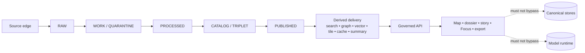
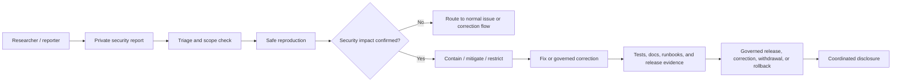

<!-- [KFM_META_BLOCK_V2]
doc_id: kfm://doc/REVIEW-REQUIRED-UUID
title: SECURITY
type: standard
version: v1
status: review
owners: [REVIEW-REQUIRED]
created: [PRESERVE-IF-EXISTING-OR-SET-ON-COMMIT]
updated: 2026-03-19
policy_label: [REVIEW-REQUIRED]
related: [REVIEW-REQUIRED]
tags: [kfm, security, vulnerability-disclosure, secure-development, governed-delivery]
notes: [Current-session source basis for this revision was the mounted March 2026 PDF corpus plus direct workspace inspection of /mnt/data only; no repo tree, schemas, workflows, manifests, reporting inbox, owners, or advisory configuration were directly verified. Confirm canonical path, owners, reporting channel, and related links before commit.]
[/KFM_META_BLOCK_V2] -->

# SECURITY

Security reporting, coordinated disclosure, release protection, and trust-boundary expectations for the Kansas Frontier Matrix (KFM).


| Field | Value |
| --- | --- |
| **Status** | Experimental |
| **Owners** | `REVIEW-REQUIRED` |
| **Canonical path** | `REVIEW-REQUIRED: ./SECURITY.md or .github/SECURITY.md` |
| **Evidence basis** | Mounted March 2026 PDF corpus + direct workspace inspection only |
| **Quick jumps** | [Scope](#scope) · [Repo fit](#repo-fit) · [Security model](#security-model-at-a-glance) · [Report a vulnerability](#report-a-vulnerability) · [Good-faith research](#good-faith-research-and-disclosure-boundaries) · [Verification gates](#security-verification-and-release-gates) · [Checklist](#security-affecting-change-checklist) · [FAQ](#faq) |

> [!IMPORTANT]
> This draft is intentionally evidence-bounded. The current session exposed a mounted March 2026 PDF corpus and direct filesystem inspection only. No repository tree, workflow inventory, manifests, tests, dashboards, advisory configuration, reporting inbox, or `CODEOWNERS` file were directly verified. Replace every `REVIEW-REQUIRED` or `NEEDS VERIFICATION` marker before commit, and confirm whether the authoritative file should live at `./SECURITY.md`, `.github/SECURITY.md`, or one canonical path with the other delegating.

## Scope

This file defines how KFM handles private vulnerability reporting, coordinated disclosure, release protection, runtime-boundary protection, and security-affecting change.

In KFM, security is broader than classic application hardening. It is the governed trust system that constrains how material moves from source admission to public claim, runtime answer, rollback, correction, supersession, and withdrawal. Because KFM is a governed spatial evidence system, security also includes failures that weaken the trust membrane, let derived layers masquerade as authoritative truth, expose restricted or sensitive material, bypass policy or evidence resolution, or make a consequential claim appear more trustworthy than the evidence, review state, and release state support.

Use this policy for reports involving any of the following:

- unauthorized access, authentication bypass, privilege escalation, or trust-membrane bypass
- direct or indirect client access to canonical stores, raw artifacts, restricted data, policy-protected surfaces, or model runtimes
- evidence-resolution failure that could make a consequential claim, map, dossier, export, or Focus response appear more trustworthy than it is
- uncited, unresolved, out-of-scope, or policy-bypassing AI or retrieval behavior
- secrets exposure, dependency or build compromise, supply-chain risk, unsafe runtime exposure, or unsafe deployment configuration
- release-integrity failures such as missing manifests, missing proof objects, missing rollback posture, missing correction readiness, or policy-bundle drift
- denial-of-service, resource exhaustion, or failures that materially threaten governed publication, correction capability, or reviewability
- rights, sensitivity, exact-location exposure, redaction, generalization, or publication-lane failures that could expose protected information

## Repo fit

| Item | Value |
| --- | --- |
| **Path** | `REVIEW-REQUIRED: ./SECURITY.md or .github/SECURITY.md` |
| **Upstream links** | `REVIEW-REQUIRED: README.md · CONTRIBUTING.md · .github/CODEOWNERS` |
| **Downstream links** | `REVIEW-REQUIRED: incident runbooks · release manifests / proof packs · correction notices · policy / verification references` |
| **Canonical-source rule** | Keep **one** authoritative security policy. If a second path exists, it should delegate to the canonical file rather than drift independently. |

## Accepted inputs

This file accepts:

- private vulnerability reports
- security-significant trust failures in public or internal KFM surfaces
- disclosure-coordination requests
- evidence showing release-integrity, policy, review, or correction failures
- reports involving direct model exposure, direct canonical-store exposure, or public bypass paths

## Exclusions

This file does **not** cover:

- feature requests, roadmap ideas, or general product discussion
- ordinary support requests
- routine data or content corrections that do not involve confidentiality, integrity, policy bypass, or unsafe publication
- speculative claims without enough detail to reproduce or assess impact
- public proof-of-concept releases before coordinated handling
- social engineering, phishing, physical intrusion, retaliatory access, or testing beyond clearly authorized scope

Use the project’s contribution guide for normal contribution flow. Route ordinary content or data corrections through the governed correction workflow rather than through this security policy.

## Truth posture for this file

Use these labels whenever this policy distinguishes doctrine from local implementation detail:

- **CONFIRMED** — grounded in the mounted KFM doctrinal, realization, runtime, delivery, and security corpus available in this session
- **PROPOSED** — a repository or runtime realization consistent with that doctrine, but not directly verified in mounted implementation during this session
- **UNKNOWN** — not verified strongly enough in the current session to claim as active repo, workflow, deployment, or reporting reality
- **NEEDS VERIFICATION** — likely reviewable or fillable before commit, but not safe to present as settled without direct repo or runtime evidence

This policy states doctrine confidently where the corpus supports it and keeps local operational details visibly bounded where the workspace did not verify them.

## Security model at a glance

KFM security is not complete when backend controls exist but public or steward-facing surfaces still hide trust gaps. The path, the boundary, and the visible state all matter.


```mermaid
flowchart LR
    A[Source edge] --> B[RAW]
    B --> C[WORK / QUARANTINE]
    C --> D[PROCESSED]
    D --> E[CATALOG / TRIPLET]
    E --> F[PUBLISHED]
    F --> G[Derived delivery<br/>search • graph • vector • tile • cache • summary]
    G --> H[Governed API]
    H --> I[Map • dossier • story • Focus • export]

    I -. must not bypass .-> J[(Canonical stores)]
    I -. must not bypass .-> K[(Model runtime)]
```

### Core KFM security law

| Law | Practical meaning here |
| --- | --- |
| **Security as governed trust system** | Security constrains movement from source admission to public claim, runtime answer, correction, rollback, supersession, and withdrawal. |
| **Trust membrane** | Public and ordinary clients use governed APIs, policy mediation, and evidence resolution instead of direct access to canonical stores, unpublished artifacts, or model runtimes. |
| **Authoritative vs. derived separation** | Graph, search, vector, tile, cache, summary, dashboard, scene, and embedding layers may accelerate experience, but they remain downstream and non-sovereign. |
| **Fail closed** | Missing evidence, ambiguous rights, unresolved sensitivity, missing review, broken citations, or incomplete release evidence must hold, quarantine, narrow, generalize, deny, abstain, or error rather than bluff. |
| **Evidence-first publication** | Nothing becomes publicly trusted merely because it exists in storage or can be rendered. Trust begins only after evidence resolution, policy state, review where required, release evidence, and recovery posture are in place. |
| **Security-bearing runtime and release behavior** | Promotion, rollback, correction, supersession, withdrawal, observability, and trust-visible UI behavior are part of security, not adjacent concerns. |

### Five-plane security lens

| Plane | Primary security obligation | Unsafe shortcut |
| --- | --- | --- |
| **1. Source and intake** | Descriptor-backed onboarding, integrity-checked fetch, receipts, quarantine routing | Treating downloads or scraped payloads as publishable truth |
| **2. Canonical truth** | Controlled authoritative data, versioned evidence objects, deterministic identifiers, bounded writes | Letting caches, tiles, graphs, or UI state write back as authority |
| **3. Catalog / policy / review** | Rights, sensitivity, release readiness, review state, correction governance | Publishing visible artifacts without explicit policy or review state |
| **4. Derived delivery** | Rebuildable search, graph, vector, tile, summary, and export layers tied to approved releases | Mistaking freshness or convenience for sovereign truth |
| **5. Runtime and trust surfaces** | Governed API responses, evidence drill-through, accountable outcomes, visible trust state | Exposing direct store access or model runtime as the public trust boundary |

## Trust-visible states that security must preserve

KFM security is incomplete unless the user-facing surface makes partial trust, narrowed scope, stale data, and correction visible at the moment of use.

| Trust-visible state | Minimum cue | Why it exists |
| --- | --- | --- |
| **ready** | release/freshness cue plus evidence entry point | Published support is present and reachable |
| **partial** | partial-data or limited-scope notice | The surface is usable, but not complete enough to imply full coverage |
| **stale-visible** | stale banner and freshness label | The surface remains readable without pretending it is current |
| **review-required** | explicit review or pending-trust indicator | Human review or promotion state still matters |
| **generalized** | reduced-precision or generalized-data notice | Safety, rights, or sensitivity constraints narrowed detail |
| **denied / withheld** | policy-visible denial or withholding notice | The system knows enough to refuse exposure instead of bluffing |
| **superseded** | correction banner and replacement pointer | A newer release or corrected narrative replaced the current one |
| **withdrawn** | withdrawal notice and audit-preserving pointer | The prior release is no longer publicly admissible |
| **error** | operational error state with audit reference | Trustworthy service failed and could not safely degrade into another state |

## Supported scope and release posture

Exact supported versions and release identifiers were **not** directly verified in the current session. Until the repository’s release inventory is surfaced, use the following posture:

| Scope | Current posture |
| --- | --- |
| **Exact release / version support matrix** | `NEEDS VERIFICATION BEFORE PUBLISH` |
| **Current governed code, docs, contracts, and policy surface under review** | In scope for private security reporting |
| **Promoted or outwardly visible artifacts and surfaces** | In scope |
| **Superseded, stale-visible, generalized, restricted, withdrawn, or corrected surfaces** | Still reportable; remediation may be correction, supersession, withdrawal, generalization, or rollback rather than a code patch |
| **Local-first phase-one runtime posture** | In scope, especially for exposure, policy, evidence, audit-path, and model-boundary failures |
| **Third-party systems not controlled by KFM** | Out of scope unless the issue is caused by KFM-controlled configuration, exposure, packaging, or handling |

## Report a vulnerability

Report security issues **privately first**.

### Private reporting channel

| Field | Value |
| --- | --- |
| **Primary private channel** | `NEEDS VERIFICATION: monitored security inbox or equivalent confidential intake path` |
| **Secondary / fallback channel** | `NEEDS VERIFICATION: designated maintainer / steward fallback for confidential reports` |
| **GitHub private advisory path** | `NEEDS VERIFICATION: enable only if actually configured` |
| **Public issue tracker** | **Do not use** for undisclosed security findings |
| **Secure document exchange / PGP** | `NEEDS VERIFICATION: publish only if actually supported` |
| **Acknowledgement target** | `NEEDS VERIFICATION` |
| **Status update cadence** | `NEEDS VERIFICATION` |
| **Coordinated disclosure target** | `NEEDS VERIFICATION` |

> [!NOTE]
> Until these values are verified and published, do **not** post exploit details in issues, discussions, pull requests, public chat, or public documentation.

### What to include in a report

A useful report includes:

- affected route, service, artifact, workflow, runtime surface, or release lane
- clear impact statement
- reproduction steps
- the smallest safe proof of concept
- expected safe behavior versus observed behavior
- whether the issue affects confidentiality, integrity, availability, policy enforcement, evidence linkage, release integrity, correction behavior, or runtime trust
- relevant logs, screenshots, traces, digests, or receipts, with sensitive data minimized or redacted
- any suggested mitigation, containment, or configuration guardrail

### Private report template

```text
Subject: [KFM SECURITY] short title

Affected surface:
Environment/profile:
Impact:
Category:
Reproduction steps:
Minimal proof of concept:
Expected safe behavior:
Observed behavior:
Sensitive data touched (if any):
Suggested mitigation/containment:
Disclosure constraints or timing concerns:
Contact preference:
```

## Good-faith research and disclosure boundaries

KFM prefers clear, bounded reporting lanes over silence and fear.

Good-faith research is welcome when it:

- stays within explicitly authorized scope or a separately published safe-harbor lane
- is privacy-respecting and data-minimizing
- is limited to what is necessary to demonstrate the issue
- is promptly and privately reported
- is documented clearly enough to support verification and remediation
- avoids degrading availability, exposing unrelated data, or expanding access beyond the minimum needed

> [!CAUTION]
> This document does **not** by itself authorize unrestricted testing. If you accidentally encounter a vulnerability, stop after confirming the issue, avoid unrelated access, preserve only the minimum notes needed to explain it, and report it through the safest private channel available.

## Prohibited or out-of-scope testing

Unless KFM explicitly publishes written authorization, the following are out of scope:

- social engineering, phishing, or impersonation attempts against maintainers, contributors, vendors, or third parties
- physical intrusion or facility-access attempts
- denial-of-service, destructive load testing, or intentionally availability-impacting behavior
- accessing, downloading, retaining, modifying, or sharing unrelated data once exposure is demonstrated
- pivoting into third-party, shared, upstream, or provider systems
- mass scanning or automated exploitation beyond clearly agreed scope
- testing that targets exact locations, culturally sensitive materials, restricted historical material, or protected ecological content without explicit authorization
- retaliatory access, counterattack, or hack back

## Security verification and release gates

In KFM, verification is not late QA. It is a cross-cutting control layer attached to movement across the governed path and across boundary crossings. Use these gates whenever a change can affect trust, publication, or runtime answering.

| Gate | What it proves | Fail-closed consequence |
| --- | --- | --- |
| **Schema gate** | Contract shape, required fields, enums, and valid/invalid fixtures conform to the published basis | Block merge or promotion; emit structured schema errors |
| **Source replay gate** | Source descriptors and ingest receipts are sufficient to re-fetch and verify source inputs | Hold or quarantine the source; do not admit it downstream |
| **Catalog closure gate** | STAC / DCAT / PROV or equivalent outward closure resolves coherently for a dataset version or release | Block release or promotion |
| **Policy bundle gate** | Reason codes, obligation codes, rights/sensitivity logic, and deny-by-default rules are complete enough to fail closed | Deny or hold |
| **Release assembly gate** | The release unit is complete and linked to catalog, provenance, and proof objects | Block promotion or deployment |
| **Evidence-resolution gate** | Every consequential visible claim or runtime response resolves to inspectable support | Runtime must abstain, deny, or error instead of bluffing |
| **Runtime citation-negative test** | Unsupported answering is refused when citations fail, scope is empty, or evidence is unavailable | Force `ABSTAIN`, `DENY`, or `ERROR` |
| **Stale-projection / freshness test** | Derived layers cannot silently outrank current release truth or freshness basis | Show stale-visible state, rebuild, or block projection release |
| **Surface-state gate** | UI surfaces honestly display generalized, stale, denied, superseded, withdrawn, and errored states | Block misleading release behavior |
| **Correction drill** | Supersession, withdrawal, narrowing, or replacement is real, visible, and auditable | No silent overwrite |
| **Restore / rollback drill** | Recovery restores a prior verified state and preserves why reversal occurred | Treat rollback posture as weak until exercised |
| **Documentation / accessibility gate** | Contracts, diagrams, runbooks, examples, trust cues, and accessibility remain aligned to behavior | Block behavior-significant changes until docs and accessibility catch up |

## Triage, remediation, correction, and disclosure

KFM should handle security as governed operational work rather than ad hoc heroics.

### Triage lens

Prioritize by:

- external reachability
- privilege yield
- exploit maturity
- asset and claim criticality
- policy, evidence, rights, or sensitivity impact
- ease of abuse in the real operating environment
- blast radius across public claims, maps, stories, exports, review surfaces, and runtime trust objects

### Remediation model

| Outcome | Meaning |
| --- | --- |
| **Remediation** | Remove the weakness |
| **Mitigation** | Reduce exposure while the weakness remains |
| **Acceptance** | Explicitly own and time-bound residual risk |
| **Correction / supersession** | Change published truth state without pretending nothing happened |
| **Withdrawal / restriction / generalization** | Narrow or remove outward visibility when that is the safest governed result |

### Coordinated handling sequence

1. Receive privately.
2. Confirm scope, authorization, and immediate containment needs.
3. Reproduce safely.
4. Contain, mitigate, restrict, generalize, or withdraw if users are exposed.
5. Fix or otherwise correct the unsafe state.
6. Verify with negative-path and happy-path tests.
7. Update contracts, examples, runbooks, diagrams, release evidence, and correction notices where behavior changed.
8. Promote, withdraw, supersede, or roll back with restore and correction readiness.
9. Coordinate disclosure once users are not needlessly exposed.

No public disclosure should outrun containment, fix verification, or an explicitly defined coordinated-disclosure window.

## Security-affecting change checklist

Use this checklist for any change that can alter trust, exposure, runtime safety, or release integrity.

- [ ] Threat-model impact reviewed
- [ ] Trust membrane preserved; no new client → store or client → model bypass path
- [ ] Authoritative-versus-derived separation preserved; freshness and invalidation implications reviewed
- [ ] Least-privilege impact reviewed for users, services, jobs, automation, and secrets
- [ ] Policy and evidence resolution still occur in-path where required
- [ ] Negative-path tests covered where relevant: deny, abstain, citation-negative, stale-visible, correction, rollback, restore
- [ ] Sensitive data, exact locations, and restricted content remain correctly withheld, generalized, or review-gated
- [ ] Release evidence updated where behavior changed: manifests, receipts, decision/review records, proof objects, correction notices, or equivalent artifacts
- [ ] Documentation, examples, diagrams, runbooks, and accessibility/trust-visible cues updated in the same governed change stream
- [ ] Model runtime remains behind governed APIs and is not directly exposed
- [ ] Backup, restore, supersession, withdrawal, and correction implications reviewed

## Reporting and response flow


```mermaid
flowchart LR
    A[Researcher / reporter] --> B[Private security report]
    B --> C[Triage and scope check]
    C --> D[Safe reproduction]
    D --> E{Security impact confirmed?}
    E -- No --> F[Route to normal issue or correction flow]
    E -- Yes --> G[Contain / mitigate / restrict]
    G --> H[Fix or governed correction]
    H --> I[Tests, docs, runbooks, and release evidence]
    I --> J[Governed release, correction, withdrawal, or rollback]
    J --> K[Coordinated disclosure]
```

## FAQ

### Can I open a public issue?

Not for undisclosed security findings. Use a private reporting path.

### What if I am not sure whether the issue is security-related?

Report it privately if it could affect confidentiality, integrity, availability, policy enforcement, evidence linkage, release integrity, correction behavior, rights or sensitivity handling, or runtime trust.

### Does this policy cover AI, evidence, or citation failures?

Yes. In KFM, trust failures include uncited or unresolved consequential output, policy-bypass retrieval, unsafe model exposure, evidence-resolution failure, or any route that weakens cite-or-abstain behavior.

### Does this policy cover trust-visible UI or accessibility issues?

Yes, when they affect operational trust. Misleading state banners, hidden review or freshness context, broken evidence drill-through, non-color-only trust cues, or inaccessible failure states can all be security-relevant because they change whether users can correctly interpret trust conditions.

### What if I accidentally accessed data?

Stop immediately, minimize retention, do not continue exploring unrelated data, preserve only the minimum evidence needed to explain what happened, and report it privately.

### What if no private reporting lane is published yet?

Use the safest confidential maintainer or steward route available, disclose the minimum needed to establish impact, and avoid public detail until a proper channel is confirmed.

### Are deny, abstain, hold, withdrawal, supersession, or generalization valid outcomes?

Yes. KFM is fail closed. Safe negative outcomes are first-class security outcomes.

## Appendix A — Indicative in-scope surfaces

<details>
<summary>Expand in-scope surface examples</summary>

| Surface | Example concern |
| --- | --- |
| Governed API | auth bypass, route-class drift, unpublished-scope reads, missing audit linkage |
| Policy/runtime path | policy bypass, missing deny or abstain behavior, out-of-scope response, post-generation citation failure |
| Evidence resolution | broken `EvidenceRef` → `EvidenceBundle` resolution, stale support, missing drill-through |
| Release and delivery | missing manifests, missing proof objects, unsigned or mis-scoped artifacts, rollback gaps |
| Docs / runbooks / contracts | drift that weakens safe operation or hides security-critical behavior |
| Local/runtime boundary | direct model exposure, direct database exposure, direct artifact-root reachability |
| Derived layers | stale or policy-incorrect search, vector, tile, graph, cache, or summary behavior presented as current truth |
| Corrections | missing correction notices, silent withdrawal, supersession without traceability |

</details>

## Appendix B — Needs-verification items before publish

<details>
<summary>Expand pre-publish verification list</summary>

- exact canonical path: `./SECURITY.md` vs `.github/SECURITY.md` vs one canonical file with delegation
- dedicated private reporting channel
- owners and escalation path
- supported release / version matrix
- GitHub private advisory configuration
- acknowledgement and disclosure SLAs
- whether `.github/CODEOWNERS` exists and whether it covers security-significant paths
- whether repo-local runbooks or incident documents should be linked here
- whether existing labels, issue forms, advisory templates, or automation already define the reporting lane
- whether the repo already uses one standardized public wording for negative surface states

</details>

[Back to top](#security)