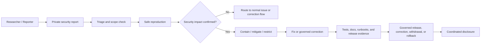

<!-- [KFM_META_BLOCK_V2]
doc_id: kfm://doc/REVIEW-REQUIRED-UUID
title: SECURITY
type: standard
version: v1
status: review
owners: [REVIEW-REQUIRED]
created: [PRESERVE-IF-EXISTING-OR-SET-ON-COMMIT]
updated: 2026-03-16
policy_label: [REVIEW-REQUIRED]
related: [REVIEW-REQUIRED]
tags: [kfm, security, vulnerability-disclosure, secure-development, governed-delivery]
notes: [Current-session source basis for this revision was the mounted March 2026 PDF corpus only; no repo tree, schemas, workflows, manifests, reporting inbox, owners, or advisory configuration were directly verified. Candidate adjacent docs and paths below remain review-required until checked in the repository.]
[/KFM_META_BLOCK_V2] -->

# SECURITY

Security reporting, disclosure, release protection, and secure-development expectations for the Kansas Frontier Matrix (KFM).


| Field | Value |
| --- | --- |
| **Status** | Experimental |
| **Owners** | `REVIEW-REQUIRED` |
| **Canonical path** | `REVIEW-REQUIRED: ./SECURITY.md or .github/SECURITY.md` |
| **Quick jumps** | [Scope](#scope) · [Repo fit](#repo-fit) · [Report a vulnerability](#report-a-vulnerability) · [Good-faith research](#good-faith-research-and-disclosure-boundaries) · [Release protection](#release-protection-expectations) · [Checklist](#security-affecting-change-checklist) · [FAQ](#faq) |

> [!IMPORTANT]
> This policy is intentionally evidence-bounded. The mounted workspace used for this revision exposed PDF corpus evidence only, not a directly inspectable repository tree, workflow directory, release inventory, reporting inbox, CODEOWNERS file, supported-version matrix, GitHub advisory configuration, or runtime logs. Replace every `REVIEW-REQUIRED` marker before commit, and confirm whether the canonical file should live at `./SECURITY.md`, `.github/SECURITY.md`, or one authoritative location with the other delegating.

## Scope

This file defines how KFM handles security reporting, coordinated disclosure, release protection, runtime-boundary protection, and security-affecting changes.

KFM security is broader than classic application vulnerability handling. Because KFM is a governed spatial evidence system, security also includes failures that weaken the trust membrane, let derived layers masquerade as authoritative truth, expose restricted or sensitive material, bypass policy or evidence resolution, break citation-negative behavior, or allow a runtime surface to present stronger certainty than the evidence, review, and release state support.

Use this policy for reports involving any of the following:

- unauthorized access, authentication bypass, privilege escalation, or trust-membrane bypass
- direct or indirect client access to canonical stores, raw artifacts, restricted data, policy-protected surfaces, or model runtimes
- evidence-resolution failure that could make a consequential claim, map, dossier, export, or Focus response appear more trustworthy than it is
- uncited, unresolved, out-of-scope, or policy-bypassing AI or retrieval behavior
- secrets exposure, dependency or build compromise, supply-chain risk, unsafe runtime exposure, or unsafe deployment configuration
- release-integrity failures such as missing manifests, missing proof objects, missing rollback posture, missing correction readiness, or policy-bundle drift
- denial-of-service, resource exhaustion, or failures that materially threaten governed publication, correction capability, or reviewability
- rights, sensitivity, location-exposure, redaction, generalization, or publication-lane failures that could expose protected information

## Repo fit

| Item | Value |
| --- | --- |
| **Path** | `REVIEW-REQUIRED: ./SECURITY.md or .github/SECURITY.md` |
| **Upstream links** | `REVIEW-REQUIRED:` [README.md](README.md) · [CONTRIBUTING.md](CONTRIBUTING.md) · [.github/CODEOWNERS](.github/CODEOWNERS) |
| **Downstream links** | `REVIEW-REQUIRED:` [.github/README.md](.github/README.md) · [.github/SECURITY.md](.github/SECURITY.md) · incident runbooks · release manifests / proof packs · correction notices |
| **Canonical-source rule** | Keep **one** authoritative security policy. If a second path exists, it should clearly delegate to the canonical file rather than drift independently. |

## Accepted inputs

This file accepts:

- private vulnerability reports
- security-significant trust failures in public or internal KFM surfaces
- disclosure-coordination requests
- evidence showing release-integrity, policy, review, or correction failures
- reports involving direct model exposure, direct canonical-store exposure, or public bypass paths

## Exclusions

This file does **not** cover:

- feature requests, roadmap ideas, or general product discussion
- ordinary support requests
- routine data or content corrections that do not involve confidentiality, integrity, policy bypass, or unsafe publication
- speculative claims without enough detail to reproduce or assess impact
- public proof-of-concept releases before coordinated handling
- social engineering, phishing, physical intrusion, retaliatory access, or any testing beyond clearly authorized scope

Use [CONTRIBUTING.md](CONTRIBUTING.md) for normal contribution flow. Route ordinary content or data corrections through the governed correction workflow rather than through this security policy.

## Truth posture for this file

Use these labels whenever this policy distinguishes doctrine from local implementation detail:

- **CONFIRMED** — grounded in the mounted KFM doctrinal, realization, runtime, delivery, and security corpus.
- **PROPOSED** — a repository or runtime realization consistent with that doctrine, but not directly verified in mounted implementation during this session.
- **UNKNOWN** — not verified strongly enough in the current session to claim as active repo, workflow, deployment, or reporting reality.

This policy states doctrine confidently where the corpus supports it and keeps local operational details visible as review-required where the workspace did not verify them.

## KFM security principles

| Principle | What it means here |
| --- | --- |
| **Governed publication first** | Security begins before public release. Promotion, publication, rollback, supersession, withdrawal, and correction are security-relevant state changes. |
| **Truth path** | Public trust-bearing outputs stay downstream of intake, validation, catalog closure, policy, review, release state, and correction. |
| **Trust membrane** | Public and normal client surfaces must not bypass governed APIs to reach canonical stores, raw artifacts, or model runtimes directly. |
| **Authoritative vs. derived separation** | Search, graph, vector, tile, cache, summary, and AI layers are useful but secondary. They must not silently become root truth. |
| **Fail closed** | Missing evidence, unresolved rights, unclear sensitivity, broken citations, missing review, or incomplete release state must narrow, deny, hold, quarantine, generalize, or abstain rather than publish optimistically. |
| **Evidence-bearing release** | Promotion is a governed state change, not a file move. Release integrity depends on manifests, proof objects, provenance, review state, and correction readiness. |
| **Least privilege** | Security applies across source onboarding, build, publish, runtime, correction, and recovery. Users, services, jobs, and automation should have only the access they need. |
| **Operational evidence** | Logs, traces, metrics, audit joins, correction notices, and release references are part of the security system, not ornamental telemetry. |
| **Documentation as production surface** | Contracts, diagrams, examples, runbooks, rollback notes, and disclosure lanes are security-relevant artifacts and must stay aligned with behavior. |
| **Visible incompleteness over false certainty** | Keep `UNKNOWN` visible until direct repo or runtime evidence exists. Calm negative outcomes are safer than persuasive overclaiming. |

## User-visible fail-safe states

KFM security is not complete unless the user-facing surface shows when trust is partial, narrowed, stale, or unavailable.

| Surface state | Minimum visible cue | Meaning |
| --- | --- | --- |
| **available** | release label, scope/time label, evidence entry point | Published admissible support is present. |
| **available_generalized** | explicit generalization / reduced-precision notice | The surface is intentionally narrowed for safety, rights, or sensitivity reasons. |
| **stale_visible_with_warning** | stale banner and freshness label | The surface remains readable, but must not be mistaken for current truth. |
| **withheld_policy** | policy-withheld notice | The system knows enough to deny exposure rather than bluff. |
| **unavailable_evidence** | evidence unavailable notice | The evidence path failed or cannot be rendered safely. |
| **superseded** | correction banner and replacement pointer | A newer release or corrected narrative supersedes the current one. |
| **withdrawn** | withdrawal notice and audit-preserving pointer | The release is no longer publicly admissible. |
| **errored** | error state with audit reference | Runtime failure preserved accountability without pretending success. |

## Supported scope and release posture

Exact supported versions and release identifiers were **not** directly verified in the current session. Until the repository’s release inventory is surfaced, use the following posture:

| Scope | Current posture |
| --- | --- |
| **Exact release/version support matrix** | `NEEDS VERIFICATION BEFORE PUBLISH` |
| **Current governed code, docs, contracts, and policy surface under review** | In scope for private security reporting |
| **Promoted or outwardly visible artifacts and surfaces** | In scope |
| **Superseded, stale-visible, generalized, restricted, withdrawn, or corrected surfaces** | Still reportable; remediation may be correction, supersession, withdrawal, generalization, or rollback rather than a code patch |
| **Local-only phase-one runtime posture** | In scope, especially for exposure, policy, evidence, audit-path, and model-boundary failures |
| **Third-party systems not controlled by KFM** | Out of scope unless the issue is caused by KFM-controlled configuration, exposure, packaging, or handling |

## Report a vulnerability

Report security issues **privately first**.

### Private reporting channel

| Field | Value |
| --- | --- |
| **Primary private channel** | `REVIEW-REQUIRED: monitored security inbox or equivalent confidential intake path` |
| **Secondary / fallback channel** | `REVIEW-REQUIRED: maintainer fallback for confidential reports` |
| **GitHub private advisory path** | `REVIEW-REQUIRED: enable only if actually configured` |
| **Public issue tracker** | **Do not use** for undisclosed security findings |
| **Secure document exchange / PGP** | `REVIEW-REQUIRED: add only if actually supported` |
| **Acknowledgement target** | `REVIEW-REQUIRED` |
| **Status update cadence** | `REVIEW-REQUIRED` |
| **Coordinated disclosure target** | `REVIEW-REQUIRED` |

Until these values are verified and published, do **not** post exploit details in issues, discussions, pull requests, public chat, or public documentation.

### What to include in a report

A useful report includes:

- affected route, service, artifact, workflow, runtime surface, or release lane
- clear impact statement
- reproduction steps
- smallest safe proof of concept
- expected safe behavior versus observed behavior
- whether the issue affects confidentiality, integrity, availability, policy enforcement, evidence linkage, release integrity, correction behavior, or runtime trust
- relevant logs, screenshots, traces, digests, or receipts, with sensitive data minimized or redacted
- any suggested mitigation, containment, or configuration guardrail

### Private report template

```text
Subject: [KFM SECURITY] short title

Affected surface:
Environment/profile:
Impact:
Category:
Reproduction steps:
Minimal proof of concept:
Expected safe behavior:
Observed behavior:
Sensitive data touched (if any):
Suggested mitigation/containment:
Disclosure constraints or timing concerns:
Contact preference:
```

## Good-faith research and disclosure boundaries

KFM prefers clear, bounded reporting lanes over silence and fear.

Good-faith research is welcome when it:

- stays within explicitly authorized scope or a separately published safe-harbor lane
- is privacy-respecting and data-minimizing
- is limited to what is necessary to demonstrate the issue
- is promptly and privately reported
- is documented clearly enough to support verification and remediation
- avoids degrading availability, exposing unrelated data, or expanding access beyond the minimum needed

This document does **not** by itself authorize unrestricted testing. If you accidentally encounter a vulnerability, stop after confirming the issue, avoid unrelated access, preserve only the minimum notes needed to explain it, and report it through the safest private channel available.

## Prohibited or out-of-scope testing

Unless KFM explicitly publishes written authorization, the following are out of scope:

- social engineering, phishing, or impersonation attempts against maintainers, contributors, vendors, or third parties
- physical intrusion or facility-access attempts
- denial-of-service, destructive load testing, or intentionally availability-impacting behavior
- accessing, downloading, retaining, modifying, or sharing unrelated data once exposure is demonstrated
- pivoting into third-party, shared, upstream, or provider systems
- mass scanning or automated exploitation beyond clearly agreed scope
- testing that targets exact locations, culturally sensitive materials, restricted historical material, or protected ecological content without explicit authorization
- retaliatory access, counterattack, or hack back

## Release-protection expectations

In KFM, security and delivery are part of the same governed system. Security-significant change must preserve at least the following:

| Gate or expectation | What it means here |
| --- | --- |
| **Policy decision gate** | Reason codes, obligation codes, rights/sensitivity mappings, and emergency-deny rules are complete enough to fail closed. |
| **Release assembly gate** | Visible change does not occur without a release manifest or equivalent proof pack. |
| **Evidence resolution gate** | Every consequential visible claim or runtime response resolves to inspectable support. |
| **Citation-negative behavior** | The system abstains, denies, or errors rather than fabricating support when citations fail or scope is missing. |
| **Stale-state protection** | Derived layers cannot silently overstate freshness or outrank release truth. |
| **Restore and correction drill** | Rollback, restore, supersession, withdrawal, and public-surface correction are real operational behaviors rather than paper promises. |
| **Docs and accessibility gate** | Contracts, diagrams, runbooks, examples, tables, and trust-visible public states remain current and usable. |

## Triage, remediation, correction, and disclosure

KFM should handle security as governed operational work rather than ad hoc heroics.

### Triage lens

Prioritize by:

- external reachability
- privilege yield
- exploit maturity
- asset and claim criticality
- policy, evidence, or rights impact
- ease of abuse in the real operating environment
- blast radius across public claims, maps, stories, exports, review surfaces, and runtime trust objects

### Remediation model

Separate these outcomes clearly:

| Outcome | Meaning |
| --- | --- |
| **Remediation** | Remove the weakness |
| **Mitigation** | Reduce exposure while the weakness remains |
| **Acceptance** | Explicitly own and time-bound residual risk |
| **Correction / supersession** | Change published truth state without pretending nothing happened |
| **Withdrawal / restriction / generalization** | Narrow or remove outward visibility when that is the safest governed result |

### Coordinated handling sequence

1. Receive privately.
2. Confirm scope, authorization, and immediate containment needs.
3. Reproduce safely.
4. Contain, mitigate, restrict, generalize, or withdraw if users are exposed.
5. Fix or otherwise correct the unsafe state.
6. Verify with negative-path and happy-path tests.
7. Update contracts, examples, runbooks, diagrams, release evidence, and correction notices where behavior changed.
8. Promote, withdraw, supersede, or roll back with restore and correction readiness.
9. Coordinate disclosure once users are not needlessly exposed.

No public disclosure should outrun containment, fix verification, or an explicitly defined coordinated-disclosure window.

## Security-affecting change checklist

Use this checklist for any change that can alter trust, exposure, runtime safety, or release integrity.

- [ ] Threat-model impact reviewed
- [ ] Trust membrane preserved; no new client → store or client → model bypass path
- [ ] Least-privilege impact reviewed for users, services, jobs, automation, and secrets
- [ ] Policy and evidence resolution still occur in the request path where required
- [ ] Negative-path tests covered where relevant: deny, abstain, citation-negative, stale-state, correction, rollback, restore
- [ ] Sensitive data, exact locations, and restricted content remain correctly withheld, generalized, or review-gated
- [ ] Release evidence updated where behavior changed: manifests, receipts, proofs, review records, correction notices, or equivalent artifacts
- [ ] Documentation, examples, diagrams, and runbooks updated in the same governed change stream
- [ ] Model runtime remains behind the governed API and is not directly exposed
- [ ] Backup, restore, supersession, withdrawal, and correction implications reviewed

## Reporting and response flow


```mermaid
flowchart LR
    A[Researcher / Reporter] --> B[Private security report]
    B --> C[Triage and scope check]
    C --> D[Safe reproduction]
    D --> E{Security impact confirmed?}
    E -- No --> F[Route to normal issue or correction flow]
    E -- Yes --> G[Contain / mitigate / restrict]
    G --> H[Fix or governed correction]
    H --> I[Tests, docs, runbooks, and release evidence]
    I --> J[Governed release, correction, withdrawal, or rollback]
    J --> K[Coordinated disclosure]
```

## FAQ

### Can I open a public issue?

Not for undisclosed security findings. Use a private reporting path.

### What if I am not sure whether the issue is security-related?

Report it privately if it could affect confidentiality, integrity, availability, policy enforcement, evidence linkage, release integrity, correction behavior, rights or sensitivity handling, or runtime trust.

### Does this policy cover AI and evidence issues?

Yes. In KFM, trust failures include uncited or unresolved consequential output, policy-bypass retrieval, unsafe model exposure, evidence-resolution failure, or any route that weakens cite-or-abstain behavior.

### What if I accidentally accessed data?

Stop immediately, minimize retention, do not continue exploring unrelated data, preserve only the minimum evidence needed to explain what happened, and report it privately.

### Are deny, abstain, hold, withdrawal, supersession, or generalization valid outcomes?

Yes. KFM is fail closed. Safe negative outcomes are first-class security outcomes.

## Appendix A — Indicative in-scope surfaces

<details>
<summary>Expand in-scope surface examples</summary>

| Surface | Example concern |
| --- | --- |
| Governed API | auth bypass, route-class drift, unpublished-scope reads, missing audit linkage |
| Policy/runtime path | policy bypass, missing deny or abstain behavior, out-of-scope response, post-generation citation failure |
| Evidence resolution | broken `EvidenceRef` → `EvidenceBundle` resolution, stale support, missing drill-through |
| Release and delivery | missing manifests, missing proof objects, unsigned or mis-scoped artifacts, rollback gaps |
| Docs / runbooks / contracts | drift that weakens safe operation or hides security-critical behavior |
| Local/runtime boundary | direct model exposure, direct database exposure, direct artifact-root reachability |
| Derived layers | stale or policy-incorrect search, vector, tile, graph, cache, or summary behavior presented as current truth |
| Corrections | missing correction notices, silent withdrawal, supersession without traceability |

</details>

## Appendix B — Needs-verification items before publish

<details>
<summary>Expand pre-publish verification list</summary>

- exact canonical path: `./SECURITY.md` vs `.github/SECURITY.md` vs one canonical file with delegation
- dedicated private reporting channel
- owners and escalation path
- supported release/version matrix
- GitHub private advisory configuration
- acknowledgement and disclosure SLAs
- whether `.github/CODEOWNERS` exists and whether it covers security-significant paths
- whether additional repo-local runbooks or incident documents should be linked here
- whether any existing labels, issue forms, or advisory templates already define the reporting path

</details>

[Back to top](#security)
