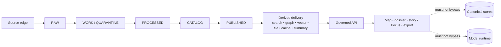
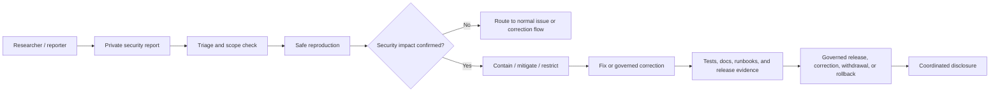

<!-- [KFM_META_BLOCK_V2]
doc_id: kfm://doc/REVIEW-REQUIRED-UUID
title: SECURITY
type: standard
version: v1
status: review
owners: [REVIEW-REQUIRED]
created: [PRESERVE-IF-EXISTING-OR-SET-ON-COMMIT]
updated: [SET-ON-COMMIT]
policy_label: [REVIEW-REQUIRED]
related: [README.md, .github/CODEOWNERS, .github/PULL_REQUEST_TEMPLATE.md, .github/workflows/README.md, policy/README.md, contracts/README.md, schemas/README.md]
tags: [kfm, security, vulnerability-disclosure, secure-development, governed-delivery]
notes: [Source basis for this revision: mounted March 2026 KFM corpus, attached repo-grounded sprint summary, and direct current-session filesystem inspection of /mnt/data. No directly mounted repo checkout, workflow YAML inventory, manifests, dashboards, or runtime logs were reverified. Confirm canonical path, owners, private reporting channel, SLAs, and related links before commit.]
[/KFM_META_BLOCK_V2] -->

# SECURITY

Security reporting, coordinated disclosure, release protection, and trust-boundary expectations for Kansas Frontier Matrix (KFM).


| Field | Value |
| --- | --- |
| **Status** | Experimental review draft |
| **Owners** | `REVIEW-REQUIRED` |
| **Canonical path** | `REVIEW-REQUIRED: choose one canonical public security-policy path (for example SECURITY.md or .github/SECURITY.md) and keep any secondary path delegating to it` |
| **Evidence basis** | Mounted March 2026 KFM corpus + attached repo-grounded sprint summary + direct current-session inspection of `/mnt/data` |
| **Quick jumps** | [Scope](#scope) · [Repo fit](#repo-fit) · [Current repo-grounded signals](#current-repo-grounded-signals) · [Security model](#security-model-at-a-glance) · [Report a vulnerability](#report-a-vulnerability) · [Verification gates](#security-verification-and-release-gates) · [Checklist](#security-affecting-change-checklist) · [FAQ](#faq) |

> [!WARNING]
> This file is intentionally evidence-bounded and is **not publish-ready as-is**. The current session exposed a mounted PDF corpus and an attached repo-grounded summary artifact, but **not** a directly mounted repository checkout, live workflow inventory, manifests, dashboards, or runtime logs. Replace every `REVIEW-REQUIRED`, `UNKNOWN`, `INFERRED`, or `NEEDS VERIFICATION` marker before public publication.

## Scope

This file defines how KFM handles private vulnerability reporting, coordinated disclosure, release protection, runtime-boundary protection, and security-affecting change.

In KFM, security is broader than classic application hardening. It includes failures that weaken the trust membrane, let derived layers masquerade as authoritative truth, expose restricted or sensitive material, bypass policy or evidence resolution, or make a consequential claim appear more trustworthy than the evidence, review state, and release state support.

Use this policy for reports involving any of the following:

- unauthorized access, authentication bypass, privilege escalation, or trust-membrane bypass
- direct or indirect client access to canonical stores, unpublished artifacts, policy-protected surfaces, or model runtimes
- evidence-resolution failure that could make a consequential claim, map, dossier, story, export, or Focus response appear more trustworthy than it is
- uncited, unresolved, out-of-scope, or policy-bypassing AI or retrieval behavior
- secrets exposure, dependency or build compromise, supply-chain risk, unsafe runtime exposure, or unsafe deployment configuration
- release-integrity failures such as missing manifests, missing proof objects, missing rollback posture, missing correction readiness, or policy-bundle drift
- stale, superseded, withdrawn, or correction-pending content still appearing current on user-facing surfaces
- denial-of-service, resource exhaustion, or failures that materially threaten governed publication, correction capability, or reviewability
- rights, sensitivity, exact-location exposure, redaction, generalization, or publication-lane failures that could expose protected information

## Repo fit

| Item | Value |
| --- | --- |
| **Path** | `REVIEW-REQUIRED: confirm canonical public security-policy path in the live tree` |
| **Upstream links** | [README.md](README.md) · [.github/CODEOWNERS](.github/CODEOWNERS) · [.github/PULL_REQUEST_TEMPLATE.md](.github/PULL_REQUEST_TEMPLATE.md) |
| **Downstream links** | [policy/README.md](policy/README.md) · [contracts/README.md](contracts/README.md) · [schemas/README.md](schemas/README.md) · [.github/workflows/README.md](.github/workflows/README.md) |
| **Canonical-source rule** | Keep **one** authoritative security policy. If a second path exists for platform compatibility, it should delegate to the canonical file rather than drift independently. |

> [!NOTE]
> The link targets above are grounded by the attached repo-grounded sprint summary, not by a directly mounted checkout in this session. Re-open each link in the live repo before commit.

## Current repo-grounded signals

The table below uses the attached repo-grounded sprint summary as the strongest available implementation-adjacent evidence. It is useful for documentation shaping, but it is **not** a substitute for direct re-verification in the live tree.

| Signal | Status | Current consequence |
| --- | --- | --- |
| `.github/CODEOWNERS` | **CONFIRMED** by attached repo-grounded summary | Ownership mapping appears to exist and should be linked from this policy after direct recheck. |
| `.github/PULL_REQUEST_TEMPLATE.md` | **CONFIRMED** by attached repo-grounded summary | Pull-request flow reportedly already carries trust/proof language. |
| `.github/workflows/README.md` | **CONFIRMED** by attached repo-grounded summary | Workflow scaffolding appears to exist, but active merge-blocking YAML was **not** confirmed in-tree. |
| `policy/README.md` | **CONFIRMED** by attached repo-grounded summary | Deny-by-default policy posture appears documented. |
| `contracts/README.md` and `schemas/README.md` | **CONFIRMED** by attached repo-grounded summary | Contract/schema intent exists, but real machine-readable schema inventory was not confirmed. |
| Mounted `.rego` bundles / tests | **UNKNOWN** | The attached summary did not confirm live `.rego` files or exercised policy tests. |
| Implemented signing / attestation / SBOM pipeline | **UNKNOWN** | The attached summary did not confirm a live signing, attestation, or SBOM pipeline. |
| Branch protection / required reviewers | **UNKNOWN** | Not directly knowable from the attached corpus alone. |

## Accepted inputs

This file accepts:

- private vulnerability reports
- security-significant trust failures in public or internal KFM surfaces
- disclosure-coordination requests
- evidence showing release-integrity, policy, review, or correction failures
- reports involving direct model exposure, direct canonical-store exposure, or public bypass paths
- reports showing stale, generalized, superseded, or withdrawn states being misrepresented as current trust

## Exclusions

This file does **not** cover:

- feature requests, roadmap ideas, or general product discussion
- ordinary support requests
- routine data or content corrections that do not involve confidentiality, integrity, availability, policy bypass, unsafe publication, or misleading trust state
- speculative claims without enough detail to reproduce or assess impact
- public proof-of-concept releases before coordinated handling
- social engineering, phishing, physical intrusion, or testing beyond clearly authorized scope
- third-party systems not controlled by KFM, unless the issue is caused by KFM-controlled configuration, packaging, exposure, or handling

Use the project’s contribution guide for normal contribution flow. Route ordinary content or data corrections through the governed correction workflow rather than through this security policy.

## Truth posture for this file

Use these labels whenever this policy distinguishes doctrine from local implementation detail:

| Label | Meaning here |
| --- | --- |
| **CONFIRMED** | Directly supported by the attached KFM corpus, the attached repo-grounded sprint summary, or current-session filesystem inspection. |
| **INFERRED** | Strongly implied by repeated KFM doctrine or attached repo-grounded evidence, but not directly reverified in a mounted repo or runtime. |
| **PROPOSED** | Recommended realization or policy detail that fits KFM doctrine but is not verified as current implementation reality. |
| **UNKNOWN** | Not verified strongly enough in the current session to claim as active repo, workflow, deployment, or reporting reality. |
| **NEEDS VERIFICATION** | Likely fillable before commit, but unsafe to present as settled without direct repo or runtime confirmation. |

## Security model at a glance

KFM security is not complete when backend controls exist but public or steward-facing surfaces still hide trust gaps. The path, the boundary, and the visible state all matter.


```mermaid
flowchart LR
    A[Source edge] --> B[RAW]
    B --> C[WORK / QUARANTINE]
    C --> D[PROCESSED]
    D --> E[CATALOG]
    E --> F[PUBLISHED]
    F --> G[Derived delivery<br/>search • graph • vector • tile • cache • summary]
    G --> H[Governed API]
    H --> I[Map • dossier • story • Focus • export]

    I -. must not bypass .-> J[(Canonical stores)]
    I -. must not bypass .-> K[(Model runtime)]
```

### Core KFM security law

| Law | Practical meaning here |
| --- | --- |
| **Security as governed trust system** | Security constrains movement from source admission to public claim, runtime answer, correction, rollback, supersession, and withdrawal. |
| **Trust membrane** | Public and ordinary clients use governed APIs, policy mediation, and evidence resolution instead of direct access to canonical stores, unpublished artifacts, or model runtimes. |
| **Authoritative vs. derived separation** | Graph, search, vector, tile, cache, summary, scene, and embedding layers may accelerate experience, but they remain downstream and non-sovereign by default. |
| **Fail closed** | Missing evidence, ambiguous rights, unresolved sensitivity, broken citations, or incomplete release evidence must hold, quarantine, narrow, generalize, deny, abstain, or error rather than bluff. |
| **Publication law outranks deployment success** | A service being up does **not** by itself make a release publishable. Missing policy, review, proof-pack, or correction readiness still leaves the release incomplete. |
| **Finite runtime outcomes** | Consequential runtime surfaces must support `ANSWER`, `ABSTAIN`, `DENY`, and `ERROR` as first-class outcomes. |

> [!IMPORTANT]
> In KFM, a healthy deploy is **not** the same thing as a trusted release. Security remains incomplete when review state, proof objects, policy posture, or correction readiness are missing.

## Security-bearing route families

The route-family law is well supported by the attached corpus. Exact mounted route names remain **UNKNOWN** in this session.

| Route family | Primary objects | Security obligation |
| --- | --- | --- |
| **Catalog / discovery** | release metadata, dataset/distribution discovery, catalog closures | expose only released, policy-safe discovery scope with clean identifier and catalog-closure consistency |
| **Feature or subject read** | released authoritative features, place dossiers, claim/detail views | stable subject ID, support/time semantics, rights posture, and release scope are mandatory |
| **Map / tile / portrayal** | released maps, tiles, legends, styles, portrayals | inherit release linkage, policy posture, freshness basis, and correction state |
| **Evidence resolution** | `EvidenceRef -> EvidenceBundle` and related trust objects | every bundle resolves only to admissible published scope with visible rights/sensitivity state and audit linkage |
| **Story / dossier / compare** | narrative and comparison inputs anchored in the same shell | preserve spatial anchor, temporal anchor, and drill-through to evidence |
| **Export and report** | public-safe exports, previews, packaged report objects | never outrun release state, policy posture, or correction linkage |
| **Focus / governed assistance** | bounded natural-language investigation over released scope | scope, citations, policy, and audit linkage remain visible; no direct client path to model runtime |
| **Review / stewardship** | moderation, quarantine inspection, approval, denial, rollback, rights handling | internal-only family; every action emits review and decision artifacts |
| **Ops / status** | health, status, metrics, traces, audit joins | may not expose raw canonical data or become a second truth surface |

## Five-plane security lens

| Plane | Primary security obligation | Unsafe shortcut |
| --- | --- | --- |
| **1. Source and intake** | descriptor-backed onboarding, integrity-checked fetch, receipts, quarantine routing | treating downloads or scraped payloads as publishable truth |
| **2. Canonical truth** | controlled authoritative data, versioned evidence objects, deterministic identifiers, bounded writes | letting caches, tiles, graphs, or UI state write back as authority |
| **3. Catalog / policy / review** | rights, sensitivity, release readiness, review state, correction governance | publishing visible artifacts without explicit policy or review state |
| **4. Derived delivery** | rebuildable search, graph, vector, tile, summary, and export layers tied to approved releases | mistaking freshness or convenience for sovereign truth |
| **5. Runtime and trust surfaces** | governed API responses, evidence drill-through, accountable outcomes, visible trust state | exposing direct store access or model runtime as the public trust boundary |

## Trust-visible states that security must preserve

KFM security is incomplete unless user-facing surfaces make partial trust, narrowed scope, stale data, and correction visible at the moment of use.

| Trust-visible state | Minimum cue | Why it exists |
| --- | --- | --- |
| **ready** | release/freshness cue plus evidence entry point | published support is present and reachable |
| **partial** | partial-data or limited-scope notice | the surface is usable, but not complete enough to imply full coverage |
| **stale-visible** | stale banner and freshness label | the surface remains readable without pretending it is current |
| **review-required** | explicit review or pending-trust indicator | human review or promotion state still matters |
| **generalized** | reduced-precision or generalized-data notice | safety, rights, or sensitivity constraints narrowed detail |
| **denied / withheld** | policy-visible denial or withholding notice | the system knows enough to refuse exposure instead of bluffing |
| **superseded** | correction banner and replacement pointer | a newer release or corrected narrative replaced the current one |
| **withdrawn** | withdrawal notice and audit-preserving pointer | the prior release is no longer publicly admissible |
| **error** | operational error state with audit reference | trustworthy service failed and could not safely degrade into another state |

## Supported scope and release posture

Exact release identifiers and live deployment boundaries were **not** directly reverified in this session.

| Scope | Current posture |
| --- | --- |
| **Current docs, contracts, policy, and review surfaces described in the attached corpus** | in scope for private security reporting |
| **Promoted or outwardly visible artifacts and surfaces** | in scope |
| **Superseded, stale-visible, generalized, restricted, withdrawn, or corrected surfaces** | still reportable; remediation may be correction, supersession, withdrawal, generalization, or rollback rather than only a code patch |
| **Local/private-first and hosted deployments** | both should preserve the same trust membrane and fail-closed invariants |
| **Exact version / release support matrix** | `NEEDS VERIFICATION BEFORE PUBLISH` |
| **Third-party systems not controlled by KFM** | out of scope unless KFM-controlled configuration, exposure, packaging, or handling caused the issue |

## Report a vulnerability

Report security issues **privately first**.

### Private reporting channel

No explicit confidential reporting address, SLA, or advisory configuration was confirmed in the attached corpus or attached repo-grounded summary.

| Field | Value |
| --- | --- |
| **Primary private channel** | `NEEDS VERIFICATION: monitored security inbox or equivalent confidential intake path` |
| **Secondary / fallback channel** | `NEEDS VERIFICATION: designated maintainer / steward fallback for confidential reports` |
| **GitHub private advisory path** | `NEEDS VERIFICATION: publish only if actually configured` |
| **Public issue tracker** | **Do not use for undisclosed security findings** |
| **Secure document exchange / PGP** | `NEEDS VERIFICATION: publish only if actually supported` |
| **Acknowledgement target** | `NEEDS VERIFICATION` |
| **Status update cadence** | `NEEDS VERIFICATION` |
| **Coordinated disclosure target** | `NEEDS VERIFICATION` |

> [!NOTE]
> Until these values are verified and published, do **not** post exploit details in issues, discussions, pull requests, or public chat.

### What to include in a report

A useful report includes:

- affected route, service, artifact, workflow, runtime surface, or release lane
- clear impact statement
- reproduction steps
- the smallest safe proof of concept
- expected safe behavior versus observed behavior
- whether the issue affects confidentiality, integrity, availability, policy enforcement, evidence linkage, release integrity, correction behavior, or runtime trust
- any known joinable IDs such as `release_id`, `dataset_version_id`, `request_id`, `audit_ref`, or similar identifiers, if available
- relevant logs, screenshots, traces, digests, or receipts, with sensitive data minimized or redacted
- any suggested mitigation, containment, or configuration guardrail

### Private report template

```text
Subject: [KFM SECURITY] short title

Affected surface:
Environment/profile:
Impact:
Category:
Reproduction steps:
Minimal proof of concept:
Expected safe behavior:
Observed behavior:
Known IDs (release_id / request_id / dataset_version_id / audit_ref):
Sensitive data touched (if any):
Suggested mitigation/containment:
Disclosure constraints or timing concerns:
Contact preference:
```

## Good-faith research and disclosure boundaries

Good-faith research is welcome when it:

- stays within explicitly authorized scope or a separately published safe-harbor lane
- is privacy-respecting and data-minimizing
- is limited to what is necessary to demonstrate the issue
- is promptly and privately reported
- is documented clearly enough to support verification and remediation
- avoids degrading availability, exposing unrelated data, or expanding access beyond the minimum needed

> [!CAUTION]
> This document does **not** by itself authorize unrestricted testing. If you accidentally encounter a vulnerability, stop after confirming the issue, avoid unrelated access, preserve only the minimum notes needed to explain it, and report it through the safest private channel available.

## Prohibited or out-of-scope testing

Unless KFM explicitly publishes written authorization, the following are out of scope:

- social engineering, phishing, or impersonation attempts against maintainers, contributors, vendors, or third parties
- physical intrusion or facility-access attempts
- denial-of-service, destructive load testing, or intentionally availability-impacting behavior
- accessing, downloading, retaining, modifying, or sharing unrelated data once exposure is demonstrated
- pivoting into third-party, shared, upstream, or provider systems
- mass scanning or automated exploitation beyond clearly agreed scope
- testing that targets exact locations, culturally sensitive materials, restricted historical material, or protected ecological content without explicit authorization
- retaliatory access, counterattack, or hack back

## Security verification and release gates

In KFM, verification is not late QA. It is a cross-cutting control layer attached to movement across the governed path and across trust-boundary crossings.

| Gate | What it proves | Fail-closed consequence |
| --- | --- | --- |
| **Source and intake gate** | admissibility, fetch integrity, descriptor completeness, replayability, and quarantine routing | reject, hold, quarantine, or retry |
| **Canonical truth gate** | deterministic identity, schema validity, CRS/units/time correctness, and controlled authoritative write | no canonical write |
| **Catalog / policy / review gate** | metadata closure, rights and sensitivity posture, separation of duty, release readiness, and correction governance | deny, hold, generalize, or no publication |
| **Release proof-pack gate** | manifest, validation outputs, policy/review references, catalog closure, digests/attestations where adopted, and rollback/correction posture are complete | block promotion |
| **Derived delivery gate** | freshness, release linkage, and inherited policy boundaries for search, graph, tile, export, summary, or cache layers | block release, mark stale-visible, or rebuild |
| **Runtime evidence gate** | consequential answers and visible claims resolve to inspectable support | abstain, deny, or error instead of bluffing |
| **Citation-negative gate** | unsupported answering is refused when citations fail, scope is empty, or evidence is unavailable | force `ABSTAIN`, `DENY`, or `ERROR` |
| **Surface-state gate** | promoted, stale-visible, partial, generalized, superseded, withdrawn, and denied states are visibly distinguishable | block misleading behavior |
| **Post-deploy verification gate** | deployed artifact still matches approved trust state before or at promotion | freeze promotion or narrow exposure |
| **Correction drill** | supersession, withdrawal, narrowing, or replacement is real, visible, and auditable | no silent overwrite |
| **Restore / rollback drill** | recovery restores a prior verified state and preserves why reversal occurred | treat rollback posture as weak until exercised |
| **Documentation / accessibility gate** | runbooks, contracts, trust cues, and accessibility remain aligned to behavior | block behavior-significant changes until docs and accessibility catch up |

## Triage, remediation, correction, and disclosure

KFM should handle security as governed operational work rather than ad hoc heroics.

### Triage lens

Prioritize by:

- external reachability
- privilege yield
- exploit maturity
- asset and claim criticality
- policy, evidence, rights, or sensitivity impact
- ease of abuse in the real operating environment
- blast radius across public claims, maps, stories, exports, review surfaces, and runtime trust objects

### Remediation model

| Outcome | Meaning |
| --- | --- |
| **Remediation** | remove the weakness |
| **Mitigation** | reduce exposure while the weakness remains |
| **Acceptance** | explicitly own and time-bound residual risk |
| **Correction / supersession** | change published trust state without pretending nothing happened |
| **Withdrawal / restriction / generalization** | narrow or remove outward visibility when that is the safest governed result |

### Coordinated handling sequence

1. Receive privately.
2. Confirm scope, authorization, and immediate containment needs.
3. Reproduce safely.
4. Contain, mitigate, restrict, generalize, or withdraw if users are exposed.
5. Fix or otherwise correct the unsafe state.
6. Verify with negative-path and happy-path checks.
7. Update contracts, examples, runbooks, diagrams, and release evidence where behavior changed.
8. Promote, withdraw, supersede, or roll back with restore and correction readiness.
9. Coordinate disclosure once users are not needlessly exposed.

### Incident follow-up and runbook discipline

Security work is not finished when the hotfix lands.

- incidents should update runbooks, fixtures, tests, and release expectations, not just code
- operator instructions should stay aligned with visible trust states such as `stale-visible`, `generalized`, `withdrawn`, or `superseded`
- post-incident review should record which boundary failed, which proof object or cue was missing, and what new guardrail now prevents recurrence

## Security-affecting change checklist

Use this checklist for any change that can alter trust, exposure, runtime safety, or release integrity.

- [ ] Threat-model impact reviewed
- [ ] Trust membrane preserved; no new client → store or client → model bypass path
- [ ] Authoritative-versus-derived separation preserved; freshness and invalidation implications reviewed
- [ ] Least-privilege impact reviewed for users, services, jobs, automation, and secrets
- [ ] Policy and evidence resolution still occur in-path where required
- [ ] Negative-path tests covered where relevant: deny, abstain, citation-negative, stale-visible, correction, rollback, restore
- [ ] Sensitive data, exact locations, and restricted content remain correctly withheld, generalized, or review-gated
- [ ] Release evidence updated where behavior changed: manifests, receipts, review/decision records, proof packs, correction notices, or equivalent artifacts
- [ ] Documentation, examples, diagrams, runbooks, and trust-visible cues updated in the same governed change stream
- [ ] Model runtime remains behind governed APIs and is not directly exposed
- [ ] Backup, restore, supersession, withdrawal, and correction implications reviewed

## Reporting and response flow


```mermaid
flowchart LR
    A[Researcher / reporter] --> B[Private security report]
    B --> C[Triage and scope check]
    C --> D[Safe reproduction]
    D --> E{Security impact confirmed?}
    E -- No --> F[Route to normal issue or correction flow]
    E -- Yes --> G[Contain / mitigate / restrict]
    G --> H[Fix or governed correction]
    H --> I[Tests, docs, runbooks, and release evidence]
    I --> J[Governed release, correction, withdrawal, or rollback]
    J --> K[Coordinated disclosure]
```

## FAQ

### Can I open a public issue?

Not for undisclosed security findings. Use a verified private reporting path.

### What if I am not sure whether the issue is security-related?

Report it privately if it could affect confidentiality, integrity, availability, policy enforcement, evidence linkage, release integrity, correction behavior, rights or sensitivity handling, or runtime trust.

### Does this policy cover AI, evidence, or citation failures?

Yes. In KFM, trust failures include uncited or unresolved consequential output, policy-bypass retrieval, unsafe model exposure, evidence-resolution failure, or any route that weakens cite-or-abstain behavior.

### Does this policy cover trust-visible UI or accessibility issues?

Yes, when they affect operational trust. Misleading state banners, hidden review or freshness context, broken evidence drill-through, non-color-only trust cues, or inaccessible failure states can all be security-relevant because they change whether users can correctly interpret trust conditions.

### What if I accidentally accessed data?

Stop immediately, minimize retention, do not continue exploring unrelated data, preserve only the minimum evidence needed to explain what happened, and report it privately.

### What if no private reporting lane is published yet?

Use the safest confidential maintainer or steward route available, disclose the minimum needed to establish impact, and avoid public detail until a proper channel is confirmed.

### Are deny, abstain, hold, withdrawal, supersession, or generalization valid outcomes?

Yes. KFM is fail closed. Safe negative outcomes are first-class security outcomes.

## Appendix A — Indicative in-scope surfaces

<details>
<summary>Expand in-scope surface examples</summary>

| Surface | Example concern |
| --- | --- |
| Governed API | auth bypass, route-class drift, unpublished-scope reads, missing audit linkage |
| Policy/runtime path | policy bypass, missing deny or abstain behavior, out-of-scope response, post-generation citation failure |
| Evidence resolution | broken `EvidenceRef` → `EvidenceBundle` resolution, stale support, missing drill-through |
| Release and delivery | missing manifests, missing proof packs, unsigned or mis-scoped artifacts, rollback gaps |
| Docs / runbooks / contracts | drift that weakens safe operation or hides security-critical behavior |
| Local/runtime boundary | direct model exposure, direct database exposure, direct artifact-root reachability |
| Derived layers | stale or policy-incorrect search, vector, tile, graph, cache, or summary behavior presented as current truth |
| Corrections | missing correction notices, silent withdrawal, supersession without traceability |

</details>

## Appendix B — Needs-verification items before publish

<details>
<summary>Expand pre-publish verification list</summary>

- exact canonical path and any delegated secondary path
- dedicated private reporting channel
- owners and escalation path
- supported release / version matrix
- GitHub private advisory configuration
- acknowledgement and disclosure SLAs
- whether the live repo still contains the linked `.github/*`, `policy/*`, `contracts/*`, and `schemas/*` paths
- whether a repo-local `CODEOWNERS` file still maps the intended owners
- whether incident runbooks or advisory templates already exist and should be linked here
- whether existing labels, issue forms, or automation already define the reporting lane
- whether live `.rego` bundles, attestations, SBOMs, or proof packs now exist and should be named here
- whether the repo already uses one standardized vocabulary for negative trust states

</details>

[Back to top](#security)