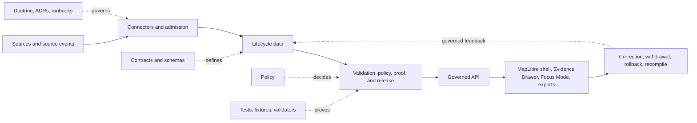

<!-- [KFM_META_BLOCK_V2]
doc_id: kfm://doc/repository/skeleton-map
title: Kansas Frontier Matrix Repository Skeleton Map
type: repository-orientation
status: maintained-orientation
created: 2026-05-08
updated: 2026-07-23
truth_posture: cite-or-abstain
canonical_relationship: root-level orientation surface; Directory Rules remains placement authority
owner: NEEDS VERIFICATION
reviewers: NEEDS VERIFICATION
source_baseline:
  path: SKELETON_MAP.md
  blob_sha: 7773646f618fbba90e19e3618210cd3bca30a6cb
  generated_snapshot_date: 2026-05-08
related:
  - README.md
  - docs/doctrine/directory-rules.md
  - docs/doctrine/trust-membrane.md
  - docs/doctrine/lifecycle-law.md
  - docs/architecture/
  - docs/adr/
  - control_plane/
notes:
  - "This document orients readers; it does not establish canonical placement, implementation maturity, release state, or publication state."
  - "The prior 3,071-line generated tree was replaced because a dated scaffold inventory can become misleading as the repository evolves."
[/KFM_META_BLOCK_V2] -->

<a id="top"></a>

# Kansas Frontier Matrix Repository Skeleton Map

[](#status-and-authority)
[](docs/doctrine/truth-posture.md)
[](docs/doctrine/lifecycle-law.md)
[](docs/doctrine/directory-rules.md)

**Purpose:** provide a compact orientation to KFM’s responsibility roots, trust membrane, lifecycle, contributor path, and verification boundaries without turning a generated directory listing into architecture authority.

> [!IMPORTANT]
> **This file is a map, not the territory.** It does not prove that every described path is implemented, complete, tested, secure, released, public-safe, or KFM-published. For placement decisions, consult [Directory Rules](docs/doctrine/directory-rules.md), current accepted ADRs, and the repository bytes at the ref being reviewed.

## Quick navigation

- [Status and authority](#status-and-authority)
- [How to read the repository](#how-to-read-the-repository)
- [Trust membrane](#trust-membrane)
- [Canonical lifecycle](#canonical-lifecycle)
- [Responsibility-root map](#responsibility-root-map)
- [Domain lanes](#domain-lanes)
- [Public, internal, and compatibility boundaries](#public-internal-and-compatibility-boundaries)
- [Contributor reading path](#contributor-reading-path)
- [Verification workflow](#verification-workflow)
- [Historical snapshot and change discipline](#historical-snapshot-and-change-discipline)

---

## Status and authority

| Field | Status |
|---|---|
| Document role | Repository orientation and navigation aid |
| Location | Root-level existing document retained in place |
| Placement authority | [Directory Rules](docs/doctrine/directory-rules.md), not this file |
| Architecture authority | Current doctrine and accepted ADRs |
| Current implementation claims | Must be verified against repository files, tests, workflows, manifests, logs, or generated outputs |
| Publication authority | None |
| Last substantive refresh | 2026-07-23 |
| Prior baseline | Generated 2026-05-08; 2,442-file / 789-directory scaffold claim retained as lineage, not current fact |

**CONFIRMED:** the previous edition described itself as a freshly generated greenfield scaffold and embedded a depth-limited tree with stated counts.

**NEEDS VERIFICATION:** current repository-wide file counts, directory counts, implementation completeness, workflow behavior, test coverage, runtime behavior, and publication state. This document deliberately does not restate those as current facts.

---

## How to read the repository

KFM is organized by **responsibility before topic**. A root exists because it carries a project-wide responsibility. Domain names such as hydrology, soil, geology, fauna, archaeology, or roads belong inside responsibility roots rather than becoming independent root authorities.



The diagram is an orientation aid. The lifecycle invariant below is governing doctrine; the other edges describe intended responsibility relationships and must be checked against current implementation evidence.

---

## Trust membrane

The normal public path is downstream of governance:

```text
released artifacts + governed services
        -> apps/governed-api
        -> apps/explorer-web / review surfaces / approved exports
```

The normal public path must not read directly from canonical or intermediate stores:

```text
data/raw
  -> data/work / data/quarantine
  -> data/processed
  -> data/catalog / data/triplets
  -> proof, review, and release gates
  -> data/published
```

| Surface | May do | Must not become |
|---|---|---|
| Governed API | Resolve released evidence, apply policy, return finite outcomes | A bypass to RAW, WORK, QUARANTINE, or unrestricted canonical stores |
| MapLibre shell | Render released layers and expose evidence context | Truth, policy, review, citation, or publication authority |
| Evidence Drawer | Present EvidenceBundle-backed support and limitations | A decorated popup sourced only from rendered feature properties |
| Focus Mode / AI | Interpret admitted evidence through governed envelopes | Root truth, source authority, release authority, or uncited fluent output |
| Watchers | Detect change and propose work | Publishers |
| Tiles, graphs, indexes, summaries | Carry derived information | Sovereign truth |

> [!CAUTION]
> A commit, pull request, merge, GitHub release, badge, map layer, generated report, or deployment does **not** by itself make material KFM `PUBLISHED`.

---

## Canonical lifecycle

```text
RAW -> WORK / QUARANTINE -> PROCESSED -> CATALOG / TRIPLET -> PUBLISHED
```

Promotion is a governed state transition, not a file move.

| Phase | Responsibility | Typical evidence needed before advancing |
|---|---|---|
| Pre-RAW / source edge | Identify source, event, role, rights, sensitivity, and intended use | Source identity, admission record, retrieval/event receipt |
| RAW | Preserve source bytes or immutable references | Hashes, retrieval metadata, source descriptor |
| WORK | Normalize, crosswalk, inspect, and prepare candidate records | Transform receipts, candidate identity, validation state |
| QUARANTINE | Hold unresolved, unsafe, conflicting, stale, or invalid material | Reason codes, obligations, review path |
| PROCESSED | Store validated non-public canonical records | Contract/schema validation, evidence and policy checks |
| CATALOG / TRIPLET | Emit governed discovery and relationship projections | Catalog/provenance closure; projections remain derived |
| PUBLISHED | Serve reviewed public-safe artifacts | Promotion decision, release manifest, proof, correction path, rollback target |

Where current repository objects differ from this table, record the difference as implementation evidence or drift; do not silently rewrite doctrine or call a historical scaffold canonical.

---

## Responsibility-root map

The table states the **responsibility contract**. Presence and maturity of any specific nested path still require current verification.

| Root | Primary responsibility | Key boundary |
|---|---|---|
| `.github/` | Repository workflows, templates, CODEOWNERS, automation hooks | Workflow presence is not proof that a check ran or passed |
| `docs/` | Human-facing doctrine, architecture, ADRs, runbooks, registers, domain explanations | Explains; does not replace contracts, schemas, policy, tests, or release evidence |
| `control_plane/` | Machine-readable governance maps and registers | Indexes authority; does not store source truth |
| `contracts/` | Semantic meaning of object families and interfaces | Meaning, not machine shape or admissibility |
| `schemas/` | Machine-checkable shape | Shape, not policy or publication authority |
| `policy/` | Allow, deny, restrict, hold, generalize, or abstain decisions | Decides admissibility; does not become canonical evidence |
| `tests/` | Enforceability proof and regression coverage | Passing tests do not prove publication, security, completeness, or source rights |
| `fixtures/` | Valid, invalid, denied, quarantined, stale, and public-safe samples | Test material, not production truth |
| `tools/` | Repository-wide validators, generators, builders, and checkers | Trust-bearing reusable tooling |
| `scripts/` | Small operational helpers | Long-lived trust logic should graduate to the correct responsibility root |
| `apps/` | Deployable applications and user-facing services | Public clients remain behind governed interfaces |
| `packages/` | Shared implementation libraries | Not a dumping ground for app-specific or source-specific logic |
| `connectors/` | Source-specific fetch and admission logic | Connectors may admit or quarantine; they do not publish |
| `pipelines/` | Executable lifecycle and transformation logic | Execution is not publication authority |
| `pipeline_specs/` | Declarative pipeline definitions | Says what should run; executable behavior lives elsewhere |
| `data/` | Lifecycle material, registries, receipts, proofs, catalogs, and published artifacts | Phase and object-family boundaries remain visible |
| `release/` | Promotion decisions, release manifests, corrections, withdrawals, and rollback records | Decisions are distinct from published artifact bytes |
| `runtime/` | Local adapters and runtime harnesses | Must remain subordinate to governed services |
| `infra/` | Deployment, network, host, access, and exposure controls | Prefer deny-by-default, least privilege, and auditability |
| `configs/` | Non-secret defaults and templates | Never store real secrets |
| `migrations/` | Governed schema, data, and graph transitions | Every material migration needs validation and rollback |
| `examples/` | Runnable, maintained examples | Examples must not overclaim support or bypass governance |
| `artifacts/` | Compatibility-only build, documentation, QA, or temporary output | Not a trust-bearing home for receipts, proofs, release manifests, or published data |

### Core authority split

| Question | Governing surface |
|---|---|
| Why does KFM behave this way? | `docs/` and accepted ADRs |
| What does an object mean? | `contracts/` |
| What shape must it have? | `schemas/` |
| May it be used or exposed? | `policy/` |
| Is the behavior enforceable? | `tests/`, `fixtures/`, validators, and observed runs |
| Was it promoted or released? | `release/`, proofs, receipts, and published artifacts |

---

## Domain lanes

Domains are bounded lanes that reuse the shared trust spine. A domain may appear under multiple responsibility roots because each root answers a different question.

```text
docs/domains/<domain>/
contracts/domains/<domain>/
schemas/contracts/v1/domains/<domain>/
policy/domains/<domain>/
tests/domains/<domain>/
fixtures/domains/<domain>/
packages/domains/<domain>/
pipelines/domains/<domain>/
pipeline_specs/<domain>/
data/<phase>/<domain>/
release/candidates/<domain>/
```

The exact path pattern must follow the current Directory Rules edition and accepted ADRs. The list above is an orientation pattern, not blanket proof that every path exists.

Common KFM domain lanes include hydrology, soil, atmosphere/air, geology and natural resources, habitat, fauna, flora, agriculture, hazards, roads/rail/trade, settlements/infrastructure, archaeology/cultural heritage, and people/genealogy/DNA/land. Each lane must preserve its own source roles, temporal model, sensitivity controls, evidence requirements, and public-safe transformations.

> [!WARNING]
> Do not collapse observations, interpretations, models, legal/administrative records, public-safe derivatives, and rendered layers into one authority surface merely because they share a topic or geometry.

---

## Public, internal, and compatibility boundaries

### Public-facing path

Public clients should consume only governed APIs, released artifacts, catalog records, approved tile services, public-safe exports, and EvidenceBundle-backed responses.

### Internal path

RAW, WORK, QUARANTINE, unpublished PROCESSED records, restricted proofs, model runtimes, steward-only review data, and precise sensitive geometry remain outside ordinary public access.

### Compatibility roots

Roots such as `ui/`, `web/`, `jsonschema/`, `policies/`, `styles/`, `viewer_templates/`, and `artifacts/` are compatibility or transitional surfaces unless an accepted ADR says otherwise. They must not evolve independently into parallel homes for canonical contracts, schemas, policy, release, receipts, proofs, or public truth.

---

## Contributor reading path

Use the smallest path that answers the current question:

1. Start with the root [README](README.md) for the repository’s current front door.
2. Read [Directory Rules](docs/doctrine/directory-rules.md) before proposing paths.
3. Read the applicable doctrine and architecture under `docs/doctrine/` and `docs/architecture/`.
4. Check accepted ADRs under `docs/adr/` for decisions that amend doctrine or placement.
5. Follow the object from `contracts/` to `schemas/`, `policy/`, fixtures, validators, and tests.
6. Inspect the relevant domain lane and source descriptors.
7. Trace the lifecycle through `pipelines/`, `data/`, proofs, and `release/`.
8. Verify the governed API and UI consume released interfaces rather than canonical stores.
9. Check correction, withdrawal, supersession, and rollback paths before calling a feature complete.

### Question-to-path guide

| Question | Start here |
|---|---|
| Where should a file live? | `docs/doctrine/directory-rules.md` and accepted ADRs |
| What is the system boundary? | `docs/architecture/` and trust-membrane doctrine |
| What does this object mean? | `contracts/` |
| What fields are required? | `schemas/` |
| Why was exposure denied or generalized? | `policy/` and decision records |
| What proves the behavior? | `tests/`, `fixtures/`, validators, workflow/run evidence |
| What was released? | `release/`, `data/published/`, proofs, and manifests |
| How can it be corrected or reversed? | correction notices, withdrawal notices, rollback records, migrations |

---

## Verification workflow

Before saying “the repository contains X” or “the system does Y”:

1. Pin the repository ref or commit.
2. Read the current file or directory bytes.
3. Check applicable instructions, doctrine, ADRs, contracts, schemas, and policy.
4. Verify representative tests, workflows, manifests, artifacts, logs, or runtime evidence when behavior matters.
5. Separate `CONFIRMED`, `PROPOSED`, `UNKNOWN`, and `NEEDS VERIFICATION` claims.
6. Distinguish current implementation from lineage, generated scaffolds, mirrors, examples, and compatibility surfaces.
7. Record drift rather than silently promoting convention to doctrine.

### Minimum claim evidence

| Claim | Minimum useful evidence |
|---|---|
| A path exists | Current tree or file read at a pinned ref |
| An object has a field | Current schema/contract inspection |
| A validator enforces a rule | Validator source plus representative test or observed run |
| A workflow protects a path | Workflow definition plus observed run/check evidence |
| A command works | Repository tooling plus successful execution in a safe environment |
| A layer or API is public-safe | Policy, release, evidence, and runtime proof—not rendering alone |
| Material is KFM `PUBLISHED` | Governed release evidence, review state, correction path, and rollback target |

---

## Historical snapshot and change discipline

The original edition was generated on **2026-05-08** and described a greenfield scaffold containing **2,442 files and 789 directories**. Those figures are preserved here as **lineage only**. They must not be interpreted as current repository counts without a fresh tree scan.

The previous document embedded a multi-thousand-line depth-limited tree. That tree was useful as a generation receipt, but it became a high-staleness, low-signal orientation surface. This edition replaces it with responsibility-root contracts and a verification workflow.

To inspect current structure, use the repository tree at the exact branch or commit under review. To preserve historical structure, use Git history for this path rather than copying the old tree into a second authority surface.

### Maintenance rules

- Update this file when responsibility roots, trust boundaries, contributor reading order, or the canonical lifecycle materially change.
- Do not update dates merely to make the document appear current.
- Do not add file counts unless generated from a pinned ref and labeled as a snapshot.
- Do not list a workflow, route, package, validator, or source as implemented without current evidence.
- Preserve same-path identity unless a separately authorized migration and ADR justify a move.
- Keep this document concise; detailed inventories belong in machine-readable registers or generated reports with provenance.

### Rollback

Before merge, rollback is to close or abandon the draft PR. After merge, revert the documentation commit. The prior generated tree remains recoverable through Git history; no parallel legacy copy is required.

---

## Final orientation law

**Use this file to find the governing surface, not to bypass it.** Responsibility roots explain ownership; lifecycle phases explain state; contracts and schemas explain meaning and shape; policy explains admissibility; tests and receipts explain enforceability; release records explain publication; correction and rollback explain reversibility.

[Back to top](#top)
