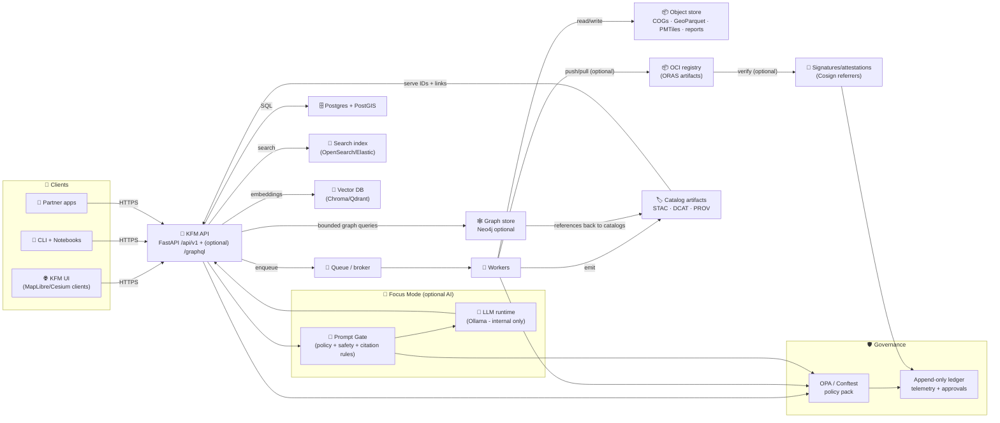
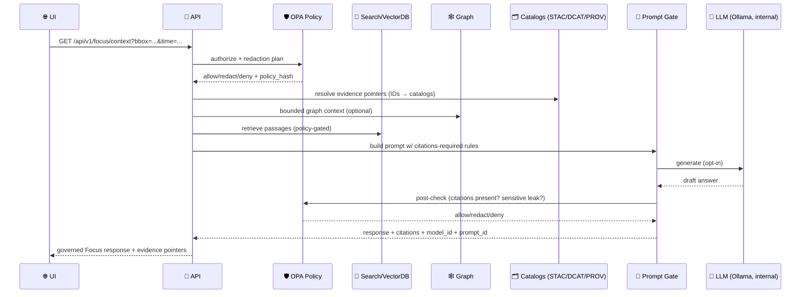

<!--
📌 This README defines the governed backend boundary for KFM (Kansas Frontier Matrix).
🗓️ Last updated: 2026-01-26
🧾 Contract posture: OpenAPI-first (contract-first) + GraphQL-optional
🔒 Default stance: fail-closed (deny / redact unless proven)
🧠 AI posture: evidence-bounded, opt-in, policy-scanned (Prompt Gate)
-->

<a id="top"></a>

# 🚪 KFM API 🛰️🗺️  
_Backend + integration trust boundary for the Kansas Frontier Matrix (KFM) platform_

<p align="left">
  
  
  
  
  
  
  
  
  
  
  
  
  
  
  
  
  
  
  
  
  
  
</p>

> [!IMPORTANT]
> **KFM invariant (non‑negotiable):**  
> **ETL → STAC/DCAT/PROV → Graph → APIs → UI → Story Nodes → Focus Mode**  
> The API is the **governed trust boundary**: it must not serve “mystery data” that isn’t **cataloged**, **provenance‑linked**, and **policy‑checked**. ✅🧾

> [!IMPORTANT]
> **Single entry point (non‑negotiable):**  
> The API is the only supported route from **UI/clients → data/graph/search/LLM**. No direct UI-to-DB, UI-to-graph, UI-to-index, or UI-to-LLM calls inside governed deployments. 🔒🧱

> [!IMPORTANT]
> **Integrity invariant (non‑negotiable):**  
> Published artifacts must be **digest-addressed**, and promotion-to-public requires **verifiable integrity** (signatures/attestations where configured). No “floating latest” binaries in governed flows. 🔏📦

> [!IMPORTANT]
> **Focus Mode hard gate (non‑negotiable):**  
> Focus Mode displays **only provenance‑linked content**. Any AI contribution must be **opt‑in**, **clearly labeled**, **bounded by evidence**, and **policy-scanned** (no side‑channel leaks). 🧠🔒

> [!CAUTION]
> **Fail‑closed is the default.** If a route cannot prove **license + classification + provenance**, it must refuse (or return a redacted, policy-compliant view). 🚫✅

---

<a id="quick-links"></a>

## 🔗 Quick links
**Docs & runtime**
- 🧪 Swagger (OpenAPI UI): `/docs`
- 📕 ReDoc: `/redoc`
- 🧾 OpenAPI JSON: `/openapi.json`
- 🧬 GraphQL endpoint (optional): `POST /graphql`
- 🧪 GraphQL Playground (dev-only, optional): `GET /graphql`
- ❤️ Health: `/api/v1/health`
- 🧭 Version/meta: `/api/v1/meta/version`
- 🪪 Citation guidance (software + data releases): `/api/v1/meta/citation` *(target)*
- 📈 Metrics (optional): `/metrics`
- 🧵 Tracing (optional): OpenTelemetry exporter (config)

**Catalog + provenance**
- 🗂️ STAC root: `/api/v1/catalog/stac`
- 🏷️ DCAT datasets: `/api/v1/catalog/dcat` *(implementation-specific)*
- 🧬 PROV run lineage: `/api/v1/prov/runs/{run_id}`
- 🧾 Evidence bundle (Story/Focus): `/api/v1/evidence/bundles/{bundle_id}`

**Maps + tiles (experience-critical)**
- 🧱 Layer registry: `/api/v1/layers` *(target)*
- 🗺️ Vector tiles (MVT): `/api/v1/layers/{layer_id}/tile/{z}/{x}/{y}.pbf` *(target)*
- 🧳 PMTiles (offline-first): `/api/v1/layers/{layer_id}.pmtiles` *(target; Range-supported)*
- 🧾 TileJSON: `/api/v1/layers/{layer_id}/tilejson.json` *(target)*
- 🎨 Style JSON: `/api/v1/styles/{style_id}.json` *(target)*

**Search + discovery**
- 🔎 Unified search: `/api/v1/search?q=...` *(target)*
- 🧭 Gazetteer / place lookup: `/api/v1/gazetteer/search?q=...` *(target)*

**Integrity + governance (targets)**
- 🧪 Dataset contract validation: `/api/v1/contracts/datasets/validate` *(policy-gated)*
- 🧪 Run manifest validation: `/api/v1/contracts/manifests/validate` *(policy-gated)*
- 🔏 Artifact verification: `/api/v1/artifacts/verify` *(policy-gated)*
- 🕸️ Graph integrity check: `/api/v1/integrity/graph/check` *(privileged)*
- 🧠 Narrative pattern scan: `/api/v1/integrity/narratives/scan` *(privileged)*
- 🧠 Focus/LLM prompt gate check: `/api/v1/integrity/prompt_gate/check` *(privileged; target)*

**Experience surfaces**
- 🧠 Focus Mode context bundle: `/api/v1/focus/context` *(policy-gated)*
- 🧵 Pulse Threads (timeline feed): `/api/v1/pulse_threads` *(policy-gated)*
- 🧠 Concepts / Attention Nodes: `/api/v1/concepts` *(policy-gated)*
- 📡 Job stream (WS/SSE): `/ws/jobs/{job_id}` *(if enabled)*

Repo navigation (typical):
- 🧭 Project overview: `../README.md`
- 🧠 Master guide (repo authority): `../docs/MARKDOWN_GUIDE_v13.md.gdoc` *(or later)*
- 🚪 Backend code (recommended): `../api/` *(current)* or `../src/server/` *(target consolidation)*
- 📦 Data + metadata boundary: `../data/README.md`
- 🧰 Tooling boundary: `../tools/README.md`
- 🧪 Tests: `../tests/README.md`
- 🧾 Stories: `../docs/stories/` *(or `../docs/reports/story_nodes/` target)*
- 🔌 Agent/tool adapters (optional): `../mcp/` *(governed, allowlisted)*

---

<a id="doc-metadata"></a>

## 🧾 Doc metadata

| Field | Value |
|---|---|
| Doc | `api/README.md` |
| Status | WIP 🚧 (contract-first) |
| Last updated | **2026-01-26** |
| Version | **v1.6.0** |
| Prime directive | **Serve only governed evidence** (IDs + catalogs + provenance) |
| Default stance | deny-by-default 🔒, hostile-input aware 🧯, audit-ready 🧾 |
| Canonical order | **ETL → STAC/DCAT/PROV → Graph → API → UI → Story → Focus** |
| “Public” definition | **licensed + classified + provenance-linked + policy-approved** (not “available somewhere”) |
| Integrity baseline | digest-addressed artifacts + run manifests + (optional) signatures/attestations |
| GraphQL posture | optional, governed, cost-limited; never bypasses REST gates 🧬🛡️ |
| AI posture | internal-only runtime; Prompt Gate + citation enforcement; opt-in + labeled 🧠✅ |
| Automation safety | global kill-switch + receipts + human review required 🧊 |
| UI contract drivers | timeline slider, layer provenance panel, Story Nodes (MD+JSON), Focus Mode (citations) |

---

<a id="toc"></a>

## 🧭 Table of contents
- [🧠 Master guide alignment](#master-guide-alignment)
- [🧩 What this README governs](#what-this-readme-governs)
- [📖 Glossary](#glossary)
- [⭐ API north stars](#api-north-stars)
- [🧰 Hard gates and policy pack](#hard-gates-and-policy-pack)
- [🧱 Architecture snapshot](#architecture-snapshot)
- [🗂️ Evidence model](#evidence-model)
- [📦 Data lifecycle](#data-lifecycle)
- [🔎 Search and retrieval](#search-and-retrieval)
- [🧬 GraphQL boundary and cost controls](#graphql-boundary-and-cost-controls)
- [📦 Artifact registry and signatures](#artifact-registry-and-signatures)
- [🧵 Pulse Threads and attention graph](#pulse-threads-and-attention-graph)
- [🔎 Integrity and drift](#integrity-and-drift)
- [📊 Telemetry and governance ledger](#telemetry-and-governance-ledger)
- [🧠 Story Nodes and Focus Mode](#story-nodes-and-focus-mode)
- [🧠 Focus Mode AI pipeline](#focus-mode-ai-pipeline)
- [🤖 Automation control plane](#automation-control-plane)
- [🧵 Async jobs and deterministic replay](#async-jobs-and-deterministic-replay)
- [📡 Real-time and streaming data](#real-time-and-streaming-data)
- [📜 Contracts and schemas](#contracts-and-schemas)
- [🧾 Data contracts](#data-contracts)
- [🔐 Authentication and authorization](#authentication-and-authorization)
- [🧯 Threat model](#threat-model)
- [🛡️ Security and privacy](#security-and-privacy)
- [🗺️ Geospatial conventions](#geospatial-conventions)
- [🌐 Federation and data spaces](#federation-and-data-spaces)
- [📦 Offline packs and 3D/AR delivery](#offline-packs-and-3dar-delivery)
- [🤝 Community contributions and moderation](#community-contributions-and-moderation)
- [🧩 Endpoint map](#endpoint-map)
- [🧪 Example flows](#example-flows)
- [✅ Definition of done](#definition-of-done)
- [🗺️ Roadmap](#roadmap)
- [🤝 Contributing](#contributing)
- [📚 Reference library influence map](#reference-library-influence-map)
- [📎 Sources](#sources)
- [📦 Embedded portfolio index](#embedded-portfolio-index)
- [🕰️ Version history](#version-history)

---

<a id="master-guide-alignment"></a>

## 🧠 Master guide alignment

This README is **not** the top-level authority. It inherits from the repo’s **Master Guide** (v13 or later) which defines the canonical ordering and what “counts” as a real artifact in KFM.  [oai_citation:0‡Kansas Frontier Matrix (KFM) – AI System Overview 🧭🤖.pdf](file-service://file-P4zHoJicw1HG6bXmqFygG8)

Master Guide alignment highlights:
- 🧭 canonical subsystem ordering: **data → catalogs → graph → API → UI → narrative → Focus**
- 🧩 contract artifacts as first-class outputs: OpenAPI, GraphQL schema, JSON Schemas, UI configs
- 🧾 evidence artifacts as first-class datasets: registered in **STAC/DCAT** with **PROV lineage**
- 🏷️ sovereignty + governance rules (FAIR/CARE), classification propagation, no sensitive leaks
- 🧪 CI gates (schema validation, contract diffs, redaction tests, policy checks)
- 🔏 integrity posture (run manifests, hash discipline, optional signing + attestations)

> [!TIP]
> If you’re unsure “where a change belongs,” consult the Master Guide first. This file governs the **backend trust boundary** only.

---

<a id="what-this-readme-governs"></a>

## 🧩 What this README governs

✅ **In scope (this document)**
- 🚪 API contract + versioning (OpenAPI-first)
- 🧬 Optional GraphQL contract (governed + cost-limited; never a bypass)
- 🧾 Evidence gating (STAC/DCAT/PROV + stable IDs)
- 🔒 AuthN/AuthZ + policy enforcement (OPA/Conftest pack)
- 🔏 Artifact integrity rules (digests, manifests, signing where configured)
- 🧱 Tiles + map delivery contracts (PMTiles/MVT/COG, Range + caching rules)
- 🧵 Jobs + replay posture (idempotency, receipts, deterministic runs)
- 🤖 Automation boundary (Watcher → Planner → Executor) + kill-switch + receipts
- 🧠 Story/Focus serving contract (citations required, AI opt-in, Prompt Gate)
- 📊 Telemetry + governance ledger emission (audit-ready defaults)

🚫 **Out of scope (elsewhere)**
- 🧪 ETL pipeline implementation details (belongs in `pipelines/` or `src/pipelines/`)
- 🌐 UI implementation details (belongs in `web/` or `src/ui/`)
- 🕸️ Full ontology design (belongs in `docs/ontology/` + graph schema)
- 🧾 Full governance policy texts (belongs in `policies/` + legal docs)

---

<a id="glossary"></a>

## 📖 Glossary

| Term | Meaning (KFM boundary meaning) |
|---|---|
| `tenant_id` | Multi-tenant scope boundary (org/community boundary) |
| `dataset_id` | Stable ID for a dataset definition (`domain + name + version`) |
| `layer_id` | Stable ID for a spatial asset layer (vector/raster/tile layer) |
| `run_id` | Stable ID for a provenance-tracked run (ETL/analysis/sim/export) |
| `job_id` | Ephemeral execution handle for async work (maps to `run_id` when published) |
| `bundle_id` | Evidence bundle ID (Story/Focus consumption unit) |
| `graph_id` | Stable entity ID in the knowledge graph (place/event/doc/person/etc.) |
| `concept_id` | Stable “Conceptual Attention Node” ID (meaning layer linked to evidence) |
| `pulse_thread_id` | Time-ordered thread for verified observations + run summaries |
| `artifact_ref` | Digest-addressed artifact reference (e.g., `...@sha256:<digest>`) |
| `canonical_digest` | Deterministic hash over canonical JSON manifest (idempotency anchor) |
| `decision_id` | Governance decision record (approvals, redactions, waivers) |
| `waiver_id` | Explicit policy waiver (time-bounded; never silent) |
| `policy_hash` | Hash/version of policy bundle used for an authz/redaction decision |
| `request_id` | Traceable request correlation ID across logs/traces/ledger |
| `etag` | HTTP cache validator used for conditional requests + safe revalidation |
| `watermark` | Streaming ingest marker for “up to here we’re consistent” |
| `model_id` | AI model identifier (e.g., Ollama model tag) for Focus Mode outputs |
| `prompt_id` | Versioned prompt/template identifier (Prompt Gate) |
| “published” | **cataloged + provenance-linked + policy-approved** (not “file exists”) |
| “fail-closed” | If governance cannot be proven: deny or redact (never “best effort”) |
| “windowing” | Streaming data stored as append-only observations partitioned by time |

---

<a id="api-north-stars"></a>

## ⭐ API north stars

KFM’s backend exists to support **truthful, reproducible, human‑centered** decision support — not vibes, not persuasion. 🧠🧾

- 🧾 **Provenance-first:** every dataset/derivative/model output is evidence-linked (STAC/DCAT/PROV + stable IDs).
- 🧩 **Contract-first:** OpenAPI ships the interface; breaking changes require versioning and diff gates.
- 🧬 **GraphQL is optional, not special:** if enabled, it is governed like REST and cost-limited.
- 🏷️ **Catalog-gated:** if it isn’t cataloged and lineage-linked, it isn’t “real” in KFM.
- 🔒 **Governance always-on:** classification, licensing, redaction, and “no privacy downgrade” rules are enforced.
- 🔏 **Integrity-by-default:** promoted artifacts are digest-addressed; runs produce manifests; signatures/attestations enforced where configured.
- 🧠 **Focus Mode hard gate:** no unsourced content appears in Focus Mode (AI is opt-in, labeled, bounded).
- 🎲 **Reproducible by default:** jobs store params + versions + run receipts; results are never “magic.”
- ❤️ **Human autonomy:** explanation hooks, audit trails, and safe defaults prevent automation complacency.
- 🌾 **FAIR+CARE-aware:** “open” ≠ “safe”; cultural protocols and sensitive locations are protected.
- 🧳 **Offline-first compatible:** PMTiles/COG/GeoParquet served with integrity + policy envelopes (never “just a file”).

---

<a id="hard-gates-and-policy-pack"></a>

## 🧰 Hard gates and policy pack

KFM treats governance as correctness. This API participates in enforcement and must not provide bypasses.

### ✅ Minimum automated gates (baseline)
These gates run **before publish**, and again at **serve-time** (deny/redact):

- 🧾 Contract validation (OpenAPI + JSON Schemas + (optional) GraphQL schema)
- 🗂️ STAC/DCAT/PROV completeness (required fields present)
- 🧼 Data quality checks (schema sanity, missingness thresholds, geometry validity) ✅
- 🏷️ License presence (block unknown license when configured)
- 🔐 Classification presence + propagation (outputs cannot downgrade inputs)
- 🧬 Provenance completeness (inputs/activities/outputs declared)
- 🔏 Run manifest present for publish (`canonical_digest` computed; params pinned)
- 🔏 Artifact integrity checks (digest present; signatures/attestations required if policy says so)
- 🕸️ Graph integrity checks (no broken evidence links; bounded traversals)
- 🧠 Story/Focus integrity checks (citations present; AI blocks labeled; pattern scan when enabled)
- 🧬 GraphQL cost controls (depth/complexity/timeouts; persisted queries where required)
- 🧯 Hostile input checks (uploads/parsers/archives treated as unsafe by default)
- 🧊 Automation safety checks (kill-switch honored; receipts written; human review required)

### 🧾 Policy waivers (allowed, but governed)
Waivers happen (legacy sources, emergency fixes). When used:
- must be explicit (`waiver_id`) ✅
- must be time-bounded (expiry) ⏳
- must be written to the governance ledger 🧾
- must never downgrade classification 🔒

### 🧊 Kill switch (automation safety)
Any automation that can write artifacts (agents, scheduled updaters, pipeline runners) must support a **global kill switch** (env/config + repo sentinel file) that freezes automated changes instantly.

> [!NOTE]
> Policy-as-code can be implemented with OPA/Rego and tested with Conftest, but the principle is the key:  
> **no merge, no publish, no serve** if governance can’t be proven.

---

<a id="architecture-snapshot"></a>

## 🧱 Architecture snapshot

KFM favors clean boundaries: frameworks are adapters, not the core. 🧼🏛️

### Layers (recommended)
- 💠 **Domain** — entities + invariants (pure Python; no framework imports)
- 🧠 **Application** — use cases (policy decisions, orchestration, authz, receipts)
- 🔌 **Adapters** — FastAPI routes, GraphQL resolvers, repositories, external clients
- 🧱 **Infrastructure** — PostGIS, graph store, search index, vector DB, queues, object storage / OCI registry

### 🧩 Recommended backend repo layout (target) 🗂️
```text
📦 src/server/
├─ 💠 domain/                 # entities + invariants
├─ 🧠 app/                    # use-cases (authz, publish, focus, jobs)
├─ 🔌 adapters/
│  ├─ 🌐 http/                # FastAPI routes + middleware
│  ├─ 🧬 graphql/             # resolvers + schema adapters
│  └─ 🗄️ repos/               # DB/graph/search repos
├─ 🧱 infra/
│  ├─ 🗄️ postgis/             # migrations, SQL, tuning notes
│  ├─ 🕸️ graph/               # Neo4j optional
│  ├─ 🔎 search/              # OpenSearch/Elastic
│  ├─ 🧠 vectordb/            # Chroma/Qdrant
│  ├─ 📦 storage/             # object store + presigned URLs + OCI (ORAS)
│  └─ 🧵 queue/               # broker, workers
├─ 📜 contracts/
│  ├─ openapi.yaml
│  ├─ graphql.schema.graphql  # optional
│  └─ jsonschema/             # evidence bundle, manifests, datasets, events…
├─ 🛡️ policies/               # OPA/Conftest pack + fixtures
└─ 🧪 tests/                  # contract + policy + integration tests
```

### 🔁 Runtime shape (typical)


> [!IMPORTANT]
> **Catalogs are the gate.** Pipelines/workers emit STAC/DCAT/PROV so downstream (graph/UI/Focus) can trust what it sees. 🗂️✅

---

<a id="evidence-model"></a>

## 🗂️ Evidence model

KFM’s “truth” is not a blob of bytes — it’s a **governed evidence graph**.

### Evidence primitives
- **Stable IDs:** `dataset_id`, `layer_id`, `run_id`, `bundle_id`, `graph_id`, `concept_id`, `pulse_thread_id`
- **Catalog artifacts:** STAC (spatial assets), DCAT (datasets & distributions), PROV (lineage)
- **Policy envelope:** classification + license + redaction + protocol flags (FAIR/CARE-aware)
- **Receipts:** job/run receipts with parameters, versions, and output pointers
- **Integrity signals:** digests + optional signatures/attestations + SBOM refs (if enabled)

### Evidence pointers (recommended response shape)
Every route returning user-visible data should include a compact pointer block (or a link to it):

```json
{
  "evidence": {
    "dataset_id": "kfm.<domain>.<dataset>.v1",
    "run_id": "kfm.run.<pipeline>.<timestamp>",
    "stac": {
      "collection_id": "kfm.stac.collection.<id>",
      "item_ids": ["kfm.stac.item.<id>"]
    },
    "dcat_dataset_id": "kfm.dcat.<id>",
    "prov_run_id": "kfm.prov.run.<id>",
    "artifacts": [
      {
        "kind": "cog",
        "artifact_ref": "oci://ghcr.io/kfm/artifacts/kfm.<id>@sha256:<digest>",
        "digest": "sha256:<digest>"
      }
    ],
    "classification": "public",
    "license": "CC-BY-4.0"
  },
  "policy": {
    "decision": "allow|redact|deny",
    "policy_hash": "sha256:<policy-bundle-digest>",
    "decision_id": "kfm.decision.<id>",
    "waiver_id": null
  },
  "trace": {
    "request_id": "req_<uuid>",
    "ts": "2026-01-26T00:00:00Z"
  }
}
```

### Evidence bundles (Story/Focus boundary) 🎒
Story Nodes + Focus Mode consume **evidence bundles** that contain:
- citations + identifiers (not freeform claims)
- asset pointers (STAC/DCAT/PROV IDs + signed URLs where policy permits)
- graph entity references (`graph_id`s) and concept references (`concept_id`s)
- redaction hints (sensitive sites, location generalization level, protocol constraints)
- optional integrity pointers (artifact digests, signature refs, SBOM refs)
- optional AI envelope (only if used): `model_id`, `prompt_id`, `retrieval_trace`, refusal flags

---

<a id="data-lifecycle"></a>

## 📦 Data lifecycle

KFM treats staging + metadata emission as part of correctness. ✅

### Recommended repo staging (Master Guide aligned) 🗂️
```text
📦 data/
├─ 🧱 raw/<domain>/                       # raw sources (immutable)
├─ 🧪 work/<domain>/                      # intermediate artifacts (not published)
├─ ✅ processed/<domain>/                 # publish candidates (stable + reviewed)
├─ 🗂️ stac/
│  ├─ 🧾 collections/                     # STAC Collections (JSON)
│  └─ 🧾 items/                           # STAC Items (JSON)
├─ 🏷️ catalog/
│  └─ 🧾 dcat/                            # DCAT datasets + distributions (JSON/TTL)
├─ 🧬 prov/                               # PROV lineage bundles (JSON-LD)
└─ 🧾 contracts/                          # dataset.contract.json (optional colocation)

📦 docs/
└─ 📚 stories/                            # Story Nodes (Markdown + JSON scripts)

📦 artifacts/                              # optional, recommended
├─ 🧾 manifests/                           # run.manifest.json (canonical digests)
├─ 🔏 signatures/                          # verification reports (if enabled)
├─ 🧪 sbom/                                # SBOM artifacts (if enabled)
└─ 🌱 sustainability/                      # energy/compute reports (if enabled)
```

> [!TIP]
> For large datasets, consider **DVC (Data Version Control)** and/or object storage + manifests for reproducible dataset versioning — but still enforce STAC/DCAT/PROV + policy gates before “published.” 🧾📦

### The “publish” rule 🏷️🚫
A dataset (or analysis/simulation output) is **not published** until:
1) stable artifact exists (DB/object store and/or OCI registry), **and**  
2) STAC/DCAT/PROV boundary artifacts exist, **and**  
3) policy checks pass (classification/license/redaction/protocols), **and**  
4) graph references (if applicable) resolve to canonical entities, **and**  
5) run manifest + canonical digest is recorded (and signatures pass where required).

### Streaming data (append-only, windowed) ⏱️
- treat each observation as **append-only**
- partition (window) by day/week/year
- do not rewrite history silently — publish new windows/versions
- use **idempotency keys + watermarks** to avoid duplicates
- prefer conditional fetch (ETag / If-None-Match) when polling sources

---

<a id="search-and-retrieval"></a>

## 🔎 Search and retrieval

Search powers:
- dataset discovery (DCAT/STAC search + text search)
- document exploration (reports, archival texts, story content)
- Focus Mode retrieval (evidence-first RAG) 🧠🧾

### Recommended posture (hybrid, governed)
- 🔎 **Full-text index** (OpenSearch/Elastic) over documents + story content
- 🧠 **Vector similarity (embeddings)** for semantic passage retrieval (Chroma/Qdrant)
- 🕸️ **Graph retrieval** for entity linking + disambiguation (bounded)
- 🗄️ **PostGIS queries** for numeric/statistical/spatial facts
- 🧭 **Gazetteer** for place-name → geometry resolution (policy-gated)

> [!IMPORTANT]
> Retrieval must be **policy-gated**: classification + redaction must apply **before** content becomes eligible to be retrieved or shown.

---

<a id="graphql-boundary-and-cost-controls"></a>

## 🧬 GraphQL boundary and cost controls

GraphQL is a great fit for **UI graph exploration** (entity relationships, story graph traversal), but it must remain governed and bounded.

### When to use GraphQL ✅
- UI asks “what is connected to this entity?” (People ↔ Events ↔ Places ↔ Documents)
- Need shaped responses for panels/cards without many REST round trips
- Disambiguation workflows (gazetteer + graph hints)

### When NOT to use GraphQL 🚫
- bulk exports (use jobs + artifacts)
- tiles/rasters (use REST with Range/caching)
- unbounded traversals (GraphQL must refuse by policy)

### Required GraphQL governance controls 🛡️
- query depth limit (max hops)
- complexity scoring / cost budgeting (deny expensive)
- timeouts and resolver budgets (fail-fast)
- pagination required on lists
- persisted queries for public clients (optional, recommended)
- policy checks inside resolvers (same as REST)
- telemetry includes `request_id` + `policy_hash` + (optional) `graph_query_hash`

> [!NOTE]
> GraphQL is never a bypass: the same **evidence + policy envelope** rules apply as REST. 🧾🔒

---

<a id="artifact-registry-and-signatures"></a>

## 📦 Artifact registry and signatures

KFM can store promoted artifacts in object storage **and/or** as **OCI artifacts** (strong integrity + reproducible distribution). 📦🔏

### Why OCI artifacts help KFM
- digest addressing becomes first-class (no ambiguous “latest”)
- distribution is easier (pull by digest)
- signatures/attestations are natural (Cosign referrers)
- offline packs can reference stable bundles by digest

### Map artifacts & Range support (performance + offline) 🗺️⚡
- **COGs** (Cloud-Optimized GeoTIFF) are served with HTTP Range support for efficient partial reads.
- **PMTiles** are served with HTTP Range support for offline-first and cheap distribution.
- **GeoParquet** supports vector + time-window analytics; served as artifacts (download/job output) and queryable via PostGIS or lakehouse patterns.

> [!TIP]
> Treat “publish” as a **content-addressed release** — not a folder copy. ✅

---

<a id="pulse-threads-and-attention-graph"></a>

## 🧵 Pulse Threads and attention graph

KFM’s UI is a **timeline-driven living atlas**. Two backend primitives help scale that experience while staying governed:

### 1) Pulse Threads 🧵⏱️
A Pulse Thread is a time-ordered feed of **verified observations** + **run summaries**, each linked to evidence.

**Rules**
- append-only events
- each event includes `evidence` pointers (`run_id` / `bundle_id` + catalog IDs)
- classification/redaction apply at the event level (no downgrade)
- time-windowed storage supports “time geography” exploration 🕰️🗺️

### 2) Conceptual Attention Nodes 🧠🧩
A Concept node (`concept_id`) is a governed “meaning layer” between evidence and story:
- anchored to evidence (datasets/runs/bundles)
- attached to ontology fragments (domain definitions)
- reusable across Story Nodes, Focus Mode, and analytics
- supports safe summarization without freeform hallucination

> [!IMPORTANT]
> Concepts do **not** replace evidence; they point to it and structure it. 🧾✅

---

<a id="integrity-and-drift"></a>

## 🔎 Integrity and drift

### 🕸️ Graph health (recommended)
Validate:
- orphan nodes (no evidence/inbound refs)
- broken refs (graph → STAC/DCAT/PROV IDs that don’t resolve)
- classification mismatches (potential leaks)
- bounded traversal constraints (no unbounded exports)

Outputs become evidence:
- telemetry events + `run_id`
- integrity report artifact (cataloged, provenance-linked)

### 🧠 Narrative integrity (optional but powerful)
- flag unsupported claims (missing citations)
- detect suspicious templated text bursts (spam/brigading)
- enforce AI labeling + reviewer sign-off
- drift in repeated story claims (“what changed? why?”)
- misinformation resistance patterns (moderation assist) 🧯📰

### 📉 Data + model drift
For streaming feeds and deployed models:
- drift metrics recorded per window
- policy can require review if thresholds exceed
- outputs published as evidence artifacts

---

<a id="telemetry-and-governance-ledger"></a>

## 📊 Telemetry and governance ledger

KFM’s trust posture depends on **auditability**.

### Telemetry (required posture)
- structured events with `request_id`, `run_id`, `job_id`, actor (user/agent), and policy result
- append-only logging (ledger/NDJSON) for ingestion gates + Focus Mode interactions
- include policy version/hash (`policy_hash`) so decisions can be replayed
- metrics: metadata completeness, citation coverage, schema failures, policy violations
- optional sustainability metrics for heavy pipelines (policy-gated)

### Governance ledger (recommended posture)
Tamper-evident records for:
- approvals (FAIR/CARE-sensitive datasets)
- policy outcomes (checked / pass / fail / waiver)
- automation activity (plans, diffs, receipts)
- integrity verification (digests, signature checks)
- sustainability signals (energy/compute footprint) where required

> [!TIP]
> If it can’t be replayed or audited, it can’t be promoted to “published evidence.” 🧾

---

<a id="story-nodes-and-focus-mode"></a>

## 🧠 Story Nodes and Focus Mode

Story + Focus are where KFM becomes a **governed, interactive storybook** 📖🗺️ — and where governance pressure is highest.

### Story Nodes (governed narrative artifacts) 🧷
A valid Story Node:
- 🧾 cites every factual claim (cataloged sources)
- 🧩 references graph entities (`graph_id`s) and Concepts (`concept_id`s)
- 🧠 distinguishes fact vs interpretation (especially if AI-assisted)
- 🏷️ inherits classification (no narrative can downgrade sensitivity)
- 🔏 includes integrity hooks where applicable (artifact digests + manifests)

**Authoring posture**
- narrative: Markdown (single H1; consistent headings; callouts ok) 📄✨
- interaction logic: JSON “story script”
- version-controlled + reviewed like code
- future-friendly: visual story builder can generate the same MD+JSON

### Focus Mode (interactive, provenance-linked) 🧠🔎
Focus Mode must:
- ✅ display only provenance-linked content (hard gate)
- 🧠 treat AI as opt-in + labeled + evidence-bounded
- 🔒 prevent sensitive location leaks (generalize/blur/omit)
- 🧾 provide click-through: everything resolves back to evidence pointers
- 🧊 never take actions on the user’s behalf (advisory-only)

> [!IMPORTANT]
> Focus Mode is not “a chatbot endpoint.” It’s a **policy-gated evidence synthesizer** that refuses if evidence is insufficient.

---

<a id="focus-mode-ai-pipeline"></a>

## 🧠 Focus Mode AI pipeline

If AI is enabled, it must sit **behind** a Prompt Gate and produce **auditable, evidence-bounded** outputs only.  [oai_citation:1‡KFM AI Infrastructure – Ollama Integration Overview.pdf](file-service://file-HCn72HddNvaaXqpJL4svTv)

### Focus Mode “Prompt Gate” (concept)
Prompt Gate is the enforcement layer that:
- assembles retrieval context (policy-gated)
- blocks prompt injection patterns
- enforces citation requirements (no citations → refuse or return evidence-only)
- records `model_id`, `prompt_id`, and `policy_hash` for audit
- optionally scans output for unsafe patterns and sensitive location leakage

### Sequence (typical)


### Focus response (recommended shape)
```json
{
  "mode": "focus",
  "answer": {
    "text": "…",
    "ai_used": true,
    "model_id": "ollama:<model>",
    "prompt_id": "kfm.prompt.focus.v3",
    "confidence": "low|medium|high",
    "limitations": ["…"]
  },
  "citations": [
    {
      "bundle_id": "kfm.bundle.<id>",
      "dataset_id": "kfm.<domain>.<dataset>.v1",
      "stac_item_id": "kfm.stac.item.<id>",
      "prov_run_id": "kfm.prov.run.<id>"
    }
  ],
  "evidence": { "…": "…" },
  "policy": {
    "decision": "allow|redact|deny",
    "policy_hash": "sha256:<...>",
    "decision_id": "kfm.decision.<id>"
  },
  "trace": { "request_id": "req_<uuid>" }
}
```

> [!CAUTION]
> If the model cannot cite evidence, the system must **refuse** or return a strictly **evidence-only** payload (no narrative). Fail-closed applies to AI too. 🚫🧾

---

<a id="automation-control-plane"></a>

## 🤖 Automation control plane

KFM automation is governed and **never silent**:  
**Watcher → Planner → Executor** (WPE) is the reference pattern. 🧿🧠🛠️

### Roles
- 🧿 **Watcher**: monitors feeds/sources; detects changes; produces candidate work items (no publish).
- 🧠 **Planner**: proposes a plan/diff with evidence pointers (no publish).
- 🛠️ **Executor**: performs approved actions (ingest, reprocess, publish) and emits receipts.

### Non-negotiable automation rules ✅
- global kill-switch must halt Watcher/Planner/Executor immediately 🧊
- no auto-merge; human review required for publish/promote 👤✅
- every action emits receipts to ledger (`decision_id`, `policy_hash`, `run_id`) 🧾
- classification cannot be downgraded by automation 🔒
- “floating latest” is forbidden; artifact digests required 🔏

---

<a id="async-jobs-and-deterministic-replay"></a>

## 🧵 Async jobs and deterministic replay

Use jobs when:
- rasters/windows are large
- compute is heavy (ML, simulation, mosaics)
- external services are involved
- outputs need governance promotion

### Common pattern ✅
1) `POST` creates job → returns `job_id`  
2) worker executes → writes artifacts (object store / OCI registry / DB)  
3) worker emits STAC/DCAT/PROV  
4) worker writes `run.manifest.json` + digest (and signatures if required)  
5) API exposes results by:
   - `GET /jobs/{job_id}` + `GET /jobs/{job_id}/result`
   - catalog endpoints once “published”

### Deterministic replay posture
Simulation/model workflows must:
- capture parameters, versions, and environment references
- pin inputs by hash/version
- record random seeds (or document why exact determinism is infeasible)
- emit diff/patch artifacts for review when versions change
- include run manifest canonical digest for idempotency + receipts

---

<a id="real-time-and-streaming-data"></a>

## 📡 Real-time and streaming data

KFM supports near-real-time feeds — but **never without gates**.

### Streaming ingestion posture
- ingest → light validation → store → emit catalogs → serve
- access control + rate limiting (prevent leaks + protect backend)
- windowing (append-only; no silent edits)
- idempotency + watermarking (avoid double-ingest; support replay)
- conditional fetch with ETags/Last-Modified (safe polling)

### Real-time UI integration (targets)
- `GET /api/v1/pulse_threads/{id}/events` (paged)
- `GET /api/v1/pulse_threads/{id}/stream` (SSE; optional)
- `ws://.../ws/jobs/{job_id}` for job progress

---

<a id="contracts-and-schemas"></a>

## 📜 Contracts and schemas

**Contract changes first**, then implementation. ✅

Recommended posture:
- `contracts/openapi.yaml` is the API truth (or `api/contracts/openapi.yaml`)
- Optional GraphQL schema: `contracts/graphql.schema.graphql`
- JSON Schemas for:
  - STAC Collections + Items
  - DCAT datasets + distributions
  - PROV run bundles (JSON‑LD)
  - Evidence bundles (Story Nodes + Focus Mode)
  - Dataset data-contracts
  - Run manifests (canonical digest rules)
  - Pulse Threads + Pulse Events
  - Concepts / Attention Nodes
  - Integrity findings (graph checks, narrative scans, drift reports)
  - TileJSON + Style JSON (UI contract)

### SDK generation (strongly recommended) 🧰
To support polyglot clients:
- generate **TypeScript** SDK for `web/`
- generate **Python** SDK for pipelines/notebooks
- optionally generate lightweight **R** helpers for analysis notebooks
- optionally publish these as versioned artifacts, tied to OpenAPI tags and semver

### ✅ Contract QA gates (recommended)
- OpenAPI diff checks (breaking changes → version bump)
- GraphQL schema checks (breaking fields → versioning + deprecation policy)
- example payload validation (fixtures → schema)
- negative tests (unauthorized, restricted, invalid geometry)
- policy tests (OPA/Conftest) for “who can see what”
- idempotency tests for job endpoints
- integrity tests (manifest digest reproducibility; signature required where configured)
- tile tests (Range support, caching headers, bounding rules)

---

<a id="data-contracts"></a>

## 🧾 Data contracts

A dataset’s metadata contract is a **machine-checkable entry ticket** to catalogs. 🎟️🗂️

### Suggested `dataset.contract.json` shape (target)
```json
{
  "dataset_id": "kfm.<domain>.<dataset>.v1",
  "title": "Human-readable title",
  "description": "What this is and what it is not",
  "source": {
    "name": "Provider / archive / agency",
    "uri": "https://example.org/source",
    "retrieved_at": "2026-01-01",
    "checksums": { "sha256": "..." }
  },
  "license": {
    "spdx": "CC-BY-4.0",
    "attribution": "Required attribution text"
  },
  "classification": "public",
  "protocols": {
    "care_sensitive": false,
    "sensitive_location_policy": "none|blur|generalize|omit",
    "approved_by": "optional council/community id",
    "approval_ref": "optional decision_id"
  },
  "spatial": { "crs": "EPSG:4326", "bbox": [-102.05, 36.99, -94.58, 40.00] },
  "temporal": { "start": "1930-01-01", "end": "1940-12-31" },
  "schema": {
    "kind": "vector|raster|tabular",
    "fields": [
      {"name": "county_name", "type": "string"},
      {"name": "value", "type": "float"}
    ]
  },
  "processing": {
    "pipeline": "kfm.etl.<name>",
    "version": "2026.01",
    "inputs": ["kfm.<domain>.<input>.v1"],
    "parameters": {},
    "environment": { "container_image": "ghcr.io/org/pipeline@sha256:..." },
    "run_manifest_ref": "artifacts/manifests/<run_id>.json",
    "canonical_digest": "sha256:..."
  },
  "artifacts": [
    {
      "kind": "cog|pmtiles|geoparquet|report",
      "artifact_ref": "oci://ghcr.io/kfm/artifacts/kfm.<id>@sha256:<digest>",
      "digest": "sha256:<digest>",
      "signature_required": true
    }
  ]
}
```

---

<a id="authentication-and-authorization"></a>

## 🔐 Authentication and authorization

### Tokens
- JWT Bearer tokens
- `Authorization: Bearer <token>`

### Authorization model (recommended)
- **RBAC** for broad capabilities (`viewer`, `editor`, `admin`, `moderator`, `council_member`)
- **ABAC** for governance constraints:
  - classification (`public` / `internal` / `restricted`)
  - license constraints
  - tenant/org ownership + sharing rules
  - protocol constraints (CARE-sensitive approvals)
  - “no sensitive location leaks” rules for Story/Focus rendering
  - artifact integrity requirements (who can promote / verify)
  - GraphQL cost budgets per role (e.g., moderators can run heavier audits)

**Rules**
- AuthZ decisions live in application/use-case layer (not route handlers).
- Audit “write” actions: uploads, publish/promote, redactions, deletes, waivers.
- Treat ingestion as hostile: validate file types, size, content; avoid SSRF; scan uploads.

---

<a id="threat-model"></a>

## 🧯 Threat model

KFM is a map + narrative system with powerful retrieval—assume adversarial inputs. 🧨🛡️

### Primary threat classes (STRIDE-lite)
- 🕵️ **Spoofing**: stolen tokens, replayed sessions → use JWT best practices + rotation + audit
- 🧪 **Tampering**: artifact swaps, “latest” drift → digest addressing + signatures + immutable manifests
- 🧾 **Repudiation**: “who did this?” → append-only ledger with `request_id` + `decision_id`
- 🧠 **Info disclosure**: sensitive locations, inference by querying → redaction + query auditing + aggregation controls
- 🐘 **DoS**: expensive geo/graph/GraphQL queries → cost budgets + timeouts + paging
- 🧷 **Elevation of privilege**: policy bypasses, resolver gaps → centralize OPA checks, deny-by-default

### AI-specific threats
- 🧠 prompt injection via retrieved text → Prompt Gate + allowlist + citation enforcement
- 🔓 tool leakage via function calls → tools disabled by default; allowlist only
- 🗺️ sensitive coordinate leakage → generalize/blur/omit enforced post-check

---

<a id="security-and-privacy"></a>

## 🛡️ Security and privacy

### Defensive posture
- 🔒 DB/brokers on private networks; expose only HTTPS at the edge
- 🧯 Rate limits, lockouts, secure password hashing (bcrypt/argon2)
- 🧪 Upload validation: allowlists, size limits, file signatures; protect against SSRF
- 🧊 Parser safety: archives/images/PDFs are hostile-input surfaces (zip bombs, malformed files)
- 🧾 Audit logs for “write” actions (upload, publish, redaction, waiver, promote)
- 🔐 Secrets via env/secret managers (never commit tokens)
- 🔏 Supply chain: SBOM generation + signed images + provenance attestations (if enabled)
- 🧷 Minimize info leakage: avoid debug banners and verbose error messages in prod
- 🧱 Browser defenses: strong security headers (CSP, HSTS, etc.) for UI/API where applicable

### Privacy posture (recommended)
- 🔎 query auditing for sensitive datasets (defend against “learn by querying”)
- 🧠 inference control safeguards (k-anonymity/l-diversity/t-closeness/differential privacy where appropriate)
- 🧊 redaction/generalization pipelines for sensitive locations
- 🧾 explainable refusals when policy denies

### AI/LLM security posture (when enabled)
- prompt-injection aware retrieval (evidence-only; policy-gated)
- tool/function calling deny-by-default (only approved actions)
- no hidden retrieval side-channels (Focus Mode must show evidence pointers)
- log AI usage as governance events (opt-in, labeled, auditable)

---

<a id="geospatial-conventions"></a>

## 🗺️ Geospatial conventions

- **Default API CRS:** WGS84 (`EPSG:4326`)
- **Geometry transport:** GeoJSON (`Feature` / `FeatureCollection`)
- **Server-side ops:** prefer PostGIS (intersects, within, joins)
- **Tiles (recommended):**
  - Web Mercator (`EPSG:3857`) for tile math
  - MVT/PMTiles for efficient offline/online delivery (policy-gated)
- **Projection correctness:** CRS ambiguity is a correctness bug (especially when mixing historical sources and modern basemaps)

### Parameter conventions
- `bbox=minLon,minLat,maxLon,maxLat` (EPSG:4326)
- `geom=<GeoJSON>` (POST body; avoid huge query strings)
- `simplify=<meters>` (derived outputs; never mutate sources)
- `precision=<int>` (optional float rounding control)

### Correctness rules ✅
- store geometries with explicit SRIDs
- transform at boundaries (DB storage may differ; output must be explicit)
- validate geometry (self-intersections, invalid rings) before publish
- tile endpoints must enforce bounded feature counts + simplification for performance

---

<a id="federation-and-data-spaces"></a>

## 🌐 Federation and data spaces

KFM is designed to become a **blueprint** for other regions (“Frontier Matrices”). 🌾🧭

Target posture:
- prefer standards (STAC/DCAT/PROV) for interop
- expose trust signals (license, provenance, classification, uncertainty, integrity)
- enable cross-hub queries via catalogs + shared ontology mappings
- keep sovereignty rules enforceable across federation boundaries
- support “data spaces” style federation: shared discovery, local control, policy-aware exchange

> [!NOTE]
> Federation does **not** mean “free-for-all.” Governance + policy is always-on. 🔒

---

<a id="offline-packs-and-3dar-delivery"></a>

## 📦 Offline packs and 3D/AR delivery

KFM’s roadmap includes offline-first and 3D/AR experiences. The API must support this without breaking trust.

### Offline packs (target) 🧳
An offline pack is a governed bundle that can include:
- PMTiles / tile layers (policy-gated; Range-compatible)
- evidence bundles for stories
- bounded graph context + concepts
- licenses + classifications + provenance pointers
- optional quicklooks/thumbnails (size-capped)
- optional on-device inference (only if policy permits; clearly labeled)

### 3D / AR principle (target) 🪐📱
3D/AR outputs must remain provenance-linked:
- 3D assets are a **view over evidence**, not “truth”
- AR uses the same governed endpoints with:
  - smaller geographic radius
  - simplified geometry + capped feature counts
  - strict redaction rules (sensitive sites)
- exports remain policy-gated and license-aware
- performance budgets matter (LOD, spatial indexing, streaming tiles)

---

<a id="community-contributions-and-moderation"></a>

## 🤝 Community contributions and moderation

KFM is a “living atlas” with community participation — governance remains non-negotiable.

### Contribution posture
- contributions via PRs and/or moderated API submissions
- same gates for everyone (human or automation)
- clear moderation workflow (review queues, provenance checks, FAIR/CARE review triggers)
- optional reputation tiers + transparent moderation logs
- expose “request correction” paths (API + UI)

### Moderation posture (narrative + social engineering aware) 🧯
- treat story submissions and metadata edits as adversarial surfaces
- scan for templated spam/brigading and unsupported claims
- require citations for factual claims (Story/Focus hard gate)
- keep a public moderation log where policy permits
- provide “challenge/appeal” workflows (decision records)

---

<a id="endpoint-map"></a>

## 🧩 Endpoint map

> These are **target contracts**. Keep `/api/v1` stable; version breaking changes.

### ✅ Core
| Method | Path | Auth | What it does |
|---:|---|:---:|---|
| GET | `/api/v1/health` | ❌ | Liveness/readiness |
| GET | `/api/v1/meta/version` | ❌ | API + schema versions |
| GET | `/api/v1/meta/citation` | ❌ | How to cite KFM + dataset releases *(target)* |
| POST | `/api/v1/auth/login` | ❌ | Issue JWT |
| GET | `/api/v1/auth/me` | ✅ | Current user + roles |

### 🧬 GraphQL (optional)
| Method | Path | Auth | What it does |
|---:|---|:---:|---|
| POST | `/graphql` | ✅/❌ | Governed GraphQL queries (cost-limited) |
| GET | `/graphql` | ✅ | Playground (dev-only; optional) |

### 📜 Contracts & validation
| Method | Path | Auth | What it does |
|---:|---|:---:|---|
| GET | `/api/v1/contracts/openapi` | ❌ | Serve canonical OpenAPI artifact |
| POST | `/api/v1/contracts/datasets/validate` | ✅ | Validate `dataset.contract.json` |
| POST | `/api/v1/contracts/manifests/validate` | ✅ | Validate `run.manifest.json` *(target)* |
| GET | `/api/v1/contracts/schemas/{name}` | ❌ | Fetch JSON Schema by name |

### 🗂️ Catalog & provenance
| Method | Path | Auth | What it does |
|---:|---|:---:|---|
| GET | `/api/v1/catalog/stac` | ✅/❌ | STAC root |
| GET | `/api/v1/catalog/stac/collections/{id}` | ✅/❌ | STAC Collection |
| GET | `/api/v1/catalog/stac/items/{id}` | ✅/❌ | STAC Item |
| GET | `/api/v1/catalog/dcat/{id}` | ✅/❌ | DCAT dataset |
| GET | `/api/v1/prov/runs/{run_id}` | ✅ | PROV lineage bundle |

### 🗺️ Layers + tiles (targets)
| Method | Path | Auth | What it does |
|---:|---|:---:|---|
| GET | `/api/v1/layers` | ✅/❌ | List layers (policy-gated) |
| GET | `/api/v1/layers/{layer_id}` | ✅/❌ | Layer metadata + evidence |
| GET | `/api/v1/layers/{layer_id}/tile/{z}/{x}/{y}.pbf` | ✅/❌ | Vector tile (MVT) |
| GET | `/api/v1/layers/{layer_id}.pmtiles` | ✅/❌ | PMTiles bundle (Range-supported) |
| GET | `/api/v1/layers/{layer_id}/tilejson.json` | ✅/❌ | TileJSON for a layer |
| GET | `/api/v1/styles/{style_id}.json` | ✅/❌ | Map style JSON (policy-gated) |

### 🔎 Search (targets)
| Method | Path | Auth | What it does |
|---:|---|:---:|---|
| GET | `/api/v1/search?q=...` | ✅/❌ | Unified search (datasets/docs/entities) |
| GET | `/api/v1/gazetteer/search?q=...` | ✅/❌ | Place-name search (policy-gated) |

### 📦 Artifacts & integrity
| Method | Path | Auth | What it does |
|---:|---|:---:|---|
| GET | `/api/v1/artifacts/{digest}` | ✅ | Fetch artifact by digest (redirect/signed URL) |
| GET | `/api/v1/artifacts/{digest}/meta` | ✅ | Artifact metadata + evidence pointers |
| POST | `/api/v1/artifacts/verify` | ✅ | Verify digest/signature policy (privileged) |
| POST | `/api/v1/integrity/graph/check` | ✅ | Run graph checks → returns job/run |
| POST | `/api/v1/integrity/narratives/scan` | ✅ | Scan narratives for citation/pattern issues |
| POST | `/api/v1/integrity/prompt_gate/check` | ✅ | Focus prompt gate audit (privileged; target) |

### 🧵 Pulse Threads
| Method | Path | Auth | What it does |
|---:|---|:---:|---|
| GET | `/api/v1/pulse_threads` | ✅/❌ | List pulse threads (policy-gated) |
| POST | `/api/v1/pulse_threads` | ✅ | Create pulse thread (privileged) |
| GET | `/api/v1/pulse_threads/{pulse_thread_id}` | ✅/❌ | Thread metadata + envelope |
| GET | `/api/v1/pulse_threads/{pulse_thread_id}/events` | ✅/❌ | Events list (paged) |
| GET | `/api/v1/pulse_threads/{pulse_thread_id}/stream` | ✅/❌ | SSE stream (optional) |

### 🧠 Concepts
| Method | Path | Auth | What it does |
|---:|---|:---:|---|
| GET | `/api/v1/concepts` | ✅ | List/search concepts |
| POST | `/api/v1/concepts` | ✅ | Create concept (privileged) |
| GET | `/api/v1/concepts/{concept_id}` | ✅ | Concept details + evidence links |

### 🗺️ Geospatial query
| Method | Path | Auth | What it does |
|---:|---|:---:|---|
| GET | `/api/v1/fields?bbox=...` | ✅ | List features with filters |
| GET | `/api/v1/fields/{field_id}` | ✅ | Feature metadata + geometry |
| GET | `/api/v1/fields/{field_id}/timeseries` | ✅ | Time-series by variable/window *(target)* |
| POST | `/api/v1/geo/intersects` | ✅ | Spatial query by geometry |
| POST | `/api/v1/geo/buffer` | ✅ | Buffer geometry (derived output) |

### 📊 Analysis + simulation (job-oriented)
| Method | Path | Auth | What it does |
|---:|---|:---:|---|
| POST | `/api/v1/analysis/bayes/run` | ✅ | Bayesian job (priors + posteriors) |
| POST | `/api/v1/analysis/regression/run` | ✅ | Regression job (diagnostics) |
| POST | `/api/v1/simulation/run` | ✅ | Deterministic simulation job *(target)* |
| GET | `/api/v1/analysis/runs/{run_id}` | ✅ | Run metadata + artifacts + evidence |

### 🧠 Story + Focus
| Method | Path | Auth | What it does |
|---:|---|:---:|---|
| GET | `/api/v1/evidence/bundles/{bundle_id}` | ✅ | Evidence-only payload |
| POST | `/api/v1/story_nodes/publish` | ✅ | Publish Story Node referencing evidence |
| GET | `/api/v1/story_nodes/{story_id}` | ✅/❌ | Fetch Story Node (policy-gated) |
| GET | `/api/v1/focus/context` | ✅ | Focus Mode context bundle (policy-gated) |

### 🧵 Jobs
| Method | Path | Auth | What it does |
|---:|---|:---:|---|
| GET | `/api/v1/jobs/{job_id}` | ✅ | Job status/progress |
| GET | `/api/v1/jobs/{job_id}/result` | ✅ | Result links/payload |
| POST | `/api/v1/jobs/{job_id}/cancel` | ✅ | Cancel job (best-effort) |

### 🧳 Exports (optional, policy-gated)
| Method | Path | Auth | What it does |
|---:|---|:---:|---|
| POST | `/api/v1/exports/kml` | ✅ | KML export (bounded + cited) |
| POST | `/api/v1/exports/kmz` | ✅ | KMZ export (bounded + cited) |
| POST | `/api/v1/exports/geojson` | ✅ | GeoJSON export (bounded + cited) |

---

<a id="example-flows"></a>

## 🧪 Example flows

### 1) Query NDVI time-series 📈
```bash
curl -H "Authorization: Bearer $TOKEN" \
  "http://localhost:8000/api/v1/fields/123/timeseries?var=ndvi&start=2026-03-01&end=2026-10-31"
```

### 2) Validate a dataset data-contract 🧾✅
```bash
curl -X POST \
  -H "Authorization: Bearer $TOKEN" \
  -H "Content-Type: application/json" \
  -d @dataset.contract.json \
  "http://localhost:8000/api/v1/contracts/datasets/validate"
```

### 3) Start a simulation 🧮
```bash
curl -X POST \
  -H "Authorization: Bearer $TOKEN" \
  -H "Content-Type: application/json" \
  -H "Idempotency-Key: 2b9f8b0d-7b58-4d57-a9ef-2c3b0a2f3f21" \
  -d '{
    "scenario": "yield_projection",
    "field_id": 123,
    "start_date": "2026-03-01",
    "end_date": "2026-10-31",
    "parameters": { "irrigation": "baseline" }
  }' \
  "http://localhost:8000/api/v1/simulation/run"
```

### 4) Fetch a vector tile 🗺️🧱
```bash
curl -H "Authorization: Bearer $TOKEN" \
  "http://localhost:8000/api/v1/layers/kfm.layer.counties.ks/tile/7/27/48.pbf" \
  --output tile.pbf
```

### 5) GraphQL entity neighborhood 🧬🕸️
```bash
curl -X POST \
  -H "Authorization: Bearer $TOKEN" \
  -H "Content-Type: application/json" \
  -d '{
    "query": "query ($id: ID!) { entity(id: $id) { id label type neighbors(limit: 25) { id label type evidence { dataset_id run_id } } } }",
    "variables": { "id": "kfm.graph.person.john_brown" }
  }' \
  "http://localhost:8000/graphql"
```

### 6) Focus Mode context bundle 🧠🗂️
```bash
curl -H "Authorization: Bearer $TOKEN" \
  "http://localhost:8000/api/v1/focus/context?bbox=-100.0,37.0,-99.0,38.0&time=1935"
```

Expected posture:
- evidence pointers (STAC/DCAT/PROV + graph IDs + digests)
- policy-gated redaction of sensitive coords
- AI fields absent unless explicitly requested/opt-in

---

<a id="definition-of-done"></a>

## ✅ Definition of done

A feature is “done” when:
- ✅ Contract updated first (OpenAPI + schemas) and diff checks pass
- ✅ (If GraphQL) schema + resolver cost limits tested
- ✅ Data-contract validation rules updated (if dataset/metadata impacted)
- ✅ AuthZ + classification enforced (no downgrade; no sensitive leaks)
- ✅ Evidence pointers included (STAC/DCAT/PROV + stable IDs)
- ✅ Integrity hooks included where applicable (manifests + digests; signatures if required)
- ✅ Story/Focus requirements met (citations + graph IDs + fact vs interpretation)
- ✅ Telemetry emitted (request IDs + run/job IDs + policy outcome + policy_hash)
- ✅ Tests added (unit + integration as needed)
- ✅ Performance bounded (pagination, limits, timeouts; Range/caching for tiles)
- ✅ Security posture maintained (input validation, no secrets, SSRF safe)
- ✅ Docs updated (this README + relevant runbooks)

---

<a id="roadmap"></a>

## 🗺️ Roadmap

**Now (stabilize trust boundary)**
- [ ] Lock OpenAPI v1 as source-of-truth + CI diff gates
- [ ] JSON Schemas for STAC/DCAT/PROV/Evidence/Data-Contract + validation gates
- [ ] Data-contract validation endpoint + publish-time enforcement
- [ ] Run manifest + canonical digest spec + validation gates
- [ ] Focus Mode context bundle endpoint (policy-gated, provenance-only)
- [ ] Prompt Gate spec + refusal rules (no citations → deny/evidence-only)
- [ ] JWT auth middleware + tenant/role/classification guards
- [ ] PostGIS-backed geo endpoints (bbox, intersects, search)
- [ ] Tile endpoints (MVT/PMTiles) with Range + cache validators (ETag)

**Next (scale and accountability)**
- [ ] OCI artifact distribution (ORAS) + Cosign verify gates (policy configurable)
- [ ] Pulse Threads (append-only evidence-linked timeline feeds)
- [ ] Conceptual Attention Nodes (governed meaning layer linked to evidence)
- [ ] Graph integrity checks + scheduled integrity reports
- [ ] Telemetry ledger endpoint + dashboards (citation coverage, policy violations, drift)
- [ ] Deterministic simulation runner + promotion workflow
- [ ] Search index pipelines (docs + story + dataset metadata)
- [ ] Optional GraphQL endpoint with cost limits + persisted queries

**Later (experience expansion, still governed)**
- [ ] Offline packs (policy-gated) + PMTiles packaging + signature verify
- [ ] Narrative pattern detection + moderation assist tooling
- [ ] Real-time feed ingestion modules (append-only windowed data)
- [ ] Federation-ready catalog snapshots + cross-hub discovery (data spaces posture)
- [ ] 3D / AR “views over evidence” experiences (no uncited claims)
- [ ] DOI snapshots + notebook/Binder launchers for citable research packs

---

<a id="contributing"></a>

## 🤝 Contributing

- 🧠 Keep business rules in domain/application, not in FastAPI routes
- 🧩 New endpoint? Update OpenAPI first; add contract tests + redaction rules
- 🧬 Adding GraphQL? Add cost limits + resolver policy checks + fixtures
- 🧪 Add tests for every use-case (happy path + auth + edge cases)
- 🧾 Document governance-relevant decisions as ADRs in `docs/adr/` *(if present)*
- 🏷️ If you touch data outputs: ensure STAC/DCAT/PROV emitted + validated
- 🔏 If you touch publish/promotion: ensure run manifests + digests exist; signatures if required
- 🧠 If you touch Story/Focus: ensure citations + graph IDs + sensitivity rules are enforced
- 🧊 Automation must never auto-merge: human review is always required
- 🧑‍🔬 Prefer reproducibility habits: record seeds, pin deps, make reruns boring ✅
- 📝 Docs should follow repo markdown conventions (single H1, clear TOC, stable anchors)  [oai_citation:2‡Comprehensive Markdown Guide_ Syntax, Extensions, and Best Practices.docx](file-service://file-J6rFRcp4ExCCeCdTevQjxz)

---

<a id="reference-library-influence-map"></a>

## 📚 Reference library influence map

These project files shape KFM’s API posture: **governance**, **scalability**, **security**, **geospatial correctness**, **credible modeling**, **human-centered constraints**, **real-time feeds**, **offline/3D expansion**, and **artifact + narrative integrity**.

<details>
<summary><strong>🧭 Expand: project files → how they influence this API boundary</strong></summary>

| Project file | API impact (why it matters here) |
|---|---|
| KFM – Comprehensive Technical Documentation  [oai_citation:3‡Kansas Frontier Matrix (KFM) – Comprehensive Technical Documentation.pdf](file-service://file-VgLA7nv34M5muqZ5MQxBLG) | API as unified gateway; PostGIS + graph + search integration; Story/Focus + time slider + evidence panels; offline-first constraints. |
| 📚 KFM – Expanded Technical & Design Guide  [oai_citation:4‡📚 Kansas Frontier Matrix (KFM) – Expanded Technical & Design Guide.pdf](file-service://file-Tjmzn5F3sT5VNvVFhqj1Vo) | GraphQL vs REST guidance; ontology alignment; evidence-first RAG; contract-first discipline; bounded queries. |
| KFM – Comprehensive Architecture, Features, and Design  [oai_citation:5‡Kansas Frontier Matrix (KFM) – Comprehensive Architecture, Features, and Design.pdf](file-service://file-Qj23Z329hf1Q1WD86hXYfL) | Clean architecture, modular pipeline design, deterministic + idempotent ETL, governance + security posture. |
| KFM – Comprehensive Platform Overview and Roadmap  [oai_citation:6‡Data Mining Concepts & applictions.pdf](file-service://file-2uwEbQAFVKpXaTtWgUirAH) | Watcher→Planner→Executor automation; kill switch; OCI/Cosign; DVC posture; federation sequencing. |
| KFM – Comprehensive UI System Overview  [oai_citation:7‡Scientific Method _ Research _ Master Coder Protocol Documentation.pdf](file-service://file-HTpax4QbDgguDwxwwyiS32) | UI contract drivers (timeline, provenance panel, story builder); MapLibre/Cesium assumptions; GraphQL used for graph exploration. |
| KFM – AI System Overview 🧭🤖  [oai_citation:8‡Data Managment-Theories-Architures-Data Science-Baysian Methods-Some Programming Ideas.pdf](file-service://file-RrXMFY7cP925exsQYermf2) | Evidence-only AI; prompt security; policy scanning; telemetry + bias/drift monitoring posture. |
| KFM AI Infrastructure – Ollama Integration Overview  [oai_citation:9‡KFM AI Infrastructure – Ollama Integration Overview.pdf](file-service://file-HCn72HddNvaaXqpJL4svTv) | Local inference, Prompt Gate, vector DB options, citation enforcement patterns, internal-only LLM boundary. |
| Open-Source Mapping Hub Design (KFM)  [oai_citation:10‡Kansas-Frontier-Matrix_ Open-Source Geospatial Historical Mapping Hub Design.pdf](file-service://file-64djFYQUCmxN1h6L6X7KUw) | KML/KMZ export posture, doc→map linking, map-story patterns, repo structure hints, model card discipline. |
| Scientific Method / Research / Master Coder Protocol  [oai_citation:11‡Kansas-Frontier-Matrix_ Open-Source Geospatial Historical Mapping Hub Design.pdf](file-service://file-64djFYQUCmxN1h6L6X7KUw) | Reproducibility protocols, evaluation discipline, model/data documentation, “show evidence” posture. |
| AI Concepts & more (portfolio)  [oai_citation:12‡Geographic Information-Security-Git-R coding-SciPy-MATLAB-ArcGIS-Apache Spark-Type Script-Web Applications.pdf](file-service://file-TH7HttQXn8Bh1hVhcj858V) | Human-centered AI, statistical learning foundations, ethics/digital humanism influencing Focus Mode and governance posture. |
| Data Management + Bayesian Methods (portfolio)  [oai_citation:13‡Data Mining Concepts & applictions.pdf](file-service://file-2uwEbQAFVKpXaTtWgUirAH) | Data engineering, lakehouse patterns, data spaces/federation, Bayesian workflows, CI/CD for data projects. |
| Mapping/Modeling + HTTP/Docker/GraphQL (portfolio)  [oai_citation:14‡📚 Kansas Frontier Matrix (KFM) – Expanded Technical & Design Guide.pdf](file-service://file-Tjmzn5F3sT5VNvVFhqj1Vo) | HTTP correctness (Range/caching), container posture, GraphQL governance, compression + performance framing. |
| Geographic Info + Security + Spark + TypeScript (portfolio)  [oai_citation:15‡Maps-GoogleMaps-VirtualWorlds-Archaeological-Computer Graphics-Geospatial-webgl.pdf](file-service://file-RshcX5sNY2wpiNjRfoP6z6) | Web app security, misinformation/social engineering awareness, time-oriented visualization, multi-language ecosystem. |
| Maps/GoogleMaps/VirtualWorlds/WebGL (portfolio)  [oai_citation:16‡Data Managment-Theories-Architures-Data Science-Baysian Methods-Some Programming Ideas.pdf](file-service://file-RrXMFY7cP925exsQYermf2) | WebGL/3D performance budgets, map design and projections, AR/3D GIS constraints, GEE integration posture. |
| Various programming languages & resources (portfolio)  [oai_citation:17‡📚 Kansas Frontier Matrix (KFM) – Expanded Technical & Design Guide.pdf](file-service://file-Tjmzn5F3sT5VNvVFhqj1Vo) | Polyglot SDK expectations, dev ergonomics, security references, client diversity (TS/Python/R/etc.). |

</details>

---

<a id="sources"></a>

## 📎 Sources

### 🔥 Core KFM docs
- 📘 KFM – Comprehensive Technical Documentation  [oai_citation:18‡Kansas Frontier Matrix (KFM) – Comprehensive Technical Documentation.pdf](file-service://file-VgLA7nv34M5muqZ5MQxBLG)  
- 📚 KFM – Expanded Technical & Design Guide  [oai_citation:19‡📚 Kansas Frontier Matrix (KFM) – Expanded Technical & Design Guide.pdf](file-service://file-Tjmzn5F3sT5VNvVFhqj1Vo)  
- 🏛️ KFM – Comprehensive Architecture, Features, and Design  [oai_citation:20‡Kansas Frontier Matrix (KFM) – Comprehensive Architecture, Features, and Design.pdf](file-service://file-Qj23Z329hf1Q1WD86hXYfL)  
- 🧭 KFM – Comprehensive Platform Overview and Roadmap  [oai_citation:21‡Data Mining Concepts & applictions.pdf](file-service://file-2uwEbQAFVKpXaTtWgUirAH)  
- 🖥️ KFM – Comprehensive UI System Overview  [oai_citation:22‡Scientific Method _ Research _ Master Coder Protocol Documentation.pdf](file-service://file-HTpax4QbDgguDwxwwyiS32)  
- 🧭🤖 KFM – AI System Overview  [oai_citation:23‡Data Managment-Theories-Architures-Data Science-Baysian Methods-Some Programming Ideas.pdf](file-service://file-RrXMFY7cP925exsQYermf2)  
- 🧠 KFM AI Infrastructure – Ollama Integration Overview  [oai_citation:24‡KFM AI Infrastructure – Ollama Integration Overview.pdf](file-service://file-HCn72HddNvaaXqpJL4svTv)  
- 🗺️ Open-Source Geospatial Historical Mapping Hub Design (KFM)  [oai_citation:25‡Kansas-Frontier-Matrix_ Open-Source Geospatial Historical Mapping Hub Design.pdf](file-service://file-64djFYQUCmxN1h6L6X7KUw)  

### 🧾 Repo authority + doc conventions
- 🧠 Master Guide v13 (MARKDOWN_GUIDE_v13)  [oai_citation:26‡Kansas Frontier Matrix (KFM) – AI System Overview 🧭🤖.pdf](file-service://file-P4zHoJicw1HG6bXmqFygG8)  
- 📝 Comprehensive Markdown Guide (doc style reference)  [oai_citation:27‡Comprehensive Markdown Guide_ Syntax, Extensions, and Best Practices.docx](file-service://file-J6rFRcp4ExCCeCdTevQjxz)  
- 🧪 Scientific Method / Research / Master Coder Protocol  [oai_citation:28‡Kansas-Frontier-Matrix_ Open-Source Geospatial Historical Mapping Hub Design.pdf](file-service://file-64djFYQUCmxN1h6L6X7KUw)  

### 📦 Reference library portfolios (embedded docs)
- 🧠 AI Concepts & more  [oai_citation:29‡Geographic Information-Security-Git-R coding-SciPy-MATLAB-ArcGIS-Apache Spark-Type Script-Web Applications.pdf](file-service://file-TH7HttQXn8Bh1hVhcj858V)  
- 🗃️ Data Management + Bayesian Methods  [oai_citation:30‡Data Mining Concepts & applictions.pdf](file-service://file-2uwEbQAFVKpXaTtWgUirAH)  
- 🧰 Mapping/Modeling + HTTP/Docker/GraphQL/Security  [oai_citation:31‡📚 Kansas Frontier Matrix (KFM) – Expanded Technical & Design Guide.pdf](file-service://file-Tjmzn5F3sT5VNvVFhqj1Vo)  
- 🧭 Geographic Info + Security + Spark + TypeScript  [oai_citation:32‡Maps-GoogleMaps-VirtualWorlds-Archaeological-Computer Graphics-Geospatial-webgl.pdf](file-service://file-RshcX5sNY2wpiNjRfoP6z6)  
- 🌐 Maps/GoogleMaps/VirtualWorlds/WebGL  [oai_citation:33‡Data Managment-Theories-Architures-Data Science-Baysian Methods-Some Programming Ideas.pdf](file-service://file-RrXMFY7cP925exsQYermf2)  
- 🧩 Various programming languages & resources  [oai_citation:34‡📚 Kansas Frontier Matrix (KFM) – Expanded Technical & Design Guide.pdf](file-service://file-Tjmzn5F3sT5VNvVFhqj1Vo)  

---

<a id="embedded-portfolio-index"></a>

## 📦 Embedded portfolio index

> [!NOTE]
> These are the embedded reference documents inside the portfolio PDFs. They inform design/architecture decisions, but do **not** override governance rules. 📚🧾

<details>
<summary><strong>🧠 AI Concepts & more (36 embedded docs)</strong></summary>

- A Developer’s Guide to Building AI Applications - English.pdf  
- A Gentle Introduction to Symbolic Computation.pdf  
- AI Foundations of Computational Agents 3rd Ed.pdf  
- Artificial Intelligence & Machine Learning in Health Care & Medical Sciences.pdf  
- Artificial Neural Networks Models & Applications.pdf  
- Artificial-neural-networks-an-introduction.pdf  
- Basics of Linear Algebra for machine Learning (Discover The Mathematical LLanguage of Data in Python) - Jason Brownlee.pdf  
- Data Science &-  Machine Learning (Mathematical & Statistical Methods).pdf  
- Deep Learning for Coders with fastai and PyTorch - Deep.Learning.for.Coders.with.fastai.and.PyTorchpdf.pdf  
- Deep Learning with Python.pdf  
- Foundations of Machine Learning - Foundations_of_Machine_Learning.pdf  
- Gradient Expectations - Stucture, Origins, & Synthesis Of Predictive Neural Networks.pdf  
- Introduction to Digital Humanism.pdf  
- Introduction to Machine Learning with Python - Introduction to Machine Learning with Python.pdf  
- Neural Network Architectures and Activation Functions_ A Gaussian Process Approach - 106621.pdf  
- Neural Network Toolbox User_s Guide - nnet.pdf  
- Neural Networks Using C# Succinctly - Neural_Networks_Using_C_Sharp_Succinctly.pdf  
- On the path to AI Law’s prophecies and the conceptual foundations of the machine learning age.pdf  
- Pattern Recognition and Machine Learning.pdf  
- Principles of Biological Autonomy - book_9780262381833.pdf  
- Recurrent Neural Networks for Temporal Data Processing.pdf  
- Regression analysis using Python - slides-linear-regression.pdf  
- Volume 1 Machine Learning under Resource Constraints - Fundamentals .pdf  
- Volume 2 Machine Learning under Resource Constraints - Discovery in Physics .pdf  
- Volume 3 Machine Learning under Resource Constraints - Applications.pdf  
- artificial-intelligence-a-modern-approach.pdf  
- artificial-neural-networks-in-real-life-applications.pdf  
- deep-learning-in-python-prerequisites.pdf  
- haykin.neural-networks.3ed.2009.pdf  
- java-artificial-intelligence-made-easy-w-java-programming.pdf  
- neural networks and deep learning.pdf  
- neural-network-design.pdf  
- neural-network-learning-theoretical-foundations.pdf  
- python-machine-learning-a-crash-course-for-beginners-to-understand-machine-learning-artificial-intelligence-neural-networks-and-deep-learning-with-scikit-learn-tensorflow-and-keras.pdf  
- regression-analysis-with-python.pdf  
- understanding-machine-learning-theory-algorithms.pdf  

</details>

<details>
<summary><strong>🗃️ Data Management + Bayesian Methods (31 embedded docs)</strong></summary>

- An Introduction to Statistical Learning.pdf  
- Architecture of Advanced Numerical Analysis Systems - 978-1-4842-8853-5.pdf  
- Bayesian Methods for Hackers Probabilistic Programming and Bayesian Inference.pdf  
- Bayesian computational methods.pdf  
- Bio-Inspired Computational Algorithms & Their Applications.pdf  
- Comprehensive CI_CD Guide for Software and Data Projects.pdf  
- Data Mining Concepts & applictions.pdf  
- Data Science_ Theories, Models, Algorithms, and Analytics - DSA_Book.pdf  
- Data Spaces.pdf  
- Database Performance at Scale.pdf  
- Foundations of Machine Learning - Foundations_of_Machine_Learning.pdf  
- Genetic Programming New Approaches & Successfull Applications.pdf  
- Git Notes for Professionals - GitNotesForProfessionals.pdf  
- Gradient Expectations - Stucture, Origins, & Synthesis Of Predictive Neural Networks.pdf  
- Haskell Notes for Professionals - HaskellNotesForProfessionals.pdf  
- Hibernate Notes for Professionals - HibernateNotesForProfessionals.pdf  
- Recurrent Neural Networks for Temporal Data Processing.pdf  
- Scalable Data Management for Future Hardware.pdf  
- Statistics Done Wrong - Alex_Reinhart-Statistics_Done_Wrong-EN.pdf  
- The Data Engineering Cookbook.pdf  
- The Data Lakehouse Platform For Dummies.pdf  
- The Elements of Statistical Learning.pdf  
- Theory & Practice of Cryptography & Network Security Protocols & Technologies.pdf  
- Understanding Statistics & Experimental Design.pdf  
- an-introduction-to-the-finite-element-method.pdf  
- bayes-rule-a-tutorial-introduction-to-bayesian-analysis.pdf  
- clean-architectures-in-python.pdf  
- haykin.neural-networks.3ed.2009.pdf  
- implementing-programming-languages-an-introduction-to-compilers-and-interpreters.pdf  
- numerical-methods-in-engineering-with-matlab.pdf  
- think-bayes-bayesian-statistics-in-python.pdf  

</details>

<details>
<summary><strong>🧰 Mapping/Modeling + HTTP/Docker/GraphQL/Security (41 embedded docs)</strong></summary>

- A Practical Guide to Geostatistical Mapping, 2nd Edition.pdf  
- An Introduction to R_ Software for Statistical Modelling & Computing.pdf  
- Android-UI-Design.pdf  
- Artificial Intelligence, Third Edition, Python Code - aipython.pdf  
- Beej's Guide to Git.pdf  
- CICD_with_Docker_Kubernetes_Semaphore.pdf  
- CSS3 Succinctly - CSS3_Succinctly.pdf  
- Cartography-A tool for Spatial Analysis.pdf  
- Cloud Security Practical Guide to Security in the AWS Cloud.pdf  
- Computational Geometry_ Methods & Applications.pdf  
- Cover - HowToCodeInHTML5AndCSS3.pdf  
- Cuda By Example.pdf  
- Data Acquisitioin.pdf  
- Digital-Cartography.pdf  
- Distant Viewing - Computational exploration of digital images.pdf  
- Docker Cookbook - Docker-Cookbook.pdf  
- Docker Succinctly - docker_succinctly.pdf  
- Earth, Space, and Environmental Science Explorations with ArcGIS Pro ed2.pdf  
- Feedback Systems An Introduction for Scientists & Engineers 2nd Edition.pdf  
- Fullstack_GraphQL Applications_with GRANDstack.pdf  
- GraphQL at Enterprise Scale.pdf  
- Introduction to Data Compression, Third Edition.pdf  
- Introduction to Functional Programming & the Structure of Programming Languages using OCaml.pdf  
- Introduction to Python for Geographic Data Analysis.pdf  
- IntroductoryTimeSeriesWithR.pdf  
- Kieran-Healy-Data-Visualization_-A-Practical-Introduction.pdf  
- Leaflet.js Succinctly - Leafletjs_Succinctly.pdf  
- Learning Apache Spark with Python - pyspark.pdf  
- Machine Learning with Python - machine_learning_with_python_tutorial.pdf  
- Map Projections Used by the U.S. Geological Survey.pdf  
- Matplotlib for Python Developers (2009).pdf  
- Mobile Mapping - project_muse.pdf  
- applied-data-science-with-python-and-jupyter.pdf  
- compressed-image-file-formats-jpeg-png-gif-xbm-bmp.pdf  
- docker-easy-the-complete-guide-on-docker-world-for-beginners.pdf  
- geocomputation-with-r.pdf  
- google_maps_api_succinctly.pdf  
- graphical-data-analysis-with-r.pdf  
- learning-ipython-for-interactive-computing-and-data-visualization.pdf  
- linux-basic-for-hacking.pdf  
- matplotlib-plotting-cookbook-learn-how-to-create-professional-scientific-plots-using-matplotlib-with-more-than-60-recipes-that-cover-common-use-cases.pdf  

</details>

<details>
<summary><strong>🧭 Geographic Info + Security + Spark + TypeScript (23 embedded docs)</strong></summary>

- Nature-of-Geographic-Information.pdf  
- No Tech Hacking - A Guide to Social Engeneering.pdf  
- R Graphics Cookbook - RGraphicsCookbook.pdf  
- R Markdown_ The Definitive Guide.pdf  
- SciPy Programming Succinctly - SciPy_Programming_Succinctly.pdf  
- Scientific Computing with MATLAB.pdf  
- Shifts in Mapping - Maps as a Tool of Knowledge pdf.pdf  
- Simulating Humans_ Computer Graphics, Animation, and Control - fulltext.pdf  
- Sine Cosine Algorithm for Optimization.pdf  
- Text Mining with R_ A Tidy Approach ( PDFDrive ).pdf  
- The ArcGIS Imagery Book_ New View. New Vision.pdf  
- The Path to GitOps - Path-to-GitOps-Red-Hat-Developer-e-book.pdf  
- The Psychology of Fake News.pdf  
- The-Data-Engineers-Guide-to-Apache-Spark.pdf  
- The-Modern-DevOps-Lifecycle-ebook-2024.pdf  
- Thinking Time Geography.pdf  
- Visualization of Time-Oriented Data.pdf  
- progit.pdf  
- python_scripting_for_spatial_data_processing.pdf  
- typescript-modern-javascript-development.pdf  
- using-r-with-multivariate-statistics.pdf  
- vuejs-up-and-running-building-accessible-and-performant-web-apps.pdf  
- web-application-security-a-beginners-guide.pdf  

</details>

<details>
<summary><strong>🌐 Maps/GoogleMaps/VirtualWorlds/WebGL (14 embedded docs)</strong></summary>

- Archaeological 3D GIS_26_01_12_17_53_09.pdf  
- Computer Graphics using JAVA 2D & 3D.pdf  
- DesigningVirtualWorlds.pdf  
- Geographic Information System Basics - geographic-information-system-basics.pdf  
- Google Earth Engine Applications.pdf  
- Map Reading & Land Navigation.pdf  
- Spectral Geometry of Graphs.pdf  
- Understanding_Map_Projections.pdf - 710understanding_map_projections.pdf  
- geoprocessing-with-python.pdf  
- google-maps-javascript-api-cookbook.pdf  
- graphical-data-analysis-with-r.pdf  
- making-maps-a-visual-guide-to-map-design-for-gis.pdf  
- python-geospatial-analysis-cookbook-over-60-recipes-to-work-with-topology-overlays-indoor-routing-and-web-application-analysis-with-python.pdf  
- webgl-programming-guide-interactive-3d-graphics-programming-with-webgl.pdf  

</details>

<details>
<summary><strong>🧩 Various programming languages & resources (69 embedded docs)</strong></summary>

- Algorithms Notes for Professionals - AlgorithmsNotesForProfessionals.pdf  
- An Introduction to Spatial Data Analysis and Visualisation in R - An Introduction to Spatial Data Analysis in R.pdf  
- Angular 2+ Notes for Professionals - Angular2NotesForProfessionals.pdf  
- AngularJS Notes for Professionals - AngularJSNotesForProfessionals.pdf  
- Bash Notes for Professionals - BashNotesForProfessionals.pdf  
- C Notes for Professionals - CNotesForProfessionals.pdf  
- C# Notes for Professionals - CSharpNotesForProfessionals.pdf  
- C++ Notes for Professionals - CPlusPlusNotesForProfessionals.pdf  
- CSS Notes for Professionals - CSSNotesForProfessionals.pdf  
- Cloud-Based Remote Sensing with Google Earth Engine-Fundamentals and Applications.pdf  
- Comprehensive CI_CD Guide for Software and Data Projects.pdf  
- Crafting a Compiler.pdf  
- Entity Framework Notes for Professionals - EntityFrameworkNotesForProfessionals.pdf  
- Essentials of Compilation - An Incremental Approach (python).pdf  
- Excel VBA Notes for Professionals - ExcelVBANotesForProfessionals.pdf  
- Free Android Development Book.pdf  
- Generalized Topology Optimization for Structural Design.pdf  
- HTML5 Canvas Notes for Professionals - HTML5CanvasNotesForProfessionals.pdf  
- HTML5 Notes for Professionals - HTML5NotesForProfessionals.pdf  
- Handbook Of Applied Cryptography (old).pdf  
- Introduction to Numerical Methods for Variational Problems.pdf  
- Introduction to finite element methods.pdf  
- Introduction-to-Docker.pdf  
- Java Notes for Professionals - JavaNotesForProfessionals.pdf  
- JavaScript Notes for Professionals - JavaScriptNotesForProfessionals.pdf  
- Kotlin Notes for Professionals - KotlinNotesForProfessionals.pdf  
- LaTeX Notes for Professionals - LaTeXNotesForProfessionals.pdf  
- Linux Notes for Professionals - LinuxNotesForProfessionals.pdf  
- MATLAB Notes for Professionals - MATLABNotesForProfessionals.pdf  
- MATLAB Programming for Engineers Stephen J. Chapman.pdf  
- Matlab-Modeling, Programming & Simulations.pdf  
- Microsoft SQL Server Notes for Professionals - MicrosoftSQLServerNotesForProfessionals.pdf  
- MongoDB Notes for Professionals - MongoDBNotesForProfessionals.pdf  
- MySQL Notes for Professionals - MySQLNotesForProfessionals.pdf  
- NET Framework Notes for Professionals - DotNETFrameworkNotesForProfessionals.pdf  
- Node.js Notes for Professionals - NodeJSNotesForProfessionals.pdf  
- OCaml Practice.pdf  
- Objective-C Notes for Professionals - ObjectiveCNotesForProfessionals.pdf  
- Oracle Database Notes for Professionals - OracleDatabaseNotesForProfessionals.pdf  
- PHP Notes for Professionals - PHPNotesForProfessionals.pdf  
- Perl Notes for Professionals - PerlNotesForProfessionals.pdf  
- PostgreSQL Notes for Professionals - PostgreSQLNotesForProfessionals.pdf  
- PowerShell Notes for Professionals - PowerShellNotesForProfessionals.pdf  
- Python Notes for Professionals - PythonNotesForProfessionals.pdf  
- R Notes for Professionals - RNotesForProfessionals.pdf  
- React JS Notes for Professionals - ReactJSNotesForProfessionals.pdf  
- React Native Notes for Professionals - ReactNativeNotesForProfessionals.pdf  
- Ruby Notes for Professionals - RubyNotesForProfessionals.pdf  
- Ruby on Rails Notes for Professionals - RubyOnRailsNotesForProfessionals.pdf  
- SQL Notes for Professionals - SQLNotesForProfessionals.pdf  
- ScipyLectures-simple.pdf  
- Solving Ordinary Differential Equations in Python.pdf  
- Solving PDEs in Python.pdf  
- Spring Framework Notes for Professionals - SpringFrameworkNotesForProfessionals.pdf  
- Swift Notes for Professionals - SwiftNotesForProfessionals.pdf  
- The-Data-Engineers-Guide-to-Apache-Spark.pdf  
- The-web-application-hackers-handbook-finding-and-exploiting-security-flaws.pdf  
- TypeScript Notes for Professionals - TypeScriptNotesForProfessionals.pdf  
- VBA Notes for Professionals - VBANotesForProfessionals.pdf  
- Visual Basic .NET Notes for Professionals - VisualBasic_NETNotesForProfessionals.pdf  
- Xamarin.Forms Notes for Professionals - XamarinFormsNotesForProfessionals.pdf  
- applied-data-science-with-python-and-jupyter.pdf  
- black-hat-python-python-programming-for-hackers-and-pentesters.pdf  
- flexible-software-design-systems-development-for-changing-requirements.pdf  
- iOS Developer Notes for Professionals - iOSNotesForProfessionals.pdf  
- jQuery Notes for Professionals - jQueryNotesForProfessionals.pdf  
- python-machine-learning-a-crash-course-for-beginners-to-understand-machine-learning-artificial-intelligence-neural-networks-and-deep-learning-with-scikit-learn-tensorflow-and-keras.pdf  
- responsive-web-design-with-html5-and-css3.pdf  
- software-architecture-patterns.pdf  

</details>

---

<a id="version-history"></a>

## 🕰️ Version history

| Version | Date | Summary | Author |
|---:|---|---|---|
| v1.6.0 | 2026-01-26 | Added governed **GraphQL boundary** (cost controls), expanded **tiles/Range/caching** posture, formalized **Prompt Gate** + Ollama internal AI boundary, added **Automation control plane (Watcher→Planner→Executor)** section, aligned repo staging to Master Guide v13, expanded threat model + moderation posture, and added embedded portfolio index for the reference library. | KFM Engineering |
| v1.5.0 | 2026-01-26 | Refined **single-entry-point** boundary, added **search/retrieval** posture, aligned Story/Focus contract language, clarified repo layout (current vs target consolidation), strengthened privacy/inference controls, and refreshed endpoint map + DoD. | KFM Engineering |
| v1.4.0 | 2026-01-20 | Added artifact integrity posture (run manifests + digests + optional OCI/Cosign), introduced Pulse Threads + Concepts, added integrity checks (graph + narrative + drift), expanded offline/AR notes, strengthened FAIR+CARE language. | KFM Engineering |
| v1.3.0 | 2026-01-19 | Strengthened fail-closed policy pack, added telemetry/ledger + deterministic replay posture, expanded streaming/offline/contribution targets, refreshed influence map. | KFM Engineering |
| v1.2.0 | 2026-01-13 | Aligned API boundary with Master Guide v13: data lifecycle, data contracts, Story/Focus hard gates, federation notes, expanded endpoint map/DoD. | KFM Engineering |
| v1.1.0 | 2026-01-09 | Upgraded API README: catalog-gated + contract-first; clean architecture snapshot; repo layout; definition-of-done. | KFM Engineering |
| v1.0.0 | 2026-01-07 | Initial API boundary README (WIP). | KFM Engineering |

---

🌾 **KFM API is the boundary of trust.** If it can’t be explained, versioned, licensed, integrity-checked, and governed — it doesn’t ship. ✅

<p align="right"><a href="#top">⬆️ Back to top</a></p>