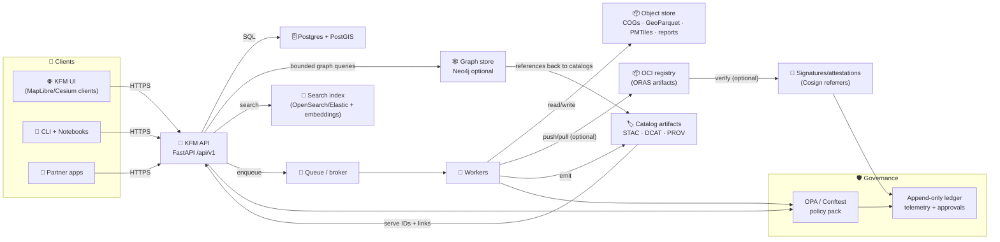

<!--
📌 This README defines the governed backend boundary for KFM (Kansas Frontier Matrix).
🗓️ Last updated: 2026-01-26
🧾 Contract posture: OpenAPI-first (contract-first)
🔒 Default stance: fail-closed (deny / redact unless proven)
-->

<a id="top"></a>

# 🚪 KFM API 🛰️🗺️  
_Backend + integration trust boundary for the Kansas Frontier Matrix (KFM) platform_

<p align="left">
  
  
  
  
  
  
  
  
  
  
  
  
  
  
  
  
  
  
  
  
</p>

> [!IMPORTANT]
> **KFM invariant (non‑negotiable):**  
> **ETL → STAC/DCAT/PROV → Graph → APIs → UI → Story Nodes → Focus Mode**  
> The API is the **governed trust boundary**: it must not serve “mystery data” that isn’t **cataloged**, **provenance‑linked**, and **policy‑checked**. ✅🧾

> [!IMPORTANT]
> **Single entry point (non‑negotiable):**  
> The API is the only supported route from **UI/clients → data/graph/search**. No direct UI-to-DB, UI-to-graph, or UI-to-index connections inside governed deployments. 🔒🧱

> [!IMPORTANT]
> **Integrity invariant (non‑negotiable):**  
> Published artifacts must be **digest-addressed**, and promotion-to-public requires **verifiable integrity** (signatures/attestations where configured). No “floating latest” binaries in governed flows. 🔏📦

> [!IMPORTANT]
> **Focus Mode hard gate (non‑negotiable):**  
> Focus Mode displays **only provenance‑linked content**. Any AI contribution must be **opt‑in**, **clearly labeled**, **bounded by evidence**, and **policy-scanned** (no side‑channel leaks). 🧠🔒

> [!CAUTION]
> **Fail‑closed is the default.** If a route cannot prove **license + classification + provenance**, it must refuse (or return a redacted, policy-compliant view). 🚫✅

---

<a id="quick-links"></a>

## 🔗 Quick links
**Docs & runtime**
- 🧪 Swagger (OpenAPI UI): `/docs`
- 📕 ReDoc: `/redoc`
- 🧾 OpenAPI JSON: `/openapi.json`
- ❤️ Health: `/api/v1/health`
- 🧭 Version/meta: `/api/v1/meta/version`
- 🪪 Citation guidance (software + data releases): `/api/v1/meta/citation` *(target)*
- 📈 Metrics (optional): `/metrics`
- 🧵 Tracing (optional): OpenTelemetry exporter (config)

**Catalog + provenance**
- 🗂️ STAC root: `/api/v1/catalog/stac`
- 🏷️ DCAT datasets: `/api/v1/catalog/dcat` *(implementation-specific)*
- 🧬 PROV run lineage: `/api/v1/prov/runs/{run_id}`
- 🧾 Evidence bundle (Story/Focus): `/api/v1/evidence/bundles/{bundle_id}`

**Integrity + governance (targets)**
- 🧪 Dataset contract validation: `/api/v1/contracts/datasets/validate` *(policy-gated)*
- 🧪 Run manifest validation: `/api/v1/contracts/manifests/validate` *(policy-gated)*
- 🔏 Artifact verification: `/api/v1/artifacts/verify` *(policy-gated)*
- 🕸️ Graph integrity check: `/api/v1/integrity/graph/check` *(privileged)*
- 🧠 Narrative pattern scan: `/api/v1/integrity/narratives/scan` *(privileged)*

**Experience surfaces**
- 🧠 Focus Mode context bundle: `/api/v1/focus/context` *(policy-gated)*
- 🧵 Pulse Threads (timeline feed): `/api/v1/pulse_threads` *(policy-gated)*
- 🧠 Concepts / Attention Nodes: `/api/v1/concepts` *(policy-gated)*
- 📡 Job stream (WS/SSE): `/ws/jobs/{job_id}` *(if enabled)*

Repo navigation (typical):
- 🧭 Project overview: `../README.md`
- 🧠 Master guide (repo authority): `../docs/MASTER_GUIDE_v13.md` *(or later)*
- 🚪 Backend code (recommended): `../api/` *(current)* or `../src/server/` *(target consolidation)*
- 📦 Data + metadata boundary: `../data/README.md`
- 🧰 Tooling boundary: `../tools/README.md`
- 🧪 Tests: `../tests/README.md`
- 🧾 Stories: `../docs/stories/` *(or `../docs/reports/story_nodes/` target)*

---

<a id="doc-metadata"></a>

## 🧾 Doc metadata

| Field | Value |
|---|---|
| Doc | `api/README.md` |
| Status | WIP 🚧 (contract-first) |
| Last updated | **2026-01-26** |
| Version | **v1.5.0** |
| Prime directive | **Serve only governed evidence** (IDs + catalogs + provenance) |
| Default stance | deny-by-default 🔒, hostile-input aware 🧯, audit-ready 🧾 |
| Canonical order | **ETL → STAC/DCAT/PROV → Graph → API → UI → Story → Focus** |
| “Public” definition | **licensed + classified + provenance-linked + policy-approved** (not “available somewhere”) |
| Integrity baseline | digest-addressed artifacts + run manifests + (optional) signatures/attestations |
| Automation safety | global kill-switch + receipts + human review required 🧊 |
| UI contract drivers | timeline slider, layer provenance panel, Story Nodes (MD+JSON), Focus Mode (citations) |

---

<a id="toc"></a>

## 🧭 Table of contents
- [🧠 Master guide alignment](#master-guide-alignment)
- [🧩 What this README governs](#what-this-readme-governs)
- [📖 Glossary](#glossary)
- [⭐ API north stars](#api-north-stars)
- [🧰 Hard gates and policy pack](#hard-gates-and-policy-pack)
- [🧱 Architecture snapshot](#architecture-snapshot)
- [🗂️ Evidence model](#evidence-model)
- [📦 Data lifecycle](#data-lifecycle)
- [🔎 Search and retrieval](#search-and-retrieval)
- [📦 Artifact registry and signatures](#artifact-registry-and-signatures)
- [🧵 Pulse Threads and attention graph](#pulse-threads-and-attention-graph)
- [🔎 Integrity and drift](#integrity-and-drift)
- [📊 Telemetry and governance ledger](#telemetry-and-governance-ledger)
- [🧠 Story Nodes and Focus Mode](#story-nodes-and-focus-mode)
- [🧵 Async jobs and deterministic replay](#async-jobs-and-deterministic-replay)
- [📡 Real-time and streaming data](#real-time-and-streaming-data)
- [📜 Contracts and schemas](#contracts-and-schemas)
- [🧾 Data contracts](#data-contracts)
- [🔐 Authentication and authorization](#authentication-and-authorization)
- [🛡️ Security and privacy](#security-and-privacy)
- [🗺️ Geospatial conventions](#geospatial-conventions)
- [🌐 Federation and data spaces](#federation-and-data-spaces)
- [📦 Offline packs and 3D/AR delivery](#offline-packs-and-3dar-delivery)
- [🤝 Community contributions and moderation](#community-contributions-and-moderation)
- [🧩 Endpoint map](#endpoint-map)
- [🧪 Example flows](#example-flows)
- [✅ Definition of done](#definition-of-done)
- [🗺️ Roadmap](#roadmap)
- [🤝 Contributing](#contributing)
- [📚 Reference library influence map](#reference-library-influence-map)
- [🕰️ Version history](#version-history)

---

<a id="master-guide-alignment"></a>

## 🧠 Master guide alignment

This README is **not** the top-level authority. It inherits from the repo’s **Master Guide** (v13 or later), which defines:

- 🧭 the **canonical ordering** across subsystems (data → catalogs → graph → API → UI → narrative)
- 🧩 **contract artifacts** as first-class outputs (OpenAPI, JSON Schema, graph schemas, UI configs)
- 🧾 **evidence artifacts** as first-class datasets (registered in STAC/DCAT with PROV lineage)
- 🏷️ sovereignty + governance rules (FAIR/CARE, classification propagation, no sensitive leaks)
- 🧪 CI gates (schema validation, contract diffs, redaction tests, policy checks)
- 🔏 integrity posture (run manifests, hash/digest discipline, optional signing + attestations)

> [!TIP]
> If you’re unsure “where a change belongs,” consult the Master Guide first. This file governs the **backend boundary** only.

---

<a id="what-this-readme-governs"></a>

## 🧩 What this README governs

✅ **In scope (this document)**
- 🚪 API contract + versioning (OpenAPI-first)
- 🧾 Evidence gating (STAC/DCAT/PROV + stable IDs)
- 🔒 AuthN/AuthZ + policy enforcement (OPA/Conftest pack)
- 🔏 Artifact integrity rules (digests, manifests, signing where configured)
- 🧵 Jobs + replay posture (idempotency, receipts, deterministic runs)
- 🧠 Story/Focus serving contract (citations required, AI opt-in)
- 📊 Telemetry + governance ledger emission (audit-ready defaults)

🚫 **Out of scope (elsewhere)**
- 🧪 ETL pipeline implementation details (belongs in `pipelines/` or `src/pipelines/`)
- 🌐 UI implementation details (belongs in `web/` or `src/ui/`)
- 🕸️ Full ontology design (belongs in `docs/ontology/` + graph schema)
- 🧾 Full governance policy texts (belongs in `policies/` + legal docs)

---

<a id="glossary"></a>

## 📖 Glossary

| Term | Meaning (KFM boundary meaning) |
|---|---|
| `tenant_id` | Multi-tenant scope boundary (org/community boundary) |
| `dataset_id` | Stable ID for a dataset definition (`domain + name + version`) |
| `layer_id` | Stable ID for a spatial asset layer (vector/raster/tile layer) |
| `run_id` | Stable ID for a provenance-tracked run (ETL/analysis/sim/export) |
| `job_id` | Ephemeral execution handle for async work (maps to `run_id` when published) |
| `bundle_id` | Evidence bundle ID (Story/Focus consumption unit) |
| `graph_id` | Stable entity ID in the knowledge graph (place/event/doc/person/etc.) |
| `concept_id` | Stable “Conceptual Attention Node” ID (meaning layer linked to evidence) |
| `pulse_thread_id` | Time-ordered thread for verified observations + run summaries |
| `artifact_ref` | Digest-addressed artifact reference (e.g., `...@sha256:<digest>`) |
| `canonical_digest` | Deterministic hash over canonical JSON manifest (idempotency anchor) |
| `decision_id` | Governance decision record (approvals, redactions, waivers) |
| `waiver_id` | Explicit policy waiver (time-bounded; never silent) |
| “published” | **cataloged + provenance-linked + policy-approved** (not “file exists”) |
| “fail-closed” | If governance cannot be proven: deny or redact (never “best effort”) |
| “windowing” | Streaming data stored as append-only observations partitioned by time |

---

<a id="api-north-stars"></a>

## ⭐ API north stars

KFM’s backend exists to support **truthful, reproducible, human‑centered** decision support — not vibes, not persuasion. 🧠🧾

- 🧾 **Provenance-first:** every dataset/derivative/model output is evidence-linked (STAC/DCAT/PROV + stable IDs).
- 🧩 **Contract-first:** OpenAPI is the shipping interface; breaking changes require versioning.
- 🏷️ **Catalog-gated:** if it isn’t cataloged and lineage-linked, it isn’t “real” in KFM.
- 🔒 **Governance always-on:** classification, licensing, redaction, and “no privacy downgrade” rules are enforced.
- 🔏 **Integrity-by-default:** promoted artifacts are digest-addressed; runs produce manifests; signatures/attestations enforced where configured.
- 🧠 **Focus Mode hard gate:** no unsourced content can appear in Focus Mode (AI is opt-in, labeled, bounded).
- 🎲 **Reproducible by default:** jobs store params + versions + run receipts; results are never “magic.”
- ❤️ **Human autonomy:** explanation hooks, audit trails, and safe defaults prevent automation complacency.
- 🌾 **FAIR+CARE-aware:** “open” ≠ “safe”; cultural protocols and sensitive locations are protected.

---

<a id="hard-gates-and-policy-pack"></a>

## 🧰 Hard gates and policy pack

KFM treats governance as correctness. This API participates in enforcement and must not provide bypasses.

### ✅ Minimum automated gates (baseline)
These gates run **before publish**, and again at **serve-time** (deny/redact):

- 🧾 Contract validation (OpenAPI + JSON Schemas)
- 🗂️ STAC/DCAT/PROV completeness (required fields present)
- 🏷️ License presence (block unknown license when configured)
- 🔐 Classification presence + propagation (outputs cannot downgrade inputs)
- 🧬 Provenance completeness (inputs/activities/outputs declared)
- 🔏 Run manifest present for publish (`canonical_digest` computed; params pinned)
- 🔏 Artifact integrity checks (digest present; signatures/attestations required if policy says so)
- 🕸️ Graph integrity checks (no broken evidence links; bounded traversals)
- 🧠 Story/Focus integrity checks (citations present; AI blocks labeled; pattern scan when enabled)
- 🧯 Hostile input checks (uploads/parsers/archives treated as unsafe by default)

### 🧾 Policy waivers (allowed, but governed)
Waivers happen (legacy sources, emergency fixes). When used:
- must be explicit (`waiver_id`) ✅
- must be time-bounded (expiry) ⏳
- must be written to the governance ledger 🧾
- must never downgrade classification 🔒

### 🧊 Kill switch (automation safety)
Any automation that can write artifacts (agents, scheduled updaters, pipeline runners) must support a **global kill switch** (env/config + repo sentinel file) that freezes automated changes instantly.

> [!NOTE]
> Policy-as-code can be implemented with OPA/Rego and tested with Conftest, but the principle is the key:  
> **no merge, no publish, no serve** if governance can’t be proven.

---

<a id="architecture-snapshot"></a>

## 🧱 Architecture snapshot

KFM favors clean boundaries: frameworks are adapters, not the core. 🧼🏛️

### Layers (recommended)
- 💠 **Domain** — entities + invariants (pure Python; no framework imports)
- 🧠 **Application** — use cases (policy decisions, orchestration, authz, receipts)
- 🔌 **Adapters** — FastAPI routes, repositories, external clients
- 🧱 **Infrastructure** — PostGIS, graph store, search index, queues, object storage / OCI registry

### 🔁 Runtime shape (typical)


> [!IMPORTANT]
> **Catalogs are the gate.** Pipelines/workers emit STAC/DCAT/PROV so downstream (graph/UI/Focus) can trust what it sees. 🗂️✅

---

<a id="evidence-model"></a>

## 🗂️ Evidence model

KFM’s “truth” is not a blob of bytes — it’s a **governed evidence graph**.

### Evidence primitives
- **Stable IDs:** `dataset_id`, `layer_id`, `run_id`, `bundle_id`, `graph_id`, `concept_id`, `pulse_thread_id`
- **Catalog artifacts:** STAC (spatial assets), DCAT (datasets & distributions), PROV (lineage)
- **Policy envelope:** classification + license + redaction + protocol flags (FAIR/CARE-aware)
- **Receipts:** job/run receipts with parameters, versions, and output pointers
- **Integrity signals:** digests + optional signatures/attestations + SBOM refs (if enabled)

### Evidence pointers (recommended response shape)
Every route returning user-visible data should include a compact pointer block (or a link to it):

```json
{
  "evidence": {
    "dataset_id": "kfm.<domain>.<dataset>.v1",
    "run_id": "kfm.run.<pipeline>.<timestamp>",
    "stac": {
      "collection_id": "kfm.stac.collection.<id>",
      "item_ids": ["kfm.stac.item.<id>"]
    },
    "dcat_dataset_id": "kfm.dcat.<id>",
    "prov_run_id": "kfm.prov.run.<id>",
    "artifacts": [
      {
        "kind": "cog",
        "artifact_ref": "oci://ghcr.io/kfm/artifacts/kfm.<id>@sha256:<digest>",
        "digest": "sha256:<digest>"
      }
    ],
    "classification": "public",
    "license": "CC-BY-4.0"
  }
}
```

### Evidence bundles (Story/Focus boundary) 🎒
Story Nodes + Focus Mode consume **evidence bundles** that contain:
- citations + identifiers (not freeform claims)
- asset pointers (STAC/DCAT/PROV IDs + signed URLs where policy permits)
- graph entity references (`graph_id`s) and concept references (`concept_id`s)
- redaction hints (sensitive sites, location generalization level, protocol constraints)
- optional integrity pointers (artifact digests, signature refs, SBOM refs)

---

<a id="data-lifecycle"></a>

## 📦 Data lifecycle

KFM treats staging + metadata emission as part of correctness. ✅

### Recommended repo staging
```text
📦 data/
├─ 🧱 raw/<domain>/                 # raw sources (immutable)
├─ 🧪 work/<domain>/                # intermediate artifacts (not published)
├─ ✅ processed/<domain>/           # publish candidates (stable + reviewed)
├─ 🗂️ catalog/                      # STAC/DCAT records (machine-readable)
├─ 🧬 provenance/                   # PROV lineage bundles
└─ 🧾 contracts/                    # dataset.contract.json (optional colocation)

📦 docs/
└─ 📚 stories/                      # Story Nodes (Markdown + JSON scripts)

📦 artifacts/                        # optional, recommended
├─ 🧾 manifests/                     # run.manifest.json (canonical digests)
├─ 🔏 signatures/                    # verification reports (if enabled)
├─ 🧪 sbom/                          # SBOM artifacts (if enabled)
└─ 🌱 sustainability/                # energy/compute reports (if enabled)
```

> [!TIP]
> For large datasets, consider **DVC (Data Version Control)** and/or Git LFS for reproducible dataset versioning — but still enforce STAC/DCAT/PROV + policy gates before “published.” 🧾📦

### The “publish” rule 🏷️🚫
A dataset (or analysis/simulation output) is **not published** until:
1) stable artifact exists (DB/object store and/or OCI registry), **and**  
2) STAC/DCAT/PROV boundary artifacts exist, **and**  
3) policy checks pass (classification/license/redaction/protocols), **and**  
4) graph references (if applicable) resolve to canonical entities, **and**  
5) run manifest + canonical digest is recorded (and signatures pass where required).

### Streaming data (append-only, windowed) ⏱️
- treat each observation as **append-only**
- partition (window) by day/week/year
- do not rewrite history silently — publish new versions/windows
- use idempotency keys + watermarks to avoid duplicates

---

<a id="search-and-retrieval"></a>

## 🔎 Search and retrieval

Search powers:
- dataset discovery (DCAT/STAC search + text search)
- document exploration (reports, archival texts, story content)
- Focus Mode retrieval (evidence-first RAG) 🧠🧾

### Recommended posture
- 🔎 **Full-text index** (OpenSearch/Elastic) over documents + story content
- 🧠 **Vector similarity (embeddings)** for semantic passage retrieval
- 🕸️ **Graph retrieval** for entity linking + disambiguation (bounded)
- 🗄️ **PostGIS queries** for numeric/statistical/spatial facts

> [!IMPORTANT]
> Retrieval must be **policy-gated**: classification + redaction must apply **before** content becomes eligible to be retrieved or shown.

---

<a id="artifact-registry-and-signatures"></a>

## 📦 Artifact registry and signatures

KFM can store promoted artifacts in object storage **and/or** as **OCI artifacts** (strong integrity + reproducible distribution). 📦🔏

### Why OCI artifacts help KFM
- digest addressing becomes first-class (no ambiguous “latest”)
- distribution is easier (pull by digest)
- signatures/attestations are natural (Cosign referrers)
- offline packs can reference stable bundles by digest

### Recommended posture
Every promoted output has:
- `run.manifest.json` (canonicalized and hashed → `canonical_digest`)
- artifact digests recorded in catalogs (DCAT distributions / STAC assets)
- optional signature verification (Cosign) depending on policy
- optional SBOM + provenance attestations (SLSA posture, if enabled)

> [!TIP]
> Treat “publish” as a **content-addressed release** — not a folder copy. ✅

---

<a id="pulse-threads-and-attention-graph"></a>

## 🧵 Pulse Threads and attention graph

KFM’s UI is a **timeline-driven living atlas**. Two backend primitives help scale that experience while staying governed:

### 1) Pulse Threads 🧵⏱️
A Pulse Thread is a time-ordered feed of **verified observations** + **run summaries**, each linked to evidence.

**Rules**
- append-only events
- each event includes `evidence` pointers (`run_id` / `bundle_id` + catalog IDs)
- classification/redaction apply at the event level (no downgrade)

### 2) Conceptual Attention Nodes 🧠🧩
A Concept node (`concept_id`) is a governed “meaning layer” between evidence and story:
- anchored to evidence (datasets/runs/bundles)
- attached to ontology fragments (domain definitions)
- reusable across Story Nodes, Focus Mode, and analytics
- supports safe summarization without freeform hallucination

> [!IMPORTANT]
> Concepts do **not** replace evidence; they point to it and structure it. 🧾✅

---

<a id="integrity-and-drift"></a>

## 🔎 Integrity and drift

### 🕸️ Graph health (recommended)
Validate:
- orphan nodes (no evidence/inbound refs)
- broken refs (graph → STAC/DCAT/PROV IDs that don’t resolve)
- classification mismatches (potential leaks)
- bounded traversal constraints (no unbounded exports)

Outputs become evidence:
- telemetry events + `run_id`
- integrity report artifact (cataloged, provenance-linked)

### 🧠 Narrative integrity (optional but powerful)
- flag unsupported claims (missing citations)
- detect suspicious templated text bursts (spam/brigading)
- enforce AI labeling + reviewer sign-off
- drift in repeated story claims (“what changed? why?”)

### 📉 Data + model drift
For streaming feeds and deployed models:
- drift metrics recorded per window
- policy can require review if thresholds exceed
- outputs published as evidence artifacts

---

<a id="telemetry-and-governance-ledger"></a>

## 📊 Telemetry and governance ledger

KFM’s trust posture depends on **auditability**.

### Telemetry (required posture)
- structured events with `request_id`, `run_id`, `job_id`, actor (user/agent), and policy result
- append-only logging (ledger/NDJSON) for ingestion gates + Focus Mode interactions
- metrics: metadata completeness, citation coverage, schema failures, policy violations
- optional sustainability metrics for heavy pipelines (policy-gated)

### Governance ledger (recommended posture)
Tamper-evident records for:
- approvals (FAIR/CARE-sensitive datasets)
- policy outcomes (checked / pass / fail / waiver)
- automation activity (plans, diffs, receipts)
- integrity verification (digests, signature checks)
- sustainability signals (energy/compute footprint) where required

> [!TIP]
> If it can’t be replayed or audited, it can’t be promoted to “published evidence.” 🧾

---

<a id="story-nodes-and-focus-mode"></a>

## 🧠 Story Nodes and Focus Mode

Story + Focus are where KFM becomes a **governed, interactive storybook** 📖🗺️ — and where governance pressure is highest.

### Story Nodes (governed narrative artifacts) 🧷
A valid Story Node:
- 🧾 cites every factual claim (cataloged sources)
- 🧩 references graph entities (`graph_id`s) and Concepts (`concept_id`s)
- 🧠 distinguishes fact vs interpretation (especially if AI-assisted)
- 🏷️ inherits classification (no narrative can downgrade sensitivity)
- 🔏 includes integrity hooks where applicable (artifact digests + manifests)

**Authoring posture**
- narrative: Markdown
- interaction logic: JSON “story script”
- version-controlled + reviewed like code
- future-friendly: visual story builder can generate the same MD+JSON

### Focus Mode (interactive, provenance-linked) 🧠🔎
Focus Mode must:
- ✅ display only provenance-linked content (hard gate)
- 🧠 treat AI as opt-in + labeled + evidence-bounded
- 🔒 prevent sensitive location leaks (generalize/blur/omit)
- 🧾 provide click-through: everything resolves back to evidence pointers
- 🧊 never take actions on the user’s behalf (advisory-only)

> [!IMPORTANT]
> Focus Mode is not “a chatbot endpoint.” It’s a **policy-gated evidence synthesizer** that refuses if evidence is insufficient.

---

<a id="async-jobs-and-deterministic-replay"></a>

## 🧵 Async jobs and deterministic replay

Use jobs when:
- rasters/windows are large
- compute is heavy (ML, simulation, mosaics)
- external services are involved
- outputs need governance promotion

### Common pattern ✅
1) `POST` creates job → returns `job_id`  
2) worker executes → writes artifacts (object store / OCI registry / DB)  
3) worker emits STAC/DCAT/PROV  
4) worker writes `run.manifest.json` + digest (and signatures if required)  
5) API exposes results by:
   - `GET /jobs/{job_id}` + `GET /jobs/{job_id}/result`
   - catalog endpoints once “published”

### Deterministic replay posture
Simulation/model workflows must:
- capture parameters, versions, and environment references
- pin inputs by hash/version
- record random seeds (or document why exact determinism is infeasible)
- emit diff/patch artifacts for review when versions change
- include run manifest canonical digest for idempotency + receipts

---

<a id="real-time-and-streaming-data"></a>

## 📡 Real-time and streaming data

KFM supports near-real-time feeds — but **never without gates**.

### Streaming ingestion posture
- ingest → light validation → store → emit catalogs → serve
- access control + rate limiting (prevent leaks + protect backend)
- windowing (append-only; no silent edits)
- idempotency + watermarking (avoid double-ingest; support replay)

### Real-time UI integration (targets)
- `GET /api/v1/pulse_threads/{id}/events` (paged)
- `GET /api/v1/pulse_threads/{id}/stream` (SSE; optional)
- `ws://.../ws/jobs/{job_id}` for job progress

---

<a id="contracts-and-schemas"></a>

## 📜 Contracts and schemas

**Contract changes first**, then implementation. ✅

Recommended posture:
- `contracts/openapi.yaml` is the API truth (or `api/contracts/openapi.yaml`)
- JSON Schemas for:
  - STAC Collections + Items
  - DCAT datasets + distributions
  - PROV run bundles (JSON‑LD)
  - Evidence bundles (Story Nodes + Focus Mode)
  - Dataset data-contracts
  - Run manifests (canonical digest rules)
  - Pulse Threads + Pulse Events
  - Concepts / Attention Nodes
  - Integrity findings (graph checks, narrative scans, drift reports)

### SDK generation (strongly recommended) 🧰
To support polyglot clients:
- generate **TypeScript** SDK for `web/`
- generate **Python** SDK for pipelines/notebooks
- optionally publish these as versioned artifacts, tied to OpenAPI tags and semver

### ✅ Contract QA gates (recommended)
- OpenAPI diff checks (breaking changes → version bump)
- example payload validation (fixtures → schema)
- negative tests (unauthorized, restricted, invalid geometry)
- policy tests (OPA/Conftest) for “who can see what”
- idempotency tests for job endpoints
- integrity tests (manifest digest reproducibility; signature required where configured)

---

<a id="data-contracts"></a>

## 🧾 Data contracts

A dataset’s metadata contract is a **machine-checkable entry ticket** to catalogs. 🎟️🗂️

### Suggested `dataset.contract.json` shape (target)
```json
{
  "dataset_id": "kfm.<domain>.<dataset>.v1",
  "title": "Human-readable title",
  "description": "What this is and what it is not",
  "source": {
    "name": "Provider / archive / agency",
    "uri": "https://example.org/source",
    "retrieved_at": "2026-01-01",
    "checksums": { "sha256": "..." }
  },
  "license": {
    "spdx": "CC-BY-4.0",
    "attribution": "Required attribution text"
  },
  "classification": "public",
  "protocols": {
    "care_sensitive": false,
    "sensitive_location_policy": "none|blur|generalize|omit",
    "approved_by": "optional council/community id",
    "approval_ref": "optional decision_id"
  },
  "spatial": { "crs": "EPSG:4326", "bbox": [-102.05, 36.99, -94.58, 40.00] },
  "temporal": { "start": "1930-01-01", "end": "1940-12-31" },
  "schema": {
    "kind": "vector|raster|tabular",
    "fields": [
      {"name": "county_name", "type": "string"},
      {"name": "value", "type": "float"}
    ]
  },
  "processing": {
    "pipeline": "kfm.etl.<name>",
    "version": "2026.01",
    "inputs": ["kfm.<domain>.<input>.v1"],
    "parameters": {},
    "environment": { "container_image": "ghcr.io/org/pipeline@sha256:..." },
    "run_manifest_ref": "artifacts/manifests/<run_id>.json",
    "canonical_digest": "sha256:..."
  },
  "artifacts": [
    {
      "kind": "cog|pmtiles|geoparquet|report",
      "artifact_ref": "oci://ghcr.io/kfm/artifacts/kfm.<id>@sha256:<digest>",
      "digest": "sha256:<digest>",
      "signature_required": true
    }
  ]
}
```

---

<a id="authentication-and-authorization"></a>

## 🔐 Authentication and authorization

### Tokens
- JWT Bearer tokens
- `Authorization: Bearer <token>`

### Authorization model (recommended)
- **RBAC** for broad capabilities (`viewer`, `editor`, `admin`, `moderator`, `council_member`)
- **ABAC** for governance constraints:
  - classification (`public` / `internal` / `restricted`)
  - license constraints
  - tenant/org ownership + sharing rules
  - protocol constraints (CARE-sensitive approvals)
  - “no sensitive location leaks” rules for Story/Focus rendering
  - artifact integrity requirements (who can promote / verify)

**Rules**
- AuthZ decisions live in application/use-case layer (not route handlers).
- Audit “write” actions: uploads, publish/promote, redactions, deletes, waivers.
- Treat ingestion as hostile: validate file types, size, content; avoid SSRF; scan uploads.

---

<a id="security-and-privacy"></a>

## 🛡️ Security and privacy

### Defensive posture
- 🔒 DB/brokers on private networks; expose only HTTPS at the edge
- 🧯 Rate limits, lockouts, secure password hashing (bcrypt/argon2)
- 🧪 Upload validation: allowlists, size limits, file signatures; protect against SSRF
- 🧊 Parser safety: archives/images/PDFs are hostile-input surfaces (zip bombs, malformed files)
- 🧾 Audit logs for “write” actions (upload, publish, redaction, waiver, promote)
- 🔐 Secrets via env/secret managers (never commit tokens)
- 🔏 Supply chain: SBOM generation + signed images + provenance attestations (if enabled)
- 🧷 Minimize info leakage: avoid debug banners and verbose error messages in prod

### Privacy posture (recommended)
- 🔎 query auditing for sensitive datasets
- 🧠 inference control safeguards (prevent “learn by querying” leakage)
- 🧊 redaction/generalization pipelines for sensitive locations
- 🧾 explainable refusals when policy denies

### AI/LLM security posture (when enabled)
- prompt-injection aware retrieval (evidence-only; policy-gated)
- tool/function calling deny-by-default (only approved actions)
- no hidden retrieval side-channels (Focus Mode must show evidence pointers)
- log AI usage as governance events (opt-in, labeled, auditable)

---

<a id="geospatial-conventions"></a>

## 🗺️ Geospatial conventions

- **Default API CRS:** WGS84 (`EPSG:4326`)
- **Geometry transport:** GeoJSON (`Feature` / `FeatureCollection`)
- **Server-side ops:** prefer PostGIS (intersects, within, joins)
- **Tiles (recommended):**
  - Web Mercator (`EPSG:3857`) for tile math
  - MVT/PMTiles for efficient offline/online delivery (policy-gated)

### Parameter conventions
- `bbox=minLon,minLat,maxLon,maxLat` (EPSG:4326)
- `geom=<GeoJSON>` (POST body; avoid huge query strings)
- `simplify=<meters>` (derived outputs; never mutate sources)
- `precision=<int>` (optional float rounding control)

### Correctness rules ✅
- store geometries with explicit SRIDs
- transform at boundaries (DB storage may differ; output must be explicit)
- CRS ambiguity is a correctness bug

---

<a id="federation-and-data-spaces"></a>

## 🌐 Federation and data spaces

KFM is designed to become a **blueprint** for other regions (“Frontier Matrices”). 🌾🧭

Target posture:
- prefer standards (STAC/DCAT/PROV) for interop
- expose trust signals (license, provenance, classification, uncertainty, integrity)
- enable cross-hub queries via catalogs + shared ontology mappings
- keep sovereignty rules enforceable across federation boundaries

> [!NOTE]
> Federation does **not** mean “free-for-all.” Governance + policy is always-on. 🔒

---

<a id="offline-packs-and-3dar-delivery"></a>

## 📦 Offline packs and 3D/AR delivery

KFM’s roadmap includes offline-first and 3D/AR experiences. The API must support this without breaking trust.

### Offline packs (target) 🧳
An offline pack is a governed bundle that can include:
- PMTiles / tile layers (policy-gated)
- evidence bundles for stories
- bounded graph context + concepts
- licenses + classifications + provenance pointers
- optional quicklooks/thumbnails (size-capped)
- optional on-device inference (only if policy permits; clearly labeled)

### 3D / AR principle (target) 🪐📱
3D/AR outputs must remain provenance-linked:
- 3D assets are a **view over evidence**, not “truth”
- AR uses the same governed endpoints with:
  - smaller geographic radius
  - simplified geometry + capped feature counts
  - strict redaction rules (sensitive sites)
- exports remain policy-gated and license-aware

---

<a id="community-contributions-and-moderation"></a>

## 🤝 Community contributions and moderation

KFM is a “living atlas” with community participation — governance remains non-negotiable.

### Contribution posture
- contributions via PRs and/or moderated API submissions
- same gates for everyone (human or automation)
- clear moderation workflow (review queues, provenance checks, FAIR/CARE review triggers)
- optional reputation tiers + transparent moderation logs
- expose “request correction” paths (API + UI)

---

<a id="endpoint-map"></a>

## 🧩 Endpoint map

> These are **target contracts**. Keep `/api/v1` stable; version breaking changes.

### ✅ Core
| Method | Path | Auth | What it does |
|---:|---|:---:|---|
| GET | `/api/v1/health` | ❌ | Liveness/readiness |
| GET | `/api/v1/meta/version` | ❌ | API + schema versions |
| GET | `/api/v1/meta/citation` | ❌ | How to cite KFM + dataset releases *(target)* |
| POST | `/api/v1/auth/login` | ❌ | Issue JWT |
| GET | `/api/v1/auth/me` | ✅ | Current user + roles |

### 📜 Contracts & validation
| Method | Path | Auth | What it does |
|---:|---|:---:|---|
| GET | `/api/v1/contracts/openapi` | ❌ | Serve canonical OpenAPI artifact |
| POST | `/api/v1/contracts/datasets/validate` | ✅ | Validate `dataset.contract.json` |
| POST | `/api/v1/contracts/manifests/validate` | ✅ | Validate `run.manifest.json` *(target)* |
| GET | `/api/v1/contracts/schemas/{name}` | ❌ | Fetch JSON Schema by name |

### 🗂️ Catalog & provenance
| Method | Path | Auth | What it does |
|---:|---|:---:|---|
| GET | `/api/v1/catalog/stac` | ✅/❌ | STAC root |
| GET | `/api/v1/catalog/stac/collections/{id}` | ✅/❌ | STAC Collection |
| GET | `/api/v1/catalog/stac/items/{id}` | ✅/❌ | STAC Item |
| GET | `/api/v1/catalog/dcat/{id}` | ✅/❌ | DCAT dataset |
| GET | `/api/v1/prov/runs/{run_id}` | ✅ | PROV lineage bundle |

### 📦 Artifacts & integrity
| Method | Path | Auth | What it does |
|---:|---|:---:|---|
| GET | `/api/v1/artifacts/{digest}` | ✅ | Fetch artifact by digest (redirect/signed URL) |
| GET | `/api/v1/artifacts/{digest}/meta` | ✅ | Artifact metadata + evidence pointers |
| POST | `/api/v1/artifacts/verify` | ✅ | Verify digest/signature policy (privileged) |
| POST | `/api/v1/integrity/graph/check` | ✅ | Run graph checks → returns job/run |
| POST | `/api/v1/integrity/narratives/scan` | ✅ | Scan narratives for citation/pattern issues |

### 🧵 Pulse Threads
| Method | Path | Auth | What it does |
|---:|---|:---:|---|
| GET | `/api/v1/pulse_threads` | ✅/❌ | List pulse threads (policy-gated) |
| POST | `/api/v1/pulse_threads` | ✅ | Create pulse thread (privileged) |
| GET | `/api/v1/pulse_threads/{pulse_thread_id}` | ✅/❌ | Thread metadata + envelope |
| GET | `/api/v1/pulse_threads/{pulse_thread_id}/events` | ✅/❌ | Events list (paged) |
| GET | `/api/v1/pulse_threads/{pulse_thread_id}/stream` | ✅/❌ | SSE stream (optional) |

### 🧠 Concepts
| Method | Path | Auth | What it does |
|---:|---|:---:|---|
| GET | `/api/v1/concepts` | ✅ | List/search concepts |
| POST | `/api/v1/concepts` | ✅ | Create concept (privileged) |
| GET | `/api/v1/concepts/{concept_id}` | ✅ | Concept details + evidence links |

### 🗺️ Geospatial query
| Method | Path | Auth | What it does |
|---:|---|:---:|---|
| GET | `/api/v1/fields?bbox=...` | ✅ | List features with filters |
| GET | `/api/v1/fields/{field_id}` | ✅ | Feature metadata + geometry |
| POST | `/api/v1/geo/intersects` | ✅ | Spatial query by geometry |
| POST | `/api/v1/geo/buffer` | ✅ | Buffer geometry (derived output) |

### 📊 Analysis (job-oriented)
| Method | Path | Auth | What it does |
|---:|---|:---:|---|
| POST | `/api/v1/analysis/bayes/run` | ✅ | Bayesian job (priors + posteriors) |
| POST | `/api/v1/analysis/regression/run` | ✅ | Regression job (diagnostics) |
| GET | `/api/v1/analysis/runs/{run_id}` | ✅ | Run metadata + artifacts + evidence |

### 🧠 Story + Focus
| Method | Path | Auth | What it does |
|---:|---|:---:|---|
| GET | `/api/v1/evidence/bundles/{bundle_id}` | ✅ | Evidence-only payload |
| POST | `/api/v1/story_nodes/publish` | ✅ | Publish Story Node referencing evidence |
| GET | `/api/v1/story_nodes/{story_id}` | ✅/❌ | Fetch Story Node (policy-gated) |
| GET | `/api/v1/focus/context` | ✅ | Focus Mode context bundle (policy-gated) |

### 🧵 Jobs
| Method | Path | Auth | What it does |
|---:|---|:---:|---|
| GET | `/api/v1/jobs/{job_id}` | ✅ | Job status/progress |
| GET | `/api/v1/jobs/{job_id}/result` | ✅ | Result links/payload |
| POST | `/api/v1/jobs/{job_id}/cancel` | ✅ | Cancel job (best-effort) |

---

<a id="example-flows"></a>

## 🧪 Example flows

### 1) Query NDVI time-series 📈
```bash
curl -H "Authorization: Bearer $TOKEN" \
  "http://localhost:8000/api/v1/fields/123/timeseries?var=ndvi&start=2026-03-01&end=2026-10-31"
```

### 2) Validate a dataset data-contract 🧾✅
```bash
curl -X POST \
  -H "Authorization: Bearer $TOKEN" \
  -H "Content-Type: application/json" \
  -d @dataset.contract.json \
  "http://localhost:8000/api/v1/contracts/datasets/validate"
```

### 3) Start a simulation 🧮
```bash
curl -X POST \
  -H "Authorization: Bearer $TOKEN" \
  -H "Content-Type: application/json" \
  -H "Idempotency-Key: 2b9f8b0d-7b58-4d57-a9ef-2c3b0a2f3f21" \
  -d '{
    "scenario": "yield_projection",
    "field_id": 123,
    "start_date": "2026-03-01",
    "end_date": "2026-10-31",
    "parameters": { "irrigation": "baseline" }
  }' \
  "http://localhost:8000/api/v1/simulation/run"
```

### 4) Focus Mode context bundle 🧠🗂️
```bash
curl -H "Authorization: Bearer $TOKEN" \
  "http://localhost:8000/api/v1/focus/context?bbox=-100.0,37.0,-99.0,38.0&time=1935"
```

### 5) Stream a Pulse Thread 🧵📡
```bash
curl -H "Authorization: Bearer $TOKEN" \
  "http://localhost:8000/api/v1/pulse_threads/kfm.pulse.air_quality.ks/events?page=1&page_size=50"
```

Expected posture:
- evidence pointers (STAC/DCAT/PROV + graph IDs + digests)
- policy-gated redaction of sensitive coords
- AI fields absent unless explicitly requested/opt-in

---

<a id="definition-of-done"></a>

## ✅ Definition of done

A feature is “done” when:
- ✅ Contract updated first (OpenAPI + schemas) and diff checks pass
- ✅ Data-contract validation rules updated (if dataset/metadata impacted)
- ✅ AuthZ + classification enforced (no downgrade; no sensitive leaks)
- ✅ Evidence pointers included (STAC/DCAT/PROV + stable IDs)
- ✅ Integrity hooks included where applicable (manifests + digests; signatures if required)
- ✅ Story/Focus requirements met (citations + graph IDs + fact vs interpretation)
- ✅ Telemetry emitted (request IDs + run/job IDs + policy outcome)
- ✅ Tests added (unit + integration as needed)
- ✅ Performance bounded (pagination, limits, timeouts; no unbounded graph traversals)
- ✅ Security posture maintained (input validation, no secrets, SSRF safe)
- ✅ Docs updated (this README + relevant runbooks)

---

<a id="roadmap"></a>

## 🗺️ Roadmap

**Now (stabilize trust boundary)**
- [ ] Lock OpenAPI v1 as source-of-truth + CI diff gates
- [ ] JSON Schemas for STAC/DCAT/PROV/Evidence/Data-Contract + validation gates
- [ ] Data-contract validation endpoint + publish-time enforcement
- [ ] Run manifest + canonical digest spec + validation gates
- [ ] Focus Mode context bundle endpoint (policy-gated, provenance-only)
- [ ] JWT auth middleware + tenant/role/classification guards
- [ ] PostGIS-backed geo endpoints (bbox, intersects, search)

**Next (scale and accountability)**
- [ ] OCI artifact distribution (ORAS) + Cosign verify gates (policy configurable)
- [ ] Pulse Threads (append-only evidence-linked timeline feeds)
- [ ] Conceptual Attention Nodes (governed meaning layer linked to evidence)
- [ ] Graph integrity checks + scheduled integrity reports
- [ ] Telemetry ledger endpoint + dashboards (citation coverage, policy violations, drift)
- [ ] Deterministic simulation runner + promotion workflow
- [ ] Search index pipelines (docs + story + dataset metadata)

**Later (experience expansion, still governed)**
- [ ] Offline packs (policy-gated) + PMTiles packaging + signature verify
- [ ] Narrative pattern detection + moderation assist tooling
- [ ] Real-time feed ingestion modules (append-only windowed data)
- [ ] Federation-ready catalog snapshots + cross-hub discovery
- [ ] 3D / AR “views over evidence” experiences (no uncited claims)
- [ ] DOI snapshots + notebook/Binder launchers for citable research packs

---

<a id="contributing"></a>

## 🤝 Contributing

- 🧠 Keep business rules in domain/application, not in FastAPI routes
- 🧩 New endpoint? Update OpenAPI first; add contract tests + redaction rules
- 🧪 Add tests for every use-case (happy path + auth + edge cases)
- 🧾 Document governance-relevant decisions as ADRs in `docs/adr/` *(if present)*
- 🏷️ If you touch data outputs: ensure STAC/DCAT/PROV emitted + validated
- 🔏 If you touch publish/promotion: ensure run manifests + digests exist; signatures if required
- 🧠 If you touch Story/Focus: ensure citations + graph IDs + sensitivity rules are enforced
- 🧊 Automation must never auto-merge: human review is always required
- 🧑‍🔬 Prefer reproducibility habits: record seeds, pin deps, make reruns boring ✅

---

<a id="reference-library-influence-map"></a>

## 📚 Reference library influence map

These project files shape KFM’s API posture: **governance**, **scalability**, **security**, **geospatial correctness**, **credible modeling**, **human-centered constraints**, **real-time feeds**, **offline/3D expansion**, and **artifact + narrative integrity**.

<details>
<summary><strong>📦 Expand: project files → how they influence this API boundary</strong></summary>

| Project file | API impact (why it matters here) |
|---|---|
| KFM Comprehensive Technical Documentation | API as single entry point; integrated stack (PostGIS + graph + search); governance & audit posture. |
| KFM Expanded Technical & Design Guide | ETL→STAC/DCAT/PROV discipline; RAG with citations; GraphQL optional; ontology mapping guidance. |
| KFM Architecture, Features, and Design | Clean architecture; deterministic pipelines; plugin modules; Story Nodes + Focus integration principles. |
| KFM Platform Overview and Roadmap | Watcher→Planner→Executor automation; offline packs; AR/VR extensions; roadmap sequencing. |
| KFM UI System Overview | UI contract drivers (timeline, layer provenance panel, Story Nodes MD+JSON, Focus Mode citations + context). |
| KFM AI System Overview 🧭🤖 | Evidence-only AI behavior; prompt security; OPA policy scan; drift/bias monitoring posture. |
| Kansas-Frontier-Matrix Open-Source Mapping Hub Design | MapLibre/Cesium client assumptions; timeline + story-map patterns; static-first compatibility ideas. |
| Data Mining / AI Concepts references | Privacy-by-design, inference control, query auditing, evaluation discipline. |
| Mapping / WebGL / Geospatial portfolios | 3D/AR delivery constraints; performance envelopes; WebGL/Cesium patterns. |
| Programming / Security / Docker / GraphQL portfolios | Dev ergonomics, supply-chain posture, HTTP correctness, multi-language SDK expectations. |

</details>

---

<a id="version-history"></a>

## 🕰️ Version history

| Version | Date | Summary | Author |
|---:|---|---|---|
| v1.5.0 | 2026-01-26 | Refined **single-entry-point** boundary, added **search/retrieval** posture, aligned Story/Focus contract language, clarified repo layout (current vs target consolidation), strengthened privacy/inference controls, and refreshed endpoint map + DoD. | KFM Engineering |
| v1.4.0 | 2026-01-20 | Added artifact integrity posture (run manifests + digests + optional OCI/Cosign), introduced Pulse Threads + Concepts, added integrity checks (graph + narrative + drift), expanded offline/AR notes, strengthened FAIR+CARE language. | KFM Engineering |
| v1.3.0 | 2026-01-19 | Strengthened fail-closed policy pack, added telemetry/ledger + deterministic replay posture, expanded streaming/offline/contribution targets, refreshed influence map. | KFM Engineering |
| v1.2.0 | 2026-01-13 | Aligned API boundary with Master Guide v13: data lifecycle, data contracts, Story/Focus hard gates, federation notes, expanded endpoint map/DoD. | KFM Engineering |
| v1.1.0 | 2026-01-09 | Upgraded API README: catalog-gated + contract-first; clean architecture snapshot; repo layout; definition-of-done. | KFM Engineering |
| v1.0.0 | 2026-01-07 | Initial API boundary README (WIP). | KFM Engineering |

---

🌾 **KFM API is the boundary of trust.** If it can’t be explained, versioned, licensed, integrity-checked, and governed — it doesn’t ship. ✅

<p align="right"><a href="#top">⬆️ Back to top</a></p>