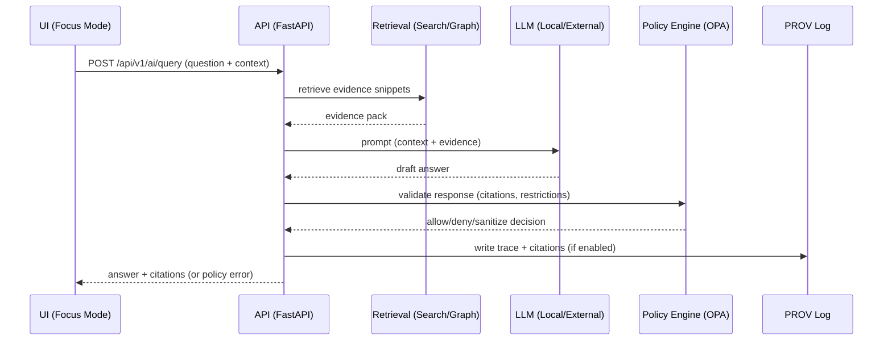

# KFM API

> **Kansas Frontier Matrix (KFM) — Unified API Gateway**  
> FastAPI-backed **REST** (versioned + OpenAPI) + optional **GraphQL**, enforcing KFM’s **trust membrane**, **policy-as-code**, and **provenance-first** governance.

-informational)
-blue)


---

## 📌 Document Metadata

| Field | Value |
|---|---|
| Artifact | `api/README.md` *(legacy location; v13+ canonical homes are typically `docs/` (API docs) + `src/server/` (API code) — see “Repo layout”)* |
| Audience | Backend / full-stack contributors |
| Status | Draft (**project-doc grounded**; remaining repo-specific unknowns are marked) |
| Governance | Governed doc — align with `docs/MASTER_GUIDE_v13.md`, `docs/standards/*`, `docs/templates/*` |
| Sensitivity | Public by default **unless** policy marks endpoints/datasets as restricted |
| Key principle | **No client or UI talks to databases directly** — all access is mediated by this API gateway |

> [!IMPORTANT]
> If you see “(verify in repo)”, it’s an intentional uncertainty marker. Replace only after checking code/config (`docker-compose.yml`, `.env`, routers, schema files, policy bundle).

---

## ✅ Non-Negotiable Invariants

> [!WARNING]
> These are governance + architecture invariants (not “style preferences”).

### 1) Trust membrane (API is the only ingress to data stores)

- **UI / external clients** must never query PostGIS / Neo4j / search indexes directly.
- Backend **route handlers** must never contain business rules or embed direct SQL/Cypher.
- Core logic must use repository **ports/interfaces**; infrastructure implements adapters.

### 2) Canonical pipeline ordering (data → narrative)

KFM’s ordering is absolute:

**ETL → Catalogs (STAC/DCAT/PROV) → Graph → API → UI → Story Nodes → Focus Mode**.

### 3) Contract-first API (OpenAPI is enforced)

- Schemas + API contracts are **first-class artifacts**.
- Breaking changes require a **version bump** and compatibility checks (OpenAPI/GraphQL + contract tests).

### 4) Classification propagation

Sensitive data **must not become less restricted downstream** (including AI summaries, story nodes, derived layers, exports).

---

## 🧭 What This API Is

KFM’s backend API is a **single, unified gateway** for all clients:

- Web UI (`web/`, React + MapLibre)
- External scripts / researchers
- Internal tooling (pipelines, validators)
- Focus Mode (governed AI/Q&A)

The gateway hides internal complexity (PostGIS, Neo4j, search, AI), while enforcing:

- authentication/authorization (when enabled)
- policy checks (request + response)
- validation and consistent contracts
- provenance + audit logging for high-impact outputs

> [!TIP]
> Think “**trust gate**”: clients call the API; the API orchestrates internal services; responses come back policy-checked.

---

## 🧱 Architecture Boundaries

KFM follows layered clean architecture. The FastAPI gateway is an **outer interface/adaptor** and must not contain business rules.

### Layer responsibilities at a glance

| Layer | What belongs here | Must NOT depend on |
|---|---|---|
| Domain | Pure entities + domain rules | FastAPI, DB drivers, UI |
| Use Case / Service | Workflows, orchestration, policy/provenance hooks | Concrete DB implementations, web framework |
| Integration / Interface | Repository interfaces, ports, adapter contracts | Concrete infra |
| Infrastructure | PostGIS/Neo4j/search implementations, FastAPI wiring, deployment | — |

### Request flow

```mermaid
flowchart LR
  Client[Client: UI / External Script] -->|REST / GraphQL| API[FastAPI Gateway]

  API --> Auth[AuthN/AuthZ (if enabled)]
  Auth --> Policy[Policy Engine (OPA / policy-as-code)]
  Policy --> Routes[Routes / Controllers]

  Routes --> UseCases[Use Case / Services]
  UseCases --> Ports[Repo Interfaces / Ports]

  Ports --> PostGIS[(PostGIS)]
  Ports --> Neo4j[(Neo4j)]
  Ports --> Search[(Search Index)]

  UseCases --> Prov[Provenance/Audit Logging]
  UseCases -->|optional| AI[Focus Mode AI Service]

  Prov --> Routes
  AI --> Policy
  Routes --> API --> Client
```

---

## 📁 Repository & Directory Layout

> [!NOTE]
> KFM “v13+” documentation defines a canonical repo layout. Some older docs and/or repos may still contain legacy `api/` or `src/api/` folders. Treat those as transitional and align to the v13 layout when possible.

### Canonical top-levels (v13+)

```text
docs/                       # governed documentation + story nodes
data/                       # raw/work/processed + catalogs + prov
schemas/                    # JSON Schemas for governed artifacts
policy/                     # OPA/Rego policy-as-code
src/                        # code (server, pipelines, graph)
web/                        # React + MapLibre UI
tests/                      # unit + integration tests
tools/                      # validation + dev tooling
releases/                   # packaged releases (manifest + SBOM + data bundles)
mcp/                        # focus mode tools + method cards + experiment configs
infra/                      # docker/helm/k8s manifests, GitOps
```

### Canonical code layout (v13+)

```text
src/
  server/                   # FastAPI gateway + orchestration
    contracts/              # OpenAPI + GraphQL schemas (source of truth)
    routers/                # HTTP route wiring (thin controllers)
    dependencies/           # DI wiring, auth, policy client, etc.
    ...
  pipelines/                # ingestion + ETL (produces processed + catalogs + prov)
  graph/                    # graph construction + query helpers (Neo4j layer)
```

### Data + catalog + provenance layout (v13+)

```text
data/
  raw/                      # source files + manifest.json (per dataset)
  work/                     # scratch intermediates (reproducible; usually untracked)
  processed/                # canonical processed outputs
  stac/                     # STAC collections + items (catalog metadata)
    collections/
    items/
  catalog/
    dcat/                   # DCAT metadata (JSON-LD)
  prov/                     # PROV logs (json)
```

> [!IMPORTANT]
> If your repo still uses `api/` as the backend code root, keep it working — but prefer moving implementation to `src/server/` and leaving `api/` as a compatibility wrapper (or symlink) (verify in repo).

---

## 🚀 Local Development

Project docs describe a Docker Compose workflow.

### 0) Prereqs

- Docker + Docker Compose
- (Optional) `conftest` for local policy tests

### 1) Start the dev stack

From repo root:

```bash
docker-compose up --build
```

### 2) Default local endpoints (doc-grounded defaults; verify compose overrides)

| Service | Default URL / Host:Port | Notes |
|---|---:|---|
| FastAPI (Swagger UI) | `http://localhost:8000/docs` | Interactive REST docs |
| OpenAPI JSON | `http://localhost:8000/openapi.json` | Machine contract |
| GraphQL (if enabled) | `http://localhost:8000/graphql` | GraphiQL may appear in dev |
| Web UI | `http://localhost:3000` | React dev server |
| PostGIS | `localhost:5432` | Port conflicts are common |
| Neo4j Browser | `http://localhost:7474` | UI |
| Neo4j Bolt | `localhost:7687` | Driver connection |
| OPA (optional) | `http://localhost:8181` | Sidecar policy engine (if used) |
| Health (if implemented) | `http://localhost:8000/health` | Not guaranteed |

### 3) Verify the stack quickly

- Open `http://localhost:8000/docs` and call a simple GET endpoint (e.g., list datasets) (verify in repo).
- Open `http://localhost:3000` and confirm the UI loads.
- Open Neo4j Browser at `http://localhost:7474` to confirm the graph service is up (credentials from `.env`).

### 4) Common troubleshooting

- **Port conflicts** (5432/7474/7687/8000/3000): stop conflicting services or remap ports in compose.
- **DB readiness**: if API starts before DBs, restart after DB containers are healthy.
- **Hot reload**: if compose mounts source and runs Uvicorn with `--reload`, editing backend files should reload.

---

## ⚙️ Configuration

> [!IMPORTANT]
> Do **not** commit secrets. Use `.env` or secret managers. CI typically enforces “no secrets in code.”

Doc-referenced env knobs (verify exact naming in `.env` / compose):

| Purpose | Example var | Notes |
|---|---|---|
| API port | `FASTAPI_PORT=8000` | Compose may map host port |
| Web port | `WEB_PORT=3000` | Dev server |
| Frontend API base | `REACT_APP_API_URL=http://localhost:8000` | Used by the UI |
| PostGIS connection | `DATABASE_URL` / `POSTGIS_URL` | Verify actual naming |
| Neo4j connection | `NEO4J_URI`, `NEO4J_USER`, `NEO4J_PASSWORD` | Verify |
| Policy engine URL | `OPA_URL=http://opa:8181` | If using sidecar |
| AI model selection | `OLLAMA_MODEL` | For local LLM testing |
| External AI key | `OPENAI_API_KEY` | Optional and governance-sensitive |

---

## 📚 API Documentation & Contracts

### REST (OpenAPI)

FastAPI exposes:

- `/docs` — interactive Swagger UI
- `/openapi.json` — machine-readable OpenAPI

> [!IMPORTANT]
> Treat OpenAPI as a **contract boundary**. Contract changes should be intentional, reviewed, and tested.

### GraphQL (Optional)

GraphQL (when enabled):

- Endpoint is commonly `/graphql`.
- Resolvers must call the same use-case/service layer as REST (no policy/provenance bypass).

### Contract extensions (governed)

When you add/change endpoints, also add a contract-extension artifact:

- `docs/templates/TEMPLATE__API_CONTRACT_EXTENSION.md`

This is how KFM keeps “why + governance + constraints” alongside “what + schema.”

---

## 🧩 Endpoint Groups

Docs describe a typical versioned namespace under `/api/v1`.

| Group | Example endpoints | Notes |
|---|---|---|
| Datasets / catalog | `GET /api/v1/datasets`, `GET /api/v1/datasets/{id}` | Returns DCAT-ish metadata; may include sample |
| Dataset data access | `GET /api/v1/datasets/{id}/data` | Often supports spatial/temporal filters |
| Tiles / map layers (optional) | `GET /api/v1/tiles/{layer}/{z}/{x}/{y}.png` | If tile serving implemented |
| Search | `GET /api/v1/search?q=...` | Full-text + metadata search |
| Knowledge graph | `GET /api/v1/graph/{entity}` | Relationship-centric graph queries |
| Story Nodes | `GET /api/v1/stories`, `GET /api/v1/stories/{storyId}` | Returns governed Markdown/JSON |
| Focus Mode AI | `POST /api/v1/ai/query` | Must return citations + pass policy |
| Auth (optional) | `POST /api/v1/auth/login` | Needed for restricted data / write paths |

### Example: spatiotemporal dataset query

```bash
curl "http://localhost:8000/api/v1/datasets/railroads_1890/data?bbox=-102,36,-94,40&year=1890"
```

> [!NOTE]
> Dataset IDs and query params are examples. Confirm exact IDs and supported filters via `/docs`.

---

## 🗺️ Data Formats & Geospatial Conventions

Common response formats (verify per endpoint):

- `application/json` for standard resources
- `application/geo+json` (GeoJSON) for feature collections / spatial outputs

Common filters (verify):

- Bounding boxes: `bbox=minLon,minLat,maxLon,maxLat`
- Time windows: `start`, `end` *(or `year`/`date` depending on dataset)*
- Pagination: `limit`, `offset` *(or cursor)*

> [!IMPORTANT]
> If data is exported, provenance/citation metadata should travel with it where feasible.

---

## 🛡️ Governance, Policy, and Provenance

### Policy engine (OPA / policy-as-code)

Docs describe policy evaluation as part of request handling and CI gates:

- Evaluate access control (dataset restrictions, user roles)
- Enforce “safe outputs” (e.g., prevent restricted locations from leaking)
- Validate AI responses (citations required; block disallowed content)
- Block PRs that add data without required metadata, licenses, and provenance

> [!NOTE]
> Policies live in `policy/` and are versioned like code. Many repos also run policy tests via `conftest` in CI (verify in repo).

### Provenance-first behavior

- Every dataset must have descriptive metadata + provenance logs.
- Every AI answer must attach citations.
- Story outputs are governed narrative artifacts, not ad-hoc text.

---

## 🤖 Focus Mode AI

Focus Mode is a governed “analyst,” not an oracle:

1. UI sends question/context to `POST /api/v1/ai/query`
2. Backend retrieves relevant snippets (search/graph/docs)
3. Backend prompts a local or external LLM
4. Backend attaches citations + runs output through policy engine
5. Output is returned with citations; trace data may be written to `data/prov/`



---

## 🧪 Testing

Run backend tests (service name varies by compose file):

```bash
docker-compose exec api pytest
# or:
docker-compose exec backend pytest
```

Run local policy tests (if `conftest` installed and policies exist):

```bash
conftest test .
```

---

## 🧰 Adding or Changing an Endpoint

### Route handler responsibilities

Route handlers should do:

- input parsing/validation
- dependency injection
- call a use-case/service
- translate results to HTTP responses

Route handlers must **not**:

- embed business logic
- embed SQL/Cypher directly
- bypass repository interfaces

### Change checklist (governed)

- [ ] Add/modify route in `src/server/routers/*` *(or legacy `api/routes/*`)* (verify in repo)
- [ ] Implement/modify service/use-case logic (outside route handler)
- [ ] Use ports/repo interfaces for storage access
- [ ] Add/update tests (`tests/` or module-local tests) (verify in repo)
- [ ] Confirm OpenAPI renders cleanly at `/docs`
- [ ] Add/update API contract extension doc (`docs/templates/TEMPLATE__API_CONTRACT_EXTENSION.md`)
- [ ] Update/extend policy rules + policy tests (`policy/` + `conftest`) if needed
- [ ] Ensure provenance/citations for narrative/AI endpoints
- [ ] Update this README if interface/behavior changes

---

## ✅ Definition of Done for This Doc

- [ ] No “(verify in repo)” markers remain for things that are already true in this repo
- [ ] All paths match the repo’s actual layout (v13+ preferred)
- [ ] Links resolve and render in GitHub
- [ ] Examples match `/docs` output (endpoints/params exist)
- [ ] Reviewed by a maintainer or governance reviewer