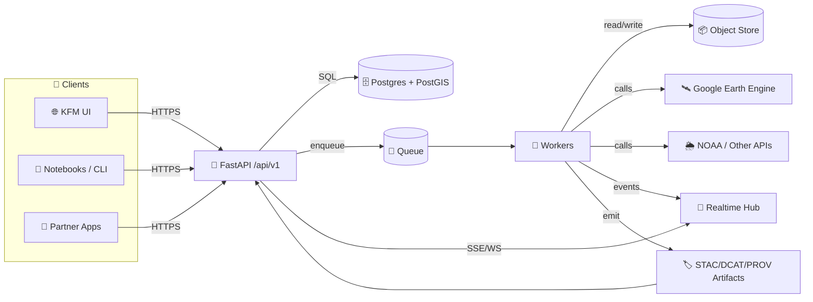

# KFM API 🛰️🗺️  
_Backend + integration boundary for the Kansas Frontier Matrix (KFM) platform_


> [!IMPORTANT]
> **KFM invariant (non‑negotiable):**  
> **ETL → STAC/DCAT/PROV Catalogs → Graph → APIs → UI → Story Nodes → Focus Mode**  
> This API is the **governed boundary**: it must not serve “mystery data” that isn’t cataloged, provenance-linked, and policy-checked.

---

## 🧭 Quick links
- 📘 **API Docs (Swagger):** `/docs`  
- 📕 **ReDoc:** `/redoc`  
- 🧾 **OpenAPI JSON:** `/openapi.json`  
- ❤️ **Health:** `/api/v1/health`  
- 📈 **Metrics (optional):** `/metrics`  
- 🧭 **Project overview:** `../README.md`  
- 🤝 **Collaboration rules:** `../.github/README.md` *(if present)*

---

## 📚 Table of contents
- [✨ What this API is responsible for](#-what-this-api-is-responsible-for)
- [🚫 Non-goals](#-non-goals)
- [🧱 Architecture snapshot](#-architecture-snapshot)
- [📁 Repository layout](#-repository-layout)
- [🚀 Quick start](#-quick-start)
- [⚙️ Configuration](#️-configuration)
- [🔐 Authentication & authorization](#-authentication--authorization)
- [📏 API conventions](#-api-conventions)
- [🗺️ Geospatial conventions](#️-geospatial-conventions)
- [🏷️ Catalog & provenance rules](#️-catalog--provenance-rules)
- [🧩 Endpoint map (baseline)](#-endpoint-map-baseline)
- [🧪 Example flows](#-example-flows)
- [🧵 Async jobs & workers](#-async-jobs--workers)
- [📡 Real-time (push)](#-real-time-push)
- [📊 Logging, monitoring, tracing](#-logging-monitoring-tracing)
- [🛡️ Security notes](#️-security-notes)
- [✅ Roadmap](#-roadmap)
- [🤝 Contributing](#-contributing)
- [📚 Reference library](#-reference-library)

---

## ✨ What this API is responsible for

This service exists to provide a **stable, versioned, secure** interface for the KFM ecosystem:

- 📥 **Ingestion orchestration**  
  uploads, scheduled pulls, ETL triggers, dataset registrations (but heavy lifting belongs in pipelines/workers)
- 🗺️ **Geospatial query boundary**  
  fields/regions/overlays/buffers/spatial joins, served safely (policy + performance)
- 🛰️ **Remote sensing integrations**  
  Earth Engine tasks, raster derivatives (NDVI, composites), export tracking
- 🤖 **Analytics / ML / inference orchestration**  
  batch/on-demand jobs with reproducible parameters & stored artifacts
- 🧪 **Simulation orchestration**  
  long-running scenarios; reproducible inputs; results stored + traceable
- 🧾 **Governed exports**  
  CSV/GeoJSON/tiles/images when needed (subject to redaction/classification)
- 📡 **Progress & updates**  
  WebSockets/SSE for job progress, sensors, and streaming status updates

---

## 🚫 Non-goals

- ❌ Building the UI (frontend lives elsewhere)
- ❌ Storing raw satellite archives locally by default (prefer catalogs + cached derivatives)
- ❌ Running “forever streams” in the API process (use brokers/workers; keep API stateless)
- ❌ Serving uncataloged outputs (no “just return this file” unless it is **cataloged + governed**)

---

## 🧱 Architecture snapshot

KFM favors **Clean Architecture** boundaries:

- **🧠 Domain** — entities + invariants (pure Python, no framework imports)
- **🧰 Application** — use cases (policy, authorization decisions, orchestration)
- **🔌 Adapters** — FastAPI routes, repositories, external clients
- **🏗️ Infrastructure** — Postgres/PostGIS, queues, object storage, cloud wiring

### 🔁 Runtime “shape” (typical deployment)


> [!NOTE]
> **Catalogs are the gate.** Workers/pipelines should emit STAC/DCAT/PROV so downstream layers (graph/UI) can trust outputs.

---

## 📁 Repository layout

> 📌 Treat this as the **target shape**. If the code differs today, update this file when structure changes.

```text
📦 api/
├─ 📄 README.md
├─ 🧾 pyproject.toml                 # preferred (or requirements.txt)
├─ 🐳 Dockerfile
├─ 🐳 docker-compose.yml
├─ 🧩 src/
│  └─ kfm_api/
│     ├─ 🚀 main.py                  # FastAPI app entrypoint
│     ├─ ⚙️ settings.py              # config/env parsing
│     ├─ 🛣️ api/
│     │  └─ v1/                      # routers grouped by version
│     ├─ 🧠 domain/                  # entities/value objects + invariants
│     ├─ 🧰 application/             # use cases/services (policy lives here)
│     ├─ 🔌 adapters/                # db repos, external clients
│     ├─ 🏗️ infrastructure/          # postgres, queues, storage, providers
│     └─ 🧪 tests/
└─ 🔧 scripts/                       # dev helpers (seed, migrate, etc.)
```

### 📜 Contracts (source of truth)
Pick one approach and keep it consistent:

- ✅ **Option A (recommended):** `api/contracts/openapi.yaml` + CI checks  
- ✅ **Option B:** “code-first” OpenAPI generation + pinned snapshots + diff checks  
- ✅ GraphQL (optional): `api/contracts/schema.graphql`

> [!TIP]
> **Contract changes first**, then implementation. If we can’t test the contract, it’s not ready to ship.

---

## 🚀 Quick start

### Option A — Docker (recommended) 🐳
```bash
cd api
cp .env.example .env
docker compose up --build
```

**Expected local URLs (typical):**
- API: `http://localhost:8000`
- OpenAPI docs: `http://localhost:8000/docs`
- ReDoc: `http://localhost:8000/redoc`

### Option B — Local dev (no Docker) 🧑‍💻
```bash
cd api
python -m venv .venv
source .venv/bin/activate
pip install -r requirements.txt

uvicorn kfm_api.main:app --reload --port 8000
```

### Common commands (suggested) 🧪🧹
```bash
# lint + format
ruff check .
ruff format .

# tests
pytest -q

# DB migrations (if using Alembic)
alembic upgrade head
```

---

## ⚙️ Configuration

Create a `.env` file (or supply env vars via your orchestrator).

### Minimum set (suggested)
| Variable | Example | Why |
|---|---|---|
| `APP_ENV` | `dev` | environment gating |
| `API_BASE_URL` | `http://localhost:8000` | URL building / links |
| `DATABASE_URL` | `postgresql+psycopg://user:pass@db:5432/kfm` | Postgres/PostGIS |
| `JWT_SECRET` | `...` | token signing |
| `JWT_ISSUER` | `kfm` | token validation |
| `JWT_AUDIENCE` | `kfm-ui` | token validation |
| `CORS_ALLOWED_ORIGINS` | `http://localhost:5173` | browser safety |
| `OBJECT_STORE_URL` | `s3://bucket/...` | rasters/artifacts |
| `QUEUE_URL` | `redis://...` | background jobs |
| `LOG_LEVEL` | `INFO` | observability |

### Nice-to-have (prod readiness) ✅
- `SENTRY_DSN=...` *(or OTEL exporter config)*
- `RATE_LIMIT_ENABLED=true`
- `REQUEST_ID_HEADER=X-Request-Id`
- `MAX_UPLOAD_MB=...`
- `OTEL_SERVICE_NAME=kfm-api`

---

## 🔐 Authentication & authorization

### Tokens
- Use **JWT Bearer tokens**
- Clients send: `Authorization: Bearer <token>`

### Claims (recommended)
- `sub` (user id)
- `org_id` (tenant/org scope)
- `roles` (e.g., `viewer`, `editor`, `admin`)
- `scopes` (optional)
- `exp`, `iss`, `aud`

### Rules
- Authorization decisions belong in **application/use-case layer** (not route handlers).
- All resource access is scoped by `org_id` (explicit in path/query or implicit from token).
- Audit “write” actions (dataset uploads, deletes, redactions, publishing steps).

> [!CAUTION]
> Treat ingestion as hostile by default: validate file types, size, and content; scan uploads; avoid SSRF patterns.

---

## 📏 API conventions

### Versioning
All public endpoints live under:
- `/api/v1/...`

### Content types
- `application/json` (default)
- `application/geo+json` (GeoJSON)
- `text/csv` (exports)
- `image/png` / `application/x-protobuf` (tiles if supported)

### Pagination & filtering
Preferred:
- `?limit=50&offset=0`  
or
- `?cursor=...&limit=...`

For time filtering:
- `?start=YYYY-MM-DD&end=YYYY-MM-DD`
- or ISO timestamps for high-resolution datasets

### Idempotency (recommended)
For create/trigger endpoints:
- Accept: `Idempotency-Key: <uuid>`
- Store per-user/per-org for TTL (prevents duplicate jobs/uploads)

### Correlation IDs (recommended)
- Accept `X-Request-Id` (or generate if absent)
- Return it in responses and error payloads

### Error shape (recommended)
```json
{
  "error": {
    "code": "FIELD_NOT_FOUND",
    "message": "Field 123 does not exist",
    "details": {},
    "correlation_id": "01HZZ...."
  }
}
```

---

## 🗺️ Geospatial conventions

- **Default API CRS:** WGS84 (`EPSG:4326`)
- **Geometry transport:** GeoJSON (`Feature` / `FeatureCollection`)
- **Server-side ops:** prefer PostGIS (buffers, intersects, within, joins)
- **Tiles (optional):** Web Mercator (`EPSG:3857`) for tile math

### Parameter conventions (recommended)
- `bbox=minLon,minLat,maxLon,maxLat` (EPSG:4326)
- `geom=<GeoJSON>` (for POST bodies; avoid massive query strings)
- `simplify=<meters>` (only for derived outputs; never mutate source)

> [!TIP]
> Store geometries in PostGIS with explicit SRIDs and perform transforms at boundaries.

---

## 🏷️ Catalog & provenance rules

> [!IMPORTANT]
> **Publishing rule:** If a dataset/result isn’t **cataloged + provenance-linked**, it isn’t “published” in KFM.

### Required metadata outputs (KFM standard)
For anything that becomes user-visible or reusable:
- 🗺️ **STAC** (Collections + Items) for assets/layers
- 🏷️ **DCAT** dataset entries for discovery & distribution
- 🧬 **PROV** lineage bundles for inputs → activities → outputs

### How the API participates
- The API can **trigger** ETL/jobs, but workers/pipelines must:
  - write outputs to stable storage (object store / DB)
  - emit STAC/DCAT/PROV artifacts
  - return catalog IDs / stable URLs (not random temp paths)
- The API serves:
  - catalog discovery endpoints (STAC/DCAT)
  - provenance views (PROV)
  - evidence bundles (for Story Nodes + Focus Mode)

### Sensitivity propagation (always-on)
- Outputs cannot be **less restricted** than inputs unless a documented redaction step exists.
- Any AI-assisted outputs must be **labeled** and provenance-linked (model + version + config where allowed).

---

## 🧩 Endpoint map (baseline)

> These are the **target contracts**. Keep `/api/v1` stable and version breaking changes.

### ✅ Core
| Method | Path | Auth | What it does |
|---:|---|:---:|---|
| GET | `/api/v1/health` | ❌ | Liveness / readiness |
| POST | `/api/v1/auth/login` | ❌ | Issue JWT |
| GET | `/api/v1/auth/me` | ✅ | Current user + roles |
| POST | `/api/v1/data/upload` | ✅ | Upload dataset / trigger ingest |
| GET | `/api/v1/fields?bbox=...` | ✅ | List fields with filters |
| GET | `/api/v1/field/{field_id}` | ✅ | Field metadata + geometry |
| GET | `/api/v1/field/{field_id}/timeseries?var=ndvi` | ✅ | Variable timeseries |
| POST | `/api/v1/simulation/run` | ✅ | Start simulation → returns job id |
| GET | `/api/v1/jobs/{job_id}` | ✅ | Job status/progress |
| GET | `/api/v1/jobs/{job_id}/result` | ✅ | Result links / payload (when ready) |
| GET | `/api/v1/export/fielddata.csv?...` | ✅ | Bulk export (CSV) |

### 🏷️ Catalog & provenance (recommended)
| Method | Path | Auth | What it does |
|---:|---|:---:|---|
| GET | `/api/v1/catalog/stac` | ✅/❌ | STAC root / catalog entrypoint |
| GET | `/api/v1/catalog/stac/collections/{id}` | ✅/❌ | STAC Collection by id |
| GET | `/api/v1/catalog/stac/items/{id}` | ✅/❌ | STAC Item by id |
| GET | `/api/v1/catalog/dcat/{id}` | ✅/❌ | DCAT dataset view |
| GET | `/api/v1/prov/runs/{run_id}` | ✅ | PROV lineage bundle |

### 📚 Evidence bundles (Story Nodes + Focus Mode)
| Method | Path | Auth | What it does |
|---:|---|:---:|---|
| GET | `/api/v1/evidence/bundle/{bundle_id}` | ✅ | Evidence-only payload (citations + assets) |

### 🗺️ Tiles (optional)
| Method | Path | Auth | What it does |
|---:|---|:---:|---|
| GET | `/api/v1/tiles/{z}/{x}/{y}.pbf` | ✅ | Vector tiles |
| GET | `/api/v1/tiles/{z}/{x}/{y}.png` | ✅ | Raster tiles |

---

## 🧪 Example flows

### 1) Query NDVI timeseries 📈
```bash
curl -H "Authorization: Bearer $TOKEN" \
  "http://localhost:8000/api/v1/field/123/timeseries?var=ndvi&start=2026-03-01&end=2026-10-31"
```

**Response (example):**
```json
{
  "field_id": 123,
  "variable": "ndvi",
  "unit": "index",
  "series": [
    {"date": "2026-03-01", "value": 0.61},
    {"date": "2026-03-08", "value": 0.64}
  ],
  "source": {
    "provider": "earth_engine",
    "dataset": "SENTINEL_2",
    "method": "weekly_median"
  }
}
```

### 2) Start a simulation 🧮
```bash
curl -X POST \
  -H "Authorization: Bearer $TOKEN" \
  -H "Content-Type: application/json" \
  -d '{
    "scenario": "yield_projection",
    "field_id": 123,
    "start_date": "2026-03-01",
    "end_date": "2026-10-31",
    "parameters": { "irrigation": "baseline" }
  }' \
  "http://localhost:8000/api/v1/simulation/run"
```

**Response (example):**
```json
{ "job_id": "sim_01HZZY8VQ7...", "status": "queued" }
```

### 3) Export data 🧾
```bash
curl -L \
  -H "Authorization: Bearer $TOKEN" \
  "http://localhost:8000/api/v1/export/fielddata.csv?field_id=123&var=ndvi"
```

---

## 🧵 Async jobs & workers

Use jobs when:
- rasters/time windows are large
- compute is heavy (ML, simulation, mosaics)
- external APIs are involved (GEE exports, NOAA pulls)

### Common pattern ✅
1) `POST` creates job → returns `job_id`
2) worker executes → writes artifacts (object store / DB)
3) worker emits **STAC/DCAT/PROV**
4) API exposes results by:
   - `GET /jobs/{job_id}` + `GET /jobs/{job_id}/result`
   - plus catalog endpoints once “published”

### Suggested job states 🔁
- `queued` → `running` → `succeeded`
- `queued|running` → `failed`
- optional: `canceled`

### Governance expectations
- Job outputs are **never** served “raw” from temp storage.
- Results become stable by:
  - publishing to catalog with stable IDs
  - generating lineage (PROV) + classification propagation
  - returning evidence bundles where needed

---

## 📡 Real-time (push)

Use WebSockets/SSE for:
- job progress updates (avoid aggressive polling)
- sensor dashboards / streaming status

**WebSocket endpoints (example)**
- `ws://localhost:8000/ws`
- `ws://localhost:8000/ws/jobs/{job_id}`
- `ws://localhost:8000/ws/sensors/field/{field_id}`

**Message shape (example)**
```json
{
  "type": "job.progress",
  "job_id": "sim_01HZZY8VQ7...",
  "progress": 42,
  "status": "running",
  "message": "Computing weekly composites..."
}
```

---

## 📊 Logging, monitoring, tracing

Recommended baseline:
- 📜 Structured logs: method, endpoint, user_id, org_id, params summary, status_code, latency
- 🧷 Correlation IDs: `X-Request-Id`
- 📈 Metrics: Prometheus + Grafana
- 🧵 Tracing: OpenTelemetry (`traceparent` propagation)
- ✅ Health endpoint split (optional): liveness vs readiness

---

## 🛡️ Security notes

- 🔒 Keep DB/brokers in private network segments
- 🌐 Public exposure limited to HTTPS (web/API)
- 🧯 Rate-limit login, lockout policies, strong password hashing (bcrypt/argon2)
- 🧪 Validate ingestion: file type allowlist + AV scanning + size limits
- 🧾 Audit logging for “write” actions (upload, publish, redaction, delete)
- 🔐 Secrets via env/secret managers (never commit tokens)

> [!CAUTION]
> “Public repo” implies “public download.” Never commit sensitive GeoJSON/CSVs or “temporary exports” into version control.

---

## ✅ Roadmap

- [ ] Lock OpenAPI v1 (source-of-truth file + CI diff checks)
- [ ] Implement JWT auth middleware + org/role guards
- [ ] PostGIS-backed field + query endpoints (bbox, intersects, search)
- [ ] Queue + worker for simulation + heavy analytics
- [ ] Catalog endpoints (STAC/DCAT) + PROV lineage views
- [ ] WebSocket/SSE topics for job progress + streaming
- [ ] Export endpoints (CSV/GeoJSON/tiles) + redaction policies
- [ ] Rate limits + audit logs + secret management + security scans

---

## 🤝 Contributing

- 🧠 Keep business rules in **domain/application**, not in FastAPI routes
- 🧪 Add tests for every use-case and route (happy path + auth + edge cases)
- 🧩 Prefer small PRs with clear intent
- 📓 Document decisions in `/docs/adr/` (Architecture Decision Records) *(if present)*
- 🏷️ If you touch data outputs: ensure STAC/DCAT/PROV artifacts are emitted and validated

---

## 📚 Reference library

> These are **implementation guidance** only; they must not override KFM contracts/governance.  
> Also ensure licensing allows redistribution before committing PDFs into the repo.

<details>
<summary><strong>📦 Expand: Key PDFs that shape API + infrastructure decisions</strong></summary>

### 🧱 Architecture & engineering discipline
- 📄 **Kansas Frontier Matrix (KFM) – Master Technical Specification**  [oai_citation:0‡Kansas Frontier Matrix (KFM) – Master Technical Specification.pdf](file-service://file-MLtTh4CX1AqH6dNnKyYYEp)  
- 📄 **Clean Architectures in Python**  [oai_citation:1‡clean-architectures-in-python.pdf](file-service://file-6YHot4AqfpdbcrdfiYfpHM)  
- 📄 **Introduction to Docker**  [oai_citation:2‡Introduction-to-Docker.pdf](file-service://file-5SALje8G4GDUXHUM3P3LuU)  

### 🗄️ Databases
- 📄 **PostgreSQL Notes for Professionals**  [oai_citation:3‡PostgreSQL Notes for Professionals - PostgreSQLNotesForProfessionals.pdf](file-service://file-742sw3gADJniEdmC19JeAC)  
- 📄 **MySQL Notes for Professionals**  [oai_citation:4‡MySQL Notes for Professionals - MySQLNotesForProfessionals.pdf](file-service://file-GQ5jWwmLZCFb6enxwykaRh)  

### 🌐 Web & backend tooling
- 📄 **Node.js Notes for Professionals**  [oai_citation:5‡Node.js Notes for Professionals - NodeJSNotesForProfessionals.pdf](file-service://file-9qS1yEFvCBXbDdtTfpt3Ye)  

### 🗺️ Geospatial practice
- 📄 **Python Geospatial Analysis Cookbook**  [oai_citation:6‡python-geospatial-analysis-cookbook.pdf](file-service://file-HT14njz1MhrTZCE7Pwm5Cu)  

### 📈 Analytics & notebooks
- 📄 **Applied Data Science with Python and Jupyter**  [oai_citation:7‡applied-data-science-with-python-and-jupyter.pdf](file-service://file-2PdBHtR24Wq7MYWfG8agQo)  

### ❤️ Human-centered governance
- 📄 **Introduction to Digital Humanism**  [oai_citation:8‡Introduction to Digital Humanism.pdf](file-service://file-HC311tLjkcn1yRbyTBLJQQ)  
- 📄 **Principles of Biological Autonomy**  [oai_citation:9‡Principles of Biological Autonomy - book_9780262381833.pdf](file-service://file-PwPXcX5554FpuRsF3iXTCf)  

</details>

---
