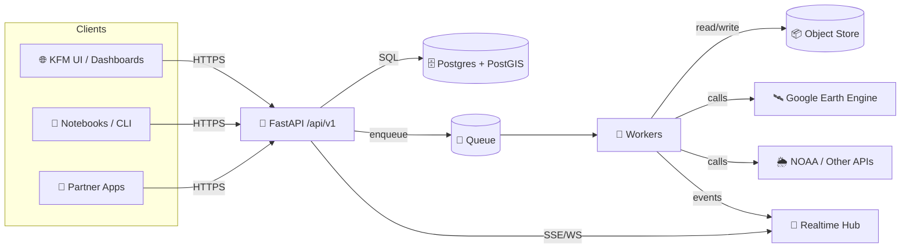

# KFM API 🛰️🗺️  
_Backend + integration layer for the Kansas Frontier Matrix (KFM) system_


> **Purpose:** Provide a stable, versioned, secure API for **geospatial data**, **remote sensing**, **ML/analytics**, **simulation**, and **data ingestion** — with support for **async jobs** + **real-time updates**.

---

## 🧭 Quick links
- 📘 **API Docs**: `/docs` (Swagger UI) · `/redoc` (ReDoc)
- 🧱 **Architecture**: Clean Architecture layers + adapters
- 🧵 **Async**: Job orchestration + worker execution
- 📡 **Realtime**: WebSockets / SSE for progress + sensor streams
- 🗺️ **Geo**: PostGIS-first spatial operations; GeoJSON I/O

---

## 📚 Table of contents
- [✨ What this API is responsible for](#-what-this-api-is-responsible-for)
- [🧱 Architecture snapshot](#-architecture-snapshot)
- [🧰 Tech stack](#-tech-stack)
- [🚀 Quick start](#-quick-start)
- [⚙️ Configuration](#️-configuration)
- [🔐 Authentication & authorization](#-authentication--authorization)
- [📏 API conventions](#-api-conventions)
- [🗺️ Geospatial conventions](#️-geospatial-conventions)
- [🧩 Endpoint map (baseline)](#-endpoint-map-baseline)
- [🧪 Example flows](#-example-flows)
- [🧵 Async jobs & workers](#-async-jobs--workers)
- [📡 Real-time (push)](#-real-time-push)
- [🛰️ External integrations](#️-external-integrations)
- [📊 Logging, monitoring, tracing](#-logging-monitoring-tracing)
- [🛡️ Security notes](#️-security-notes)
- [📚 Project reference library](#-project-reference-library-used-by-this-repo)
- [✅ Roadmap](#-roadmap)

---

## ✨ What this API is responsible for

- 📥 **Data ingestion** (uploads, scheduled pulls, sensor streams)
- 🗺️ **Geospatial queries** (fields, regions, overlays, buffers, spatial joins)
- 🛰️ **Remote sensing integrations** (Earth Engine exports, raster → indices like NDVI)
- 🤖 **ML inference & analytics** (on-demand or batch-style job orchestration)
- 🧪 **Simulation runs** (“what-if” scenarios; long-running jobs)
- 📡 **Push updates** (WebSockets / SSE for sensor + job progress)
- 🧾 **Exports** (CSV, GeoJSON, tiles/images when needed)

### 🚫 Non-goals (for now)
- Building the UI (this repo is API + orchestration only)
- Storing raw satellite archives locally (prefer cloud catalogs + cached derivatives)
- Running “forever streams” in the API process (streams should be broker/worker driven)

---

## 🧱 Architecture snapshot

This repo follows a **Clean Architecture / layered** approach:

- **🧠 Domain**: entities + invariants (pure Python, no framework imports)
- **🧰 Application**: use cases (orchestrate domain rules + policies)
- **🔌 Adapters**: FastAPI routes, DB repositories, external clients
- **🏗️ Infrastructure**: Postgres/PostGIS, queues/workers, object storage, cloud wiring

### Folder layout (recommended) 📁
```text
📦 api/
├─ 📄 README.md
├─ 🧾 pyproject.toml                 # preferred (or requirements.txt)
├─ 🐳 Dockerfile
├─ 🐳 docker-compose.yml
├─ 🧩 src/
│  └─ kfm_api/
│     ├─ 🚀 main.py                  # FastAPI app entrypoint
│     ├─ ⚙️ settings.py              # config/env parsing
│     ├─ 🛣️ api/
│     │  └─ v1/                      # routers grouped by version
│     ├─ 🧠 domain/                  # entities/value objects + invariants
│     ├─ 🧰 application/             # use cases/services (policy lives here)
│     ├─ 🔌 adapters/                # db repos, external clients
│     ├─ 🏗️ infrastructure/          # postgres, queues, storage, providers
│     └─ 🧪 tests/
└─ 🔧 scripts/                       # dev helpers (seed, migrate, etc.)
```

### Runtime “shape” (typical deployment) 🔁


---

## 🧰 Tech stack

**Core**
- 🐍 Python (FastAPI + Pydantic)
- 🗄️ Postgres + PostGIS (spatial source of truth)
- 🧵 Queue + workers (Redis/RabbitMQ/Kafka + your worker framework of choice)
- 📦 Object storage (S3/MinIO) for rasters + artifacts

**Geo & remote sensing**
- 🗺️ PostGIS spatial ops (buffers, intersects, within, joins)
- 🛰️ Earth Engine for scalable raster workflows (exports, composites, indices)
- 🧮 Optional: GDAL/Rasterio stack for local transforms

**Observability**
- 📜 structured logs + correlation IDs
- 📈 metrics (Prometheus) + dashboards (Grafana)
- 🧵 tracing (OpenTelemetry)

---

## 🚀 Quick start

### Option A — Docker (recommended) 🐳
```bash
cd api
cp .env.example .env
docker compose up --build
```

**Expected local URLs (typical):**
- API: `http://localhost:8000`
- OpenAPI docs: `http://localhost:8000/docs`
- ReDoc: `http://localhost:8000/redoc`

### Option B — Local dev (no Docker) 🧑‍💻
```bash
cd api
python -m venv .venv
source .venv/bin/activate
pip install -r requirements.txt
uvicorn kfm_api.main:app --reload --port 8000
```

### Common commands (suggestion) 🧪🧹
```bash
# lint + format
ruff check .
ruff format .

# tests
pytest -q

# DB migrations (if using Alembic)
alembic upgrade head
```

---

## ⚙️ Configuration

Create a `.env` file (or supply env vars via your orchestrator).

### Minimum set (suggested)
- `APP_ENV=dev|staging|prod`
- `API_BASE_URL=http://localhost:8000`
- `JWT_SECRET=...`
- `JWT_ISSUER=kfm`
- `JWT_AUDIENCE=kfm-ui`
- `DATABASE_URL=postgresql+psycopg://user:pass@db:5432/kfm`
- `CORS_ALLOWED_ORIGINS=http://localhost:3000`
- `OBJECT_STORE_URL=s3://...` (or `http://minio:9000/...`)
- `QUEUE_URL=redis://...` (or rabbitmq/kafka depending on implementation)
- `GEE_PROJECT=...` (if using Earth Engine tasks)
- `LOG_LEVEL=INFO`

### Nice-to-have (prod readiness) ✅
- `SENTRY_DSN=...` (or OTEL exporter config)
- `RATE_LIMIT_ENABLED=true`
- `REQUEST_ID_HEADER=X-Request-Id`
- `MAX_UPLOAD_MB=...`

---

## 🔐 Authentication & authorization

- Use **JWT Bearer tokens**
- Clients send: `Authorization: Bearer <token>`
- Role / org / ownership checks happen per resource (field ownership, admin-only actions, etc.)

**Design rule:** Keep authorization rules in the **application/use-case** layer, not in route handlers.

**Multi-tenant note:** Prefer `org_id` scoping everywhere (explicitly or derived from JWT claims).

---

## 📏 API conventions

### Versioning
- All public endpoints should be versioned under:  
  `/api/v1/...`

### Content types
- `application/json` (default)
- `application/geo+json` (GeoJSON)
- `text/csv` (bulk exports)
- `image/png` / `application/x-protobuf` (tiles, if supported)

### Pagination & filtering
Preferred patterns:
- `?limit=50&offset=0`
- or cursor-based: `?cursor=...&limit=...`
- Filters: `?start=YYYY-MM-DD&end=YYYY-MM-DD&var=ndvi`

### Idempotency (recommended)
For endpoints that create jobs/records:
- Accept: `Idempotency-Key: <uuid>`
- Store per-user/per-org for a short TTL to prevent accidental duplicates

### Error shape (recommended)
```json
{
  "error": {
    "code": "FIELD_NOT_FOUND",
    "message": "Field 123 does not exist",
    "details": {},
    "correlation_id": "01HZZ...."
  }
}
```

---

## 🗺️ Geospatial conventions

- **Coordinates**: default **WGS84** (EPSG:4326) for API I/O
- **Geometry transport**: GeoJSON (Feature / FeatureCollection)
- **Server-side spatial operations**: prefer PostGIS (buffers, intersects, within, etc.)
- **Tiles** (optional): Web Mercator (EPSG:3857) for map tile math

**Tip:** Store geometries in PostGIS with a consistent SRID and use explicit transforms at boundaries.

---

## 🧩 Endpoint map (baseline)

> These endpoints are the **core contract** this API aims to support. Add/remove as the repo evolves, but keep `/api/v1` stable.

### ✅ Core
| Method | Path | Auth | What it does |
|---:|---|:---:|---|
| GET | `/api/v1/health` | ❌ | Liveness / readiness |
| POST | `/api/v1/auth/login` | ❌ | Issue JWT |
| POST | `/api/v1/auth/refresh` | ❌/✅ | Refresh token flow (if used) |
| GET | `/api/v1/auth/me` | ✅ | Current user + roles |
| POST | `/api/v1/data/upload` | ✅ | Upload dataset / trigger ingest |
| GET | `/api/v1/field/{field_id}` | ✅ | Field metadata + geometry |
| GET | `/api/v1/field/{field_id}/timeseries?var=ndvi` | ✅ | NDVI or other variable timeseries |
| POST | `/api/v1/simulation/run` | ✅ | Start simulation → returns job id |
| GET | `/api/v1/jobs/{job_id}` | ✅ | Job status/progress |
| GET | `/api/v1/export/fielddata.csv?...` | ✅ | Bulk export (CSV) |

### 🗺️ Optional (common expansions)
| Method | Path | Auth | What it does |
|---:|---|:---:|---|
| GET | `/api/v1/fields?bbox=...` | ✅ | List fields with filters |
| POST | `/api/v1/fields` | ✅ | Create field geometry + metadata |
| GET | `/api/v1/jobs/{job_id}/result` | ✅ | Fetch job outputs (links/JSON) |
| GET | `/api/v1/tiles/{z}/{x}/{y}.pbf` | ✅ | Vector tiles (if enabled) |

---

## 🧪 Example flows

### 1) Query NDVI timeseries 📈
```bash
curl -H "Authorization: Bearer $TOKEN" \
  "http://localhost:8000/api/v1/field/123/timeseries?var=ndvi&start=2026-03-01&end=2026-10-31"
```

**Response (example):**
```json
{
  "field_id": 123,
  "variable": "ndvi",
  "unit": "index",
  "series": [
    {"date": "2026-03-01", "value": 0.61},
    {"date": "2026-03-08", "value": 0.64}
  ],
  "source": {
    "provider": "earth_engine",
    "dataset": "SENTINEL_2",
    "method": "weekly_median"
  }
}
```

### 2) Start a simulation 🧮
```bash
curl -X POST \
  -H "Authorization: Bearer $TOKEN" \
  -H "Content-Type: application/json" \
  -d '{
    "scenario": "yield_projection",
    "field_id": 123,
    "start_date": "2026-03-01",
    "end_date": "2026-10-31",
    "parameters": { "irrigation": "baseline" }
  }' \
  "http://localhost:8000/api/v1/simulation/run"
```

**Response (example):**
```json
{ "job_id": "sim_01HZZY8VQ7...", "status": "queued" }
```

Then:
- poll `GET /api/v1/jobs/{job_id}`
- or subscribe via WebSocket/SSE for progress

### 3) Export data 🧾
```bash
curl -L \
  -H "Authorization: Bearer $TOKEN" \
  "http://localhost:8000/api/v1/export/fielddata.csv?field_id=123&var=ndvi"
```

---

## 🧵 Async jobs & workers

Use async jobs when:
- data volumes are large (big rasters / long time windows)
- analysis is compute-heavy (ML inference on imagery, simulation)
- external APIs are involved (Earth Engine exports, NOAA pulls)

### Common pattern ✅
1) `POST` creates a job, returns `job_id` immediately  
2) workers execute, store results  
3) client pulls result or gets pushed updates  
4) results exposed via `/jobs/{job_id}` + export links

### Suggested job states 🔁
- `queued` → `running` → `succeeded`
- `queued|running` → `failed` (with error code)
- optional: `canceled`

---

## 📡 Real-time (push)

Use WebSockets/SSE for:
- sensor dashboards (avoid manual refresh)
- long-running job progress updates (avoid aggressive polling)

**WebSocket examples**
- `ws://localhost:8000/ws`
- `ws://localhost:8000/ws/jobs/{job_id}`
- `ws://localhost:8000/ws/sensors/field/{field_id}`

**Message shape (example)**
```json
{
  "type": "job.progress",
  "job_id": "sim_01HZZY8VQ7...",
  "progress": 42,
  "status": "running",
  "message": "Computing weekly composites..."
}
```

---

## 🛰️ External integrations

### Google Earth Engine (GEE)
Typical patterns:
- **Export task request** → enqueue worker → track status → publish output (tiles/GeoTIFF/aggregates)
- Persist provenance: dataset id, time window, processing steps

### NOAA / other external APIs
- use scheduled jobs for data pulls
- cache results to avoid rate-limit failures

---

## 📊 Logging, monitoring, tracing

Recommended baseline:
- Structured logs: method, endpoint, user_id, params, status_code, latency
- Correlation IDs for debugging
- `/health` endpoint for uptime monitors
- Metrics (Prometheus) + dashboards (Grafana)

---

## 🛡️ Security notes

- Keep the DB in a **private network segment**
- Public exposure limited to HTTPS (443) on web/API layer
- Prefer DMZ + internal-only message brokers
- Rate-limit login, hash passwords (bcrypt/argon2), rotate secrets
- Treat all external ingestion as untrusted: validate file types + scan uploads

---

## 🧰 Tooling (suggested)

- ✅ `ruff` + formatter (fast lint + format)
- ✅ `pytest` + `httpx` (tests)
- ✅ `pre-commit` (lint gates)
- ✅ DB migrations (Alembic or equivalent)
- ✅ OpenAPI checks in CI (contract stability)

---

## 📚 Project reference library (used by this repo)

> Suggestion: store these under `docs/library/` and keep filenames stable for citations in ADRs & docs.

<details>
<summary>📦 Click to expand the full set of project PDFs (37 files)</summary>

### 🧱 Architecture, DevOps, & Data Infrastructure
- 📄 `Kansas Frontier Matrix (KFM) – Comprehensive Technical Documentation.pdf`
- 📄 `clean-architectures-in-python.pdf`
- 📄 `Introduction-to-Docker.pdf`
- 📄 `Node.js Notes for Professionals - NodeJSNotesForProfessionals.pdf`
- 📄 `PostgreSQL Notes for Professionals - PostgreSQLNotesForProfessionals.pdf`
- 📄 `MySQL Notes for Professionals - MySQLNotesForProfessionals.pdf`
- 📄 `implementing-programming-languages-an-introduction-to-compilers-and-interpreters.pdf`
- ⚠️ `Command Line Kung Fu_ ... Command_Line_Kung_Fu_...pdf` (appears truncated/corrupted in repo; re-download recommended)

### 🗺️ GIS, Cartography, Web Maps, & Visualization
- 📄 `Geographic Information System Basics - geographic-information-system-basics.pdf`
- 📄 `making-maps-a-visual-guide-to-map-design-for-gis.pdf`
- 📄 `geoprocessing-with-python.pdf`
- 📄 `python-geospatial-analysis-cookbook.pdf`
- 📄 `graphical-data-analysis-with-r.pdf`
- 📄 `google-maps-javascript-api-cookbook.pdf`
- ⚠️ `Google Maps API Succinctly - google_maps_api_succinctly.pdf` (appears truncated/corrupted in repo; re-download recommended)
- 📄 `webgl-programming-guide-interactive-3d-graphics-programming-with-webgl.pdf`
- 📄 `Computer Graphics using JAVA 2D & 3D.pdf`
- 📄 `responsive-web-design-with-html5-and-css3.pdf`

### 🤖 Data Science, ML, & Statistics
- 📄 `applied-data-science-with-python-and-jupyter.pdf`
- 📄 `deep-learning-in-python-prerequisites.pdf`
- 📄 `regression-analysis-with-python.pdf`
- 📄 `Bayesian computational methods.pdf`
- 📄 `Understanding Statistics & Experimental Design.pdf`
- 📄 `Statistics Done Wrong - Alex_Reinhart-Statistics_Done_Wrong-EN.pdf`
- 📄 `Data Science &-  Machine Learning (Mathematical & Statistical Methods).pdf`
- 📄 `Artificial-neural-networks-an-introduction.pdf`
- 📄 `AI Foundations of Computational Agents 3rd Ed.pdf`
- 📄 `Data Mining Concepts & applictions.pdf`

### 🛰️ Remote Sensing, Simulation, Optimization, Graphs
- 📄 `Cloud-Based Remote Sensing with Google Earth Engine-Fundamentals and Applications.pdf`
- 📄 `Google Earth Engine Applications.pdf`
- 📄 `Scientific Modeling and Simulation_ A Comprehensive NASA-Grade Guide.pdf`
- 📄 `Scalable Data Management for Future Hardware.pdf`
- 📄 `Spectral Geometry of Graphs.pdf`
- 📄 `Generalized Topology Optimization for Structural Design.pdf`
- 📄 `MATLAB Programming for Engineers Stephen J. Chapman.pdf`

### 🧑‍🤝‍🧑 Human-centered framing & ethics
- 📄 `Introduction to Digital Humanism.pdf`
- 📄 `Principles of Biological Autonomy - book_9780262381833.pdf`

</details>

---

## ✅ Roadmap

- [ ] Lock an initial **OpenAPI spec** (v1) + CI contract check
- [ ] Implement auth middleware (JWT) + role/ownership guards
- [ ] Add PostGIS-backed field + timeseries endpoints
- [ ] Add queue + worker for simulation + heavy analytics
- [ ] Add WebSocket topics for sensor updates + job progress
- [ ] Add export endpoints (CSV/GeoJSON) + provenance tracking
- [ ] Add rate limits + audit logging + secret management

---

## 🤝 Contributing

- Keep business rules in **domain/application**, not in FastAPI routes
- Add tests for every use-case and every route (happy path + auth + edge cases)
- Prefer small PRs with clear intent 🧩
- Document decisions in `/docs/adr/` (Architecture Decision Records)

---
