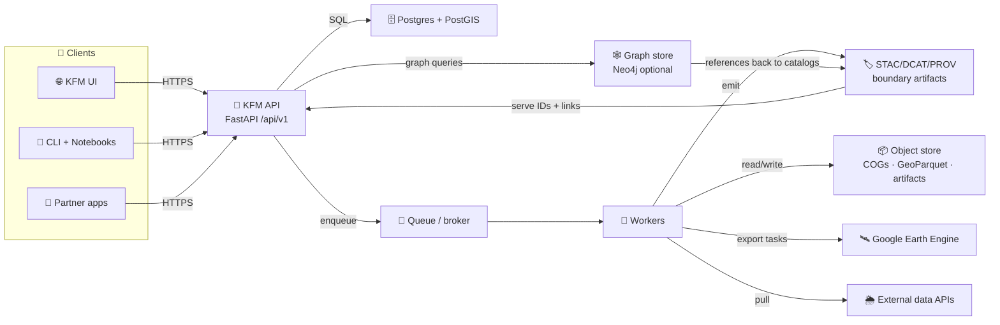

<!--
📌 This README defines the governed backend boundary for KFM.
🗓️ Last updated: 2026-01-13
-->

# 🚪 KFM API 🛰️🗺️  
_Backend + integration boundary for the Kansas Frontier Matrix (KFM) platform_

<p align="left">
  
  
  
  
  
  
  
  
  
  
  
  
  
  
  
</p>

> [!IMPORTANT]
> **KFM invariant (non‑negotiable):**  
> **ETL → STAC/DCAT/PROV → Graph → APIs → UI → Story Nodes → Focus Mode**  
> This API is the **governed trust boundary**: it must not serve “mystery data” that isn’t **cataloged**, **provenance‑linked**, and **policy‑checked**. ✅🧾

> [!IMPORTANT]
> **Focus Mode hard gate (non‑negotiable):**  
> Focus Mode must display **only provenance‑linked content**. Any AI contribution must be **opt‑in**, **clearly labeled**, and **bounded by evidence** (no side‑channel leaks). 🧠🔒

---

## 🔗 Quick links
- 🧪 Swagger (OpenAPI UI): `/docs`
- 📕 ReDoc: `/redoc`
- 🧾 OpenAPI JSON: `/openapi.json`
- ❤️ Health: `/api/v1/health`
- 📈 Metrics (optional): `/metrics`
- 🗂️ STAC root: `/api/v1/catalog/stac`
- 🏷️ DCAT datasets: `/api/v1/catalog/dcat` *(implementation-specific)*
- 🧬 PROV run lineage: `/api/v1/prov/runs/{run_id}`
- 🧾 Evidence bundle (Story/Focus): `/api/v1/evidence/bundle/{bundle_id}`
- 🧠 Focus Mode context bundle (target): `/api/v1/focus/context` *(policy-gated)*
- 🧩 Data-contract validation (target): `/api/v1/contracts/datasets/validate` *(policy-gated)*
- 📡 Job stream (WS/SSE): `/ws/jobs/{job_id}` *(if enabled)*

Repo navigation:
- 🧭 Project overview: `../README.md`
- 🧠 Master guide (canonical ordering): `../docs/MARKDOWN_GUIDE_v13.md.gdoc` *(or equivalent)*
- 🧩 Executable boundary: `../src/README.md`
- 📦 Data + metadata boundary: `../data/README.md`
- 🧰 Toolchain boundary: `../tools/README.md`
- 🧪 Test boundary: `../tests/README.md`
- 🤝 Contribution automation: `../.github/README.md` *(if present)*

---

## 🧾 Doc metadata

| Field | Value |
|---|---|
| Doc | `api/README.md` |
| Status | WIP 🚧 (contract-first) |
| Last updated | **2026-01-13** |
| Prime directive | **Serve only governed evidence** (IDs + catalogs + provenance) |
| Default stance | deny-by-default 🔒, hostile-input aware 🧯, audit-ready 🧾 |
| Canonical order | **ETL → STAC/DCAT/PROV → Graph → API → UI → Story → Focus** |
| Upstream governance | `docs/MARKDOWN_GUIDE_v13*` (repo-level contracts + invariants) |

---

## 🧭 Table of contents
- [🧠 Master guide alignment](#-master-guide-alignment)
- [📖 Glossary](#-glossary)
- [⭐ API north stars](#-api-north-stars)
- [✨ What this API is responsible for](#-what-this-api-is-responsible-for)
- [🚫 Non-goals](#-non-goals)
- [🧱 Architecture snapshot](#-architecture-snapshot)
- [📦 Data lifecycle](#-data-lifecycle)
- [📁 Repository layout](#-repository-layout-target-shape)
- [📜 Contracts and schemas](#-contracts-and-schemas-source-of-truth)
- [🧾 Data contracts](#-data-contracts-metadata-json)
- [🚀 Quick start](#-quick-start)
- [⚙️ Configuration](#️-configuration)
- [🔐 Authentication and authorization](#-authentication-and-authorization)
- [🏷️ Governance, classification, and evidence](#️-governance-classification-and-evidence)
- [🧠 Story Nodes and Focus Mode](#-story-nodes-and-focus-mode)
- [🧭 Graph governance](#-graph-governance)
- [📏 API conventions](#-api-conventions)
- [🗺️ Geospatial conventions](#️-geospatial-conventions)
- [🗂️ Catalog and provenance rules](#️-catalog-and-provenance-rules)
- [🌐 Federation and data spaces](#-federation-and-data-spaces)
- [🧩 Endpoint map](#-endpoint-map-target)
- [🧪 Example flows](#-example-flows)
- [🧵 Async jobs and workers](#-async-jobs-and-workers)
- [📡 Real-time push](#-real-time-push)
- [⚡ Performance and scalability](#-performance-and-scalability)
- [🛡️ Security notes](#️-security-notes)
- [📊 Logging, monitoring, tracing](#-logging-monitoring-tracing)
- [✅ Definition of done](#-definition-of-done-for-api-work)
- [🗺️ Roadmap](#️-roadmap)
- [🤝 Contributing](#-contributing)
- [📚 Reference library and influence map](#-reference-library-and-influence-map)
- [🕰️ Version history](#️-version-history)

---

## 🧠 Master guide alignment

This README is **not** the top-level authority. It inherits from the repo’s **Master Guide** (v13 or later) which defines:

- 🧭 the **canonical ordering** across subsystems (data → catalogs → graph → API → UI → narrative)
- 🧩 **contract artifacts** as first-class outputs (OpenAPI, JSON Schema, GraphQL SDL, UI configs)
- 🧾 **evidence artifacts** as first-class datasets (registered in STAC/DCAT with PROV lineage)
- 🏷️ sovereignty + governance rules (CARE/FAIR, classification propagation, no sensitive leaks)
- 🧪 minimum CI gates (schema validation, contract diffs, redaction tests)

> [!TIP]
> If you’re unsure “where a change belongs,” consult the Master Guide first. This API README only governs the **backend boundary**.

---

## 📖 Glossary

| Term | Meaning (KFM boundary meaning) |
|---|---|
| `dataset_id` | Stable identifier for a dataset definition (domain + name + version) |
| `layer_id` | Stable identifier for a spatial asset layer (vector/raster) |
| `run_id` | Stable identifier for a provenance-tracked run (ETL/analysis/sim) |
| `job_id` | Ephemeral execution handle for async work (maps to `run_id` when published) |
| `bundle_id` | Evidence bundle ID (what Story/Focus consumes) |
| `graph_id` | Stable entity ID in the knowledge graph (person/place/event/doc/etc.) |
| “published” | Means **cataloged + provenance-linked** (not “a file exists somewhere”) |

---

## ⭐ API north stars

KFM’s backend exists to support **truthful, reproducible, human‑centered** decision support — not vibes, not persuasion. 🧠🧾

- 🧾 **Provenance-first:** every dataset, derivative, and model output is evidence-linked (STAC/DCAT/PROV + stable IDs).
- 🧩 **Contract-first:** OpenAPI is the shipping interface; breaking changes require versioning.
- 🏷️ **Catalog-gated:** if it isn’t cataloged and lineage-linked, it isn’t “real” in KFM.
- 🔐 **Governance always-on:** classification, licensing, redaction, and “no privacy downgrade” rules are enforced.
- 🧠 **Focus Mode hard gate:** no unsourced content can appear in Focus Mode (AI is opt-in, labeled, bounded).
- 🧭 **Glossary consistency:** graph terms must be canonical (no duplicate nodes with drifting names).
- 🎲 **Reproducible by default:** jobs store parameters + versions + run receipts; results are never “magic.”
- 🤖 **AI is advisory:** AI outputs are labeled, bounded, and evidence-backed (uncertainty is first-class).
- ❤️ **Human autonomy:** provide explanation hooks, audit trails, and safe defaults that prevent automation complacency.

---

## ✨ What this API is responsible for

This service provides a **stable, versioned, secure** integration surface for the KFM ecosystem:

- 🧭 **Discovery + search (governed)**  
  dataset, layer, field, and evidence discovery via catalog + indexed stores
- 🗺️ **Geospatial query boundary**  
  policy-aware spatial search, filtering, overlays, and tile-friendly outputs
- 🏷️ **Catalog and evidence serving**  
  STAC/DCAT discovery endpoints + PROV lineage views + evidence bundles for Story/Focus
- 🧵 **Job orchestration**  
  start/monitor/cancel long-running work (ETL refresh, remote sensing exports, analytics, simulation, optimization)
- 🛰️ **Remote sensing integrations**  
  Earth Engine task triggers + export tracking (workers do the heavy lifting)
- 📊 **Analytics / inference orchestration**  
  regression/EDA/Bayesian analysis as reproducible jobs (with diagnostics + uncertainty artifacts)
- 🧪 **Simulation and optimization orchestration**  
  scenario runs with V&V posture, sensitivity metadata, and traceable outputs
- 🧩 **Contract + data-contract enforcement (target)**  
  validate OpenAPI + schemas + dataset metadata contracts as gates to “publish”
- 🔒 **Auth + policy enforcement**  
  classification propagation, licensing constraints, redaction, and audit logging
- 📦 **Governed exports**  
  CSV/GeoJSON/tiles/quicklooks **only when policy allows** and provenance pointers exist

---

## 🚫 Non-goals

- ❌ Building the UI (frontend lives in `web/`)
- ❌ Running “forever streams” inside the API process (use brokers/workers; keep API stateless)
- ❌ Serving uncataloged outputs (“just return this file”) unless it’s **cataloged + governed**
- ❌ Turning routes into business logic (policy belongs in application/domain)
- ❌ Being a generic chatbot (Focus Mode content must remain evidence-bounded)
- ❌ Treating previews as truth (quicklooks are UX helpers, not authoritative rasters)

---

## 🧱 Architecture snapshot

KFM favors clean boundaries: frameworks are adapters, not the core. 🧼🏛️

- 💠 **Domain** — entities + invariants (pure Python; no framework imports)
- 🧠 **Application** — use cases (policy decisions, orchestration, authz)
- 🔌 **Adapters** — FastAPI routes, repositories, external clients
- 🧱 **Infrastructure** — PostGIS, graph store, queues, object storage, cloud wiring

### 🔁 Runtime shape (typical)


> [!NOTE]
> **Catalogs are the gate.** Workers/pipelines emit STAC/DCAT/PROV so downstream (graph/UI/Focus) can trust what it sees. 🗂️✅

---

## 📦 Data lifecycle

KFM treats data staging + metadata emission as part of correctness. ✅

### Required staging (repo-level convention)
```text
📦 data/
├─ 🧱 raw/<domain>/                 # raw sources (immutable)
├─ 🧪 work/<domain>/                # intermediate artifacts
├─ ✅ processed/<domain>/           # publish candidates (stable)
├─ 🗂️ stac/
│  ├─ collections/                  # STAC Collection records
│  └─ items/                        # STAC Item records
├─ 🏷️ catalog/dcat/                 # DCAT dataset/distribution records (JSON-LD)
└─ 🧬 prov/                         # PROV lineage bundles
```

### The “publish” rule 🏷️🚫
A dataset (or analysis/simulation output) is **not published** until:
1) stable artifact exists (DB/object store), **and**  
2) STAC/DCAT/PROV boundary artifacts exist, **and**  
3) policy checks pass (classification/license/redaction), **and**  
4) graph references (if applicable) resolve to canonical entities.

---

## 📁 Repository layout (target shape)

> 📌 Treat this as the target shape. If your repo differs today, update this file when structure changes.

```text
📦 api/
├─ 📘 README.md
├─ 🧾 pyproject.toml                 # preferred (or requirements*.txt)
├─ 🐳 Dockerfile
├─ 🐳 docker-compose.yml             # optional (local dev)
├─ 📜 contracts/
│  ├─ 🧩 openapi.yaml                # ✅ source of truth (recommended)
│  ├─ 🧬 schemas/                    # JSON Schemas: STAC/DCAT/PROV/Evidence/Data-Contract
│  └─ 🧪 examples/                   # request/response fixtures for contract tests
├─ 🛡️ policy/                        # OPA/Rego bundles, conftest, redaction rules (optional)
├─ 🗄️ migrations/                    # Alembic migrations (if used)
├─ 📚 docs/                          # API runbooks, ADRs, security notes (if present)
├─ 🧩 src/
│  └─ 🧠 kfm_api/
│     ├─ 🚀 main.py                  # FastAPI entrypoint
│     ├─ ⚙️ settings.py              # config/env parsing
│     ├─ 🛣️ api/
│     │  └─ 🧭 v1/                   # routers grouped by version
│     ├─ 💠 domain/                  # types + invariants (pure)
│     ├─ 🧠 application/             # use cases (policy lives here)
│     ├─ 🔌 adapters/                # db repos, external clients, gateways
│     ├─ 🧱 infrastructure/          # postgres, graph, queues, storage, providers
│     └─ 🧪 tests/                   # API-scoped unit/integration tests
└─ 🧰 scripts/                       # dev helpers (seed, migrate, smoke tests)
```

---

## 📜 Contracts and schemas (source of truth)

**Contract changes first**, then implementation. ✅

Recommended posture:
- `contracts/openapi.yaml` is the API truth
- JSON Schemas for:
  - 🗂️ STAC Collections + Items
  - 🏷️ DCAT datasets + distributions
  - 🧬 PROV run bundles (JSON‑LD)
  - 📚 Evidence bundles (Story Nodes + Focus Mode)
  - 🧾 Dataset “data contracts” (metadata JSON) *(see next section)*

### ✅ Contract QA gates (recommended)
- ✅ OpenAPI diff checks (breaking changes require version bump)
- ✅ Example payload validation (fixtures validate against schema)
- ✅ Negative tests (unauthorized, restricted, invalid geometry)
- ✅ Policy tests (OPA/Conftest optional) for “who can see what”
- ✅ Idempotency tests for job endpoints (no duplicate jobs on retries)

> [!TIP]
> If we can’t test the contract, it’s not ready to ship. 🧪🧾

---

## 🧾 Data contracts (metadata JSON)

KFM treats a dataset’s metadata contract as a **machine-checkable entry ticket** to the catalogs. 🎟️🗂️

### Why this exists
- prevents “mystery layers” (no source/license/processing context)
- enables **automatic DCAT/STAC/PROV emission**
- supports governance (classification + license gating)
- makes derived evidence reproducible (inputs/params/versions captured)

### Suggested `dataset.contract.json` shape (target)
```json
{
  "dataset_id": "kfm.<domain>.<dataset>.v1",
  "title": "Human-readable title",
  "description": "What this is and what it is not",
  "source": {
    "name": "Provider / archive / agency",
    "uri": "https://example.org/source",
    "retrieved_at": "2026-01-01"
  },
  "license": {
    "spdx": "CC-BY-4.0",
    "attribution": "Required attribution text"
  },
  "classification": "public",
  "spatial": {
    "crs": "EPSG:4326",
    "bbox": [-102.05, 36.99, -94.58, 40.00]
  },
  "temporal": {
    "start": "1930-01-01",
    "end": "1940-12-31"
  },
  "schema": {
    "kind": "vector|raster|tabular",
    "fields": [
      {"name": "county_name", "type": "string"},
      {"name": "value", "type": "float"}
    ]
  },
  "processing": {
    "pipeline": "kfm.etl.<name>",
    "version": "2026.01",
    "inputs": ["kfm.<domain>.<input>.v1"],
    "parameters": {}
  },
  "outputs": {
    "stac_collection_id": "kfm.stac.collection.<id>",
    "dcat_dataset_id": "kfm.dcat.<id>",
    "prov_template": "kfm.prov.template.<id>"
  }
}
```

### API enforcement (target)
- ✅ validate contract JSON via schema
- ✅ block “unknown license” if configured
- ✅ require classification label
- ✅ require STAC/DCAT/PROV pointers at publish time (or enforce generation)

---

## 🚀 Quick start

### Option A — Docker (recommended) 🐳
```bash
cd api
cp .env.example .env
docker compose up --build
```

Expected local URLs (typical):
- API: `http://localhost:8000`
- Swagger: `http://localhost:8000/docs`
- ReDoc: `http://localhost:8000/redoc`

### Option B — Local dev (no Docker) 🧑‍💻
```bash
cd api
python -m venv .venv
source .venv/bin/activate
pip install -r requirements.txt

uvicorn kfm_api.main:app --reload --port 8000
```

### Suggested dev commands 🧹🧪
```bash
# lint + format
ruff check .
ruff format .

# tests
pytest -q

# type check (optional)
mypy .

# migrations (if using Alembic)
alembic upgrade head
```

> [!NOTE]
> If your PR touches DB/graph/jobs/contracts: run at least one Docker-backed integration pass before requesting review. Container parity saves time. ✅

---

## ⚙️ Configuration

Create a `.env` file (or supply env vars via your orchestrator). 🔐

### Minimum set (suggested)
| Variable | Example | Why |
|---|---|---|
| `APP_ENV` | `dev` | environment gating |
| `API_BASE_URL` | `http://localhost:8000` | link building |
| `DATABASE_URL` | `postgresql+psycopg://user:pass@db:5432/kfm` | Postgres/PostGIS |
| `JWT_SECRET` | `...` | token signing |
| `JWT_ISSUER` | `kfm` | token validation |
| `JWT_AUDIENCE` | `kfm-ui` | token validation |
| `CORS_ALLOWED_ORIGINS` | `http://localhost:5173` | browser safety |
| `OBJECT_STORE_URL` | `s3://bucket/...` | rasters/artifacts |
| `QUEUE_URL` | `redis://...` | background jobs |
| `LOG_LEVEL` | `INFO` | observability |

### Policy + governance (recommended)
| Variable | Example | Why |
|---|---|---|
| `POLICY_ENGINE` | `internal` / `opa` | enforcement strategy |
| `OPA_BUNDLE_PATH` | `./policy/bundle.tar.gz` | policy bundle (if used) |
| `DATA_DEFAULT_CLASSIFICATION` | `public` | safe default |
| `ALLOW_EXPORTS` | `true` | export gating |
| `MAX_UPLOAD_MB` | `250` | ingestion safety |
| `BLOCK_UNKNOWN_LICENSE` | `true` | avoid accidental publishing |
| `REDACT_PRECISE_LOCATIONS` | `true` | sovereignty: reduce leak risk |
| `GRAPH_GLOSSARY_REQUIRED` | `true` | enforce canonical nodes |

### Remote sensing (Earth Engine) (optional)
| Variable | Example | Why |
|---|---|---|
| `GEE_PROJECT` | `my-ee-project` | task routing |
| `GEE_MAX_CONCURRENT_EXPORTS` | `3` | quota/backpressure |
| `GEE_TASK_POLL_SECONDS` | `30` | safe polling |
| `GEE_EXPORT_BUCKET` | `kfm-artifacts` | export destination |

### Observability (recommended)
- `OTEL_SERVICE_NAME=kfm-api`
- `OTEL_EXPORTER_OTLP_ENDPOINT=...`
- `SENTRY_DSN=...` *(optional)*

---

## 🔐 Authentication and authorization

### Tokens
- Use **JWT Bearer tokens**
- Clients send: `Authorization: Bearer <token>`

### Claims (recommended)
- `sub` (user id)
- `org_id` (tenant/org scope)
- `roles` (e.g., `viewer`, `editor`, `admin`)
- `scopes` (optional)
- `exp`, `iss`, `aud`

### Authorization model (recommended)
- **RBAC** for broad capabilities (viewer/editor/admin)
- **ABAC** for data governance constraints:
  - classification (`public` / `internal` / `restricted`)
  - license constraints
  - org ownership / sharing rules
  - feature gates for exports/publish
  - “no sensitive location leaks” rules for Story/Focus rendering

**Rules**
- AuthZ decisions belong in **application/use-case layer** (not route handlers).
- Audit “write” actions: uploads, publish/promote, redactions, deletes.
- Treat ingestion as hostile: validate file types, size, content; avoid SSRF; scan uploads.

---

## 🏷️ Governance, classification, and evidence

KFM treats provenance and classification as part of “correctness.” ✅🧾

### ✅ Always-on rules
- Every dataset and derivative has:
  - stable IDs (`dataset_id`, `layer_id`, `run_id`)
  - classification label
  - license/attribution (or explicitly unknown + blocked)
  - provenance pointers (STAC/DCAT/PROV)
- Every user-visible claim in Story/Focus is traceable to cataloged evidence.

### 🔒 Sensitivity propagation (non-negotiable)
Outputs **cannot** become less restricted than inputs unless a documented redaction step exists and is auditable.

### 🤖 AI-assisted outputs (label + bound)
If a job uses ML/LLM inference:
- mark outputs as **AI-assisted**
- include model/version/config refs where allowed
- include evaluation + limits pointers (model card / artifact link)
- require evidence bundle references when used in Story Nodes / Focus Mode

> [!IMPORTANT]
> KFM AI posture: **assist, don’t assert.** Claims must point to evidence, and uncertainty must be explicit. 🎯

### 🧾 Recommended “evidence pointer” block (response shape)
Wherever possible, results should include a compact evidence pointer:

```json
{
  "evidence": {
    "dataset_id": "kfm.<domain>.<dataset>.v1",
    "run_id": "kfm.run.<pipeline>.<timestamp>",
    "stac": {
      "collection_id": "kfm.stac.collection.<id>",
      "item_id": "kfm.stac.item.<id>"
    },
    "dcat_dataset_id": "kfm.dcat.<id>",
    "prov_run_id": "kfm.prov.run.<id>",
    "classification": "public",
    "license": "CC-BY-4.0"
  }
}
```

---

## 🧠 Story Nodes and Focus Mode

Story Nodes + Focus Mode are where KFM becomes a **governed, interactive storybook** 📖🗺️ — but they must remain trust-preserving.

### Story Nodes (governed narrative artifacts)
A valid Story Node should:
- 🧾 include citations for every factual claim (to cataloged sources)
- 🧩 reference graph entities with stable `graph_id`s (people/places/events/docs)
- 🧠 clearly distinguish **fact vs interpretation** (especially if AI-assisted)
- 🏷️ inherit classification rules (no narrative can “downgrade” sensitivity)

### Focus Mode (interactive, provenance-linked experience)
Focus Mode must:
- ✅ display only provenance-linked content (hard gate)
- 🧠 treat AI as opt-in + labeled + evidence-bounded (no default freeform)
- 🔒 prevent sensitive location leaks (generalize/blur/omit when required)
- 🧾 allow click-through: everything should resolve back to evidence pointers

---

## 🧭 Graph governance

The graph is the **semantic spine** of KFM. It powers:
- 🔎 semantic search (entities + relationships)
- 🧠 Focus Mode context traversal (bounded queries, evidence pointers)
- ✅ consistency checks (referential integrity between graph ↔ catalogs)

### Canonical glossary (target)
To avoid drift:
- maintain canonical nodes for key terms/events (single source of truth)
- reconcile duplicates (domain steward review)
- attach authority IDs where possible (Wikidata/LoC/etc.)

> [!TIP]
> Graph endpoints must be **bounded**. No unbounded traversals from public routes. 🧱

---

## 📏 API conventions

### Versioning
All public endpoints live under:
- `/api/v1/...`

### Content types (typical)
- `application/json` (default)
- `application/geo+json` (GeoJSON)
- `text/csv` (exports)
- `image/png` / `image/jpeg` (thumbnails/quicklooks)
- `application/x-protobuf` (vector tiles, if supported)
- `application/octet-stream` (binary artifacts via signed URLs)

### Pagination and determinism
Preferred:
- `?limit=50&offset=0`  
or
- `?cursor=...&limit=...`

Hard requirements:
- stable ordering
- bounded responses
- consistent cursor semantics
- no “unbounded graph traversals” from public endpoints

### Idempotency (recommended)
For create/trigger endpoints:
- Accept: `Idempotency-Key: <uuid>`
- Store per-user/per-org for TTL (prevents duplicates on retries)

### Correlation IDs (recommended)
- Accept `X-Request-Id` (or generate if absent)
- Return it in responses and error payloads

### Async pattern (recommended)
- `202 Accepted` for long work
- return `job_id` immediately
- later results resolve to stable `run_id` + catalog pointers

### Error shape (recommended)
```json
{
  "error": {
    "code": "FIELD_NOT_FOUND",
    "message": "Field 123 does not exist",
    "details": {},
    "correlation_id": "01HZZ...."
  }
}
```

---

## 🗺️ Geospatial conventions

- **Default API CRS:** WGS84 (`EPSG:4326`)
- **Geometry transport:** GeoJSON (`Feature` / `FeatureCollection`)
- **Server-side ops:** prefer PostGIS (buffers, intersects, within, joins)
- **Tiles (optional):** Web Mercator (`EPSG:3857`) for tile math

### Parameter conventions (recommended)
- `bbox=minLon,minLat,maxLon,maxLat` (EPSG:4326)
- `geom=<GeoJSON>` (POST body; avoid huge query strings)
- `simplify=<meters>` (derived outputs; never mutate sources)
- `precision=<int>` (optional float rounding control)

### Output correctness rules ✅
- store geometries with explicit SRIDs
- transform at boundaries (DB storage may differ; output must be explicit)
- if clients send geometry without CRS metadata, treat it as `EPSG:4326` **only if policy says so** (and document it)

> [!TIP]
> CRS ambiguity is a correctness bug. 🧭

---

## 🗂️ Catalog and provenance rules

> [!IMPORTANT]
> **Publishing rule:** If a dataset/result isn’t **cataloged + provenance-linked**, it isn’t “published” in KFM. 🗂️🚫

### Required boundary artifacts (KFM standard)
For anything user-visible or reusable:
- 🗺️ **STAC** (Collections + Items) for spatial assets/layers
- 🏷️ **DCAT** dataset entries for discovery & distribution
- 🧬 **PROV** lineage bundles (inputs → activities → outputs)

### API responsibilities
- API can **trigger** ETL/jobs, but workers/pipelines must:
  - write outputs to stable storage (object store / DB)
  - emit STAC/DCAT/PROV boundary artifacts
  - return stable IDs/links (not temp paths)
- API serves:
  - catalog discovery endpoints (STAC/DCAT)
  - provenance views (PROV)
  - evidence bundles (Story Nodes + Focus Mode)

---

## 🌐 Federation and data spaces

KFM is designed to become a **blueprint** for other regions (“Frontier Matrices”). 🌾🧭

Target posture:
- prefer standards (STAC/DCAT/PROV) to enable interop
- expose trust signals (license, provenance, classification, uncertainty)
- enable cross-hub queries via catalogs + common ontology mappings
- keep sovereignty rules enforceable across federation boundaries

> [!NOTE]
> Federation does **not** mean “free-for-all.” Governance + policy is still always-on. 🔒

---

## 🧩 Endpoint map (target)

> These are **target contracts**. Keep `/api/v1` stable; version breaking changes.

### ✅ Core
| Method | Path | Auth | What it does |
|---:|---|:---:|---|
| GET | `/api/v1/health` | ❌ | Liveness/readiness |
| GET | `/api/v1/meta/version` | ❌ | API + schema versions |
| GET | `/api/v1/meta/citation` | ❌ | How to cite KFM + dataset releases *(target)* |
| POST | `/api/v1/auth/login` | ❌ | Issue JWT |
| GET | `/api/v1/auth/me` | ✅ | Current user + roles |

### 📜 Contracts & validation (target)
| Method | Path | Auth | What it does |
|---:|---|:---:|---|
| GET | `/api/v1/contracts/openapi` | ❌ | Serve the canonical OpenAPI artifact |
| POST | `/api/v1/contracts/datasets/validate` | ✅ | Validate `dataset.contract.json` |
| GET | `/api/v1/contracts/schemas/{name}` | ❌ | Fetch JSON Schema by name |

### 🗺️ Geospatial query
| Method | Path | Auth | What it does |
|---:|---|:---:|---|
| GET | `/api/v1/fields?bbox=...` | ✅ | List fields with filters |
| GET | `/api/v1/field/{field_id}` | ✅ | Field metadata + geometry |
| POST | `/api/v1/geo/intersects` | ✅ | Spatial query by geometry |
| POST | `/api/v1/geo/buffer` | ✅ | Buffer geometry (derived output) |

### 🛰️ Remote sensing & time-series
| Method | Path | Auth | What it does |
|---:|---|:---:|---|
| GET | `/api/v1/field/{field_id}/timeseries?var=ndvi` | ✅ | Variable time-series |
| POST | `/api/v1/rs/gee/export` | ✅ | Trigger export → job |
| GET | `/api/v1/rs/gee/tasks/{task_id}` | ✅ | Task status |
| GET | `/api/v1/rs/quicklook/{layer_id}` | ✅/❌ | Thumbnail/preview (policy-gated) |

### 📊 Analysis (job-oriented)
| Method | Path | Auth | What it does |
|---:|---|:---:|---|
| POST | `/api/v1/analysis/regression/run` | ✅ | Start regression job (includes diagnostics) |
| POST | `/api/v1/analysis/bayes/run` | ✅ | Start Bayesian job (includes priors + posteriors) |
| GET | `/api/v1/analysis/runs/{run_id}` | ✅ | Run metadata + artifacts + evidence pointers |

### 🧪 Simulation & optimization (job-oriented)
| Method | Path | Auth | What it does |
|---:|---|:---:|---|
| POST | `/api/v1/simulation/run` | ✅ | Start simulation → returns job id |
| GET | `/api/v1/simulation/runs/{run_id}` | ✅ | Run metadata + V&V status + outputs |
| POST | `/api/v1/opt/run` | ✅ | Optimization job (optional module) |

### 🕸️ Graph (optional, catalog-driven)
| Method | Path | Auth | What it does |
|---:|---|:---:|---|
| GET | `/api/v1/graph/search?q=...` | ✅ | Entity search |
| GET | `/api/v1/graph/glossary?q=...` | ✅ | Canonical term lookup *(target)* |
| GET | `/api/v1/graph/path?from=...&to=...` | ✅ | Explainable path with evidence pointers |
| GET | `/api/v1/graph/subgraph/{id}` | ✅ | Bounded subgraph export (policy-gated) |

### 🏷️ Catalog & provenance
| Method | Path | Auth | What it does |
|---:|---|:---:|---|
| GET | `/api/v1/catalog/stac` | ✅/❌ | STAC root |
| GET | `/api/v1/catalog/stac/collections/{id}` | ✅/❌ | STAC Collection |
| GET | `/api/v1/catalog/stac/items/{id}` | ✅/❌ | STAC Item |
| GET | `/api/v1/catalog/dcat/{id}` | ✅/❌ | DCAT dataset |
| GET | `/api/v1/prov/runs/{run_id}` | ✅ | PROV lineage bundle |

### 📚 Evidence bundles (Story Nodes + Focus)
| Method | Path | Auth | What it does |
|---:|---|:---:|---|
| GET | `/api/v1/evidence/bundle/{bundle_id}` | ✅ | Evidence-only payload (citations + asset pointers) |
| POST | `/api/v1/story_nodes/publish` | ✅ | Publish story node referencing evidence |
| GET | `/api/v1/story_nodes/{story_id}` | ✅/❌ | Fetch story node (policy-gated) *(target)* |
| GET | `/api/v1/focus/context` | ✅ | Focus Mode context bundle (policy-gated) *(target)* |

### 🗺️ Tiles & map delivery (optional)
| Method | Path | Auth | What it does |
|---:|---|:---:|---|
| GET | `/api/v1/tiles/{z}/{x}/{y}.pbf` | ✅ | Vector tiles |
| GET | `/api/v1/tiles/{z}/{x}/{y}.png` | ✅ | Raster tiles |
| GET | `/api/v1/tileset/{tileset_id}.pmtiles` | ✅ | Offline tileset download (policy-gated) |

### 🧾 Exports
| Method | Path | Auth | What it does |
|---:|---|:---:|---|
| GET | `/api/v1/export/fielddata.csv?...` | ✅ | Bulk CSV export |
| GET | `/api/v1/export/layer.geojson?...` | ✅ | GeoJSON export |
| POST | `/api/v1/export/request` | ✅ | Async export job (large outputs) |

### 🧵 Jobs
| Method | Path | Auth | What it does |
|---:|---|:---:|---|
| GET | `/api/v1/jobs/{job_id}` | ✅ | Job status/progress |
| GET | `/api/v1/jobs/{job_id}/result` | ✅ | Result links/payload |
| POST | `/api/v1/jobs/{job_id}/cancel` | ✅ | Cancel job (best-effort) |

---

## 🧪 Example flows

### 1) Query NDVI time-series 📈
```bash
curl -H "Authorization: Bearer $TOKEN" \
  "http://localhost:8000/api/v1/field/123/timeseries?var=ndvi&start=2026-03-01&end=2026-10-31"
```

Response (example):
```json
{
  "field_id": 123,
  "variable": "ndvi",
  "unit": "index",
  "series": [
    {"date": "2026-03-01", "value": 0.61},
    {"date": "2026-03-08", "value": 0.64}
  ],
  "evidence": {
    "dataset_id": "kfm.ks.ndvi.weekly.v1",
    "run_id": "kfm.run.gee.ndvi.weekly.2026-01-06",
    "stac_item": "kfm.stac.item.ndvi.weekly.2026-03-01",
    "prov_run": "kfm.prov.run.gee.ndvi.weekly.2026-01-06",
    "classification": "public"
  }
}
```

### 2) Validate a dataset data-contract 🧾✅ *(target)*
```bash
curl -X POST \
  -H "Authorization: Bearer $TOKEN" \
  -H "Content-Type: application/json" \
  -d @dataset.contract.json \
  "http://localhost:8000/api/v1/contracts/datasets/validate"
```

### 3) Start a simulation 🧮
```bash
curl -X POST \
  -H "Authorization: Bearer $TOKEN" \
  -H "Content-Type: application/json" \
  -H "Idempotency-Key: 2b9f8b0d-7b58-4d57-a9ef-2c3b0a2f3f21" \
  -d '{
    "scenario": "yield_projection",
    "field_id": 123,
    "start_date": "2026-03-01",
    "end_date": "2026-10-31",
    "parameters": { "irrigation": "baseline" }
  }' \
  "http://localhost:8000/api/v1/simulation/run"
```

Response (example):
```json
{ "job_id": "sim_01HZZY8VQ7...", "status": "queued" }
```

### 4) Focus Mode context bundle 🧠🗂️ *(target)*
```bash
curl -H "Authorization: Bearer $TOKEN" \
  "http://localhost:8000/api/v1/focus/context?bbox=-100.0,37.0,-99.0,38.0&time=1935"
```

Expected response posture (example):
- evidence-only pointers (STAC/DCAT/PROV + graph IDs)
- policy-gated redaction of sensitive coords
- AI fields absent unless explicitly requested/opt-in

---

## 🧵 Async jobs and workers

Use jobs when:
- rasters/time windows are large
- compute is heavy (ML, simulation, mosaics)
- external services are involved (GEE exports, public APIs)

### Common pattern ✅
1) `POST` creates job → returns `job_id`  
2) worker executes → writes artifacts (object store / DB)  
3) worker emits **STAC/DCAT/PROV**  
4) API exposes results by:
   - `GET /jobs/{job_id}` + `GET /jobs/{job_id}/result`
   - catalog endpoints once “published”

### Suggested job states 🔁
- `queued` → `running` → `succeeded`
- `queued|running` → `failed`
- optional: `canceled`

### Governance expectations
- Job outputs are never served “raw” from temp storage.
- Results become stable only after catalog + provenance exist.
- If a job fails: return a structured failure receipt (what step, what inputs, what error class).

---

## 📡 Real-time push

Use WebSockets/SSE for:
- job progress updates (avoid aggressive polling)
- event streams for UI status panels

Example endpoints:
- `ws://localhost:8000/ws/jobs/{job_id}`
- `GET /api/v1/jobs/{job_id}/events` *(SSE pattern, if used)*

Message shape (example):
```json
{
  "type": "job.progress",
  "job_id": "sim_01HZZY8VQ7...",
  "progress": 42,
  "status": "running",
  "message": "Computing weekly composites..."
}
```

---

## ⚡ Performance and scalability

KFM is a “big data, small interface” system. The API must enforce boundaries. 🧱

### ✅ Core tactics
- 🎯 Define SLOs: latency + throughput (separately for reads vs writes)
- 🧊 Cache where safe: ETags, `Cache-Control` for immutable artifacts, tile caching
- 📦 Stream big payloads: range requests, signed URLs for large binaries
- 🗺️ Prefer tiles over blobs: don’t ship 50MB GeoJSON to browsers
- 🧵 Bound concurrency: worker pools, backpressure, timeouts, queue limits
- 🧾 Index aggressively: PostGIS indexes, bbox prefilters, partitions where needed
- 🧪 Detect drift: perf regression tests for hot endpoints
- 🧮 Allow *explicit* approximate modes for exploration *(optional)*:
  - only when labeled `approx=true`
  - always include error bounds / confidence metadata
  - never allow approximate results to be “published evidence” without confirmation

### 📱 Mobile/offline realism (when needed)
- provide offline tileset packaging endpoints (policy-gated)
- respect bandwidth budgets (responsive UI constraints)
- keep previews small and cacheable

---

## 🛡️ Security notes

- 🔒 Keep DB/brokers on private network segments; expose only HTTPS at the edge
- 🧯 Rate-limit auth; lockouts; strong password hashing (bcrypt/argon2)
- 🧪 Validate ingestion: allowlists, size limits, file signatures; protect against SSRF
- 🧊 Protect parsers: archives/images/PDFs are hostile-input surfaces (zip bombs, malformed files)
- 🧾 Audit logs for “write” actions (upload, publish, redaction, delete)
- 🔐 Secrets via env/secret managers (never commit tokens)
- 🔏 Supply chain: SBOM generation + signed images + provenance attestations
- 🧷 Minimize info leakage: avoid exposing vendor/version banners and debug headers
- 🧭 Sensitive location safety: never let Story/Focus become a policy bypass

> [!CAUTION]
> “Public repo” implies “public download.” Never commit sensitive exports into version control.

---

## 📊 Logging, monitoring, tracing

Recommended baseline:
- 📜 Structured logs: method, endpoint, user_id, org_id, status_code, latency
- 🧷 Correlation IDs: `X-Request-Id`
- 📈 Metrics: Prometheus + Grafana (optional)
- 🧵 Tracing: OpenTelemetry (`traceparent` propagation)
- ✅ Split health endpoints (optional): liveness vs readiness

---

## ✅ Definition of done for API work

A feature is “done” when:
- ✅ Contract updated first (OpenAPI + schemas) and diff checks pass
- ✅ Data-contract validation rules updated (if dataset/metadata impacted)
- ✅ AuthZ + classification rules enforced (no data downgrade; no sensitive leaks)
- ✅ Evidence pointers included (STAC/DCAT/PROV + IDs)
- ✅ Story/Focus requirements met (citations + graph IDs + fact vs interpretation)
- ✅ Tests added (unit + integration as needed)
- ✅ Observability: logs include request id + run id/job id when applicable
- ✅ Performance bounded (pagination, limits, timeouts; no unbounded graph traversals)
- ✅ Security posture maintained (input validation, no secrets, SSRF safe)
- ✅ Docs updated (this README + relevant runbooks)

---

## 🗺️ Roadmap

- [ ] Lock OpenAPI v1 as source-of-truth + CI diff gates
- [ ] JSON Schemas for STAC/DCAT/PROV/Evidence/Data-Contract + validation gates
- [ ] Data-contract validation endpoint + publish-time enforcement
- [ ] Focus Mode context bundle endpoint (policy-gated, provenance-only)
- [ ] Graph glossary + canonical ID enforcement + reconciliation tooling
- [ ] JWT auth middleware + org/role/classification guards
- [ ] PostGIS-backed geo endpoints (bbox, intersects, search)
- [ ] Queue + worker for simulation + heavy analytics
- [ ] Catalog endpoints (STAC/DCAT) + PROV lineage views
- [ ] Evidence bundles for Story Nodes + Focus (citation-first payloads)
- [ ] Tiles + quicklook endpoints (policy-gated)
- [ ] Rate limits + audit logs + security scans + signed artifacts
- [ ] Federation-ready catalog release snapshots + citation-friendly “frozen” releases

---

## 🤝 Contributing

- 🧠 Keep business rules in **domain/application**, not in FastAPI routes
- 🧩 New endpoint? Update **OpenAPI first**, then implement; add contract tests + redaction rules
- 🧪 Add tests for every use-case and route (happy path + auth + edge cases)
- 🧩 Prefer small PRs with explicit intent
- 🧾 Document governance-relevant decisions as ADRs in `docs/adr/` *(if present)*
- 🏷️ If you touch data outputs: ensure STAC/DCAT/PROV artifacts are emitted + validated
- 🧠 If you touch Story/Focus: ensure citations + graph IDs + sensitivity rules are enforced

---

## 📚 Reference library and influence map

> These project files shape KFM’s API posture: **governance**, **scalability**, **security**, **geospatial correctness**, **credible modeling**, and **human-centered constraints**. 🧠🧾

<details>
<summary><strong>📦 Expand: all project files → how they influence the API boundary</strong></summary>

| Project file | API impact (why it matters here) |
|---|---|
| `MARKDOWN_GUIDE_v13.md.gdoc` | Canonical ordering + contract/evidence artifacts; Story/Focus hard gates; minimum CI expectations; CARE-aligned UI/data rules. |
| `Kansas Frontier Matrix (KFM) – Comprehensive Technical Documentation.pdf` | Defines platform ordering; clarifies Story Nodes + Focus Mode behavior; graph-first context; catalog gate mindset; provenance-first expectations. |
| `Data Spaces.pdf` | Interop + sovereignty mindset: pointer-over-payload, federation, trust signals, privacy-aware analytics, and standardization pressure. |
| `Scalable Data Management for Future Hardware.pdf` | Bounded, locality-aware access: avoid unbounded reads; use chunking; exploit concurrency; consider approximate/progressive results for exploratory queries. |
| `Database Performance at Scale.pdf` | Performance discipline: define latency/throughput north stars; separate read/write paths; plan for backpressure and predictable query shapes. |
| `PostgreSQL Notes for Professionals - PostgreSQLNotesForProfessionals.pdf` | Postgres/PostGIS discipline: indexes, migrations, predictable pagination, safe exports, and explainable query plans. |
| `python-geospatial-analysis-cookbook.pdf` | CRS hygiene, PostGIS-friendly patterns, and “transform at boundaries” discipline for geo endpoints. |
| `making-maps-a-visual-guide-to-map-design-for-gis.pdf` | Map-serving truth posture: legends/ramps/aggregation choices are “meaning,” so API must return metadata + context (not just pixels). |
| `Mobile Mapping_ Space, Cartography and the Digital - 9789048535217.pdf` | Mobile/offline constraints and location sensitivity: bandwidth budgets, caching posture, and privacy risks around location data. |
| `responsive-web-design-with-html5-and-css3.pdf` | “Web reality” constraints: payload budgets, progressive loading; API should support efficient slices (tiles, filters, pagination). |
| `webgl-programming-guide-interactive-3d-graphics-programming-with-webgl.pdf` | 3D delivery implications: stable coordinate conventions, bounded asset delivery patterns, and safe loaders for rendering layers. |
| `Archaeological 3D GIS_26_01_12_17_53_09.pdf` | 3D GIS posture: 3D context products must remain provenance-linked and export-gated; avoid conflating visualization with truth. |
| `compressed-image-file-formats-jpeg-png-gif-xbm-bmp.pdf` | Quicklooks/thumbnails correctness: choose formats intentionally, keep previews small/cacheable, and avoid quality regressions. |
| `Cloud-Based Remote Sensing with Google Earth Engine-Fundamentals and Applications.pdf` | Remote sensing orchestration patterns: export tracking, time-series products, parameter capture (AOI/time/method), scaling constraints and quotas. |
| `Scientific Modeling and Simulation_ A Comprehensive NASA-Grade Guide.pdf` | Simulation credibility: V&V posture, sensitivity metadata, reproducibility, and refusing overclaiming; expose uncertainty artifacts. |
| `Understanding Statistics & Experimental Design.pdf` | Prevents “API says so = truth”: require context, assumptions, and proper comparisons; enforce diagnostics for inference endpoints. |
| `graphical-data-analysis-with-r.pdf` | Encourages EDA sanity outputs: distribution/diagnostic artifacts as part of analysis job results. |
| `regression-analysis-with-python.pdf` | Regression endpoints should return diagnostics (residuals, assumptions) and discourage misinterpretation. |
| `Regression analysis using Python - slides-linear-regression.pdf` | Standard regression result shapes and metric conventions for UI consumption. |
| `think-bayes-bayesian-statistics-in-python.pdf` | Bayesian outputs: priors, posterior summaries, credible intervals, and uncertainty as first-class artifacts. |
| `Deep Learning for Coders with fastai and PyTorch - Deep.Learning.for.Coders.with.fastai.and.PyTorchpdf` | ML posture: baseline-first, evaluation artifacts, model cards; keep training out of API process and use workers/jobs. |
| `On the path to AI Law’s prophecies and the conceptual foundations of the machine learning age.pdf` | AI governance posture: transparency, accountability, and careful framing of inductive predictions vs “truth.” |
| `Introduction to Digital Humanism.pdf` | Human-centered governance: transparency, accountability, dignity, and avoiding automation harm; explanation hooks matter. |
| `Principles of Biological Autonomy - book_9780262381833.pdf` | Systems/feedback thinking: keep humans in control; design stable loops and avoid opaque “autopilot” endpoints. |
| `Generalized Topology Optimization for Structural Design.pdf` | Optimization jobs: record objective/constraints, deterministic run IDs, and package outputs as governed artifacts. |
| `Spectral Geometry of Graphs.pdf` | Graph endpoints: treat metrics as evidence signals; keep queries bounded; expose explainable, auditable graph analytics. |
| `ethical-hacking-and-countermeasures-secure-network-infrastructures.pdf` | Defensive security posture: threat modeling, segmentation, least privilege, and safe network assumptions. |
| `Gray Hat Python - Python Programming for Hackers and Reverse Engineers (2009).pdf` | Hostile-input mindset for parsers and ingestion surfaces; reduce attack surface; validate aggressively. |
| `concurrent-real-time-and-distributed-programming-in-java-threads-rtsj-and-rmi.pdf` | Concurrency discipline: backpressure, bounded work, predictable scheduling, and avoiding “thread explosion” patterns. |
| `A programming Books.pdf` | Polyglot reference shelf for future adapters/clients/tooling; supports maintainability across stacks. |
| `B-C programming Books.pdf` | Polyglot reference shelf (B–C). |
| `D-E programming Books.pdf` | Polyglot reference shelf (D–E). |
| `F-H programming Books.pdf` | Polyglot reference shelf (F–H). |
| `I-L programming Books.pdf` | Polyglot reference shelf (I–L). |
| `M-N programming Books.pdf` | Polyglot reference shelf (M–N). |
| `O-R programming Books.pdf` | Polyglot reference shelf (O–R). |
| `S-T programming Books.pdf` | Polyglot reference shelf (S–T). |
| `U-X programming Books.pdf` | Polyglot reference shelf (U–X). |

</details>

---

## 🕰️ Version history

| Version | Date | Summary | Author |
|---:|---|---|---|
| v1.2.0 | 2026-01-13 | Aligned API boundary with Master Guide v13: added data lifecycle, dataset data-contracts, Story/Focus hard gates, graph glossary posture, federation/data-space notes, and expanded endpoint map/DoD. | KFM Engineering |
| v1.1.0 | 2026-01-09 | Upgraded API README to be catalog-gated + contract-first; added clean architecture snapshot, emoji repo layout, definition-of-done, and full reference-library influence map. | KFM Engineering |
| v1.0.0 | 2026-01-07 | Initial API boundary README (WIP): invariants, endpoints, contracts-first posture, governance stance. | KFM Engineering |

---

🌾 **KFM API is the boundary of trust.** If it can’t be explained, versioned, licensed, and governed — it doesn’t ship. ✅