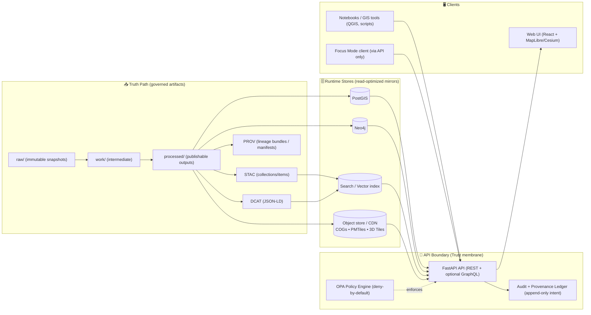
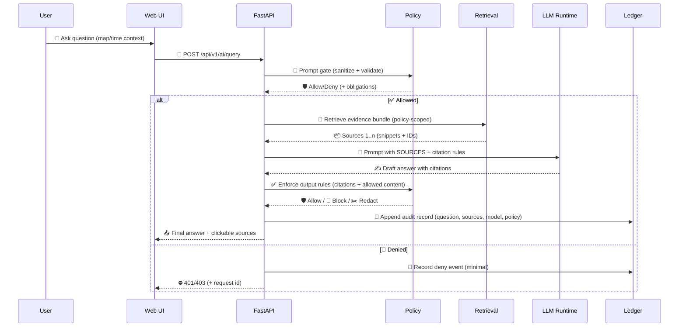

<!-- Internal source anchors (do not remove):
 [oai_citation:0‡Kansas Frontier Matrix Comprehensive System Documentation.pdf](sediment://file_00000000ef40722faf17987b69730695)  [oai_citation:1‡Kansas Frontier Matrix (KFM) – Comprehensive Technical Blueprint.pdf](sediment://file_000000006dbc71f89a5094ce310a452d)  [oai_citation:2‡Kansas Frontier Matrix (KFM) – Comprehensive Technical Blueprint.pdf](sediment://file_000000006dbc71f89a5094ce310a452d)  [oai_citation:3‡Kansas Frontier Matrix (KFM) – Comprehensive Technical Blueprint.pdf](sediment://file_000000006dbc71f89a5094ce310a452d)  [oai_citation:4‡Data Spaces.pdf](sediment://file_0000000053c071f5a9733b1b09cc9f76)  [oai_citation:5‡Comprehensive Markdown Guide_ Syntax, Extensions, and Best Practices.docx](file-service://file-J6rFRcp4ExCCeCdTevQjxz)
-->

<div align="center">
  <picture>
    <source media="(prefers-reduced-motion: reduce)" srcset="../docs/assets/kfm-seal-320.png">
    
  </picture>

  <h1>🛰️ Kansas Frontier Matrix — API Boundary</h1>

  <p><strong>The single, policy-enforced gateway to KFM data, maps, the knowledge graph, and Focus Mode.</strong></p>
  <p><sub><em>“Trust membrane” — every request is validated, authorized, audited, and provenance-linked.</em></sub></p>

  <p>
    
    
    
    
    
    
    
    
    
    
    
    
  </p>

  <p>
    <a href="../README.md">🏠 Main README</a> •
    <a href="#quickstart-docker-compose">🚀 Quickstart</a> •
    <a href="#architecture-data-flow">🏗️ Architecture</a> •
    <a href="#api-surface-area">🧩 API Surface</a> •
    <a href="#focus-mode">🤖 Focus Mode</a> •
    <a href="#governance-security">🛡️ Governance</a> •
    <a href="#contracts-standards">📜 Contracts</a> •
    <a href="#contributing-to-the-api">🤝 Contribute</a>
  </p>
</div>

> [!WARNING]
> 🚧 **Under construction (active development).**  
> Endpoints, schemas, and service names may evolve while we harden contracts and governance gates.  
> **Non‑negotiable stays constant:** UI/AI never bypass the API, and **fail‑closed** is the default.

---

<a id="what-this-folder-is"></a>

## 🧭 What this is

This is the **backend API boundary** for **Kansas Frontier Matrix (KFM)** — the one place where:

- ✅ requests are **validated** (schema + shape)
- ✅ access is **authorized** (RBAC + classification) via **policy-as-code**
- ✅ actions are **audited** (request IDs + decision logs)
- ✅ responses are **provenance-linked** (dataset ↔ STAC/DCAT ↔ PROV lineage)

> [!IMPORTANT]
> **If it needs data, it goes through this API.**
> No UI-only backdoors. No “just query PostGIS.” No “AI direct-connect.”

---

<a id="truth-path"></a>

## 🛣️ Truth Path (v13 canonical flow)

This API is built to serve only **governed artifacts** produced by the pipeline. The **canonical flow** is:

```text
raw → work → processed → catalogs (STAC/DCAT/PROV) → graph/stores → API → UI → story nodes → Focus Mode
```

### ✅ Why this matters to the API

- **Catalogs are the boundary artifacts**: STAC/DCAT/PROV are the interface the API trusts.
- Runtime stores (PostGIS/Neo4j/search indexes/object storage) are **read-optimized mirrors**, not the truth.
- If metadata, license, classification, or provenance is missing: the safe behavior is to **deny** or **redact** (only when policy explicitly allows).

---

<a id="quick-links-repo"></a>

## 🔗 Repo truth anchors (start here)

- 📘 Master Guide v13: `../docs/MASTER_GUIDE_v13.md`
- 🏗️ Architecture blueprints: `../docs/architecture/`
- ⚖️ Governance roots: `../docs/governance/`
- 📜 Standards (STAC/DCAT/PROV profiles): `../docs/standards/`
- 📐 Schemas: `../schemas/`
- ⚖️ Policy pack (OPA/Rego): `../policy/`
- 🗂️ STAC: `../data/stac/`
- 🌐 DCAT: `../data/catalog/dcat/`
- 🧾 PROV: `../data/prov/`
- 🧪 Tests: `../tests/`
- 🧰 Tools & validators: `../tools/`

> [!TIP]
> The README is a *governance contract & intent*.  
> The **source of truth** for current endpoints is always the OpenAPI/Swagger docs.

---

<a id="design-pillars"></a>

## 🧠 Design pillars (KFM-grade API)

### 1) 🧾 Provenance-first responses
Every meaningful response should carry:
- stable dataset identity (ID + version when applicable)
- pointers to STAC/DCAT records
- a PROV / run-manifest pointer for lineage
- a request correlation ID (audit & debugging)

### 2) 🛡️ Policy-first enforcement (OPA / fail-closed)
Routes stay “thin”:

> **validate → authorize → service → record → respond**

Policy is centralized in a **policy pack** so:
- RBAC + classification are consistent across endpoints
- outputs cannot be less restricted than inputs
- Focus Mode rules (citations, allowed content) are enforced like any other access rule

### 3) 📜 Contract-first (OpenAPI is a product)
- versioned API surface (`/api/v1/...`)
- stable response envelopes and error semantics
- schema validation tests + compatibility checks

### 4) 🌎 GIS-native primitives
- bbox/time filters are first-class
- GeoJSON / MVT / raster tiles
- predictable performance constraints (timeouts, limits, caching strategy)

### 5) 🔒 Fail-closed is the default
If policy cannot decide, provenance is absent, or metadata is incomplete:
- deny access (or return a **sanitized** response when policy explicitly allows)
- return actionable errors **with request ID**

---

<a id="architecture-data-flow"></a>

## 🏗️ Architecture & data flow



> [!NOTE]
> The API orchestrates across multiple stores (spatial + graph + search) but treats the **catalog/provenance boundary**
> as the system’s “explainability contract.”

---

<a id="api-surface-area"></a>

## 🧩 API surface area

> [!TIP]
> ✅ The **source of truth** is always Swagger/OpenAPI.  
> This README describes the **governance contract** and **design intent**.

### 📍 Health & meta
- `GET /healthz` — liveness
- `GET /readyz` — readiness (db/graph/policy connectivity)
- `GET /version` — build/version info (include commit SHA when available)

---

### 🗂️ Catalog & datasets (REST, versioned)
Common patterns:

- `GET /api/v1/datasets/{id}`  
  Dataset summary + links to STAC assets + provenance pointers

- `GET /api/v1/catalog/search?q=...&bbox=...&time=...`  
  Discovery (keyword + spatial + temporal)

- `GET /api/v1/datasets/{id}/data?format=geojson&bbox=...&limit=...`  
  Feature access (streaming strongly recommended for large datasets)

<details>
<summary><strong>📦 Example curl calls</strong> (illustrative)</summary>

```bash
# Dataset metadata
curl -s http://localhost:8000/api/v1/datasets/ks_hydrology_1880 | jq

# Catalog search (keyword + bbox)
curl -s "http://localhost:8000/api/v1/catalog/search?q=railroad&bbox=-102,36,-94,41" | jq

# Dataset features (GeoJSON with bbox)
curl -s "http://localhost:8000/api/v1/datasets/ks_hydrology_1880/data?format=geojson&bbox=-100,37,-96,40&limit=5000" | jq
```
</details>

---

### 🗺️ Tiles (MapLibre-first, Cesium-friendly)
Typical patterns:

- `GET /api/tiles/{layer}/{z}/{x}/{y}.pbf` — vector tiles (MVT)
- `GET /api/tiles/{layer}/{z}/{x}/{y}.png` / `.webp` — raster tiles
- *(Planned/optional)* `GET /api/tiles3d/{layer}/tileset.json` — Cesium 3D Tiles entrypoint

> [!IMPORTANT]
> Tile routes must be:
> - cache-friendly (**ETag / Cache-Control**)
> - policy-aware (restricted layers must **not** be cached publicly)
> - deterministic (same request + same data version → same bytes)

---

### 🕸️ Knowledge graph & narratives (REST and/or GraphQL)
- `POST /graphql` — GraphQL (optional; powerful for connected queries)

> [!NOTE]
> If GraphQL is enabled, it must reuse the same service layer as REST so governance and semantics never diverge.
> Apply query depth/cost limits to prevent abuse.

---

<a id="focus-mode"></a>

## 🤖 Focus Mode (AI) — retrieval-grounded, citation-enforced

Focus Mode is **not** “chat with the database.” It is a governed workflow:

- retrieves **allowed** context (datasets, stories, docs)
- generates an answer **only from retrieved sources**
- returns **citations** (e.g., `[1]`, `[2]`, …)
- logs an audit/provenance record of the interaction

### ✅ Primary endpoints (design contract)
- `POST /api/v1/ai/query` — generate a cited answer (primary)
- `POST /api/v1/ai/stream` — streaming output *(optional / experimental)*
- `GET /api/v1/ai/suggestions` — suggested questions / relevant datasets *(optional)*

> [!IMPORTANT]
> **Least‑privilege AI:** the model sees only retrieved snippets and must cite them.
> Treat the LLM like an untrusted generator — **policy + contracts do the enforcing.**

### Focus Mode lifecycle (prompt gate → retrieve → cite → enforce)


> [!CAUTION]
> If citations are missing → **fail** (reject or regenerate).
> “Best effort” answers without sources are treated as *non-compliant output.*

---

<a id="governance-security"></a>

## 🛡️ Governance & security

### 🔐 AuthN (who are you?)
Common options:
- OAuth2 / OIDC (preferred for multi-user)
- JWT for dev/local
- API keys *(only for tightly-scoped machine clients)*

### 🧱 AuthZ (what are you allowed to do?)
Authorization is a **policy decision**, not scattered `if role == ...` checks.

Policy decides:
- dataset access by role + classification
- export permissions (download vs preview vs aggregate-only)
- AI restrictions (scope, citations, injection defense)
- audit obligations (what to log, how strongly)

### 👥 Roles (RBAC) — baseline contract
A practical baseline:

| Role 👤 | Intended capability ✅ | Examples |
|---|---|---|
| **Public Viewer** | Read-only on publicly approved content | browse public layers, read public stories |
| **Contributor** | Draft/suggest/propose | author Story Nodes (draft), propose datasets |
| **Maintainer** | Review + approve + publish | approve stories/datasets, manage releases |
| **Admin** | Operate the system | run pipelines, manage policies |

> [!IMPORTANT]
> Even Admin workflows should flow through governed endpoints.
> DB shells are for break-glass, not a “workflow.”

### 🏷️ Classification & propagation
A baseline ladder (expand as needed):

| Classification 🏷️ | Who can access? 👤 | Caching 🧊 | Notes |
|---|---|---|---|
| **Public** | everyone | public cache ok | safest distribution tier |
| **Internal** | contributors+ | no public cache | working notes / pre-release |
| **Confidential** | selected users | no public cache | stronger logging, tighter export |
| **Restricted** | selected users | no public cache | may require extra controls & review |

**Propagation rule:** outputs cannot be less restricted than inputs.

### 🧼 Redaction & policy obligations
Policy may allow partial disclosure, e.g.:
- rounding/masking coordinates
- removing attributes
- converting feature outputs to aggregates

This keeps KFM useful while honoring sensitive data constraints.

### 🧾 Audit trails (mandatory)
- request correlation IDs for every call
- policy decision logs (include policy bundle version/hash when possible)
- Focus Mode ledger entry per response (question + sources + model + decision)

> [!NOTE]
> Long-term target: append-only ledger that can be cryptographically signed/timestamped for tamper-evidence.

---

<a id="contracts-standards"></a>

## 📜 Contracts & standards

KFM favors open standards for interoperability:

- **STAC** for geospatial assets (items/collections)
- **DCAT** for dataset discovery (publisher, license, themes)
- **PROV (W3C)** for lineage (raw → processed → published)
- **GeoJSON / MVT / COG / PMTiles** for spatial delivery
- **3D Tiles** for Cesium-class 3D experiences *(optional/planned)*
- **OpenAPI** as the REST contract
- **GraphQL SDL** as the graph contract *(if enabled)*

> [!TIP]
> If a dataset can’t link to **license + attribution + provenance**, it should not be served.

---

<a id="quickstart-docker-compose"></a>

## 🚀 Quickstart (Docker Compose)

> [!NOTE]
> Exact service names/ports vary by environment. When in doubt: open `../docker-compose.yml` and `../.env.example`.

### 1) Start the stack
```bash
docker compose up -d --build
# (legacy syntax)
docker-compose up -d --build
```

### 2) Open interactive docs
```text
http://localhost:8000/docs
```

### 3) Run tests
```bash
docker compose exec api pytest
```

### 4) Tail logs
```bash
docker compose logs -f api
```

---

## 🌐 Ports (typical dev defaults)

| Service | Default | Notes |
|---|---:|---|
| API | `8000` | Swagger at `/docs` |
| Web UI | `3000` | dev server / mapped port |
| PostGIS | `5432` | common conflict with local Postgres |
| Neo4j Browser | `7474` | bolt differs |

---

<a id="internal-layout"></a>

## 📦 Backend layout (v13-aligned layering)

> [!TIP]
> Prefer **clean layering**: domain rules stay framework-free; services orchestrate; adapters talk to infra.
> This keeps governance stable even as DB/search/LLM choices evolve.

A typical v13-friendly server layout:

```text
src/server/
├── app/                 # FastAPI init, middleware, lifecycle
├── routes/              # thin routers (validate → authorize → service → record → respond)
├── schemas/             # request/response models + error envelopes
├── domain/              # framework-free entities + invariants
├── services/            # use-cases / orchestration (testable)
├── adapters/            # PostGIS/Neo4j/search/object-store/OPA/LLM clients
├── ai/                  # Focus pipeline (retrieve → prompt → validate)
├── policies/            # policy bundle wiring + helpers (source-of-truth lives in /policy/)
└── tests/               # unit + integration + contract tests
```

> [!NOTE]
> If GraphQL is enabled, it should call the same service layer as REST.

---

## 🧯 Troubleshooting

### API won’t start (deps not ready)
```bash
docker compose logs api
```

- verify DB credentials and Docker network names
- confirm OPA is reachable (policy engine)
- ensure health checks and `depends_on` are configured

### Port conflicts
If `5432`, `7474`, `8000`, or `3000` are already used:
- stop the other service, **or**
- change `ports:` in `docker-compose.yml`

### Rebuild after dependency changes
```bash
docker compose up -d --build
```

---

<a id="contributing-to-the-api"></a>

## 🤝 Contributing to the API

### ✅ Route discipline (non‑negotiable)
- routes stay thin: **validate → authorize → service → record → respond**
- no business logic in routers
- no policy checks hidden in random helpers
- no “UI-only” backdoors

### ✅ PR checklist (API boundary)
- [ ] OpenAPI reflects the change (docs/routes/schemas)
- [ ] Tests added/updated (unit + integration + contract)
- [ ] Policy rules/tests updated (OPA/Rego + Conftest) if access behavior changed
- [ ] Audit/provenance obligations satisfied (new endpoints log appropriately)
- [ ] Backward compatibility considered (`/api/v1` should not break quietly)

---

## 📚 Related docs (repo-local)

- `../docs/architecture/` 🏗️
- `../docs/governance/` ⚖️
- `../docs/standards/` 📜
- `../policy/` 🛡️
- `../schemas/` 📐

---

<div align="center">

🧭 <strong>Ad Astra Per Aspera.</strong>  
<strong>The API boundary is the “trust membrane” of KFM.</strong>  
If it can’t be traced, validated, authorized, and reproduced… it doesn’t ship.

</div>
