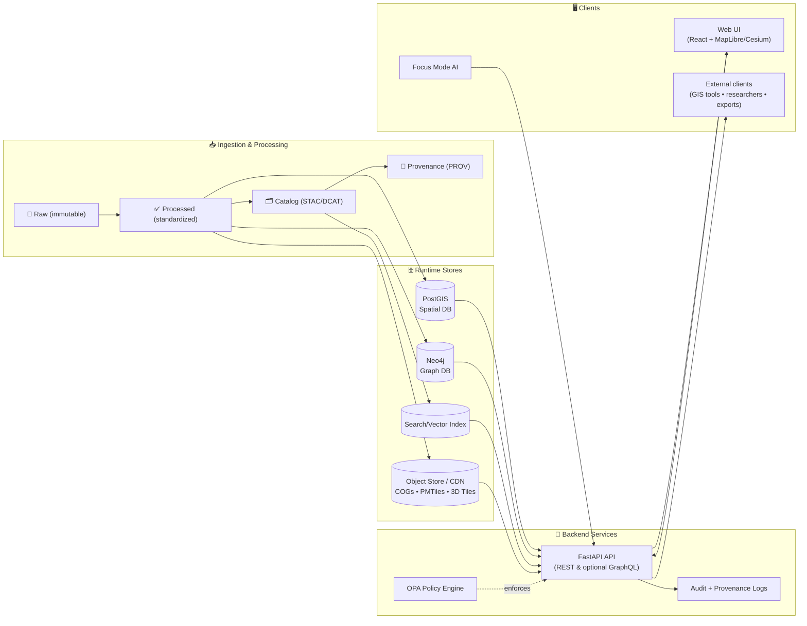
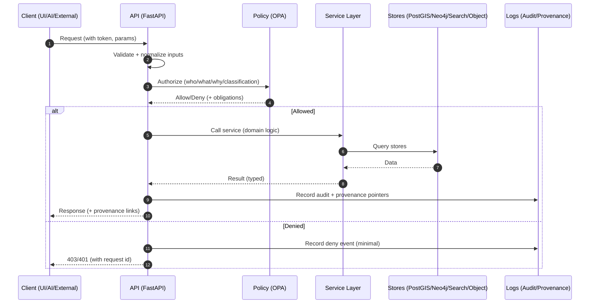

<!-- Internal source anchors (do not remove):
 [oai_citation:0‡Kansas Frontier Matrix Comprehensive System Documentation.pdf](sediment://file_00000000ef40722faf17987b69730695)  [oai_citation:1‡Kansas Frontier Matrix (KFM) – Comprehensive Technical Blueprint.pdf](sediment://file_000000006dbc71f89a5094ce310a452d)  [oai_citation:2‡Kansas Frontier Matrix (KFM) – Comprehensive Technical Blueprint.pdf](sediment://file_000000006dbc71f89a5094ce310a452d)  [oai_citation:3‡Kansas Frontier Matrix (KFM) – Comprehensive Technical Blueprint.pdf](sediment://file_000000006dbc71f89a5094ce310a452d)  [oai_citation:4‡Data Spaces.pdf](sediment://file_0000000053c071f5a9733b1b09cc9f76)  [oai_citation:5‡Comprehensive Markdown Guide_ Syntax, Extensions, and Best Practices.docx](file-service://file-J6rFRcp4ExCCeCdTevQjxz)
-->

<div align="center">
  
  <h1>🛰️ Kansas Frontier Matrix — API</h1>
  <p><strong>The single, policy-enforced gateway to KFM data, maps, the knowledge graph, and Focus Mode.</strong></p>
  <p><sub><em>“Trust membrane” — every request is validated, authorized, logged, and provenance-linked.</em></sub>

  <p>
    
    
    
    
    
    
    
    
  </p>

  <p>
    <a href="#-quickstart-docker-compose">🚀 Quickstart</a> •
    <a href="#-architecture--data-flow">🏗️ Architecture</a> •
    <a href="#-api-surface-area">🧩 API Surface</a> •
    <a href="#-governance--security">🛡️ Governance</a> •
    <a href="#-contracts--standards">📜 Contracts</a> •
    <a href="#-contributing-to-the-api">🤝 Contribute</a>
  </p>
</div>

> [!WARNING]
> 🚧 **Under construction (active development).**  
> Endpoints, schemas, and service names may shift while we harden contracts and governance gates.  
> **Non-negotiable stays constant:** UI/AI never bypass the API, and “fail‑closed” is the default.

---

## 🧭 What this folder is

This folder contains the **backend API layer** for **Kansas Frontier Matrix (KFM)**.

KFM is built as a canonical “truth path”:

```text
Raw ➜ Processed ➜ Catalog ➜ Databases ➜ API ➜ UI/AI
```

The **API is the enforcement layer** 🧱:

- 🖥️ The **Web UI does not query databases directly**
- 🤖 **Focus Mode does not query databases directly**
- ✅ Every response is **validated + authorized + provenance-linked**
- 🔒 If policy can’t decide → **deny** (fail‑closed)

> [!IMPORTANT]
> **If it needs data, it goes through this API.**  
> This is how KFM stays **traceable, reproducible, and policy-compliant**.

---

## 🔗 Quick links (local)

Once running locally:

- 🧪 **Swagger / OpenAPI UI** → `http://localhost:8000/docs`
- 📜 **OpenAPI JSON** → `http://localhost:8000/openapi.json`
- 🕸️ **GraphQL endpoint (if enabled)** → `http://localhost:8000/graphql`
- ❤️ **Health** → `http://localhost:8000/healthz`

---

## 🧠 Design pillars (KFM-grade API)

### 1) 🧾 Provenance-first (responses explain themselves)
Every meaningful response should carry:
- dataset identity (stable ID + version where applicable)
- links to catalog records (STAC/DCAT)
- lineage pointer (PROV / provenance log)
- request correlation ID (for audit & debugging)

### 2) 🛡️ Policy-first (governance lives outside business logic)
Routes should be “thin”:
> **validate → authorize → service → record → respond**

Authorization should be **centralized** (OPA-style policy pack), so we can:
- enforce tiered access (public/internal/confidential/restricted)
- propagate classification rules (outputs can’t be less restricted than inputs)
- enforce AI citation requirements the same way we enforce data access

### 3) 📜 Contract-first (OpenAPI is a product)
- versioned API surface (`/api/v1/...`)
- stable response envelopes and error semantics
- schema validation tests and backward-compat checks

### 4) 🌎 GIS-native (the API speaks “map”)
- bbox/time filters are first-class
- GeoJSON / MVT / raster tiles
- streaming for big feature sets
- predictable performance constraints (timeouts, limits, caching)

### 5) 🔒 Fail-closed by default
If metadata is missing, policy cannot evaluate, or provenance is absent:
- deny access
- return actionable error messages (with request ID)

---

## 🏗️ Architecture & data flow



> [!NOTE]
> **Focus Mode is a client of the API** (not a privileged backdoor).  
> It inherits the same policy gates and provenance requirements.

---

## 🧩 API surface area

> [!TIP]
> ✅ The **source of truth** is always `/docs` (Swagger UI).  
> This README describes the *governance contract* and *design intent*.

### 📍 Health & meta
- `GET /healthz` — liveness
- `GET /readyz` — readiness (db/graph/policy connectivity)
- `GET /version` — build/version info (include commit SHA when available)

### 🗂️ Catalog & datasets (REST, versioned)
Typical patterns:

- `GET /api/v1/datasets/{id}`  
  DCAT-style dataset summary + links to STAC assets + provenance pointers

- `GET /api/v1/catalog/search?q=...&bbox=...&time=...`  
  Dataset discovery (keyword + spatial + temporal)

- `GET /api/v1/datasets/{id}/data?format=geojson&bbox=...&limit=...`  
  Feature access (streaming strongly recommended for large datasets)

<details>
<summary><strong>📦 Example curl calls</strong> (illustrative)</summary>

```bash
# Dataset metadata
curl -s http://localhost:8000/api/v1/datasets/ks_hydrology_1880 | jq

# Catalog search (keyword + bbox)
curl -s "http://localhost:8000/api/v1/catalog/search?q=railroad&bbox=-102,36,-94,41" | jq

# Dataset features (GeoJSON with bbox)
curl -s "http://localhost:8000/api/v1/datasets/ks_hydrology_1880/data?format=geojson&bbox=-100,37,-96,40&limit=5000" | jq
```
</details>

### 🗺️ Tiles (MapLibre-first, Cesium-friendly)
Fast map rendering depends on tiles for big layers:

- `GET /tiles/{layer}/{z}/{x}/{y}.pbf` — vector tiles (MVT)
- `GET /tiles/{layer}/{z}/{x}/{y}.png` / `.webp` — raster tiles
- (Optional/Planned) `GET /tiles3d/{layer}/tileset.json` — Cesium 3D Tiles entrypoint

Example (MapLibre-style):
```text
/api/tiles/historic_trails/{z}/{x}/{y}.pbf
```

> [!TIP]
> Keep tile endpoints:
> - cache-friendly (ETags / Cache-Control)
> - policy-aware (private layers must not be cached publicly)
> - deterministic (same request → same bytes for same data version)

### 🕸️ Knowledge graph & stories (REST and/or GraphQL)
- REST is great for stable resources and caching
- GraphQL (optional) is powerful for nested graph/story queries without overfetching

Example GraphQL query (illustrative):
```graphql
query {
  storyNodes {
    id
    title
    yearRange
    relatedPlaces { id name }
  }
}
```

---

## 🤖 Focus Mode endpoints (AI, governed)

Focus Mode is **not** “chat with the database.” It is a retrieval-grounded, policy-constrained pipeline that:

- retrieves *allowed* context (datasets, story nodes, docs)
- generates an answer **only using retrieved sources**
- returns **citations**
- records provenance for audit

Example endpoint (design-level):
- `POST /focus-mode/query`

<details>
<summary><strong>🧪 Example request</strong> (illustrative)</summary>

```bash
curl -s http://localhost:8000/focus-mode/query \
  -H "content-type: application/json" \
  -d '{
    "question": "List major trails in Kansas and their purposes.",
    "scope": { "bbox": [-102,36,-94,41], "time_range": [1850, 1900] }
  }' | jq
```
</details>

> [!IMPORTANT]
> Focus Mode responses must remain **evidence-backed** and **citation-bearing**.  
> If citations are missing → return an error (or regenerate) rather than hallucinating.

---

## 🛡️ Governance & security

### 🔐 AuthN (who are you?)
Typical choices:
- OAuth2 / OIDC (preferred for multi-user)
- JWT for dev/local
- API keys (only for scoped machine clients, if needed)

### 🧱 AuthZ (what are you allowed to do?)
We treat authorization as a **policy decision**, not scattered if-statements.

**Policy engine** (OPA-style) should decide:
- dataset access by role + classification
- “can user export this?” / “can user see raw scans?”
- AI restrictions (topic scope, citation enforcement, prompt injection defense)
- audit requirements (which requests require stronger logging)

### 🏷️ Data classification (propagates downstream)
A simple, practical ladder (expand as needed):

| Classification 🏷️ | Who can access? 👤 | Notes 🧾 |
|---|---|---|
| Public | everyone | safe to cache publicly |
| Internal | contributors | may include working notes |
| Confidential | selected users | avoid public caching |
| Restricted | selected users | may require extra controls & review |

> [!CAUTION]
> **Propagation rule:** outputs can’t be less restricted than inputs.  
> Example: a public map tile cannot be generated from restricted features.

### 🌱 CARE + responsible stewardship
When working with Indigenous, cultural, or community-sensitive data:
- prefer community-defined access + representation standards
- log how data is used, not just that it was used
- avoid “deficit framing” in AI summaries

---

## 📜 Contracts & standards

KFM favors open standards to keep the platform interoperable:

- **STAC** 🗂️ for geospatial assets (items/collections)
- **DCAT** 🧾 for dataset discovery (publisher, license, themes)
- **PROV (W3C)** ⛓️ for lineage (raw → processed → published)
- **GeoJSON / MVT / COG / PMTiles** 🗺️ for spatial delivery
- **OpenAPI** 📘 as the REST contract
- **GraphQL SDL** 🕸️ as the graph contract (if enabled)

> [!TIP]
> If a dataset can’t link to **license + attribution + provenance**, it should not be served.

---

## 🧬 Request lifecycle (what “thin routes” means)



---

## 🚀 Quickstart (Docker Compose)

> [!TIP]
> The KFM docs assume a Compose-based dev environment so the whole stack can run locally.

### 1) Start the stack
```bash
docker-compose up -d --build
# or newer syntax:
docker compose up -d --build
```

### 2) Open interactive docs
- `http://localhost:8000/docs`

### 3) Run tests 🧪
```bash
docker-compose exec api pytest
```

### 4) Tail logs 🧯
```bash
docker-compose logs -f api
```

---

## 🌐 Ports (typical dev defaults)

| Service | Default | Notes |
|---|---:|---|
| API | `8000` | Swagger at `/docs` |
| Web UI | `3000` | dev server / mapped port |
| PostGIS | `5432` | common conflict with local Postgres |
| Neo4j Browser | `7474` | bolt differs |

---

## 📦 Suggested (typical) API layout

A common structure that supports thin routes and strong contracts:

```text
📦 api/
├── 🚀 app/                   # FastAPI init, middleware, lifecycle
│   ├── main.py               # app entrypoint
│   ├── deps.py               # DI providers (db sessions, auth context)
│   └── middleware/           # CORS, request-id, logging, timing
│
├── 🧭 routes/                # Routers (thin endpoints)
│   ├── health.py
│   ├── datasets.py
│   ├── catalog.py
│   ├── tiles.py
│   ├── stories.py
│   └── focus_mode.py
│
├── 🧾 schemas/               # Pydantic models (req/resp + error envelopes)
├── 🧠 services/              # Business logic (domain services)
├── 🔌 adapters/              # DB/Neo4j/search/object-store/LLM clients
├── 🛡️ policies/              # OPA bundles + helpers + policy tests
├── 🧰 scripts/               # One-offs (migrations, seed, backfills)
└── ✅ tests/                 # pytest (unit + integration + contract)
```

> [!NOTE]
> If GraphQL is enabled, mount it as a router and reuse the same services  
> so REST + GraphQL never diverge.

---

## 🧯 Troubleshooting

### API won’t start (deps not ready)
```bash
docker-compose logs api
```
- ensure `depends_on` + health checks are configured in Compose
- check DB credentials and network names
- verify policy engine is reachable (OPA)

### Port conflicts
If `5432`, `7474`, `8000`, or `3000` are already used:
- stop the other service, **or**
- change `ports:` in `docker-compose.yml`

### Rebuild after dependency changes
```bash
docker-compose up -d --build
```

---

## 🤝 Contributing to the API

### ✅ Route discipline (non‑negotiable)
- routes stay thin: **validate → authorize → service → record → respond**
- no business logic in routers
- no “UI-only backdoors”
- no policy checks hidden in random helpers

### ✅ PR checklist (API)
- [ ] OpenAPI docs updated (auto-generated or descriptions improved)
- [ ] Tests added/updated (unit + integration where appropriate)
- [ ] Policy tests updated (especially if access rules changed)
- [ ] Provenance/audit obligations satisfied (new endpoints must log appropriately)
- [ ] Backwards compatibility considered (`/api/v1` should not break quietly)

---

## 📚 Related docs (repo-local)

- `../docs/architecture/system_overview.md` 🏗️
- `../docs/architecture/AI_SYSTEM_OVERVIEW.md` 🤖
- `../docs/architecture/ai/OLLAMA_INTEGRATION.md` 🦙
- `../pipelines/README.md` 🏭

---

## ✨ If you only remember one thing…

> **The API is the “trust membrane” of KFM** 🧫  
> Governance + provenance + performance meet here — and nothing ships without it.