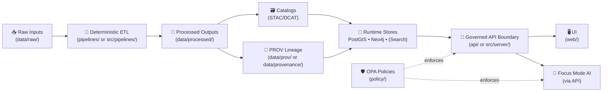

# 🧩 Kansas Frontier Matrix API (FastAPI)


-black)

> 🔎 **Provenance-first API boundary**: KFM is a *pipeline → catalogs → stores → API → UI* system.  
> This backend is the **governed choke-point** where validation, provenance, and policy are enforced uniformly. 🧾🛡️

---

## 🧭 Quick links (dev)
- 📚 Swagger: `http://localhost:8000/docs`
- 📘 ReDoc: `http://localhost:8000/redoc`
- 🧾 OpenAPI JSON: `http://localhost:8000/openapi.json`
- 🧠 Neo4j Browser: `http://localhost:7474`
- 🗺️ PostGIS: `localhost:5432`
- 🛡️ OPA (if running): `http://localhost:8181`

---

## 📚 Table of contents
- [📌 What this folder is](#-what-this-folder-is)
- [🧷 Non-negotiables](#-non-negotiables)
- [🗺️ Truth Path data flow](#️-truth-path-data-flow)
- [🧱 Backend architecture](#-backend-architecture)
- [🗂️ Suggested folder map](#️-suggested-folder-map)
- [🧰 Runtime stack](#-runtime-stack)
- [🚀 Run locally (Docker Compose)](#-run-locally-docker-compose)
- [⚙️ Configuration](#️-configuration)
- [🔎 Using the API](#-using-the-api)
- [🛡️ Governance & policy-as-code](#️-governance--policy-as-code)
- [🧾 Provenance & audit](#-provenance--audit)
- [🤖 Focus Mode AI](#-focus-mode-ai)
- [✅ Testing & CI gates](#-testing--ci-gates)
- [🧭 Developer workflow (add/change an endpoint)](#-developer-workflow-addchange-an-endpoint)
- [🧯 Troubleshooting](#-troubleshooting)
- [🔗 Related docs](#-related-docs)
- [🧩 Guiding principles](#-guiding-principles)

---

## 📌 What this folder is

This `api/` directory contains the **backend server** for Kansas Frontier Matrix (KFM): a **FastAPI** application exposing KFM data and services via:

- 🌐 **REST endpoints** (primary interface)
- 🧬 **GraphQL (optional)** (only if enabled / mounted)

**Why this exists:** The UI and AI do **not** bypass governance by querying databases directly. They call the API, and the API enforces:

- ✅ schema validation
- 🧾 provenance linkage
- 🛡️ policy decisions (deny/redact/allow)
- 🔎 consistent “source-of-truth” behavior

> 💡 Think of this as the **contracted boundary** between KFM’s internal stores (PostGIS + Neo4j + search) and everything that consumes them.

---

## 🧷 Non-negotiables

These are design invariants. If a change violates these, it’s a regression 🚫:

- 🔁 **Canonical pipeline order is absolute**  
  **ETL → Catalogs (STAC/DCAT/PROV) → Stores/Graph → API → UI → Story Nodes → Focus Mode**  
  (No leapfrogging stages. No direct injection into UI.)

- 🛑 **API boundary rule**  
  The frontend (and any client) must **never** query the graph/database directly. All access goes through the governed API boundary.

- 🧾 **Provenance-first**  
  If it’s not cataloged (STAC/DCAT) and traced (PROV), it is not “publishable” in KFM.

- 🧠 **Evidence-first narrative**  
  No unsourced narrative content should enter Story Nodes or Focus Mode. AI output must be labeled and provenance-linked.

- 🪶 **Sovereignty + classification propagation**  
  No derived output can be *less restricted* than its inputs. Sensitive locations must be generalized/withheld end-to-end.

---

## 🗺️ Truth Path data flow



✅ **Key idea:** the API is the choke-point where policy + provenance are enforced consistently across UI *and* AI.

---

## 🧱 Backend architecture

KFM’s backend follows a *Clean Architecture-ish* separation so business logic stays testable and governance is enforceable:

- 🧬 **Domain / Models**  
  Pydantic models + domain entities (datasets, features, events, story nodes, provenance pointers)

- 🧠 **Service layer (use-cases)**  
  Business logic that orchestrates: query → policy check → data fetch → redaction → provenance attach

- 🔌 **Adapters / Repositories**  
  Infrastructure-specific code:
  - PostGIS (SQL/ORM/driver)
  - Neo4j (Cypher)
  - Search (full-text and/or embeddings)
  - OPA client (policy decision calls)
  - External APIs (optional)

- 🌐 **Routes / Controllers (FastAPI)**  
  Thin handlers:
  - validate inputs
  - call services
  - return well-formed responses (including provenance references)

> 🧠 Rule of thumb: routes do **validation + orchestration** — heavy computation belongs in services or pipelines.

---

## 🗂️ Suggested folder map

> 🧩 Exact repo layouts vary by version. This is the recommended *shape*.

```text
api/
├─ 🚀 main.py                      # FastAPI init: routers, CORS, startup/shutdown
├─ ⚙️ config/                      # env parsing, settings, feature flags
├─ 🧭 routes/                      # HTTP endpoints grouped by domain
│  ├─ datasets.py
│  ├─ features.py
│  ├─ stories.py
│  ├─ search.py
│  └─ ai.py                        # Focus Mode endpoints (ex: POST /ai/query)
├─ 🧬 domain/                      # Domain models + contracts (Pydantic)
├─ 🧠 services/                    # Use-cases (policy+provenance+data orchestration)
├─ 🔌 adapters/                    # PostGIS / Neo4j / Search / OPA clients
│  ├─ postgis.py
│  ├─ neo4j.py
│  ├─ search.py
│  └─ opa.py
├─ 🧾 provenance/                  # Helpers for provenance pointers / audit envelopes
├─ 🛡️ middleware/                 # auth, request-id, rate limits, policy hooks
└─ ✅ tests/                       # unit + integration tests
```

<details>
<summary>🧭 v13+ reference layout (crosswalk)</summary>

Some KFM documentation references a canonical monorepo boundary like:

```text
src/
├─ pipelines/
├─ graph/
└─ server/          # API boundary + contracts
web/                # UI
schemas/             # STAC/DCAT/PROV + story + telemetry schemas
policy/              # OPA/Rego
docs/                # governed docs + story nodes
```

If your repo has both `api/` and `src/server/`, treat **one** as the canonical API boundary to avoid drift.

</details>

---

## 🧰 Runtime stack

Typical KFM backend dependencies:

- 🗺️ **PostGIS** (PostgreSQL spatial): spatial queries + vector/raster storage
- 🧠 **Neo4j**: entity relationship graph (people/places/events/sources)
- 🔎 **Search (optional)**: full-text and/or semantic retrieval
- 🛡️ **OPA + Rego**: policy decisions (access + redaction + AI constraints)
- 🤖 **Ollama (optional)**: local inference for Focus Mode AI
- ☁️ **OpenAI (optional)**: only if explicitly enabled (and policy allows)

---

## 🚀 Run locally (Docker Compose)

> ⚠️ Most KFM setups run from the **repo root**, not from inside `api/`.

### 1) Start the stack

```bash
# from repo root
docker compose up --build
# or
docker-compose up --build
```

### 2) Open API docs

```text
Swagger UI: http://localhost:8000/docs
ReDoc:     http://localhost:8000/redoc
```

### 3) Databases (debugging)

```text
PostGIS:        localhost:5432
Neo4j Browser:  http://localhost:7474
```

### 4) OPA (if enabled)

```text
OPA: http://localhost:8181
```

### 5) Auto-reload while developing

If Compose mounts your code and runs Uvicorn with `--reload`, editing route files should hot-reload. 🔁

---

## ⚙️ Configuration

> 🧠 **Contract-first config**: keep environment variables documented, minimal, and validated.

<details>
<summary>🔐 Common environment variables (illustrative)</summary>

| Variable | Purpose | Example |
|---|---|---|
| `DATABASE_URL` | PostGIS connection string | `postgresql+psycopg://user:pass@db:5432/kfm` |
| `NEO4J_URI` | Neo4j bolt URI | `bolt://neo4j:7687` |
| `NEO4J_AUTH` | Neo4j auth | `neo4j/password` |
| `OPA_URL` | OPA endpoint | `http://opa:8181` |
| `AI_BACKEND_URL` | Ollama base URL | `http://host.docker.internal:11434` |
| `OLLAMA_MODEL` | Local model name | `llama2` (or project standard) |
| `OPENAI_API_KEY` | Optional external inference | *(only if enabled)* |

✅ Prefer using a single settings class (Pydantic `BaseSettings`) so missing/invalid config fails fast.

</details>

---

## 🔎 Using the API

> ✅ **Source of truth** for available endpoints: Swagger UI at `/docs`.

### REST examples (illustrative)

```bash
# list datasets (if implemented)
curl -s http://localhost:8000/datasets

# fetch a feature/entity by ID (if implemented)
curl -s http://localhost:8000/features/123

# search (if implemented)
curl -s "http://localhost:8000/search?q=railroad"
```

### GraphQL example (if enabled)

```graphql
query {
  storyNodes {
    id
    title
    yearRange
  }
}
```

---

## 🛡️ Governance & policy-as-code

KFM treats governance rules as first-class code:

- 📁 `/policy/` contains policy modules (OPA Rego), often separated by concern:
  - 📜 dataset licensing / metadata requirements
  - 🔐 access rules (roles vs dataset classification)
  - 🧠 graph query constraints
  - 🤖 AI constraints (citation requirements, content restrictions, redaction)

### Enforcement model

- ✅ **CI enforcement (deny early)**  
  Policy checks run in PRs (ex: via `conftest`) to prevent non-compliant changes from merging.

- 🧩 **Runtime enforcement (deny/redact)**  
  The API asks OPA questions like:
  - “Can user X access dataset Y?”
  - “Must this geometry be generalized?”
  - “Is this AI response safe to return?”

> 🧠 Design goal: policies are the **source of truth** — versioned, reviewable, testable.

<details>
<summary>🧾 Classification: how “Restricted” propagates</summary>

A practical pattern KFM supports:

- **Public** → OK to show raw coordinates
- **Internal** → org members only
- **Confidential** → selected roles/groups; possible redaction
- **Restricted** → high-impact if leaked; generalized/blurred geometry; strict deny-by-default

🔒 Rule: derivatives inherit **≥** the restriction level of inputs.

</details>

---

## 🧾 Provenance & audit

KFM is built so results are traceable:

- Each dataset/story/entity should carry stable identifiers that map back to:
  - 🗃️ STAC/DCAT catalog entries
  - 🧾 PROV lineage records (pipeline run + inputs + parameters)
- The API should attach provenance pointers in responses (where applicable) so:
  - the UI can display “what source is this?”
  - the AI can cite and link evidence (instead of guessing)
  - auditors can trace “how did we get this answer?”

> 🔍 Practical expectation: **every response that can be evidence-linked should be evidence-linked**.

---

## 🤖 Focus Mode AI

Focus Mode is not a generic chatbot. It is designed to be:

- 🔒 **policy constrained**
- 🧾 **provenance-aware**
- 🧠 **API-mediated**
- 🏠 **privacy-preserving by default** (local inference via Ollama when configured)

### Typical request shape (illustrative)

```bash
curl -s -X POST http://localhost:8000/ai/query \
  -H "Content-Type: application/json" \
  -d '{
    "question": "List major trails in Kansas and their purposes."
  }'
```

<details>
<summary>🧠 Focus Mode hard gates (trust rules)</summary>

- ✅ **Only provenance-linked content** may render in Focus Mode  
- 🧷 **AI contributions are opt-in + labeled** (never silently injected)  
- 🗺️ **No sensitive location leaks** (generalize/omit sensitive geometry)  

If it’s not in catalogs/graph with provenance IDs, it shouldn’t show.

</details>

<details>
<summary>🧰 Local Ollama setup (dev)</summary>

```bash
# start ollama (host)
ollama serve

# pull a model
ollama pull llama2

# point the API at it (example)
export AI_BACKEND_URL="http://host.docker.internal:11434"
export OLLAMA_MODEL="llama2"
```

If Ollama isn’t configured, the AI endpoint may be disabled, error, or fall back to a stub (implementation-dependent).

</details>

---

## ✅ Testing & CI gates

Typical patterns:

```bash
# run tests inside the api container (if configured)
docker compose exec api pytest
# or
docker-compose exec api pytest
```

Recommended test layers:
- 🧪 **Unit tests** for services (mock adapters + policy decisions)
- 🔗 **Integration tests** for routes (FastAPI TestClient)
- 🛡️ **Policy tests** (OPA/Rego via conftest) for access + redaction + AI constraints

> ✅ CI should stay green: tests + policy checks must pass before merge.

---

## 🧭 Developer workflow (add/change an endpoint)

A “KFM-style” change is usually **contract-first + governance-first**:

- [ ] 🧾 Define/extend the **API contract** (OpenAPI and/or GraphQL)  
- [ ] 🧬 Add/extend a **domain model** (`domain/`)
- [ ] 🔌 Add a repository method (PostGIS / Neo4j / search adapter)
- [ ] 🧠 Add a service function (policy+provenance orchestration, testable)
- [ ] 🌐 Add/update a route handler (`routes/...py`)
- [ ] 🛡️ Add/adjust policy rules (access, redaction, AI constraints)
- [ ] ✅ Add tests (unit + integration + policy tests)
- [ ] 🧾 Ensure outputs carry provenance pointers (STAC/DCAT/PROV IDs)
- [ ] 📚 Update docs (this file + any API docs)

> 🧠 If you’re adding **new data** or **new AI-derived artifacts**, treat them like datasets: they must be cataloged and traced before serving.

---

## 🧯 Troubleshooting (common dev issues)

### Port conflicts
Common ports:
- `5432` (PostGIS)
- `7474` (Neo4j Browser)
- `7687` (Neo4j Bolt)
- `8000` (API)
- `8181` (OPA)
- `11434` (Ollama)
- `3000` (Web)

### Dependency order / readiness
If the API boots before DB/Neo4j are ready:
- confirm Compose `depends_on`
- re-run `docker compose up`
- check container logs

### OPA not enforced (or denying everything)
- confirm OPA container is reachable (`OPA_URL`)
- confirm policies are loaded/mounted
- confirm the API is calling OPA at the right decision path

### Ollama not reachable
- confirm `ollama serve` is running on host
- confirm API can reach `AI_BACKEND_URL` (Docker networking)
- confirm the model name in `OLLAMA_MODEL` is installed/pulled

### Rebuild after dependency changes
```bash
docker compose up --build
# or
docker-compose build
```

---

## 🔗 Related docs

Repo-local pointers (adjust to your repo layout):

- 📘 `../README.md` (project overview)
- 🧪 `../pipelines/` or `../src/pipelines/` (ETL)
- 🧠 `../src/graph/` (Neo4j graph build + ontology)
- 🗃️ `../data/catalog/` + `../data/prov/` (metadata + provenance)
- 🛡️ `../policy/` (OPA/Rego governance policies)
- 🧾 `../docs/` + `../docs/reports/story_nodes/` (architecture + story nodes)

---

## 🧩 Guiding principles

- ✅ **Thin controllers**, thick services
- 🧾 **Provenance & traceability** are not optional
- 🛡️ **Policies enforce reality**, not vibes
- 🔁 **Deterministic pipelines** feed stable stores; API reads those stores
- 🧠 **AI is a client of the system**, not a shortcut around it