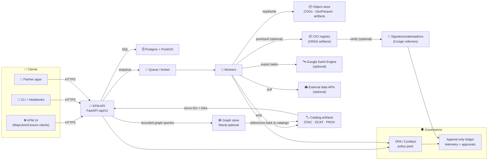

<!--
📌 This README defines the governed backend boundary for KFM.
🗓️ Last updated: 2026-01-20
-->

<a id="top"></a>

# 🚪 KFM API 🛰️🗺️  
_Backend + integration trust boundary for the Kansas Frontier Matrix (KFM) platform_

<p align="left">
  
  
  
  
  
  
  
  
  
  
  
  
  
  
  
  
  
  
  
  
</p>

> [!IMPORTANT]
> **KFM invariant (non‑negotiable):**  
> **ETL → STAC/DCAT/PROV → Graph → APIs → UI → Story Nodes → Focus Mode**  
> This API is the **governed trust boundary**: it must not serve “mystery data” that isn’t **cataloged**, **provenance‑linked**, and **policy‑checked**. ✅🧾

> [!IMPORTANT]
> **Integrity invariant (non‑negotiable):**  
> Published artifacts must be **digest-addressed**, and promotion-to-public requires **verifiable integrity** (signatures/attestations where configured). No “floating latest” binaries inside governed flows. 🔏📦

> [!IMPORTANT]
> **Focus Mode hard gate (non‑negotiable):**  
> Focus Mode must display **only provenance‑linked content**. Any AI contribution must be **opt‑in**, **clearly labeled**, and **bounded by evidence** (no side‑channel leaks). 🧠🔒

> [!CAUTION]
> **Fail‑closed is the default.** If a route cannot prove license + classification + provenance, it must refuse (or return a redacted, policy-compliant view). 🚫✅

---

<a id="quick-links"></a>

## 🔗 Quick links
- 🧪 Swagger (OpenAPI UI): `/docs`
- 📕 ReDoc: `/redoc`
- 🧾 OpenAPI JSON: `/openapi.json`
- ❤️ Health: `/api/v1/health`
- 🧭 Version/meta: `/api/v1/meta/version`
- 🪪 Citation guidance (software + data releases): `/api/v1/meta/citation` *(target)*
- 📈 Metrics (optional): `/metrics`

**Catalog + provenance**
- 🗂️ STAC root: `/api/v1/catalog/stac`
- 🏷️ DCAT datasets: `/api/v1/catalog/dcat` *(implementation-specific)*
- 🧬 PROV run lineage: `/api/v1/prov/runs/{run_id}`
- 🧾 Evidence bundle (Story/Focus): `/api/v1/evidence/bundles/{bundle_id}`

**Governance + integrity (target)**
- 🧪 Dataset contract validation: `/api/v1/contracts/datasets/validate` *(policy-gated)*
- 🧪 Run manifest validation: `/api/v1/contracts/manifests/validate` *(policy-gated)*
- 🧪 Graph integrity check: `/api/v1/integrity/graph/check` *(privileged/policy-gated)*
- 🧠 Narrative pattern scan: `/api/v1/integrity/narratives/scan` *(privileged/policy-gated)*
- 🔏 Artifact verification: `/api/v1/artifacts/verify` *(policy-gated)*

**Experience surfaces**
- 🧠 Focus Mode context bundle: `/api/v1/focus/context` *(policy-gated)*
- 🧵 Pulse Threads (timeline feed): `/api/v1/pulse_threads` *(policy-gated; new)*
- 🧠 Concepts / Attention Nodes: `/api/v1/concepts` *(policy-gated; new)*
- 📡 Job stream (WS/SSE): `/ws/jobs/{job_id}` *(if enabled)*

Repo navigation:
- 🧭 Project overview: `../README.md`
- 🧠 Master guide (repo authority): `../docs/MASTER_GUIDE_v13.md` *(or later)*
- 🧩 Executable boundary: `../src/README.md` *(or `api/src/...` depending on repo layout)*
- 📦 Data + metadata boundary: `../data/README.md`
- 🧰 Toolchain boundary: `../tools/README.md`
- 🧪 Test boundary: `../tests/README.md`
- 🤝 Contribution automation: `../.github/README.md` *(if present)*

---

<a id="doc-metadata"></a>

## 🧾 Doc metadata

| Field | Value |
|---|---|
| Doc | `api/README.md` |
| Status | WIP 🚧 (contract-first) |
| Last updated | **2026-01-20** |
| Version | **v1.4.0** |
| Prime directive | **Serve only governed evidence** (IDs + catalogs + provenance) |
| Default stance | deny-by-default 🔒, hostile-input aware 🧯, audit-ready 🧾 |
| Canonical order | **ETL → STAC/DCAT/PROV → Graph → API → UI → Story → Focus** |
| Upstream governance | `docs/MASTER_GUIDE_v13*` (repo-level contracts + invariants) |
| “Public” definition | Public means **licensed + classified + provenance-linked + policy-approved** (not “available somewhere”) |
| Integrity baseline | **digest-addressed artifacts** + **run manifests** + **(optional) signatures/attestations** |

---

<a id="toc"></a>

## 🧭 Table of contents
- [🧠 Master guide alignment](#master-guide-alignment)
- [📖 Glossary](#glossary)
- [⭐ API north stars](#api-north-stars)
- [🧰 Hard gates and policy pack](#hard-gates-and-policy-pack)
- [🧱 Architecture snapshot](#architecture-snapshot)
- [🗂️ Evidence model](#evidence-model)
- [📦 Data lifecycle](#data-lifecycle)
- [📦 Artifact registry and signatures](#artifact-registry-and-signatures)
- [🧵 Pulse Threads and attention graph](#pulse-threads-and-attention-graph)
- [🔎 Integrity: graph health, narrative patterns, drift](#integrity-graph-health-narrative-patterns-drift)
- [📊 Telemetry and governance ledger](#telemetry-and-governance-ledger)
- [🧠 Story Nodes and Focus Mode](#story-nodes-and-focus-mode)
- [🧵 Async jobs and deterministic replay](#async-jobs-and-deterministic-replay)
- [📡 Real-time and streaming data](#real-time-and-streaming-data)
- [📜 Contracts and schemas](#contracts-and-schemas)
- [🧾 Data contracts](#data-contracts)
- [🔐 Authentication and authorization](#authentication-and-authorization)
- [🛡️ Security and privacy](#security-and-privacy)
- [🗺️ Geospatial conventions](#geospatial-conventions)
- [🌐 Federation and data spaces](#federation-and-data-spaces)
- [📦 Offline packs and 3D/AR delivery](#offline-packs-and-3dar-delivery)
- [🤝 Community contributions and moderation](#community-contributions-and-moderation)
- [🧩 Endpoint map](#endpoint-map)
- [🧪 Example flows](#example-flows)
- [✅ Definition of done](#definition-of-done)
- [🗺️ Roadmap](#roadmap)
- [🤝 Contributing](#contributing)
- [📚 Reference library and influence map](#reference-library-and-influence-map)
- [🕰️ Version history](#version-history)

---

<a id="master-guide-alignment"></a>

## 🧠 Master guide alignment

This README is **not** the top-level authority. It inherits from the repo’s **Master Guide** (v13 or later), which defines:

- 🧭 the **canonical ordering** across subsystems (data → catalogs → graph → API → UI → narrative)
- 🧩 **contract artifacts** as first-class outputs (OpenAPI, JSON Schema, graph schemas, UI configs)
- 🧾 **evidence artifacts** as first-class datasets (registered in STAC/DCAT with PROV lineage)
- 🏷️ sovereignty + governance rules (FAIR/CARE, classification propagation, no sensitive leaks)
- 🧪 minimum CI gates (schema validation, contract diffs, redaction tests, policy checks)
- 🔏 integrity posture (run manifests, hash/digest discipline, optional signing + attestations)

> [!TIP]
> If you’re unsure “where a change belongs,” consult the Master Guide first. This API README governs the **backend boundary** only.

---

<a id="glossary"></a>

## 📖 Glossary

| Term | Meaning (KFM boundary meaning) |
|---|---|
| `dataset_id` | Stable identifier for a dataset definition (domain + name + version) |
| `layer_id` | Stable identifier for a spatial asset layer (vector/raster/tile layer) |
| `run_id` | Stable identifier for a provenance-tracked run (ETL/analysis/sim/export) |
| `job_id` | Ephemeral execution handle for async work (maps to `run_id` when published) |
| `bundle_id` | Evidence bundle ID (what Story/Focus consumes) |
| `graph_id` | Stable entity ID in the knowledge graph (person/place/event/doc/etc.) |
| `concept_id` | Stable “Conceptual Attention Node” ID (bounded interpretation layer linked to evidence) |
| `pulse_thread_id` | Time-ordered thread ID for verified observations + run summaries (timeline feed) |
| `pulse_event_id` | Event ID inside a Pulse Thread (append-only, evidence-linked) |
| `artifact_ref` | Digest-addressed reference to a published artifact (e.g., `...@sha256:<digest>`) |
| `canonical_digest` | Deterministic hash over a canonical JSON manifest (run receipt/idempotency anchor) |
| `decision_id` | Governance decision record ID (approvals, waivers, redaction decisions) |
| `waiver_id` | Explicit, logged exception to a policy gate (time-bounded; never silent) |
| “published” | Means **cataloged + provenance-linked + policy-approved** (not “a file exists somewhere”) |
| “fail-closed” | If governance cannot be proven, deny or redact (never “best effort” leaks) |
| “windowing” | Streaming data treated as append-only observations partitioned by time (day/week/year) |

---

<a id="api-north-stars"></a>

## ⭐ API north stars

KFM’s backend exists to support **truthful, reproducible, human‑centered** decision support — not vibes, not persuasion. 🧠🧾

- 🧾 **Provenance-first:** every dataset, derivative, and model output is evidence-linked (STAC/DCAT/PROV + stable IDs).
- 🧩 **Contract-first:** OpenAPI is the shipping interface; breaking changes require versioning.
- 🏷️ **Catalog-gated:** if it isn’t cataloged and lineage-linked, it isn’t “real” in KFM.
- 🔒 **Governance always-on:** classification, licensing, redaction, and “no privacy downgrade” rules are enforced.
- 🔏 **Integrity-by-default:** promoted artifacts are digest-addressed; runs produce manifests; signatures/attestations are enforced where configured.
- 🧠 **Focus Mode hard gate:** no unsourced content can appear in Focus Mode (AI is opt-in, labeled, bounded).
- 🎲 **Reproducible by default:** jobs store parameters + versions + run receipts; results are never “magic.”
- 🧰 **Determinism posture:** deterministic ETL; deterministic simulations when feasible; statistical reproducibility otherwise.
- ❤️ **Human autonomy:** provide explanation hooks, audit trails, and safe defaults that prevent automation complacency.
- 🌾 **FAIR+CARE-aware:** “open” is not the same as “safe”; cultural protocols and sensitive locations are protected.

---

<a id="hard-gates-and-policy-pack"></a>

## 🧰 Hard gates and policy pack

KFM treats governance as correctness. The API participates in enforcement and must not provide bypasses.

### ✅ Minimum automated gates (baseline)
These gates run **before publish**, and also at **serve-time** (redaction / deny):

- 🧾 Schema validation (OpenAPI + JSON Schemas)
- 🗂️ STAC/DCAT/PROV completeness (required fields present)
- 🏷️ License presence (block unknown license when configured)
- 🔐 Classification presence + propagation (outputs cannot downgrade inputs)
- 🧬 Provenance completeness (inputs/activities/outputs declared)
- 🧠 Focus Mode citations required (no citations → refuse)
- 🧯 Hostile input checks (uploads/parsers/archives treated as unsafe by default)
- 🔏 Run manifest present for publish (canonical digest computed; parameters pinned)
- 🔏 Artifact integrity checks (digest present; signature/attestation required when policy says so)
- 🕸️ Graph integrity checks (no orphan nodes; no broken evidence links; bounded traversals)
- 🧠 Narrative integrity checks (citations present + AI blocks labeled + pattern scan where enabled)

### 🧪 Fail-closed CI posture (recommended)
- If policy fails, the PR fails (including automated agent PRs).
- Example policy error patterns:
  - `KFM-PROV-001`: processed data changed without matching PROV update
  - `KFM-LIC-001`: dataset missing license/attribution
  - `KFM-CLASS-001`: missing classification label
  - `KFM-INTEG-001`: missing run manifest / digest for published artifact
  - `KFM-GRAPH-001`: broken evidence link(s) or orphan graph entities
  - `KFM-NARR-001`: Story/Focus text missing citations or AI text unmarked

### 🧾 Policy waivers (allowed, but governed)
Waivers are sometimes necessary (legacy sources, emergency hotfixes). When used:
- must be explicit (`waiver_id`) ✅
- must be time-bounded (expiry date) ⏳
- must be logged in the governance ledger 🧾
- must never downgrade classification 🔒

> [!NOTE]
> Policy-as-code can be implemented with OPA/Rego and tested with Conftest, but the enforcement principle is the key: **no merge, no publish, no serve** if governance can’t be proven.

### 🧊 Kill switch (automation safety)
All automation that can write artifacts (agents, pipelines, scheduled updaters) must have a **global kill switch** (config/env or repo sentinel file) that can freeze automated changes instantly.

---

<a id="architecture-snapshot"></a>

## 🧱 Architecture snapshot

KFM favors clean boundaries: frameworks are adapters, not the core. 🧼🏛️

### Layers (recommended)
- 💠 **Domain** — entities + invariants (pure Python; no framework imports)
- 🧠 **Application** — use cases (policy decisions, orchestration, authz)
- 🔌 **Adapters** — FastAPI routes, repositories, external clients
- 🧱 **Infrastructure** — PostGIS, graph store, queues, object storage / OCI registry, cloud wiring

### 🔁 Runtime shape (typical)


> [!NOTE]
> **Catalogs are the gate.** Pipelines/workers emit STAC/DCAT/PROV so downstream (graph/UI/Focus) can trust what it sees. 🗂️✅

---

<a id="evidence-model"></a>

## 🗂️ Evidence model

KFM’s “truth” is not a blob of bytes — it’s a **governed evidence graph**.

### Evidence primitives
- **Stable IDs:** `dataset_id`, `layer_id`, `run_id`, `bundle_id`, `graph_id`, `concept_id`, `pulse_thread_id`
- **Catalog artifacts:** STAC (spatial assets), DCAT (datasets & distributions), PROV (lineage)
- **Policy envelope:** classification + license + redaction + protocol flags (FAIR/CARE-aware)
- **Receipts:** job/run receipts with parameterization, versions, hashes/digests, and outputs
- **Integrity signals:** digests, optional signatures/attestations, SBOM references (when enabled)

### Evidence pointers (recommended response shape)
Every route returning user-visible data should include a compact pointer block (or a link to it):

```json
{
  "evidence": {
    "dataset_id": "kfm.<domain>.<dataset>.v1",
    "run_id": "kfm.run.<pipeline>.<timestamp>",
    "stac": {
      "collection_id": "kfm.stac.collection.<id>",
      "item_ids": ["kfm.stac.item.<id>"]
    },
    "dcat_dataset_id": "kfm.dcat.<id>",
    "prov_run_id": "kfm.prov.run.<id>",
    "artifacts": [
      {
        "kind": "cog",
        "artifact_ref": "oci://ghcr.io/kfm/artifacts/kfm.<id>@sha256:<digest>",
        "digest": "sha256:<digest>"
      }
    ],
    "classification": "public",
    "license": "CC-BY-4.0"
  }
}
```

### Evidence bundles (Story/Focus boundary)
Story Nodes and Focus Mode should consume **evidence bundles** that contain:
- citations + identifiers (not freeform claims)
- asset pointers (STAC/DCAT/PROV IDs + signed URLs where policy permits)
- graph entity references (`graph_id`s) and concept references (`concept_id`s)
- redaction hints (sensitive sites, location generalization level, protocol constraints)
- optional integrity pointers (artifact digests, signature refs, SBOM refs)

---

<a id="data-lifecycle"></a>

## 📦 Data lifecycle

KFM treats data staging + metadata emission as part of correctness. ✅

### Required staging (repo-level convention)
```text
📦 data/
├─ 🧱 raw/<domain>/                 # raw sources (immutable)
├─ 🧪 work/<domain>/                # intermediate artifacts (not published)
├─ ✅ processed/<domain>/           # publish candidates (stable + reviewed)
├─ 🗂️ stac/
│  ├─ collections/                  # STAC Collection records
│  └─ items/                        # STAC Item records
├─ 🏷️ catalog/dcat/                 # DCAT dataset/distribution records (JSON-LD)
└─ 🧬 prov/                         # PROV lineage bundles

📦 artifacts/                        # optional, but recommended
├─ 🧾 manifests/                     # run.manifest.json (canonical digests)
├─ 🔏 signatures/                    # signature refs / verification reports
├─ 🧪 sbom/                          # SBOM artifacts (if enabled)
└─ 🧊 energy/                        # energy/compute footprint reports (if enabled)
```

### The “publish” rule 🏷️🚫
A dataset (or analysis/simulation output) is **not published** until:
1) stable artifact exists (DB/object store and/or OCI registry), **and**  
2) STAC/DCAT/PROV boundary artifacts exist, **and**  
3) policy checks pass (classification/license/redaction/protocols), **and**  
4) graph references (if applicable) resolve to canonical entities, **and**  
5) run manifest + digest is recorded (and signature checks pass where required).

### Streaming data (append-only, windowed)
For live/sensor feeds:
- treat each observation as **append-only**
- partition (window) by day/week/year
- do not rewrite history silently — publish new versions/windows
- use idempotency keys + watermarks to avoid duplicates (exactly-once-ish posture)

---

<a id="artifact-registry-and-signatures"></a>

## 📦 Artifact registry and signatures

KFM can store published artifacts in object storage **and/or** as **OCI artifacts** (for strong integrity + reproducible distribution). 📦🔏

### Why OCI artifacts help KFM
- **Digest addressing** becomes a first-class reference (no ambiguous “latest”).
- **Distribution** is easier (pull by digest from a registry).
- **Signatures/attestations** are natural (Cosign referrers).
- **Offline packs** can reference a stable bundle of artifacts by digest.

### Recommended posture
- Every promoted output has:
  - `run.manifest.json` (canonicalized and hashed → `canonical_digest`)
  - artifact digests recorded in catalogs (DCAT distribution / STAC assets)
  - optional signature verification (Cosign) depending on policy

> [!TIP]
> Treat “publish” as a **content-addressed release** — not a folder copy. ✅

### Target API surfaces (examples)
- `GET /api/v1/artifacts/{digest}` → redirect to signed URL (if permitted)
- `GET /api/v1/artifacts/{digest}/meta` → size/type, provenance pointers
- `POST /api/v1/artifacts/verify` → verify digest + signature policy (privileged)
- `GET /api/v1/contracts/manifests/{schema_version}` → run manifest schema

---

<a id="pulse-threads-and-attention-graph"></a>

## 🧵 Pulse Threads and attention graph

KFM’s UI is a **timeline-driven living atlas**. Two backend primitives help scale that experience while staying governed:

### 1) Pulse Threads 🧵⏱️
A **Pulse Thread** is a time-ordered feed of **verified observations** and **run summaries**, each event linked to evidence.

Use cases:
- “What changed this week in X county?” (air quality, drought index, land-use)
- “Show me verified updates and the model runs that explain them”
- “Power the UI’s timeline playback with audited events”

**Rules**
- Pulse events are **append-only**
- every pulse event includes `evidence` pointers (run_id/bundle_id + catalog IDs)
- classification and redaction apply at the event level (no downgrade)

### 2) Conceptual Attention Nodes 🧠🧩
A **Conceptual Attention Node** (`concept_id`) is a governed “meaning layer” between raw evidence and story:
- anchored to evidence (datasets/runs/bundles)
- attached to ontology fragments (domain definitions)
- reusable across Story Nodes, Focus Mode, and analytics
- supports safe summarization without freeform hallucination

> [!IMPORTANT]
> Concepts do **not** replace evidence; they point to it and structure it. 🧾✅

---

<a id="integrity-graph-health-narrative-patterns-drift"></a>

## 🔎 Integrity: graph health, narrative patterns, drift

### 🕸️ Graph health checks (recommended)
Periodic checks (CI + scheduled jobs) should validate:
- orphan nodes (graph entities without evidence or inbound refs)
- broken references (graph → STAC/DCAT/PROV IDs that do not resolve)
- classification mismatches (graph claims that would leak restricted inputs)
- bounded traversal constraints (no unbounded graph exports)

Outputs should be published as:
- telemetry events + a `run_id`
- an “integrity report” artifact (cataloged, evidence-linked)

### 🧠 Narrative pattern detection (optional but powerful)
Narratives are high-risk surfaces. Pattern detection can:
- flag unsupported claims (missing citations)
- detect suspicious templated text bursts (spam/brigading)
- label AI-assisted blocks and require reviewer sign-off
- detect drift in repeated story claims over time (what changed? why?)

### 📉 Drift monitoring (data + model)
For streaming feeds and deployed models:
- drift metrics are recorded per window
- policy can require review if drift exceeds thresholds
- outputs become evidence (STAC/DCAT/PROV + integrity findings)

---

<a id="telemetry-and-governance-ledger"></a>

## 📊 Telemetry and governance ledger

KFM’s trust posture depends on **auditability**.

### Telemetry (required posture)
- Structured events with `run_id`, `job_id`, `request_id`, actor (user/agent), and policy result
- Append-only logging (NDJSON / ledger) for pipeline steps, ingestion gates, and Focus Mode interactions
- Metrics for quality: metadata completeness, citation coverage, schema failures, policy violations
- Optional sustainability metrics: compute/energy reports for heavy pipelines (policy-gated)

### Governance ledger (recommended posture)
Store tamper-evident records for:
- approvals (especially FAIR/CARE-sensitive datasets)
- policy outcomes (what was checked, what passed/failed)
- AI/agent activity (plans, diffs, and receipts)
- integrity verification (artifact digests, signature checks)
- sustainability signals (energy/compute footprint) where required

> [!TIP]
> If it cannot be replayed or audited, it cannot be promoted to “published evidence.” 🧾

---

<a id="story-nodes-and-focus-mode"></a>

## 🧠 Story Nodes and Focus Mode

Story Nodes + Focus Mode are where KFM becomes a **governed, interactive storybook** 📖🗺️ — and therefore where governance pressure is highest.

### Story Nodes (governed narrative artifacts)
A valid Story Node should:
- 🧾 include citations for every factual claim (to cataloged sources)
- 🧩 reference graph entities with stable `graph_id`s (people/places/events/docs)
- 🧠 reference Concepts (`concept_id`) when summarizing patterns across evidence
- 🧠 clearly distinguish **fact vs interpretation** (especially if AI-assisted)
- 🏷️ inherit classification rules (no narrative can “downgrade” sensitivity)
- 🔏 keep integrity hooks (optional): which artifacts and manifests back this story

### Focus Mode (interactive, provenance-linked experience)
Focus Mode must:
- ✅ display only provenance-linked content (hard gate)
- 🧠 treat AI as opt-in + labeled + evidence-bounded (no default freeform)
- 🔒 prevent sensitive location leaks (generalize/blur/omit when required)
- 🧾 allow click-through: everything resolves back to evidence pointers

> [!IMPORTANT]
> Focus Mode is not a “chatbot endpoint.” It is a **policy-gated evidence synthesizer** that must refuse when evidence is insufficient.

---

<a id="async-jobs-and-deterministic-replay"></a>

## 🧵 Async jobs and deterministic replay

Use jobs when:
- rasters/time windows are large
- compute is heavy (ML, simulation, mosaics)
- external services are involved (exports, public APIs)
- outputs must be promoted with governance

### Common pattern ✅
1) `POST` creates job → returns `job_id`  
2) worker executes → writes artifacts (object store / OCI registry / DB)  
3) worker emits **STAC/DCAT/PROV**  
4) worker writes `run.manifest.json` + digest (and signatures if required)  
5) API exposes results by:
   - `GET /jobs/{job_id}` + `GET /jobs/{job_id}/result`
   - catalog endpoints once “published”

### Deterministic replay (kfm-sim-run posture)
Simulation and modeling workflows must:
- capture parameters, versions, and environment references
- pin inputs by hash/version
- record random seeds (or document why exact determinism is infeasible)
- emit “diff/patch” artifacts for review when model versions change
- include run manifest canonical digest for idempotency + receipts

---

<a id="real-time-and-streaming-data"></a>

## 📡 Real-time and streaming data

KFM supports near-real-time data — but **never without gates**.

### Streaming ingestion posture
- Ingest → light validation gate → store (PostGIS) → emit catalog artifacts → serve
- Access control + rate limiting (protect backend + prevent sensitive leaks)
- Windowing strategy (append-only; no silent edits)
- Idempotency + watermarking (avoid double-ingest; support replay)

### Real-time UI integration (target)
- `GET /api/v1/transport/buses?since=<timestamp>` *(example pattern)*
- `GET /api/v1/pulse_threads/{id}/events` *(SSE; evidence-linked)*
- `ws://.../ws/jobs/{job_id}` for job progress
- Optional server push for live layers (SSE/WS) when safe and policy allows

---

<a id="contracts-and-schemas"></a>

## 📜 Contracts and schemas

**Contract changes first**, then implementation. ✅

Recommended posture:
- `contracts/openapi.yaml` is the API truth
- JSON Schemas for:
  - 🗂️ STAC Collections + Items
  - 🏷️ DCAT datasets + distributions
  - 🧬 PROV run bundles (JSON‑LD)
  - 📚 Evidence bundles (Story Nodes + Focus Mode)
  - 🧾 Dataset “data contracts” (metadata JSON)
  - 🧾 Run manifests (canonical digest rules)
  - 🧵 Pulse Threads + Pulse Events
  - 🧠 Concepts / Attention Nodes
  - 🔎 Integrity findings (graph checks, narrative scans, drift reports)

### Design packs (spec bundles) 🎒
KFM can define reusable, versioned “design packs” for repeatable pipelines and governance:
- `SampleUnitSpec` (how observations are defined)
- `PreprocessSpec` (standard transforms)
- `MetricSpec` (quality + drift metrics)
- `PolicyPackRef` (which gates apply)

These packs are:
- referenced by `dataset_id` / `run_id` outputs
- validated by schema
- logged in run manifests

### ✅ Contract QA gates (recommended)
- ✅ OpenAPI diff checks (breaking changes require version bump)
- ✅ Example payload validation (fixtures validate against schema)
- ✅ Negative tests (unauthorized, restricted, invalid geometry)
- ✅ Policy tests (OPA/Conftest) for “who can see what”
- ✅ Idempotency tests for job endpoints (no duplicate jobs on retries)
- ✅ Integrity tests (manifest digest reproducibility; signature required where configured)

> [!TIP]
> If we can’t test the contract, it’s not ready to ship. 🧪🧾

---

<a id="data-contracts"></a>

## 🧾 Data contracts

KFM treats a dataset’s metadata contract as a **machine-checkable entry ticket** to the catalogs. 🎟️🗂️

### Why this exists
- prevents “mystery layers” (no source/license/processing context)
- enables automatic DCAT/STAC/PROV emission
- supports governance (classification + license gating + cultural protocols)
- makes derived evidence reproducible (inputs/params/versions/digests captured)

### Suggested `dataset.contract.json` shape (target)
```json
{
  "dataset_id": "kfm.<domain>.<dataset>.v1",
  "title": "Human-readable title",
  "description": "What this is and what it is not",
  "source": {
    "name": "Provider / archive / agency",
    "uri": "https://example.org/source",
    "retrieved_at": "2026-01-01",
    "checksums": { "sha256": "..." }
  },
  "license": {
    "spdx": "CC-BY-4.0",
    "attribution": "Required attribution text"
  },
  "classification": "public",
  "protocols": {
    "care_sensitive": false,
    "sensitive_location_policy": "none|blur|generalize|omit",
    "approved_by": "optional council/community id",
    "approval_ref": "optional decision_id"
  },
  "spatial": {
    "crs": "EPSG:4326",
    "bbox": [-102.05, 36.99, -94.58, 40.00]
  },
  "temporal": { "start": "1930-01-01", "end": "1940-12-31" },
  "schema": {
    "kind": "vector|raster|tabular",
    "fields": [
      {"name": "county_name", "type": "string"},
      {"name": "value", "type": "float"}
    ]
  },
  "processing": {
    "pipeline": "kfm.etl.<name>",
    "version": "2026.01",
    "inputs": ["kfm.<domain>.<input>.v1"],
    "parameters": {},
    "environment": { "container_image": "ghcr.io/org/pipeline@sha256:..." },
    "run_manifest_ref": "artifacts/manifests/<run_id>.json",
    "canonical_digest": "sha256:..."
  },
  "artifacts": [
    {
      "kind": "cog|pmtiles|geoparquet|report",
      "artifact_ref": "oci://ghcr.io/kfm/artifacts/kfm.<id>@sha256:<digest>",
      "digest": "sha256:<digest>",
      "signature_required": true
    }
  ],
  "outputs": {
    "stac_collection_id": "kfm.stac.collection.<id>",
    "dcat_dataset_id": "kfm.dcat.<id>",
    "prov_template": "kfm.prov.template.<id>"
  }
}
```

### API enforcement (target)
- ✅ validate contract JSON via schema
- ✅ require license + classification
- ✅ require checksums where feasible (or record “unknown” + gate)
- ✅ require STAC/DCAT/PROV pointers at publish time (or enforce generation)
- ✅ require run manifest + canonical digest for promoted outputs
- ✅ require integrity verification for “public” promotion when policy says so

---

<a id="authentication-and-authorization"></a>

## 🔐 Authentication and authorization

### Tokens
- Use **JWT Bearer tokens**
- Clients send: `Authorization: Bearer <token>`

### Claims (recommended)
- `sub` (user id)
- `org_id` (tenant/org scope)
- `roles` (e.g., `viewer`, `editor`, `admin`, `moderator`, `council_member`)
- `scopes` (optional)
- `exp`, `iss`, `aud`

### Authorization model (recommended)
- **RBAC** for broad capabilities (viewer/editor/admin/moderator)
- **ABAC** for data governance constraints:
  - classification (`public` / `internal` / `restricted`)
  - license constraints
  - org ownership / sharing rules
  - protocol constraints (CARE-sensitive approvals, community authority flags)
  - “no sensitive location leaks” rules for Story/Focus rendering
  - artifact integrity requirements (who can promote / who can verify)

**Rules**
- AuthZ decisions belong in **application/use-case layer** (not route handlers).
- Audit “write” actions: uploads, publish/promote, redactions, deletes, waivers.
- Treat ingestion as hostile: validate file types, size, content; avoid SSRF; scan uploads.

---

<a id="security-and-privacy"></a>

## 🛡️ Security and privacy

### Defensive posture
- 🔒 Keep DB/brokers on private segments; expose only HTTPS at the edge
- 🧯 Rate-limit auth; lockouts; strong password hashing (bcrypt/argon2)
- 🧪 Validate ingestion: allowlists, size limits, file signatures; protect against SSRF
- 🧊 Protect parsers: archives/images/PDFs are hostile-input surfaces (zip bombs, malformed files)
- 🧾 Audit logs for “write” actions (upload, publish, redaction, delete, waiver, promote)
- 🔐 Secrets via env/secret managers (never commit tokens)
- 🔏 Supply chain: SBOM generation + signed images + provenance attestations
- 🧷 Minimize info leakage: avoid exposing vendor/version banners and debug headers

### AI/LLM security posture (when enabled)
- prompt-injection aware retrieval (evidence-only; policy-gated)
- tool/function calling is deny-by-default (only allow approved actions)
- no hidden retrieval side-channels (Focus Mode must show evidence pointers)
- log AI usage as governance events (opt-in, labeled, auditable)

### Privacy posture (recommended)
- query auditing for sensitive datasets
- inference control safeguards (prevent “learn by querying” leakage)
- redaction/generalization pipelines for sensitive locations
- explainable refusals when policy denies

> [!CAUTION]
> “Public repo” implies “public download.” Never commit sensitive exports into version control.

---

<a id="geospatial-conventions"></a>

## 🗺️ Geospatial conventions

- **Default API CRS:** WGS84 (`EPSG:4326`)
- **Geometry transport:** GeoJSON (`Feature` / `FeatureCollection`)
- **Server-side ops:** prefer PostGIS (buffers, intersects, within, joins)
- **Tiles (optional):**
  - Web Mercator (`EPSG:3857`) for tile math
  - MVT/PMTiles for efficient offline/online delivery (policy-gated)

### Parameter conventions (recommended)
- `bbox=minLon,minLat,maxLon,maxLat` (EPSG:4326)
- `geom=<GeoJSON>` (POST body; avoid huge query strings)
- `simplify=<meters>` (derived outputs; never mutate sources)
- `precision=<int>` (optional float rounding control)

### Output correctness rules ✅
- store geometries with explicit SRIDs
- transform at boundaries (DB storage may differ; output must be explicit)
- CRS ambiguity is a correctness bug

---

<a id="federation-and-data-spaces"></a>

## 🌐 Federation and data spaces

KFM is designed to become a **blueprint** for other regions (“Frontier Matrices”). 🌾🧭

Target posture:
- prefer standards (STAC/DCAT/PROV) to enable interop
- expose trust signals (license, provenance, classification, uncertainty, integrity)
- enable cross-hub queries via catalogs + common ontology mappings
- keep sovereignty rules enforceable across federation boundaries
- consider a reusable core package (e.g., `frontier-matrix-core`) for shared schemas/policy baselines

> [!NOTE]
> Federation does **not** mean “free-for-all.” Governance + policy is always-on. 🔒

---

<a id="offline-packs-and-3dar-delivery"></a>

## 📦 Offline packs and 3D/AR delivery

KFM’s UI roadmap includes offline-first and 3D/AR experiences. The API must support this without breaking trust.

### Offline pack principle (target) 🧳
An offline pack is a **governed bundle** that can include:
- PMTiles / tile layers (policy-gated)
- evidence bundles for stories
- bounded graph context + concepts
- licenses + classifications + provenance pointers
- optional media (thumbnails/quicklooks), sizes capped
- optional on-device inference (only if policy permits; clearly labeled)

### 3D / AR principle (target) 🪐📱
3D/AR outputs must remain provenance-linked:
- 3D assets are never “truth”; they are a view over governed evidence
- AR should repurpose the same governed endpoints, but with:
  - smaller geographic radius
  - simplified geometry + capped feature counts
  - strict redaction rules (sensitive sites)
- exports remain policy-gated and license-aware
- every rendered claim must trace to evidence pointers

---

<a id="community-contributions-and-moderation"></a>

## 🤝 Community contributions and moderation

KFM is designed as a “living atlas” with community participation — but governance remains non-negotiable.

### Contribution posture (target)
- allow contributions as PRs and/or moderated API submissions
- require the same gates for everyone (human or automation)
- provide a clear moderation workflow (review queues, provenance checks, FAIR/CARE review triggers)
- allow reputation-based trust levels (optional) + transparent moderation logs
- expose a “report an issue” / “request correction” path in the API and UI

---

<a id="endpoint-map"></a>

## 🧩 Endpoint map

> These are **target contracts**. Keep `/api/v1` stable; version breaking changes.

### ✅ Core
| Method | Path | Auth | What it does |
|---:|---|:---:|---|
| GET | `/api/v1/health` | ❌ | Liveness/readiness |
| GET | `/api/v1/meta/version` | ❌ | API + schema versions |
| GET | `/api/v1/meta/citation` | ❌ | How to cite KFM + dataset releases *(target)* |
| POST | `/api/v1/auth/login` | ❌ | Issue JWT |
| GET | `/api/v1/auth/me` | ✅ | Current user + roles |

### 📜 Contracts & validation
| Method | Path | Auth | What it does |
|---:|---|:---:|---|
| GET | `/api/v1/contracts/openapi` | ❌ | Serve canonical OpenAPI artifact |
| POST | `/api/v1/contracts/datasets/validate` | ✅ | Validate `dataset.contract.json` |
| POST | `/api/v1/contracts/manifests/validate` | ✅ | Validate `run.manifest.json` *(target)* |
| GET | `/api/v1/contracts/schemas/{name}` | ❌ | Fetch JSON Schema by name |

### 🗂️ Catalog & provenance
| Method | Path | Auth | What it does |
|---:|---|:---:|---|
| GET | `/api/v1/catalog/stac` | ✅/❌ | STAC root |
| GET | `/api/v1/catalog/stac/collections/{id}` | ✅/❌ | STAC Collection |
| GET | `/api/v1/catalog/stac/items/{id}` | ✅/❌ | STAC Item |
| GET | `/api/v1/catalog/dcat/{id}` | ✅/❌ | DCAT dataset |
| GET | `/api/v1/prov/runs/{run_id}` | ✅ | PROV lineage bundle |

### 📦 Artifacts & integrity (new target surfaces)
| Method | Path | Auth | What it does |
|---:|---|:---:|---|
| GET | `/api/v1/artifacts/{digest}` | ✅ | Fetch artifact by digest (redirect/signed URL) |
| GET | `/api/v1/artifacts/{digest}/meta` | ✅ | Artifact metadata + evidence pointers |
| POST | `/api/v1/artifacts/verify` | ✅ | Verify digest/signature policy (privileged) |
| GET | `/api/v1/integrity/graph/report/{run_id}` | ✅ | Graph integrity report (evidence-linked) |

### 🧵 Pulse Threads (timeline feed)
| Method | Path | Auth | What it does |
|---:|---|:---:|---|
| GET | `/api/v1/pulse_threads` | ✅/❌ | List pulse threads (policy-gated) |
| POST | `/api/v1/pulse_threads` | ✅ | Create a pulse thread (privileged) |
| GET | `/api/v1/pulse_threads/{pulse_thread_id}` | ✅/❌ | Thread metadata + policy envelope |
| GET | `/api/v1/pulse_threads/{pulse_thread_id}/events` | ✅/❌ | Events list (paged) |
| GET | `/api/v1/pulse_threads/{pulse_thread_id}/stream` | ✅/❌ | SSE stream of events (optional) |

### 🧠 Concepts / Attention Nodes (new)
| Method | Path | Auth | What it does |
|---:|---|:---:|---|
| GET | `/api/v1/concepts` | ✅ | List/search concepts |
| POST | `/api/v1/concepts` | ✅ | Create concept (privileged; governance-gated) |
| GET | `/api/v1/concepts/{concept_id}` | ✅ | Concept details + evidence links |

### 🗺️ Geospatial query
| Method | Path | Auth | What it does |
|---:|---|:---:|---|
| GET | `/api/v1/fields?bbox=...` | ✅ | List fields with filters |
| GET | `/api/v1/field/{field_id}` | ✅ | Field metadata + geometry |
| POST | `/api/v1/geo/intersects` | ✅ | Spatial query by geometry |
| POST | `/api/v1/geo/buffer` | ✅ | Buffer geometry (derived output) |

### 🛰️ Remote sensing & time-series (optional modules)
| Method | Path | Auth | What it does |
|---:|---|:---:|---|
| GET | `/api/v1/field/{field_id}/timeseries?var=ndvi` | ✅ | Variable time-series |
| POST | `/api/v1/rs/gee/export` | ✅ | Trigger export → job |
| GET | `/api/v1/rs/gee/tasks/{task_id}` | ✅ | Task status |
| GET | `/api/v1/rs/quicklook/{layer_id}` | ✅/❌ | Thumbnail/preview (policy-gated) |

### 📊 Analysis (job-oriented)
| Method | Path | Auth | What it does |
|---:|---|:---:|---|
| POST | `/api/v1/analysis/regression/run` | ✅ | Start regression job (includes diagnostics) |
| POST | `/api/v1/analysis/bayes/run` | ✅ | Start Bayesian job (includes priors + posteriors) |
| GET | `/api/v1/analysis/runs/{run_id}` | ✅ | Run metadata + artifacts + evidence pointers |

### 🧪 Simulation & optimization (job-oriented)
| Method | Path | Auth | What it does |
|---:|---|:---:|---|
| POST | `/api/v1/simulation/run` | ✅ | Start simulation → returns job id |
| GET | `/api/v1/simulation/runs/{run_id}` | ✅ | Run metadata + V&V posture + outputs |
| POST | `/api/v1/opt/run` | ✅ | Optimization job (optional module) |

### 🕸️ Graph (optional, catalog-driven)
| Method | Path | Auth | What it does |
|---:|---|:---:|---|
| GET | `/api/v1/graph/search?q=...` | ✅ | Entity search |
| GET | `/api/v1/graph/glossary?q=...` | ✅ | Canonical term lookup *(target)* |
| GET | `/api/v1/graph/path?from=...&to=...` | ✅ | Explainable path with evidence pointers |
| GET | `/api/v1/graph/subgraph/{id}` | ✅ | Bounded subgraph export (policy-gated) |

### 📚 Evidence bundles (Story Nodes + Focus)
| Method | Path | Auth | What it does |
|---:|---|:---:|---|
| GET | `/api/v1/evidence/bundles/{bundle_id}` | ✅ | Evidence-only payload (citations + asset pointers) |
| POST | `/api/v1/story_nodes/publish` | ✅ | Publish story node referencing evidence |
| GET | `/api/v1/story_nodes/{story_id}` | ✅/❌ | Fetch story node (policy-gated) *(target)* |
| GET | `/api/v1/focus/context` | ✅ | Focus Mode context bundle (policy-gated) |

### 🔎 Integrity (target)
| Method | Path | Auth | What it does |
|---:|---|:---:|---|
| POST | `/api/v1/integrity/graph/check` | ✅ | Run graph health checks → returns job/run |
| POST | `/api/v1/integrity/narratives/scan` | ✅ | Scan narratives for citation + pattern issues |
| GET | `/api/v1/integrity/findings/{finding_id}` | ✅ | Fetch integrity finding (policy-gated) |

### 🧵 Jobs
| Method | Path | Auth | What it does |
|---:|---|:---:|---|
| GET | `/api/v1/jobs/{job_id}` | ✅ | Job status/progress |
| GET | `/api/v1/jobs/{job_id}/result` | ✅ | Result links/payload |
| POST | `/api/v1/jobs/{job_id}/cancel` | ✅ | Cancel job (best-effort) |

### 📊 Telemetry & governance (target)
| Method | Path | Auth | What it does |
|---:|---|:---:|---|
| GET | `/api/v1/telemetry/events?since=...` | ✅ | Audit/telemetry event stream (bounded) |
| GET | `/api/v1/telemetry/runs/{run_id}` | ✅ | Run telemetry + receipts |
| GET | `/api/v1/governance/decisions/{decision_id}` | ✅ | Governance decision record (policy-gated) |
| POST | `/api/v1/governance/waivers` | ✅ | Create waiver (privileged; logged) |
| GET | `/api/v1/governance/waivers/{waiver_id}` | ✅ | Waiver details + expiry |

### 🤝 Contributions & moderation (target)
| Method | Path | Auth | What it does |
|---:|---|:---:|---|
| POST | `/api/v1/contributions` | ✅/❌ | Submit correction/suggestion (rate-limited) |
| GET | `/api/v1/contributions/{id}` | ✅ | View contribution status |
| POST | `/api/v1/moderation/{id}/review` | ✅ | Approve/reject with reasons (privileged) |

### 📦 Offline packs (target)
| Method | Path | Auth | What it does |
|---:|---|:---:|---|
| POST | `/api/v1/offline/packs/build` | ✅ | Build offline pack (policy-gated) |
| GET | `/api/v1/offline/packs/{pack_id}` | ✅ | Download pack (signed URL) |
| GET | `/api/v1/offline/packs/{pack_id}/manifest` | ✅ | Manifest with licenses + provenance + digests |

---

<a id="example-flows"></a>

## 🧪 Example flows

### 1) Query NDVI time-series 📈
```bash
curl -H "Authorization: Bearer $TOKEN" \
  "http://localhost:8000/api/v1/field/123/timeseries?var=ndvi&start=2026-03-01&end=2026-10-31"
```

### 2) Validate a dataset data-contract 🧾✅
```bash
curl -X POST \
  -H "Authorization: Bearer $TOKEN" \
  -H "Content-Type: application/json" \
  -d @dataset.contract.json \
  "http://localhost:8000/api/v1/contracts/datasets/validate"
```

### 3) Start a simulation 🧮
```bash
curl -X POST \
  -H "Authorization: Bearer $TOKEN" \
  -H "Content-Type: application/json" \
  -H "Idempotency-Key: 2b9f8b0d-7b58-4d57-a9ef-2c3b0a2f3f21" \
  -d '{
    "scenario": "yield_projection",
    "field_id": 123,
    "start_date": "2026-03-01",
    "end_date": "2026-10-31",
    "parameters": { "irrigation": "baseline" }
  }' \
  "http://localhost:8000/api/v1/simulation/run"
```

### 4) Focus Mode context bundle 🧠🗂️
```bash
curl -H "Authorization: Bearer $TOKEN" \
  "http://localhost:8000/api/v1/focus/context?bbox=-100.0,37.0,-99.0,38.0&time=1935"
```

### 5) Stream a Pulse Thread 🧵📡
```bash
curl -H "Authorization: Bearer $TOKEN" \
  "http://localhost:8000/api/v1/pulse_threads/kfm.pulse.air_quality.ks/events?page=1&page_size=50"
```

Expected response posture:
- evidence-only pointers (STAC/DCAT/PROV + graph IDs + digests)
- policy-gated redaction of sensitive coords
- AI fields absent unless explicitly requested/opt-in

---

<a id="definition-of-done"></a>

## ✅ Definition of done

A feature is “done” when:
- ✅ Contract updated first (OpenAPI + schemas) and diff checks pass
- ✅ Data-contract validation rules updated (if dataset/metadata impacted)
- ✅ AuthZ + classification rules enforced (no data downgrade; no sensitive leaks)
- ✅ Evidence pointers included (STAC/DCAT/PROV + IDs)
- ✅ Integrity hooks included where applicable (run manifests + digests; signatures if required)
- ✅ Story/Focus requirements met (citations + graph IDs + fact vs interpretation)
- ✅ Telemetry emitted (request IDs + run/job IDs + policy outcome)
- ✅ Tests added (unit + integration as needed)
- ✅ Performance bounded (pagination, limits, timeouts; no unbounded graph traversals)
- ✅ Security posture maintained (input validation, no secrets, SSRF safe)
- ✅ Docs updated (this README + relevant runbooks)

---

<a id="roadmap"></a>

## 🗺️ Roadmap

**Now (stabilize trust boundary)**
- [ ] Lock OpenAPI v1 as source-of-truth + CI diff gates
- [ ] JSON Schemas for STAC/DCAT/PROV/Evidence/Data-Contract + validation gates
- [ ] Data-contract validation endpoint + publish-time enforcement
- [ ] Run manifest + canonical digest spec + validation gates
- [ ] Focus Mode context bundle endpoint (policy-gated, provenance-only)
- [ ] JWT auth middleware + org/role/classification guards
- [ ] PostGIS-backed geo endpoints (bbox, intersects, search)

**Next (scale and accountability)**
- [ ] OCI artifact distribution option (ORAS) + Cosign verify gates (policy configurable)
- [ ] Pulse Threads (append-only evidence-linked timeline feeds)
- [ ] Conceptual Attention Nodes (governed meaning layer linked to evidence + ontology)
- [ ] Graph integrity checks + scheduled integrity reports
- [ ] Telemetry ledger endpoint + dashboards (citation coverage, policy violations, drift)
- [ ] Deterministic simulation runner posture + promotion workflow
- [ ] Catalog endpoints (STAC/DCAT) + PROV lineage views

**Later (experience expansion, still governed)**
- [ ] Offline packs (policy-gated) + PMTiles packaging + signature verify
- [ ] Narrative pattern detection + moderation assist tooling
- [ ] Real-time feed ingestion modules (append-only windowed data)
- [ ] Federation-ready catalog snapshots + cross-hub discovery
- [ ] 3D / AR “views over evidence” experiences (no uncited claims)
- [ ] Research integrations: DOI snapshots, notebooks/Binder launchers, citability

---

<a id="contributing"></a>

## 🤝 Contributing

- 🧠 Keep business rules in **domain/application**, not in FastAPI routes
- 🧩 New endpoint? Update **OpenAPI first**, then implement; add contract tests + redaction rules
- 🧪 Add tests for every use-case and route (happy path + auth + edge cases)
- 🧾 Document governance-relevant decisions as ADRs in `docs/adr/` *(if present)*
- 🏷️ If you touch data outputs: ensure STAC/DCAT/PROV artifacts are emitted + validated
- 🔏 If you touch publish/promotion: ensure run manifests + digests exist; signatures if required
- 🧠 If you touch Story/Focus: ensure citations + graph IDs + sensitivity rules are enforced
- 🧊 Automation must never auto-merge: human review is always required
- 🧑‍🔬 Prefer reproducibility habits: record seeds, pin deps, and make reruns boring ✅

---

<a id="reference-library-and-influence-map"></a>

## 📚 Reference library and influence map

> These project files shape KFM’s API posture: **governance**, **scalability**, **security**, **geospatial correctness**, **credible modeling**, **human-centered constraints**, **real-time feeds**, **offline/3D expansion**, and now **artifact integrity + narrative integrity**.

<details>
<summary><strong>📦 Expand: all project files → how they influence the API boundary</strong></summary>

| Project file | API impact (why it matters here) |
|---|---|
| `docs/MASTER_GUIDE_v13*` + `MARKDOWN_GUIDE_v13*` | Canonical ordering + contract-first + deterministic pipelines + doc/DoD discipline + governed artifacts. |
| `Kansas Frontier Matrix (KFM) – Comprehensive Technical Documentation.pdf` | Trust-by-design boundary, sensitive-location policy (generalization/controls), FAIR/CARE posture, federation vision, citable releases. |
| `Kansas Frontier Matrix (KFM) – Comprehensive Architecture, Features, and Design.pdf` | Stack blueprint (FastAPI/PostGIS/Graph), provenance enforcement, observability + sustainability accountability, offline + AR/3D path. |
| `Kansas Frontier Matrix (KFM) – AI System Overview 🧭🤖.pdf` | Focus Mode evidence-first; prompt security posture; human-in-the-loop AI stewarding; offline/AR constraints; model monitoring & drift language. |
| `Kansas Frontier Matrix – Comprehensive UI System Overview.pdf` | UI-driven boundary needs: timeline/story playback, citations UX, AR delivery constraints, offline packs, safe real-time patterns. |
| `📚 Kansas Frontier Matrix (KFM) Data Intake – Technical & Design Guide.pdf` | Intake gates, FAIR+CARE council workflow, deterministic ETL/sims, append-only telemetry, policy packs, evidence triplet enforcement. |
| `🌟 Kansas Frontier Matrix – Latest Ideas & Future Proposals.docx.pdf` | Telemetry health checks + energy gates, stronger PR→PROV linkage ideas, forward API surfaces (bulk ingestion, dashboards). |
| `Additional Project Ideas.pdf` | New backend primitives: Pulse Threads, Conceptual Attention Nodes, narrative pattern detection, graph integrity checks, OCI artifact distribution, run manifest canonical digests. |
| `Innovative Concepts to Evolve the Kansas Frontier Matrix (KFM).pdf` | Long-horizon expansions (4D digital twins, AI co-pilots, crowdsourced verification w/ moderation logs, AR/hybrid 3D storyscapes) → requires stricter provenance + policy gates. |
| `Kansas-Frontier-Matrix_-_Open-Source_Geospatial_Historical_Mapping_Hub_Design.pdf` | Open-source mapping hub framing: MapLibre/Cesium clients, timeline slider, story nodes, standards-first interop; informs tile and feature delivery patterns. |
| `AI Concepts & more.pdf` | AI/ML reference portfolio that informs evaluation discipline, safe deployment posture, and guardrails language. |
| `Maps-GoogleMaps-VirtualWorlds-Archaeological-Computer Graphics-Geospatial-webgl.pdf` | Geospatial + WebGL reference portfolio that informs 3D/virtual world delivery boundaries and performance patterns. |
| `Data Managment-Theories-Architures-Data Science-Baysian Methods-Some Programming Ideas.pdf` | Data architecture + analytics reference portfolio; informs scaling, lakehouse thinking, and reproducible analysis patterns. |
| `Various programming langurages & resources 1.pdf` | Polyglot reference portfolio; informs client SDK expectations, security practices, and multi-language integration posture. |

</details>

---

<a id="version-history"></a>

## 🕰️ Version history

| Version | Date | Summary | Author |
|---:|---|---|---|
| v1.4.0 | 2026-01-20 | Added **artifact integrity** posture (run manifests + digests + optional OCI/Cosign), introduced **Pulse Threads** + **Conceptual Attention Nodes**, added **integrity checks** (graph health + narrative pattern scan + drift), expanded offline/AR/3D notes, and strengthened FAIR+CARE governance language. | KFM Engineering |
| v1.3.0 | 2026-01-19 | Strengthened policy-pack language (fail-closed), added telemetry/ledger + deterministic replay posture, expanded streaming/offline/contribution targets, and refreshed reference library mapping. | KFM Engineering |
| v1.2.0 | 2026-01-13 | Aligned API boundary with Master Guide v13: added data lifecycle, dataset data-contracts, Story/Focus hard gates, graph glossary posture, federation/data-space notes, and expanded endpoint map/DoD. | KFM Engineering |
| v1.1.0 | 2026-01-09 | Upgraded API README to be catalog-gated + contract-first; added clean architecture snapshot, emoji repo layout, definition-of-done, and full reference-library influence map. | KFM Engineering |
| v1.0.0 | 2026-01-07 | Initial API boundary README (WIP): invariants, endpoints, contracts-first posture, governance stance. | KFM Engineering |

---

🌾 **KFM API is the boundary of trust.** If it can’t be explained, versioned, licensed, integrity-checked, and governed — it doesn’t ship. ✅