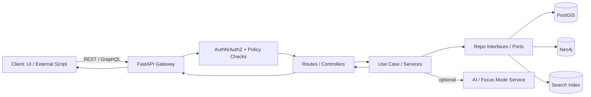

# KFM API

> **Kansas Frontier Matrix (KFM) — Unified API Gateway**  
> FastAPI-backed **REST** (versioned) + optional **GraphQL** interface, enforcing KFM’s **trust membrane** and governance rules.

---

## 📌 Document Metadata

| Field | Value |
|---|---|
| Artifact | `api/README.md` |
| Audience | Backend / full-stack contributors |
| Status | Draft (repo-grounded; fill in repo-specific details) |
| Governance | Treat as a governed doc (follow KFM Markdown + CI rules) |
| Sensitivity | Public by default **unless** policy marks endpoints/datasets as restricted |
| Key principle | **No client or UI talks to databases directly** — all access is mediated by this API gateway |

> [!IMPORTANT]
> If you see **placeholders** like “(not confirmed in repo)”, they are intentional uncertainty markers. Replace them once verified in your codebase and configs.

---

## 🧭 What This API Is

KFM’s backend API (FastAPI) acts as a **single, unified gateway** for all clients:

- Web UI (React/MapLibre)
- External scripts / researchers
- Internal tooling

The API gateway **orchestrates** requests across multiple subsystems (e.g., PostGIS for geospatial queries, Neo4j for graph semantics, a search index for text search, and an AI/Focus Mode capability), while keeping a **stable, governed contract** for consumers.

In other words: clients call the API; the API calls internal services + data stores; responses come back **validated and policy-checked**.

---

## 🧱 Architecture Boundaries

KFM follows a layered clean architecture. The API layer is an **outer interface/adaptor** that must not contain business rules.

### Layer responsibilities at a glance

| Layer | What belongs here | Must NOT depend on |
|---|---|---|
| Domain | Pure entities + domain rules | FastAPI, DB drivers, UI |
| Use Case / Service | Workflows, orchestration, policies | DB implementations, web framework |
| Integration / Interface | Repository interfaces, ports, adapters contracts | Concrete infra |
| Infrastructure | PostGIS/Neo4j/search impls, FastAPI app wiring, deployment | — |

### Trust membrane rule

- The **frontend (and external clients)** never bypass the API to query databases directly.
- Core backend logic must not bypass repository interfaces to talk to storage directly.

> [!WARNING]
> Any PR that introduces “direct DB calls from UI” or “business logic inside route handlers” violates KFM architecture and governance expectations.

### Request flow



---

## 📁 Expected Directory Layout

> This is a **design-intent** layout. Confirm exact names in your repo and update if they differ.

```text
api/
  main.py                  # FastAPI app init (common convention; verify)
  routes/
    datasets.py            # REST routes (example)
    stories.py             # Story Node routes (example)
    ...                    # additional route modules
  # Optional GraphQL support (verify)
  # graphql/
  #   schema.py
  #   resolvers.py
```

---

## 🚀 Local Development (Typical)

> The stack is commonly run via Docker Compose in KFM-style setups. Confirm filenames and service names in your repo.

1. Start the dev stack:

```bash
docker-compose up --build
```

2. Open interactive REST docs (Swagger UI):

- `http://localhost:8000/docs` (common default)

3. Explore the OpenAPI contract:

- `http://localhost:8000/openapi.json` (common default)

4. If GraphQL is enabled, use one of:

- `http://localhost:8000/api/v1/graphql` (common versioned mount)
- `http://localhost:8000/graphql` (alternate mount seen in some dev setups)

> [!TIP]
> When ports conflict (e.g., `5432` Postgres), adjust your compose port mappings or stop the conflicting service.

---

## 📚 API Documentation & Contracts

### REST (OpenAPI)

FastAPI commonly exposes:

- `/docs` for interactive Swagger UI
- `/openapi.json` for the machine-readable contract

> KFM treats the OpenAPI spec as a contract boundary: clients depend on it; changes must be controlled.

### GraphQL (Optional)

GraphQL (when enabled) provides:

- flexible query composition (e.g., retrieving geospatial + related historical entities in one call)
- schema introspection (self-documenting)

---

## 🧩 Endpoint Groups (Design Intent)

Below is a **typical** grouping. Confirm what exists in your implementation.

| Group | Example endpoints | Notes |
|---|---|---|
| Datasets / Catalog | `GET /api/v1/datasets`, `GET /api/v1/datasets/{id}` | May return DCAT-ish metadata + access methods |
| Dataset data access | `GET /api/v1/datasets/{id}/data` | Often supports spatial/temporal filters |
| Tiles / map layers | `GET /api/v1/tiles/{layer}/{z}/{x}/{y}.png` | If tile serving is implemented |
| Search | `GET /api/v1/search?q=...` | Full-text + metadata search (if enabled) |
| Knowledge graph | `GET /api/v1/graph/{entity}` | Relationship-centric graph queries |
| Story Nodes | `GET /api/v1/stories`, `GET /api/v1/stories/{storyId}` | Returns story content + metadata |
| AI / Focus Mode | `POST /api/v1/ai/query` | Must return evidence/citations per governance |
| Auth (optional) | `POST /api/v1/auth/login` | Needed for restricted data or write paths |

---

## 🗺️ Data Formats & Geospatial Conventions

Common response formats (verify per endpoint):

- `application/json` for standard resources
- `application/geo+json` (GeoJSON) for feature collections / spatial outputs

Filters commonly expected in GIS APIs (verify):

- Bounding boxes (`bbox`)
- Time windows (`start`, `end`)
- Pagination (`limit`, `offset` or cursor)

> [!NOTE]
> KFM governance expects that exported data carries enough context to remain interpretable (metadata + provenance travel with data when possible).

---

## 🛡️ Governance, Policy, and Provenance

The API is the **trust gateway**: regardless of client, requests should experience the same controls:

- Authentication / authorization (when required)
- Policy enforcement (e.g., restricted datasets, disallowed query combinations)
- Validation of inputs and outputs
- Audit/provenance logging for sensitive or high-impact operations (especially AI query endpoints)

> [!IMPORTANT]
> If you add a new endpoint that can materially shape a public narrative (maps, story content, AI responses), treat it as a governed change:
> - define contract
> - add tests
> - ensure policy enforcement
> - update docs

---

## 🧪 Testing

Typical commands (verify):

```bash
# run backend tests in a running stack
docker-compose exec backend pytest
```

Also run linters locally before pushing (exact commands depend on repo tooling).

---

## 🧰 Adding or Changing an Endpoint

### Rules of thumb

- Route handlers should do:
  - input parsing/validation
  - dependency injection
  - calling a use-case/service
  - translating results to HTTP responses

- Route handlers should **not**:
  - embed business logic
  - embed SQL/Cypher queries directly
  - bypass repository interfaces

### Change checklist

- [ ] Add/modify route in `api/routes/*`
- [ ] Implement/modify use-case/service layer logic (outside route handler)
- [ ] Use repo interfaces/ports for storage access (no direct DB calls from routes)
- [ ] Add/update unit tests + contract tests
- [ ] Confirm OpenAPI contract still renders cleanly at `/docs`
- [ ] If GraphQL: update schema/resolvers and add query tests
- [ ] Update documentation (this README + any higher-level API docs)
- [ ] If policy changes are needed: update OPA/policy rules + tests (if present)
- [ ] Mark any unknowns as “(not confirmed in repo)” until verified

---

## 🧾 References (Project Artifacts)

- Kansas Frontier Matrix (KFM) System Implementation Guide (architecture + API layer overview)
- Kansas Frontier Matrix (KFM) System Implementation Blueprint & Capabilities Guide (trust membrane, interfaces)
- KFM Markdown Guide (governed doc + provenance expectations)
- Kansas Frontier Matrix (KFM) – Comprehensive Technical Blueprint (dev workflow examples)