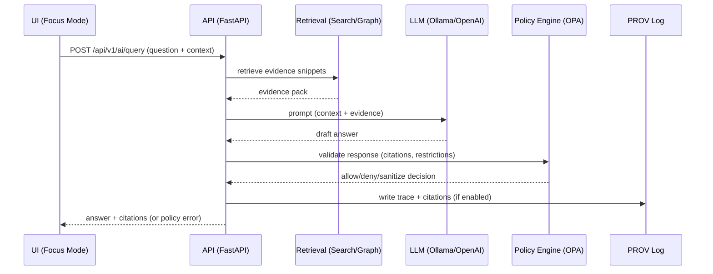

# KFM API

> **Kansas Frontier Matrix (KFM) — Unified API Gateway**  
> FastAPI-backed **REST** (versioned + OpenAPI) + optional **GraphQL**, enforcing KFM’s **trust membrane**, **policy-as-code**, and **provenance-first** governance.

-informational)
-blue)


---

## 📌 Document Metadata

| Field | Value |
|---|---|
| Artifact | `api/README.md` |
| Audience | Backend / full-stack contributors |
| Status | Draft (**project-doc grounded**; remaining repo-specific unknowns are marked) |
| Governance | Treat as a governed doc (follow KFM Markdown + CI rules) |
| Sensitivity | Public by default **unless** policy marks endpoints/datasets as restricted |
| Key principle | **No client or UI talks to databases directly** — all access is mediated by this API gateway |

> [!IMPORTANT]
> If you see placeholders like “(not confirmed in repo)”, they are intentional uncertainty markers.  
> Replace them only after verifying in **code/configs** (compose files, env, routers, schemas, policies).

---

## ✅ Non‑Negotiable Invariants

> [!WARNING]
> These are not “style preferences.” They are KFM governance + architecture invariants.

### 1) Trust membrane (API is the only ingress to data stores)

- **UI / external clients** must never query PostGIS / Neo4j / search indexes directly.
- Backend **route handlers** must never contain business rules or embed direct SQL/Cypher.
- Core logic must use repository **ports/interfaces**; infrastructure implements adapters.

### 2) Canonical pipeline ordering (data → narrative)

KFM’s ordering is absolute:

**ETL → Catalogs (STAC/DCAT/PROV) → Graph → API → UI → Story Nodes → Focus Mode**.

> [!NOTE]
> This ordering is enforced because provenance + governance are *upstream dependencies* of API/UI behaviors.

### 3) Contract‑first API

- Schemas + API contracts are **first-class artifacts**.
- Breaking changes require a **version bump** and compatibility checks (OpenAPI/GraphQL + contract tests).

### 4) Classification propagation

Sensitive data **must not become less restricted downstream** (e.g., AI summaries, stories, derived layers).

---

## 🧭 What This API Is

KFM’s backend API is a **single, unified gateway** for all clients:

- Web UI (React/MapLibre)
- External scripts / researchers
- Internal tooling
- Focus Mode (governed AI/Q&A)

The gateway hides internal complexity (PostGIS, Neo4j, search, AI), while enforcing:

- authentication/authorization (when required)
- policy checks (request + response)
- validation and consistent contracts
- provenance and audit logging for high-impact outputs

> [!TIP]
> Think “**trust gate**”: clients call the API; the API orchestrates internal services; responses come back policy-checked.

---

## 🧱 Architecture Boundaries

KFM follows layered clean architecture. The API layer is an **outer interface/adaptor** that must not contain business rules.

### Layer responsibilities at a glance

| Layer | What belongs here | Must NOT depend on |
|---|---|---|
| Domain | Pure entities + domain rules | FastAPI, DB drivers, UI |
| Use Case / Service | Workflows, orchestration, policies | DB implementations, web framework |
| Integration / Interface | Repository interfaces, ports, adapter contracts | Concrete infra |
| Infrastructure | PostGIS/Neo4j/search impls, FastAPI wiring, deployment | — |

> [!WARNING]
> Any PR that introduces **direct DB calls from UI** or **business logic inside route handlers** violates KFM architecture and governance expectations.

### Request flow

```mermaid
flowchart LR
  Client[Client: UI / External Script] -->|REST / GraphQL| API[FastAPI Gateway]

  API --> Auth[AuthN/AuthZ (if enabled)]
  Auth --> Policy[Policy Engine (OPA / policy-as-code)]
  Policy --> Routes[Routes / Controllers]

  Routes --> UseCases[Use Case / Services]
  UseCases --> Ports[Repo Interfaces / Ports]

  Ports --> PostGIS[(PostGIS)]
  Ports --> Neo4j[(Neo4j)]
  Ports --> Search[(Search Index)]

  UseCases --> Prov[Provenance/Audit Logging]
  UseCases -->|optional| AI[Focus Mode AI Service]

  Prov --> Routes
  AI --> Policy
  Routes --> API --> Client
```

---

## 📁 Repository & Directory Layout

> [!NOTE]
> Project docs describe a **canonical v13+ layout** (one directory per subsystem) *and* also reference a common `api/` + `web/` structure.  
> This README lives in `api/`, so we document **both** and mark items to verify.

### Subsystem map (verify which variant your repo uses)

| Subsystem | Canonical (v13+ design intent) | Common layout referenced in docs | Verify in repo |
|---|---|---|
| API (FastAPI) | `src/server/` (not confirmed in repo) | `api/` ✅ (this file) | ⬜ |
| UI (React/MapLibre) | `src/client/` (not confirmed in repo) | `web/` ✅ | ⬜ |
| Policies (OPA/Rego) | `policy/` | `policy/` | ⬜ |
| Catalogs (DCAT/STAC) | `data/catalog/dcat/`, `data/catalog/stac/` | `data/` (varies) | ⬜ |
| Provenance (PROV) | `data/prov/` | `data/prov/` (varies) | ⬜ |
| Story Nodes | `docs/reports/story_nodes/` | `docs/stories/` (older) | ⬜ |
| Contract extensions | `docs/contracts/` (suggested) | `docs/templates/TEMPLATE__API_CONTRACT_EXTENSION.md` | ⬜ |

### API package layout (typical)

```text
api/
  main.py                      # FastAPI app init + middleware wiring (verify filename)
  routes/
    datasets.py                # REST routes (example)
    stories.py                 # Story Node routes (example)
    search.py                  # Search routes (example)
    graph.py                   # Graph routes (example)
    ai.py                      # Focus Mode routes (example)
  services/                    # Use-case/service layer (verify)
  domain/                      # Domain models/entities (verify)
  ports/                       # Interfaces / ports (verify)
  infrastructure/              # PostGIS/Neo4j/search adapters (verify)

  # Optional GraphQL (verify)
  graphql/
    schema.py                  # SDL/schema assembly (example)
    resolvers.py               # Resolvers calling the same services as REST (example)
```

---

## 🚀 Local Development

Project docs describe a Docker Compose workflow and default ports. Your repo may differ; verify compose + `.env`.

### 0) Prereqs

- Docker + Docker Compose
- (Optional) `conftest` for local policy tests
- (Optional) Ollama (for local Focus Mode AI testing)

### 1) Start the dev stack

From repo root (expected):

```bash
docker-compose up --build
```

### 2) Default local endpoints (doc-grounded defaults)

| Service | Default URL / Host:Port | Notes |
|---|---:|---|
| FastAPI (Swagger UI) | `http://localhost:8000/docs` | Interactive REST docs |
| OpenAPI JSON | `http://localhost:8000/openapi.json` | Machine contract |
| GraphQL (if enabled) | `http://localhost:8000/graphql` **or** `http://localhost:8000/api/v1/graphql` | GraphiQL may appear |
| Web UI | `http://localhost:3000` | React dev server |
| PostGIS | `localhost:5432` | Port conflicts are common |
| Neo4j Browser | `http://localhost:7474` | UI |
| Neo4j Bolt | `localhost:7687` | Driver connection |
| Health (if implemented) | `http://localhost:8000/health` | Not guaranteed |

### 3) Common troubleshooting

- **Port conflicts** (5432/7474/8000/3000): stop conflicting local services or remap ports in compose.
- **DB readiness**: compose `depends_on` helps, but you may need to restart `docker-compose up` if API starts before DB.
- **Hot reload**: if compose mounts source + runs Uvicorn with `--reload`, editing `api/routes/*.py` should reload API.

---

## ⚙️ Configuration

> [!IMPORTANT]
> Do **not** commit secrets. Use `.env` or secret managers. CI typically enforces “no secrets in code.”

Common env/config knobs mentioned in docs (names may differ):

| Purpose | Example var | Notes |
|---|---|---|
| PostGIS connection | `POSTGIS_URL` / `DATABASE_URL` | Verify actual naming |
| Neo4j connection | `NEO4J_URI`, `NEO4J_USER`, `NEO4J_PASSWORD` | Verify |
| API base URL | `API_BASE_URL` | Often used by UI |
| CORS | `CORS_ORIGINS` | Verify |
| AI model selection | `OLLAMA_MODEL` | For local LLM testing |
| AI backend URL | `AI_BACKEND_URL` | e.g., Ollama host mapping |
| External AI | `OPENAI_API_KEY` | Optional (governance-sensitive) |

---

## 📚 API Documentation & Contracts

### REST (OpenAPI)

FastAPI exposes:

- `/docs` — interactive Swagger UI
- `/openapi.json` — machine-readable OpenAPI

> [!IMPORTANT]
> Treat OpenAPI as a **contract boundary**. Changes should be intentional, reviewed, and tested.

### GraphQL (Optional)

GraphQL (when enabled) provides flexible query composition.

- Endpoint is commonly `/graphql`, sometimes versioned under `/api/v1/graphql`.
- GraphiQL may be available in dev.

> [!NOTE]
> GraphQL resolvers must call the same use-case/service layer as REST (no bypassing policy/provenance).

### API Contract Extensions (Governed)

When you add/change endpoints, also add a contract-extension artifact using the project template:

- `docs/templates/TEMPLATE__API_CONTRACT_EXTENSION.md` (verify path)

This is how KFM keeps “why + governance + constraints” alongside “what + schema.”

---

## 🧩 Endpoint Groups

Docs describe a typical versioned namespace under `/api/v1`.

| Group | Example endpoints | Notes |
|---|---|---|
| Datasets / Catalog | `GET /api/v1/datasets`, `GET /api/v1/datasets/{id}` | Returns DCAT-ish metadata; may include sample |
| Dataset data access | `GET /api/v1/datasets/{id}/data` | Often supports spatial/temporal filters |
| Tiles / map layers | `GET /api/v1/tiles/{layer}/{z}/{x}/{y}.png` | If tile serving implemented |
| Search | `GET /api/v1/search?q=...` | Full-text + metadata search |
| Knowledge graph | `GET /api/v1/graph/{entity}` | Relationship-centric graph queries |
| Story Nodes | `GET /api/v1/stories`, `GET /api/v1/stories/{storyId}` | May return Markdown/JSON |
| Focus Mode AI | `POST /api/v1/ai/query` | Must return citations + pass policy |
| Auth (optional) | `POST /api/v1/auth/login` | Needed for restricted data / write paths |

### Example: spatiotemporal dataset query

```bash
curl "http://localhost:8000/api/v1/datasets/railroads_1890/data?bbox=-102,36,-94,40&year=1890"
```

> [!NOTE]
> Dataset IDs and query params are examples; confirm exact IDs and supported filters via `/docs`.

---

## 🗺️ Data Formats & Geospatial Conventions

Common response formats (verify per endpoint):

- `application/json` for standard resources
- `application/geo+json` (GeoJSON) for feature collections / spatial outputs

Common filters (verify):

- Bounding boxes: `bbox=minLon,minLat,maxLon,maxLat`
- Time windows: `start`, `end` (or `year`, etc.)
- Pagination: `limit`, `offset` (or cursor)

> [!IMPORTANT]
> KFM governance expects exported data to remain interpretable: metadata + provenance should travel with data where feasible.

---

## 🛡️ Governance, Policy, and Provenance

### Policy engine (OPA / policy-as-code)

Project docs describe policy evaluation as part of the request path:

- Evaluate access control (dataset restrictions, user roles)
- Enforce “safe outputs” (e.g., don’t leak restricted locations)
- Validate AI responses (citations required; block disallowed content)

### Provenance-first behavior

- Every dataset must have descriptive metadata + provenance logs.
- Every AI answer must attach citations.
- Story outputs are governed narrative artifacts, not ad-hoc text.

> [!WARNING]
> If you add a new endpoint that can materially shape a public narrative (maps, story content, AI responses), treat it as a governed change:
> - define/extend contract
> - add tests + policy checks
> - ensure provenance and citations
> - update docs

---

## 🤖 Focus Mode AI

Focus Mode is a governed “analyst,” not an oracle:

1. UI sends question/context to `POST /api/v1/ai/query`
2. Backend retrieves relevant snippets (search/graph/docs)
3. Backend prompts a local or external LLM (often Ollama-backed in docs)
4. Backend attaches citations + runs output through policy engine
5. Output is returned with citations; trace data may be written to PROV logs



---

## 🧪 Testing

> [!TIP]
> Service name varies by compose file; docs show both `api` and `backend` patterns.

Run backend tests:

```bash
docker-compose exec api pytest
# or:
docker-compose exec backend pytest
```

Run local policy tests (if `conftest` installed and policies exist):

```bash
conftest test .
```

Other typical checks (verify exact commands in repo):

- JS lint/tests in `web/`
- Docs build (e.g., `mkdocs serve`)

---

## 🧰 Adding or Changing an Endpoint

### Route handler responsibilities

Route handlers should do:

- input parsing/validation
- dependency injection
- call a use-case/service
- translate results to HTTP responses

Route handlers must **not**:

- embed business logic
- embed SQL/Cypher directly
- bypass repository interfaces

### Change checklist (governed)

- [ ] Add/modify route in `api/routes/*` (or `src/server/*`)
- [ ] Implement/modify service/use-case layer logic (outside route handler)
- [ ] Use ports/repo interfaces for storage access
- [ ] Add/update unit tests + (if applicable) integration tests
- [ ] Confirm OpenAPI renders cleanly at `/docs`
- [ ] Add/update API contract extension doc (template-based)
- [ ] Update/extend policy rules + policy tests (OPA/Conftest) if needed
- [ ] Ensure provenance/citations behavior for narrative/AI endpoints
- [ ] Update this README if interface/behavior changes
- [ ] Replace “(not confirmed in repo)” markers only after verification

---

## 🧾 References (Project Artifacts)

- Kansas Frontier Matrix (KFM) System Implementation Guide (architecture + API overview)
- Kansas Frontier Matrix (KFM) – Comprehensive Technical Blueprint (dev stack + AI integration details)
- Kansas Frontier Matrix (KFM) System Implementation Blueprint & Capabilities Guide (CI enforcement + MCP)
- KFM Markdown Guide (governed docs, contracts, pipeline ordering, sensitivity rules)