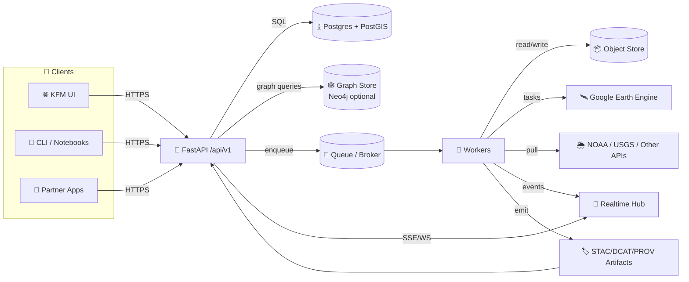

# 🚪 KFM API 🛰️🗺️  
_Backend + integration boundary for the Kansas Frontier Matrix (KFM) platform_

<p align="left">
  
  
  
  
  
  
  
  
  
  
  
  
  
  
  
</p>

> [!IMPORTANT]
> **KFM invariant (non‑negotiable):**  
> **ETL → STAC/DCAT/PROV Catalogs → Graph → APIs → UI → Story Nodes → Focus Mode**  
> This API is the **governed boundary**: it must not serve “mystery data” that isn’t **cataloged**, **provenance‑linked**, and **policy‑checked**.

---

## 🧭 Quick links
- 📘 **Swagger:** `/docs`  
- 📕 **ReDoc:** `/redoc`  
- 🧾 **OpenAPI JSON:** `/openapi.json`  
- ❤️ **Health:** `/api/v1/health`  
- 📈 **Metrics (optional):** `/metrics`  
- 🏷️ **STAC root:** `/api/v1/catalog/stac`  
- 🧾 **DCAT datasets:** `/api/v1/catalog/dcat` *(shape varies by implementation)*  
- 🧬 **PROV run lineage:** `/api/v1/prov/runs/{run_id}`  
- 📡 **Job stream (WS/SSE):** `/ws/jobs/{job_id}` *(if enabled)*  
- 🧭 **Project overview:** `../README.md`  
- 🤝 **Collaboration rules:** `../.github/README.md` *(if present)*  

---

## 📚 Table of contents
- [⭐ API “north stars”](#-api-north-stars)
- [✨ What this API is responsible for](#-what-this-api-is-responsible-for)
- [🚫 Non-goals](#-non-goals)
- [🧱 Architecture snapshot](#-architecture-snapshot)
- [📁 Repository layout](#-repository-layout)
- [📜 Contracts & schema as source of truth](#-contracts--schema-as-source-of-truth)
- [🚀 Quick start](#-quick-start)
- [⚙️ Configuration](#️-configuration)
- [🔐 Authentication & authorization](#-authentication--authorization)
- [🏷️ Governance, classification & evidence](#️-governance-classification--evidence)
- [📏 API conventions](#-api-conventions)
- [🗺️ Geospatial conventions](#️-geospatial-conventions)
- [🏷️ Catalog & provenance rules](#️-catalog--provenance-rules)
- [🧩 Endpoint map](#-endpoint-map-target)
- [🧪 Example flows](#-example-flows)
- [🧵 Async jobs & workers](#-async-jobs--workers)
- [📡 Real-time (push)](#-real-time-push)
- [⚡ Performance & scalability](#-performance--scalability)
- [🛡️ Security notes](#️-security-notes)
- [📊 Logging, monitoring, tracing](#-logging-monitoring-tracing)
- [✅ Roadmap](#-roadmap)
- [🤝 Contributing](#-contributing)
- [📚 Reference library & influence map](#-reference-library--influence-map)

---

## ⭐ API “north stars”

KFM’s backend exists to support **truthful, reproducible, human-centered** decision support — not hype, not vibes, not persuasion.

- 🧾 **Provenance-first:** every dataset, derivative, and model output is evidence-linked (STAC/DCAT/PROV + IDs).
- 🧩 **Contract-first:** OpenAPI is the shipping interface; breaking changes require versioning.
- 🧭 **Governance always-on:** classification, licensing, redaction, and “no privacy downgrade” rules are enforced.
- 🧠 **Integrity over incentives:** the API must never “bend truth” for convenience or gain — auditability is the feature.
- 🧪 **Reproducible by default:** jobs store params + versions + artifacts; results aren’t “magic.”
- ❤️ **Human autonomy:** AI-assisted outputs are labeled, bounded, and evidence-backed.

---

## ✨ What this API is responsible for

This service provides a **stable, versioned, secure** interface for the KFM ecosystem:

- 📥 **Ingestion orchestration**  
  uploads, scheduled pulls, ETL triggers, dataset registrations (heavy lifting belongs in pipelines/workers)
- 🗺️ **Geospatial query boundary**  
  fields/regions/overlays/buffers/spatial joins — served safely (policy + performance)
- 🛰️ **Remote sensing integrations**  
  Earth Engine tasks, raster derivatives (NDVI, composites), export tracking, catalog emission
- 📈 **Analytics / inference orchestration**  
  regression/EDA/Bayesian pipelines as reproducible jobs (with diagnostics + uncertainty outputs)
- 🧪 **Simulation + optimization orchestration**  
  long-running scenarios; reproducible inputs; V&V posture; results stored + traceable
- 🏷️ **Catalog & evidence serving**  
  STAC/DCAT discovery, PROV lineage views, evidence bundles for Story Nodes + Focus Mode
- 🧾 **Governed exports**  
  CSV/GeoJSON/tiles/images (subject to classification + redaction)
- 📡 **Progress & updates**  
  SSE/WebSockets for job progress, streaming status updates (API process stays stateless)

---

## 🚫 Non-goals

- ❌ Building the UI (frontend lives in `web/`)
- ❌ Running “forever streams” in the API process (use brokers/workers; keep API stateless)
- ❌ Storing raw satellite archives locally by default (prefer catalogs + cached derivatives)
- ❌ Serving uncataloged outputs (“just return this file”) unless it is **cataloged + governed**
- ❌ Letting routes become business logic (policy belongs in application/domain)

---

## 🧱 Architecture snapshot

KFM favors **Clean Architecture** boundaries (frameworks are adapters):

- **🧠 Domain** — entities + invariants (pure Python, no framework imports)
- **🧰 Application** — use cases (policy, authorization decisions, orchestration)
- **🔌 Adapters** — FastAPI routes, repositories, external clients
- **🏗️ Infrastructure** — Postgres/PostGIS, graph store, queues, object storage, cloud wiring

### 🔁 Runtime “shape” (typical deployment)


> [!NOTE]
> **Catalogs are the gate.** Workers/pipelines emit STAC/DCAT/PROV, so downstream (graph/UI/Focus Mode) can trust outputs.

---

## 📁 Repository layout

> 📌 Treat this as the **target shape**. If the code differs today, update this file when structure changes.

```text
📦 api/
├─ 📄 README.md
├─ 🧾 pyproject.toml                 # preferred (or requirements.txt)
├─ 🐳 Dockerfile
├─ 🐳 docker-compose.yml
├─ 📜 contracts/
│  ├─ 🧩 openapi.yaml                # ✅ source-of-truth (recommended)
│  └─ 🧬 schemas/                    # JSON Schemas (STAC/DCAT/PROV/Evidence)
├─ 🧩 src/
│  └─ kfm_api/
│     ├─ 🚀 main.py                  # FastAPI entrypoint
│     ├─ ⚙️ settings.py              # config/env parsing
│     ├─ 🛣️ api/
│     │  └─ v1/                      # routers grouped by version
│     ├─ 🧠 domain/                  # entities/value objects + invariants
│     ├─ 🧰 application/             # use cases/services (policy lives here)
│     ├─ 🔌 adapters/                # db repos, external clients, gateways
│     ├─ 🏗️ infrastructure/          # postgres, graph, queues, storage, providers
│     └─ 🧪 tests/
└─ 🔧 scripts/                       # dev helpers (seed, migrate, smoke tests)
```

---

## 📜 Contracts & schema as source of truth

**Contract changes first**, then implementation.

Recommended posture:
- `contracts/openapi.yaml` is the API truth ✅  
- JSON Schemas for:
  - STAC items/collections
  - DCAT dataset/distribution shapes
  - PROV run bundles
  - Evidence bundles (Story Nodes + Focus Mode)

### Contract QA gates (recommended)
- ✅ OpenAPI diff check (breaking changes require bump)
- ✅ Example payload validation (request/response fixtures validate against schema)
- ✅ Negative tests (unauthorized, restricted, invalid geometry)
- ✅ Policy tests (OPA/Conftest optional) for “who can see what” constraints
- ✅ Reproducibility checks for job endpoints (idempotency + deterministic params)

> [!TIP]
> If we can’t test the contract, it’s not ready to ship.

---

## 🚀 Quick start

### Option A — Docker (recommended) 🐳
```bash
cd api
cp .env.example .env
docker compose up --build
```

**Expected local URLs (typical):**
- API: `http://localhost:8000`
- Swagger: `http://localhost:8000/docs`
- ReDoc: `http://localhost:8000/redoc`

### Option B — Local dev (no Docker) 🧑‍💻
```bash
cd api
python -m venv .venv
source .venv/bin/activate
pip install -r requirements.txt

uvicorn kfm_api.main:app --reload --port 8000
```

### Common commands (suggested) 🧪🧹
```bash
# lint + format
ruff check .
ruff format .

# tests
pytest -q

# type check (optional but recommended)
mypy .

# DB migrations (if using Alembic)
alembic upgrade head
```

---

## ⚙️ Configuration

Create a `.env` file (or supply env vars via your orchestrator).

### Minimum set (suggested)
| Variable | Example | Why |
|---|---|---|
| `APP_ENV` | `dev` | environment gating |
| `API_BASE_URL` | `http://localhost:8000` | URL building / links |
| `DATABASE_URL` | `postgresql+psycopg://user:pass@db:5432/kfm` | Postgres/PostGIS |
| `JWT_SECRET` | `...` | token signing |
| `JWT_ISSUER` | `kfm` | token validation |
| `JWT_AUDIENCE` | `kfm-ui` | token validation |
| `CORS_ALLOWED_ORIGINS` | `http://localhost:5173` | browser safety |
| `OBJECT_STORE_URL` | `s3://bucket/...` | rasters/artifacts |
| `QUEUE_URL` | `redis://...` | background jobs |
| `LOG_LEVEL` | `INFO` | observability |

### Policy + governance (recommended)
| Variable | Example | Why |
|---|---|---|
| `POLICY_ENGINE` | `internal` / `opa` | policy enforcement strategy |
| `OPA_BUNDLE_PATH` | `./policy/bundle.tar.gz` | OPA policy bundle (if used) |
| `DATA_DEFAULT_CLASSIFICATION` | `public` | safety default |
| `ALLOW_EXPORTS` | `true` | export gating |
| `MAX_UPLOAD_MB` | `250` | ingestion safety |

### Observability + supply chain (recommended)
- `OTEL_SERVICE_NAME=kfm-api`
- `OTEL_EXPORTER_OTLP_ENDPOINT=...`
- `SENTRY_DSN=...` *(optional)*
- `SBOM_ENABLED=true` *(build pipeline)*
- `COSIGN_VERIFY=true` *(deploy pipeline)*

---

## 🔐 Authentication & authorization

### Tokens
- Use **JWT Bearer tokens**
- Clients send: `Authorization: Bearer <token>`

### Claims (recommended)
- `sub` (user id)
- `org_id` (tenant/org scope)
- `roles` (e.g., `viewer`, `editor`, `admin`)
- `scopes` (optional)
- `exp`, `iss`, `aud`

### Authorization model (recommended)
- **RBAC** for broad capabilities (viewer/editor/admin)
- **ABAC** for data sensitivity and dataset policies:
  - classification (`public` / `internal` / `restricted`)
  - license constraints
  - org ownership / sharing rules
  - feature gates for exports and publishing steps

**Rules**
- Authorization decisions belong in **application/use-case layer** (not route handlers).
- Audit “write” actions: uploads, publish/promote, redactions, deletes.
- Treat ingestion as hostile: validate file types, size, and content; scan uploads; avoid SSRF patterns.

---

## 🏷️ Governance, classification & evidence

### ✅ Always-on rules
- Every dataset and derivative has:
  - stable IDs (`dataset_id`, `layer_id`, `run_id`)
  - classification label
  - provenance pointer (STAC/DCAT/PROV)
  - license/attribution (or explicitly unknown + blocked)

### 🔒 Sensitivity propagation (non-negotiable)
Outputs cannot become less restricted than inputs unless a documented redaction step exists.

### 🤖 AI-assisted outputs (label + bound)
If a job uses ML/LLM inference:
- mark outputs as **AI-assisted**
- include model/version/config references where allowed
- include evaluation/limits pointers (model card / artifact link)
- require evidence bundle references when used in Story Nodes / Focus Mode

> [!IMPORTANT]
> KFM’s AI posture: **assist, don’t assert.** Claims must point to evidence.

---

## 📏 API conventions

### Versioning
All public endpoints live under:
- `/api/v1/...`

### Content types
- `application/json` (default)
- `application/geo+json` (GeoJSON)
- `text/csv` (exports)
- `image/png` / `image/jpeg` (thumbnails/quicklooks)
- `application/x-protobuf` (vector tiles if supported)
- `application/octet-stream` (binary artifacts via signed URLs)

### Pagination & filtering
Preferred:
- `?limit=50&offset=0`  
or
- `?cursor=...&limit=...`

Time filtering:
- `?start=YYYY-MM-DD&end=YYYY-MM-DD`
- ISO timestamps for high-resolution datasets

### Idempotency (recommended)
For create/trigger endpoints:
- Accept: `Idempotency-Key: <uuid>`
- Store per-user/per-org for TTL (prevents duplicate jobs/uploads)

### Correlation IDs (recommended)
- Accept `X-Request-Id` (or generate if absent)
- Return it in responses and error payloads

### Error shape (recommended)
```json
{
  "error": {
    "code": "FIELD_NOT_FOUND",
    "message": "Field 123 does not exist",
    "details": {},
    "correlation_id": "01HZZ...."
  }
}
```

---

## 🗺️ Geospatial conventions

- **Default API CRS:** WGS84 (`EPSG:4326`)
- **Geometry transport:** GeoJSON (`Feature` / `FeatureCollection`)
- **Server-side ops:** prefer PostGIS (buffers, intersects, within, joins)
- **Tiles (optional):** Web Mercator (`EPSG:3857`) for tile math

### Parameter conventions (recommended)
- `bbox=minLon,minLat,maxLon,maxLat` (EPSG:4326)
- `geom=<GeoJSON>` (POST body; avoid massive query strings)
- `simplify=<meters>` (only for derived outputs; never mutate sources)
- `precision=<int>` (optional: control float rounding in responses)

> [!TIP]
> Store geometries in PostGIS with explicit SRIDs and perform transforms at boundaries.

---

## 🏷️ Catalog & provenance rules

> [!IMPORTANT]
> **Publishing rule:** If a dataset/result isn’t **cataloged + provenance-linked**, it isn’t “published” in KFM.

### Required outputs (KFM standard)
For anything user-visible or reusable:
- 🗺️ **STAC** (Collections + Items) for spatial assets/layers
- 🏷️ **DCAT** dataset entries for discovery & distribution
- 🧬 **PROV** lineage bundles for inputs → activities → outputs

### API responsibilities
- API can **trigger** ETL/jobs, but workers/pipelines must:
  - write outputs to stable storage (object store / DB)
  - emit STAC/DCAT/PROV artifacts
  - return stable IDs/links (not temp paths)
- API serves:
  - catalog discovery endpoints (STAC/DCAT)
  - provenance views (PROV)
  - evidence bundles (Story Nodes + Focus Mode)

---

## 🧩 Endpoint map (target)

> These are the **target contracts**. Keep `/api/v1` stable and version breaking changes.

### ✅ Core
| Method | Path | Auth | What it does |
|---:|---|:---:|---|
| GET | `/api/v1/health` | ❌ | Liveness/readiness |
| GET | `/api/v1/meta/version` | ❌ | API + schema versions |
| POST | `/api/v1/auth/login` | ❌ | Issue JWT |
| GET | `/api/v1/auth/me` | ✅ | Current user + roles |

### 🗺️ Geospatial query
| Method | Path | Auth | What it does |
|---:|---|:---:|---|
| GET | `/api/v1/fields?bbox=...` | ✅ | List fields with filters |
| GET | `/api/v1/field/{field_id}` | ✅ | Field metadata + geometry |
| POST | `/api/v1/geo/intersects` | ✅ | Spatial query by geometry |
| POST | `/api/v1/geo/buffer` | ✅ | Buffer geometry (derived output) |

### 🛰️ Remote sensing & time-series
| Method | Path | Auth | What it does |
|---:|---|:---:|---|
| GET | `/api/v1/field/{field_id}/timeseries?var=ndvi` | ✅ | Variable time-series |
| POST | `/api/v1/rs/gee/export` | ✅ | Trigger GEE export → job |
| GET | `/api/v1/rs/gee/tasks/{task_id}` | ✅ | Task status |
| GET | `/api/v1/rs/quicklook/{layer_id}` | ✅/❌ | Thumbnail/preview (policy-gated) |

### 🧪 Modeling / regression / Bayesian (job-oriented)
| Method | Path | Auth | What it does |
|---:|---|:---:|---|
| POST | `/api/v1/analysis/regression/run` | ✅ | Start regression analysis job |
| POST | `/api/v1/analysis/bayes/run` | ✅ | Start Bayesian inference job |
| GET | `/api/v1/analysis/runs/{run_id}` | ✅ | Analysis run metadata + artifacts |

### 🧮 Simulation & optimization (job-oriented)
| Method | Path | Auth | What it does |
|---:|---|:---:|---|
| POST | `/api/v1/simulation/run` | ✅ | Start simulation → returns job id |
| GET | `/api/v1/simulation/runs/{run_id}` | ✅ | Simulation run metadata + V&V status |
| POST | `/api/v1/opt/run` | ✅ | Optimization job (optional module) |

### 🕸️ Graph (optional but pipeline-aligned)
| Method | Path | Auth | What it does |
|---:|---|:---:|---|
| GET | `/api/v1/graph/search?q=...` | ✅ | Node/entity search |
| GET | `/api/v1/graph/path?from=...&to=...` | ✅ | Explainable path with evidence |
| GET | `/api/v1/graph/subgraph/{id}` | ✅ | Bounded subgraph export (policy-gated) |

### 🏷️ Catalog & provenance
| Method | Path | Auth | What it does |
|---:|---|:---:|---|
| GET | `/api/v1/catalog/stac` | ✅/❌ | STAC root |
| GET | `/api/v1/catalog/stac/collections/{id}` | ✅/❌ | STAC Collection |
| GET | `/api/v1/catalog/stac/items/{id}` | ✅/❌ | STAC Item |
| GET | `/api/v1/catalog/dcat/{id}` | ✅/❌ | DCAT dataset |
| GET | `/api/v1/prov/runs/{run_id}` | ✅ | PROV lineage bundle |

### 📚 Evidence bundles (Story Nodes + Focus Mode)
| Method | Path | Auth | What it does |
|---:|---|:---:|---|
| GET | `/api/v1/evidence/bundle/{bundle_id}` | ✅ | Evidence-only payload (citations + asset pointers) |
| POST | `/api/v1/story_nodes/publish` | ✅ | Publish story node referencing evidence |

### 🗺️ Tiles & map delivery (optional)
| Method | Path | Auth | What it does |
|---:|---|:---:|---|
| GET | `/api/v1/tiles/{z}/{x}/{y}.pbf` | ✅ | Vector tiles |
| GET | `/api/v1/tiles/{z}/{x}/{y}.png` | ✅ | Raster tiles |
| GET | `/api/v1/tileset/{tileset_id}.pmtiles` | ✅ | Offline tileset download (policy-gated) |

### 🧾 Exports
| Method | Path | Auth | What it does |
|---:|---|:---:|---|
| GET | `/api/v1/export/fielddata.csv?...` | ✅ | Bulk CSV export |
| GET | `/api/v1/export/layer.geojson?...` | ✅ | GeoJSON export |
| POST | `/api/v1/export/request` | ✅ | Async export job (large outputs) |

### 🧵 Jobs
| Method | Path | Auth | What it does |
|---:|---|:---:|---|
| GET | `/api/v1/jobs/{job_id}` | ✅ | Job status/progress |
| GET | `/api/v1/jobs/{job_id}/result` | ✅ | Result links/payload (when ready) |
| POST | `/api/v1/jobs/{job_id}/cancel` | ✅ | Cancel job (best-effort) |

---

## 🧪 Example flows

### 1) Query NDVI time-series 📈
```bash
curl -H "Authorization: Bearer $TOKEN" \
  "http://localhost:8000/api/v1/field/123/timeseries?var=ndvi&start=2026-03-01&end=2026-10-31"
```

**Response (example):**
```json
{
  "field_id": 123,
  "variable": "ndvi",
  "unit": "index",
  "series": [
    {"date": "2026-03-01", "value": 0.61},
    {"date": "2026-03-08", "value": 0.64}
  ],
  "evidence": {
    "dataset_id": "kfm.ks.ndvi.weekly.v1",
    "run_id": "kfm.run.gee.ndvi.weekly.2026-01-06",
    "stac_item": "kfm.stac.item.ndvi.weekly.2026-03-01",
    "prov_run": "kfm.prov.run.gee.ndvi.weekly.2026-01-06"
  }
}
```

### 2) Start a simulation 🧮
```bash
curl -X POST \
  -H "Authorization: Bearer $TOKEN" \
  -H "Content-Type: application/json" \
  -H "Idempotency-Key: 2b9f8b0d-7b58-4d57-a9ef-2c3b0a2f3f21" \
  -d '{
    "scenario": "yield_projection",
    "field_id": 123,
    "start_date": "2026-03-01",
    "end_date": "2026-10-31",
    "parameters": { "irrigation": "baseline" }
  }' \
  "http://localhost:8000/api/v1/simulation/run"
```

**Response (example):**
```json
{ "job_id": "sim_01HZZY8VQ7...", "status": "queued" }
```

### 3) Publish results (catalog-gated) 🏷️
1) worker finishes run → writes artifacts  
2) worker emits STAC/DCAT/PROV  
3) API exposes stable `run_id` + catalog IDs  
4) UI can now safely render and cite results

---

## 🧵 Async jobs & workers

Use jobs when:
- rasters/time windows are large
- compute is heavy (ML, simulation, mosaics)
- external APIs are involved (GEE exports, NOAA pulls)

### Common pattern ✅
1) `POST` creates job → returns `job_id`  
2) worker executes → writes artifacts (object store / DB)  
3) worker emits **STAC/DCAT/PROV**  
4) API exposes results by:
   - `GET /jobs/{job_id}` + `GET /jobs/{job_id}/result`
   - catalog endpoints once “published”

### Suggested job states 🔁
- `queued` → `running` → `succeeded`
- `queued|running` → `failed`
- optional: `canceled`

### Governance expectations
- Job outputs are never served “raw” from temp storage.
- Results become stable by publishing to catalog with stable IDs + lineage + classification propagation.

---

## 📡 Real-time (push)

Use WebSockets/SSE for:
- job progress updates (avoid aggressive polling)
- sensor dashboards / streaming status

**WS endpoints (example)**
- `ws://localhost:8000/ws/jobs/{job_id}`
- `ws://localhost:8000/ws/sensors/field/{field_id}`

**Message shape (example)**
```json
{
  "type": "job.progress",
  "job_id": "sim_01HZZY8VQ7...",
  "progress": 42,
  "status": "running",
  "message": "Computing weekly composites..."
}
```

---

## ⚡ Performance & scalability

KFM is a “big data, small interface” system. The API must enforce boundaries.

### ✅ Core tactics
- 🧊 **Cache where safe**: ETags, `Cache-Control` on immutable artifacts, tile caching
- 📦 **Stream big payloads**: range requests for large binaries, signed URLs for object store downloads
- 🗺️ **Prefer tiles over blobs**: don’t ship 50MB GeoJSON to browsers
- 🧵 **Bound concurrency**: worker pools, backpressure, timeouts
- 🧾 **Index aggressively**: PostGIS indexes, bbox prefilters, partitioning where needed
- 🧪 **Avoid silent slowdowns**: performance regression tests for hot endpoints

### 📦 Image/thumbnail realism
When serving quicklooks:
- pick appropriate formats (PNG vs JPEG) for the content
- keep previews tiny and cacheable
- never imply that a preview is “the authoritative raster”

---

## 🛡️ Security notes

- 🔒 Keep DB/brokers in private network segments
- 🌐 Public exposure limited to HTTPS (web/API)
- 🧯 Rate-limit login; lockout policies; strong hashing (bcrypt/argon2)
- 🧪 Validate ingestion: allowlists, AV scanning, size limits, file signature checks
- 🧾 Audit logging for “write” actions (upload, publish, redaction, delete)
- 🔐 Secrets via env/secret managers (never commit tokens)
- 🧩 Supply chain: SBOM generation + signed images + provenance attestations

> [!CAUTION]
> “Public repo” implies “public download.” Never commit sensitive exports into version control.

---

## 📊 Logging, monitoring, tracing

Recommended baseline:
- 📜 Structured logs: method, endpoint, user_id, org_id, params summary, status_code, latency
- 🧷 Correlation IDs: `X-Request-Id`
- 📈 Metrics: Prometheus + Grafana (optional)
- 🧵 Tracing: OpenTelemetry (`traceparent` propagation)
- ✅ Split health endpoints (optional): liveness vs readiness

---

## ✅ Roadmap

- [ ] Lock OpenAPI v1 (source-of-truth + CI diff checks)
- [ ] JSON Schemas for STAC/DCAT/PROV/Evidence + validation gates
- [ ] JWT auth middleware + org/role/classification guards
- [ ] PostGIS-backed geo endpoints (bbox, intersects, search)
- [ ] Queue + worker for simulation + heavy analytics
- [ ] Catalog endpoints (STAC/DCAT) + PROV lineage views
- [ ] Evidence bundles for Story Nodes + Focus Mode (citation-first payloads)
- [ ] Tiles + quicklook endpoints (policy-gated)
- [ ] Rate limits + audit logs + security scans + supply-chain attestations

---

## 🤝 Contributing

- 🧠 Keep business rules in **domain/application**, not in FastAPI routes
- 🧪 Add tests for every use-case and route (happy path + auth + edge cases)
- 🧩 Prefer small PRs with clear intent
- 📓 Document decisions in `/docs/adr/` (Architecture Decision Records) *(if present)*
- 🏷️ If you touch data outputs: ensure STAC/DCAT/PROV artifacts are emitted and validated

---

## 📚 Reference library & influence map

> These project files shape KFM’s API posture: **governance**, **scalability**, **security**, **geospatial correctness**, **credible modeling**, and **human-centered constraints**.

<details>
<summary><strong>🧭 Expand: Influence map (uses all project files)</strong></summary>

| Project file | API impact (why it matters here) |
|---|---|
| `Kansas Frontier Matrix (KFM) – Comprehensive Engineering Design.docx` | System-of-systems architecture; clean boundaries; “catalog gate” rule; Focus Mode evidence flow; integration targets (PostGIS, graph, ETL, UI) |
| `Latest Ideas.docx` | Implementation-first playbooks; governance frameworks (FAIR/CARE + supply chain); Story Node/3D Tiles direction; policy testing posture (OPA/Conftest) |
| `Data Spaces.pdf` | Data sharing + interoperability mindset; pointer-over-payload thinking; trust signals and governance as infrastructure |
| `Introduction to Digital Humanism.pdf` | Human-centered governance constraints; transparency, agency, and accountability requirements for AI-assisted endpoints |
| `Principles of Biological Autonomy - book_9780262381833.pdf` | Autonomy/closure thinking → keep humans in control; avoid black-box endpoints without explanation hooks |
| `On the path to AI Law’s prophecies and the conceptual foundations of the machine learning age.pdf` | Label AI-assisted outputs; provide auditability, explanation hooks, and “appeal/feedback” surfaces |
| `Cloud-Based Remote Sensing with Google Earth Engine-Fundamentals and Applications.pdf` | Earth Engine task orchestration patterns; raster derivative outputs; cataloging and time-series products |
| `python-geospatial-analysis-cookbook.pdf` | CRS sanity, geometry transport conventions, PostGIS-friendly operations; practical geo pitfalls and boundary transforms |
| `PostgreSQL Notes for Professionals - PostgreSQLNotesForProfessionals.pdf` | DB discipline: indexing, paging, query cost awareness; stable IDs; safe export patterns |
| `making-maps-a-visual-guide-to-map-design-for-gis.pdf` | Tiles/legend integrity as part of “truth”; avoid misleading defaults in map-serving endpoints |
| `Mobile Mapping_ Space, Cartography and the Digital - 9789048535217.pdf` | Offline + mobile realities: tile packaging endpoints, bandwidth constraints, location sensitivity posture |
| `compressed-image-file-formats-jpeg-png-gif-xbm-bmp.pdf` | Thumbnail/quicklook delivery format choices; performance and clarity tradeoffs for raster previews |
| `Scalable Data Management for Future Hardware.pdf` | Streaming/caching/concurrency discipline; avoid shipping huge blobs; design for locality and predictable scaling |
| `concurrent-real-time-and-distributed-programming-in-java-threads-rtsj-and-rmi.pdf` | Real-time + worker orchestration patterns; bounded queues; backpressure; avoiding “thread explosion” anti-patterns |
| `ethical-hacking-and-countermeasures-secure-network-infrastructures.pdf` | Threat modeling mindset; network segmentation; hardening and defensive validation requirements |
| `Gray Hat Python - Python Programming for Hackers and Reverse Engineers (2009).pdf` | Defensive posture for hostile inputs; scanning and validation; minimizing attack surface and unsafe parsing |
| `webgl-programming-guide-interactive-3d-graphics-programming-with-webgl.pdf` | 3D/graphics delivery implications: asset/tiles delivery endpoints, coordinate sanity, avoiding unsafe loaders |
| `Scientific Modeling and Simulation_ A Comprehensive NASA-Grade Guide.pdf` | Simulation credibility: V&V mindset, scenario metadata, reproducibility, and audit-ready outputs |
| `Generalized Topology Optimization for Structural Design.pdf` | Optimization jobs: objective/constraint metadata; reproducibility; results as governed artifacts (not ad-hoc files) |
| `Understanding Statistics & Experimental Design.pdf` | Avoid misleading inference endpoints; require experimental context, uncertainty, and proper comparisons |
| `graphical-data-analysis-with-r.pdf` | EDA-first artifact expectations: distributions, outliers, diagnostics; exploration without overclaiming |
| `regression-analysis-with-python.pdf` | Regression endpoints must emit diagnostics (residuals, assumptions) and avoid “trendline as truth” |
| `Regression analysis using Python - slides-linear-regression.pdf` | Lightweight contract shapes for regression results; standardized metrics and summaries for UI consumption |
| `think-bayes-bayesian-statistics-in-python.pdf` | Bayesian job outputs: posterior summaries, credible intervals, prior disclosure, uncertainty as first-class |
| `Deep Learning for Coders with fastai and PyTorch - Deep.Learning.for.Coders.with.fastai.and.PyTorchpdf` | ML pipeline posture: versioned artifacts, evaluation outputs, model cards; keep training out of API process |
| `Spectral Geometry of Graphs.pdf` | Graph endpoints: explainable graph analytics and bounded subgraph exports; spectral metrics as optional services |
| `A programming Books.pdf` | Contributor shelf: broad language/tool references for future adapters and tooling choices |
| `B-C programming Books.pdf` | Contributor shelf (B–C) |
| `D-E programming Books.pdf` | Contributor shelf (D–E) |
| `F-H programming Books.pdf` | Contributor shelf (F–H) |
| `I-L programming Books.pdf` | Contributor shelf (I–L) |
| `M-N programming Books.pdf` | Contributor shelf (M–N) |
| `O-R programming Books.pdf` | Contributor shelf (O–R) |
| `S-T programming Books.pdf` | Contributor shelf (S–T) |
| `U-X programming Books.pdf` | Contributor shelf (U–X) |

</details>

---
🌾 **KFM API is the boundary of trust.** If it can’t be explained, versioned, licensed, and governed — it doesn’t ship.