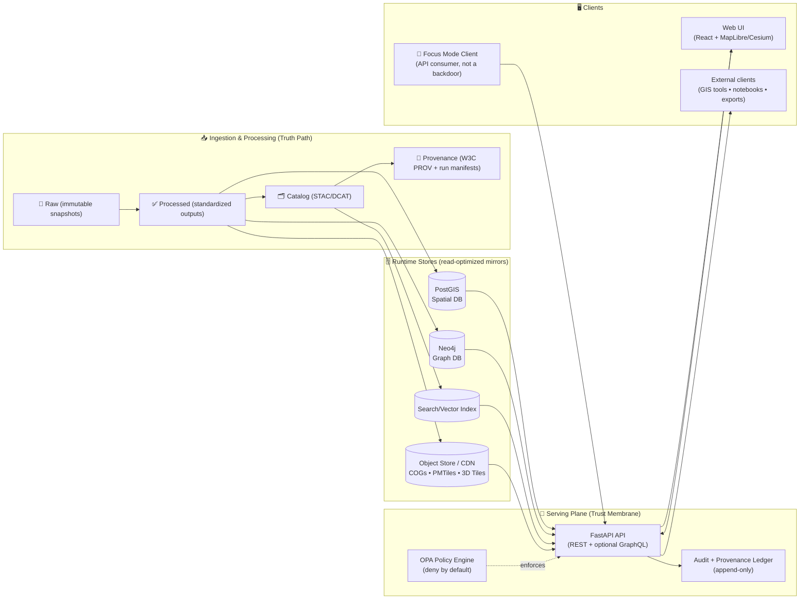
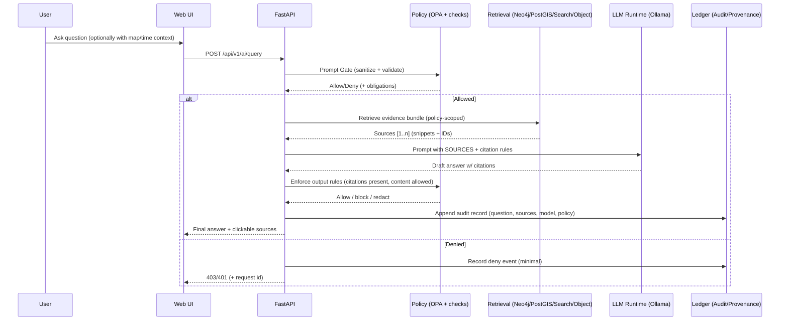

<!-- Internal source anchors (do not remove):
 [oai_citation:0‡Kansas Frontier Matrix Comprehensive System Documentation.pdf](sediment://file_00000000ef40722faf17987b69730695)  [oai_citation:1‡Kansas Frontier Matrix (KFM) – Comprehensive Technical Blueprint.pdf](sediment://file_000000006dbc71f89a5094ce310a452d)  [oai_citation:2‡Kansas Frontier Matrix (KFM) – Comprehensive Technical Blueprint.pdf](sediment://file_000000006dbc71f89a5094ce310a452d)  [oai_citation:3‡Kansas Frontier Matrix (KFM) – Comprehensive Technical Blueprint.pdf](sediment://file_000000006dbc71f89a5094ce310a452d)  [oai_citation:4‡Data Spaces.pdf](sediment://file_0000000053c071f5a9733b1b09cc9f76)  [oai_citation:5‡Comprehensive Markdown Guide_ Syntax, Extensions, and Best Practices.docx](file-service://file-J6rFRcp4ExCCeCdTevQjxz)
-->

<div align="center">
  <picture>
    <source media="(prefers-reduced-motion: reduce)" srcset="../docs/assets/kfm-seal-320.png">
    
  </picture>

  <h1>🛰️ Kansas Frontier Matrix — API</h1>

  <p><strong>The single, policy-enforced gateway to KFM data, maps, the knowledge graph, and Focus Mode.</strong></p>
  <p><sub><em>“Trust membrane” — every request is validated, authorized, logged, and provenance-linked.</em></sub>

  <p>
    
    
    
    
    
    
    
    
    
    
    
  </p>

  <p>
    <a href="../README.md">🏠 Main README</a> •
    <a href="#-quickstart-docker-compose">🚀 Quickstart</a> •
    <a href="#-architecture--data-flow">🏗️ Architecture</a> •
    <a href="#-api-surface-area">🧩 API Surface</a> •
    <a href="#-focus-mode-ai-governed">🤖 Focus Mode</a> •
    <a href="#-governance--security">🛡️ Governance</a> •
    <a href="#-contracts--standards">📜 Contracts</a> •
    <a href="#-contributing-to-the-api">🤝 Contribute</a>
  </p>
</div>

> [!WARNING]
> 🚧 **Under construction (active development).**  
> Endpoints, schemas, and service names may shift while we harden contracts and governance gates.  
> **Non-negotiable stays constant:** UI/AI never bypass the API, and “fail‑closed” is the default. 🔒

---

## 🧭 What this folder is

This folder contains the **backend API boundary** for **Kansas Frontier Matrix (KFM)** — the one place where:

- ✅ requests are **validated**
- ✅ access is **authorized** (RBAC + classification)
- ✅ outputs are **audited** (request IDs + decision logs)
- ✅ responses are **provenance-linked** (dataset ↔ catalog ↔ lineage)

> [!IMPORTANT]
> **If it needs data, it goes through this API.**  
> No UI-only backdoors. No “just query PostGIS.” No “AI direct-connect.” 🧫

---

## 🛣️ Truth Path (canonical data flow)

KFM’s “truth path” is the contract the API depends on:

```text
Raw ➜ Processed ➜ Catalog + Provenance ➜ Runtime Stores ➜ API ➜ UI/AI/Clients
```

### 🧾 Governance gates (always-on)
KFM uses **policy gates at each stage** so ungoverned artifacts never reach users:

- 📥 **Ingestion gate**: raw inputs must carry a source manifest (publisher/attribution, license, and classification)
- 🗂️ **Catalog gate**: published datasets must have linked **STAC/DCAT** metadata and **PROV** lineage
- 🤖 **AI gate**: Focus Mode answers must include **citations** and must not contain disallowed content
- 🛑 **Default behavior**: if policy cannot decide → **deny** (fail‑closed)

> [!CAUTION]
> The API is only as trustworthy as its weakest bypass.  
> **Bypasses are treated as defects** — and they will be closed. ✅

---

## 🔗 Quick links (local)

Once running locally:

- 🧪 **Swagger / OpenAPI UI** → `http://localhost:8000/docs`
- 📜 **OpenAPI JSON** → `http://localhost:8000/openapi.json`
- 🕸️ **GraphQL endpoint (if enabled)** → `http://localhost:8000/graphql`
- ❤️ **Health** → `http://localhost:8000/healthz`

---

## 🧠 Design pillars (KFM-grade API)

### 1) 🧾 Provenance-first (responses explain themselves)
Every meaningful response should carry:
- dataset identity (stable ID + version where applicable)
- links/pointers to catalog records (STAC/DCAT)
- lineage pointer (W3C PROV / provenance manifest)
- request correlation ID (for audit & debugging)

### 2) 🛡️ Policy-first (governance lives outside business logic)
Routes should be “thin”:

> **validate → authorize → service → record → respond**

Policy is centralized in an **OPA “policy pack”** so we can:
- enforce tiered access (public/internal/confidential/restricted)
- propagate classification (outputs can’t be less restricted than inputs)
- enforce AI citation rules the same way we enforce data access

### 3) 📜 Contract-first (OpenAPI is a product)
- versioned API surface (`/api/v1/...`)
- stable response envelopes and error semantics
- schema validation tests + backward-compat checks

### 4) 🌎 GIS-native (the API speaks “map”)
- bbox/time filters are first-class
- GeoJSON / MVT / raster tiles
- streaming for big feature sets
- predictable performance constraints (timeouts, limits, caching)

### 5) 🔒 Fail-closed by default
If metadata is missing, policy cannot evaluate, or provenance is absent:
- deny access (or return a sanitized result when policy explicitly allows redaction)
- return actionable error messages (**with request ID**)

---

## 🏗️ Architecture & data flow



> [!NOTE]
> KFM’s backend aims for **clean layered design** (domain → services → adapters → infrastructure).  
> That’s how we keep governance stable even as storage engines and clients evolve.

---

## 🧩 API surface area

> [!TIP]
> ✅ The **source of truth** is always `/docs` (Swagger UI).  
> This README describes the *governance contract* and *design intent*.

### 📍 Health & meta
- `GET /healthz` — liveness
- `GET /readyz` — readiness (db/graph/policy connectivity)
- `GET /version` — build/version info (include commit SHA when available)

---

### 🗂️ Catalog & datasets (REST, versioned)
Typical patterns:

- `GET /api/v1/datasets/{id}`  
  Dataset summary (DCAT-style) + links to STAC assets + provenance pointers

- `GET /api/v1/catalog/search?q=...&bbox=...&time=...`  
  Discovery (keyword + spatial + temporal)

- `GET /api/v1/datasets/{id}/data?format=geojson&bbox=...&limit=...`  
  Feature access (streaming strongly recommended for large datasets)

<details>
<summary><strong>📦 Example curl calls</strong> (illustrative)</summary>

```bash
# Dataset metadata
curl -s http://localhost:8000/api/v1/datasets/ks_hydrology_1880 | jq

# Catalog search (keyword + bbox)
curl -s "http://localhost:8000/api/v1/catalog/search?q=railroad&bbox=-102,36,-94,41" | jq

# Dataset features (GeoJSON with bbox)
curl -s "http://localhost:8000/api/v1/datasets/ks_hydrology_1880/data?format=geojson&bbox=-100,37,-96,40&limit=5000" | jq
```
</details>

---

### 🧪 Ad-hoc safe spatial queries (power users, governed)
KFM supports a *safe*, *logged* SQL-like interface for advanced users:

- `GET /api/v1/query?table=...&select=...&where=...&bbox=...`

✅ Intended use:
- “give me a filtered view of an approved table/view”
- “let a notebook/QGIS plugin query without DB credentials”

🚫 Not allowed:
- arbitrary SQL execution
- unapproved tables
- bypassing row/column policy constraints

<details>
<summary><strong>🧾 Example</strong> (illustrative)</summary>

```bash
curl -s "http://localhost:8000/api/v1/query?table=geo_counties&select=name,pop_1890&where=pop_1890>10000" | jq
```
</details>

---

### 🗺️ Tiles (MapLibre-first, Cesium-friendly)

- `GET /tiles/{layer}/{z}/{x}/{y}.pbf` — vector tiles (MVT)
- `GET /tiles/{layer}/{z}/{x}/{y}.png` / `.webp` — raster tiles
- 🧭 (Planned/optional) `GET /tiles3d/{layer}/tileset.json` — Cesium 3D Tiles entrypoint

Example (MapLibre-style):
```text
/tiles/historic_trails/{z}/{x}/{y}.pbf
```

> [!TIP]
> Tile endpoints should be:
> - cache-friendly (**ETags / Cache-Control**)
> - policy-aware (restricted layers must **not** be cached publicly)
> - deterministic (same request + same data version → same bytes)

---

### 🕸️ Knowledge graph & stories (REST and/or GraphQL)

- `POST /graphql` — GraphQL (optional but powerful for connected queries)

GraphQL is ideal when clients need to traverse relationships (places ↔ datasets ↔ events ↔ stories) without overfetching.

Example (illustrative):
```graphql
query {
  storyNodes {
    recallId
    title
    yearRange
    relatedPlaces { id name }
  }
}
```

> [!NOTE]
> GraphQL is governed like REST: same authN/authZ, plus query cost/depth limits to prevent abuse.

---

## 🤖 Focus Mode (AI, governed)

<a id="-focus-mode-ai-governed"></a>

Focus Mode is **not** “chat with the database.” It is a retrieval-grounded, policy-constrained pipeline that:

- retrieves *allowed* context (datasets, story nodes, docs)
- generates an answer **only using retrieved sources**
- returns **citations** (e.g., `[1]`, `[2]`, …)
- records a provenance/audit trail for every response

### ✅ Primary endpoints (design contract)
- `POST /api/v1/ai/query` — generate a cited answer (primary)
- `POST /api/v1/ai/stream` — streaming output (experimental/optional)
- `GET /api/v1/ai/suggestions` — suggested next questions / relevant datasets (optional)

> [!IMPORTANT]
> Focus Mode is a **controlled, read-only interpreter** of KFM knowledge.  
> No free-styling. No internet lookup. No bypassing policy. 🔒

<details>
<summary><strong>🧪 Example request</strong> (illustrative)</summary>

```bash
curl -s http://localhost:8000/api/v1/ai/query \
  -H "content-type: application/json" \
  -d '{
    "question": "List major trails in Kansas and their purposes.",
    "scope": { "bbox": [-102,36,-94,41], "time_range": [1850, 1900] }
  }' | jq
```
</details>

### 🧬 Focus Mode lifecycle (prompt gate → retrieval → cite → policy)


> [!CAUTION]
> If citations are missing → **return an error or regenerate**.  
> “Best effort” answers without sources are treated as *non-compliant output*. 🛑

---

## 🛡️ Governance & security

### 🔐 AuthN (who are you?)
Common choices:
- OAuth2 / OIDC (preferred for multi-user)
- JWT for dev/local
- API keys (only for scoped machine clients, if needed)

### 🧱 AuthZ (what are you allowed to do?)
Authorization is a **policy decision** — not scattered `if role == ...` checks.

OPA-style policy pack should decide:
- dataset access by role + classification
- export permissions (download vs preview vs aggregate-only)
- AI restrictions (topic scope, citation enforcement, injection defense)
- audit obligations (which routes require stronger logging)

---

### 👥 Roles (RBAC) — human-readable contract
A practical baseline:

| Role 👤 | Intended capability ✅ | Examples |
|---|---|---|
| **Public Viewer** | Read-only on publicly approved content | browse public layers, read public stories |
| **Contributor** | Draft, suggest, propose changes | author Story Nodes (draft), propose datasets |
| **Maintainer** | Review + approve + publish | approve stories/datasets, manage releases |
| **Admin** | Operate the system | run ingestion pipelines, manage policies |

> [!IMPORTANT]
> These roles are enforced per-request and combined with dataset classification.  
> Even Admin workflows are expected to go through governed endpoints (no DB shell as a workflow).

---

### 🏷️ Data classification (propagates downstream)
A simple ladder (expand as needed):

| Classification 🏷️ | Who can access? 👤 | Caching 🧊 | Notes |
|---|---|---|---|
| **Public** | everyone | public cache ok | safest distribution tier |
| **Internal** | contributors+ | no public cache | may include working notes |
| **Confidential** | selected users | no public cache | stronger logging, tighter export |
| **Restricted** | selected users | no public cache | may require extra controls & review |

> [!CAUTION]
> **Propagation rule:** outputs can’t be less restricted than inputs.  
> Example: a public tile cannot be generated from restricted features.

### 🧼 Redaction & “policy obligations” (sanitized results)
Policy may allow partial disclosure, e.g.:
- rounding/masking coordinates
- removing attributes
- converting feature-level outputs to aggregates

This allows KFM to remain useful while respecting sensitive data constraints.

---

### 🧾 Provenance & audit trails (mandatory)
- Every dataset in the catalog should have an associated **PROV** record capturing lineage (inputs, processes, outputs).
- Pipeline runs should emit run manifests (checksums, timestamps, “who ran it”) stored as immutable records.
- Focus Mode should append a ledger entry for every answer (question, sources, model version, policy decision).

> [!NOTE]
> The long-term target is an append-only ledger that can be cryptographically signed/timestamped for tamper evidence.

---

## 📜 Contracts & standards

KFM favors open standards to keep the platform interoperable:

- **STAC** 🗂️ for geospatial assets (items/collections)
- **DCAT** 🧾 for dataset discovery (publisher, license, themes)
- **PROV (W3C)** ⛓️ for lineage (raw → processed → published)
- **GeoJSON / MVT / COG / PMTiles** 🗺️ for spatial delivery
- **3D Tiles** 🌐 for Cesium-class 3D experiences (optional/planned)
- **OpenAPI** 📘 as the REST contract
- **GraphQL SDL** 🕸️ as the graph contract (if enabled)

> [!TIP]
> If a dataset can’t link to **license + attribution + provenance**, it should not be served. ✅

---

## 🚀 Quickstart (Docker Compose)

> [!NOTE]
> Exact service names/ports may vary. When in doubt: open `docker-compose.yml` and `.env.example`.

### 1) Start the stack
```bash
docker compose up -d --build
# (legacy syntax)
docker-compose up -d --build
```

### 2) Open interactive docs
- `http://localhost:8000/docs`

### 3) Run tests 🧪
```bash
docker compose exec api pytest
```

### 4) Tail logs 🧯
```bash
docker compose logs -f api
```

---

## 🌐 Ports (typical dev defaults)

| Service | Default | Notes |
|---|---:|---|
| API | `8000` | Swagger at `/docs` |
| Web UI | `3000` | dev server / mapped port |
| PostGIS | `5432` | common conflict with local Postgres |
| Neo4j Browser | `7474` | bolt differs |

---

## 📦 Suggested (typical) internal layout

This structure supports thin routes + clean layering + auditable AI:

```text
📦 api/
├── 🚀 app/                   # FastAPI init, middleware, lifecycle
│   ├── main.py               # app entrypoint
│   ├── deps.py               # DI providers (db sessions, auth context)
│   └── middleware/           # CORS, request-id, logging, timing, auth
│
├── 🧭 routes/                # Routers (thin endpoints)
│   ├── health.py
│   ├── datasets.py
│   ├── catalog.py
│   ├── query.py              # safe ad-hoc query endpoint
│   ├── tiles.py
│   ├── stories.py
│   ├── graphql.py            # optional
│   └── ai.py                 # Focus Mode endpoints (/api/v1/ai/*)
│
├── 🧠 domain/                # domain entities + invariants (framework-free)
├── 🧩 services/              # use-cases / workflows (testable orchestration)
├── 🔌 adapters/              # PostGIS/Neo4j/search/object-store/OPA/LLM clients
├── 🤖 ai/                    # Focus pipeline (retrieve → prompt → validate)
├── 🧾 schemas/               # Pydantic models (req/resp + error envelopes)
├── 🛡️ policies/              # OPA bundles + helpers + policy tests
├── 🧰 scripts/               # migrations, seed, backfills
└── ✅ tests/                 # pytest (unit + integration + contract)
```

> [!NOTE]
> If GraphQL is enabled, it should reuse the same service layer so REST + GraphQL never diverge.

---

## 🧯 Troubleshooting

### API won’t start (deps not ready)
```bash
docker compose logs api
```

- ensure `depends_on` + health checks are configured in Compose
- check DB credentials and network names
- verify policy engine is reachable (OPA)

### Port conflicts
If `5432`, `7474`, `8000`, or `3000` are already used:
- stop the other service, **or**
- change `ports:` in `docker-compose.yml`

### Rebuild after dependency changes
```bash
docker compose up -d --build
```

---

## 🤝 Contributing to the API

<a id="-contributing-to-the-api"></a>

### ✅ Route discipline (non‑negotiable)
- routes stay thin: **validate → authorize → service → record → respond**
- no business logic in routers
- no “UI-only backdoors”
- no policy checks hidden in random helpers

### ✅ PR checklist (API)
- [ ] OpenAPI docs updated (auto-generated and/or route descriptions improved)
- [ ] Tests added/updated (unit + integration where appropriate)
- [ ] Policy tests updated (especially if access rules changed)
- [ ] Provenance/audit obligations satisfied (new endpoints must log appropriately)
- [ ] Backwards compatibility considered (`/api/v1` should not break quietly)

> [!TIP]
> If you add an endpoint, assume you also need to:
> - update OPA rules (who can call it?)
> - add audit logging (what gets recorded?)
> - validate contracts (schemas + error envelopes)
> - consider caching + classification behavior

---

## 📚 Related docs (repo-local)

- `../docs/architecture/system_overview.md` 🏗️
- `../docs/architecture/AI_SYSTEM_OVERVIEW.md` 🤖
- `../docs/architecture/ai/OLLAMA_INTEGRATION.md` 🦙
- `../pipelines/README.md` 🏭
- `../policy/` 🛡️

---

<div align="center">

🧭 <strong>Ad Astra Per Aspera.</strong>  
<strong>The API is the “trust membrane” of KFM.</strong>  
If it can’t be traced, validated, authorized, and reproduced… it doesn’t ship. ✅

</div>
