<div align="center">

# 🛰️ Kansas Frontier Matrix — API

**The single, policy-enforced gateway to KFM data, maps, knowledge graph, and Focus Mode.**

<!-- Badges (swap/trim as desired) -->


</div>

---

## 📌 What this is

This folder contains the **backend API layer** for **Kansas Frontier Matrix (KFM)**.

KFM is built as a **pipeline → catalog → database → API → UI** system, where the **API is the enforcement layer** 🧱.  
The UI does **not** query databases directly; **all access is mediated through this API** so validation, governance, and audit rules are consistently applied.

> [!IMPORTANT]
> **No direct DB access from the UI.** If something needs data, it goes through the API. ✅  
> This is how KFM stays **traceable, reproducible, and policy-compliant**.

---

## 🧭 Quick links (local)

Once running locally:

- 🧪 **Swagger / OpenAPI UI**: `http://localhost:8000/docs`
- 📜 **OpenAPI JSON**: `http://localhost:8000/openapi.json`
- 🕸️ **GraphQL endpoint (if enabled)**: `http://localhost:8000/graphql`

---

## 🧠 Core API principles

✅ **Provenance-first** — responses should be traceable to datasets / sources.  
✅ **Policy-first** — authZ (RBAC), data access rules, and citation enforcement live *outside* business logic (OPA-style policies).  
✅ **Versioned** — stable public interfaces via `/api/v1/...`  
✅ **GIS-native** — bbox/time filters, feature streaming, map tiles.  
✅ **Fail-closed** 🔒 — if policy can’t decide, deny.

---

## 🏗️ Architecture snapshot

```mermaid
flowchart LR
  UI[🖥️ Web UI] -->|HTTP| API[🧩 KFM API<br/>FastAPI]
  PIPE[⚙️ Pipelines/ETL] -->|loads & catalogs| DB[(🗺️ PostGIS)]
  PIPE --> KG[(🕸️ Neo4j)]
  API --> DB
  API --> KG
  API --> SEARCH[(🔎 Search Index)]
  API --> AI[🤖 Focus Mode<br/>LLM Router]
  AI --> OLLAMA[(🦙 Ollama / LLM)]
  API --> LOG[(🧾 Audit/Provenance)]
```



---

## 🚀 Local development (Docker Compose)

> [!TIP]
> The KFM docs assume a **Compose-based** dev environment with hot reload for the backend.

### 1) Start the stack
```bash
docker-compose up
```

### 2) Open the docs
- `http://localhost:8000/docs`

### 3) Hot reload 🔁
If Compose is configured to mount code + run Uvicorn with `--reload`, then edits in files like:
- `api/routes/datasets.py`

…will trigger an automatic server reload.

---

## 🌐 Ports (typical dev defaults)

| Service | Default |
|---|---:|
| API | `8000` |
| Web UI | `3000` |
| PostGIS | `5432` |
| Neo4j Browser | `7474` |

> [!NOTE]
> If you already run Postgres locally, you may need to adjust port mappings to avoid collisions.

---

## 🔌 API surface (overview)

> [!TIP]
> The **source of truth** for available REST endpoints is always `/docs` (Swagger UI).

### ✅ Health & meta
- `GET /healthz`
- `GET /readyz`
- `GET /version`

### 📚 Data catalog & datasets (REST)
KFM exposes dataset **metadata** and dataset **data** via versioned endpoints:

- `GET /api/v1/datasets/{id}`  
  Returns a dataset’s **DCAT-style metadata summary** and links to assets (e.g., STAC items).

- `GET /api/v1/catalog/search`  
  Search datasets by keyword, bbox, and/or time range.

- `GET /api/v1/datasets/{id}/data?format=geojson&bbox=...`  
  Stream features (optionally filtered by bbox / query params).

<details>
<summary>📦 Example curl calls</summary>

```bash
# Dataset metadata (DCAT-like)
curl -s http://localhost:8000/api/v1/datasets/ks_hydrology_1880 | jq

# Catalog search (keyword + bbox)
curl -s "http://localhost:8000/api/v1/catalog/search?q=railroad&bbox=-102,36,-94,41" | jq

# Dataset data stream (GeoJSON with bbox)
curl -s "http://localhost:8000/api/v1/datasets/ks_hydrology_1880/data?format=geojson&bbox=-100,37,-96,40" | jq
```
</details>

### 🗺️ Map tiles
To support fast map rendering and standard GIS workflows:

- `GET /tiles/{layer}/{z}/{x}/{y}.pbf` (vector tiles)
- `GET /tiles/{layer}/{z}/{x}/{y}.png` / `.webp` (raster tiles)

<details>
<summary>🧭 Tile example</summary>

```text
/tiles/railroads/10/256/384.pbf
```
</details>

### 🕸️ GraphQL (knowledge + stories)
If enabled, GraphQL is served from a single endpoint:

- `POST /graphql`
- (Often also a browser IDE at `/graphql`)

<details>
<summary>🧾 Example GraphQL query</summary>

```graphql
query {
  storyNodes {
    id
    title
    yearRange
  }
}
```
</details>

---

## 🤖 Focus Mode (AI endpoint)

Focus Mode is **not** a free-form chatbot. It’s an **orchestrated, policy-constrained** system that:
- retrieves grounded sources (datasets / docs),
- generates an answer,
- **returns citations**, and
- records provenance for audit.

### Endpoint (example)
- `POST /focus-mode/query`

<details>
<summary>🧪 Example request</summary>

```bash
curl -s http://localhost:8000/focus-mode/query \
  -H "content-type: application/json" \
  -d '{
    "question": "List major trails in Kansas and their purposes.",
    "scope": { "bbox": [-102,36,-94,41], "time_range": [1850, 1900] }
  }' | jq
```
</details>

> [!IMPORTANT]
> Focus Mode responses must remain **evidence-backed** and **citation-bearing**.  
> This requirement can be enforced via policy (OPA) and via CI tests.

---

## 🔐 Security & governance (high level)

- **OAuth2-style authentication** (standard tokens / sessions)
- **RBAC** (public vs contributor vs admin-like roles)
- **Policy enforcement** (OPA-style “policy pack”)
- **Audit + provenance logs** for sensitive actions and AI answers

> [!NOTE]
> “Policy-first” means routes should be thin: validate → policy check → service → record provenance → respond.

---

## 🧪 Testing

Run backend tests inside the API container:

```bash
docker-compose exec api pytest
```

---

## 🛠️ Common operational tasks (CLI patterns)

Depending on repo setup, you may have scripts like:

- `scripts/init_sample_data.py`
- pipelines like `pipelines/import_rainfall.py`
- or a management helper (e.g., `manage.py`)

Examples:

```bash
# Run a one-off pipeline inside the API container
docker-compose exec api python pipelines/import_rainfall.py

# Initialize sample datasets (if present)
docker-compose exec api python scripts/init_sample_data.py

# Drop into a shell for ad-hoc debugging
docker-compose exec api bash
```

---

## 🧯 Troubleshooting

### API won’t start (DB not ready)
```bash
docker-compose logs api
```
Try restarting the stack or ensure Compose `depends_on` is configured.

### Port conflicts
If `5432`, `7474`, `8000`, or `3000` are already used:
- stop the other service, **or**
- change `ports:` in `docker-compose.yml`.

### Rebuild after dependency changes
```bash
docker-compose up --build
```

---

## 📁 Suggested API layout (typical)

This repo’s blueprint references route modules like `api/routes/datasets.py`.  
A common structure looks like:

```text
📦 api/
├── 🚀 app/        # FastAPI app init, middleware, lifecycle
├── 🧭 routes/     # Routers (datasets, catalog, tiles, health, focus-mode)
├── 🧾 schemas/    # Pydantic models (requests/responses)
├── 🧠 services/   # Business logic (catalog search, feature streaming)
├── 🔌 adapters/   # DB/Neo4j/search/LLM clients
├── 🛡️ policies/   # OPA policy bundles / helpers
├── 🧰 scripts/    # One-off maintenance tasks
└── ✅ tests/      # pytest
```

---

## 🤝 Contributing rules (API)

✅ Keep routes thin: **validate → authorize → service → provenance → respond**  
✅ Add tests for every endpoint change  
✅ Prefer **backwards-compatible** changes (new fields > breaking schema changes)  
✅ Update docs (Swagger descriptions + README where needed)

---

## 📚 Related docs

From this `api/` directory, useful references typically live at:

- `../docs/architecture/system_overview.md`
- `../docs/architecture/ai/OLLAMA_INTEGRATION.md`
- `../pipelines/README.md`
- `../tools/kfm/README.md`

---

### ✨ If you only remember one thing…

> The API is the “trust membrane” of KFM 🧫 — it’s where governance, provenance, and user-facing access meet.
