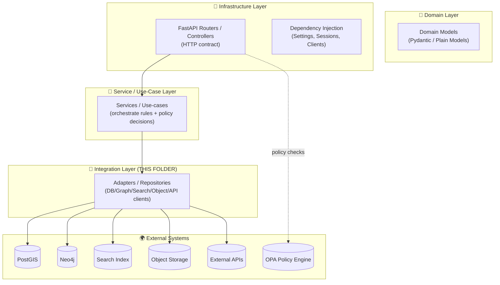
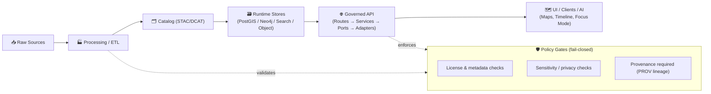
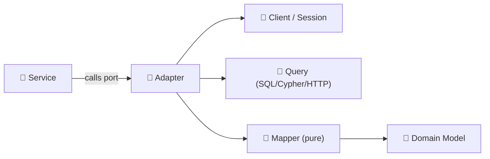

# 🧩 `api/adapters/` — Integration Layer (Ports, Adapters & Anti‑Corruption Boundary)


> [!NOTE]
> **Adapters are the only place we “touch the outside world” from the API codebase**: databases, graphs, search, object storage, external services, and policy engines.  
> Everything above this layer stays **framework-agnostic** and **storage-agnostic**.

> [!IMPORTANT]
> In KFM, adapters are part of the **governed “truth path”**: data and answers flow through controlled boundaries (policy + provenance) and **must not be bypassed**.

---

## 🧭 At a glance

| What | This folder is | This folder is **not** |
|---|---|---|
| Purpose 🎯 | The **I/O boundary** + **translation layer** between domain/services and external systems | A place to “just put DB code somewhere” |
| Design 🧩 | **Anti‑Corruption Layer** (ACL): our language ↔ their language | Business rules / governance decisions |
| Output ✅ | Domain models (or explicit DTOs) + typed errors | Raw DB cursors/rows, driver exceptions |
| Posture 🛡️ | Fail‑closed + auditable + least privilege | “Works on my machine” / bypass paths |

---

<details>
  <summary>📚 Table of contents</summary>

- [🧠 What belongs in `api/adapters/`?](#-what-belongs-in-apiadapters)
- [🧱 Where this sits in the architecture](#-where-this-sits-in-the-architecture)
- [🛤️ KFM “Truth Path” (non-negotiable)](#️-kfm-truth-path-non-negotiable)
- [🧩 Adapter families you’ll typically see](#-adapter-families-youll-typically-see)
- [✅ Golden rules (non-negotiables)](#-golden-rules-non-negotiables)
- [📦 Suggested folder layout](#-suggested-folder-layout)
- [🔌 Ports (interfaces) live above adapters](#-ports-interfaces-live-above-adapters)
- [🧬 Mapping & translation patterns](#-mapping--translation-patterns)
- [🧯 Error handling taxonomy](#-error-handling-taxonomy)
- [🛡️ Governance: policy, provenance, privacy](#️-governance-policy-provenance-privacy)
- [🔭 Observability & reliability](#-observability--reliability)
- [🧪 Testing strategy](#-testing-strategy)
- [➕ Adding a new adapter (checklist)](#-adding-a-new-adapter-checklist)
- [🔍 PR review checklist (quick)](#-pr-review-checklist-quick)
- [🏁 Bottom line](#-bottom-line)

</details>

---

## 🧠 What belongs in `api/adapters/`?

This directory implements the **Integration / Adapter Layer** (aka **Ports & Adapters**, **Hexagonal Architecture**) that bridges:

- ✅ **Service / Use-case layer** (orchestration, policies *as decisions*, domain rules)
- ✅ **Domain models** (Pydantic / plain models)
- ⛔ **External systems** (PostGIS, Neo4j, search indices, STAC/DCAT catalogs, object storage, 3rd-party APIs, OPA)

**Adapters translate “our language” ↔ “their language”**:

- Domain objects ↔ DB rows / graph nodes / search documents
- Domain queries ↔ SQL / Cypher / search DSL / REST calls
- Domain errors ↔ driver/upstream error formats

> [!TIP]
> If you’re unsure where code goes:  
> **If it performs I/O, it’s an adapter.**  
> If it decides *what should happen*, it’s a service.  
> If it defines *what something is*, it’s domain.

---

## 🧱 Where this sits in the architecture



---

## 🛤️ KFM “Truth Path” (non-negotiable)

KFM operates on a canonical pipeline (the “truth path”). **Nothing should bypass it**, especially not UI or controllers calling databases directly.



> [!IMPORTANT]
> **Adapters are part of the truth path enforcement.** They do not *decide* policy, but they must be built so that:
> - authorized scopes can be enforced cleanly (e.g., aggregate vs precise output),
> - provenance metadata can be attached/propagated,
> - unsafe/unknown operations default to **deny / stop / raise** (fail‑closed).

---

## 🧩 Adapter families you’ll typically see

### 🗺️ Databases & stores
- **PostGIS adapters** 🧭: spatial queries, geometry handling, bbox filters, spatial joins, tiles/MVT, index-friendly patterns
- **Neo4j adapters** 🕸️: relationship traversal, context linking, provenance/graph navigation
- **Search adapters** 🔎: keyword search, faceting, autocomplete, ranking, (optionally) vector similarity
- **Object storage adapters** 🧊: COGs/tiles/assets, signed URLs, blob lifecycle

### 🌦️ External services
- Weather feeds, geocoders, enrichment services, notification hooks, etc.

### 🛡️ Policy helpers
- OPA client wrappers (often used in middleware/services; adapters may be policy-aware only via **inputs**, never via “hidden” decisions)

---

## ✅ Golden rules (non-negotiables)

### ✅ DO
- Keep adapters **thin**, **boring**, and **predictable** 🧱
- Use **parameterized queries** (SQL/Cypher) — never string‑concat user input
- Return **domain models** (or explicit DTOs) that services can consume cleanly
- Centralize configuration via a **typed settings module** (env-driven) + DI
- Add **structured logging** and propagate **request/correlation IDs**
- **Fail closed**: if policy/provenance checks cannot be performed, deny/stop
- Prefer **small, composable methods** over “do-everything” mega calls
- Treat **timeouts** as first-class (DB + upstream), and handle **retries** carefully (idempotency)

### ❌ DON’T
- Put business rules in adapters (no scoring logic, no governance decisions, no UI shaping)
- Import FastAPI request/response objects into adapters
- Return raw DB cursors/rows to services
- Bake environment lookups (`os.environ[...]`) into every method (use settings + DI)
- Bypass the canonical pipeline/canonical stores “just to ship faster”
- Log secrets, raw credentials, or sensitive coordinates

> [!WARNING]
> “It’s faster to query PostGIS directly from the route” is how systems die. ☠️  
> Keep boundaries intact so governance stays enforceable.

---

## 📦 Suggested folder layout

```text
api/
  adapters/
    README.md ✅
    __init__.py

    postgis/ 🗺️
      __init__.py
      client.py              # engine/session/pool creation helpers
      parcels_repo.py        # example repository focused on one bounded context
      sql/
        parcels.sql

    neo4j/ 🕸️
      __init__.py
      client.py
      graph_repo.py
      cypher/
        related_events.cypher

    search/ 🔎
      __init__.py
      client.py
      search_repo.py

    object_storage/ 🧊
      __init__.py
      client.py
      assets_repo.py

    external/ 🌦️
      __init__.py
      weather_adapter.py
      geocode_adapter.py

    policy/ 🛡️
      __init__.py
      opa_client.py

    common/ 🧰
      __init__.py
      errors.py              # shared exception types + mapping helpers
      mappers.py             # reusable mapping utilities (pure functions)
      retries.py             # backoff/circuit breaker helpers (if used)
      telemetry.py           # tracing helpers (if used)
```

> [!TIP]
> Keep SQL/Cypher readable. If a query becomes long, move it to `sql/` / `cypher/` and load it as a template.

---

## 🔌 Ports (interfaces) live above adapters

Adapters implement **ports** (interfaces) defined in a more “inner” layer (e.g., `api/services/ports.py`, `api/domain/ports.py`, etc.).

### Example: define a port (protocol)

```python
from typing import Protocol, Iterable, Optional
from api.domain.models import LandParcel
from api.domain.security import AccessScope

class LandParcelRepository(Protocol):
    async def get_by_id(self, parcel_id: str, scope: AccessScope) -> Optional[LandParcel]:
        ...

    async def search_by_bbox(
        self,
        west: float,
        south: float,
        east: float,
        north: float,
        scope: AccessScope,
        limit: int = 100,
    ) -> Iterable[LandParcel]:
        ...
```

> [!IMPORTANT]
> **Policy decisions belong above adapters.**  
> Adapters can accept a `scope` (or query constraints) that already reflect policy decisions (e.g., “public view” returns generalized geometry).

---

## 🧬 Mapping & translation patterns

### 🧩 Recommended pattern: “Client → Query → Mapper → Domain”

**Adapters should have:**
1. **Client/session** (injected)
2. **Query** (SQL/Cypher/REST)
3. **Mapper** (pure function)
4. **Typed error translation**



### Example: implement the port in a PostGIS adapter

```python
from typing import Optional, Iterable
from api.domain.models import LandParcel
from api.domain.security import AccessScope
from api.adapters.common.errors import RepositoryError

class PostGISLandParcelRepository:
    def __init__(self, pool):
        self._pool = pool

    async def get_by_id(self, parcel_id: str, scope: AccessScope) -> Optional[LandParcel]:
        try:
            row = await self._pool.fetchrow(
                """
                SELECT id, owner, geom_geojson_public, geom_geojson_private
                FROM parcels
                WHERE id = $1
                """,
                parcel_id,
            )
            if not row:
                return None

            geom = row["geom_geojson_public"] if scope.is_public else row["geom_geojson_private"]
            return LandParcel(id=row["id"], owner=row["owner"], geom=geom)

        except Exception as e:
            raise RepositoryError("postgis:get_by_id failed") from e
```

> [!TIP]
> Keep scope branching *minimal* and *explicit*. If it grows, push it upward (service decides which method to call, e.g., `get_public_view()` vs `get_private_view()`).

---

## 🧯 Error handling taxonomy

Adapters should translate low-level failures into a small, meaningful exception set for services to handle.

### Recommended exception taxonomy
- `RepositoryError` — store failed / driver failure / malformed query
- `NotFoundError` — optional explicit not-found signal
- `ConflictError` — constraint violations / duplicate keys (optional)
- `UpstreamUnavailable` — external API down / timeout
- `UpstreamBadResponse` — upstream contract changed / invalid payload
- `PolicyDenied` — usually **not** thrown by adapters (prefer policy layer), but may exist for boundary tooling

> [!WARNING]
> Never leak credentials, raw query text, or internal stack traces into API responses.

---

## 🛡️ Governance: policy, provenance, privacy

### 1) Policy enforcement (OPA) 🛡️
- Controllers/services ask OPA: **“Can user X do Y with dataset Z?”**
- Adapters receive already-authorized constraints (`scope`, `masking`, `allowed_columns`, etc.)
- If policy cannot be evaluated → **deny by default** (fail‑closed)

### 2) Provenance propagation (PROV) 🧾
Every dataset and answer must be traceable (“map behind the map”). Practically, that means:
- Do not drop dataset IDs / source references while mapping
- Prefer returning domain models that can carry:
  - `dataset_id`
  - `provenance_ref` / `prov_id`
  - `source_uri` / `asset_ref`
  - `license` (when relevant)

> [!IMPORTANT]
> If an adapter cannot attach required provenance for returned data, it should **error** (or return an explicit “unpublishable” signal), not silently succeed.

### 3) Data sensitivity & Indigenous data governance 🌿
Some data is sensitive (personal records, cultural sites, sacred locations). KFM’s posture is:
- “Open where possible” ✅
- “Protect where required” 🛡️

Implementation notes:
- Prefer **aggregation / generalization** (e.g., county-level summaries) for public scopes
- Avoid releasing precise coordinates for sensitive locations
- Support query auditing and abuse throttles for “needle-in-haystack” filtering
- Ensure Indigenous-contributed data remains under community-defined governance controls (authority to control + responsibility)

> [!NOTE]
> Treat data as more than “neutral numbers.” For community-sensitive datasets, governance is part of correctness.

---

## 🔭 Observability & reliability

### 📌 Minimum observability standards
Adapters should emit:
- `request_id` / `correlation_id`
- `adapter_name`, `operation`
- `external_system` (postgis/neo4j/search/s3/external_api)
- latency + outcome (success/failure category)

### 🧯 Timeouts, retries, circuit breakers
- Always set timeouts on outbound I/O
- Retry only when:
  - failure mode is transient AND
  - operation is idempotent OR uses an idempotency key

> [!TIP]
> If a retry could double-charge, double-write, or double-publish: don’t retry automatically.

---

## 🧪 Testing strategy

### ✅ Unit tests (fast)
- Mock ports and test services in isolation
- Test adapter mappers (row → domain) without needing a DB

### 🧱 Integration tests (real systems)
Run PostGIS / Neo4j / search via Docker Compose and validate:
- migrations / schema
- spatial indexes and query performance basics
- Cypher correctness and relationship traversals
- end-to-end adapter calls
- policy + provenance constraints when applicable

Suggested pattern:
- `tests/unit/...` for service logic
- `tests/integration/...` for adapters
- `pytest` + fixtures (`db_pool`, `neo4j_driver`, `search_client`, `object_store`, etc.)

---

## ➕ Adding a new adapter (checklist)

1. **Define the port** (interface) in the inner layer
2. Create adapter module under `api/adapters/<system>/...`
3. Implement:
   - connection/client wiring (centralized DI)
   - mapper(s): external ↔ domain (pure functions)
   - minimal, well-named methods (avoid “kitchen sink”)
4. Add:
   - unit tests for mapping
   - integration test hitting the real system (if applicable)
5. Wire into service via DI (route →️→ service → port → adapter)
6. Confirm:
   - policy decisions can be applied via explicit inputs
   - provenance can be propagated/attached
   - fail-closed behavior is preserved

---

## 🔍 PR review checklist (quick)

- [ ] No business rules in adapter ✅
- [ ] No raw SQL/Cypher concatenation ✅
- [ ] Domain models returned (or clear DTOs) ✅
- [ ] Errors translated into adapter exceptions ✅
- [ ] Logging is structured + safe ✅
- [ ] Timeouts configured ✅
- [ ] Integration tests added/updated ✅
- [ ] No direct DB calls from routes/controllers ✅
- [ ] Provenance not dropped ✅
- [ ] Sensitive outputs have a policy-controlled path ✅

---

## 📚 Related docs (recommended reading)

- `docs/architecture/system_overview.md` 🧠 (KFM architecture + truth path)
- `docs/governance/` 🛡️ (policy + compliance + sensitivity)
- `docs/provenance/` 🧾 (PROV lineage, “map behind the map”)
- `api/README.md` 📦 (API conventions)
- `src/server/api/README.md` 🌐 (endpoints + contracts, if present)

---

## 🏁 Bottom line

Adapters are the **controlled boundary** between KFM’s governed “truth path” and the outside world 🌎  
Keep them **thin**, **secure**, **auditable**, **testable**, and **boringly reliable** ✅