# 🧩 `api/adapters/` — Ports & Adapters (Integration Layer)


This folder is the **integration boundary** between KFM’s *pure* application logic (domain + services/use-cases) and the outside world (databases, external APIs, file I/O, AI backends, etc.).

> ✅ **Goal:** make external systems feel boring and predictable to the core.  
> 🧠 **Rule:** the service layer depends on *interfaces/ports*; adapters provide the *implementations*.

---

## 🧭 Quick navigation

- **You are here:** `api/adapters/` (infra implementations)
- **Usually nearby:** `api/db/` (db clients/sessions), `api/services/` (use-cases), `api/routes/` (FastAPI endpoints), `policy/` (governance rules)

---

## 🚦 TL;DR (What belongs here)

✅ Put this in `api/adapters/`:

- Database adapters / repositories (PostGIS, Neo4j, search index, etc.)
- External API clients (weather, geocoding, remote services)
- AI backends (Ollama/local LLM, hosted LLM provider wrapper)
- File-system / object-store access (reading/writing governed artifacts)
- “Glue” that maps **domain models ⇄ persistence/API payloads**

🚫 Keep this OUT of `api/adapters/`:

- Business rules, scoring logic, “what should we do?” decisions
- Authorization decisions (those belong to the policy/governance layer)
- FastAPI request/response parsing (that belongs in routers/controllers)
- “Data pipeline” steps that create canonical datasets (those live in pipelines)

---

## 🧠 Mental model: Hexagonal / Clean Architecture

```mermaid
flowchart LR
  subgraph Core["🧠 Core (Framework-Agnostic)"]
    D["📦 Domain Models"]
    U["🧩 Services / Use-Cases"]
    P["🔌 Ports (Interfaces)"]
    D --> U --> P
  end

  subgraph Adapters["🧩 Adapters (This Folder)"]
    A1["🗄️ DB Adapters\n(PostGIS / Neo4j / Search)"]
    A2["🌐 External API Adapters\n(Geocoding / Weather / etc.)"]
    A3["🤖 AI Adapters\n(Ollama / Hosted LLM)"]
  end

  subgraph Outside["🌍 External Systems"]
    X1["PostGIS / Postgres"]
    X2["Neo4j / Graph Store"]
    X3["HTTP APIs"]
    X4["LLM Runtime"]
  end

  P --> A1 --> X1
  P --> A1 --> X2
  P --> A2 --> X3
  P --> A3 --> X4
```



**Inbound adapters** (HTTP routes, message consumers) *call into* the core.  
**Outbound adapters** (DB/API clients) are *called by* the core.

---

## 📦 Suggested folder layout

Your exact tree may differ, but try to keep adapters **discoverable** and **self-contained**:

```text
api/
  adapters/
    README.md

    postgis/                # 🗄️ Spatial DB adapter(s)
      adapter.py
      mappers.py            # domain ⇄ db record mapping
      queries.sql           # (optional) raw SQL / Cypher kept close-by
      __init__.py

    neo4j/                  # 🕸️ Graph adapter(s)
      adapter.py
      cypher/
      __init__.py

    search/                 # 🔎 Full-text / vector / hybrid search
      adapter.py
      __init__.py

    geocoding/              # 📍 External geocoder
      adapter.py
      __init__.py

    weather/                # 🌦️ External weather provider
      adapter.py
      __init__.py

    ai/                     # 🤖 Focus Mode backends
      ollama_adapter.py
      openai_adapter.py
      prompt_templates/
      __init__.py
```

---

## 🔌 Ports first, adapters second

**Preferred workflow for adding integrations:**

1. **Define a port** (interface) in the service/use-case layer  
2. **Write the adapter** here to implement the port  
3. **Wire it up** via dependency injection (FastAPI dependencies / app startup)
4. **Add tests** (mock the port for unit tests; integration test the adapter)

### Example: Port + Adapter (skeleton)

```python
# api/services/ports/geocoding.py
from typing import Protocol

class GeocodingPort(Protocol):
    def forward(self, query: str) -> tuple[float, float]:
        """Return (lon, lat) for a human query."""
```

```python
# api/adapters/geocoding/adapter.py
import httpx

class NominatimGeocodingAdapter:
    def __init__(self, base_url: str, timeout_s: float = 10.0):
        self._client = httpx.Client(base_url=base_url, timeout=timeout_s)

    def forward(self, query: str) -> tuple[float, float]:
        # translate: domain-ish input -> provider payload
        r = self._client.get("/search", params={"q": query, "format": "json", "limit": 1})
        r.raise_for_status()
        data = r.json()
        # translate: provider payload -> domain-ish output
        return (float(data[0]["lon"]), float(data[0]["lat"]))
```

> 🎯 The adapter can be ugly. The core should stay clean.

---

## 🧷 Conventions we enforce in adapters

### 1) 🎛️ Configuration via environment (or config objects)
- Treat credentials as **runtime config**, not code.
- Provide safe defaults for dev, strict validation for prod.

### 2) 🧊 Keep mapping code explicit
- Prefer `mappers.py` / `transforms.py` for clarity
- Avoid leaking DB schemas into domain models

### 3) ⏱️ Timeouts, retries, and backpressure are not optional
- External systems fail. Adapters should fail **predictably**.
- Use:
  - request timeouts
  - limited retries (with jitter/backoff)
  - circuit breaker patterns (where needed)

### 4) 🧾 Provenance-friendly logging
- Log:
  - which adapter was called
  - query identifiers (not raw secrets)
  - timings
  - “source handles” (dataset IDs, story IDs, catalog IDs)

---

## 🤖 AI adapters (Focus Mode) live here

If KFM is configured for “Focus Mode” or other AI workflows, adapters in `api/adapters/ai/` should:

- Accept a **tool-safe** request (no direct DB access from the model)
- Retrieve context via approved services/tools (search, graph queries, catalogs)
- Send prompts to the AI backend (local or hosted)
- Return responses in a **citation-ready** structure (so the UI can link sources)
- Pass output through policy checks / redaction logic (core/policy owns the rules)

**Practical tip:** keep “prompt templates” versioned in-repo (small, reviewable files).

---

## 🧪 Testing strategy

### Unit tests (fast)
- Mock ports and test service logic without touching adapters

### Contract tests (recommended)
- Confirm an adapter respects the port contract
- Example: “geocoder returns (lon,lat) and raises X on no-results”

### Integration tests (slower)
- Use docker-compose services (PostGIS/Neo4j) or provider sandboxes
- Gate these in CI if they’re expensive

---

## 🛠️ Add a new adapter: checklist ✅

- [ ] Create/extend a **port interface** (service layer)
- [ ] Implement adapter in `api/adapters/<thing>/`
- [ ] Centralize config keys (document them)
- [ ] Add unit + contract tests
- [ ] Wire DI (FastAPI dependency/provider)
- [ ] Add minimal docs here (what it does, how to run locally)
- [ ] Confirm policy/governance expectations (no bypass paths)

---

## 📎 “Commands vs Queries” note (API shape)

When designing adapters and ports, it helps to keep a crisp line between:
- **Commands** → change state
- **Queries** → read state

That distinction keeps services testable and adapters simpler.

---

## 📚 Related docs (recommended)

- `docs/architecture/` — system overview & boundaries
- `policy/` — governance rules & AI constraints
- `api/routes/` — inbound adapters (HTTP interface)
- `api/db/` — db sessions/clients (if split out from adapters)

---

## 🧯 Troubleshooting quick hits

- **DB connection weirdness?** Confirm DSNs + container networking.
- **Neo4j queries slow?** Move heavy graph expansions into precomputed views or constrain traversals.
- **AI adapter can’t reach Ollama?** Confirm the runtime URL is reachable from the API container (host networking vs containerized Ollama).
- **Tests flaky?** Ensure adapters enforce timeouts and deterministic retry limits.

---

### ✨ Philosophy

Adapters are where complexity goes to be *contained*.  
If you keep this folder disciplined, the rest of the system stays calm. 🧘
