# 🛡️ Policy Adapter (API ➜ Policy Decision Point)


The **Policy Adapter** is the **single canonical bridge** between the API layer and policy enforcement (e.g., **OPA/Rego**). It converts application context (identity, action, resource, sensitivity, provenance state, etc.) into a normalized **policy input**, executes policy evaluation, and returns a **decision** that the API must obey.

> 🔒 KFM rule: **No direct DB access from UI**; all access flows through governed APIs and policy gates.  [oai_citation:0‡Kansas Frontier Matrix Comprehensive System Documentation.pdf](sediment://file_00000000ef40722faf17987b69730695)

---

## 🎯 Responsibilities

### ✅ What this adapter does
- **Normalize** request context into a stable policy input schema
- **Call the PDP** (Policy Decision Point), typically OPA (`/v1/data/...`) or a local Rego evaluator
- Enforce **deny-by-default** (fail-closed) behavior
- Return structured decisions:
  - `allow: bool`
  - `reasons: []` (human-readable, safe to show depending on sensitivity)
  - `obligations: []` (e.g., “log”, “mask_fields”, “limit_bbox”, “rate_limit”)
  - `constraints: {}` (e.g., row filters, field-level masks, max export size)
  - `decision_id` (trace token for audit/provenance)

### ❌ What this adapter must never do
- Never “best effort” allow on policy errors
- Never bypass the API’s canonical truth-path
- Never leak restricted policy reasoning to public contexts
- Never mutate business data (policy is **advisory + enforcing**, not transforming datasets)

---

## 🧭 Where it sits in the KFM stack

```mermaid
flowchart LR
  UI[🗺️ UI / Clients] --> API[🌐 API Layer]
  API -->|calls| PA[🛡️ Policy Adapter]
  PA -->|evaluate| PDP[(⚖️ PDP: OPA/Rego)]
  API -->|if allowed| Stores[(🗃️ PostGIS / Neo4j / Object Store)]
  API -->|deny| D[⛔ 403 / Policy Denied]
```



---

## 📦 Folder placement & conventions

```text
api/
  adapters/
    policy/               # 🛡️ this adapter
      README.md           # 📄 you are here
      __init__.py
      client.py           # PDP client (OPA HTTP / local evaluator)
      input_schema.py     # canonical policy input builder
      decisions.py        # decision model + normalization
      middleware.py       # optional FastAPI/ASGI middleware hooks
      cache.py            # decision caching (optional, bounded, safe)
      audit.py            # decision journaling hooks
      errors.py           # fail-closed error types
      tests/
```

**Naming rule:** adapter code is **transport-agnostic**. The API calls the adapter; the adapter calls the PDP.

---

## 🧾 Canonical Policy Input (contract)

Policy inputs should be **stable, minimal, explicit, and versioned**.

### Minimum recommended fields
```json
{
  "input_version": "v1",
  "request": {
    "id": "uuid",
    "ts": "iso8601",
    "ip": "string?",
    "user_agent": "string?"
  },
  "subject": {
    "principal_id": "string",
    "roles": ["string"],
    "scopes": ["string"],
    "authn": {"provider": "string", "assurance": "low|med|high"}
  },
  "action": {
    "name": "read|search|export|write|admin",
    "verb": "GET|POST|...",
    "api_route": "/v1/..."
  },
  "resource": {
    "kind": "dataset|layer|story|tile|document|graph|admin",
    "id": "string?",
    "classification": "public|internal|restricted",
    "license": "spdx?",
    "provenance": {"has_prov": true, "prov_ref": "uri?"}
  },
  "context": {
    "geo": {"bbox": [..]?, "geom": "wkt?" },
    "time": {"start": "iso?", "end": "iso?"},
    "client": {"app": "web|cli|service", "version": "string?"}
  }
}
```

### Output decision shape
```json
{
  "allow": false,
  "reasons": ["deny_by_default", "missing_scope:kfm.data.read"],
  "obligations": ["audit_log"],
  "constraints": {
    "mask_fields": ["person.ssn", "person.dob"],
    "max_export_rows": 10000
  },
  "decision_id": "pdp-2026-02-03T...-abc123"
}
```

---

## 🔐 Fail-Closed Behavior (non-negotiable)

If any of the following occur, the adapter returns **DENY**:
- PDP unreachable / timeout
- invalid policy input schema
- invalid PDP response
- unknown policy package / rule
- serialization errors

**Rationale:** KFM is a governance-first system; policy gates are part of the trust boundary.  [oai_citation:1‡Kansas Frontier Matrix Comprehensive System Documentation.pdf](sediment://file_00000000ef40722faf17987b69730695)

---

## ⚙️ Configuration

> Keep secrets out of the repo. Prefer `.env` and CI secrets.

### Environment variables (suggested)
- `KFM_POLICY_MODE` = `opa_http | local_rego | stub_deny`
- `KFM_OPA_URL` = base URL for OPA (e.g., `http://opa:8181`)
- `KFM_OPA_DECISION_PATH` = decision endpoint path (e.g., `/v1/data/kfm/authz/allow`)
- `KFM_POLICY_TIMEOUT_MS` = `200..5000`
- `KFM_POLICY_CACHE_TTL_MS` = `0` (disable) or bounded TTL
- `KFM_POLICY_AUDIT_SINK` = `stdout | file | otel | db`

### Recommended defaults
- Deny by default
- Short timeouts
- Cache **only** if decisions are:
  - scoped to `principal_id + action + resource + constraints hash`
  - bounded in size
  - safe under revocation semantics

---

## 🧩 Integration points

### 1) API route guards
- REST endpoints: call `policy.evaluate(...)` before touching storage
- GraphQL resolvers: call `policy.evaluate(...)` per field or per resolver as appropriate

### 2) Tile and export endpoints
- Tiles: enforce bounding constraints and layer classification
- Exports: enforce row limits, field masking, and license constraints

### 3) AI / Focus Mode (policy-aware retrieval)
- Retrieval should respect:
  - dataset classification
  - licensing
  - provenance availability
  - user scopes/roles
- The adapter can return obligations like `require_citations` or `block_unverifiable_sources`

---

## 🧪 Testing strategy

### Unit tests
- Input builder produces deterministic input for same request
- Fail-closed on:
  - PDP timeout
  - malformed response
  - unknown decision path
- Constraint handling (masking, limits, bbox clamp)

### Contract tests
- Validate that the policy package expects the **same input shape**
- Snapshot test JSON input to prevent accidental schema drift

### Security tests
- Ensure no path returns allow on exceptions
- Ensure “explain” output is never returned to public contexts unless explicitly allowed

---

## 📝 Observability & audit

Every decision should be optionally journaled with:
- `decision_id`
- subject principal + roles (safe subset)
- action/resource identifiers
- allow/deny + reason codes
- hash of input (not full input if sensitive)
- latency + PDP status

> ✅ Goal: “the map behind the map” applies to access too — decisions should be traceable.  [oai_citation:2‡Kansas Frontier Matrix Comprehensive System Documentation.pdf](sediment://file_00000000ef40722faf17987b69730695)

---

## 🧷 Quick links (repo-local)

- `docs/architecture/ai/POLICY_RULES.md` 📜
- `docs/architecture/ai/PROMPT_GATE.md` 🧱
- `docs/architecture/ai/AI_SYSTEM_OVERVIEW.md` 🧠
- `.github/` policy gates / CI enforcement 🧪

---

## 🚧 TODOs (expected next build-out)
- [ ] Define `input_version` upgrade policy (v1 ➜ v2 migration plan)
- [ ] Add typed decision constraints for PostGIS/Neo4j adapters
- [ ] Add optional “decision explanation” redaction layer
- [ ] Wire audit sink to OpenTelemetry / structured logs
- [ ] Add conftest/OPA bundle loading checks in CI

---