# 🔎 Search Adapter (`api/adapters/search/`)


> [!TIP]
> Think of this folder as the **“search port”** for KFM: the API & service layer can ask for search results **without caring** *how* search is implemented (Elasticsearch/OpenSearch/static JSON/etc.). 🧩

---

## 🎯 What this folder is for

This directory contains **outbound adapters** that let the backend query a **Search Index** and normalize results into a consistent internal shape.

✅ **Does**
- Translate a `SearchQuery` → backend-specific request (ES/OpenSearch/JSON index)
- Apply **filters** (type, spatial bbox, time range, tags, visibility)
- Normalize response → `SearchResults` (hits, scores, facets, paging)
- Handle **timeouts / retries / graceful failure**
- Provide a **Mock/InMemory** implementation for unit tests 🧪

🚫 **Does NOT**
- Contain business logic (“what should rank higher for historians?”)  
- Directly read raw data or bypass catalog/provenance rules  
- Implement UI behavior (that lives in `web/`)  

---

## 🧠 Where Search Fits in the KFM stack

```mermaid
flowchart LR
  subgraph Data["📦 Data Lifecycle"]
    raw["raw/"] --> processed["processed/"] --> catalog["catalog/"] --> prov["provenance/"]
  end

  catalog --> search[(🔎 Search Index)]

  subgraph Backend["⚙️ Backend (FastAPI)"]
    routes["routes/search.py"] --> svc["services/search_service.py"]
    svc --> port["adapters/search/*"]
  end

  port --> search
```



**Key idea:** the index is fed from **catalog/provenance-aligned metadata**, and the API uses this adapter to query it. 🔐📚

---

## 📁 Suggested layout (recommended)

> This is a reference layout to keep implementations clean and swappable.  
> Match it to your repo conventions if they differ.

```text
api/
  adapters/
    search/
      README.md
      __init__.py
      ports.py                # protocol / abstract base class (SearchPort)
      models.py               # SearchQuery / SearchHit / SearchResults (Pydantic/dataclasses)
      elasticsearch.py        # Elasticsearch adapter (optional)
      opensearch.py           # OpenSearch adapter (optional)
      json_index.py           # Static JSON index adapter (optional / lightweight)
      memory.py               # In-memory adapter (tests)
      mappers.py              # mapping/normalization helpers
      errors.py               # adapter exceptions + error translation
```

---

## 🔌 Adapter Contract (port)

The service layer should depend on **one** abstraction.

```python
# ports.py (sketch)
from __future__ import annotations

from dataclasses import dataclass
from typing import Literal, Optional, Sequence

DocType = Literal["dataset", "story", "place", "event", "layer", "document"]

@dataclass(frozen=True)
class SearchQuery:
    q: str
    types: Optional[Sequence[DocType]] = None
    tags: Optional[Sequence[str]] = None

    # Spatial filter (WGS84)
    bbox: Optional[tuple[float, float, float, float]] = None  # (minLon, minLat, maxLon, maxLat)

    # Temporal filter
    year_start: Optional[int] = None
    year_end: Optional[int] = None

    # Paging
    page: int = 1
    page_size: int = 20

    # Sorting (keep minimal; backends differ)
    sort: Optional[Literal["relevance", "newest", "oldest"]] = "relevance"


@dataclass(frozen=True)
class SearchHit:
    id: str
    type: DocType
    score: float
    title: str
    snippet: str

    # “Where do I go next?” (API route, dataset id, story slug, etc.)
    uri: str

    # Provenance-first: pointers to catalog/prov docs (IDs/paths/refs)
    citations: tuple[str, ...] = ()
    visibility: Literal["public", "restricted", "private"] = "public"


@dataclass(frozen=True)
class SearchResults:
    query: SearchQuery
    total: int
    hits: tuple[SearchHit, ...]
    took_ms: int
    page: int
    page_size: int


class SearchPort:
    def search(self, query: SearchQuery, *, actor_id: str | None = None) -> SearchResults:
        """Run a search query. `actor_id` enables policy-aware filtering/logging."""
        raise NotImplementedError
```

---

## 🔎 Query semantics (how we expect search to behave)

### ✅ Minimum behavior
- **Case-insensitive** matching on title + body/summary
- A stable **relevance score** (backend specific, normalized to float)
- **Paging**: `page` + `page_size`
- Optional filters:
  - `types`
  - `tags`
  - `bbox`
  - `year_start/year_end`
  - `visibility` (enforced; never optional)

### ⭐ Nice-to-have (future-proofing)
- Facets: `type`, `year buckets`, `tags`, `license`
- Highlighting: snippets with emphasized match spans
- Hybrid ranking:
  - lexical match + embeddings (vector search)
  - boost curated metadata fields (title > summary > body)

> [!NOTE]
> Keep business ranking policy in the **service layer** (or a ranking module), not inside a specific backend adapter. That keeps backends swappable. 🔁

---

## 🧱 Backends (choose one)

### 1) Elasticsearch / OpenSearch 🧲
Use when you need:
- Scalable full-text search
- Facets, analyzers, highlight, fuzzy matching
- Large corpus (catalog + stories + extracted docs)

**Implementation sketch**

```python
# elasticsearch.py (sketch)
from elasticsearch import Elasticsearch

class ElasticsearchSearchAdapter(SearchPort):
    def __init__(self, url: str, index: str, api_key: str | None = None):
        self._es = Elasticsearch(url, api_key=api_key)
        self._index = index

    def search(self, query: SearchQuery, *, actor_id: str | None = None) -> SearchResults:
        # 1) build ES query DSL
        # 2) apply policy filter (visibility / ACL) BEFORE returning hits
        # 3) execute with timeout
        # 4) normalize into SearchResults
        ...
```

### 2) Static JSON Index 📦
Use when you want:
- GitHub Pages / static-host-friendly deployments
- Lightweight local search for docs/story text
- A prebuilt search artifact generated by pipelines

This can be as simple as:
- `data/search/index.json` (documents)
- a small in-process scoring/filtering implementation in `json_index.py`

### 3) In-memory / mock 🧪
Use for:
- Unit tests for services and routes
- Reproducible deterministic hit ordering

---

## ⚙️ Configuration (recommended env vars)

> Put these in `.env` and load via your settings layer.

| Variable | Example | Notes |
|---|---:|---|
| `SEARCH_BACKEND` | `elasticsearch` | `elasticsearch` \| `opensearch` \| `json` \| `memory` |
| `SEARCH_URL` | `http://search:9200` | Search service URL |
| `SEARCH_INDEX` | `kfm-search` | Index name |
| `SEARCH_API_KEY` | `...` | Prefer API key over basic auth |
| `SEARCH_TIMEOUT_S` | `2` | Keep low; fail fast |
| `SEARCH_MAX_PAGE_SIZE` | `50` | Prevent expensive queries |

> [!IMPORTANT]
> Search should **fail closed** on access control: if policy/visibility cannot be checked, do not return results. 🛡️

---

## 🧭 API shape (what routes typically call)

The adapter is usually invoked by a route like:

- `GET /api/v1/search?query=Santa%20Fe%20trail&type=story&page=1&page_size=20`
- `GET /api/v1/search?query=railroad&year_start=1850&year_end=1870`
- `GET /api/v1/search?query=drought&bbox=-102,36.9,-94.6,40.0`

**Curl examples**
```bash
curl "http://localhost:8000/api/v1/search?query=Santa%20Fe%20trail&page=1&page_size=10"
curl "http://localhost:8000/api/v1/search?query=railroad&type=dataset"
```

---

## 🧪 Testing

### Unit tests
- Use `memory.py` adapter to test:
  - filtering behavior
  - paging logic
  - service-layer ranking rules

### Integration tests
- Spin up the chosen backend (e.g., search container)
- Seed a minimal index fixture
- Validate:
  - latency targets
  - mapping compatibility
  - highlight/snippets if enabled

---

## 🧯 Troubleshooting

### “Search returns nothing”
- Confirm the index exists and is populated (did pipelines generate catalog entries?)
- Verify you’re not filtering everything out via visibility rules
- Check analyzers (tokenization) if using ES/OpenSearch

### “Search times out”
- Reduce page size / disallow deep paging
- Add caching at the service layer (popular queries)
- Ensure `SEARCH_TIMEOUT_S` is enforced and results degrade gracefully

### “Results include restricted/private content”
- Treat as a **severity-1 bug** 🚨  
- Fix policy filtering first, then add regression tests.

---

## ✅ Adding a new searchable document type

1. Add the new `DocType`
2. Extend index mapping (backend-specific)
3. Ensure the hit has:
   - a stable `id`
   - a navigable `uri`
   - provenance pointers (`citations`)
   - explicit `visibility`
4. Add unit tests + one integration test

---

## 🗺️ Design north star

**Search exists to help users discover “the map behind the map.”**  
Search results should always help the user *navigate to trustworthy sources* (catalog/provenance), not just show convenient text. 🧭📚