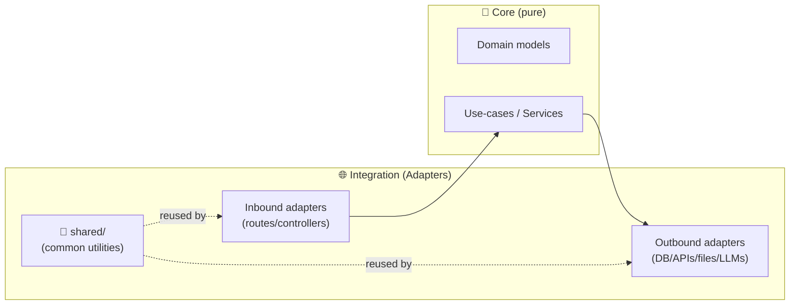

# 🧰 `api/adapters/shared/` — Shared Adapter Toolkit


> 🎯 **Goal:** keep KFM’s core logic *pure* while making integrations *repeatable, testable, and consistent*.

---

## 📍 Where this fits in the architecture

KFM follows a layered approach where the **integration layer (interfaces & adapters)** is the bridge between **services/use-cases** and external systems (DBs, APIs, file I/O). This folder exists to keep that bridge **boring-in-a-good-way**: standardized patterns, shared utilities, and consistent guardrails. ✅



---

## 🧭 What belongs here (and what doesn’t)

| ✅ Put it in `shared/` | ❌ Keep it out of `shared/` |
|---|---|
| HTTP client wrappers (timeouts, retries) | Business rules / “decisions” |
| Common adapter exceptions + error mapping | Domain entities/models |
| Serialization helpers (GeoJSON/JSON/time formats) | FastAPI router code |
| Rate limiting, backoff, pagination utilities | Data pipelines / ETL steps |
| Observability hooks (logging, tracing IDs) | Hard-coded secrets / tokens |
| Small “ports & contracts” helpers (typing/ABCs) | Anything that drags heavy deps everywhere |

> 🧩 Rule of thumb: **If multiple adapters would copy/paste it, and it doesn’t change the meaning of a domain decision, it belongs here.**

---

## 🗂️ Suggested internal layout

This directory can be lightweight at first and grow over time. A typical evolution:

```text
📦 api/
└── 🧩 adapters/
    ├── 🧱 postgis/
    ├── 🕸️ neo4j/
    ├── 🔎 search/
    ├── 🤖 ollama/
    └── 🧰 shared/              👈 you are here
        ├── README.md
        ├── errors.py           # AdapterError, retryable vs non-retryable, HTTP→domain mapping
        ├── http_client.py      # httpx wrapper, timeouts, retries, headers, tracing
        ├── retry.py            # backoff strategies, jitter, circuit-breaker hooks (optional)
        ├── cache.py            # simple TTL cache or adapter-level memoization
        ├── pagination.py       # cursor/page helpers
        ├── config.py           # env parsing patterns, adapter config structs
        └── observability.py    # logging helpers, request-id propagation
```

> 🧪 Keep `shared/` **dependency-light**. It should be safe to import from anywhere in `api/adapters/*` without unexpected side effects.

---

## 🔌 Adapter conventions

### 1) Treat adapters as translators
Adapters translate between:

- **Domain/use-case language** (clean objects, meaningful names)
- **External language** (SQL/Cypher, HTTP payloads, file formats)

> ✅ Put the “translation” *at the edges* so services remain stable even if storage/APIs change.

### 2) Prefer contracts over concrete imports
Use-case/services should depend on **interfaces** (ports), and adapters implement them. That keeps swapping components (e.g., PostGIS ↔ GeoParquet, Neo4j ↔ other graph store) realistic.

### 3) Centralize configuration
Adapters should read connection strings / API URLs from env/config and keep credentials separate from business logic. (No secrets in code. Ever.) 🔐

---

## 🧾 Provenance-first mindset

KFM is designed so **everything can be traced back**—datasets, layers, stories, and even AI-assisted outputs.

That means adapters should make provenance easy, not impossible:

- ✅ Preserve upstream source IDs where available
- ✅ Attach dataset/version identifiers when returning data
- ✅ Log “where did this come from” in a consistent way
- ✅ Avoid lossy transforms without recording what happened

> 🧠 If you’re returning data, ask: “Can we explain and cite this later?”  
> If not, add the metadata now. Future you will thank you.

---

## 🌐 HTTP adapters: minimum bar

When you build an external API adapter (geocoding, weather, Earth Engine proxy, etc.):

- ⏱️ **Timeouts**: always set connect/read timeouts
- 🔁 **Retries**: only retry safe operations (idempotent GET; careful with POST)
- 🚦 **Rate limits**: backoff and respect provider limits
- 🧯 **Error mapping**: turn transport errors into clear adapter errors
- 🧾 **Tracing**: propagate request IDs / correlation IDs

<details>
<summary>✨ Example: a clean call pattern (illustrative)</summary>

```python
# NOTE: this is a style example (names may differ in your codebase).

from api.adapters.shared.http_client import HttpClient
from api.adapters.shared.errors import AdapterError

class ExampleExternalAdapter:
    def __init__(self, http: HttpClient):
        self.http = http

    async def get_thing(self, thing_id: str) -> dict:
        try:
            return await self.http.get_json(f"/things/{thing_id}")
        except AdapterError as e:
            # keep service layer clean: translate errors here
            raise
```
</details>

---

## 🤖 LLM / embeddings adapters (Ollama, etc.)

If you add or maintain an adapter for local models (e.g., Ollama):

- Keep **model selection**, **timeouts**, and **payload shaping** inside the adapter
- Provide a consistent interface (generate, embed, maybe rerank)
- Capture provenance: model name/tag, prompt template ID, and retrieval sources (if any)

---

## ✅ Checklist: adding a new adapter

- [ ] Implements a clear interface used by services/use-cases
- [ ] Keeps domain models out of transport/persistence details
- [ ] Uses `shared/` utilities (HTTP client, errors, retry) instead of re-rolling
- [ ] Reads config from env/config (no secrets committed)
- [ ] Has unit tests with mocks + (optional) integration tests in Docker
- [ ] Logs with correlation ID / request ID where possible
- [ ] Returns/records provenance metadata needed for “map behind the map” workflows

---

## 🧪 Testing guidance

### Unit tests (fast)
- Mock the client boundary (HTTP client / DB session)
- Assert:
  - correct queries/URLs constructed
  - correct error mapping (timeout → retryable error, 404 → not found, etc.)
  - correct translation to domain DTOs

### Integration tests (real)
- Run with Docker services (PostGIS, Neo4j, etc.)
- Verify:
  - adapter can connect with expected env config
  - key queries return valid shapes
  - migrations / indexes exist (if applicable)

---

## 🔎 Developer quick links

- Swagger UI (local): `http://localhost:8000/docs`
- GraphQL (if enabled): `http://localhost:8000/graphql`

---

## 📚 Source docs used (project files)

- Kansas Frontier Matrix (KFM) – Comprehensive Technical Blueprint  [oai_citation:0‡Kansas Frontier Matrix (KFM) – Comprehensive Technical Blueprint.pdf](sediment://file_000000006dbc71f89a5094ce310a452d)  
- Data Spaces  [oai_citation:1‡Data Spaces.pdf](sediment://file_0000000053c071f5a9733b1b09cc9f76)  
- Comprehensive Guide to Ollama and Its Supported Open-Source LLMs  [oai_citation:2‡Comprehensive Guide to Ollama and Its Supported Open-Source LLMs.pdf](file-service://file-WLPhJVNoBxYKcy3utQSwBi)  
- Visualization of Time-Oriented Data  [oai_citation:3‡Visualization of Time-Oriented Data.pdf](sediment://file_000000001468722f929b8752236e5a72)  

<details>
<summary>🧾 Evidence snippets (traceable citations)</summary>

- Integration layer includes repositories/DB clients/API adapters under `api/db/` or `api/adapters/`, e.g., PostGIS + Neo4j adapters.  [oai_citation:4‡Kansas Frontier Matrix (KFM) – Comprehensive Technical Blueprint.pdf](sediment://file_000000006dbc71f89a5094ce310a452d)
- Adapters translate between domain and persistence models, adhere to abstract contracts, and manage config like connection strings.  [oai_citation:5‡Kansas Frontier Matrix (KFM) – Comprehensive Technical Blueprint.pdf](sediment://file_000000006dbc71f89a5094ce310a452d)
- Examples of adapter types + config patterns (PostGIS, Neo4j, search, external API adapters; env-based config).  [oai_citation:6‡Kansas Frontier Matrix (KFM) – Comprehensive Technical Blueprint.pdf](sediment://file_000000006dbc71f89a5094ce310a452d)
- KFM is provenance-first; backend mediates access and governance (UI does not directly touch DB).  [oai_citation:7‡Kansas Frontier Matrix (KFM) – Comprehensive Technical Blueprint.pdf](sediment://file_000000006dbc71f89a5094ce310a452d)
- Hexagonal architecture framing: business logic centered; inbound adapters handle requests; outbound adapters invoke external apps.  [oai_citation:8‡Data Spaces.pdf](sediment://file_0000000053c071f5a9733b1b09cc9f76)
- Local developer exploration endpoints and paths (`/docs`, `/graphql`) referenced in onboarding guidance.  [oai_citation:9‡Kansas Frontier Matrix (KFM) – Comprehensive Technical Blueprint.pdf](sediment://file_000000006dbc71f89a5094ce310a452d)
- Ollama supports embeddings via an `/api/embeddings` endpoint (useful for local semantic search adapters).  [oai_citation:10‡Comprehensive Guide to Ollama and Its Supported Open-Source LLMs.pdf](file-service://file-WLPhJVNoBxYKcy3utQSwBi)

</details>