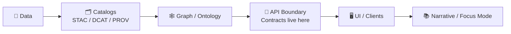

# 📜 API Contracts (KFM) — `api/contracts/`


> **This folder is the API boundary source-of-truth** 🧠  
> We keep **machine-validated contracts** here so the **backend**, **frontend**, and **external consumers** can evolve safely without breaking each other.

---

## 🧭 Quick Links

- [Why this exists](#-why-this-exists)
- [What counts as a “contract”](#-what-counts-as-a-contract)
- [Recommended folder layout](#-recommended-folder-layout)
- [Non‑negotiable rules](#-non-negotiable-rules)
- [Versioning & compatibility](#-versioning--compatibility)
- [Governance & sensitive data](#-governance--sensitive-data)
- [How to change/add contracts](#-how-to-changeadd-contracts)
- [Validation & CI expectations](#-validation--ci-expectations)
- [Contract patterns (KFM-flavored)](#-contract-patterns-kfm-flavored)
- [📚 Project reference library](#-project-reference-library)

---

## 🌾 Why this exists

KFM is designed as a **standards-based**, **platform-style** system: the UI and integrations talk to a backend that exposes **REST + GraphQL** with clear documentation (OpenAPI/Swagger + GraphQL schema).  
This directory makes those contracts **first-class artifacts** — versioned, reviewed, and testable — so “data → API → UI” is predictable and governed.

### The canonical pipeline boundary (mental model)



---

## 🧩 What counts as a contract?

A **contract artifact** is anything machine-validated that defines an interface. In KFM, contracts usually include:

- **OpenAPI** for REST endpoints (`.yaml` / `.json`)
- **GraphQL SDL** for graph/query operations (`.graphql`)
- **JSON Schemas** for shared objects:
  - request bodies
  - response envelopes
  - error shapes
  - telemetry/audit events
  - security/sensitivity annotations
- **Examples/fixtures** used by documentation and contract tests

> 💡 If a client depends on it, it belongs here.

---

## 🗂️ Recommended folder layout

> ✅ Keep it boring, predictable, and diff-friendly.

```text
api/contracts/
├─ 📄 README.md                      # 📘 How contracts are organized, versioned, and validated (single source of truth)
├─ 📘 openapi/                       # 📘 REST contracts (canonical OpenAPI documents)
│  ├─ 📘🧾 kfm.openapi.v1.yaml        # OpenAPI v1 spec (endpoints, auth, schemas, errors, examples refs)
│  ┗─ 🧩 overlays/                   # Optional reusable patches/extensions (shared parameters, vendor extensions)
├─ 🧬 graphql/                       # 🧬 GraphQL contracts (schema + optional operation examples)
│  ├─ 🧬📄 schema.v1.graphql          # GraphQL schema v1 (SDL; types, queries, mutations, directives)
│  └─ 🧾 operations/                 # Optional persisted queries / example operations (docs/tests)
├─ 🧱 jsonschema/                    # 🧱 Shared object schemas (language-agnostic; used by REST/Events/GraphQL tooling)
│  ├─ 🧰 common/                     # Shared primitives ($defs, ids, time, geo, links)
│  ├─ 🧠 entities/                   # Domain entities (datasets, layers, story nodes, graph refs)
│  ├─ 🚨 errors/                     # Standard error envelopes (ProblemDetails, validation errors, policy denials)
│  ├─ 📑 pagination/                 # Paging/cursors/sorts (request + response shapes)
│  ├─ 🧬 provenance/                 # STAC/DCAT/PROV refs + evidence manifest refs + lineage shapes
│  ├─ 📈 telemetry/                  # Event/metrics schemas (audit-safe signals, SLO summaries)
│  └─ 🔐 security/                   # AuthN/AuthZ-related schemas (principals, roles, policy decisions, redaction notices)
├─ 🧾 examples/                      # 🧾 Example payloads (docs + tests; should validate against schemas)
│  ├─ 🌐 rest/                       # REST request/response examples (by endpoint)
│  ├─ 🧬 graphql/                    # GraphQL operation examples + response shapes
│  └─ 🔔 events/                     # Event payload examples (ingest, telemetry, audit, etc.)
├─ 🧪 tests/                         # 🧪 Contract tests + schema validation harness (CI gates)
│  ├─ 🧪 contract/                   # Validators (openapi lint, graphql schema checks, jsonschema compilation)
│  └─ 🧩 fixtures/                   # Golden fixtures (pass/fail cases; edge-case coverage)
├─ 🗞️ CHANGELOG.md                   # 🗞️ Contract-level changes (SemVer notes; breaking vs additive vs fixes)
└─ 🔖 VERSION                        # 🔖 Current contract pack version (SemVer; used by tooling and policy gates)
```

> If you are on the v13+ layout, this folder is conceptually equivalent to `src/server/contracts/`.  
> In this repo layout, we keep it under `api/` to match the backend’s canonical home.

---

## 🧷 Non-negotiable rules

### 1) Contract-first & evidence-first ✅
- Contracts are not “nice docs” — they are **the interface**.
- Public behavior must be explainable and testable from these files.

### 2) Provenance-friendly by default 🧾
If an API response is used in UI or narrative:
- it must be **traceable back to cataloged assets/lineage** (STAC/DCAT/PROV)
- it must **not introduce “free-floating claims”** that can’t be tied back to evidence

### 3) Backwards compatibility unless versioned 🔁
- If you break a contract, you **bump the version** and provide a **migration path**.
- “Silent breaking changes” are forbidden.

### 4) No data leakage 🚫🕵️
- Sensitive or sovereignty-restricted layers must remain protected:
  - redaction/generalization must be respected **in data**, **metadata**, **API**, and **UI**
  - contracts should reflect this (e.g., “generalized coordinates”, “redacted fields”, “restricted access”)

### 5) Auditable interactions 🧾🔍
- When redaction/suppression occurs (especially in Focus Mode), contracts should support emitting audit events (telemetry schemas live here).

---

## 🧬 Versioning & compatibility

We use **SemVer** for the contract pack.

### REST (OpenAPI)
- **Non-breaking** examples:
  - adding a new optional field
  - adding a new endpoint
  - adding a new enum value *only if contract says enum is extensible*
- **Breaking** examples:
  - removing/renaming fields
  - changing required/optional status
  - narrowing accepted formats
  - changing response shape

✅ Preferred approach for breaking REST changes:
- introduce a new versioned path (`/v2/...`) or equivalent negotiation strategy
- keep `/v1/...` stable until sunset

### GraphQL
GraphQL prefers **additive evolution**:
- **Non-breaking**:
  - add new types/fields
  - add new queries with clear pagination
- **Breaking**:
  - remove fields/types
  - change field types in incompatible ways

✅ Preferred GraphQL breaking approach:
- deprecate first (with reason + replacement)
- only remove in a major contract bump

---

## ⚖ Governance & sensitive data

Some contract changes are **bigger than “just code”** and should trigger governance review:

- new public endpoints that expose downloading/exporting of datasets
- anything that increases inference risk (even indirect exposure)
- new AI-driven narrative behaviors or “factual sounding” summaries
- additions that touch culturally sensitive / sovereignty-restricted data

### Practical contract-level affordances 🧰
If an endpoint can return sensitive material, the contract should include:
- a **classification** field (e.g., `public | restricted | redacted`)
- a **redaction note** or **generalization level**
- an optional **access policy hint** (don’t leak real policy logic; just expose enough for transparency)
- ability to emit/record a telemetry signal when redaction is shown

---

## 🧱 How to change/add contracts

> Use the repo’s API contract extension template when available:
> `../../docs/templates/TEMPLATE__API_CONTRACT_EXTENSION.md`

### ✅ Checklist (Definition of Done)
- [ ] Contract updated (OpenAPI / GraphQL / JSON Schemas)
- [ ] Examples added/updated (at least one happy path + one error path)
- [ ] Contract tests updated/added
- [ ] Version bumped if breaking
- [ ] `CHANGELOG.md` updated
- [ ] Governance review noted if triggered (sensitive data / new public export / AI narrative)

### Workflow (suggested)
1. **Start with the contract** (don’t start in code).
2. Add/update **examples**.
3. Update the implementation to match.
4. Add/adjust **contract tests**.
5. Run validators locally and in CI.

---

## 🧪 Validation & CI expectations

A contract PR should fail fast if it breaks the world.

### Minimum gates (suggested)
- OpenAPI lint + validation (spec correctness)
- GraphQL schema validation (SDL correctness)
- JSON Schema validation + sample payload validation
- Contract tests for key endpoints (known inputs/outputs)
- Geospatial sanity checks for GeoJSON-like responses (valid geometry; expected CRS conventions)

> 💡 Data pipelines already treat schema + validity as testable “first-class quality checks”.  
> API contracts should follow the same discipline.

---

## 🧰 Contract patterns (KFM-flavored)

### 1) Standard response envelope (recommended)
Make clients happy: predictable shape, consistent metadata, consistent provenance.

```json
{
  "data": { "items": [] },
  "provenance": {
    "stac_item": "stac://.../item.json",
    "dcat_dataset": "dcat://.../dataset.json",
    "prov_trace": "prov://.../trace.json"
  },
  "warnings": [],
  "meta": {
    "request_id": "uuid",
    "generated_at": "2026-01-12T00:00:00Z"
  }
}
```

### 2) Error shape (recommended)
Use a consistent error model (prefer RFC7807-style “problem details” + KFM extensions):

```json
{
  "type": "https://kfm.example/errors/validation",
  "title": "Validation failed",
  "status": 422,
  "detail": "One or more fields are invalid.",
  "instance": "/v1/layers/abc",
  "errors": [
    { "path": "/bbox", "message": "bbox must be 4 numbers" }
  ],
  "request_id": "uuid"
}
```

### 3) Geo outputs
Common patterns:
- GeoJSON `FeatureCollection`
- vector tiles / tilejson
- STAC Items/Collections for asset discovery

If an endpoint returns geometry, the contract should define:
- geometry type expectations
- CRS expectations (and how CRS is communicated)
- limits (max features, paging, bbox filtering)

### 4) Async jobs (simulations, heavy analytics)
When work can’t finish within a request, define job contracts:

```json
{
  "job_id": "uuid",
  "status": "queued",
  "progress": { "pct": 0 },
  "links": {
    "self": "/v1/jobs/uuid",
    "result": null
  }
}
```

### 5) Telemetry / audit events
Keep event schemas explicit so analytics and governance can trust them.

Example event names you might contract:
- `focus_mode_redaction_notice_shown`
- `dataset_export_requested`
- `restricted_layer_access_denied`

---

## 📚 Project reference library

These project files inform our contract conventions (reproducibility, statistics rigor, geospatial norms, governance, security, scalability, UI integration).  
To keep this README readable, the full list is collapsed:

<details>
<summary><strong>📘 Expand: All referenced project docs/books</strong> (design inputs for contracts)</summary>

### Core KFM design + roadmap
- `Kansas Frontier Matrix (KFM) – Comprehensive Technical Documentation.docx`
- `🌟 Kansas Frontier Matrix – Latest Ideas & Future Proposals.docx`
- `MARKDOWN_GUIDE_v13.md.gdoc` (Master Guide v13 draft)

### Data governance, sovereignty, and data spaces
- `Data Spaces.pdf`
- `Introduction to Digital Humanism.pdf`
- `On the path to AI Law’s prophecies and the conceptual foundations of the machine learning age.pdf`
- `Principles of Biological Autonomy - book_9780262381833.pdf`

### Geospatial + mapping + cartography + remote sensing
- `python-geospatial-analysis-cookbook.pdf`
- `making-maps-a-visual-guide-to-map-design-for-gis.pdf`
- `Mobile Mapping_ Space, Cartography and the Digital - 9789048535217.pdf`
- `Cloud-Based Remote Sensing with Google Earth Engine-Fundamentals and Applications.pdf`

### Modeling, simulation, statistics, and ML
- `Scientific Modeling and Simulation_ A Comprehensive NASA-Grade Guide.pdf`
- `Understanding Statistics & Experimental Design.pdf`
- `regression-analysis-with-python.pdf`
- `Regression analysis using Python - slides-linear-regression.pdf`
- `graphical-data-analysis-with-r.pdf`
- `think-bayes-bayesian-statistics-in-python.pdf`
- `Deep Learning for Coders with fastai and PyTorch - Deep.Learning.for.Coders.with.fastai.and.PyTorchpdf`

### Graphs + optimization + scalable systems
- `Spectral Geometry of Graphs.pdf`
- `Generalized Topology Optimization for Structural Design.pdf`
- `Scalable Data Management for Future Hardware.pdf`

### Backend, DB, web UI, realtime, and security references
- `PostgreSQL Notes for Professionals - PostgreSQLNotesForProfessionals.pdf`
- `concurrent-real-time-and-distributed-programming-in-java-threads-rtsj-and-rmi.pdf`
- `responsive-web-design-with-html5-and-css3.pdf`
- `webgl-programming-guide-interactive-3d-graphics-programming-with-webgl.pdf`
- `compressed-image-file-formats-jpeg-png-gif-xbm-bmp.pdf`
- `ethical-hacking-and-countermeasures-secure-network-infrastructures.pdf`
- `Gray Hat Python - Python Programming for Hackers and Reverse Engineers (2009).pdf`

### “Programming Books” compendiums (broad implementation references)
- `A programming Books.pdf`
- `B-C programming Books.pdf`
- `D-E programming Books.pdf`
- `F-H programming Books.pdf`
- `I-L programming Books.pdf`
- `M-N programming Books.pdf`
- `O-R programming Books.pdf`
- `S-T programming Books.pdf`
- `U-X programming Books.pdf`

</details>

---

## 🧾 Related repo paths (common)
- `../../schemas/` — cross-platform schemas (STAC/DCAT/PROV, if present)
- `../../docs/governance/` — governance, ethics, sovereignty
- `../../docs/templates/TEMPLATE__API_CONTRACT_EXTENSION.md` — how to extend contracts cleanly
- `../` — backend code (FastAPI + GraphQL) that must implement these contracts

---

### ✅ Bottom line

If it crosses the API boundary, it’s a **contract**.  
If it’s a contract, it must be **versioned**, **validated**, and **tested**. 🌾
