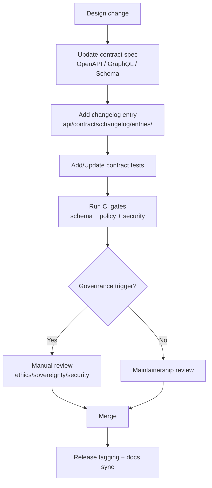

# 📜 KFM API Contract Changelog


> 📍 **Location:** `api/contracts/changelog/README.md`  
> 🧭 **Purpose:** One canonical place to track *every* API contract change (REST/OpenAPI + GraphQL + shared schemas) — with versioning, governance, and migration notes.

---

## ✨ What this folder is

This folder is the **API contract change ledger** for Kansas Frontier Matrix (KFM). It exists to make sure:

- **No API breaks “silently.”**
- Every contract change is **versioned**, **reviewable**, and **test-backed**.
- The API stays aligned with KFM’s **contract-first** and **evidence-first** constraints.

> 🧠 **Rule of thumb:** If the UI, a script, or an external integrator could notice it, it belongs in this changelog.

---

## 🧭 Quick links

- [What counts as a contract change](#-what-counts-as-a-contract-change)
- [Versioning policy](#-versioning-policy-semver)
- [Changelog entry format](#-changelog-entry-format)
- [Contract-change workflow](#-contract-change-workflow)
- [Governance & safety gates](#-governance--safety-gates)
- [Redaction & classification](#-redaction--classification)
- [Templates](#-templates)
- [Project file library](#-project-file-library)

---

## 📁 Suggested layout

> If your repo already has a different structure, keep **intent** the same and adapt paths.

```text
api/
└─ 📜 contracts/
   ├─ 📘 openapi/                     # REST contracts (OpenAPI specs; canonical for HTTP endpoints)
   ├─ 🧬 graphql/                     # GraphQL schema(s) + optional operation examples (if schema-first)
   ├─ 📐 jsonschema/                  # Shared request/response object schemas (language-agnostic; used across surfaces)
   └─ 🗞️ changelog/
      ├─ 📄 README.md                 # (this file) 📌 How contract changes are recorded + SemVer guidance + release workflow
      └─ 🗞️ entries/                 # One file per meaningful contract change (human-readable, reviewable)
         └─ 🗞️📄 YYYY-MM-DD__api-vX.Y.Z__short-title.md  # Entry: what changed, why, migration notes, examples/tests
```

---

## 🧱 Contract surfaces (what we version)

### 🌐 REST (OpenAPI)
- Contract is the **OpenAPI spec** (the “source of truth” for REST).
- This is what client SDKs can be generated from.
- Includes: paths, params, headers, auth, status codes, error shapes, pagination/filter semantics.

### 🕸️ GraphQL (SDL / schema)
- Contract is the **GraphQL schema** (+ directives and schema-level conventions).
- Includes: type fields, nullability, enums, input types, resolver semantics, pagination rules.

### 🧩 Shared schemas (optional but encouraged)
- JSON Schemas for request/response bodies that are reused across surfaces.
- “Schema drift” is contract drift — track it here.

---

## 🧾 What counts as a contract change

Track it here when you change **any** of the following:

### ✅ Always a contract change
- Add/remove/rename endpoint or GraphQL field/type
- Change parameter name/type/default/required-ness
- Change response shape (including nesting)
- Change error format or status code behavior
- Change paging/sorting/filtering semantics
- Change auth rules / scopes / access policy
- Change redaction behavior that affects payloads
- Change coordinate reference system (CRS), units, or precision expectations
- Change performance guarantees or rate limits (if documented as part of the contract)

### ⚠️ Usually a contract change (if observable)
- Different null handling
- Different ordering (if clients rely on it)
- Different rounding/precision for numeric fields
- Different output media types (GeoJSON vs tiles, etc.)
- Deprecations (even if still supported)

---

## 🏷️ Versioning policy (SemVer)

We use **Semantic Versioning** for API contracts:

- **MAJOR** (X.0.0) — breaking changes
- **MINOR** (0.X.0) — backward-compatible additions
- **PATCH** (0.0.X) — backward-compatible fixes/clarifications

### 🚨 Breaking changes (MAJOR)
Examples:
- Remove an endpoint/field
- Rename anything public
- Tighten validation (e.g., field becomes required)
- Change meaning of a field
- Change auth from public → restricted
- Change data format in ways clients must rewrite

✅ If it breaks existing clients without changes, it’s **MAJOR**.

### ➕ Backward-compatible changes (MINOR)
Examples:
- Add a new endpoint
- Add new optional fields
- Add new enum values **only if clients can handle unknowns**
- Add new filter options without changing defaults

### 🩹 Patch changes (PATCH)
Examples:
- Fix typos in schema descriptions
- Clarify docs without changing behavior
- Fix an edge-case bug while preserving the declared contract

---

## 🧾 Changelog entry format

Each meaningful contract change gets **one entry file**.

### 📛 File naming
```text
YYYY-MM-DD__api-vX.Y.Z__short-title.md
```

Example:
```text
2026-01-12__api-v1.4.0__layers-tiles-endpoint.md
```

### 🧱 Required sections
Each entry must include:

1. **Summary**
2. **Surface** (REST / GraphQL / Shared schema)
3. **Version impact** (MAJOR/MINOR/PATCH)
4. **Change type** (Added/Changed/Deprecated/Removed/Fixed/Security)
5. **Migration notes**
6. **Validation / tests**
7. **Governance notes** (especially if public-facing, sensitive, or classification-related)

---

## 🔁 Contract-change workflow



---

## ✅ PR checklist (copy/paste into PR description)

- [ ] Contract spec updated (OpenAPI / GraphQL / shared schemas)
- [ ] Changelog entry added under `api/contracts/changelog/entries/`
- [ ] Contract tests added/updated (known input → expected output)
- [ ] Backward compatibility assessed (SemVer bump justified)
- [ ] Deprecation plan documented (if relevant)
- [ ] Redaction/classification behavior documented (if relevant)
- [ ] CI validations pass (schema + policy + security + link checks)
- [ ] Client impact considered (UI + scripts + integrations)

---

## ⚖ Governance & safety gates

Some API changes require **extra scrutiny** beyond normal review. Expect manual governance review when the change:

- Introduces a **new public-facing endpoint**
- Expands access to data that could be sensitive (even indirectly)
- Changes **classification** or redaction behavior
- Enables downloading/exporting data at higher fidelity than before
- Adds AI-generated or interpretive narrative-like output (must remain evidence-linked)

> 🔒 If in doubt: treat it as governance-triggering and document it in the entry.

---

## 🛡️ Redaction & classification

### 🎚️ Classification (recommended)
Every endpoint (and key field groups) should declare a classification tier, e.g.:

| Tier | Meaning | Typical Access |
|---|---|---|
| Public 🌎 | Safe for open web | Unauthenticated |
| Internal 🏢 | Safe for contributors/ops | Authenticated |
| Confidential 🔐 | Sensitive / limited distribution | Authorized roles |
| Restricted 🧷 | High sensitivity / sovereignty constraints | Explicit approval |

### 🧼 Redaction principles
If a dataset requires redaction/generalization, it should be enforced **end-to-end**:

- processed data
- metadata (STAC/DCAT/PROV flags)
- **API enforcement**
- UI enforcement

> ✅ The API is the enforcement boundary — clients must *not* be responsible for “doing the right thing” with sensitive payloads.

---

## 🌐 Interop expectations

KFM’s APIs should remain friendly to:
- standard geospatial formats (GeoJSON, COG, tiles)
- SDK generation via OpenAPI
- external GIS tooling (potential OGC-compatible surfaces)

If an API change improves interop (new standard endpoint), it’s still a contract change → log it.

---

## 🧪 Validation & contract tests

A contract change is not “done” until:

- schema validation passes (OpenAPI/GraphQL/JSON Schema)
- contract tests cover known inputs/outputs
- policy checks pass (security + governance)

🧩 Extra credit (recommended):
- snapshot testing for example responses
- “golden files” for response fixtures
- compatibility checks vs previous OpenAPI spec

---

## 🧩 Templates

### 🧾 Entry template (starter)

```markdown
---
date: YYYY-MM-DD
api_version: vX.Y.Z
surface: REST | GraphQL | Schema
semver_impact: MAJOR | MINOR | PATCH
change_types:
  - Added
  - Changed
  - Deprecated
  - Removed
  - Fixed
  - Security
links:
  pr: #123
  issue: #456
  spec_path: api/contracts/openapi/...
  tests_path: tests/...
governance:
  trigger: true|false
  notes: ""
---

# Summary
One paragraph on what changed and why.

## What changed (contract)
- Bullet list of concrete changes.

## Backward compatibility
- Explain why this is MAJOR/MINOR/PATCH.

## Migration notes
- What client authors must do.

## Validation & tests
- What was added/updated to prevent regressions.

## Governance notes
- Classification/redaction/safety considerations.
```

---

## 📚 Project file library

This changelog process is designed to stay compatible with the project’s **full reference library** (architecture, governance, geospatial standards, modeling/science rigor, security, and UI delivery).

<details>
<summary><strong>📦 Core KFM docs (architecture + roadmap)</strong></summary>

- `Kansas Frontier Matrix (KFM) – Comprehensive Technical Documentation.docx`
- `🌟 Kansas Frontier Matrix – Latest Ideas & Future Proposals.docx`
- `MARKDOWN_GUIDE_v13.md.gdoc` (Master Guide / governance + repo structure)
- `Comprehensive Markdown Guide_ Syntax, Extensions, and Best Practices.docx`

</details>

<details>
<summary><strong>🗺️ Geospatial + mapping + visualization</strong></summary>

- `python-geospatial-analysis-cookbook.pdf`
- `KFM- python-geospatial-analysis-cookbook-over-60-recipes-to-work-with-topology-overlays-indoor-routing-and-web-application-analysis-with-python.pdf`
- `making-maps-a-visual-guide-to-map-design-for-gis.pdf`
- `Mobile Mapping_ Space, Cartography and the Digital - 9789048535217.pdf`
- `webgl-programming-guide-interactive-3d-graphics-programming-with-webgl.pdf`
- `responsive-web-design-with-html5-and-css3.pdf`

</details>

<details>
<summary><strong>📈 Statistics + modeling + evidence rigor</strong></summary>

- `Scientific Modeling and Simulation_ A Comprehensive NASA-Grade Guide.pdf`
- `Understanding Statistics & Experimental Design.pdf`
- `regression-analysis-with-python.pdf`
- `Regression analysis using Python - slides-linear-regression.pdf`
- `graphical-data-analysis-with-r.pdf`
- `think-bayes-bayesian-statistics-in-python.pdf`

</details>

<details>
<summary><strong>🧠 Data systems + scale + graphs</strong></summary>

- `Scalable Data Management for Future Hardware.pdf`
- `Spectral Geometry of Graphs.pdf`
- `Data Spaces.pdf`
- `PostgreSQL Notes for Professionals - PostgreSQLNotesForProfessionals.pdf`

</details>

<details>
<summary><strong>⚖️ Governance + ethics + society</strong></summary>

- `Introduction to Digital Humanism.pdf`
- `Principles of Biological Autonomy - book_9780262381833.pdf`
- `On the path to AI Law’s prophecies and the conceptual foundations of the machine learning age.pdf`

</details>

<details>
<summary><strong>🔐 Security + secure engineering references</strong></summary>

- `ethical-hacking-and-countermeasures-secure-network-infrastructures.pdf`
- `Gray Hat Python - Python Programming for Hackers and Reverse Engineers (2009).pdf`
- `S-T programming Books.pdf` (contains security topics; use responsibly)

</details>

<details>
<summary><strong>🧰 Programming library bundles</strong></summary>

- `A programming Books.pdf`
- `B-C programming Books.pdf`
- `D-E programming Books.pdf`
- `F-H programming Books.pdf`
- `I-L programming Books.pdf`
- `M-N programming Books.pdf`
- `O-R programming Books.pdf`
- `S-T programming Books.pdf`
- `U-X programming Books.pdf`

</details>

---

## ✅ Definition of done (for contract changes)

A contract change is “done” when:

- [ ] Contract spec updated
- [ ] Changelog entry written (this folder)
- [ ] Tests prove behavior
- [ ] Governance considerations documented
- [ ] Migration notes included (if any client impact)
- [ ] CI gates pass cleanly
- [ ] No undocumented breaking changes

---

🧭 **Reminder:** KFM’s goal isn’t just functional APIs — it’s *trustworthy, governed, provenance-linked* access to data. This changelog is how we keep the contract honest. 🌾

