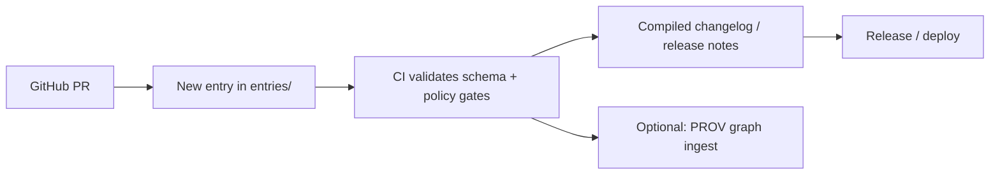

# 📜 API Contract Changelog Entries 🧩


> **Purpose 🎯**: This folder holds **atomic** changelog entries for **API contract** changes (REST/OpenAPI, GraphQL, and shared schemas).
>  
> **Rule of thumb ✅**: If a client might have to update code—or would *benefit* from knowing what changed—add an entry here.

---

## 📁 Where you are (folder map)
```text
📦 api/
└─ 📁 contracts/
   └─ 📁 changelog/
      ├─ 📁 entries/                 👈 atomic entries (this folder)
      │  ├─ 📄 README.md             👈 you are here
      │  ├─ 📄 2026-01-24__added__tiles__landcover-mvt.md
      │  ├─ 📄 2026-01-24__changed__graphql__person-type.md
      │  └─ 📄 2026-01-24__security__auth__scope-tightening.md
      └─ 📄 CHANGELOG.md             🛠️ generated/compiled (do not hand-edit)
```

---

## 🧭 KFM design intent (why this exists)
KFM’s API is not “just endpoints.” It’s a **governed boundary** that powers:

- 🗺️ **Map + timeline clients** (2D/3D, tiles, temporal layers)
- 🕸️ **Knowledge-graph and relationship queries**
- 🤖 **Focus Mode** (AI answers **must** remain *auditable and citable*)
- ⚖️ **Policy-as-code enforcement** (FAIR/CARE, licensing, sensitive data, fail-closed gates)

A contract changelog keeps **clients stable**, **reviewers informed**, and **provenance intact**.

---

## ✅ When you MUST add a changelog entry
Add an entry if you change any of these:

### 🌐 REST / OpenAPI surface
- New/removed endpoint
- New/removed query param, header, cookie, path param
- Request/response schema changes (including defaults and validation rules)
- Response status codes, error shapes, pagination format
- Auth requirements / scopes / rate limits / CORS behavior

### 🧬 GraphQL surface
- New/removed types, fields, inputs, enums
- Field nullability changes
- Resolver behavior changes that alter contract expectations (e.g., ordering, pagination, authorization rules)

### 🗺️ Geospatial & tiling interfaces
- Tile endpoints (`.pbf`, TileJSON), layer catalog shapes, bbox/CRS changes
- Vector tile attribute renames, geometry simplification rules, zoom behaviors
- 3D assets streaming formats (e.g., 3D Tiles, CZML) if exposed by the API

### 🤖 Focus Mode / provenance / citations
- Any change to **citation payloads**, provenance references, or “audit panel” outputs
- Any change that could reduce traceability (these are often **breaking**)

### ⚖️ Governance & policy
- Policy pack behavior that changes what data can be served
- Sensitive-data classification output / redaction behaviors
- “Fail-closed” gating behavior that changes acceptance/serving rules

---

## 🏷️ Entry file naming convention
**Format**
```text
YYYY-MM-DD__<type>__<scope>__<slug>.md
```

**Examples**
- `2026-01-24__added__tiles__landcover-mvt.md`
- `2026-01-24__changed__openapi__dataset-metadata-shape.md`
- `2026-01-24__deprecated__graphql__event-search-arg.md`
- `2026-01-24__security__auth__scope-tightening.md`

**Rules**
- 📌 One *logical* change per file (atomic entries make releases easier).
- 🧠 If a PR touches multiple scopes, use multiple entries (prefer 2–5 small entries over 1 mega-entry).
- 🔁 Filenames are sorted lexicographically—date first keeps it tidy.

---

## ✍️ Entry format
Each entry is **Markdown** with a **YAML front matter** block for machine parsing.

### ✅ Minimal template (copy/paste)
```yaml
---
id: CHG-2026-01-24-<short-slug>
date: 2026-01-24
type: added            # added | changed | deprecated | removed | fixed | security | docs
scope: tiles           # see "Scopes" below
breaking: false

api:
  surface: rest        # rest | graphql | both | none
  endpoints: []        # optional (REST)
  graphql: {}          # optional (GraphQL)

semver: minor          # patch | minor | major (required even if "none" for internal-only)

summary: "One-line summary that a client can understand."
motivation: "Why we did this (context + intent)."

migration:
  required: false
  steps: []

deprecation:
  sunset: null         # YYYY-MM-DD (required if type=deprecated)
  replaces: []         # ids of prior entries (optional)

governance:
  policy_rules_touched: []    # OPA/Rego rule IDs or short names
  sensitive_data_impact: none # none | reduced | increased | changed

provenance:
  pr: null             # PR number/url (if available)
  prov_activity: null  # optional: PROV-O activity id (e.g., "pr/123")
  artifacts: []        # optional: OpenAPI/Schema artifact paths, OCI refs, etc.

references:
  - kind: pr
    value: "<PR_URL_OR_NUMBER>"
  - kind: issue
    value: "<ISSUE_URL_OR_NUMBER>"
---
```

Then write a short Markdown body:

```md
## Details
What changed, in plain language.

## Compatibility
What is affected? Any edge cases? Anything clients must test?

## Notes
Any follow-ups or known limitations.
```

---

## 🧱 Field reference (what each key means)
| Key | Required | Type | Meaning |
|---|---:|---|---|
| `id` | ✅ | string | Unique changelog id (stable reference) |
| `date` | ✅ | YYYY-MM-DD | Entry date (not release date) |
| `type` | ✅ | enum | Changelog category (Keep-a-Changelog style) |
| `scope` | ✅ | string | Primary area affected (see list below) |
| `breaking` | ✅ | bool | Client-breaking? (See rules below) |
| `api.surface` | ✅ | enum | `rest`, `graphql`, `both`, `none` |
| `api.endpoints` | ➖ | list | REST endpoint(s) touched |
| `api.graphql` | ➖ | object | GraphQL schema touchpoints |
| `semver` | ✅ | enum | Expected version impact (`patch/minor/major`) |
| `summary` | ✅ | string | One sentence a client can scan |
| `motivation` | ✅ | string | Why the change exists (human + audit) |
| `migration` | ✅ | object | Whether client changes required + steps |
| `deprecation.sunset` | ⚠️ | date/null | Required if `type=deprecated` |
| `governance.*` | ✅ | object | Policy/sensitive-data contract notes |
| `provenance.*` | ➖ | object | PR/PROV/artifact linkouts |
| `references` | ✅ | list | PR/issue/docs/ADRs that justify the change |

---

## 🧩 Standard scopes
Pick **one** primary scope per entry:

- `openapi` 🧾 — OpenAPI paths/schemas (REST)
- `graphql` 🧬 — GraphQL schema/resolvers
- `schemas` 🧱 — Shared JSON Schema / Pydantic-like contracts
- `tiles` 🗺️ — Vector/raster tiles, TileJSON, tiling params
- `datasets` 🗃️ — Dataset metadata/data endpoints
- `story` 📖 — Story Node contracts, narrative endpoints
- `graph` 🕸️ — Knowledge graph query endpoints/results
- `ai` 🤖 — Focus Mode / RAG / citation payloads (API-facing)
- `auth` 🔐 — Authentication, scopes, roles
- `policy` ⚖️ — Governance/policy behavior impacting API contracts
- `perf` ⚡ — Performance contract (rate limits, caching semantics)
- `docs` 📚 — Contract documentation (only if truly doc-only)

---

## 🧨 Breaking change rules (be consistent)
Mark `breaking: true` (and usually `semver: major`) if you:

- ❌ Remove an endpoint, field, enum value, type, or response variant
- 🔁 Rename anything client-facing (endpoint path, JSON key, GraphQL field)
- 🚫 Make a previously optional field required (or change nullability to non-null)
- 🧾 Change meaning/units/CRS of a field without preserving previous behavior
- 🔐 Tighten auth such that previously valid clients receive 401/403 without changes
- 🧭 Change provenance/citation requirements that clients parse (Focus Mode, audit UI)

**Usually NOT breaking** (often `semver: minor`) if you:
- ➕ Add new optional fields
- ➕ Add a new endpoint while keeping existing ones stable
- 🧩 Add GraphQL fields that are nullable and don’t alter existing behavior

---

## 🕰️ Deprecation policy (recommended)
If you can’t avoid breaking changes:

1. ✅ **Deprecate first** (`type: deprecated`)
2. 📅 Set a `deprecation.sunset` date
3. 🧭 Provide migration steps **and** a compatibility path if possible
4. 📣 Announce in release notes (compiled changelog)

> Tip 💡: Use `deprecation.replaces` to point from the removal entry back to the deprecation entry.

---

## 🗺️ Geospatial contract guardrails
When your contract returns spatial data:

- 🌍 **Declare CRS** (or clearly state WGS84 / EPSG:4326 as default)
- 📏 **Include units** for numeric measures (elevation, temperature, indexes, etc.)
- 🧱 **Tile changes require extra care**:
  - attribute renames are breaking
  - geometry simplification changes can be breaking (if clients depend on fidelity)
  - zoom-level behavior changes should be documented explicitly

---

## ⚖️ Governance + FAIR/CARE notes (contract-level)
Every entry must declare governance impact:

- `sensitive_data_impact: none|reduced|increased|changed`
- list policy rules touched (even if “none”)

If a contract change affects:
- 🔒 redaction / fuzzing / precision
- 🧑‍🤝‍🧑 community authority / access rules
- 📜 licensing surfacing

…make that **explicit** in the entry.

---

## 🔁 Lifecycle (how entries flow) 🛠️


---

## 🧪 Review checklist (PR gate)
Before merging a contract change:

- [ ] Entry exists and filename matches convention
- [ ] `breaking` + `semver` match the actual impact
- [ ] `summary` is client-readable (no internal jargon)
- [ ] Migration steps included when needed
- [ ] Governance impact filled out (even if “none”)
- [ ] References included (PR/issue/docs)
- [ ] If geospatial: CRS/units/tiling behavior addressed
- [ ] If AI/provenance: citation guarantees preserved

---

## 📚 Examples (realistic KFM-style)

<details>
<summary><strong>🗺️ Example: Add vector tile endpoint (non-breaking)</strong></summary>

```yaml
---
id: CHG-2026-01-24-tiles-landcover-mvt
date: 2026-01-24
type: added
scope: tiles
breaking: false

api:
  surface: rest
  endpoints:
    - method: GET
      path: /tiles/landcover/{z}/{x}/{y}.pbf

semver: minor
summary: "Add landcover vector tile endpoint for MapLibre time-layer rendering."
motivation: "Improve map performance by serving MVT tiles instead of full GeoJSON for large layers."

migration:
  required: false
  steps: []

deprecation:
  sunset: null
  replaces: []

governance:
  policy_rules_touched: ["tiles_require_license_metadata"]
  sensitive_data_impact: none

provenance:
  pr: 123
  prov_activity: "pr/123"
  artifacts:
    - "api/contracts/openapi.yaml"
references:
  - kind: pr
    value: "123"
---
```

## Details
Clients can now request MVT tiles for landcover layers:
- `GET /tiles/landcover/{z}/{x}/{y}.pbf`

## Compatibility
No changes required for existing clients. This endpoint is additive.
</details>

<details>
<summary><strong>🧬 Example: GraphQL field removal (breaking)</strong></summary>

```yaml
---
id: CHG-2026-01-24-graphql-person-birthplace-removed
date: 2026-01-24
type: removed
scope: graphql
breaking: true

api:
  surface: graphql
  graphql:
    type: "Person"
    fields_removed:
      - "birthPlace"

semver: major
summary: "Remove Person.birthPlace from GraphQL schema."
motivation: "Replace ambiguous string birthplace with structured Place reference to improve graph consistency."

migration:
  required: true
  steps:
    - "Use Person.birthPlaceRef (Place) instead of Person.birthPlace (String)."
    - "Update any UI components that display birthplace labels."

deprecation:
  sunset: "2026-03-31"
  replaces: ["CHG-2026-01-10-graphql-person-birthplace-deprecated"]

governance:
  policy_rules_touched: ["no_ambiguous_place_strings"]
  sensitive_data_impact: none

provenance:
  pr: 456
  prov_activity: "pr/456"
  artifacts:
    - "api/contracts/graphql/schema.graphql"
references:
  - kind: pr
    value: "456"
---
```

## Details
The string birthplace field is removed in favor of a structured Place node reference.
</details>

<details>
<summary><strong>🤖 Example: Citation payload change (treat as breaking unless strictly additive)</strong></summary>

```yaml
---
id: CHG-2026-01-24-ai-citations-structure
date: 2026-01-24
type: changed
scope: ai
breaking: true

api:
  surface: rest
  endpoints:
    - method: POST
      path: /api/focus/answer

semver: major
summary: "Change citation payload shape returned by Focus Mode answer endpoint."
motivation: "Align citations with provenance/audit panel requirements and improve traceability."

migration:
  required: true
  steps:
    - "Update clients to read citations[].source_ref instead of citations[].url"
    - "Use citations[].evidence_id for stable linking in UI"

deprecation:
  sunset: "2026-02-28"
  replaces: ["CHG-2026-01-12-ai-citations-deprecated"]

governance:
  policy_rules_touched: ["answers_must_be_cited"]
  sensitive_data_impact: none

provenance:
  pr: 789
  prov_activity: "pr/789"
  artifacts:
    - "api/contracts/openapi.yaml"
references:
  - kind: pr
    value: "789"
---
```

## Details
This change affects clients that render citations or audit panels.
</details>

---

## 🧠 FAQ
**Do I need an entry for internal refactors?**  
Only if the **contract** changes. If it’s purely internal and no behavior/schema changes occur, skip it (or use `type: docs` if documentation changes).

**What if I’m unsure whether it’s breaking?**  
Assume it’s breaking and document the migration. It’s easier to relax later than to surprise clients.

**Can I add fields without breaking?**  
Yes—**if** they are optional/nullable and don’t change meaning of existing fields.

---

## 🧾 Suggested next files (nice-to-have)
- `api/contracts/changelog/README.md` 📚 (overview + release compilation rules)
- `api/contracts/changelog/schema.json` 🧱 (JSON schema for front matter validation)
- `api/contracts/changelog/build.md` 🛠️ (how the compiled changelog is generated)
