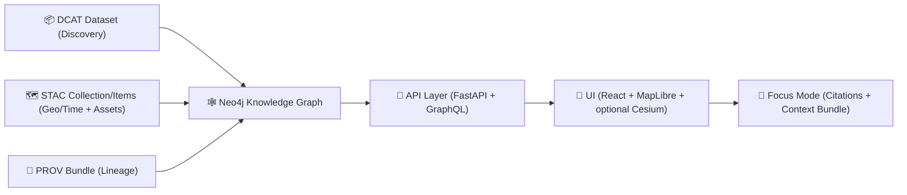

# 🗃️ DCAT Examples (KFM) — `api/contracts/examples/dcat/`

   

> **Purpose:** These examples are the **copy/paste starting points** for publishing datasets into the Kansas Frontier Matrix (KFM) using **DCAT** (discovery metadata) — in a way that plays nicely with KFM’s **STAC + PROV** “evidence-first” pipeline. 🧾🧬

---

## 🧭 What lives here (and why)

KFM treats metadata as a **first-class contract**:

- **DCAT** → “What is this dataset?” (title, description, license, publisher, keywords, access, distributions)
- **STAC** → “Where/when is this data, and what are the assets?” (geospatial/time indexing & file/service assets)
- **PROV** → “How was it produced?” (lineage, inputs, processing steps, agents)

These examples are meant to be used by:
- ✅ ingestion pipelines (auto-generating DCAT records)
- ✅ CI policy gates (schema + completeness checks)
- ✅ API layer (safe access, redaction, authorization)
- ✅ UI + Focus Mode (provenance/citations surfaced to users)

---

## 🧱 KFM “evidence triplet” (DCAT + STAC + PROV)



---

## 📁 Recommended folder layout

This folder currently provides the **README + patterns**. You’ll typically add example files like:

```text
📦 api/contracts/examples/dcat/
├── README.md
├── dataset.public.landcover.jsonld
├── dataset.realtime.river_gauges.jsonld
├── dataset.restricted.cultural_sites.jsonld
└── catalog.minimal.jsonld
```

> 💡 Tip: Keep examples **small but representative** (one dataset = a few distributions + links to STAC/PROV).

---

## ✅ Minimum DCAT fields (KFM-friendly)

KFM expects DCAT to be the **high-level discovery layer**. At minimum, every dataset should include:

| Field | Why it matters 🧠 | Notes |
|---|---|---|
| `dct:title` | Human-readable dataset name | Keep stable across versions |
| `dct:description` | What it is + caveats | Avoid marketing — focus on truth |
| `dct:publisher` | Who owns/maintains it | Org + optional contact |
| `dct:license` | “No license = no publish” | Explicit, machine-readable |
| `dcat:keyword` | Search + faceting | Use consistent tags |
| `dcat:distribution` | Where to access/download | Also link STAC + PROV here |
| `dct:spatial` / `dct:temporal` | Discovery filters | Keep coarse if sensitive |
| `dct:accessRights` (+ KFM classification) | Governance + redaction | Enforced by API/policy |

### 🧩 KFM extensions (common patterns)
KFM typically adds a few **project-specific** fields (names vary by profile, but the intent is consistent):

- `kfm:dataset_id` → canonical dataset ID (also copy into `dct:identifier`)
- `kfm:classification` → `PUBLIC | INTERNAL | RESTRICTED` (or similar)
- sovereignty/sensitivity notes → especially for Indigenous knowledge / cultural heritage

> 🛡️ If a dataset is sensitive, DCAT should **not leak** precise spatial detail or direct download URLs.

---

## 🆔 Dataset IDs & versioning conventions

Recommended convention (mirrors KFM’s cross-region/federation goals):

- `kfm.<state>.<theme>.<dataset_slug>.v<major>`  
  Example: `kfm.ks.landcover.1990_2020.v1`

Guidelines:
- ✅ `kfm:dataset_id` should match `dct:identifier`
- ✅ use `dcat:version` (and optionally `dcat:versionNotes`)
- ✅ link version lineage with `dct:isVersionOf` / `dct:hasVersion` where helpful

---

## 🗺️ Distribution patterns (what “good” looks like)

DCAT distributions are how the UI/API learn “where the data actually is.”

| Pattern | Use when… | DCAT fields |
|---|---|---|
| **Direct download** | public static files | `dcat:downloadURL`, `dct:format`, `dcat:mediaType` |
| **API access** | queryable features/time series | `dcat:accessURL`, `dct:conformsTo` |
| **Tile service** | map layers (raster/vector) | `dcat:accessURL`, service type via `dct:format` or profile |
| **STAC link** | geospatial assets indexed in STAC | distribution points to STAC Collection URL |
| **PROV link** | provenance must be discoverable | distribution points to PROV bundle URL |
| **OCI artifact** 🧊 | shipping big binary datasets via registry | distribution points to `oci://…` artifact ref |
| **Offline pack** 📦 | education/field offline use | zipped bundle + manifest + checksums |

---

## 🧪 Validation & “contract-first” expectations

These examples are intended to pass:
- ✅ **JSON Schema** checks (shape + required fields)
- ✅ **SHACL/RDF validation** checks (RDF vocabulary constraints)
- ✅ **Policy gate** checks (license present, classification present, required cross-links present)

Recommended CI rules (high-level):
1. **Schema validation** (DCAT JSON-LD shape)
2. **Triplet completeness** (DCAT ↔ STAC ↔ PROV links exist)
3. **License required**
4. **Classification required**
5. **Fail closed**: if any gate fails → dataset cannot be promoted/published

---

## 🧾 Example: Public dataset (Landcover time series)

<details>
<summary><b>📄 dataset.public.landcover.jsonld (expand)</b></summary>

```json
{
  "@context": {
    "dcat": "http://www.w3.org/ns/dcat#",
    "dct": "http://purl.org/dc/terms/",
    "prov": "http://www.w3.org/ns/prov#",
    "foaf": "http://xmlns.com/foaf/0.1/",
    "vcard": "http://www.w3.org/2006/vcard/ns#",
    "schema": "http://schema.org/",
    "locn": "http://www.w3.org/ns/locn#",
    "xsd": "http://www.w3.org/2001/XMLSchema#",
    "kfm": "https://kansasfrontiermatrix.org/ns#"
  },
  "@id": "https://kfm.example.org/datasets/kfm.ks.landcover.1990_2020.v1",
  "@type": "dcat:Dataset",

  "dct:identifier": "kfm.ks.landcover.1990_2020.v1",
  "kfm:dataset_id": "kfm.ks.landcover.1990_2020.v1",
  "dcat:version": "1.0.0",

  "dct:title": "Kansas Landcover 1990–2020",
  "dct:description": "Statewide landcover classes for Kansas (1990–2020). Derived from multi-year landcover sources and normalized into a consistent classification for comparison across decades.",
  "dcat:keyword": ["landcover", "Kansas", "time series", "classification"],
  "dcat:theme": [
    { "@id": "urn:kfm:theme:landcover" }
  ],

  "dct:publisher": {
    "@type": "foaf:Organization",
    "foaf:name": "Kansas GIS Department"
  },
  "dcat:contactPoint": {
    "@type": "vcard:Kind",
    "vcard:fn": "KFM Data Steward",
    "vcard:hasEmail": "mailto:data-steward@kfm.example.org"
  },

  "dct:license": { "@id": "https://creativecommons.org/licenses/by/4.0/" },
  "dct:accessRights": { "@id": "urn:kfm:access:public" },
  "kfm:classification": "PUBLIC",

  "dct:spatial": {
    "@type": "dct:Location",
    "locn:geometry": {
      "@value": "POLYGON((-102.051 37.0,-94.588 37.0,-94.588 40.0,-102.051 40.0,-102.051 37.0))",
      "@type": "http://www.opengis.net/ont/geosparql#wktLiteral"
    }
  },
  "dct:temporal": {
    "@type": "dct:PeriodOfTime",
    "schema:startDate": "1990-01-01",
    "schema:endDate": "2020-12-31"
  },

  "dcat:distribution": [
    {
      "@type": "dcat:Distribution",
      "dct:title": "GeoTIFF (download)",
      "dcat:downloadURL": "https://kfm.example.org/data/processed/landcover/kfm.ks.landcover.1990_2020.v1.tif",
      "dct:format": "GeoTIFF",
      "dcat:mediaType": "image/tiff"
    },
    {
      "@type": "dcat:Distribution",
      "dct:title": "Vector Tiles (PMTiles)",
      "dcat:downloadURL": "https://kfm.example.org/data/processed/landcover/kfm.ks.landcover.1990_2020.v1.pmtiles",
      "dct:format": "PMTiles",
      "dcat:mediaType": "application/octet-stream"
    },
    {
      "@type": "dcat:Distribution",
      "dct:title": "STAC Collection",
      "dcat:accessURL": "https://kfm.example.org/stac/collections/kfm.ks.landcover.1990_2020.v1",
      "dct:conformsTo": { "@id": "https://stacspec.org/" }
    },
    {
      "@type": "dcat:Distribution",
      "dct:title": "PROV Lineage Bundle",
      "dcat:accessURL": "https://kfm.example.org/prov/kfm.ks.landcover.1990_2020.v1.jsonld",
      "dct:conformsTo": { "@id": "http://www.w3.org/TR/prov-o/" }
    }
  ]
}
```

</details>

---

## ⏱️ Example: Real-time dataset (River gauges)

<details>
<summary><b>📄 dataset.realtime.river_gauges.jsonld (expand)</b></summary>

```json
{
  "@context": {
    "dcat": "http://www.w3.org/ns/dcat#",
    "dct": "http://purl.org/dc/terms/",
    "prov": "http://www.w3.org/ns/prov#",
    "foaf": "http://xmlns.com/foaf/0.1/",
    "vcard": "http://www.w3.org/2006/vcard/ns#",
    "schema": "http://schema.org/",
    "kfm": "https://kansasfrontiermatrix.org/ns#"
  },
  "@id": "https://kfm.example.org/datasets/kfm.ks.hydro.river_gauges.realtime.v1",
  "@type": "dcat:Dataset",

  "dct:identifier": "kfm.ks.hydro.river_gauges.realtime.v1",
  "kfm:dataset_id": "kfm.ks.hydro.river_gauges.realtime.v1",
  "dcat:version": "1.0.0",

  "dct:title": "Kansas River Gauges (Real-time)",
  "dct:description": "Real-time river gauge readings served as frequently updated point features. Intended for live monitoring and short-term trend visualization.",
  "dcat:keyword": ["hydrology", "river", "gauge", "real-time", "Kansas"],
  "dcat:theme": [{ "@id": "urn:kfm:theme:hydrology" }],

  "dct:publisher": {
    "@type": "foaf:Organization",
    "foaf:name": "Kansas Frontier Matrix"
  },

  "dct:license": { "@id": "https://creativecommons.org/licenses/by/4.0/" },
  "dct:accessRights": { "@id": "urn:kfm:access:public" },
  "kfm:classification": "PUBLIC",

  "dct:accrualPeriodicity": { "@id": "urn:kfm:freq:near-realtime" },

  "dcat:distribution": [
    {
      "@type": "dcat:Distribution",
      "dct:title": "Latest readings (GeoJSON via API)",
      "dcat:accessURL": "https://kfm.example.org/api/v1/realtime/river-gauges/latest",
      "dct:conformsTo": { "@id": "urn:kfm:api:contract:realtime-gauges:v1" }
    },
    {
      "@type": "dcat:Distribution",
      "dct:title": "Station time series (API)",
      "dcat:accessURL": "https://kfm.example.org/api/v1/realtime/river-gauges/{station_id}/timeseries?days=7",
      "dct:conformsTo": { "@id": "urn:kfm:api:contract:realtime-gauges:v1" }
    },
    {
      "@type": "dcat:Distribution",
      "dct:title": "PROV (streaming pipeline lineage — stub/rolling)",
      "dcat:accessURL": "https://kfm.example.org/prov/kfm.ks.hydro.river_gauges.realtime.v1.jsonld",
      "dct:conformsTo": { "@id": "http://www.w3.org/TR/prov-o/" }
    }
  ]
}
```

</details>

---

## 🔒 Example: Restricted dataset (sensitive cultural sites)

<details>
<summary><b>📄 dataset.restricted.cultural_sites.jsonld (expand)</b></summary>

```json
{
  "@context": {
    "dcat": "http://www.w3.org/ns/dcat#",
    "dct": "http://purl.org/dc/terms/",
    "foaf": "http://xmlns.com/foaf/0.1/",
    "kfm": "https://kansasfrontiermatrix.org/ns#"
  },
  "@id": "https://kfm.example.org/datasets/kfm.ks.history.cultural_sites.restricted.v1",
  "@type": "dcat:Dataset",

  "dct:identifier": "kfm.ks.history.cultural_sites.restricted.v1",
  "kfm:dataset_id": "kfm.ks.history.cultural_sites.restricted.v1",
  "dcat:version": "1.0.0",

  "dct:title": "Cultural Sites (Restricted Access)",
  "dct:description": "Sensitive cultural heritage locations. Access is restricted; public discovery metadata is intentionally coarse. Detailed geometry is not exposed via public distributions.",
  "dcat:keyword": ["cultural heritage", "history", "sensitive", "restricted"],
  "dcat:theme": [{ "@id": "urn:kfm:theme:history" }],

  "dct:publisher": {
    "@type": "foaf:Organization",
    "foaf:name": "KFM Cultural Heritage Stewardship"
  },

  "dct:license": { "@id": "urn:kfm:license:restricted" },
  "dct:accessRights": { "@id": "urn:kfm:access:restricted" },
  "kfm:classification": "RESTRICTED",

  "kfm:sensitivityNotes": "Coordinates are redacted at source. Authorized users may access vetted views via the governed API only.",
  "kfm:sovereigntyNotes": "Some records include Indigenous knowledge and require community-approved access controls.",

  "dcat:distribution": [
    {
      "@type": "dcat:Distribution",
      "dct:title": "Governed access (authorized users only)",
      "dcat:accessURL": "https://kfm.example.org/api/v1/datasets/kfm.ks.history.cultural_sites.restricted.v1",
      "dct:conformsTo": { "@id": "urn:kfm:api:contract:restricted-datasets:v1" }
    }
  ]
}
```

</details>

---

## 🧭 How the UI + Focus Mode use DCAT (practically)

When you build a map layer or narrative in KFM, DCAT is typically used to surface:
- 🏷️ **Source attribution** (e.g., “Source: USGS …”)
- 📜 **License clarity** (“CC-BY 4.0”, “Restricted”, etc.)
- 🔍 **Discovery filters** (keywords/themes)
- 🧾 **Citable references** in Focus Mode answers (DCAT + STAC + PROV links)

> ✅ A key UX rule: *users should never see a dataset without being able to see “where it came from”*.

---

## 🛡️ Governance checklist (publish-ready DCAT)

Before promotion to “official”:
- [ ] Title + description are accurate (no vibes-only descriptions 😄)
- [ ] License is explicit (no “unknown”)
- [ ] `kfm:classification` is set
- [ ] Distributions do **not leak** restricted assets
- [ ] DCAT ↔ STAC ↔ PROV links exist
- [ ] Dataset ID matches naming convention
- [ ] CI gates pass (schema + completeness + policy)

---

## 🧰 Adding a new DCAT example (fast path)

1. 🧾 Copy the closest example above  
2. 🆔 Set `dct:identifier` + `kfm:dataset_id`  
3. 📦 Add **at least** one distribution:
   - direct download **or** API access  
   - plus a STAC link when applicable  
   - plus a PROV link always (even stub/rolling for real-time)  
4. 🛡️ Set `dct:accessRights` + `kfm:classification`
5. ✅ Run validation locally + in CI

---

## 📚 Project doc set alignment (optional)

<details>
<summary><b>📖 Design docs and resource packs this README aligns with</b></summary>

- Kansas Frontier Matrix (KFM) – Comprehensive Technical Documentation 📘  
- Kansas Frontier Matrix (KFM) – Comprehensive Architecture, Features, and Design 🧱  
- Kansas Frontier Matrix (KFM) – AI System Overview 🧭🤖  
- Kansas Frontier Matrix – Comprehensive UI System Overview 🎨🗺️  
- Kansas Frontier Matrix (KFM) Data Intake – Technical & Design Guide 📥  
- Kansas Frontier Matrix – Latest Ideas & Future Proposals 🌟  
- Innovative Concepts to Evolve the Kansas Frontier Matrix (KFM) 💡  
- Additional Project Ideas 🧪  
- AI Concepts & more (PDF portfolio) 🤖📚  
- Data Management / Theories / Architectures (PDF portfolio) 🗄️📚  
- Maps / Google Maps / Virtual Worlds / WebGL (PDF portfolio) 🌍🛰️  
- Various Programming Languages & Resources (PDF portfolio) 🧰📚  

</details>
