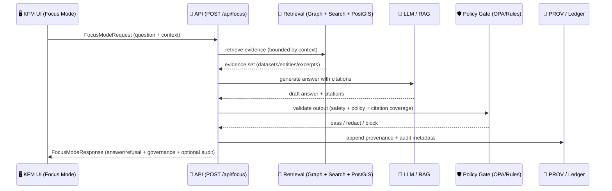

# 🧠🧭 Focus Mode Schemas (API Contracts + Examples)


This folder documents the **JSON Schemas** used by the **Focus Mode** contract examples (request/response, citations, provenance, governance/audit).  
Focus Mode is the **conversational + explainable AI layer** in KFM, designed to return answers **with citations and provenance** (or refuse safely when required). ✅

---

## 📁 Where you are

```text
api/
└─ 📜 contracts/
   └─ 🧪 examples/
      └─ 🔎 focus/
         └─ 📐 schemas/
            ├─ ✅📄 README.md                          # ✅ (this file) 📌 Schema purpose, naming, and how examples validate in CI
            ├─ 🔎📐🧾 focus.request.schema.json        # (recommended) Focus request envelope (question + context + filters)
            ├─ 📤📐🧾 focus.response.schema.json       # (recommended) Focus response envelope (answer + citations + redactions + receipts)
            ├─ 📚📐🧾 focus.citation.schema.json       # (recommended) Citation object (source locator + attribution + quote rules)
            ├─ 📎📐🧾 focus.evidence-manifest.schema.json # (recommended) Evidence manifest (citations ↔ artifacts ↔ checksums)
            ├─ 🧬📐🧾 focus.provenance.schema.json     # (recommended) Provenance refs (STAC/DCAT/PROV pointers + run ids)
            ├─ 🛡️📐🧾 focus.governance.schema.json     # (recommended) Governance fields (classification, policy decisions, waivers)
            └─ 🚨📐🧾 focus.error.schema.json          # (recommended) Error/refusal envelope (safe reasons + remediation hints))
```

> 💡 If your repo already uses different filenames, keep this README and **map your existing schema filenames** to the “Schema Catalog” below.

---

## 🧱 Non‑negotiable invariants (Focus Mode contract rules)

These aren’t “nice-to-haves”—they’re *contract invariants* that schemas and examples should enforce:

- **Contract-first**: schemas define what the system *is allowed* to emit/accept before implementation.
- **Evidence-first**: factual claims must be backed by **citations** (dataset/doc/entity + locators).
- **Provenance-first**: the system must provide **lineage** (PROV-style) for answers and derived artifacts.
- **Governance-aware**: policy gates can **block/redact** outputs and must return explainable results.
- **Explainable by design**: the response supports an **audit panel** (influences, graph path hints, checks).
- **Security-aware**: prompt injection defenses + allowlists/denylists + runtime policy checks.

---

## 🧩 Schema Catalog

### 1) `focus.request.schema.json` 📨
**Purpose:** Validates the payload sent to `POST /api/focus` (or equivalent).  
Supports UI context such as **viewport**, **active layers**, **selected feature**, and **time range**.

**Core fields (recommended):**
- `requestId` *(string, UUID)* — idempotency + traceability
- `question` *(string)* — user prompt / natural language query
- `context` *(object)* — map + session context
  - `viewport` *(object)* — bbox/center/zoom/crs
  - `timeRange` *(object)* — ISO8601 interval
  - `activeLayers` *(array)* — layer IDs currently enabled
  - `selectedFeature` *(object|null)* — feature/entity being inspected
- `options` *(object)* — formatting + debug + audit toggles
  - `answerFormat` *(enum: `markdown` | `text`)*  
  - `includeAudit` *(boolean)* — shows XAI/governance details (role-gated)
  - `includeProvenance` *(boolean)* — returns PROV bundle/ref
  - `maxCitations` *(integer)* — defensive bound

<details>
<summary>✅ Example (request)</summary>

```json
{
  "requestId": "3f2bca2d-7bde-4b8b-a5b4-dc51c0af8a77",
  "question": "What’s the current water level of the Kansas River at Topeka?",
  "context": {
    "viewport": {
      "bbox": [-96.0, 38.7, -95.0, 39.2],
      "center": [-95.675, 39.055],
      "zoom": 9.5,
      "crs": "EPSG:4326"
    },
    "timeRange": {
      "start": "2026-01-24T00:00:00Z",
      "end": "2026-01-24T23:59:59Z"
    },
    "activeLayers": [
      { "layerId": "kfm.ks.hydro.river_gauges.realtime", "opacity": 0.9 }
    ],
    "selectedFeature": {
      "kind": "graphEntity",
      "id": "kfm:entity:station:usgs:06889200",
      "label": "Kansas River at Topeka gauge"
    }
  },
  "options": {
    "answerFormat": "markdown",
    "includeAudit": true,
    "includeProvenance": true,
    "maxCitations": 8
  }
}
```
</details>

---

### 2) `focus.response.schema.json` 🧾
**Purpose:** Validates a Focus Mode reply: **answer OR refusal**, always with governance visibility.

**Envelope pattern (recommended):**
- `responseId` *(UUID)*
- `requestId` *(UUID, echoes request)*
- `status` *(enum)*:
  - `ok` ✅ — answer produced
  - `blocked` 🛑 — policy gate blocked content
  - `redacted` 🟠 — answer returned with redactions
  - `needs_more_info` 🟡 — user must refine question/context
- `answer` *(string, markdown/text)* — may be empty if blocked
- `citations` *(array)* — **required** when `status=ok|redacted`
- `governance` *(object)* — policy checks + sensitivity + actions
- `provenance` *(object|string|null)* — PROV bundle/ref (optional, role-gated)
- `audit` *(object|null)* — XAI-facing fields for UI audit panel (role-gated)
- `warnings` *(array)* — data freshness, uncertainty, simulation disclaimers

<details>
<summary>✅ Example (response: ok)</summary>

```json
{
  "responseId": "89e1a8b5-0ff8-4d0a-b7a2-e2ce2e5bf8dd",
  "requestId": "3f2bca2d-7bde-4b8b-a5b4-dc51c0af8a77",
  "status": "ok",
  "answer": "As of **2026-01-24T20:00:00Z**, the Kansas River level at Topeka is **X ft**.[^c1]\n\n[^c1]: USGS real-time water data + station gauge reading.",
  "citations": [
    {
      "citationId": "c1",
      "kind": "dcatDataset",
      "title": "USGS Real-time Water Data",
      "locators": {
        "asOf": "2026-01-24T20:00:00Z",
        "entityId": "kfm:entity:station:usgs:06889200"
      },
      "refs": {
        "dcatId": "kfm:dataset:usgs:nwis:realtime",
        "provEntityId": "prov:entity:obs:06889200:20260124T200000Z"
      }
    }
  ],
  "governance": {
    "classification": "public",
    "checks": [
      { "checkId": "prompt_gate", "status": "pass" },
      { "checkId": "opa_output_policy", "status": "pass" },
      { "checkId": "citation_coverage", "status": "pass" }
    ],
    "actions": []
  },
  "provenance": {
    "format": "prov-jsonld",
    "bundleRef": "kfm:prov:focus:89e1a8b5-0ff8-4d0a-b7a2-e2ce2e5bf8dd"
  },
  "audit": {
    "model": { "name": "kfm-focus-llm", "version": "vX.Y" },
    "retrieval": { "graphHits": 4, "docHits": 12 },
    "influences": [
      { "type": "graphPath", "value": "Station -> Dataset -> Observation" }
    ]
  },
  "warnings": [
    "This answer uses a dynamic (real-time) reading. Re-ask to refresh."
  ]
}
```
</details>

<details>
<summary>🛑 Example (response: blocked by policy)</summary>

```json
{
  "responseId": "8dc0ce0f-0fcb-4b0a-97c0-1fd5a3d0e7a1",
  "requestId": "3f2bca2d-7bde-4b8b-a5b4-dc51c0af8a77",
  "status": "blocked",
  "answer": "",
  "citations": [],
  "governance": {
    "classification": "restricted",
    "checks": [
      { "checkId": "opa_output_policy", "status": "fail", "reason": "Sensitive location policy" }
    ],
    "actions": [
      { "action": "block", "message": "This request involves restricted data." }
    ]
  },
  "warnings": [
    "Try requesting aggregated or generalized results."
  ]
}
```
</details>

---

### 3) `focus.citation.schema.json` 🔗
**Purpose:** A citation object that can point to:
- DCAT dataset IDs (catalog metadata)
- STAC items/assets (spatiotemporal assets)
- Knowledge graph entities (place/event/person/station/etc.)
- Concrete API query results (bounded + timestamped)
- OCI artifact digests (immutable, signed artifacts)

**Recommended fields:**
- `citationId` *(string)* — stable per response
- `kind` *(enum)* — `dcatDataset | stacItem | graphEntity | apiQuery | documentExcerpt | ociArtifact`
- `title` *(string)*
- `refs` *(object)* — `dcatId`, `stacId`, `provEntityId`, etc.
- `locators` *(object)* — **where/when** the claim is supported (bbox, time, fragment, row IDs)
- `license` *(string|null)* — optional but helpful

---

### 4) `focus.evidence-manifest.schema.json` 🧾🧬
**Purpose:** A machine-readable **evidence manifest** for the answer, compatible with “evidence-first” narrative and reproducibility.

Think of this as the “receipt” for a Focus Mode response:
- what was retrieved
- what was used
- hashes/digests for artifacts
- exact locators (rows, time range, bbox)
- links into provenance

**Recommended fields:**
- `manifestId` *(string)*
- `items` *(array)* — each item references a citation and includes retrieval metadata
- `hashes` *(object)* — checksum(s) when applicable
- `createdAt` *(date-time)*
- `policy` *(object)* — required policies applied for this manifest

---

### 5) `focus.provenance.schema.json` 🧬
**Purpose:** A PROV-aligned record (often PROV JSON-LD) describing how the response was generated:
- input question + context
- retrieval activities (graph, vector, raster, docs)
- model invocation activity
- output entity = answer

**Recommended fields:**
- `format` *(enum: `prov-jsonld` | `prov-n` | `prov-xml` | `ref`)*
- `bundle` *(object|string)* — embed or reference
- `agents` *(array)* — pipeline/service identities
- `activities` *(array)* — retrieval + generation steps
- `entities` *(array)* — inputs/outputs/evidence artifacts

---

### 6) `focus.governance.schema.json` 🛡️
**Purpose:** Structured output of governance checks.
- policy pack results (OPA/Conftest)
- sensitivity/classification labels
- redaction details (if any)
- “fail closed” support

**Recommended fields:**
- `classification` *(enum: `public | restricted | sensitive`)*  
- `checks[]`: `{checkId, status, severity?, reason?, evidenceRefs?}`
- `actions[]`: `{action: block|redact|warn, message, fieldsAffected?}`

---

### 7) `focus.error.schema.json` ❗
**Purpose:** Standardized error shape for validation errors, unauthorized access, timeouts, etc.

**Recommended approach:** RFC7807-like Problem Details with KFM extensions:
- `type`, `title`, `status`, `detail`, `instance`
- `requestId` and `traceId`
- `validationErrors[]` for schema validation

---

## 🧠 Focus Mode Flow (contract-level)



---

## ✅ Validation (dev + CI)

### Node (Ajv)
```bash
npx ajv-cli validate \
  -s ./focus.request.schema.json \
  -d ../payloads/focus.request.example.json
```

### Python (`jsonschema`)
```bash
python -m jsonschema \
  -i ../payloads/focus.response.example.json \
  ./focus.response.schema.json
```

### CI tips 🔁
- Run schema validation on every PR touching `api/contracts/**`
- Treat policy failures as **build breakers** (fail closed)
- Keep a minimal golden set of examples (happy path + block + redact)

---

## 🔁 Versioning & Compatibility

- Prefer **additive changes** (new optional fields) ✅
- Avoid breaking renames; if needed:
  - add new field
  - keep old field for ≥1 minor version
  - add deprecation note in schema `description`
- Embed a `schemaVersion` in request/response (or `$id` versioning)  
- Keep `$defs` / components small and composable.

---

## 🧩 Implementation Notes (so examples stay realistic)

- **UI context matters**: viewport/time/selection should be optional but supported (it’s how Focus Mode becomes “map-aware”).  
- **Role-gate audit**: `includeAudit` / `includeProvenance` should be permitted only for authorized roles.
- **Dynamic queries**: if the answer is real-time, include `asOf` timestamp + warning.
- **Simulations**: require uncertainty/disclaimer fields (simulation ≠ truth).

---

## 📚 Bundled reference libraries (in this repo) 📦

These project files are intentionally included as long-form reference packs for implementation decisions:

- 📘 **Kansas Frontier Matrix (KFM) – Comprehensive Technical Documentation.pdf**
- 📘 **Kansas Frontier Matrix (KFM) – Comprehensive Architecture, Features, and Design.pdf**
- 📘 **Kansas Frontier Matrix (KFM) – AI System Overview 🧭🤖.pdf**
- 📘 **Kansas Frontier Matrix – Comprehensive UI System Overview.pdf**
- 📘 **📚 Kansas Frontier Matrix (KFM) Data Intake – Technical & Design Guide.pdf**
- 💡 **Innovative Concepts to Evolve the Kansas Frontier Matrix (KFM).pdf**
- 🌟 **Kansas Frontier Matrix – Latest Ideas & Future Proposals.docx.pdf**
- 🧠 **Additional Project Ideas.pdf**
- 🧠 **AI Concepts & more.pdf** (PDF portfolio)
- 🗺️ **Maps-GoogleMaps-VirtualWorlds-Archaeological-Computer Graphics-Geospatial-webgl.pdf** (PDF portfolio)
- 🧰 **Various programming langurages & resources 1.pdf** (PDF portfolio)
- 🗃️ **Data Managment-Theories-Architures-Data Science-Baysian Methods-Some Programming Ideas.pdf** (PDF portfolio)

---

## 🤝 Contributing checklist (schemas)

- [ ] Did you update / add an example payload that validates?
- [ ] Did you keep changes additive (or document a migration)?
- [ ] Did you preserve evidence-first + provenance-first expectations?
- [ ] Did you confirm policy gate / governance objects still make sense?
- [ ] Did you keep request context optional but supported?

---

> 🧭 Goal: Focus Mode should feel *simple to ask* and *hard to mislead*.
