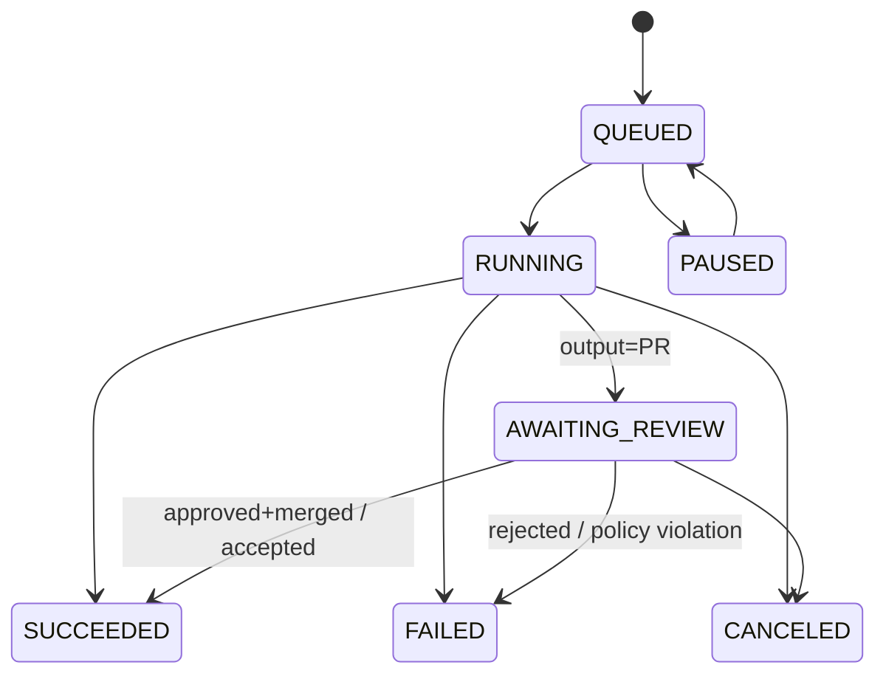

# Jobs Contracts — Examples 🧰⛓️


This folder contains **copy/paste-ready JSON examples** for the **KFM “Jobs” API contract**: submitting long-running work, tracking status, streaming progress, collecting artifacts, and recording provenance.

> [!TIP]
> Jobs are used for anything that shouldn’t block the request/response cycle (heavy pipelines, tile generation, simulations, governance checks, AI-assisted analysis, offline pack builds, etc.).

---

## 📦 Folder layout

```text
📁 api/
  📁 contracts/
    📁 schemas/
      📁 jobs/
        📄 job.submit.schema.json
        📄 job.accepted.schema.json
        📄 job.status.schema.json
        📄 job.event.schema.json
        📄 job.error.schema.json
    📁 examples/
      📁 jobs/
        📄 README.md  👈 you are here
        📄 submit.ingest.dataset.json
        📄 status.ingest.succeeded.json
        📄 submit.tiles.build.json
        📄 submit.ai.focus_answer.json
        📄 submit.governance.graph_healthcheck.json
        📄 submit.sim.run.json
        📄 submit.offline.pack_build.json
```

> [!NOTE]
> Schema filenames may differ in your repo — the examples below still show the **shape** and **field conventions** we want KFM to enforce.

---

## 🧠 What is a “Job” in KFM?

A **Job** is an asynchronous unit of work that:
- is **queued** into a worker system (e.g., geospatial processing, AI analysis, simulations, graph checks),
- returns a **job_id** immediately,
- exposes **status** + **events** + **logs** while it runs,
- produces **artifacts** (files, bundles, tilesets, reports) and/or **PRs**,
- and (when it creates/updates data) emits **provenance** metadata (Run Manifest + PROV + catalog refs).

---

## 🔁 Lifecycle & states

### Recommended states (enum)
| State | Meaning |
|------|---------|
| `QUEUED` | Accepted, waiting for a worker |
| `RUNNING` | Worker is executing |
| `AWAITING_REVIEW` | Output produced but needs human approval (common for PR workflows) |
| `SUCCEEDED` | Completed successfully |
| `FAILED` | Completed with error (see `error`) |
| `CANCELED` | Stopped by user/admin |
| `PAUSED` | Temporarily suspended (budget/concurrency/policy) |

### Mermaid: high-level state machine 🗺️


---

## 🧾 Core contract shapes (mental model)

### 1) Submit (client ➜ API)
A submit request should always include:
- `idempotency_key` ✅ (repeatable, deterministic)
- `job_type` + `job_version` ✅
- `requested_by` ✅ (user/service/agent identity)
- `policy_context` ✅ (classification, purpose, etc.)
- `inputs` ✅
- `execution` ✅ (pool, priority, timeouts)
- `output` ✅ (PR? artifacts? ephemeral analysis?)

### 2) Accepted (API ➜ client)
Returns:
- `job_id`
- initial `state=QUEUED`
- polling + streaming links

### 3) Status (client ➜ API ➜ client)
Returns:
- `state`, `progress`, timestamps
- optional `result` (on success)
- optional `error` (on failure)
- `links` (logs/artifacts/events)

### 4) Events (optional streaming)
A lightweight event stream (SSE / WS) carrying:
- structured progress
- stage transitions
- warnings/errors

---

## 🧩 Conventions used in these examples

### ✅ Idempotency keys
Use a stable key that represents the *logical operation*, not a random UUID. Examples:
- `ingest:<dataset_id>:<slice>`  
- `tiles:<layer_id>:<zmin>-<zmax>:<bbox_hash>`  
- `healthcheck:graph:week:<YYYY-WW>`

### 🧪 Execution pools
Use **pool isolation** to prevent resource stampedes:
- `kfm-geo` → raster/vector processing, tiles, heavy spatial joins
- `kfm-ml` → model runs, embeddings, AI evaluation
- `kfm-ops` → governance checks, link checking, metadata QA

### 📎 Artifacts
Prefer content-addressed refs (digest) and signed artifacts where possible.

### 🔐 Policy & governance
Jobs that **change published data** should route through:
- policy gate checks,
- provenance requirements,
- and **human-in-the-loop review** (PR flow).

---

## 📚 Example catalog

| Example | What it shows | Suggested file |
|---|---|---|
| Ingest Dataset (PR) | deterministic ingest + PR output | `submit.ingest.dataset.json` |
| Status (Succeeded) | result payload + provenance refs | `status.ingest.succeeded.json` |
| Build Tiles | PMTiles/COG + OCI artifact publishing | `submit.tiles.build.json` |
| Focus Mode Answer | ephemeral AI answer w/ citations + telemetry | `submit.ai.focus_answer.json` |
| Graph Health Check | weekly integrity checks + report artifact | `submit.governance.graph_healthcheck.json` |
| Simulation Run | `kfm-sim-run` bundle + diff patch + PR | `submit.sim.run.json` |
| Offline Pack Build | mobile/offline export pack | `submit.offline.pack_build.json` |

---

## ✅ Example: Submit — Batch ingestion job (PR flow)

<details>
<summary>📄 submit.ingest.dataset.json</summary>

```json
{
  "contract_version": "2026-01-24",
  "idempotency_key": "ingest:kfm.ks.hydro.river_gauges.usgs_nwis:2026-01-01..2026-01-24",
  "job_type": "kfm.ingest.dataset",
  "job_version": "1.0",
  "requested_by": {
    "subject_type": "user",
    "subject_id": "user_123",
    "display_name": "Researcher Jane",
    "roles": ["contributor"]
  },
  "policy_context": {
    "data_classification": "public",
    "purpose": "research",
    "requires_human_review": true
  },
  "inputs": {
    "dataset_id": "kfm.ks.hydro.river_gauges.usgs_nwis",
    "source_ref": {
      "kind": "http",
      "url": "https://example.data.provider/usgs/nwis/river_gauges.json"
    },
    "slice": {
      "mode": "time_range",
      "time_start": "2026-01-01T00:00:00Z",
      "time_end": "2026-01-24T00:00:00Z"
    },
    "transform": {
      "pipeline_id": "pipelines/ingest/usgs_nwis_river_gauges",
      "parameters": {
        "normalize_units": true,
        "dedupe_strategy": "exactly_once"
      }
    }
  },
  "execution": {
    "pool": "kfm-geo",
    "priority": "normal",
    "max_runtime_seconds": 7200,
    "dry_run": false
  },
  "output": {
    "mode": "pull_request",
    "pr": {
      "title": "Ingest USGS NWIS river gauges (Jan 2026)",
      "labels": ["data-ingest", "provenance-required"],
      "review_required": true
    }
  }
}
```
</details>

---

## ✅ Example: Accepted response (submit ➜ 202 Accepted)

<details>
<summary>📄 job.accepted.json</summary>

```json
{
  "job_id": "job_01HTZ8Y3J3S4WZ8FQY5C3XQ7J2",
  "state": "QUEUED",
  "created_at": "2026-01-24T16:05:12Z",
  "job_type": "kfm.ingest.dataset",
  "links": {
    "self": "/v1/jobs/job_01HTZ8Y3J3S4WZ8FQY5C3XQ7J2",
    "status": "/v1/jobs/job_01HTZ8Y3J3S4WZ8FQY5C3XQ7J2/status",
    "events": "/v1/jobs/job_01HTZ8Y3J3S4WZ8FQY5C3XQ7J2/events",
    "logs": "/v1/jobs/job_01HTZ8Y3J3S4WZ8FQY5C3XQ7J2/logs"
  }
}
```
</details>

---

## ✅ Example: Status — succeeded (includes PR + provenance + artifacts)

<details>
<summary>📄 status.ingest.succeeded.json</summary>

```json
{
  "job_id": "job_01HTZ8Y3J3S4WZ8FQY5C3XQ7J2",
  "job_type": "kfm.ingest.dataset",
  "state": "AWAITING_REVIEW",
  "progress": {
    "stage": "publish_pr",
    "pct": 100
  },
  "started_at": "2026-01-24T16:06:01Z",
  "finished_at": "2026-01-24T16:12:44Z",
  "result": {
    "summary": "Ingested 2,413 observations across 112 stations; updated STAC + DCAT + PROV; opened PR.",
    "pull_request": {
      "provider": "github",
      "repo": "bartytime4life/Kansas-Frontier-Matrix",
      "pr_number": 842,
      "url": "https://github.com/bartytime4life/Kansas-Frontier-Matrix/pull/842"
    },
    "provenance": {
      "run_manifest_ref": "data/provenance/runs/run_2026-01-24_usgs_nwis_river_gauges.json",
      "run_manifest_digest": "sha256:2a3c9d4f4f7a9a2c2d5c27d2f2c8c2b3d3d1a1b9c6c7d8e9f0a1b2c3d4e5f6a7",
      "prov_ref": "data/provenance/prov/prov_usgs_nwis_river_gauges_2026-01-24.jsonld",
      "catalog_refs": {
        "stac_item": "data/catalog/stac/collections/river_gauges/items/2026-01-24.json",
        "dcat_dataset": "data/catalog/dcat/datasets/kfm.ks.hydro.river_gauges.usgs_nwis.jsonld"
      }
    },
    "artifacts": [
      {
        "kind": "oci",
        "name": "river_gauges_observations_geoparquet",
        "ref": "ghcr.io/kfm/artifacts/river_gauges_observations@sha256:aaaaaaaaaaaaaaaaaaaaaaaaaaaaaaaaaaaaaaaaaaaaaaaaaaaaaaaaaaaaaaaa",
        "signed": true
      }
    ]
  },
  "links": {
    "logs": "/v1/jobs/job_01HTZ8Y3J3S4WZ8FQY5C3XQ7J2/logs",
    "artifacts": "/v1/jobs/job_01HTZ8Y3J3S4WZ8FQY5C3XQ7J2/artifacts"
  }
}
```
</details>

> [!IMPORTANT]
> Notice `state=AWAITING_REVIEW`: **PR is opened but not merged**. This preserves governance and human review 🔍✅.

---

## 🗺️ Example: Submit — Build map tiles (PMTiles / COG / 3D Tiles)

<details>
<summary>📄 submit.tiles.build.json</summary>

```json
{
  "contract_version": "2026-01-24",
  "idempotency_key": "tiles:kfm.ks.base.topo:pmtiles:z0-14:bbox:ks",
  "job_type": "kfm.tiles.build",
  "job_version": "1.1",
  "requested_by": {
    "subject_type": "service",
    "subject_id": "svc_tiles_worker",
    "display_name": "Tiles Service",
    "roles": ["system"]
  },
  "policy_context": {
    "data_classification": "public",
    "purpose": "publish",
    "requires_human_review": false
  },
  "inputs": {
    "layer_id": "kfm.ks.base.topo",
    "source_artifacts": [
      {
        "kind": "path",
        "path": "data/processed/rasters/topo_ks_1890s_cog.tif"
      }
    ],
    "tiling": {
      "format": "pmtiles",
      "min_zoom": 0,
      "max_zoom": 14,
      "tile_matrix": "web_mercator",
      "bbox": [-102.051, 36.993, -94.588, 40.003]
    }
  },
  "execution": {
    "pool": "kfm-geo",
    "priority": "high",
    "max_runtime_seconds": 14400
  },
  "output": {
    "mode": "artifact_publish",
    "artifact_registry": {
      "provider": "oci",
      "repository": "ghcr.io/kfm/tiles",
      "sign_with_cosign": true,
      "attach_prov": true
    }
  }
}
```
</details>

---

## 🤖 Example: Submit — Focus Mode answer (ephemeral, evidence-first)

<details>
<summary>📄 submit.ai.focus_answer.json</summary>

```json
{
  "contract_version": "2026-01-24",
  "idempotency_key": "focus_answer:user_123:ksriver_topeka:2026-01-24T16:00Z",
  "job_type": "kfm.ai.focus_answer",
  "job_version": "1.0",
  "requested_by": {
    "subject_type": "user",
    "subject_id": "user_123",
    "display_name": "Researcher Jane",
    "roles": ["viewer"]
  },
  "policy_context": {
    "data_classification": "public",
    "purpose": "question_answering",
    "requires_human_review": false
  },
  "inputs": {
    "question": "What’s the current water level of the Kansas River at Topeka, and how does that compare to the last 7 days?",
    "context": {
      "map_bbox": [-96.90, 39.00, -95.50, 39.20],
      "time_range": {
        "start": "2026-01-17T00:00:00Z",
        "end": "2026-01-24T16:00:00Z"
      },
      "layers": ["kfm.ks.hydro.river_gauges.usgs_nwis"]
    },
    "response_style": {
      "tone": "neutral",
      "include_citations": true,
      "include_uncertainty": true
    }
  },
  "execution": {
    "pool": "kfm-ml",
    "priority": "normal",
    "max_runtime_seconds": 60
  },
  "output": {
    "mode": "ephemeral",
    "return_format": "json"
  }
}
```
</details>

### 📌 Expected result shape (what “success” looks like)
```json
{
  "answer": {
    "text": "As of 2026-01-24 16:00Z, the Kansas River gauge at Topeka reads 12.4 ft. Over the last 7 days, the level ranged from 11.8 ft to 13.1 ft.",
    "citations": [
      {
        "label": "USGS NWIS — Topeka station latest reading",
        "ref": "dcat:kfm.ks.hydro.river_gauges.usgs_nwis#station:topeka",
        "observed_at": "2026-01-24T16:00:00Z"
      }
    ],
    "uncertainty_note": "Values reflect latest available ingestion micro-batch; latency may be up to several minutes."
  },
  "telemetry": {
    "citation_coverage_pct": 100,
    "retrieval_sources": ["neo4j", "postgis"]
  },
  "governance": {
    "ledger_entry_id": "govlog_01HTZ9A8GQ7FZ2P0Y3S1M9C6W5"
  }
}
```

---

## 🧪 Example: Submit — Weekly graph health check

<details>
<summary>📄 submit.governance.graph_healthcheck.json</summary>

```json
{
  "contract_version": "2026-01-24",
  "idempotency_key": "healthcheck:graph:week:2026-W04",
  "job_type": "kfm.governance.graph_healthcheck",
  "job_version": "1.0",
  "requested_by": {
    "subject_type": "service",
    "subject_id": "svc_governance",
    "display_name": "Governance Scheduler",
    "roles": ["system"]
  },
  "policy_context": {
    "data_classification": "internal",
    "purpose": "governance",
    "requires_human_review": true
  },
  "inputs": {
    "checks": [
      "node_relationship_count_deltas",
      "constraint_and_index_integrity",
      "orphaned_metadata_nodes",
      "recent_ingestion_lag",
      "top_degree_hubs"
    ],
    "thresholds": {
      "max_weekly_delta_pct": 5,
      "max_ingestion_lag_minutes": 180
    }
  },
  "execution": {
    "pool": "kfm-ops",
    "priority": "normal",
    "max_runtime_seconds": 900
  },
  "output": {
    "mode": "artifact_publish",
    "artifact_registry": {
      "provider": "oci",
      "repository": "ghcr.io/kfm/reports",
      "sign_with_cosign": true,
      "attach_prov": true
    }
  }
}
```
</details>

---

## 🧪 Example: Submit — Simulation run (`kfm-sim-run`) with diff patch bundle

<details>
<summary>📄 submit.sim.run.json</summary>

```json
{
  "contract_version": "2026-01-24",
  "idempotency_key": "sim:kfm.ks.hydro:flood_model:v3:scenario:1951_baseline",
  "job_type": "kfm.sim.run",
  "job_version": "1.0",
  "requested_by": {
    "subject_type": "user",
    "subject_id": "user_456",
    "display_name": "Analyst Sam",
    "roles": ["contributor"]
  },
  "policy_context": {
    "data_classification": "public",
    "purpose": "research",
    "requires_human_review": true
  },
  "inputs": {
    "simulation_id": "kfm.ks.hydro.flood_model.v3",
    "scenario": "1951_baseline",
    "parameters": {
      "rainfall_multiplier": 1.0,
      "roughness_n": 0.035
    }
  },
  "execution": {
    "pool": "kfm-geo",
    "priority": "normal",
    "max_runtime_seconds": 21600
  },
  "output": {
    "mode": "pull_request",
    "pr": {
      "title": "Sim run: flood_model v3 (1951 baseline) + bundle",
      "labels": ["simulation", "provenance-required"],
      "review_required": true
    },
    "bundle": {
      "include_diff_patch": true,
      "include_run_manifest": true,
      "include_prov": true
    }
  }
}
```
</details>

---

## 📦 Example: Submit — Offline pack build (mobile/field mode)

<details>
<summary>📄 submit.offline.pack_build.json</summary>

```json
{
  "contract_version": "2026-01-24",
  "idempotency_key": "offline_pack:ks:layers:topo+hydro:z0-12:2026-01-24",
  "job_type": "kfm.offline.pack_build",
  "job_version": "1.0",
  "requested_by": {
    "subject_type": "user",
    "subject_id": "user_123",
    "display_name": "Researcher Jane",
    "roles": ["viewer"]
  },
  "policy_context": {
    "data_classification": "public",
    "purpose": "offline_export",
    "requires_human_review": false
  },
  "inputs": {
    "region": "kansas",
    "layers": [
      "kfm.ks.base.topo",
      "kfm.ks.hydro.river_gauges.usgs_nwis"
    ],
    "tile_spec": {
      "format": "mbtiles",
      "min_zoom": 0,
      "max_zoom": 12
    },
    "include_metadata": true
  },
  "execution": {
    "pool": "kfm-geo",
    "priority": "normal",
    "max_runtime_seconds": 10800
  },
  "output": {
    "mode": "artifact_publish",
    "artifact_registry": {
      "provider": "oci",
      "repository": "ghcr.io/kfm/offline-packs",
      "sign_with_cosign": true,
      "attach_prov": true
    }
  }
}
```
</details>

---

## 🧷 Errors: standard shape

When a job fails (or is policy-blocked), return:
- top-level `state=FAILED`
- `error` object with structured details

```json
{
  "code": "KFM-POLICY-DENY",
  "message": "Policy gate failed: processed data changed without matching PROV update.",
  "details": {
    "violations": [
      {
        "policy_id": "KFM-PROV-001",
        "path": "data/processed/...",
        "hint": "Update PROV JSON-LD for the changed artifact and ensure run manifest digest matches."
      }
    ]
  },
  "retryable": false
}
```

---

## 🔔 Webhooks / callbacks (optional but recommended)

For UI and integrations, allow a `callback` block on submit:

```json
{
  "callback": {
    "url": "https://client.app/webhooks/kfm-jobs",
    "secret_ref": "secrets://webhook-signing-key",
    "events": ["state_changed", "progress", "completed"]
  }
}
```

---

## 🧪 Validation: keep examples contract-correct

### JSON Schema validation
```bash
# Option A: python jsonschema
python -m jsonschema -i submit.ingest.dataset.json ../../schemas/jobs/job.submit.schema.json

# Option B: ajv (node)
npx ajv validate -s ../../schemas/jobs/job.submit.schema.json -d submit.ingest.dataset.json
```

### Governance policy validation (recommended)
If your CI runs OPA/Conftest gates, examples should also pass “shape & governance” linting:
- classification present
- provenance refs present when output is publishable
- no forbidden fields
- stable `idempotency_key`

---

## 🛠️ Adding a new job example

1. Pick a **new `job_type`** name (dot notation, `kfm.<domain>.<verb>`).
2. Add:
   - `submit.<job_type>.json`
   - `status.<job_type>.(queued|running|succeeded|failed).json` (at least one)
3. Validate against schema + policy.
4. Keep payloads small but **realistic** (include provenance + artifacts when relevant).

---

## 📚 Appendix: “Reference shelf” (why these job types exist)

KFM’s job patterns touch multiple domains — ingestion pipelines, provenance, AI governance, geospatial processing, offline/AR delivery, and software delivery hygiene. These project docs and bundled references are the “why” behind the contract.

### Core KFM docs (project-native) 🧭
- 📘 Technical Documentation (API, storage, async workers, standards)
- 🧩 Architecture, Features & Design (W→P→E automation, roadmap)
- 🤖 AI System Overview (Focus Mode RAG + citations + governance ledger)
- 🗺️ UI System Overview (AR mode, 3D experiences, offline workflows)
- 📥 Data Intake Guide (deterministic ingestion, CI/policy gates, provenance)
- 💡 Innovative Concepts + Future Proposals (4D/AR/storytelling expansion, new job classes)
- 🧠 Additional Project Ideas (run manifests, OCI artifacts, health checks, drift packs)

### Bundled reference PDFs (project shelf) 📚✨
- 🧠 AI/ML: agent foundations, pattern recognition, resource-constrained ML
- 🌍 Maps/WebGL: map projections, Google Earth Engine, WebGL programming, 3D GIS
- 🗃️ Data engineering: data lakehouse, data engineering cookbook, Bayesian methods for monitoring
- 🧰 Engineering: Algorithms notes, CI/CD guides, Python/Node/Postgres notes

> [!NOTE]
> Keep the Jobs contract **stable** even as features expand — add new job types/versions rather than breaking older clients.
