# Offset Pagination (limit/offset) 📄➡️


> **Goal:** make every “list endpoint” in KFM predictable, safe, and UI-friendly by standardizing `limit` + `offset` pagination.

---

## Quick links 🔗
- [Where this lives](#where-this-lives-)
- [Why KFM cares about pagination](#why-kfm-cares-about-pagination-)
- [When to use offset pagination](#when-to-use-offset-pagination-)
- [Contract (REST)](#contract-rest-)
- [Contract (GraphQL)](#contract-graphql-)
- [Copy/paste examples](#copypaste-examples-)
- [Implementation notes](#implementation-notes-)
- [Governance & security rules](#governance--security-rules-)
- [Test checklist](#test-checklist-)
- [Contributing / extending](#contributing--extending-)

---

## Where this lives 📦

api/
└─ 📜 contracts/
   └─ 🧪 examples/
      └─ 📑 pagination/
         └─ 🔢 offset/
            └─ ✅📄 README.md   # ✅ you are here 📌 Offset/limit pagination examples + caveats (drift, totals, max limits)

---

## Why KFM cares about pagination 🗺️

KFM’s UI (catalog browsing, search, timelines, story tooling, admin dashboards) and its GraphQL layer both need **bounded list responses** to stay fast and safe.

Unbounded lists can:
- 🚫 degrade performance (slow queries, large payloads)
- 🚫 increase cost (DB load, memory pressure)
- 🚫 accidentally leak information via side channels (counts, timing, “hidden” rows)

Offset pagination is the “default simple” option: easy to implement, easy for UI to reason about, and works well for stable catalogs and moderate page depths.

---

## When to use offset pagination ✅

Use **offset pagination** when:

- ✅ The list is *moderate* in size (or users rarely jump to page 10,000)
- ✅ The UI needs **page numbers**, “jump to page”, or consistent table pagination
- ✅ A stable sort key exists (or you can enforce one)

Avoid offset pagination when:

- ⚠️ Users scroll **very deep** (large offsets can get slow in SQL databases)
- ⚠️ The list changes rapidly and duplicates/omissions matter
- ✅ Prefer **cursor/keyset pagination** for “infinite scroll” over huge result sets

> Tip: If you’re paginating **time-series** or **live streams**, cursor/keyset is usually the better fit.

---

## Contract (REST) 🧾

### Query parameters

| Param | Type | Default | Constraints | Notes |
|------:|------|---------|-------------|------|
| `limit` | integer | `50` | `1..500` | Maximum number of items returned. |
| `offset` | integer | `0` | `>= 0` | Number of items to skip. |

**KFM recommendation**
- Enforce `MAX_LIMIT` server-side (e.g., `500`) to protect PostGIS/Neo4j queries and keep responses UI-friendly.
- Don’t silently “return everything” if pagination params are absent—defaults are mandatory.

### Canonical response envelope

```json
{
  "data": [],
  "meta": {
    "request_id": "uuid-or-trace-id",
    "as_of": "2026-01-24T18:33:02Z",
    "pagination": {
      "limit": 25,
      "offset": 0,
      "returned": 25,
      "total": 1337,
      "has_next": true,
      "has_prev": false,
      "next_offset": 25,
      "prev_offset": null
    }
  },
  "links": [
    { "rel": "self", "href": "/api/datasets?limit=25&offset=0" },
    { "rel": "next", "href": "/api/datasets?limit=25&offset=25" },
    { "rel": "prev", "href": null }
  ]
}
```

**Notes**
- `total` is the **total number of items visible to the caller** (after auth/policy filtering).
- `links` uses a STAC/OGC-friendly pattern (`rel`, `href`) so KFM can evolve toward standards-based API shapes without rewriting client logic.
- `as_of` improves reproducibility and debugging (“what did page 3 mean at that time?”).

### OpenAPI snippet (drop-in) 🧩

```yaml
components:
  parameters:
    Limit:
      name: limit
      in: query
      required: false
      schema:
        type: integer
        minimum: 1
        maximum: 500
        default: 50
      description: Max number of items to return.
    Offset:
      name: offset
      in: query
      required: false
      schema:
        type: integer
        minimum: 0
        default: 0
      description: Number of items to skip.

  schemas:
    PaginationOffsetMeta:
      type: object
      required: [limit, offset, returned, total, has_next, has_prev, next_offset, prev_offset]
      properties:
        limit: { type: integer, minimum: 1 }
        offset: { type: integer, minimum: 0 }
        returned: { type: integer, minimum: 0 }
        total: { type: integer, minimum: 0 }
        has_next: { type: boolean }
        has_prev: { type: boolean }
        next_offset: { type: integer, minimum: 0, nullable: true }
        prev_offset: { type: integer, minimum: 0, nullable: true }

    KfmLink:
      type: object
      required: [rel, href]
      properties:
        rel: { type: string, example: "next" }
        href: { type: string, nullable: true, example: "/api/datasets?limit=25&offset=25" }

    KfmListMeta:
      type: object
      required: [request_id, as_of, pagination]
      properties:
        request_id: { type: string, example: "8a8c2caa-7f61-4a6f-bc24-0a2cf94e0d80" }
        as_of: { type: string, format: date-time }
        pagination:
          $ref: "#/components/schemas/PaginationOffsetMeta"

    KfmPaginatedResponse:
      type: object
      required: [data, meta, links]
      properties:
        data:
          type: array
          items: {} # <-- override per endpoint (DatasetSummary, EventSummary, PlaceSummary, etc.)
        meta:
          $ref: "#/components/schemas/KfmListMeta"
        links:
          type: array
          items:
            $ref: "#/components/schemas/KfmLink"
```

---

## Contract (GraphQL) 🧠

KFM’s GraphQL endpoints should **paginate list fields** to avoid expensive queries (deep recursion, giant result sets).

### Recommended schema shape (offset flavor)

```graphql
type PageInfoOffset {
  limit: Int!
  offset: Int!
  returned: Int!
  total: Int!
  hasNext: Boolean!
  hasPrev: Boolean!
  nextOffset: Int
  prevOffset: Int
}

type DatasetConnectionOffset {
  nodes: [DatasetSummary!]!
  pageInfo: PageInfoOffset!
}

type Query {
  datasets(limit: Int = 50, offset: Int = 0): DatasetConnectionOffset!
}
```

---

## Copy/paste examples 🧪

### Example A — list datasets (page 1)

```bash
curl -sS \
  "https://<host>/api/datasets?limit=25&offset=0" \
  -H "Accept: application/json"
```

**Response (example)**

```json
{
  "data": [
    {
      "id": "kfm.dataset.ks_landcover_2020",
      "title": "Kansas Landcover 2020",
      "updated_at": "2025-01-15T12:00:00Z",
      "links": [
        { "rel": "self", "href": "/api/datasets/kfm.dataset.ks_landcover_2020" },
        { "rel": "dcat", "href": "/api/datasets/kfm.dataset.ks_landcover_2020/metadata/dcat" },
        { "rel": "stac", "href": "/api/datasets/kfm.dataset.ks_landcover_2020/metadata/stac" },
        { "rel": "prov", "href": "/api/datasets/kfm.dataset.ks_landcover_2020/metadata/prov" }
      ]
    }
  ],
  "meta": {
    "request_id": "8a8c2caa-7f61-4a6f-bc24-0a2cf94e0d80",
    "as_of": "2026-01-24T18:33:02Z",
    "pagination": {
      "limit": 25,
      "offset": 0,
      "returned": 25,
      "total": 217,
      "has_next": true,
      "has_prev": false,
      "next_offset": 25,
      "prev_offset": null
    }
  },
  "links": [
    { "rel": "self", "href": "/api/datasets?limit=25&offset=0" },
    { "rel": "next", "href": "/api/datasets?limit=25&offset=25" },
    { "rel": "prev", "href": null }
  ]
}
```

### Example B — next page

```bash
curl -sS \
  "https://<host>/api/datasets?limit=25&offset=25" \
  -H "Accept: application/json"
```

### Example C — offset beyond the end

If `offset >= total`, return an **empty page** (still well-formed):

```json
{
  "data": [],
  "meta": {
    "request_id": "cce4f1b8-6a8d-4f9c-9a4b-b4dbb7f12f5e",
    "as_of": "2026-01-24T18:35:10Z",
    "pagination": {
      "limit": 25,
      "offset": 1000,
      "returned": 0,
      "total": 217,
      "has_next": false,
      "has_prev": true,
      "next_offset": null,
      "prev_offset": 975
    }
  },
  "links": [
    { "rel": "self", "href": "/api/datasets?limit=25&offset=1000" },
    { "rel": "next", "href": null },
    { "rel": "prev", "href": "/api/datasets?limit=25&offset=975" }
  ]
}
```

### Example D — invalid params (400)

```json
{
  "error": {
    "code": "INVALID_ARGUMENT",
    "message": "limit must be between 1 and 500",
    "details": [
      { "field": "limit", "rule": "max", "max": 500, "value": 1000 }
    ]
  }
}
```

---

## Implementation notes 🛠️

### Stable ordering (prevents duplicates)

Offset pagination **must** be paired with a deterministic sort order:

- ✅ `ORDER BY updated_at DESC, id ASC`
- ✅ `ORDER BY id ASC`
- ❌ “whatever the DB returns” (non-deterministic)

### SQL pattern (Postgres/PostGIS)

```sql
SELECT  ...
FROM    ...
WHERE   ...
ORDER BY updated_at DESC, id ASC
LIMIT   :limit
OFFSET  :offset;
```

### Performance

- Large offsets can become slow because the DB still has to walk past `offset` rows.
- If an endpoint is expected to support “infinite scroll forever”, add a **cursor pagination** variant and point the UI to it.

### Keep it safe

- Always use **parameterized queries** (no string concatenation).
- Apply resource limits/timeouts for heavy queries (especially geospatial filters).

---

## Governance & security rules 🔒

KFM is **contract-first** and **provenance-first**:
- Anything surfaced to UI/Focus Mode should be traceable to cataloged sources (STAC/DCAT/PROV).
- Outputs must respect sensitivity classification and licensing.
- Policy gates should “fail closed” (invalid/unsafe results are blocked).

Pagination-specific implications:
- `total` MUST reflect **only what the caller is allowed to see** (avoid leaking restricted counts).
- If policy filtering removes items, the page is built *after* filtering and `returned` reflects the final count.

---

## Visual flow (UI → API → DB) 🧭

```mermaid
sequenceDiagram
  participant UI as 🌐 UI (React/TS)
  participant API as 🧩 API (FastAPI/GraphQL)
  participant DB as 🗄️ PostGIS/Neo4j

  UI->>API: GET /api/datasets?limit=25&offset=0
  API->>DB: SELECT ... LIMIT 25 OFFSET 0
  DB-->>API: 25 rows (+count if computed)
  API-->>UI: {data, meta.pagination, links}
```



---

## Test checklist ✅

- [ ] `limit` defaults correctly and rejects above `MAX_LIMIT`
- [ ] `offset` defaults to `0` and rejects negative values
- [ ] Response always includes `data`, `meta.pagination`, and `links`
- [ ] Stable ordering is enforced (documented + tested)
- [ ] `total` never leaks restricted items (auth + policy filtering)
- [ ] `offset >= total` returns a valid empty page
- [ ] Load test: page 1 is fast; page N is acceptable (or documented as “use cursor”)

---

## Contributing / extending 🧱

If you need to extend this pattern (new fields, different link shapes, optional totals, etc.):

1. 🧠 Start with the smallest change that unblocks the UI.
2. 🧾 Update the contract (OpenAPI + example payloads) first.
3. ✅ Add tests that lock behavior (including edge cases + auth filtering).
4. 🔁 If this changes a public contract, bump version + add migration notes.

Suggested template (if present in repo):  
- `../../../../../docs/templates/TEMPLATE__API_CONTRACT_EXTENSION.md`

---

## Related patterns 🔁

- Cursor/keyset pagination 👉 `../cursor/README.md` *(recommended for deep scrolling / huge lists)*
- Error contract 👉 `../../errors/README.md` *(if/when present)*
