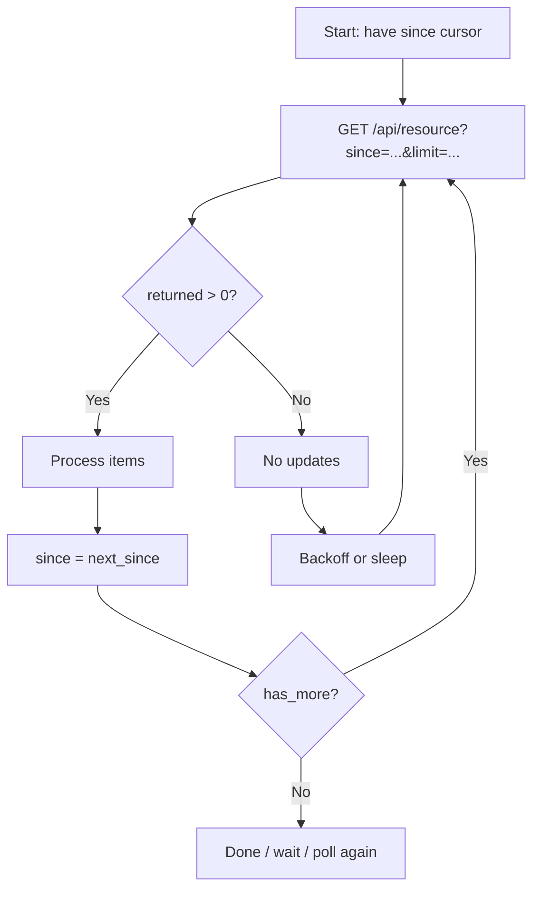

# ⏱️ Pagination Pattern: `since` (Incremental / “tail the stream”)

> [!NOTE]
> This is a **contract example** for KFM’s API boundary layer: a simple, audit-friendly way to fetch **new/updated records since a cursor** (perfect for real-time layers + incremental sync).

---

## 🗂️ File location

```text
📁 api/
  📁 contracts/
    📁 examples/
      📁 pagination/
        📁 since/
          📄 README.md   👈 you are here
```

---

## 🧠 What “since pagination” means

Instead of paging by `page=1,2,3` or `offset=…`, the client asks:

- “Give me everything **after** this cursor (`since`)”
- The server returns:
  - a page of results (**ordered**)
  - a **new cursor** to continue (`next_since`)
  - a small paging summary (`has_more`, `returned`, etc.)

This pattern is designed to work well with KFM’s **append-only / streaming** worldview: new observations arrive continually, and the UI keeps polling for updates (or a worker keeps syncing).

---

## ✅ When to use it (KFM fit)

Use `since` pagination when:

- 🛰️ You have **time-ordered** or **update-ordered** data (observations, events, telemetry, ingest logs, “recent changes” feeds).
- 🗺️ The UI needs a **live/rolling** map layer (poll every N seconds, fetch deltas).
- 🔁 You need **incremental replication** (sync from last watermark instead of re-downloading).
- 🧾 You want an audit-friendly “what did I fetch and when” story (cursor + page meta is provenance-friendly).

---

## 🚫 When NOT to use it

Avoid `since` pagination when:

- You need stable “page 7 of a filtered search” UX (use cursor/page pagination).
- You need random access to arbitrary slices of a huge dataset (use tiles, bbox queries, or dataset partitioning).
- Your underlying records can be **mutated retroactively** in-place (unless you page on a monotonic *ingested/update* cursor).

---

## 🧩 Contract at a glance

### Request

**Method:** `GET`  
**Path:** `GET /api/<resource>` (endpoint-specific)

**Query parameters**

| Parameter | Type | Required | Default | Notes |
|---|---:|:---:|---:|---|
| `since` | `string` | ✅ (for incremental polling) | — | **Opaque cursor** *returned by the API* (recommended). For bootstrapping, the server MAY accept an RFC3339 timestamp. |
| `limit` | `integer` | ❌ | `500` | Max items per page. Server should enforce a max (e.g., 5k). |
| `order` | `string` | ❌ | `asc` | Typically `asc` only for incremental reads. |
| `filters…` | varies | ❌ | — | Optional endpoint filters (bbox, routeId, stationId…). Filters apply **before** paging. |

> [!IMPORTANT]
> Clients should treat `since` as **opaque**. If you store anything long-term, store the server-issued `next_since`, not a locally generated timestamp.

---

### Response (JSON envelope)

**Status:** `200 OK`

```json
{
  "data": [
    {
      "id": "evt_01J2K2…",
      "cursor": "c_2026-01-24T18:45:12.345Z~evt_01J2K2…",
      "observed_at": "2026-01-24T18:45:12.345Z",
      "kind": "observation",
      "payload": {}
    }
  ],
  "page": {
    "since": "c_2026-01-24T18:44:00.000Z~evt_01J2K0…",
    "next_since": "c_2026-01-24T18:45:12.345Z~evt_01J2K2…",
    "limit": 500,
    "returned": 1,
    "has_more": false
  },
  "meta": {
    "as_of": "2026-01-24T18:45:13.002Z",
    "order": "asc",
    "cursor_field": "cursor",
    "provenance": {
      "activity": "prov_activity_id_optional",
      "bundle_ref": "data/prov/<optional_bundle_ref>.json"
    }
  }
}
```

#### Required semantics

- **Ordering:** Results MUST be ordered by the server’s cursor (e.g., `(cursor_time, id)`).
- **Exclusive bound:** Returned items MUST satisfy: `item.cursor > since`  
  (prevents duplicates when the client uses `next_since`)
- **Stable cursor:** `page.next_since` MUST equal the cursor of the **last item** in `data` when `returned > 0`.
- **Empty page behavior:** If `returned == 0`, server SHOULD echo `next_since == since` (or provide a stable cursor that does not move).

---

### GeoJSON flavor (for map layers)

For map endpoints, KFM often returns GeoJSON. GeoJSON allows **foreign members** at the top level, so we can attach paging metadata safely.

```json
{
  "type": "FeatureCollection",
  "features": [
    {
      "type": "Feature",
      "id": "bus_1042_obs_01J2K2…",
      "geometry": { "type": "Point", "coordinates": [-95.689, 39.056] },
      "properties": {
        "bus_id": "1042",
        "route_id": "7",
        "observed_at": "2026-01-24T18:45:12.345Z",
        "cursor": "c_2026-01-24T18:45:12.345Z~bus_1042_obs_01J2K2…",
        "source": {
          "dcat_dataset_id": "kfm.transport.transit_realtime",
          "stac_item_ref": "data/stac/items/transport/buses/…json"
        }
      }
    }
  ],
  "kfm:page": {
    "since": "c_2026-01-24T18:44:00.000Z~…",
    "next_since": "c_2026-01-24T18:45:12.345Z~bus_1042_obs_01J2K2…",
    "limit": 500,
    "returned": 1,
    "has_more": false
  },
  "kfm:meta": {
    "as_of": "2026-01-24T18:45:13.002Z",
    "order": "asc",
    "cursor_field": "properties.cursor"
  }
}
```

---

## 🔄 Client loop (how pagination actually works)



---

## 🧪 Examples (KFM-flavored)

### Example A — Real-time layer poll (Transit buses)

> The UI can poll for “new bus points since the last minute” and paint them on a live map layer.

```bash
curl -sS \
  "https://<kfm-host>/api/transport/buses?since=2026-01-24T18:44:00Z&limit=500" \
  -H "Accept: application/geo+json"
```

**Client behavior**
- Store `kfm:page.next_since` after each request.
- Next poll: call again with `since=<stored_next_since>`.

---

### Example B — Incremental metadata sync (datasets changed)

```bash
curl -sS \
  "https://<kfm-host>/api/datasets?since=c_2026-01-24T00:00:00.000Z~ds_0000&limit=250" \
  -H "Accept: application/json"
```

---

## 🧑‍💻 Minimal client code

### JavaScript (fetch)

```js
let since = "2026-01-24T18:44:00Z"; // bootstrap example

while (true) {
  const url = new URL("https://<kfm-host>/api/transport/buses");
  url.searchParams.set("since", since);
  url.searchParams.set("limit", "500");

  const res = await fetch(url.toString(), { headers: { "Accept": "application/geo+json" } });
  if (!res.ok) throw new Error(`HTTP ${res.status}`);

  const fc = await res.json();

  const page = fc["kfm:page"];
  const features = fc.features ?? [];

  // ✅ process features
  for (const f of features) {
    // draw/update marker
  }

  // ✅ advance cursor (even if 0 results, page.next_since should be stable)
  since = page.next_since;

  // ✅ if no more buffered pages, switch to polling/backoff
  if (!page.has_more) {
    await new Promise(r => setTimeout(r, 2000)); // simple poll
  }
}
```

### Python (requests)

```py
import time
import requests

since = "2026-01-24T18:44:00Z"

while True:
    r = requests.get(
        "https://<kfm-host>/api/datasets",
        params={"since": since, "limit": 250},
        headers={"Accept": "application/json"},
        timeout=30,
    )
    r.raise_for_status()
    payload = r.json()

    for item in payload.get("data", []):
        # ✅ process
        pass

    page = payload["page"]
    since = page["next_since"]

    if not page["has_more"]:
        time.sleep(5)
```

---

## 🛠️ Server implementation notes (recommended)

### 1) Cursor design 🧷

To avoid skipping records when multiple items share a timestamp:

- Build a cursor from a **monotonic ordering key**, typically:
  - `(cursor_time, id)` where `id` is stable + sortable (ULID works great)
- Encode it as an **opaque string** (recommended):
  - `base64url(json)` or a compact delimiter format like:  
    `c_<rfc3339>~<id>`

### 2) Query shape (SQL-ish)

```sql
SELECT *
FROM resource_table
WHERE (cursor_time, id) > (:since_time, :since_id)
  AND <optional_filters>
ORDER BY cursor_time ASC, id ASC
LIMIT :limit;
```

### 3) Indexing

- Add a btree composite index on `(cursor_time, id)` for fast “since” scans.
- If you also filter spatially, keep time index anyway; don’t rely only on GiST.

---

## 🔒 Governance + provenance expectations (KFM DNA)

> [!TIP]
> `since` pagination is easiest to govern because it’s deterministic and can be logged as “what the client read” without ambiguity.

What to enforce:

- 🧱 **API boundary**: UI/clients do **not** touch PostGIS/Neo4j directly (API is the redaction + policy layer).
- 🕵️ **Redaction-safe**: sensitive records may be omitted or generalized; clients must not infer “absence means none exist”.
- 🧾 **Provenance-friendly**: server MAY include lightweight `meta.provenance` pointers so downstream systems can tie reads to PROV bundles.

---

## 🧯 Edge cases & how to handle them

<details>
  <summary><strong>⌛ Retention windows (410 Gone)</strong></summary>

Real-time streams may be windowed. If `since` is older than what the endpoint retains:

- Server MAY return `410 Gone` with a payload describing:
  - earliest available cursor/time
  - a recommended re-bootstrap approach
</details>

<details>
  <summary><strong>🧊 Clock skew (why server-issued cursors win)</strong></summary>

If clients send local timestamps, skew can cause missed updates.  
Prefer: **always persist and reuse `next_since`** returned by the API.
</details>

<details>
  <summary><strong>🧹 De-duping</strong></summary>

Even with exclusive cursors, clients should de-dupe by `id` if:
- they run multiple workers, or
- they reprocess from checkpoints
</details>

---

## ✅ Implementation checklist (drop-in QA)

- [ ] Response is **strictly ordered** by cursor.
- [ ] Items satisfy `item.cursor > since` (exclusive).
- [ ] `next_since` equals last item cursor when `returned > 0`.
- [ ] Empty page does not advance the cursor unexpectedly.
- [ ] `limit` is enforced with server max.
- [ ] Filtering + cursor together produces deterministic results.
- [ ] Works with redaction (cursor still monotonic even if items omitted).
- [ ] Documented in OpenAPI (FastAPI) and tested.

---

## 🔗 Related (recommended patterns)

- 📌 **Cursor pagination** for stable UI “page N” lists (opaque cursor).
- 🧱 **Tiles / bbox** for map rendering at scale (vector tiles, raster tiles).
- 🔌 **WebSocket/SSE** for push (optional), still backed by `since` for replay.

---
