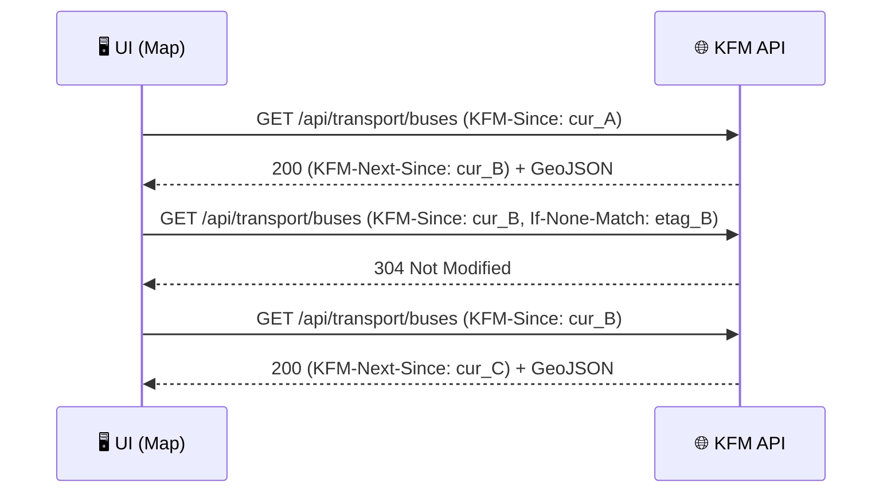

<!-- Badges -->


# Pagination (Since Cursor) via Headers 📮⏱️

📌 **This document is an example contract** for **incremental “since” pagination** using **HTTP headers** (instead of `?since=` query params).  
It’s designed for KFM-style real-time layers where the UI (or other clients) repeatedly fetches **only new observations** (e.g., bus locations, river gauges, sensor readings).

---

## 📁 Where this lives

```text
📦 repo-root/
└─ 📁 api/
   └─ 📁 contracts/
      └─ 📁 examples/
         └─ 📁 pagination/
            └─ 📁 since/
               └─ 📄 headers.md   ✅ (this file)
```

---

## 🧠 Why “since” + headers?

### ✅ What it solves
- **Fast map refresh**: fetch only data that changed since the last poll (great for “live layers”).  
- **Idempotent + resumable**: clients store a cursor and can recover after disconnects.  
- **Supports governance**: still works with provenance-first publishing + access controls.

> [!NOTE]
> KFM’s real-time integration concepts explicitly include polling patterns (e.g., a UI calling something like a transit endpoint “since” a timestamp) and optional push alternatives like WebSockets. This file focuses on the **polling** path.

### ⚠️ Why headers (instead of query params)?
- Keeps URLs stable (nice for tooling + routing).
- Lets you version/extend pagination behavior without changing routes.
- Works well when you want **multiple pagination dimensions** (since, limit, window) without URL explosion.

> [!IMPORTANT]
> If you paginate using **request headers**, caches/proxies must respect it:
> - Server SHOULD set `Vary: KFM-Since, KFM-Limit, Authorization` (as applicable).
> - Browser clients MUST have `Access-Control-Expose-Headers` for custom response headers.

---

## 🧩 Core idea (TL;DR)

1) Client requests with a **cursor**:
- `KFM-Since: <cursor>`

2) Server returns:
- `KFM-Next-Since: <cursor>` (the new cursor to use next time)
- plus the response body (new observations)

3) Client repeats using `KFM-Next-Since` from the previous response.

---

## 📘 Definitions

| Term | Meaning |
|---|---|
| **Observation** | A single time-stamped record (e.g., “bus position at time T”). |
| **Cursor / Since token** | Opaque string representing “everything **after** this point”. |
| **Monotonic cursor** | Always moves forward. Prevents missed/duplicate pages even when timestamps collide. |
| **Append-only stream** | Records aren’t silently rewritten; new records are added over time. |

> [!TIP]
> Treat the `KFM-Next-Since` value as **opaque**.  
> Even if it looks like an ISO timestamp, don’t parse it—just store and replay.

---

## ✅ Contract requirements

### 1) Request headers

| Header | Required | Type | Example | Meaning |
|---|---:|---|---|---|
| `KFM-Since` | ❌ | string | `2026-01-24T20:15:00.000Z` or `cur_01HNX…` | Cursor representing “start after this point”. Omit for first request. |
| `KFM-Limit` | ❌ | integer | `500` | Max number of observations to return. |
| `If-None-Match` | ❌ | string | `"etag_abc123"` | Standard conditional request (optional optimization). |
| `If-Modified-Since` | ❌ | HTTP-date | `Sat, 24 Jan 2026 20:15:00 GMT` | Standard conditional request (optional optimization). |
| `Accept` | ✅ | string | `application/geo+json` | Response format requested. |

#### Recommended defaults
- If `KFM-Since` is omitted: return **latest snapshot window**, or **last N minutes**, depending on endpoint semantics.
- If `KFM-Limit` is omitted: server uses a safe default (e.g., 250–1000).
- Server MUST enforce an upper bound on `KFM-Limit`.

---

### 2) Response headers

| Header | Required | Type | Example | Meaning |
|---|---:|---|---|---|
| `KFM-Next-Since` | ✅ (200/206) | string | `cur_01HNX…` | Cursor the client MUST use next. |
| `KFM-Returned` | ✅ (200/206) | integer | `217` | Count of items returned in body. |
| `KFM-Has-More` | ❌ | boolean | `true` | If `true`, client should immediately request again (same endpoint) using `KFM-Next-Since`. |
| `ETag` | ❌ | string | `"etag_def456"` | Standard cache validator for this response. |
| `Last-Modified` | ❌ | HTTP-date | `Sat, 24 Jan 2026 20:15:59 GMT` | Standard cache timestamp. |
| `Vary` | ✅ | string | `KFM-Since, KFM-Limit, Authorization` | Ensures caches key correctly. |
| `Access-Control-Expose-Headers` | ✅ (browser) | string | `KFM-Next-Since, KFM-Returned, KFM-Has-More, ETag, Last-Modified` | Enables JS to read custom headers. |
| `Cache-Control` | ❌ | string | `no-store` or `private, max-age=0, must-revalidate` | Choose based on sensitivity + performance strategy. |
| `KFM-Provenance-Activity` | ❌ | string | `prov_act_8f3c…` | Links this response to a PROV activity record (recommended for evidence-first flows). |
| `KFM-Classification` | ❌ | string | `public` / `restricted` | The effective classification of this response payload. |

> [!NOTE]
> KFM’s governance model emphasizes provenance and classification. When feasible, returning a lightweight provenance activity ID in a header makes it easy to trace “what produced this view?” without bloating response bodies.

---

## 📦 Response body shape (recommended)

### Option A: GeoJSON FeatureCollection (map-friendly 🗺️)

```json
{
  "type": "FeatureCollection",
  "features": [
    {
      "type": "Feature",
      "id": "obs_bus_903814",
      "geometry": { "type": "Point", "coordinates": [-95.675, 39.049] },
      "properties": {
        "observed_at": "2026-01-24T20:15:12.345Z",
        "vehicle_id": "bus_12",
        "route_id": "R3",
        "speed_mps": 8.2,
        "source": "GTFS-RT"
      }
    }
  ]
}
```

### Option B: JSON array (non-geo endpoints)

```json
{
  "items": [
    { "id": "obs_1", "observed_at": "2026-01-24T20:15:12.345Z", "value": 4.2 }
  ]
}
```

---

## 🔁 Ordering + cursor semantics

### Ordering (server MUST)
- Sort ascending by:
  1) cursor-time (server-defined; usually ingestion time)
  2) stable tie-breaker (e.g., observation id)

### Cursor semantics (server MUST)
- `KFM-Next-Since` MUST advance the cursor to the **last returned record** (including tie-breaker).
- Requests using `KFM-Since` MUST return only records **strictly after** that cursor.
- Cursor MUST be safe under timestamp collisions (multiple records at same time).

### Client behavior (client SHOULD)
- Treat cursor as opaque.
- Persist cursor after successful processing.
- Handle duplicates safely (idempotent processing).

---

## 🧯 Error & edge-case behavior

| Status | When | Body | Headers |
|---:|---|---|---|
| `200 OK` | Results returned (may be empty) | ✅ | `KFM-Next-Since` included |
| `204 No Content` | No new results (alternative to 200-empty) | ❌ | MAY omit cursor (but consistent behavior is better) |
| `304 Not Modified` | Conditional GET indicates no change | ❌ | MUST still include validators (`ETag` / `Last-Modified`) |
| `400 Bad Request` | Invalid cursor format / limit out of range | ✅ (problem+json) | MAY include hints |
| `401/403` | Auth required / insufficient | ✅ | — |
| `410 Gone` | Cursor too old (retention window exceeded) | ✅ | SHOULD include a reset instruction (see below) |
| `429 Too Many Requests` | Rate limited | ✅ | SHOULD include `Retry-After` |

### Cursor too old (retention exceeded)
If the system purges historical observations:
- Respond `410 Gone`
- Include `KFM-Reset-Since: <new-start-cursor>` OR instruct the client to drop cursor and re-sync.

> [!TIP]
> This is especially helpful for “live” datasets that keep only a rolling window.

---

## 🧪 Example 1 — First request (no cursor)

<details>
<summary><strong>Raw HTTP</strong> (click to expand) 📬</summary>

```http
GET /api/transport/buses HTTP/1.1
Host: kfm.local
Accept: application/geo+json
KFM-Limit: 500
```

```http
HTTP/1.1 200 OK
Content-Type: application/geo+json
KFM-Returned: 217
KFM-Next-Since: cur_01HNXB9F1Y2ZK7A6B4Q3T8M9N0
KFM-Has-More: false
ETag: "etag_def456"
Last-Modified: Sat, 24 Jan 2026 20:15:59 GMT
Vary: KFM-Since, KFM-Limit, Authorization
Access-Control-Expose-Headers: KFM-Next-Since, KFM-Returned, KFM-Has-More, ETag, Last-Modified
Cache-Control: private, max-age=0, must-revalidate

{ "type": "FeatureCollection", "features": [ /* 217 features */ ] }
```
</details>

✅ Client stores `KFM-Next-Since` for the next poll.

---

## 🧪 Example 2 — Next request (incremental)

```http
GET /api/transport/buses HTTP/1.1
Host: kfm.local
Accept: application/geo+json
KFM-Since: cur_01HNXB9F1Y2ZK7A6B4Q3T8M9N0
KFM-Limit: 500
If-None-Match: "etag_def456"
```

### If nothing changed → 304
```http
HTTP/1.1 304 Not Modified
ETag: "etag_def456"
Last-Modified: Sat, 24 Jan 2026 20:15:59 GMT
Vary: KFM-Since, KFM-Limit, Authorization
Access-Control-Expose-Headers: KFM-Next-Since, KFM-Returned, KFM-Has-More, ETag, Last-Modified
```

### If changed → 200 with updates
```http
HTTP/1.1 200 OK
Content-Type: application/geo+json
KFM-Returned: 12
KFM-Next-Since: cur_01HNXBCT0R5H4Q0Y0A2S8E2P1K
ETag: "etag_0aa111"
Last-Modified: Sat, 24 Jan 2026 20:16:59 GMT
Vary: KFM-Since, KFM-Limit, Authorization
Access-Control-Expose-Headers: KFM-Next-Since, KFM-Returned, KFM-Has-More, ETag, Last-Modified

{ "type": "FeatureCollection", "features": [ /* 12 features */ ] }
```

---

## 🧪 Example 3 — Backlog paging (Has-More)

If there are more than `KFM-Limit` records available since the cursor:

```http
HTTP/1.1 200 OK
KFM-Returned: 500
KFM-Has-More: true
KFM-Next-Since: cur_01HNX...
```

Client SHOULD immediately request again:

```http
GET /api/transport/buses
KFM-Since: cur_01HNX...
KFM-Limit: 500
```

> [!NOTE]
> This is “pagination forward” through a backlog, without exposing page numbers.

---

## 🧰 Browser fetch example (reading response headers)

```js
const res = await fetch("/api/transport/buses", {
  headers: {
    "Accept": "application/geo+json",
    "KFM-Since": localStorage.getItem("kfm_cursor") ?? "",
    "KFM-Limit": "500",
  }
});

if (res.status === 304) {
  console.log("No changes.");
  return;
}

const next = res.headers.get("KFM-Next-Since");
if (next) localStorage.setItem("kfm_cursor", next);

const geojson = await res.json();
// render geojson...
```

> [!IMPORTANT]
> To make `res.headers.get("KFM-Next-Since")` work in browsers, server MUST set:
> `Access-Control-Expose-Headers: KFM-Next-Since, ...`

---

## 🧭 Provenance + governance hooks (recommended)

KFM emphasizes provenance-first publication and auditable ingestion. For streaming endpoints:

- Each response SHOULD be traceable to a provenance activity (compact ID in header).
- API MUST respect dataset classifications (omit/aggregate sensitive records for unauthorized users).
- API SHOULD log access telemetry for rate control & governance.

Suggested headers:
- `KFM-Provenance-Activity: prov_act_<id>`
- `KFM-Classification: public|restricted`
- `KFM-Source-Dataset: dcat_<id>` (optional convenience)

---

## 🔒 Privacy & safety considerations

Even “processed” outputs can leak sensitive information if queried repeatedly.

Recommended mitigations:
- Access control on sensitive layers (auth + roles).
- Rate limits for “dump-like” patterns.
- Spatial/temporal generalization for public views when needed (blur, aggregate, delay).
- Query auditing/inference control for high-risk endpoints (especially derived analytics endpoints).

---

## 🏗️ Implementation notes (server-side)

### Cursor encoding (recommended)
Use an opaque token encoding:
- `cursor_time` (monotonic)
- `last_id` (tie-breaker)
- optional dataset partition key

Example (conceptual):
- `cur_<base64url(cursor_time + ":" + last_id)>`

### PostGIS query pattern (conceptual)
```sql
SELECT *
FROM transit_observations
WHERE (cursor_time, id) > (:cursor_time, :id)
ORDER BY cursor_time ASC, id ASC
LIMIT :limit;
```

### GeoJSON generation
- Prefer server-side GeoJSON generation for map layers.
- Consider `ST_AsGeoJSON(...)` and efficient indexes.
- Ensure stable feature IDs for dedupe on the client.

---

## 🧾 OpenAPI snippet (illustrative)

```yaml
paths:
  /api/transport/buses:
    get:
      summary: "Live bus positions (incremental)"
      parameters:
        - in: header
          name: KFM-Since
          required: false
          schema: { type: string }
          description: "Opaque cursor; return observations strictly after this cursor."
        - in: header
          name: KFM-Limit
          required: false
          schema: { type: integer, minimum: 1, maximum: 5000 }
      responses:
        "200":
          description: "New observations since cursor"
          headers:
            KFM-Next-Since:
              schema: { type: string }
            KFM-Returned:
              schema: { type: integer }
            KFM-Has-More:
              schema: { type: boolean }
            Vary:
              schema: { type: string }
            Access-Control-Expose-Headers:
              schema: { type: string }
```

---

## 🧬 Mermaid sequence diagram (polling loop)



---

## 🔗 Related patterns (sibling examples)

- ✅ **Query param style** (alternate): `?since=<cursor>`  
- ✅ **Link header pagination**: `Link: <...>; rel="next"`  
- ✅ **Push**: WebSockets/SSE for high-frequency streams

> [!NOTE]
> This file focuses on headers. If you implement both headers + query-param forms, define a clear precedence rule (e.g., header wins).

---

## 📚 Project reference library (all project files)

### Core KFM documents 🧭
- 📘 Kansas Frontier Matrix (KFM) – Comprehensive Technical Documentation.pdf
- 🧱 Kansas Frontier Matrix (KFM) – Comprehensive Architecture, Features, and Design.pdf
- 🧭🤖 Kansas Frontier Matrix (KFM) – AI System Overview 🧭🤖.pdf
- 🧩 Kansas Frontier Matrix – Comprehensive UI System Overview.pdf
- 📚 Kansas Frontier Matrix (KFM) Data Intake – Technical & Design Guide.pdf
- 🌟 Kansas Frontier Matrix – Latest Ideas & Future Proposals.docx.pdf
- 💡 Innovative Concepts to Evolve the Kansas Frontier Matrix (KFM).pdf
- ➕ Additional Project Ideas.pdf
- 🗺️ Kansas-Frontier-Matrix- Open-Source Geospatial Historical Mapping Hub Design.pdf

### Documentation & writing standards ✍️
- 🧾 Comprehensive Markdown Guide_ Syntax, Extensions, and Best Practices.docx
- 🧾 MARKDOWN_GUIDE_v13.md.gdoc
- 🧪 Scientific Method _ Research _ Master Coder Protocol Documentation.pdf

### External/reference libraries 📦 (PDF portfolios)
- 🤖 AI Concepts & more.pdf
- 🗺️ Maps-GoogleMaps-VirtualWorlds-Archaeological-Computer Graphics-Geospatial-webgl.pdf
- 🧰 Various programming langurages & resources 1.pdf
- 🗃️ Data Managment-Theories-Architures-Data Science-Baysian Methods-Some Programming Ideas.pdf

### Practical implementation references 🧰
- 🐍 KFM- python-geospatial-analysis-cookbook-over-60-recipes-to-work-with-topology-overlays-indoor-routing-and-web-application-analysis-with-python.pdf
- 🛡️ Data Mining Concepts & applictions.pdf

---

## ✅ Checklist (when implementing this contract)

- [ ] Cursor is opaque + monotonic
- [ ] Stable ordering with tie-breaker
- [ ] CORS exposes `KFM-Next-Since` (browser clients)
- [ ] `Vary` includes pagination headers (if caching is enabled)
- [ ] Rate limits for heavy endpoints
- [ ] Classification respected (omit/aggregate sensitive results)
- [ ] Provenance activity linkage available for audits

---
