# 🧾 PROV Examples — KFM Evidence Lineage Contracts  
`api/contracts/examples/prov/`


> ✅ **Goal:** give KFM *contract-grade* PROV examples that are used as **fixtures** for schema validation + **policy gates**, and as **reference patterns** for building provenance into pipelines, the knowledge graph, and Focus Mode citations.

---

## 🧭 Why this folder exists

KFM is **evidence-first**: nothing becomes “real” in the platform until it’s cataloged and traceable.  
That means **every published artifact** (datasets, tiles, features, models, AI answers, story nodes, streaming ticks…) must have:

- 🛰️ **STAC** for spatial/asset indexing  
- 📚 **DCAT** for discovery/catalog metadata  
- 🧾 **PROV** for lineage (“How did we get here?”)

This folder contains **canonical example PROV documents** aligned with the **KFM PROV profile** (versioned), so:

- CI can fail fast with deterministic messages (e.g., `KFM-PROV-001`)  
- The Neo4j evidence graph never gets “mystery nodes”  
- The UI can surface “Source / Produced by / Used inputs” in a provenance panel  
- Focus Mode can *always* cite sources, or refuse when it can’t 🔒

---

## 🗂️ Expected layout

> This folder is intentionally “examples-first”. Even if the example files don’t exist yet, this README defines the **expected suite**.

```text
📁 api/contracts/examples/prov/
├─ 📄 README.md
├─ 🧾 ingest_run.prov.json                 # raw → processed (ETL / pipeline run)
├─ 🛰️ stac_linkage.prov.json               # STAC/DCAT/PROV cross-links
├─ 🤖 focus_answer.prov.json               # AI answer w/ cited inputs (incl. real-time reads)
├─ 🧠 story_node.prov.json                 # narrative evidence manifest + provenance edges
├─ ⏱️ streaming_tick.prov.json             # immutable time-slice update (sensor / live feed)
├─ 📦 oci_artifact.prov.json               # OCI artifact + signature/attestation references
└─ 🧬 devops_pr.prov.jsonld (optional)     # GitHub PR → PROV graph integration
```

---

## 🧱 The KFM provenance model (contract summary)

### 🔺 PROV basics (KFM uses these exactly)
- **prov:Entity** → “a thing” (raw file, processed output, STAC item, DCAT dataset, model artifact, AI answer, story doc…)
- **prov:Activity** → “a process” (ingest run, transform, model inference, merge PR, publish-to-registry…)
- **prov:Agent** → “who/what did it” (person, CI bot, pipeline container, Focus Mode service)

### 🔗 Core relations you should always expect
- `prov:used` → activity used an entity  
- `prov:wasGeneratedBy` → entity was generated by an activity  
- `prov:wasDerivedFrom` → output derived from input  
- `prov:wasAssociatedWith` → activity associated with agent(s)

> 🧠 **KFM contract intuition:** If an output exists, we must be able to walk backward to raw evidence *and* identify the pipeline + version + agent chain.

---

## 🧬 Evidence triplet alignment (DCAT ⇄ STAC ⇄ PROV)

KFM treats metadata like code. The three catalogs must cross-reference each other so the graph can stay **fully connected**.

```mermaid
flowchart LR
  Raw[📥 Raw Evidence<br/>immutable bytes] -->|prov:used| Run[⚙️ prov:Activity<br/>pipeline run]
  Run -->|prov:wasGeneratedBy| Proc[✅ Processed Artifact]
  Proc --> STAC[🛰️ STAC Item/Collection]
  Proc --> DCAT[📚 DCAT Dataset/Distribution]
  Run --> Graph[🕸️ Neo4j Evidence Graph]
  Graph --> UI[🗺️ UI Provenance Panel]
  Graph --> AI[🤖 Focus Mode Citations]
```



### ✅ Cross-linking rules (practical)
- **STAC → PROV:** STAC Item properties should reference the PROV activity ID (or a resolvable run/version pointer).  
- **DCAT → STAC + PROV:** DCAT distributions should link to STAC endpoints/assets *and* the PROV record (or registry referrer that contains it).  
- **Graph mirror:** Neo4j nodes should retain catalog IDs so everything is retrievable and auditable.

---

## 🚦 Quality gates (fail closed)

KFM enforces gates at **ingestion**, **AI inference**, and **publication**. Minimum set includes:

- ✅ Schema validation (examples must conform to the KFM PROV profile)
- ✅ STAC/DCAT/PROV completeness (no missing lineage)
- ✅ License presence (DCAT)
- ✅ Sensitivity/classification tagging (respect CARE + privacy)
- ✅ Provenance completeness (all inputs + steps declared)
- ✅ AI outputs **must include citations** (or refuse)

### 🧨 Common failure you should design around
- `KFM-PROV-001`: **Processed data changed without matching PROV update**  
  → If bytes change (or an asset digest changes), your PROV must change too.

---

## 🏷️ ID + naming conventions (recommended)

> Keep IDs **stable**, **resolvable**, and **copy/paste-friendly** in CI logs.

**Suggested pattern**
- Entities: `kfm:entity/<domain>/<name>@<digest-or-version>`
- Activities: `kfm:activity/<pipeline>/<run_id>`
- Agents: `kfm:agent/<type>/<name>`

**Always capture (at minimum)**
- `prov:label` (human readable)
- `prov:type` (KFM-specific type tags are fine)
- A stable dataset ID (`kfm:dataset_id`) when applicable
- `kfm:classification` (public/internal/restricted) if the artifact could be sensitive
- Hashes/digests where possible (`kfm:sha256`, OCI digest, etc.)
- Pipeline identity: script path, container image digest, git commit/tag

---

## 🧾 Example suite (copy/paste fixtures)

> Each example is **small**, **complete**, and suitable as a CI fixture.  
> Use `<details>` blocks so the README stays readable.

---

<details>
<summary><strong>🧾 Example 1 — Ingest run (raw → processed → catalog)</strong></summary>

```json
{
  "prefix": {
    "prov": "http://www.w3.org/ns/prov#",
    "kfm": "https://kansasfrontiermatrix.org/ns#",
    "xsd": "http://www.w3.org/2001/XMLSchema#"
  },

  "entity": {
    "kfm:entity/raw/usgs_nwis/station-06889500@sha256:RAW123": {
      "prov:label": "USGS NWIS station 06889500 reading dump (as received)",
      "prov:type": "kfm:RawEvidence",
      "kfm:sha256": "RAW123",
      "kfm:dataset_id": "kfm.dataset.usgs.nwis.station-06889500",
      "kfm:classification": "public",
      "kfm:source_uri": "https://waterdata.usgs.gov/",
      "kfm:received_at": "2026-01-18T20:00:00Z"
    },

    "kfm:entity/processed/river_gauge@sha256:PROC456": {
      "prov:label": "Processed river gauge parquet (normalized, validated)",
      "prov:type": "kfm:ProcessedArtifact",
      "kfm:sha256": "PROC456",
      "kfm:dataset_id": "kfm.dataset.river_gauge.latest",
      "kfm:classification": "public",
      "kfm:format": "application/parquet"
    },

    "kfm:entity/stac/item/river_gauge_2026-01-18": {
      "prov:label": "STAC Item — river_gauge_2026-01-18",
      "prov:type": "kfm:STACItem",
      "kfm:stac_id": "river_gauge_2026-01-18"
    },

    "kfm:entity/dcat/dataset/usgs_nwis_river_gauges": {
      "prov:label": "DCAT Dataset — USGS Real-time Water Data (KFM view)",
      "prov:type": "kfm:DCATDataset",
      "kfm:dcat_id": "usgs_nwis_river_gauges"
    }
  },

  "activity": {
    "kfm:activity/pipelines/river_gauge/ingest@run:2026-01-18T20:00Z": {
      "prov:label": "Ingest USGS NWIS → normalize → publish",
      "prov:type": "kfm:IngestRun",
      "prov:startTime": "2026-01-18T20:00:00Z",
      "prov:endTime": "2026-01-18T20:02:41Z",
      "kfm:pipeline_path": "pipelines/river_gauge/ingest.py",
      "kfm:git_commit": "abcdef1234567890",
      "kfm:container_image": "ghcr.io/kfm/pipelines/river_gauge@sha256:IMG999",
      "kfm:idempotency_key": "usgs_nwis:06889500:2026-01-18T20:00Z"
    }
  },

  "agent": {
    "kfm:agent/software/github_actions": {
      "prov:label": "GitHub Actions (KFM CI)",
      "prov:type": "prov:SoftwareAgent"
    }
  },

  "used": {
    "kfm:rel/used/raw1": {
      "prov:activity": "kfm:activity/pipelines/river_gauge/ingest@run:2026-01-18T20:00Z",
      "prov:entity": "kfm:entity/raw/usgs_nwis/station-06889500@sha256:RAW123"
    }
  },

  "wasGeneratedBy": {
    "kfm:rel/gen/processed1": {
      "prov:entity": "kfm:entity/processed/river_gauge@sha256:PROC456",
      "prov:activity": "kfm:activity/pipelines/river_gauge/ingest@run:2026-01-18T20:00Z",
      "prov:time": "2026-01-18T20:02:41Z"
    }
  },

  "wasDerivedFrom": {
    "kfm:rel/derived/1": {
      "prov:generatedEntity": "kfm:entity/processed/river_gauge@sha256:PROC456",
      "prov:usedEntity": "kfm:entity/raw/usgs_nwis/station-06889500@sha256:RAW123"
    }
  },

  "wasAssociatedWith": {
    "kfm:rel/assoc/ci": {
      "prov:activity": "kfm:activity/pipelines/river_gauge/ingest@run:2026-01-18T20:00Z",
      "prov:agent": "kfm:agent/software/github_actions"
    }
  }
}
```

✅ Why this is “KFM-ready”
- Raw bytes are preserved (immutability boundary)  
- Deterministic run identity (idempotency key)  
- Output has a digest + dataset_id + classification  
- Run carries pipeline + git + image identity  

</details>

---

<details>
<summary><strong>🤖 Example 2 — Focus Mode answer provenance (real-time query)</strong></summary>

> Focus Mode can answer using dynamic queries (e.g., latest station reading) **but still logs PROV** capturing the exact timestamped input entity that was used.

```json
{
  "prefix": {
    "prov": "http://www.w3.org/ns/prov#",
    "kfm": "https://kansasfrontiermatrix.org/ns#"
  },

  "entity": {
    "kfm:entity/reading/usgs_nwis/06889500@2026-01-18T20:00:00Z": {
      "prov:label": "USGS NWIS latest reading (station 06889500 @ 2026-01-18T20:00Z)",
      "prov:type": "kfm:Observation",
      "kfm:dataset_id": "kfm.dataset.usgs.nwis.station-06889500",
      "kfm:classification": "public",
      "kfm:value": "12.34",
      "kfm:units": "ft",
      "kfm:observed_at": "2026-01-18T20:00:00Z"
    },

    "kfm:entity/ai_answer/focus_mode@ans:3f0a3e": {
      "prov:label": "Focus Mode answer: water level at Topeka (station 06889500)",
      "prov:type": "kfm:AIAnswer",
      "kfm:classification": "public",
      "kfm:answer_format": "text/markdown"
    }
  },

  "activity": {
    "kfm:activity/focus_mode/answer@run:3f0a3e": {
      "prov:label": "Focus Mode inference + citation assembly",
      "prov:type": "kfm:AIInference",
      "prov:startTime": "2026-01-18T20:03:10Z",
      "prov:endTime": "2026-01-18T20:03:13Z",
      "kfm:model": "kfm.focus_mode.vX",
      "kfm:retrieval_policy": "citations_required"
    }
  },

  "agent": {
    "kfm:agent/software/focus_mode": {
      "prov:label": "KFM Focus Mode Service",
      "prov:type": "prov:SoftwareAgent"
    }
  },

  "used": {
    "kfm:rel/used/reading": {
      "prov:activity": "kfm:activity/focus_mode/answer@run:3f0a3e",
      "prov:entity": "kfm:entity/reading/usgs_nwis/06889500@2026-01-18T20:00:00Z"
    }
  },

  "wasGeneratedBy": {
    "kfm:rel/gen/answer": {
      "prov:entity": "kfm:entity/ai_answer/focus_mode@ans:3f0a3e",
      "prov:activity": "kfm:activity/focus_mode/answer@run:3f0a3e",
      "prov:time": "2026-01-18T20:03:13Z"
    }
  },

  "wasAssociatedWith": {
    "kfm:rel/assoc/focus": {
      "prov:activity": "kfm:activity/focus_mode/answer@run:3f0a3e",
      "prov:agent": "kfm:agent/software/focus_mode"
    }
  }
}
```

✅ Why this matters
- Even “live” answers are traceable to the *specific* reading entity used  
- Enables audit: “What did the AI see?”  
- Supports policy: citations required or refuse  

</details>

---

<details>
<summary><strong>⏱️ Example 3 — Streaming tick as immutable time-slice dataset</strong></summary>

> KFM treats streaming data as “many small datasets over time” — each tick is a new immutable item with provenance, so users can replay history.

```json
{
  "entity": {
    "kfm:entity/stream_tick/river_gauge@2026-01-18T21:00:00Z": {
      "prov:label": "River gauge tick @ 2026-01-18T21:00Z",
      "prov:type": "kfm:StreamingTick",
      "kfm:classification": "public"
    }
  },
  "activity": {
    "kfm:activity/watchers/usgs_nwis/poll@2026-01-18T21:00:00Z": {
      "prov:label": "Watcher poll (ETag-aware) + normalize + append",
      "prov:type": "kfm:WatcherRun",
      "prov:startTime": "2026-01-18T21:00:00Z",
      "prov:endTime": "2026-01-18T21:00:02Z"
    }
  },
  "agent": {
    "kfm:agent/software/watcher": {
      "prov:label": "KFM Watcher (Planner/Executor governed)",
      "prov:type": "prov:SoftwareAgent"
    }
  },
  "wasGeneratedBy": {
    "kfm:rel/gen/tick": {
      "prov:entity": "kfm:entity/stream_tick/river_gauge@2026-01-18T21:00:00Z",
      "prov:activity": "kfm:activity/watchers/usgs_nwis/poll@2026-01-18T21:00:00Z",
      "prov:time": "2026-01-18T21:00:02Z"
    }
  },
  "wasAssociatedWith": {
    "kfm:rel/assoc/watcher": {
      "prov:activity": "kfm:activity/watchers/usgs_nwis/poll@2026-01-18T21:00:00Z",
      "prov:agent": "kfm:agent/software/watcher"
    }
  }
}
```

</details>

---

<details>
<summary><strong>📦 Example 4 — OCI artifact + signature/attestation references</strong></summary>

> KFM can store big artifacts (tilesets, models, bundles) in an OCI registry (ORAS) and attach signatures/attestations (Cosign). PROV becomes part of the chain-of-custody.

```json
{
  "entity": {
    "kfm:entity/oci/artifact/tileset@sha256:AAA111": {
      "prov:label": "3D tileset artifact (OCI) — pulled by digest",
      "prov:type": "kfm:OCIArtifact",
      "kfm:oci_ref": "ghcr.io/kfm/artifacts/tileset@sha256:AAA111",
      "kfm:classification": "public",
      "kfm:cosign_referrer": "oci://.../sha256:AAA111?referrer=cosign.sig"
    }
  },
  "activity": {
    "kfm:activity/publish/oci@run:bbb222": {
      "prov:label": "Publish artifact to OCI registry (ORAS push) + sign",
      "prov:type": "kfm:PublishRun"
    }
  },
  "agent": {
    "kfm:agent/software/ci": {
      "prov:label": "KFM CI Publisher",
      "prov:type": "prov:SoftwareAgent"
    }
  },
  "wasGeneratedBy": {
    "kfm:rel/gen/oci": {
      "prov:entity": "kfm:entity/oci/artifact/tileset@sha256:AAA111",
      "prov:activity": "kfm:activity/publish/oci@run:bbb222"
    }
  },
  "wasAssociatedWith": {
    "kfm:rel/assoc/ci": {
      "prov:activity": "kfm:activity/publish/oci@run:bbb222",
      "prov:agent": "kfm:agent/software/ci"
    }
  }
}
```

</details>

---

<details>
<summary><strong>🧬 Example 5 — DevOps PR → PROV graph (optional JSON-LD)</strong></summary>

> Treating code history as provenance tightens the link between **platform evolution** and **data lineage**.

```json
{
  "@context": "https://www.w3.org/ns/prov.jsonld",
  "@id": "kfm:bundle/devops/pr/1234",
  "@type": "prov:Bundle",

  "prov:activity": {
    "kfm:activity/devops/pr/1234": {
      "prov:label": "GitHub PR #1234: update river gauge pipeline",
      "prov:type": "kfm:PullRequest"
    }
  },

  "prov:entity": {
    "kfm:entity/git/commit/abcdef": {
      "prov:label": "Commit abcdef (pipeline fix)",
      "prov:type": "kfm:Commit"
    },
    "kfm:entity/git/commit/merge123": {
      "prov:label": "Merge commit merge123",
      "prov:type": "kfm:MergeCommit"
    }
  },

  "prov:agent": {
    "kfm:agent/person/alice": {
      "prov:label": "Alice (author)",
      "prov:type": "prov:Person"
    },
    "kfm:agent/person/bob": {
      "prov:label": "Bob (reviewer)",
      "prov:type": "prov:Person"
    },
    "kfm:agent/software/ci": {
      "prov:label": "CI bot",
      "prov:type": "prov:SoftwareAgent"
    }
  },

  "prov:used": [
    {
      "prov:activity": "kfm:activity/devops/pr/1234",
      "prov:entity": "kfm:entity/git/commit/abcdef"
    }
  ],

  "prov:wasAssociatedWith": [
    { "prov:activity": "kfm:activity/devops/pr/1234", "prov:agent": "kfm:agent/person/alice" },
    { "prov:activity": "kfm:activity/devops/pr/1234", "prov:agent": "kfm:agent/software/ci" }
  ],

  "prov:wasGeneratedBy": [
    {
      "prov:entity": "kfm:entity/git/commit/merge123",
      "prov:activity": "kfm:activity/devops/pr/1234"
    }
  ]
}
```

</details>

---

## ✅ Validation & CI usage (how these examples are used)

### 1) Schema validation
These examples should validate against the **KFM PROV profile** (versioned).  
If you change examples, update the profile tests accordingly.

### 2) Policy pack checks (OPA/Conftest)
Examples should also pass governance checks, including:
- No missing provenance edges
- No processed artifact without derivation chain
- Classification present when required
- No “mystery artifacts” bypassing catalogs

### 3) Graph ingestion sanity
Examples should be ingestible into Neo4j without producing orphans:
- No PROV Activity with zero `used` / `wasGeneratedBy`
- No STAC Item without dataset linkage
- No DCAT Dataset without distribution links

---

## 🗺️ UI + API integration notes

### 🧩 UI (provenance panel / layer inspector)
A good PROV record powers UI features like:
- “Source: …” in legend/popup
- “Produced by: pipeline run …”
- “Inputs: …”
- “License/classification: …”
- “Why can’t I see exact coordinates?” (sensitivity redaction + CARE)

### 🛡️ API enforcement
The API layer is the control point:
- It enforces classification & redaction (no direct DB access from UI)
- It serves provenance + citations for Focus Mode responses
- It prevents bypassing governance by “hard-coding” artifacts in the UI

---

## 🧑‍💻 Adding a new PROV example (contributor checklist)

- [ ] Pick a real KFM use-case (pipeline, story, model, stream, artifact publish)
- [ ] Start with **Entity / Activity / Agent**, then add the minimal relation set:
  - [ ] `used`
  - [ ] `wasGeneratedBy`
  - [ ] `wasDerivedFrom`
  - [ ] `wasAssociatedWith`
- [ ] Include hashes/digests where possible (or stub clearly)
- [ ] Add classification + license linkage (where applicable)
- [ ] Ensure it can be mirrored into Neo4j without orphans
- [ ] Run contract validation + policy checks (fail closed)

---

## 🧠 FAQ (fast answers)

**Q: Do we store PROV in Git, the registry, or the graph?**  
A: All three can be true: Git for auditability, registry as artifact referrer (for big binaries), and Neo4j as the queryable evidence graph.

**Q: What about sensitive datasets?**  
A: Include `kfm:classification` and ensure the API/UI respects it (generalize locations, restrict access, or omit).

**Q: Can AI generate artifacts?**  
A: Yes — but AI outputs must be cataloged (STAC/DCAT where applicable) and traced in PROV with explicit inputs, method, parameters, and confidence metadata.

**Q: Why include DevOps PR provenance?**  
A: So we can answer: “Which code version produced this dataset, and who reviewed it?” — and enforce invariants in CI.

---

## 🔗 Handy references (non-exhaustive)
- W3C PROV overview: https://www.w3.org/TR/prov-overview/
- PROV-JSON: https://www.w3.org/Submission/prov-json/
- PROV-JSONLD: https://www.w3.org/Submission/prov-jsonld/
- STAC: https://stacspec.org/
- DCAT: https://www.w3.org/TR/vocab-dcat-3/

---

🎯 If you only remember one thing: **No evidence → no publish.**  
In KFM, provenance isn’t an afterthought — it’s the contract.
