# 🔁 `_shared` — Shared Request Building Blocks (KFM API Contracts)


> **You are here:** `api/contracts/examples/requests/_shared/README.md` 📍 
> This folder contains **reusable request fragments** (headers, auth stubs, context payloads, filters) used by all request examples across the KFM contract suite.

---

## 🎯 Why `_shared` exists

KFM is built on **strong contracts** and **provenance-first** behavior:
- The UI and external clients talk to KFM via **REST + GraphQL** endpoints (OpenAPI + schema-driven).  
- **Nothing “skips the line”**: clients do *not* talk directly to PostGIS/Neo4j—everything crosses the **API boundary** where validation, redaction, and policy enforcement can happen.
- Requests that produce results visible in the UI (including AI answers) must be **traceable back to cataloged sources** (STAC/DCAT/PROV). 🧾

So `_shared` keeps request examples:
- ✅ consistent
- ✅ deterministic (great for contract tests)
- ✅ policy-aligned (no bypassing provenance or classification rules)

---

## 🧱 What belongs in `_shared`

Typical contents (names may vary, but the *roles* are consistent):

```text
📁 api/contracts/examples/requests/_shared/
  📁 headers/                 # common header sets (json, tiles, graphql)
  📁 auth/                    # bearer/dev auth stubs (NEVER real tokens)
  📁 context/                 # UI context payloads: map, timeline, selection, layers
  📁 filters/                 # spatial + temporal filter fragments (bbox, datetime)
  📁 bodies/                  # reusable request bodies (focus-mode, story, ingest)
  📁 graphql/                 # graphql operation shells (query + variables)
  📄 README.md                # 👈 you are here
```

> 🔒 **Rule:** No secrets ever. Only placeholders like `{{KFM_TOKEN}}`.

---

## ⚙️ Environment variables (recommended)

Most examples should work by setting a few environment variables:

- `KFM_API_BASE_URL` — e.g. `http://localhost:8000`
- `KFM_TOKEN` — bearer token (if auth is enabled); otherwise blank
- `KFM_REQUEST_ID` — optional; defaults to generated UUID in most clients
- `KFM_CLIENT_ID` — optional; useful for tracing tests vs UI vs scripts

Example (shell):
```bash
export KFM_API_BASE_URL="http://localhost:8000"
export KFM_TOKEN="REDACTED"
export KFM_CLIENT_ID="kfm-contract-examples"
```

---

## 🧾 Standard headers (copy/paste friendly)

**Baseline JSON request headers**
```http
Accept: application/json
Content-Type: application/json
User-Agent: kfm-contract-examples/1.0
X-Request-Id: {{KFM_REQUEST_ID}}
X-KFM-Client: {{KFM_CLIENT_ID}}
```

**Auth (when enabled)**
```http
Authorization: Bearer {{KFM_TOKEN}}
```

### 🔁 Idempotency (for write operations)

For `POST/PUT/PATCH` that create or mutate state, examples SHOULD include:

```http
Idempotency-Key: {{KFM_IDEMPOTENCY_KEY}}
```

**How to generate `KFM_IDEMPOTENCY_KEY` (recommended pattern):**
1. Canonicalize the JSON body (stable key ordering; no whitespace variance).
2. Hash using SHA-256.
3. Use the hex digest (or base64url).

This keeps retries safe and supports auditability in downstream provenance.

---

## 🗺️ Spatial + Temporal filters (shared conventions)

KFM is a spatiotemporal system: most read endpoints support some combination of:

### `bbox` (WGS84)
```text
bbox=minLon,minLat,maxLon,maxLat
bbox=-102.051,36.993,-94.588,40.003
```

### `datetime` (ISO 8601 interval)
```text
datetime=1935-04-01T00:00:00Z/1935-04-30T23:59:59Z
```

### `limit` / `cursor` (pagination)
```text
limit=100
cursor=eyJvZmZzZXQiOjEwMH0=   # opaque
```

> ✅ Keep examples **small and stable**: narrow bbox, short intervals, small limits.

---

## 🧠 UI Context payloads (shared fragments)

Many KFM endpoints benefit from UI context (especially **Focus Mode**), because the UI is a map + timeline experience:
- current map viewport
- selected feature (place/event/dataset)
- active layers and filters
- timeline range

A typical shared context fragment (shape varies by endpoint schema—follow the contract):
```json
{
  "map": {
    "center": [-96.7, 38.5],
    "zoom": 6,
    "bbox": [-102.051, 36.993, -94.588, 40.003]
  },
  "timeline": {
    "start": "1935-04-01",
    "end": "1935-04-30"
  },
  "selection": {
    "type": "place",
    "id": "kfm.place.ks.topeka"
  },
  "layers": [
    {
      "dataset_id": "kfm.ks.usgs.nwis.river_gauges",
      "filters": { "since": "P7D" }
    }
  ]
}
```

---

## 🧪 Request example patterns (by endpoint type)

### 1) REST — Dataset metadata
Typical goal: fetch DCAT-ish metadata + links to STAC/PROV (via API).

```bash
curl -sS "$KFM_API_BASE_URL/api/datasets/kfm.ks.landcover.2020" \
  -H "Accept: application/json" \
  -H "X-Request-Id: ${KFM_REQUEST_ID:-$(uuidgen)}" \
  -H "X-KFM-Client: ${KFM_CLIENT_ID:-kfm-contract-examples}"
```

### 2) REST — Data access (downloads / streams)
Some endpoints return data directly; others return links to catalog assets (COGs, GeoParquet, PMTiles).

```bash
curl -sS "$KFM_API_BASE_URL/api/datasets/kfm.ks.landcover.2020/data?bbox=-102.051,36.993,-94.588,40.003&datetime=2020-01-01/2020-12-31&limit=100" \
  -H "Accept: application/json"
```

### 3) REST — Vector tiles (`.pbf`)
Used by MapLibre/fast map rendering.

```bash
curl -sS "$KFM_API_BASE_URL/tiles/landcover/6/16/24.pbf" \
  -H "Accept: application/vnd.mapbox-vector-tile"
```

> 🧠 Keep tile examples stable: choose a fixed `z/x/y` that exists in fixtures/dev data.

### 4) GraphQL — Graph traversal
GraphQL shines for relationship-heavy queries.

```bash
curl -sS "$KFM_API_BASE_URL/graphql" \
  -H "Content-Type: application/json" \
  -d '{
    "query": "query ($name: String!) { person(name: $name) { name events { title date locations { name } } } }",
    "variables": { "name": "John Brown" }
  }'
```

### 5) Focus Mode — evidence-backed Q&A
Focus Mode requests are expected to include question + context, and responses should carry citations/links when available.

```bash
curl -sS "$KFM_API_BASE_URL/api/focus/query" \
  -H "Content-Type: application/json" \
  -H "X-Request-Id: ${KFM_REQUEST_ID:-$(uuidgen)}" \
  -d '{
    "question": "What is the current water level of the Kansas River at Topeka?",
    "context": {
      "selection": { "type": "place", "id": "kfm.place.ks.topeka" },
      "layers": [{ "dataset_id": "kfm.ks.usgs.nwis.river_gauges" }]
    }
  }'
```

> 🧾 **Policy expectation:** Focus Mode answers should be source-grounded (catalog + graph) and auditable.

### 6) Story Nodes — submit narrative content (when enabled)
Story submission typically includes:
- story content
- references/evidence manifest pointer(s)
- provenance hooks (agent attribution, etc.)

```bash
curl -sS "$KFM_API_BASE_URL/api/story" \
  -H "Content-Type: application/json" \
  -H "Idempotency-Key: {{KFM_IDEMPOTENCY_KEY}}" \
  -d '{
    "title": "🌊 The Great Flood of 1951",
    "content_md": "Narrative text…",
    "evidence_manifest": "EM-0051.yaml",
    "context": { "timeline": { "start": "1951-01-01", "end": "1951-12-31" } }
  }'
```

---

## 🧭 Governance & safety notes (for request examples)

### 🔐 No secrets
- Never commit real `Authorization` tokens.
- Use placeholders: `{{KFM_TOKEN}}`, `{{KFM_API_KEY}}`, etc.

### 🧱 Respect classification
Some datasets may be marked sensitive/restricted. Examples should:
- avoid restricted assets unless the example is specifically about access control
- never attempt to “force” redaction bypass

### ✅ Deterministic, test-friendly
Contract examples should be:
- small payloads
- stable coordinates/time ranges
- explicit request IDs where helpful
- idempotency keys for writes

---

## 🗂️ How `_shared` is used (mental model)

```mermaid
flowchart LR
  UI[🖥️ UI / Client] -->|REST / GraphQL| API[🧩 KFM API Boundary]
  API -->|validated queries| PG[(🗺️ PostGIS)]
  API -->|graph traversal| N4J[(🧠 Neo4j)]
  API -->|citations/links| CAT[(🧾 STAC/DCAT/PROV)]
  CAT --> UI
```



---

## ✅ Adding a new shared fragment (checklist)

- [ ] Does it match the **OpenAPI/GraphQL** contract schema?
- [ ] Is it **reusable** across multiple examples (not a one-off)?
- [ ] Does it avoid secrets and personal data?
- [ ] Does it help keep requests deterministic (fixed bbox/time/test ids)?
- [ ] If it’s a write request, did you include an **Idempotency-Key** pattern?

---

## 🧩 Quick FAQ

**Q: Where do I find the “real” truth of request fields?**  
A: In the **contracts** (OpenAPI + GraphQL schema). Examples here should mirror them.

**Q: Why include UI context in API requests?**  
A: KFM is map/timeline-driven; context helps endpoints (especially AI) stay precise, explainable, and provenance-aligned.

**Q: Can I call PostGIS/Neo4j directly for speed?**  
A: No. The API boundary exists so governance, validation, and redaction can be enforced consistently.

---

🚀 Keep `_shared` boring, consistent, and rock-solid. That’s how the rest of the examples get to be fun.
