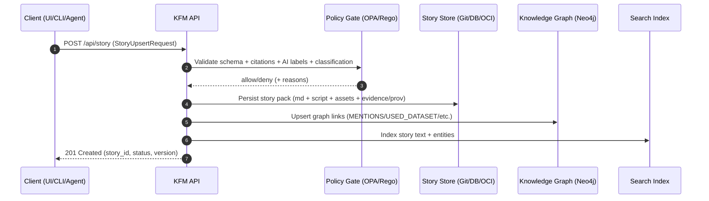

# 🧩 Story API Contracts — Request Examples (Story Nodes)


> [!IMPORTANT]
> **Story Nodes are not “just content.”** In KFM they are *governed narrative artifacts* (Markdown + JSON script + evidence/provenance) that drive the Story Engine (map + timeline synchronized steps).

---

## 🎯 Purpose

This README provides **copy/paste request examples** for story-related API operations under KFM’s contract-first approach:

- ✅ Create/Upsert a Story Node
- ✅ Validate a Story Node (fail-closed governance gate)
- ✅ Preview a Story Node (sanitized render)
- ✅ Publish a Story Node
- ✅ Export a Story Node for offline/field use *(planned)*

Path 📍: `api/contracts/examples/requests/story/README.md`

---

## 🧠 What is a Story Node (KFM mental model)

A **Story Node** is an interactive narrative (a “guided tour”) where each step can drive:

- 🗺️ **Map state** (center, zoom, visible layers, etc.)
- ⏳ **Timeline state** (e.g., `timelineYear`)
- 🧾 **Narrative text** (Markdown, with citations + evidence)
- 📎 **Assets** (images/media)

This allows a story to behave like a “slide deck” synchronized to map & data layers.

---

## 🗂️ Canonical story content layout (Git-first)

Even if you submit stories via API, the canonical format should match the **folder-based story pack** structure (useful for exports, PR review, offline packs, and provenance):

```text
docs/
  reports/
    story_nodes/
      draft/
        prairie_fire_story/
          prairie_fire_story.md
          prairie_fire_story.json
          images/
            fire_01.jpg
      published/
        ...
```

> [!NOTE]
> This README documents **API requests**. The above layout is the “ground truth” storage shape you can mirror on the backend (DB, Git, OCI artifacts, etc.) while keeping story packs portable.

---

## 🌐 Transport style (REST-first, GraphQL-friendly)

KFM’s UI is designed to communicate with the backend via **REST + GraphQL**. These examples are **REST-first** and can be mirrored in GraphQL mutations if your deployment uses SDL/resolvers.

---

## 📌 Endpoint index

### Documented / anchored endpoint
- `POST /api/story` — **submit a new Story Node** (create or update)

### Recommended companion endpoints (contract-first extensions)
- `POST /api/story/validate` — validation only (no persistence)
- `POST /api/story/preview` — validation + sanitized preview (no persistence)
- `POST /api/story/publish` — promote draft → published
- `POST /api/story/export/offline` — produce offline pack reference/artifact

> [!TIP]
> If you only want one endpoint, support these modes via `POST /api/story?mode=validate|preview|publish|export_offline`.

---

## 🧾 Common headers & conventions

### Headers
- `Authorization: Bearer <JWT>` *(or your auth mechanism)*
- `Idempotency-Key: <uuid>` ✅ **recommended** (safe retries)
- `Traceparent: <w3c-trace-context>` ✅ recommended (telemetry ledger linkage)
- `Content-Type: application/json`

### Conventions
- `story_id` is a **stable slug** (recommended: `snake_case`).
- Coordinates: `center = [lon, lat]` (WGS84).
- Timeline: `timelineYear` is an integer year; future: `timelineDate` ISO-8601.

---

## 🧱 Canonical request envelope

All story requests should share one envelope to keep **policy gates + audit trails** consistent.

```jsonc
{
  "schema_version": "kfm.story.v1",
  "mode": "draft",
  "story": { /* StoryNode */ },
  "client": {
    "client_id": "web-ui",
    "client_version": "0.0.0",
    "request_id": "req_01J3..."
  }
}
```

### `mode`
- `draft` (default) — store as draft
- `publish` — store + publish
- `validate` — run validations only
- `preview` — validate + render preview only
- `export_offline` — build offline artifact/pack reference

---

## 🧩 StoryNode contract (request body)

### Minimal viable StoryNode
```jsonc
{
  "story_id": "prairie_fire_story",
  "title": "Prairie Fire Story",
  "summary": "Fire frequency and land cover change in the Flint Hills.",
  "language": "en",
  "tags": ["ecology", "fire", "flint-hills"],
  "classification": "public",
  "care_labels": [],
  "content": {
    "format": "markdown",
    "markdown": "# Prairie Fire Story\n..."
  },
  "script": {
    "title": "Prairie Fire Story",
    "steps": [ /* StoryStep[] */ ]
  }
}
```

### Strongly recommended (governance-grade) fields
- `license` (SPDX or allowed project license id)
- `authors[]` (name/org/orcid/role)
- `links` (dataset ids, STAC ids, knowledge graph entity ids)
- `evidence` (citations + evidence manifest + PROV bundle)
- `ai_assistance` (required if AI touched any content)
- `assets[]` (inline or references; include checksums when possible)

---

## 🗺️ StoryScript & StoryStep

### `steps[]` (StoryStep)
```jsonc
{
  "id": "intro",
  "text_id": "intro",
  "mapState": {
    "center": [-96.5, 38.5],
    "zoom": 7,
    "layers": ["landcover1850"],
    "timelineYear": 1850
  }
}
```

### `mapState` fields
Required (v1):
- `center`: `[lon, lat]`
- `zoom`: number
- `layers`: `string[]` (layer IDs from the catalog/registry)
- `timelineYear`: integer

Optional (v1+):
- `bearing`, `pitch`
- `bounds` (bbox)
- `filters` (attribute filters)
- `camera3d` (Cesium fly-to; for 3D story steps)
- `arState` (AR overlay descriptor; planned)

### Linking steps to Markdown
- `text_id` should match a **stable anchor** in your Markdown:
  - `## Intro {#intro}`
  - or explicit HTML anchor tags
  - or a story-authoring tool that generates deterministic IDs

---

## 📎 Evidence & provenance (evidence-first narratives)

> [!IMPORTANT]
> Story Nodes must remain **verifiable**: “the map behind the map” + “the receipts behind the narrative.”

### Recommended `evidence` object
```jsonc
{
  "citations_compact": [
    { "id": "CIT-001", "label": "USGS WaterWatch streamflow percentiles", "ref": "dcat:kfm.usgs.waterwatch.v1" }
  ],
  "evidence_manifest": {
    "format": "yaml",
    "ref": "EM-84.yaml",
    "inline": "evidence:\n  - id: CIT-001\n    type: dataset\n    ref: dcat:kfm.usgs.waterwatch.v1\n"
  },
  "prov_bundle": {
    "format": "jsonld",
    "ref": "PROV-84.jsonld",
    "inline": { "@context": "https://www.w3.org/ns/prov.jsonld", "prov:used": [/*...*/] }
  }
}
```

---

## 🧷 AI assistance metadata (required when AI is involved)

If Focus Mode or any AI workflow contributed to drafting or editing:

```jsonc
{
  "ai_assistance": {
    "enabled": true,
    "label": "ai-assisted",
    "models": [
      { "name": "gpt-4.x", "provider": "openai", "role": "drafting" }
    ],
    "prompt_provenance": {
      "prompt_template_id": "focusmode.story.v1",
      "retrieval_sources": ["neo4j", "search-index"],
      "governance_checks": ["policy_pack", "citation_match"]
    }
  }
}
```

---

## 🔒 Governance / Policy Gate expectations (fail-closed)

Your API *should reject* a request if:
- ❌ Claims have **no citations**
- ❌ AI-generated/assisted text is **not labeled**
- ❌ Story classification is **less restrictive than any input**
- ❌ Story references unknown `layers[]` / datasets / graph entities
- ❌ Sensitive geo data is disclosed beyond allowed zoom or policy threshold
- ❌ Secrets/credentials appear anywhere in payload/assets

> [!NOTE]
> Treat governance rules as tests: schema validation + policy pack (OPA/Rego) + linting (markdown + anchors + citation↔manifest match).

---

## 🧪 Request examples

### 1) Minimal create (inline Markdown + script)
```bash
curl -X POST "https://<kfm-host>/api/story" \
  -H "Authorization: Bearer $TOKEN" \
  -H "Content-Type: application/json" \
  -H "Idempotency-Key: 7c1f1b7c-3fbe-4f65-9a09-2e7f9b0b3e3a" \
  -d @- <<'JSON'
{
  "schema_version": "kfm.story.v1",
  "mode": "draft",
  "story": {
    "story_id": "prairie_fire_story",
    "title": "Prairie Fire Story",
    "summary": "Fire frequency and land cover change in the Flint Hills.",
    "language": "en",
    "tags": ["ecology", "fire", "flint-hills"],
    "classification": "public",
    "care_labels": [],
    "content": {
      "format": "markdown",
      "markdown": "---\nstory_id: prairie_fire_story\ntitle: Prairie Fire Story\n---\n\n# Prairie Fire Story\n\n## Intro {#intro}\nPrairie fire has shaped the Flint Hills landscape.[CIT-001]\n\n## Fire frequency {#fire_freq}\nWe overlay an 1855 fire frequency layer for comparison.[CIT-002]\n\n### Citations\n- [CIT-001] dcat:kfm.ks.ecology.prairie_fire_sources.v1\n- [CIT-002] stac:kfm.ks.fire_frequency.1855\n"
    },
    "script": {
      "title": "Prairie Fire Story",
      "steps": [
        {
          "id": "intro",
          "text_id": "intro",
          "mapState": {
            "center": [-96.5, 38.5],
            "zoom": 7,
            "layers": ["landcover1850"],
            "timelineYear": 1850
          }
        },
        {
          "id": "fire_freq",
          "text_id": "fire_freq",
          "mapState": {
            "center": [-96.5, 38.5],
            "zoom": 7,
            "layers": ["landcover1850", "fireFreq1855"],
            "timelineYear": 1855
          }
        }
      ]
    }
  },
  "client": { "client_id": "cli", "client_version": "1.0.0", "request_id": "req_demo_001" }
}
JSON
```

---

### 2) Create with Evidence Manifest + PROV (inline)
```bash
curl -X POST "https://<kfm-host>/api/story?mode=draft" \
  -H "Authorization: Bearer $TOKEN" \
  -H "Content-Type: application/json" \
  -H "Idempotency-Key: 4dd0c4a2-2d59-4f7c-86fa-52b2c9809c48" \
  -d @- <<'JSON'
{
  "schema_version": "kfm.story.v1",
  "mode": "draft",
  "story": {
    "story_id": "kansas_river_flood_1908",
    "title": "Kansas River Flood (1908)",
    "summary": "A provenance-backed narrative linking archival reports and gauge records.",
    "language": "en",
    "tags": ["flood", "kansas-river", "history"],
    "classification": "public",
    "care_labels": [],
    "license": "CC-BY-4.0",
    "authors": [
      { "name": "KFM Maintainers", "role": "curation" }
    ],
    "links": {
      "datasets": ["dcat:kfm.usgs.gauge.streamflow.v1"],
      "graph_entities": ["kg:Place:KansasRiver", "kg:Event:Flood:1908"]
    },
    "content": {
      "format": "markdown",
      "markdown": "---\nstory_id: kansas_river_flood_1908\ntitle: Kansas River Flood (1908)\nevidence_manifest: EM-84.yaml\nprov_bundle: PROV-84.jsonld\n---\n\n# Kansas River Flood (1908)\n\nThis narrative is fully backed by a machine-readable evidence manifest and PROV links.\n"
    },
    "script": {
      "title": "Kansas River Flood (1908)",
      "steps": [
        {
          "id": "overview",
          "text_id": "overview",
          "mapState": {
            "center": [-95.7, 39.0],
            "zoom": 8,
            "layers": ["historicFloodExtent1908", "usgsGaugePoints"],
            "timelineYear": 1908
          }
        }
      ]
    },
    "evidence": {
      "citations_compact": [
        { "id": "CIT-001", "label": "USGS gauge series (query snapshot)", "ref": "dcat:kfm.usgs.gauge.streamflow.v1" },
        { "id": "CIT-002", "label": "Archival newspaper report (OCR)", "ref": "doc:kfm.archive.news.1908.06.xx" }
      ],
      "evidence_manifest": {
        "format": "yaml",
        "inline": "evidence:\n  - id: CIT-001\n    type: dataset\n    ref: dcat:kfm.usgs.gauge.streamflow.v1\n    query:\n      station_ids: [\"06892350\"]\n      date_range: [\"1908-01-01\", \"1908-12-31\"]\n  - id: CIT-002\n    type: document\n    ref: doc:kfm.archive.news.1908.06.xx\n"
      },
      "prov_bundle": {
        "format": "jsonld",
        "inline": {
          "@context": "https://www.w3.org/ns/prov.jsonld",
          "@id": "prov:Activity:kansas_river_flood_1908_story",
          "prov:used": ["dcat:kfm.usgs.gauge.streamflow.v1", "doc:kfm.archive.news.1908.06.xx"],
          "prov:wasAssociatedWith": ["agent:KFM:maintainer"]
        }
      }
    }
  },
  "client": { "client_id": "web-ui", "client_version": "0.0.0", "request_id": "req_demo_002" }
}
JSON
```

---

### 3) Validate only (no persistence)
```bash
curl -X POST "https://<kfm-host>/api/story/validate" \
  -H "Authorization: Bearer $TOKEN" \
  -H "Content-Type: application/json" \
  -d @story.request.json
```

Expected behavior:
- `200 OK` → returns a validation report
- `422 Unprocessable Entity` → schema errors
- `403 Forbidden` → policy denial (governance)
- `409 Conflict` → idempotency conflict (optional)

---

### 4) Multipart “story bundle” upload (Markdown + JSON + assets)
Use this when submitting the canonical story folder structure.

```bash
curl -X POST "https://<kfm-host>/api/story" \
  -H "Authorization: Bearer $TOKEN" \
  -H "Idempotency-Key: 70ee3f98-7ffb-471d-9eae-8e7a37f81a11" \
  -F "story_id=prairie_fire_story" \
  -F "mode=draft" \
  -F "markdown=@prairie_fire_story.md;type=text/markdown" \
  -F "script=@prairie_fire_story.json;type=application/json" \
  -F "asset=@images/fire_01.jpg;type=image/jpeg"
```

---

### 5) GraphQL mutation (optional transport)
```graphql
mutation UpsertStoryNode($input: StoryUpsertInput!) {
  upsertStoryNode(input: $input) {
    story_id
    status
    version
    validation { ok errors { code message path } }
  }
}
```

---

### 6) Export for offline field use (planned)
```bash
curl -X POST "https://<kfm-host>/api/story/export/offline" \
  -H "Authorization: Bearer $TOKEN" \
  -H "Content-Type: application/json" \
  -d '{
    "schema_version":"kfm.story.v1",
    "mode":"export_offline",
    "story": { "story_id":"prairie_fire_story" },
    "export": { "format":"zip", "include_pmtiles": true, "include_media": true }
  }'
```

---

## 🧬 Sequence diagram (create/publish flow)



---

## ✅ Author checklist (what policy will likely enforce)

- [ ] Markdown includes citations for factual claims
- [ ] AI-generated/assisted content is explicitly labeled
- [ ] `script.steps[].text_id` matches anchors/sections in Markdown
- [ ] All `mapState.layers[]` exist in the layer registry/catalog
- [ ] Story `classification` is ≥ strictest referenced input classification
- [ ] Evidence manifest + PROV bundle included *(ideal)*

---

## 🧰 Implementation notes (contract-first discipline)

- Update **OpenAPI** / **GraphQL SDL** **before** writing server code
- Add contract tests for:
  - schema validity
  - anchor matching
  - citation ↔ evidence-manifest matching
  - classification propagation
- Sanitize Markdown (XSS-safe) and validate all assets
- Keep Story Nodes queryable in the graph (so “which stories used this dataset?” works)

---

## 🌱 Future extensions (story-adjacent content types)

- ⚡ **Pulse Threads**: short geotagged narrative updates with the same evidence-first requirements
- 🧠 **Conceptual Attention Nodes**: thematic graph hubs to guide AI + user exploration
- 🛰️ **3D/AR story steps**: hybrid 2D/3D + AR overlays for on-site exploration
- 📦 **OCI artifact packaging**: store story packs and their provenance/signatures as registry artifacts

---

## 📚 Design sources (project docs)

This contract README is derived from the project’s architecture, UI, AI, governance, and future proposal documents:

- Kansas Frontier Matrix (KFM) – Comprehensive Technical Documentation.pdf
- Kansas Frontier Matrix (KFM) – Comprehensive Architecture, Features, and Design.pdf
- Kansas Frontier Matrix – Comprehensive UI System Overview.pdf
- Kansas Frontier Matrix (KFM) – AI System Overview 🧭🤖.pdf
- 📚 Kansas Frontier Matrix (KFM) Data Intake – Technical & Design Guide.pdf
- 🌟 Kansas Frontier Matrix – Latest Ideas & Future Proposals.docx.pdf
- Additional Project Ideas.pdf
- Innovative Concepts to Evolve the Kansas Frontier Matrix (KFM).pdf
- AI Concepts & more.pdf
- Maps-GoogleMaps-VirtualWorlds-Archaeological-Computer Graphics-Geospatial-webgl.pdf
- Various programming langurages & resources 1.pdf
- Data Managment-Theories-Architures-Data Science-Baysian Methods-Some Programming Ideas.pdf
