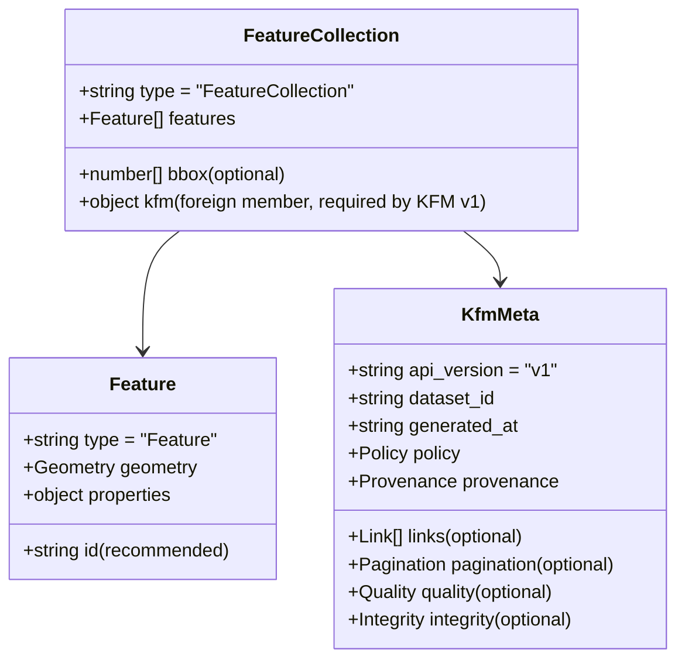

# 🧭 GeoJSON Response Examples (v1)


KFM treats **GeoJSON as the default** for API responses and “smaller datasets” (with tiles and other formats used when scale demands it).:contentReference[oaicite:0]{index=0}

This folder documents **canonical GeoJSON response patterns** for KFM API **v1**, aligned with KFM’s **contract-first + provenance-first** architecture (no mystery layers, always traceable).:contentReference[oaicite:1]{index=1}:contentReference[oaicite:2]{index=2}

---

## 📚 Quick nav

- [📌 What belongs in this folder](#-what-belongs-in-this-folder)
- [🧩 When to use GeoJSON vs tiles](#-when-to-use-geojson-vs-tiles)
- [🧱 Response shape (v1)](#-response-shape-v1)
- [🧾 KFM foreign members](#-kfm-foreign-members)
- [🛡️ Policy + redaction patterns](#️-policy--redaction-patterns)
- [🧬 Provenance fields](#-provenance-fields)
- [🧪 Example responses](#-example-responses)
- [✅ Validation checklist](#-validation-checklist)
- [🔁 Versioning rules](#-versioning-rules)
- [📎 Project source library](#-project-source-library)

---

## 📌 What belongs in this folder

✅ **This folder contains**:
- **Human-readable guidance** (this README)
- **Canonical response examples** for **GeoJSON FeatureCollection** payloads (inline below; optionally mirrored as `.geojson` files later)

🚫 **This folder does not contain**:
- The OpenAPI spec (should live under `api/contracts/openapi/...`)
- JSON Schemas (should live under `api/contracts/schemas/...`)
- Implementation code (FastAPI, PostGIS adapter, etc.)

KFM’s doc system is **contract-driven**; examples are meant to be used by tests and tooling (schema validation, regression checks, etc.).:contentReference[oaicite:3]{index=3}:contentReference[oaicite:4]{index=4}

---

## 🧩 When to use GeoJSON vs tiles

**Use GeoJSON when**:
- The payload is small/medium (interactive layer filters, selections, “latest points”, etc.):contentReference[oaicite:5]{index=5}
- The UI needs “clickable features” with rich `properties`
- You need a **direct** FeatureCollection for MapLibre/Leaflet/etc.

**Prefer tiles when**:
- The dataset is large (boundaries, landcover, dense layers)
- You need smooth pan/zoom performance
- You want server-side generalization by zoom level

KFM supports tile endpoints (example: `/tiles/landcover/{z}/{x}/{y}.pbf`) and uses PostGIS for geospatial serving (including vector tiles via `ST_AsMVT`).:contentReference[oaicite:6]{index=6}:contentReference[oaicite:7]{index=7}

---

## 🧱 Response shape (v1)

All v1 GeoJSON responses MUST be valid **RFC 7946-style** GeoJSON (FeatureCollection) and MAY include **foreign members** for KFM metadata (`kfm`), which is how we satisfy provenance-first and policy observability without breaking map clients.



### 🧾 Minimum required keys (KFM v1)

At minimum, a KFM GeoJSON response MUST include:

- `type: "FeatureCollection"`
- `features: []` (may be empty)
- `kfm.api_version: "v1"`
- `kfm.dataset_id`
- `kfm.generated_at`
- `kfm.policy` (at least classification + redactions info)
- `kfm.provenance` (at least links/IDs to DCAT/STAC/PROV context)

This aligns with KFM’s insistence that metadata/provenance is “just as important as the data itself”.:contentReference[oaicite:8]{index=8}

---

## 🧾 KFM foreign members

KFM attaches **response-level metadata** under a single foreign member:

```ts
// pseudo-types (for readability)
type KfmGeoJsonResponse = GeoJSON.FeatureCollection & {
  kfm: {
    api_version: "v1";
    dataset_id: string;          // canonical ID (often with state prefix)
    layer_id?: string;           // UI-facing layer handle
    generated_at: string;        // ISO 8601 timestamp
    query?: Record<string, any>; // echoed query context (safe subset)
    policy: {
      classification: "public" | "internal" | "restricted" | "sensitive";
      care_label?: string;       // FAIR+CARE / sovereignty label
      redactions_applied: boolean;
      redaction_reason?: string;
      redaction_strategy?: string;
    };
    provenance: {
      dcat_dataset?: { id: string; href?: string };
      stac_collection?: { id: string; href?: string };
      stac_items?: Array<{ id: string; href?: string }>;
      prov_bundle?: { id: string; href?: string };
      evidence_manifest?: { id: string; href?: string };
    };
    links?: Array<{ rel: string; href: string; type?: string; title?: string }>;
    pagination?: {
      limit?: number;
      offset?: number;
      next?: string;  // URL or cursor
      prev?: string;
      number_returned?: number;
      number_matched?: number;
    };
    quality?: {
      confidence?: number;     // 0..1
      uncertainty?: Record<string, any>;
      notes?: string;
    };
    integrity?: {
      hash?: string;           // e.g., "sha256:..."
      artifact_digest?: string;// OCI artifact digest
      signature?: string;      // cosign://... or equivalent pointer
    };
  }
}
```

### Why this exists (KFM rationale)

- **Contract-first**: responses are predictable, testable, and versioned.:contentReference[oaicite:9]{index=9}
- **Provenance-first**: all map layers and answers can be traced back to sources (DCAT/STAC/PROV + evidence manifests).:contentReference[oaicite:10]{index=10}:contentReference[oaicite:11]{index=11}
- **UI transparency**: KFM UI is designed to surface “the map behind the map” and keep attribution/provenance accessible.:contentReference[oaicite:12]{index=12}:contentReference[oaicite:13]{index=13}

---

## 🛡️ Policy + redaction patterns

KFM governance requires that outputs **cannot be less restricted than their inputs** (classification and sovereignty-aware labels propagate).:contentReference[oaicite:14]{index=14}

### ✅ Preferred policy behaviors

When a request hits policy constraints, choose one of:

1. **Omit features** entirely (most common for sensitive points)
2. **Generalize geometry** (e.g., polygon/bbox instead of exact point)
3. **Reduce attribute precision** (e.g., remove site name, keep category)
4. **Return empty FeatureCollection + explanation in `kfm.policy`**

KFM explicitly contemplates sensitive monitoring stations being **omitted** or **only shown to authorized users** based on graph metadata classification.:contentReference[oaicite:15]{index=15}

KFM also embraces FAIR+CARE / sovereignty governance and sensitivity-aware handling for culturally restricted knowledge (e.g., differential access, geo-obfuscation patterns).:contentReference[oaicite:16]{index=16}:contentReference[oaicite:17]{index=17}

---

## 🧬 Provenance fields

KFM interlinks **DCAT + STAC + PROV** so that discovery metadata, technical metadata, and lineage are connected and traversable (including mirroring into the knowledge graph).:contentReference[oaicite:18]{index=18}

**In GeoJSON responses**, the goal is:
- enough provenance hooks for the UI to show attribution and traceability
- enough IDs/links for Focus Mode to cite sources

KFM’s Focus Mode is designed to always provide citations and to rely on provenance metadata for sourcing answers.:contentReference[oaicite:19]{index=19}:contentReference[oaicite:20]{index=20}

KFM also supports **evidence manifests** + PROV bundles for narrative outputs, and those concepts apply cleanly to data responses too (stable evidence inventory + verification hooks).:contentReference[oaicite:21]{index=21}

---

## 🧪 Example responses

> 💡 Tip: These are “contract examples”. Keep them **small**, **stable**, and **deterministic** (ids/timestamps should be realistic but not flaky in tests).

### Example 1 — Real-time sensor points (river gauges)

This mirrors the KFM pattern where the UI requests latest readings and the API returns GeoJSON points per station, potentially omitting sensitive stations based on classification rules.:contentReference[oaicite:22]{index=22}

<details>
<summary>📍 Click to expand JSON</summary>

```json
{
  "type": "FeatureCollection",
  "bbox": [-100.0, 36.9, -94.6, 40.0],
  "features": [
    {
      "type": "Feature",
      "id": "station:usgs:06889500",
      "geometry": {
        "type": "Point",
        "coordinates": [-95.689, 39.055]
      },
      "properties": {
        "station_id": "06889500",
        "name": "Kansas River at Topeka",
        "observed_at": "2026-01-24T01:00:00Z",
        "value": 12.4,
        "unit": "ft",
        "source": "USGS NWIS",
        "kfm": {
          "classification": "public"
        }
      }
    },
    {
      "type": "Feature",
      "id": "station:usgs:06891000",
      "geometry": {
        "type": "Point",
        "coordinates": [-96.605, 39.184]
      },
      "properties": {
        "station_id": "06891000",
        "name": "Kansas River at Wamego",
        "observed_at": "2026-01-24T01:00:00Z",
        "value": 10.1,
        "unit": "ft",
        "source": "USGS NWIS",
        "kfm": {
          "classification": "public"
        }
      }
    }
  ],
  "kfm": {
    "api_version": "v1",
    "dataset_id": "kfm.ks.hydro.river_gauges.realtime.v1",
    "layer_id": "hydro.river_gauges.realtime",
    "generated_at": "2026-01-24T01:02:11Z",
    "query": {
      "bbox": [-100.0, 36.9, -94.6, 40.0],
      "limit": 500,
      "time": {
        "mode": "latest"
      }
    },
    "policy": {
      "classification": "public",
      "care_label": "public",
      "redactions_applied": false
    },
    "provenance": {
      "dcat_dataset": {
        "id": "kfm.ks.catalog.dcat:hydro:usgs_nwis_realtime",
        "href": "/api/v1/catalog/dcat/datasets/kfm.ks.catalog.dcat:hydro:usgs_nwis_realtime.json"
      },
      "stac_collection": {
        "id": "kfm.ks.stac:collections:hydro.river_gauges",
        "href": "/api/v1/stac/collections/hydro.river_gauges"
      },
      "prov_bundle": {
        "id": "urn:kfm:prov:bundle:api_query:2026-01-24T01:02:11Z",
        "href": "/api/v1/prov/bundles/urn:kfm:prov:bundle:api_query:2026-01-24T01:02:11Z.jsonld"
      }
    },
    "links": [
      { "rel": "self", "href": "/api/v1/geojson/hydro/river_gauges/realtime?time=latest" },
      { "rel": "tiles", "href": "/api/v1/tiles/hydro/river_gauges/{z}/{x}/{y}.pbf", "type": "application/x-protobuf" }
    ]
  }
}
```

</details>

---

### Example 2 — Administrative boundary polygons (counties)

KFM uses PostGIS as the authoritative store for geospatial content and keeps the graph for contextual glue; dataset nodes often have stable IDs (example shown in intake docs).:contentReference[oaicite:23]{index=23}:contentReference[oaicite:24]{index=24}

<details>
<summary>🧩 Click to expand JSON</summary>

```json
{
  "type": "FeatureCollection",
  "features": [
    {
      "type": "Feature",
      "id": "county:fips:20177",
      "geometry": {
        "type": "Polygon",
        "coordinates": [
          [
            [-99.00, 37.00],
            [-99.00, 37.50],
            [-98.50, 37.50],
            [-98.50, 37.00],
            [-99.00, 37.00]
          ]
        ]
      },
      "properties": {
        "name": "Ford County",
        "fips": "20177",
        "state": "KS",
        "kfm": {
          "classification": "public"
        }
      }
    }
  ],
  "kfm": {
    "api_version": "v1",
    "dataset_id": "kfm.ks.boundaries.counties.v1",
    "layer_id": "boundaries.counties",
    "generated_at": "2026-01-24T01:10:00Z",
    "policy": {
      "classification": "public",
      "care_label": "public",
      "redactions_applied": false
    },
    "provenance": {
      "dcat_dataset": {
        "id": "kfm.ks.catalog.dcat:boundaries:counties",
        "href": "/api/v1/catalog/dcat/datasets/kfm.ks.catalog.dcat:boundaries:counties.json"
      },
      "stac_collection": {
        "id": "kfm.ks.stac:collections:boundaries.counties",
        "href": "/api/v1/stac/collections/boundaries.counties"
      },
      "prov_bundle": {
        "id": "urn:kfm:prov:bundle:dataset_release:kfm.ks.boundaries.counties.v1",
        "href": "/api/v1/prov/bundles/urn:kfm:prov:bundle:dataset_release:kfm.ks.boundaries.counties.v1.jsonld"
      }
    }
  }
}
```

</details>

---

### Example 3 — Sensitive / sovereignty-aware redaction (generalized geometry)

This example demonstrates a **policy-compliant response** where exact coordinates are not provided; instead we return a coarse polygon + explicit redaction metadata. This aligns with KFM’s sensitivity-aware governance approach (FAIR+CARE, cultural protocols) and “no output less restricted than input”.:contentReference[oaicite:25]{index=25}:contentReference[oaicite:26]{index=26}:contentReference[oaicite:27]{index=27}

<details>
<summary>🛡️ Click to expand JSON</summary>

```json
{
  "type": "FeatureCollection",
  "features": [
    {
      "type": "Feature",
      "id": "site:restricted:0001",
      "geometry": {
        "type": "Polygon",
        "coordinates": [
          [
            [-96.10, 38.90],
            [-96.10, 39.00],
            [-96.00, 39.00],
            [-96.00, 38.90],
            [-96.10, 38.90]
          ]
        ]
      },
      "properties": {
        "site_kind": "cultural_site",
        "label": "Restricted Site (generalized)",
        "kfm_redacted": true,
        "kfm_redaction": {
          "strategy": "geometry_generalization",
          "notes": "Exact geometry withheld under sovereignty / sensitivity rules."
        }
      }
    }
  ],
  "kfm": {
    "api_version": "v1",
    "dataset_id": "kfm.ks.cultural_sites.restricted.v1",
    "generated_at": "2026-01-24T02:00:00Z",
    "policy": {
      "classification": "restricted",
      "care_label": "sovereignty_restricted",
      "redactions_applied": true,
      "redaction_reason": "sensitivity/sovereignty",
      "redaction_strategy": "generalize_geometry_and_properties"
    },
    "provenance": {
      "dcat_dataset": {
        "id": "kfm.ks.catalog.dcat:cultural_sites",
        "href": "/api/v1/catalog/dcat/datasets/kfm.ks.catalog.dcat:cultural_sites.json"
      },
      "prov_bundle": {
        "id": "urn:kfm:prov:bundle:policy_redaction:2026-01-24T02:00:00Z",
        "href": "/api/v1/prov/bundles/urn:kfm:prov:bundle:policy_redaction:2026-01-24T02:00:00Z.jsonld"
      }
    }
  }
}
```

</details>

---

### Example 4 — Tile-first hint (huge dataset fallback)

Some requests should return tiles rather than a huge FeatureCollection. This example returns an **empty** FeatureCollection (still valid GeoJSON) plus tile links.

KFM supports tile endpoints for scalable delivery and can provide “links to tiles” rather than embedding all features in the response.:contentReference[oaicite:28]{index=28}:contentReference[oaicite:29]{index=29}

<details>
<summary>🧱 Click to expand JSON</summary>

```json
{
  "type": "FeatureCollection",
  "features": [],
  "kfm": {
    "api_version": "v1",
    "dataset_id": "kfm.ks.landcover.2000_2020.v1",
    "generated_at": "2026-01-24T02:10:00Z",
    "policy": {
      "classification": "public",
      "care_label": "public",
      "redactions_applied": false
    },
    "provenance": {
      "dcat_dataset": {
        "id": "kfm.ks.catalog.dcat:landcover_2000_2020",
        "href": "/api/v1/catalog/dcat/datasets/kfm.ks.catalog.dcat:landcover_2000_2020.json"
      },
      "stac_collection": {
        "id": "kfm.ks.stac:collections:landcover",
        "href": "/api/v1/stac/collections/landcover"
      }
    },
    "links": [
      {
        "rel": "tiles",
        "href": "/api/v1/tiles/landcover/{z}/{x}/{y}.pbf",
        "type": "application/x-protobuf",
        "title": "Vector tiles (pbf)"
      },
      {
        "rel": "self",
        "href": "/api/v1/datasets/kfm.ks.landcover.2000_2020.v1?format=geojson"
      }
    ],
    "pagination": {
      "number_returned": 0,
      "number_matched": 0
    }
  }
}
```

</details>

---

## 🧠 CRS + geometry generation notes

KFM pipelines standardize spatial references and explicitly reproject to **WGS84 / EPSG:4326** for delivery (consistent with GeoJSON expectations and map clients).:contentReference[oaicite:30]{index=30}

When generating GeoJSON from PostGIS, use `ST_AsGeoJSON(ST_Transform(...,4326))` and wrap results into a **FeatureCollection** at the API layer.:contentReference[oaicite:31]{index=31}

Also: PostGIS exports geometries, but your service logic must assemble full GeoJSON objects with properties/features/collections (common pattern in geospatial APIs).:contentReference[oaicite:32]{index=32}

---

## 🧷 Optional: uncertainty + confidence

KFM’s design audit notes that uncertainty is often missing in geo/historical data systems and recommends making uncertainty explicit (especially with AI-generated or inferred features).:contentReference[oaicite:33]{index=33}

If applicable, attach:
- `kfm.quality.confidence` (0..1)
- `kfm.quality.uncertainty` (structured notes: method, bounds, assumptions)

This also aligns with broader data mining / modeling practices around extracting stable patterns from high-dimensional data and explicitly documenting modeling assumptions.:contentReference[oaicite:34]{index=34}

---

## ✅ Validation checklist

Before committing any new v1 GeoJSON example:

- [ ] ✅ Valid GeoJSON FeatureCollection (`type`, `features`)
- [ ] ✅ Coordinates are WGS84-ish / consistent with EPSG:4326 delivery rules:contentReference[oaicite:35]{index=35}
- [ ] ✅ Includes required `kfm.*` foreign member fields (version, dataset_id, generated_at, policy, provenance)
- [ ] ✅ Policy: no output less restricted than inputs:contentReference[oaicite:36]{index=36}
- [ ] ✅ Provenance hooks exist (DCAT/STAC/PROV / evidence manifest pointers):contentReference[oaicite:37]{index=37}:contentReference[oaicite:38]{index=38}
- [ ] ✅ Example is small + deterministic (stable ids; avoid flaky timestamps in tests)
- [ ] ✅ If sensitive: redaction strategy is explicit in `kfm.policy`:contentReference[oaicite:39]{index=39}

---

## 🔁 Versioning rules

- ✅ Additive changes (new optional fields, new examples): stay in `v1/`
- 🚨 Breaking changes (renaming fields, removing fields, changing meaning): create `v2/geojson/`

KFM contracts are first-class artifacts; versioning discipline is required for trust and interoperability.:contentReference[oaicite:40]{index=40}:contentReference[oaicite:41]{index=41}

---

## 🔗 Related patterns in KFM

- `GET /api/datasets/{id}` can return metadata or data (GeoJSON or links to tiles).:contentReference[oaicite:42]{index=42}
- UI is decoupled via REST/GraphQL and constantly surfaces provenance/citations.:contentReference[oaicite:43]{index=43}
- UI map tech includes MapLibre (2D) and Cesium (3D).:contentReference[oaicite:44]{index=44}

---

## 📎 Project source library

These examples are derived from the project’s design/architecture documents and supporting references:

- 📘 KFM core docs
  - Kansas Frontier Matrix (KFM) – Comprehensive Technical Documentation.pdf :contentReference[oaicite:45]{index=45}
  - Kansas Frontier Matrix (KFM) – Comprehensive Architecture, Features, and Design.pdf :contentReference[oaicite:46]{index=46}
  - 📚 Kansas Frontier Matrix (KFM) Data Intake – Technical & Design Guide.pdf :contentReference[oaicite:47]{index=47}
  - Kansas Frontier Matrix (KFM) – AI System Overview 🧭🤖.pdf :contentReference[oaicite:48]{index=48}
  - Kansas Frontier Matrix – Comprehensive UI System Overview.pdf :contentReference[oaicite:49]{index=49}
  - 🌟 Kansas Frontier Matrix – Latest Ideas & Future Proposals.docx.pdf :contentReference[oaicite:50]{index=50}
  - Innovative Concepts to Evolve the Kansas Frontier Matrix (KFM).pdf :contentReference[oaicite:51]{index=51}
  - Additional Project Ideas.pdf :contentReference[oaicite:52]{index=52}

- 🧰 Supporting geospatial/API reference
  - KFM- python-geospatial-analysis-cookbook...pdf :contentReference[oaicite:53]{index=53}
  - Kansas-Frontier-Matrix_ Open-Source Geospatial Historical Mapping Hub Design.pdf :contentReference[oaicite:54]{index=54}

- 🧾 Markdown + documentation practice (used for structure & advanced formatting)
  - MARKDOWN_GUIDE_v13.md.gdoc :contentReference[oaicite:55]{index=55}
  - Comprehensive Markdown Guide_ Syntax, Extensions, and Best Practices.docx :contentReference[oaicite:56]{index=56}

- 🗂️ Project “PDF portfolios” (present in repo library; some require Adobe/portfolio extraction)
  - AI Concepts & more.pdf :contentReference[oaicite:57]{index=57}
  - Maps-GoogleMaps-VirtualWorlds-Archaeological-Computer Graphics-Geospatial-webgl.pdf :contentReference[oaicite:58]{index=58}
  - Data Managment-Theories-Architures-Data Science-Baysian Methods-Some Programming Ideas.pdf :contentReference[oaicite:59]{index=59}
  - Various programming langurages & resources 1.pdf :contentReference[oaicite:60]{index=60}
