# Provenance Response Examples (v1) ⛓️🧾


Canonical **example responses** for the **KFM Provenance API (v1)** — used by:
- 🧪 contract tests (“golden” payloads)
- 🗺️ UI transparency features (Layer Info + Layer Provenance panel)
- 📤 exports (auto-generated attributions + provenance summaries)
- 🧭 audit + governance ledger workflows (traceable, signed, reviewable)

> ✅ **KFM rule of thumb:** if something can’t show its chain-of-custody, it shouldn’t show up in the UI (or in Focus Mode) 🔒

---

## 📁 Folder location

```text
📁 api/
  📁 contracts/
    📁 examples/
      📁 responses/
        📁 v1/
          📁 provenance/
            📄 README.md   👈 you are here
            📄 (example JSON files live alongside this README)
```

---

## 🧠 What “provenance” means in KFM

KFM is **contract-first** and **provenance-first**:
- **No mystery layers**: every dataset / layer / derived artifact is backed by a metadata contract and lineage trail.
- **Evidence Triplet**: provenance is not a single blob — it’s a linked set of boundary artifacts:
  - 🛰️ **STAC** (assets + spatiotemporal technical metadata)
  - 🧾 **DCAT** (dataset discovery + distribution metadata)
  - 🔗 **PROV-O** (lineage: entities, activities, agents, and relations)

This folder documents what the **API returns** when clients ask:

- “Where did this dataset/layer come from?”
- “Which pipeline run and source files produced it?”
- “Why did Focus Mode say this — and what did it cite?”
- “What got redacted for this user, and why?”
- “Where is the ledger entry / signature / attestation?”

---

## 🗺️ System flow (why the endpoint exists)

```mermaid
flowchart LR
  subgraph Data
    A["Raw Sources 📥"] --> B["ETL + Normalization 🧼"]
    B --> C["STAC Items + Collections 🛰️"]
    C --> D["DCAT Dataset Views 🧾"]
    C --> E["PROV Lineage Bundles 🔗"]
  end

  C --> G["Neo4j Graph 🕸️ (references back to catalogs)"]
  G --> H["API Layer 🧩 (contracts + redaction)"]
  H --> I["Map UI 🗺️ (React · MapLibre · optional 3D)"]
  I --> J["Story Nodes 📖 (governed narratives)"]
  J --> K["Focus Mode 🤖 (provenance-linked context bundle)"]
```



---

## 📦 What lives in these responses

All v1 provenance responses share the same **envelope** and then specialize by `subject.kind`.

### ✅ Required building blocks

- `meta` — request + versioning info
- `data.subject` — the thing we’re describing (dataset, layer, story node, focus answer, artifact…)
- `data.triplet` — STAC/DCAT/PROV references (or embedded objects if expanded)
- `data.summary` — UI-friendly “Layer Info” card (source, license, processing summary)
- `data.lineage` — prov/graph view (nodes + edges, and/or PROV-JSON-LD bundle)
- `data.governance` — classification, policy gates, ledger references, redaction disclosure
- `links` — stable URLs to download / inspect the canonical artifacts

---

## 🧱 Common response envelope

> The goal is **predictable shape** for UI + tests, while still supporting “expand” behaviors for power users.

```json
{
  "schema": "kfm.api.responses.v1.provenance",
  "schema_version": "1.0.0",
  "meta": {
    "api_version": "v1",
    "request_id": "req_01J2F7A6K6Q9H7TQ7H3G0W1C2M",
    "generated_at": "2026-01-24T18:22:31Z",
    "profile_versions": {
      "kfm_stac_profile": "v11.0.0",
      "kfm_dcat_profile": "v11.0.0",
      "kfm_prov_profile": "v11.0.0"
    }
  },
  "data": {
    "subject": {},
    "triplet": {},
    "summary": {},
    "lineage": {},
    "governance": {}
  },
  "links": {},
  "warnings": []
}
```

---

## 🧾 Example catalog (what to create / keep updated)

> If you store examples as separate `.json` files, **use stable IDs + deterministic ordering** (good for diffing and tests).

| Example ID 🏷️ | `subject.kind` | Scenario 🎬 | Notes 📝 |
|---|---:|---|---|
| `dataset.expanded.ok.json` | `dataset` | Full dataset lineage | Includes triplet refs + PROV bundle + graph edges |
| `dataset.redacted.ok.json` | `dataset` | Redaction applied | Demonstrates classification + masked fields |
| `layer.ok.json` | `layer` | UI “Layer Info” | Minimal payload: summary + triplet refs |
| `focus_answer.ok.json` | `focus_answer` | Answer with citations | Includes citations + context bundle + policy results |
| `focus_answer.blocked.error.json` | `focus_answer` | Refused answer | Shows “fail-closed” + why |
| `story_node.ok.json` | `story_node` | Narrative provenance | Evidence manifest + attributions |
| `pipeline_run.ok.json` | `pipeline_run` | Run-level lineage | Includes run_manifest digest + input/output refs |
| `artifact.oci.ok.json` | `artifact` | OCI + signature trail | Cosign / in-toto / digest pointers |

---

## 🧩 Subject kinds & expectations

### `dataset`
A curated dataset in the KFM catalog (typically with STAC Collection/Items, DCAT dataset view, and a PROV lineage bundle).

### `layer`
A UI-visible layer (usually “points to” a dataset + style config). Provenance should be instantly displayable in the UI.

### `focus_answer`
A Focus Mode output. **Must include citations** (or be refused). Provenance should record:
- sources used (datasets/docs/entities)
- policy checks and outcomes
- the ledger entry for the answer

### `story_node`
A governed narrative. Should include an evidence manifest and attribution bundle.

### `pipeline_run`
A single pipeline execution (ETL). Useful for debugging + audit.

### `artifact`
A stored binary/large artifact (e.g., tiles, COGs, models) — often best represented as an OCI object with signatures/attestations.

---

## ✅ Example 1 — Dataset provenance (expanded)

<details>
<summary><strong>📄 dataset.expanded.ok.json</strong> (click to expand)</summary>

```json
{
  "schema": "kfm.api.responses.v1.provenance",
  "schema_version": "1.0.0",
  "meta": {
    "api_version": "v1",
    "request_id": "req_01J2F7C2J1P5QJ6R2E3QW8K9VZ",
    "generated_at": "2026-01-24T18:22:31Z",
    "profile_versions": {
      "kfm_stac_profile": "v11.0.0",
      "kfm_dcat_profile": "v11.0.0",
      "kfm_prov_profile": "v11.0.0"
    }
  },
  "data": {
    "subject": {
      "kind": "dataset",
      "id": "kfm.ds.ks.landcover.1990_2020",
      "version": "2026-01-15",
      "title": "Kansas Landcover 1990–2020 (Derived COG Mosaic)",
      "classification": "public"
    },
    "triplet": {
      "stac": {
        "href": "/v1/catalog/stac/collections/kfm.ds.ks.landcover.1990_2020",
        "media_type": "application/json",
        "id": "kfm.ds.ks.landcover.1990_2020"
      },
      "dcat": {
        "href": "/v1/catalog/dcat/datasets/kfm.ds.ks.landcover.1990_2020",
        "media_type": "application/ld+json",
        "id": "urn:kfm:dcat:dataset:kfm.ds.ks.landcover.1990_2020"
      },
      "prov": {
        "href": "/v1/catalog/prov/bundles/kfm.ds.ks.landcover.1990_2020@2026-01-15",
        "media_type": "application/ld+json",
        "id": "urn:kfm:prov:bundle:kfm.ds.ks.landcover.1990_2020@2026-01-15"
      }
    },
    "summary": {
      "source": [
        {
          "name": "USGS NLCD",
          "role": "upstream dataset",
          "license": "public-domain-or-source-defined",
          "attribution": "U.S. Geological Survey"
        }
      ],
      "prepared_by": {
        "system": "KFM pipeline",
        "pipeline_id": "kfm.pipelines.landcover.ingest",
        "run_id": "run_01J1Z9YH3P0C0R3A7T2Y8P0W9B",
        "executed_at": "2026-01-15T03:14:12Z"
      },
      "processing_summary": [
        "Reprojected inputs to EPSG:4326",
        "Generated cloud-optimized GeoTIFF (COG) mosaic",
        "Created STAC Collection + Items + assets",
        "Emitted DCAT dataset view",
        "Emitted PROV JSON-LD lineage bundle"
      ],
      "distributions": [
        {
          "type": "cog",
          "href": "/v1/data/processed/landcover/kansas_landcover_1990_2020.cog.tif",
          "media_type": "image/tiff; application=geotiff; profile=cloud-optimized",
          "hashes": { "sha256": "3f6f2c3b1a6f1c...e9" }
        }
      ]
    },
    "lineage": {
      "prov_bundle": {
        "@context": "https://www.w3.org/ns/prov.jsonld",
        "entity": {
          "urn:kfm:prov:entity:dataset:kfm.ds.ks.landcover.1990_2020@2026-01-15": {
            "prov:label": "Kansas Landcover 1990–2020 (COG Mosaic)",
            "prov:type": "kfm:Dataset",
            "kfm:classification": "public",
            "kfm:sha256": "3f6f2c3b1a6f1c...e9"
          },
          "urn:kfm:prov:entity:source:usgs.nlcd.2020": {
            "prov:label": "USGS NLCD 2020",
            "prov:type": "kfm:UpstreamDataset",
            "kfm:source": "USGS"
          }
        },
        "activity": {
          "urn:kfm:prov:activity:run:run_01J1Z9YH3P0C0R3A7T2Y8P0W9B": {
            "prov:label": "Landcover ingest + derive",
            "prov:type": "kfm:PipelineRun",
            "prov:startedAtTime": "2026-01-15T03:10:00Z",
            "prov:endedAtTime": "2026-01-15T03:14:12Z",
            "kfm:pipeline_id": "kfm.pipelines.landcover.ingest",
            "kfm:run_manifest_digest": "sha256:8c1e...aa7"
          }
        },
        "agent": {
          "urn:kfm:prov:agent:kfm-ci-bot": {
            "prov:label": "KFM CI Bot",
            "prov:type": "kfm:AutomationAgent"
          }
        },
        "used": {
          "_:use1": {
            "prov:activity": "urn:kfm:prov:activity:run:run_01J1Z9YH3P0C0R3A7T2Y8P0W9B",
            "prov:entity": "urn:kfm:prov:entity:source:usgs.nlcd.2020",
            "prov:role": "input dataset"
          }
        },
        "wasGeneratedBy": {
          "_:gen1": {
            "prov:entity": "urn:kfm:prov:entity:dataset:kfm.ds.ks.landcover.1990_2020@2026-01-15",
            "prov:activity": "urn:kfm:prov:activity:run:run_01J1Z9YH3P0C0R3A7T2Y8P0W9B"
          }
        },
        "wasAssociatedWith": {
          "_:assoc1": {
            "prov:activity": "urn:kfm:prov:activity:run:run_01J1Z9YH3P0C0R3A7T2Y8P0W9B",
            "prov:agent": "urn:kfm:prov:agent:kfm-ci-bot"
          }
        }
      },
      "graph_snapshot": {
        "nodes": [
          { "id": "ds:kfm.ds.ks.landcover.1990_2020@2026-01-15", "type": "Dataset" },
          { "id": "run:run_01J1Z9YH3P0C0R3A7T2Y8P0W9B", "type": "Activity" },
          { "id": "src:usgs.nlcd.2020", "type": "Dataset" }
        ],
        "edges": [
          { "from": "src:usgs.nlcd.2020", "to": "run:run_01J1Z9YH3P0C0R3A7T2Y8P0W9B", "type": "USED_BY" },
          { "from": "run:run_01J1Z9YH3P0C0R3A7T2Y8P0W9B", "to": "ds:kfm.ds.ks.landcover.1990_2020@2026-01-15", "type": "GENERATED" }
        ]
      }
    },
    "governance": {
      "policy": {
        "decision": "allow",
        "checks": [
          { "id": "schema_validation", "result": "pass" },
          { "id": "stac_dcat_prov_complete", "result": "pass" },
          { "id": "license_present", "result": "pass" },
          { "id": "classification_handled", "result": "pass" }
        ]
      },
      "ledger": {
        "entry_id": "ledger_01J2F7C4M9N7Q8W2E1R0T6Y5U4",
        "append_only": true,
        "signatures": [
          { "type": "cosign", "status": "present" }
        ]
      },
      "redaction": {
        "applied": false,
        "rules": []
      }
    }
  },
  "links": {
    "self": "/v1/provenance/kfm.ds.ks.landcover.1990_2020@2026-01-15?expand=triplet,lineage",
    "stac": "/v1/catalog/stac/collections/kfm.ds.ks.landcover.1990_2020",
    "dcat": "/v1/catalog/dcat/datasets/kfm.ds.ks.landcover.1990_2020",
    "prov": "/v1/catalog/prov/bundles/kfm.ds.ks.landcover.1990_2020@2026-01-15"
  },
  "warnings": []
}
```

</details>

---

## 🔒 Example 2 — Dataset provenance (redacted)

This example demonstrates:
- `classification != public`
- redaction disclosure (`governance.redaction`)
- safe omissions / masking for restricted fields

<details>
<summary><strong>🕶️ dataset.redacted.ok.json</strong> (click to expand)</summary>

```json
{
  "schema": "kfm.api.responses.v1.provenance",
  "schema_version": "1.0.0",
  "meta": {
    "api_version": "v1",
    "request_id": "req_01J2F7D0Q9H3T5J7K8L2M1N0P4",
    "generated_at": "2026-01-24T18:22:31Z",
    "profile_versions": {
      "kfm_stac_profile": "v11.0.0",
      "kfm_dcat_profile": "v11.0.0",
      "kfm_prov_profile": "v11.0.0"
    }
  },
  "data": {
    "subject": {
      "kind": "dataset",
      "id": "kfm.ds.sensitive.archeology.sites",
      "version": "2026-01-10",
      "title": "Archeological Site Indicators (Restricted)",
      "classification": "restricted"
    },
    "triplet": {
      "stac": { "href": "/v1/catalog/stac/collections/kfm.ds.sensitive.archeology.sites", "media_type": "application/json" },
      "dcat": { "href": "/v1/catalog/dcat/datasets/kfm.ds.sensitive.archeology.sites", "media_type": "application/ld+json" },
      "prov": { "href": "/v1/catalog/prov/bundles/kfm.ds.sensitive.archeology.sites@2026-01-10", "media_type": "application/ld+json" }
    },
    "summary": {
      "source": [
        {
          "name": "Community Partner (Restricted)",
          "role": "upstream source",
          "license": "restricted",
          "attribution": "REDACTED"
        }
      ],
      "prepared_by": {
        "system": "KFM pipeline",
        "pipeline_id": "kfm.pipelines.sensitive.ingest",
        "run_id": "run_01J1Z8R2...REDACTED",
        "executed_at": "2026-01-10T12:04:55Z"
      },
      "processing_summary": [
        "Spatial generalization applied for public contexts",
        "Policy-controlled access enforced at API boundary"
      ]
    },
    "lineage": {
      "prov_bundle": {
        "@context": "https://www.w3.org/ns/prov.jsonld",
        "entity": {
          "urn:kfm:prov:entity:dataset:kfm.ds.sensitive.archeology.sites@2026-01-10": {
            "prov:label": "Archeology Site Indicators (Generalized)",
            "prov:type": "kfm:Dataset",
            "kfm:classification": "restricted"
          }
        }
      }
    },
    "governance": {
      "policy": {
        "decision": "allow",
        "checks": [
          { "id": "classification_handled", "result": "pass" },
          { "id": "sensitivity_protocols", "result": "pass" }
        ]
      },
      "redaction": {
        "applied": true,
        "rules": [
          { "id": "mask_upstream_attribution", "path": "data.summary.source[0].attribution" },
          { "id": "omit_precise_locations", "path": "data.lineage.graph_snapshot" }
        ]
      }
    }
  },
  "links": {
    "self": "/v1/provenance/kfm.ds.sensitive.archeology.sites@2026-01-10"
  },
  "warnings": [
    {
      "code": "REDACTION_APPLIED",
      "message": "Some provenance fields were redacted due to classification and policy."
    }
  ]
}
```

</details>

---

## 🤖 Example 3 — Focus Mode answer provenance (allowed)

This is the **golden example** for explainable AI:
- includes citations (structured, machine-usable)
- includes context bundle references (what the model saw)
- includes policy checks and ledger record

<details>
<summary><strong>🧠 focus_answer.ok.json</strong> (click to expand)</summary>

```json
{
  "schema": "kfm.api.responses.v1.provenance",
  "schema_version": "1.0.0",
  "meta": {
    "api_version": "v1",
    "request_id": "req_01J2F7E4X0A9B8C7D6E5F4G3H2",
    "generated_at": "2026-01-24T18:22:31Z"
  },
  "data": {
    "subject": {
      "kind": "focus_answer",
      "id": "ans_01J2F7E6K9M2N8P1Q4R7T3V0W",
      "question": "What is the current water level of the Kansas River at Topeka?",
      "created_at": "2026-01-24T18:21:59Z"
    },
    "triplet": {
      "prov": {
        "href": "/v1/catalog/prov/bundles/ans_01J2F7E6K9M2N8P1Q4R7T3V0W",
        "media_type": "application/ld+json"
      }
    },
    "summary": {
      "answer_excerpt": "As of 2026-01-24T18:00Z, the Kansas River at Topeka is …",
      "citations_count": 2,
      "prepared_by": {
        "system": "Focus Mode",
        "agent": "kfm.ai.focus",
        "model": "kfm-model@vX.Y"
      }
    },
    "lineage": {
      "citations": [
        {
          "id": "cite_1",
          "label": "USGS Real-time Water Data (NWIS) — Topeka gauge",
          "ref": "kfm.ds.usgs.nwis.realtime",
          "locator": {
            "type": "station_id",
            "value": "06889000"
          },
          "observed_at": "2026-01-24T18:00:00Z",
          "snippet": "Latest reading pulled from NWIS for station 06889000."
        },
        {
          "id": "cite_2",
          "label": "KFM station entity (graph node)",
          "ref": "kfm.graph.station.06889000",
          "snippet": "Station metadata used to map station_id to Topeka location."
        }
      ],
      "context_bundle": {
        "active_layers": [
          { "layer_id": "layer.rivers.realtime", "dataset_id": "kfm.ds.usgs.nwis.realtime" }
        ],
        "viewport": {
          "bbox": [-96.75, 38.95, -95.55, 39.25],
          "zoom": 9
        },
        "time_context": {
          "mode": "realtime",
          "requested_at": "2026-01-24T18:21:59Z"
        }
      }
    },
    "governance": {
      "policy": {
        "decision": "allow",
        "checks": [
          { "id": "citations_required", "result": "pass" },
          { "id": "provenance_logged", "result": "pass" },
          { "id": "classification_handled", "result": "pass" }
        ]
      },
      "ledger": {
        "entry_id": "ledger_01J2F7E8S3D9F1G2H4J6K8L0M",
        "append_only": true
      }
    }
  },
  "links": {
    "self": "/v1/provenance/ans_01J2F7E6K9M2N8P1Q4R7T3V0W",
    "prov": "/v1/catalog/prov/bundles/ans_01J2F7E6K9M2N8P1Q4R7T3V0W"
  }
}
```

</details>

---

## 🚫 Example 4 — Focus Mode answer provenance (blocked / fail-closed)

When policy gates fail (e.g., **no citations**), KFM should **refuse** and return a structured error.

<details>
<summary><strong>⛔ focus_answer.blocked.error.json</strong> (click to expand)</summary>

```json
{
  "schema": "kfm.api.responses.v1.error",
  "schema_version": "1.0.0",
  "meta": {
    "api_version": "v1",
    "request_id": "req_01J2F7F2D4E6G8H0J2K4L6M8N0",
    "generated_at": "2026-01-24T18:22:31Z"
  },
  "error": {
    "code": "EVIDENCE_REQUIRED",
    "message": "Focus Mode refused to answer because it could not produce required citations.",
    "details": [
      { "policy_check": "citations_required", "result": "fail" }
    ],
    "suggested_actions": [
      "Add or enable relevant layers for this topic",
      "Narrow the question to a specific dataset/timeframe",
      "Request available sources first (e.g., 'What datasets cover this question?')"
    ]
  }
}
```

</details>

---

## 📖 Example 5 — Story Node provenance (governed narrative)

Story Nodes should be exportable with:
- evidence manifest (sources used)
- attribution bundle (auto-generated credits)
- lineage links to datasets + documents + media

<details>
<summary><strong>📚 story_node.ok.json</strong> (click to expand)</summary>

```json
{
  "schema": "kfm.api.responses.v1.provenance",
  "schema_version": "1.0.0",
  "meta": {
    "api_version": "v1",
    "request_id": "req_01J2F7G0A1B2C3D4E5F6G7H8J9",
    "generated_at": "2026-01-24T18:22:31Z"
  },
  "data": {
    "subject": {
      "kind": "story_node",
      "id": "story.dust_bowl.overview",
      "version": "2026-01-01",
      "title": "The Dust Bowl in Kansas (Overview)",
      "classification": "public"
    },
    "triplet": {
      "prov": {
        "href": "/v1/catalog/prov/bundles/story.dust_bowl.overview@2026-01-01",
        "media_type": "application/ld+json"
      }
    },
    "summary": {
      "attribution": [
        "Data sources cited inline",
        "Map layers include licenses and processing notes"
      ]
    },
    "lineage": {
      "evidence_manifest": [
        {
          "type": "dataset",
          "ref": "kfm.ds.ks.drought_index.1930_1939",
          "usage": "Map layer + chart",
          "license": "CC-BY-4.0"
        },
        {
          "type": "document",
          "ref": "kfm.doc.archive.photo_collection.1930s",
          "usage": "Illustrative photos",
          "license": "source-defined"
        }
      ]
    },
    "governance": {
      "policy": { "decision": "allow" },
      "ledger": { "entry_id": "ledger_01J2F7G2K3L4M5N6P7Q8R9S0T1" }
    }
  },
  "links": {
    "self": "/v1/provenance/story.dust_bowl.overview@2026-01-01"
  }
}
```

</details>

---

## 🧪 Example 6 — Pipeline run provenance (debuggable lineage)

Pipeline runs are the “why did this change?” backbone:
- run manifests (inputs/outputs, tool versions, parameters)
- deterministic hashing for reproducibility
- direct link to outputs and their triplet artifacts

<details>
<summary><strong>⚙️ pipeline_run.ok.json</strong> (click to expand)</summary>

```json
{
  "schema": "kfm.api.responses.v1.provenance",
  "schema_version": "1.0.0",
  "meta": {
    "api_version": "v1",
    "request_id": "req_01J2F7H1A2B3C4D5E6F7G8H9J0",
    "generated_at": "2026-01-24T18:22:31Z"
  },
  "data": {
    "subject": {
      "kind": "pipeline_run",
      "id": "run_01J1Z9YH3P0C0R3A7T2Y8P0W9B",
      "pipeline_id": "kfm.pipelines.landcover.ingest",
      "status": "succeeded",
      "started_at": "2026-01-15T03:10:00Z",
      "ended_at": "2026-01-15T03:14:12Z"
    },
    "summary": {
      "inputs": [
        { "ref": "urn:kfm:prov:entity:source:usgs.nlcd.2020", "role": "input dataset" }
      ],
      "outputs": [
        { "ref": "kfm.ds.ks.landcover.1990_2020@2026-01-15", "role": "published dataset" }
      ],
      "run_manifest_digest": "sha256:8c1e...aa7"
    },
    "lineage": {
      "run_manifest": {
        "schema": "kfm.run_manifest.v1",
        "tools": [
          { "name": "gdalwarp", "version": "3.x" },
          { "name": "rio-cogeo", "version": "x.y" }
        ],
        "parameters": {
          "target_crs": "EPSG:4326",
          "overview_levels": [2, 4, 8, 16]
        }
      }
    },
    "governance": {
      "policy": {
        "decision": "allow",
        "checks": [
          { "id": "schema_validation", "result": "pass" },
          { "id": "provenance_complete", "result": "pass" }
        ]
      }
    }
  },
  "links": {
    "self": "/v1/provenance/run_01J1Z9YH3P0C0R3A7T2Y8P0W9B"
  }
}
```

</details>

---

## 📦 Example 7 — OCI artifact provenance (signatures + attestations)

For big artifacts (tiles, rasters, models), provenance may include:
- digest-pinned artifact reference
- cosign signature status
- attached SBOM / in-toto provenance attestation
- link to PROV bundle as a referrer

<details>
<summary><strong>🧊 artifact.oci.ok.json</strong> (click to expand)</summary>

```json
{
  "schema": "kfm.api.responses.v1.provenance",
  "schema_version": "1.0.0",
  "meta": {
    "api_version": "v1",
    "request_id": "req_01J2F7J0A1B2C3D4E5F6G7H8J9",
    "generated_at": "2026-01-24T18:22:31Z"
  },
  "data": {
    "subject": {
      "kind": "artifact",
      "id": "oci://registry.kfm.example/data/kfm.ds.ks.landcover.1990_2020@sha256:deadbeef...",
      "artifact_type": "geospatial.cog",
      "classification": "public"
    },
    "summary": {
      "description": "COG mosaic published as an OCI artifact for reproducible distribution.",
      "hashes": {
        "sha256": "deadbeef...cafe"
      }
    },
    "lineage": {
      "attestations": [
        { "type": "cosign.signature", "status": "present" },
        { "type": "in_toto.provenance", "status": "present" },
        { "type": "sbom", "status": "present" }
      ],
      "prov_referrer": {
        "href": "/v1/catalog/prov/bundles/kfm.ds.ks.landcover.1990_2020@2026-01-15",
        "media_type": "application/ld+json"
      }
    },
    "governance": {
      "policy": { "decision": "allow" }
    }
  }
}
```

</details>

---

## 🧯 Redaction rules (API boundary)

🔐 Provenance is first-class **and** must be safe:
- The UI **must not** bypass API controls (no direct graph queries, no direct catalog scraping).
- Redaction should be explicit (set `governance.redaction.applied=true` and include rules).
- Prefer **omitting** sensitive fields over “masking” unless you need the UI to show that a field exists.

---

## ✅ Policy gates to reflect in examples

When evolving schemas/examples, keep these invariants visible:
- 📌 **STAC/DCAT/PROV completeness**
- 🧾 **license presence**
- 🏷 **classification + sensitivity handling**
- ⛓ **provenance completeness**
- 🤖 **Focus Mode citation requirement**
- 🧾 **ledger logging** for AI outputs / key decisions

---

## 🧭 UI consumption notes

The Map UI and Story UI typically need only:
- `data.summary` (Layer Info card)
- `data.triplet` refs (links for “view metadata”)
- `governance` (classification badges + warnings)

Everything else is optional / expandable, but should remain stable for power users:
- full `prov_bundle` for export
- `graph_snapshot` for graph visualization and debugging
- attestations/signatures for supply-chain trust

---

## 🛠️ How to add a new example

1. ✅ Pick a **real scenario** (new subject kind, new policy outcome, new artifact type).
2. 🧱 Keep the **envelope stable** (don’t fork the top-level shape).
3. 🔁 Use deterministic ordering in arrays where possible (stable diffs).
4. 🧪 Validate against the v1 schema (and update both schema + examples in the same PR).
5. 📝 Update the **Example catalog** table above.

---

## 📚 Project references (design inputs)

These docs informed the shape and expectations of v1 provenance responses:

- 📘 **Kansas Frontier Matrix (KFM) – Comprehensive Technical Documentation**
- 🧱 **Kansas Frontier Matrix (KFM) – Comprehensive Architecture, Features, and Design**
- 🧭🤖 **Kansas Frontier Matrix (KFM) – AI System Overview**
- 🗺️ **Kansas Frontier Matrix – Comprehensive UI System Overview**
- 📥 **Kansas Frontier Matrix (KFM) Data Intake – Technical & Design Guide**
- 💡 **Innovative Concepts to Evolve the Kansas Frontier Matrix (KFM)**
- 🌟 **Kansas Frontier Matrix – Latest Ideas & Future Proposals**
- 🧠 **Additional Project Ideas**
- 🧾 **MARKDOWN_GUIDE_v13** (diagram + structure conventions)

### 📦 Reference packs (bundled libraries)

These are broader, multi-document resource bundles used as background for KFM’s standards, GIS, and engineering practices:

- 🧠 **AI Concepts & more (PDF portfolio)**
- 🌍 **Maps / Google Maps / Virtual Worlds / Geospatial WebGL (PDF portfolio)**
- 🧰 **Various programming languages & resources (PDF portfolio)**
- 🗄️ **Data Management / Architectures / Data Science / Bayesian methods (PDF portfolio)**
