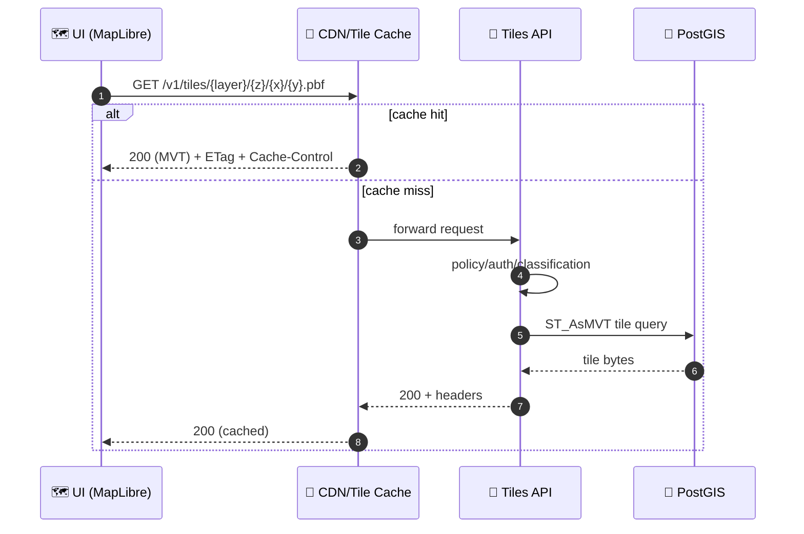

# 🧱 Tiles API — Response Examples (v1)


-orange)

-purple)


> [!NOTE]
> This folder is the **“golden responses”** pack for the **Tiles API** — used for contract tests, SDK examples, and UI integration validation.
> If you change an example here, you’re changing what clients assume is stable ✅

---

## 🔎 What’s covered in this folder

KFM’s UI is map-first (2D/3D, timeline-aware), and tiles are the workhorse for fast rendering. This response pack focuses on:

- 🧩 **Vector tiles (MVT / `.pbf`)** for interactive layers (MapLibre)
- 🛰️ **Raster tiles (`.png`, optional `.webp`)** for imagery / scanned maps / DEM hillshade, etc.
- 🧳 **Offline distribution (`.pmtiles`)** for field mode / disconnected environments
- 🧾 **Tile metadata (TileJSON)** so clients can auto-configure sources/layers
- 🧯 **Errors + governance** (unknown layer, forbidden layer, bad z/x/y, rate-limit)

---

## 🧭 Quick navigation

- [📁 Folder layout](#-folder-layout)
- [🧾 Example index](#-example-index)
- [✅ Response examples](#-response-examples)
  - [1) Vector tile — 200](#1-vector-tile--200)
  - [2) Vector tile — 204 empty](#2-vector-tile--204-empty)
  - [3) TileJSON — 200](#3-tilejson--200)
  - [4) Raster tile — 200](#4-raster-tile--200)
  - [5) PMTiles — 200](#5-pmtiles--200)
  - [6) Errors — 4xx/5xx](#6-errors--4xx5xx)
- [🧊 Caching rules](#-caching-rules)
- [🧬 Provenance & governance headers](#-provenance--governance-headers)
- [⏳ Temporal filtering](#-temporal-filtering)
- [🧪 How to add/update examples](#-how-to-addupdate-examples)
- [📚 Design anchors (project docs)](#-design-anchors-project-docs)

---

## 📁 Folder layout

Suggested structure (examples are binaries + small JSON sidecars):

```text
📁 api/contracts/examples/responses/v1/tiles/
├─ 📄 README.md
├─ 📁 mvt/
│  ├─ 🧱 200__tiles__landcover__z14__x4270__y6331.pbf
│  ├─ 📄 200__tiles__landcover__z14__x4270__y6331.headers.json
│  ├─ 📄 204__tiles__landcover__z14__x4270__y6332.headers.json
│  └─ 📄 404__tiles__unknown_layer.json
├─ 📁 tilejson/
│  ├─ 📄 200__tiles__landcover__tilejson.json
│  └─ 📄 404__tiles__unknown_layer__tilejson.json
├─ 📁 raster/
│  ├─ 🗺️ 200__tiles__historic_map_ellis_co_1894__z12__x1024__y1536.png
│  └─ 📄 200__tiles__historic_map_ellis_co_1894__z12__x1024__y1536.headers.json
├─ 📁 pmtiles/
│  ├─ 🧳 200__tiles__landcover.pmtiles
│  └─ 📄 200__tiles__landcover.pmtiles.headers.json
└─ 📁 errors/
   ├─ 🧯 400__tiles__bad_zxy.json
   ├─ 🔒 403__tiles__restricted_layer.json
   └─ 🧯 429__tiles__rate_limited.json
```

> [!TIP]
> Keep binary examples small. If any artifact exceeds your repo limits, store it via **Git LFS** or replace with a tiny representative tile (still valid MVT/PNG).

---

## 🧾 Example index

| Example ID | Endpoint pattern | Status | Body | Stored as |
|---|---|---:|---|---|
| `mvt_ok` | `GET /v1/tiles/{layer}/{z}/{x}/{y}.pbf` | 200 | binary | `mvt/*.pbf` + `headers.json` |
| `mvt_empty` | same | 204 | none | `mvt/*204*.headers.json` |
| `tilejson_ok` | `GET /v1/tiles/{layer}/tilejson.json` | 200 | JSON | `tilejson/*.json` |
| `raster_ok` | `GET /v1/tiles/{layer}/{z}/{x}/{y}.png` | 200 | binary | `raster/*.png` + `headers.json` |
| `pmtiles_ok` | `GET /v1/tiles/{layer}.pmtiles` | 200 | binary | `pmtiles/*.pmtiles` + `headers.json` |
| `unknown_layer` | any | 404 | JSON | `errors/404*.json` |
| `restricted_layer` | any | 403 (or 404*) | JSON | `errors/403*.json` |
| `bad_zxy` | any | 400 | JSON | `errors/400*.json` |
| `rate_limited` | any | 429 | JSON | `errors/429*.json` |

\* *Some deployments may choose “404 for restricted” to reduce information leakage. Keep one canonical approach for v1 and test it consistently.*

---

## ✅ Response examples

### 1) Vector tile — 200

**Route (example):**
- `GET /v1/tiles/landcover/{z}/{x}/{y}.pbf`

**Expected headers (example):**

```http
HTTP/1.1 200 OK
Content-Type: application/vnd.mapbox-vector-tile
Content-Encoding: gzip
Cache-Control: public, max-age=86400, stale-while-revalidate=604800
ETag: "mvt-landcover-z14-x4270-y6331-<digest>"
Vary: Accept-Encoding, Authorization

X-KFM-Dataset-Id: kfm.ks.landcover
X-KFM-Dataset-Version: <semver-or-digest>
X-KFM-Run-Id: <run-id>
Link: </v1/catalog/stac/collections/kfm.ks.landcover>; rel="collection"
Link: </v1/catalog/prov/runs/<run-id>>; rel="provenance"
```

**Body:**
- Binary MVT bytes (stored as: `mvt/200__tiles__landcover__z14__x4270__y6331.pbf`)

<details>
  <summary>🧪 Client sanity check (decode the example tile)</summary>

```bash
# Option A: use a local decoder tool (your choice)
# - vt2geojson
# - mapbox-vector-tile libraries
# - tippecanoe utilities (where appropriate)
```

</details>

---

### 2) Vector tile — 204 empty

When a tile is valid but has no features for the requested layer/time slice.

```http
HTTP/1.1 204 No Content
Cache-Control: public, max-age=86400
ETag: "mvt-landcover-z14-x4270-y6332-empty-<digest>"
```

Stored as: `mvt/204__tiles__landcover__z14__x4270__y6332.headers.json`

---

### 3) TileJSON — 200

**Route (example):**
- `GET /v1/tiles/landcover/tilejson.json`

**Body (example):**

```json
{
  "tilejson": "3.0.0",
  "name": "Landcover",
  "description": "KFM landcover layer (time-filterable)",
  "version": "1.0.0",
  "scheme": "xyz",
  "tiles": [
    "/v1/tiles/landcover/{z}/{x}/{y}.pbf"
  ],
  "minzoom": 0,
  "maxzoom": 14,
  "bounds": [-102.051, 36.993, -94.588, 40.003],
  "attribution": "KFM • see dataset metadata for sources & license",
  "vector_layers": [
    {
      "id": "landcover",
      "description": "Landcover polygons/labels",
      "fields": {
        "class": "String",
        "source": "String",
        "year": "Number"
      }
    }
  ]
}
```

Stored as: `tilejson/200__tiles__landcover__tilejson.json`

> [!NOTE]
> TileJSON is the “glue” that lets clients auto-wire a source without hardcoding zoom bounds, attribution, etc.

---

### 4) Raster tile — 200

**Route (example):**
- `GET /v1/tiles/historic_map_ellis_co_1894/{z}/{x}/{y}.png`

**Expected headers (example):**

```http
HTTP/1.1 200 OK
Content-Type: image/png
Cache-Control: public, max-age=31536000, immutable
ETag: "raster-ellis-1894-z12-x1024-y1536-<digest>"

X-KFM-Dataset-Id: kfm.ks.maps.ellis_co_1894
X-KFM-Dataset-Version: <semver-or-digest>
```

Stored as:
- `raster/200__tiles__historic_map_ellis_co_1894__z12__x1024__y1536.png`
- `raster/200__tiles__historic_map_ellis_co_1894__z12__x1024__y1536.headers.json`

---

### 5) PMTiles — 200

**Route (example):**
- `GET /v1/tiles/landcover.pmtiles`

**Expected headers (example):**

```http
HTTP/1.1 200 OK
Content-Type: application/vnd.pmtiles
Cache-Control: public, max-age=31536000, immutable
ETag: "pmtiles-landcover-<digest>"

X-KFM-Dataset-Id: kfm.ks.landcover
X-KFM-Dataset-Version: <semver-or-digest>
X-KFM-Artifact-Digest: sha256:<digest>
```

Stored as:
- `pmtiles/200__tiles__landcover.pmtiles`
- `pmtiles/200__tiles__landcover.pmtiles.headers.json`

> [!TIP]
> PMTiles is ideal for **offline packs**: ship a single file + metadata + signatures, then render locally with MapLibre tooling.

---

### 6) Errors — 4xx/5xx

KFM should return consistent, machine-readable errors (recommendation: **Problem+JSON style**).

**Unknown layer (404):**

```json
{
  "type": "https://kfm.dev/problems/tiles/unknown-layer",
  "title": "Unknown tile layer",
  "status": 404,
  "detail": "Layer 'foo' does not exist (or is not published).",
  "instance": "/v1/tiles/foo/14/4270/6331.pbf",
  "request_id": "req_<id>"
}
```

**Forbidden layer (403):**

```json
{
  "type": "https://kfm.dev/problems/tiles/forbidden",
  "title": "Forbidden",
  "status": 403,
  "detail": "You do not have access to this layer.",
  "instance": "/v1/tiles/restricted_layer/14/4270/6331.pbf",
  "request_id": "req_<id>"
}
```

**Bad z/x/y (400):**

```json
{
  "type": "https://kfm.dev/problems/tiles/bad-zxy",
  "title": "Invalid tile coordinates",
  "status": 400,
  "detail": "Expected z in [0..24], x in [0..(2^z-1)], y in [0..(2^z-1)].",
  "instance": "/v1/tiles/landcover/99/0/0.pbf",
  "request_id": "req_<id>"
}
```

**Rate limit (429):**

```json
{
  "type": "https://kfm.dev/problems/rate-limited",
  "title": "Too Many Requests",
  "status": 429,
  "detail": "Retry later.",
  "retry_after_seconds": 30,
  "request_id": "req_<id>"
}
```

---

## 🧊 Caching rules

Tiles are cache gold 🧊 — but only if we standardize headers.

**Recommended defaults:**

- Vector tiles (`.pbf`): `Cache-Control: public, max-age=86400` (+ SWR)
- Raster tiles that never change: `Cache-Control: public, max-age=31536000, immutable`
- PMTiles: same as immutable raster (it’s a versioned artifact)
- Always emit an `ETag`
- If auth affects visibility, include `Vary: Authorization`

> [!IMPORTANT]
> Time-filtered tiles MUST include the time filter in the cache key (query string + ETag) or you’ll serve “wrong year” tiles.

---

## 🧬 Provenance & governance headers

KFM is **provenance-first**. Tiles shouldn’t be “mystery pixels.”

**Proposed minimum headers:**

| Header | Required | Why |
|---|---:|---|
| `X-KFM-Dataset-Id` | ✅ | Stable dataset identity (STAC/DCAT) |
| `X-KFM-Dataset-Version` | ✅ | Reproducibility + cache invalidation |
| `X-KFM-Run-Id` | ⛳ | Trace back to the pipeline run that produced the published artifact |
| `X-KFM-Artifact-Digest` | ⛳ | Strong integrity for offline packs / PMTiles |
| `Link: …; rel="collection"` | ⛳ | Connect tiles → STAC/DCAT record |
| `Link: …; rel="provenance"` | ⛳ | Connect tiles → PROV run graph |

> [!TIP]
> Even if v1 starts “minimal,” keep the header slots stable so we don’t break clients later.

---

## ⏳ Temporal filtering

KFM is timeline-native. Tiles may need to reflect a **time slice** (e.g., “Kansas 1870–1875”).

**Recommended query parameter (STAC-aligned):**
- `datetime=` supports either:
  - instant: `datetime=1870-01-01T00:00:00Z`
  - interval: `datetime=1870-01-01T00:00:00Z/1875-12-31T23:59:59Z`

Example:

```http
GET /v1/tiles/landcover/10/256/392.pbf?datetime=1900-01-01/1910-12-31
```

> [!NOTE]
> If the layer is not time-filterable, ignore `datetime` (but do not error) — unless the product decision is to fail fast.

---

## 🧩 Client wiring examples

### MapLibre GL JS (vector tile source)

```js
map.addSource("kfm-landcover", {
  type: "vector",
  // Prefer absolute URLs in real deployment; relative keeps tests simple
  tiles: ["/v1/tiles/landcover/{z}/{x}/{y}.pbf"],
  minzoom: 0,
  maxzoom: 14
});

map.addLayer({
  id: "kfm-landcover-fill",
  type: "fill",
  source: "kfm-landcover",
  "source-layer": "landcover",
  paint: {
    "fill-opacity": 0.65
  }
});
```

### Simple `curl` smoke test

```bash
curl -I "/v1/tiles/landcover/0/0/0.pbf"
curl -o /tmp/tile.pbf "/v1/tiles/landcover/10/256/392.pbf"
```

---

## 🧪 How to add/update examples

1. ✅ Pick a **published** layer (`{layer}` slug must exist in catalogs)
2. 🎯 Choose a representative tile coordinate (z/x/y) with visible data
3. 📦 Save:
   - binary body (`.pbf`, `.png`, `.pmtiles`)
   - headers sidecar (`.headers.json`)
   - metadata (`tilejson.json` when relevant)
4. 🧬 Record provenance:
   - dataset id + version + run id (if available)
5. 🧪 Update/confirm contract tests:
   - decoding tile doesn’t error
   - headers match the rules (content-type, etag, cache-control)
6. 🔁 If this changes UI behavior, update MapLibre/Cesium fixtures

---

## 🧠 Contract intent (why we’re strict)



---

## 📚 Design anchors (project docs)

This folder’s rules are informed by the project’s core docs and resource packs:

- 📘 **KFM Technical Documentation** (APIs, tiles, scaling, COG + titiler, MapLibre/Cesium)
- 📗 **KFM Architecture, Features & Design** (2D/3D map UI, timeline, API-centric architecture)
- 📙 **KFM UI System Overview** (layer controls, sensitivity handling, provenance-first UX)
- 🧭 **KFM AI System Overview** (policy pack mindset, “no bypassing governance”)
- 📥 **KFM Data Intake Guide** (canonical pipeline order, catalogs, adapters/contracts, PostGIS tiles)
- 🌟 **Latest Ideas & Future Proposals** (PMTiles/offline packs, artifact thinking)
- 💡 **Innovative Concepts** (4D digital twin, time as first-class dimension)
- 🧰 **Additional Project Ideas** (OCI artifacts, signing/attestation, policy gates)
- 🕵️ **Design Audit / Gaps** (risk controls, governance hardening)
- 🗺️ **Open-Source Geospatial Mapping Hub Design** (MapLibre usage patterns, layer sourcing)
- 🧪 **Data mining / privacy notes** (avoid leakage, inference risks, query auditing)
- 📚 **Resource portfolios** (AI concepts, mapping/WebGL, programming language references, data management theory)

✅ If you add a new tile modality (e.g., 3D Tiles tileset.json), it should get its own sibling folder under `responses/v1/` and follow this same “golden responses” pattern.
