# 🛰️ STAC Contract Examples (KFM)


> ✅ This folder contains **golden STAC payload examples** used for:
> - 📜 **API contract tests** (request/response shapes)
> - 🧩 documenting the **KFM STAC Profile** (required `kfm:*` fields)
> - 🔒 validating **classification + redaction** behavior at the API boundary
>
> These examples are intentionally “clean-room” fixtures (safe + synthetic) — replace placeholders when creating real datasets.

---

## 🧭 Why STAC examples live in `api/contracts/`

KFM is built around a strict, non-negotiable pipeline:

```mermaid
flowchart LR
  A["Raw Sources 🧾"] --> B["ETL + Normalization 🧪"]
  B --> C["STAC Items + Collections 🛰️"]
  C --> D["DCAT Dataset Views 🗂️"]
  C --> E["PROV Lineage Bundles 🧬"]
  C --> G["Neo4j Graph (refs catalogs) 🕸️"]
  G --> H["API Layer (contracts + redaction) 🔐"]
  H --> I["Map UI (React · MapLibre · optional Cesium) 🗺️"]
  I --> J["Story Nodes (governed narratives) ✍️"]
  J --> K["Focus Mode (provenance-linked context) 🎯"]
```



**Key idea:** the **API is the boundary** where governance is enforced (classification, redaction, policy rules).  
So the contract examples here are **the “known-good” reference payloads** that clients (UI, tools, external integrators) can rely on.

---

## 📁 Folder layout (recommended)

```text
api/contracts/examples/stac/
├─ README.md                          👈 you are here
├─ stac.root.landing-page.json        🧭 STAC API landing page (OGC-ish)
├─ stac.collections.response.json     📚 GET /collections response example
├─ stac.collection.kfm.ks-landcover.json
├─ stac.item.kfm.ks-landcover.1990.json
├─ stac.item.kfm.usgs-gauge.example.json
├─ stac.item.kfm.story-asset.3d.example.json
├─ stac.search.request.json           🔎 POST /search request example
└─ stac.search.response.json          📦 POST /search response example
```

> [!TIP]
> Keep filenames **stable + deterministic**. These examples often act like **golden fixtures** in CI.

---

## 🧩 KFM STAC Profile (quick rules)

The authoritative spec lives in: `docs/standards/KFM_STAC_PROFILE.md` 📘  
This README summarizes the “must-have” conventions these examples demonstrate.

### ✅ Required KFM fields (common)

| Field | Where | Why it exists |
|---|---|---|
| `kfm:dataset_id` | `Item.properties` (+ `Collection.summaries`) | Canonical dataset identity used across STAC/DCAT/PROV/Graph |
| `kfm:classification` | `Item.properties` (+ `Collection.summaries`) | Drives redaction + access control (API boundary) |
| `kfm:dataset_version` | `Item.properties` | Aligns item outputs to release/versioning expectations |
| `assets.provenance` | `Item.assets` | Stable pointer to PROV lineage bundle (evidence-first) |
| `assets.dcat` | `Item.assets` or `Item.links` | Stable pointer to DCAT discovery record |

### 🔗 Cross-layer linkage expectations (don’t skip)
- **STAC Items must point to actual assets** (files or stable API endpoints) 📎
- **DCAT must link to STAC** (distributions) 🧭
- **PROV must link end-to-end** (raw → work → processed outputs) 🧬
- **Graph stores references back to catalogs** (not bulky payloads) 🕸️

> [!IMPORTANT]
> If you publish/modify `data/processed/**`, you must publish/modify the matching **STAC + DCAT + PROV** artifacts — no exceptions. 🚦

---

## 🌐 Endpoint → example mapping

| Endpoint | Method | Example file |
|---|---:|---|
| `/api/stac` | GET | `stac.root.landing-page.json` |
| `/api/stac/collections` | GET | `stac.collections.response.json` |
| `/api/stac/collections/{collectionId}` | GET | `stac.collection.*.json` |
| `/api/stac/collections/{collectionId}/items/{itemId}` | GET | `stac.item.*.json` |
| `/api/stac/search` | POST | `stac.search.request.json` + `stac.search.response.json` |

> [!NOTE]
> The exact route prefix (`/api/stac`, `/stac`, `/v1/stac`, etc.) is implementation-defined — the important part is that responses match these **contract shapes**.

---

## 🧾 Example payloads

### 1) 🧭 STAC API landing page (root)

<details>
<summary><strong>📄 stac.root.landing-page.json</strong></summary>

```json
{
  "title": "Kansas Frontier Matrix (KFM) — STAC API (Example)",
  "description": "Landing page for KFM's STAC API. This payload is an API contract example, not production data.",
  "links": [
    {
      "rel": "self",
      "href": "https://example.com/api/stac",
      "type": "application/json"
    },
    {
      "rel": "data",
      "href": "https://example.com/api/stac/collections",
      "type": "application/json",
      "title": "Collections"
    },
    {
      "rel": "search",
      "href": "https://example.com/api/stac/search",
      "type": "application/geo+json",
      "title": "STAC Search (POST)"
    },
    {
      "rel": "conformance",
      "href": "https://example.com/api/stac/conformance",
      "type": "application/json"
    }
  ],
  "conformsTo": [
    "https://api.stacspec.org/v1.0.0/core",
    "https://api.stacspec.org/v1.0.0/item-search"
  ]
}
```

</details>

---

### 2) 📚 `/collections` response (wrapper)

<details>
<summary><strong>📄 stac.collections.response.json</strong></summary>

```json
{
  "collections": [
    {
      "type": "Collection",
      "stac_version": "1.0.0",
      "stac_extensions": [
        "https://stac-extensions.github.io/item-assets/v1.0.0/schema.json",
        "https://stac-extensions.github.io/projection/v1.1.0/schema.json",
        "https://stac-extensions.github.io/file/v2.1.0/schema.json",
        "https://stac-extensions.github.io/checksum/v1.0.0/schema.json",
        "https://example.com/stac/extensions/kfm/v1.0.0/schema.json"
      ],
      "id": "kfm.ks-landcover",
      "title": "Kansas Landcover (Example)",
      "description": "Example STAC Collection used as a golden contract fixture for KFM. Represents annual landcover rasters over Kansas with multiple distribution formats.",
      "keywords": [
        "kansas",
        "landcover",
        "raster",
        "pmtiles",
        "cog",
        "example"
      ],
      "license": "CC-BY-4.0",
      "providers": [
        {
          "name": "Kansas Frontier Matrix (KFM)",
          "roles": [
            "host",
            "processor"
          ],
          "url": "https://example.com/kfm"
        }
      ],
      "extent": {
        "spatial": {
          "bbox": [
            [
              -102.051744,
              36.993016,
              -94.588413,
              40.003166
            ]
          ]
        },
        "temporal": {
          "interval": [
            [
              "1990-01-01T00:00:00Z",
              "2020-12-31T23:59:59Z"
            ]
          ]
        }
      },
      "summaries": {
        "kfm:dataset_id": [
          "kfm:dataset:ks-landcover"
        ],
        "kfm:classification": [
          "public"
        ],
        "proj:epsg": [
          4326
        ],
        "kfm:ks_counties": [
          "ALL"
        ]
      },
      "item_assets": {
        "cog": {
          "title": "COG raster",
          "type": "image/tiff; application=geotiff; profile=cloud-optimized",
          "roles": [
            "data"
          ],
          "description": "Cloud-Optimized GeoTIFF distribution.",
          "file:checksum": "sha256:__REPLACE__",
          "file:size": 0
        },
        "pmtiles": {
          "title": "PMTiles",
          "type": "application/vnd.pmtiles",
          "roles": [
            "tiles"
          ],
          "description": "PMTiles distribution for fast web map rendering.",
          "file:checksum": "sha256:__REPLACE__",
          "file:size": 0
        },
        "geoparquet": {
          "title": "GeoParquet (vectorized)",
          "type": "application/vnd.apache.parquet",
          "roles": [
            "data"
          ],
          "description": "Optional vectorized distribution for analytics.",
          "file:checksum": "sha256:__REPLACE__",
          "file:size": 0
        },
        "provenance": {
          "title": "PROV-O bundle",
          "type": "application/ld+json",
          "roles": [
            "metadata"
          ],
          "description": "Lineage record (inputs \u2192 processing \u2192 outputs)."
        },
        "dcat": {
          "title": "DCAT dataset record",
          "type": "application/ld+json",
          "roles": [
            "metadata"
          ],
          "description": "Discovery-level dataset metadata (title, license, distributions)."
        }
      },
      "links": [
        {
          "rel": "self",
          "href": "https://example.com/api/stac/collections/kfm.ks-landcover",
          "type": "application/json"
        },
        {
          "rel": "root",
          "href": "https://example.com/api/stac",
          "type": "application/json"
        },
        {
          "rel": "parent",
          "href": "https://example.com/api/stac",
          "type": "application/json"
        },
        {
          "rel": "items",
          "href": "https://example.com/api/stac/collections/kfm.ks-landcover/items",
          "type": "application/geo+json"
        },
        {
          "rel": "describedby",
          "href": "https://example.com/api/catalog/dcat/kfm.ks-landcover.jsonld",
          "type": "application/ld+json",
          "title": "DCAT record"
        },
        {
          "rel": "related",
          "href": "https://example.com/api/prov/kfm.ks-landcover.jsonld",
          "type": "application/ld+json",
          "title": "PROV record"
        },
        {
          "rel": "license",
          "href": "https://creativecommons.org/licenses/by/4.0/",
          "type": "text/html",
          "title": "CC BY 4.0"
        }
      ]
    }
  ],
  "links": [
    {
      "rel": "self",
      "href": "https://example.com/api/stac/collections",
      "type": "application/json"
    },
    {
      "rel": "root",
      "href": "https://example.com/api/stac",
      "type": "application/json"
    }
  ]
}
```

</details>

---

### 3) 🛰️ STAC Collection example (Kansas Landcover)

> This example shows:
> - ✅ `kfm:dataset_id` + `kfm:classification` at collection-level summaries
> - 📦 `item_assets` describing expected assets across items
> - 🔗 link-out to DCAT + PROV

<details>
<summary><strong>📄 stac.collection.kfm.ks-landcover.json</strong></summary>

```json
{
  "type": "Collection",
  "stac_version": "1.0.0",
  "stac_extensions": [
    "https://stac-extensions.github.io/item-assets/v1.0.0/schema.json",
    "https://stac-extensions.github.io/projection/v1.1.0/schema.json",
    "https://stac-extensions.github.io/file/v2.1.0/schema.json",
    "https://stac-extensions.github.io/checksum/v1.0.0/schema.json",
    "https://example.com/stac/extensions/kfm/v1.0.0/schema.json"
  ],
  "id": "kfm.ks-landcover",
  "title": "Kansas Landcover (Example)",
  "description": "Example STAC Collection used as a golden contract fixture for KFM. Represents annual landcover rasters over Kansas with multiple distribution formats.",
  "keywords": [
    "kansas",
    "landcover",
    "raster",
    "pmtiles",
    "cog",
    "example"
  ],
  "license": "CC-BY-4.0",
  "providers": [
    {
      "name": "Kansas Frontier Matrix (KFM)",
      "roles": [
        "host",
        "processor"
      ],
      "url": "https://example.com/kfm"
    }
  ],
  "extent": {
    "spatial": {
      "bbox": [
        [
          -102.051744,
          36.993016,
          -94.588413,
          40.003166
        ]
      ]
    },
    "temporal": {
      "interval": [
        [
          "1990-01-01T00:00:00Z",
          "2020-12-31T23:59:59Z"
        ]
      ]
    }
  },
  "summaries": {
    "kfm:dataset_id": [
      "kfm:dataset:ks-landcover"
    ],
    "kfm:classification": [
      "public"
    ],
    "proj:epsg": [
      4326
    ],
    "kfm:ks_counties": [
      "ALL"
    ]
  },
  "item_assets": {
    "cog": {
      "title": "COG raster",
      "type": "image/tiff; application=geotiff; profile=cloud-optimized",
      "roles": [
        "data"
      ],
      "description": "Cloud-Optimized GeoTIFF distribution.",
      "file:checksum": "sha256:__REPLACE__",
      "file:size": 0
    },
    "pmtiles": {
      "title": "PMTiles",
      "type": "application/vnd.pmtiles",
      "roles": [
        "tiles"
      ],
      "description": "PMTiles distribution for fast web map rendering.",
      "file:checksum": "sha256:__REPLACE__",
      "file:size": 0
    },
    "geoparquet": {
      "title": "GeoParquet (vectorized)",
      "type": "application/vnd.apache.parquet",
      "roles": [
        "data"
      ],
      "description": "Optional vectorized distribution for analytics.",
      "file:checksum": "sha256:__REPLACE__",
      "file:size": 0
    },
    "provenance": {
      "title": "PROV-O bundle",
      "type": "application/ld+json",
      "roles": [
        "metadata"
      ],
      "description": "Lineage record (inputs \u2192 processing \u2192 outputs)."
    },
    "dcat": {
      "title": "DCAT dataset record",
      "type": "application/ld+json",
      "roles": [
        "metadata"
      ],
      "description": "Discovery-level dataset metadata (title, license, distributions)."
    }
  },
  "links": [
    {
      "rel": "self",
      "href": "https://example.com/api/stac/collections/kfm.ks-landcover",
      "type": "application/json"
    },
    {
      "rel": "root",
      "href": "https://example.com/api/stac",
      "type": "application/json"
    },
    {
      "rel": "parent",
      "href": "https://example.com/api/stac",
      "type": "application/json"
    },
    {
      "rel": "items",
      "href": "https://example.com/api/stac/collections/kfm.ks-landcover/items",
      "type": "application/geo+json"
    },
    {
      "rel": "describedby",
      "href": "https://example.com/api/catalog/dcat/kfm.ks-landcover.jsonld",
      "type": "application/ld+json",
      "title": "DCAT record"
    },
    {
      "rel": "related",
      "href": "https://example.com/api/prov/kfm.ks-landcover.jsonld",
      "type": "application/ld+json",
      "title": "PROV record"
    },
    {
      "rel": "license",
      "href": "https://creativecommons.org/licenses/by/4.0/",
      "type": "text/html",
      "title": "CC BY 4.0"
    }
  ]
}
```

</details>

---

### 4) 🧱 STAC Item example (COG + PMTiles + OCI distribution)

> This example demonstrates:
> - 📌 Kansas bounding geometry + bbox
> - 🧾 deterministic IDs (`kfm.ks-landcover.1990`)
> - 📦 multiple assets (COG, PMTiles, GeoParquet)
> - 📦 **OCI artifact reference** for PMTiles (optional but encouraged) 🐳📦
> - 🔗 explicit DCAT + PROV linkage

<details>
<summary><strong>📄 stac.item.kfm.ks-landcover.1990.json</strong></summary>

```json
{
  "type": "Feature",
  "stac_version": "1.0.0",
  "stac_extensions": [
    "https://stac-extensions.github.io/projection/v1.1.0/schema.json",
    "https://stac-extensions.github.io/file/v2.1.0/schema.json",
    "https://stac-extensions.github.io/checksum/v1.0.0/schema.json",
    "https://example.com/stac/extensions/kfm/v1.0.0/schema.json"
  ],
  "id": "kfm.ks-landcover.1990",
  "collection": "kfm.ks-landcover",
  "geometry": {
    "type": "Polygon",
    "coordinates": [
      [
        [
          -102.051744,
          36.993016
        ],
        [
          -94.588413,
          36.993016
        ],
        [
          -94.588413,
          40.003166
        ],
        [
          -102.051744,
          40.003166
        ],
        [
          -102.051744,
          36.993016
        ]
      ]
    ]
  },
  "bbox": [
    -102.051744,
    36.993016,
    -94.588413,
    40.003166
  ],
  "properties": {
    "datetime": null,
    "start_datetime": "1990-01-01T00:00:00Z",
    "end_datetime": "1990-12-31T23:59:59Z",
    "proj:epsg": 4326,
    "kfm:dataset_id": "kfm:dataset:ks-landcover",
    "kfm:dataset_version": "1990.0.0",
    "kfm:classification": "public",
    "kfm:run_id": "kfm:run:landcover:1990:__RUN_ID__",
    "kfm:git_sha": "__GIT_SHA__",
    "kfm:build_pr": "__PR_NUMBER__",
    "kfm:ks_counties": [
      "ALL"
    ],
    "kfm:uncertainty_note": "Example fixture — replace with real QA/uncertainty metrics for production datasets."
  },
  "assets": {
    "cog": {
      "href": "https://example.com/assets/ks-landcover/1990/ks-landcover-1990.cog.tif",
      "type": "image/tiff; application=geotiff; profile=cloud-optimized",
      "roles": [
        "data"
      ],
      "title": "Kansas Landcover 1990 (COG)",
      "file:checksum": "sha256:__REPLACE__",
      "file:size": 0
    },
    "pmtiles": {
      "href": "oci://ghcr.io/kansas-frontier-matrix/tiles/ks-landcover:1990@sha256:__DIGEST__",
      "type": "application/vnd.pmtiles",
      "roles": [
        "tiles"
      ],
      "title": "Kansas Landcover 1990 (PMTiles via OCI)",
      "file:checksum": "sha256:__REPLACE__",
      "file:size": 0,
      "kfm:oci": {
        "registry": "ghcr.io",
        "repository": "kansas-frontier-matrix/tiles/ks-landcover",
        "tag": "1990",
        "digest": "sha256:__DIGEST__",
        "signed": true,
        "signature": "oci://ghcr.io/kansas-frontier-matrix/tiles/ks-landcover:1990.sig"
      }
    },
    "geoparquet": {
      "href": "https://example.com/assets/ks-landcover/1990/ks-landcover-1990.geoparquet",
      "type": "application/vnd.apache.parquet",
      "roles": [
        "data"
      ],
      "title": "Kansas Landcover 1990 (GeoParquet)",
      "file:checksum": "sha256:__REPLACE__",
      "file:size": 0
    },
    "thumbnail": {
      "href": "https://example.com/assets/ks-landcover/1990/thumbnail.png",
      "type": "image/png",
      "roles": [
        "thumbnail"
      ],
      "title": "Thumbnail"
    },
    "provenance": {
      "href": "https://example.com/api/prov/kfm.ks-landcover.1990.jsonld",
      "type": "application/ld+json",
      "roles": [
        "metadata"
      ],
      "title": "PROV bundle (lineage)"
    },
    "dcat": {
      "href": "https://example.com/api/catalog/dcat/kfm.ks-landcover.jsonld",
      "type": "application/ld+json",
      "roles": [
        "metadata"
      ],
      "title": "DCAT dataset record"
    }
  },
  "links": [
    {
      "rel": "self",
      "href": "https://example.com/api/stac/collections/kfm.ks-landcover/items/kfm.ks-landcover.1990",
      "type": "application/geo+json"
    },
    {
      "rel": "collection",
      "href": "https://example.com/api/stac/collections/kfm.ks-landcover",
      "type": "application/json"
    },
    {
      "rel": "root",
      "href": "https://example.com/api/stac",
      "type": "application/json"
    },
    {
      "rel": "parent",
      "href": "https://example.com/api/stac/collections/kfm.ks-landcover",
      "type": "application/json"
    },
    {
      "rel": "describedby",
      "href": "https://example.com/api/catalog/dcat/kfm.ks-landcover.jsonld",
      "type": "application/ld+json"
    },
    {
      "rel": "related",
      "href": "https://example.com/api/prov/kfm.ks-landcover.1990.jsonld",
      "type": "application/ld+json"
    }
  ]
}
```

</details>

---

### 5) ⏱ Streaming / real-time item example (API-backed asset)

> This shows the “streaming data is just many small datasets over time” pattern:
> - The **asset `href` can be a stable API endpoint**, not only a static file
> - Still must have DCAT + PROV coverage (even if “rolling”) ✅

<details>
<summary><strong>📄 stac.item.kfm.usgs-gauge.example.json</strong></summary>

```json
{
  "type": "Feature",
  "stac_version": "1.0.0",
  "stac_extensions": [
    "https://stac-extensions.github.io/file/v2.1.0/schema.json",
    "https://example.com/stac/extensions/kfm/v1.0.0/schema.json"
  ],
  "id": "kfm.usgs-nwis.gauge.06891000.2026-01-24T02-15-00Z",
  "collection": "kfm.usgs-nwis-river-gauges",
  "geometry": {
    "type": "Point",
    "coordinates": [
      -95.6752,
      39.0483
    ]
  },
  "bbox": [
    -95.6752,
    39.0483,
    -95.6752,
    39.0483
  ],
  "properties": {
    "datetime": "2026-01-24T02:15:00Z",
    "kfm:dataset_id": "kfm:dataset:usgs-nwis-river-gauges",
    "kfm:dataset_version": "rolling",
    "kfm:classification": "public",
    "kfm:station_id": "06891000",
    "kfm:station_name": "Kansas River at Topeka (Example)",
    "kfm:measurement": {
      "name": "gage_height",
      "unit": "ft",
      "value": 12.34
    },
    "kfm:source": {
      "name": "USGS NWIS",
      "retrieved_at": "2026-01-24T02:16:10Z"
    },
    "kfm:run_id": "kfm:run:stream:usgs-nwis:2026-01-24",
    "kfm:uncertainty_note": "Streaming values may be provisional; see provenance + source system for caveats."
  },
  "assets": {
    "observation": {
      "href": "https://example.com/api/v1/streams/usgs-nwis/stations/06891000/observations/2026-01-24T02:15:00Z",
      "type": "application/json",
      "roles": [
        "data"
      ],
      "title": "Observation record (API)",
      "description": "Single observation payload."
    },
    "timeseries": {
      "href": "https://example.com/api/v1/streams/usgs-nwis/stations/06891000/timeseries?since=PT24H",
      "type": "application/json",
      "roles": [
        "data"
      ],
      "title": "Recent timeseries (API)",
      "description": "Windowed recent timeseries query."
    },
    "provenance": {
      "href": "https://example.com/api/prov/kfm.usgs-nwis.gauge.06891000.2026-01-24T02-15-00Z.jsonld",
      "type": "application/ld+json",
      "roles": [
        "metadata"
      ],
      "title": "PROV bundle (streaming lineage)"
    },
    "dcat": {
      "href": "https://example.com/api/catalog/dcat/kfm.usgs-nwis-river-gauges.jsonld",
      "type": "application/ld+json",
      "roles": [
        "metadata"
      ],
      "title": "DCAT dataset record"
    }
  },
  "links": [
    {
      "rel": "self",
      "href": "https://example.com/api/stac/collections/kfm.usgs-nwis-river-gauges/items/kfm.usgs-nwis.gauge.06891000.2026-01-24T02-15-00Z",
      "type": "application/geo+json"
    },
    {
      "rel": "collection",
      "href": "https://example.com/api/stac/collections/kfm.usgs-nwis-river-gauges",
      "type": "application/json"
    },
    {
      "rel": "root",
      "href": "https://example.com/api/stac",
      "type": "application/json"
    }
  ]
}
```

</details>

---

### 6) 🧊 3D / Cesium-ready item example (Story Asset)

> Use this pattern for:
> - 🧊 3D reconstructions, photogrammetry outputs, digital twin artifacts
> - 🗺️ optional Cesium mode in the UI (3D tiles streaming)
> - ✍️ Story Nodes that cite a 3D asset (via `links[]`)

<details>
<summary><strong>📄 stac.item.kfm.story-asset.3d.example.json</strong></summary>

```json
{
  "type": "Feature",
  "stac_version": "1.0.0",
  "stac_extensions": [
    "https://stac-extensions.github.io/file/v2.1.0/schema.json",
    "https://example.com/stac/extensions/kfm/v1.0.0/schema.json"
  ],
  "id": "kfm.story-asset.pony-express-station-3d.v1",
  "collection": "kfm.story-assets",
  "geometry": {
    "type": "Point",
    "coordinates": [
      -96.5717,
      39.1836
    ]
  },
  "bbox": [
    -96.5717,
    39.1836,
    -96.5717,
    39.1836
  ],
  "properties": {
    "datetime": "2024-06-01T00:00:00Z",
    "kfm:dataset_id": "kfm:dataset:story-assets",
    "kfm:dataset_version": "1.0.0",
    "kfm:classification": "public",
    "kfm:asset_kind": "3d-reconstruction",
    "kfm:story_node_id": "story:pony-express:station-reconstruction",
    "kfm:place_hint": {
      "name": "Example site (Kansas)",
      "kind": "historic_site"
    }
  },
  "assets": {
    "gltf": {
      "href": "https://example.com/assets/story/pony-express-station/model.glb",
      "type": "model/gltf-binary",
      "roles": [
        "data"
      ],
      "title": "3D model (glTF/GLB)",
      "file:checksum": "sha256:__REPLACE__",
      "file:size": 0
    },
    "tileset": {
      "href": "https://example.com/assets/story/pony-express-station/tileset.json",
      "type": "application/json",
      "roles": [
        "tiles"
      ],
      "title": "3D Tiles tileset (Cesium)",
      "description": "Optimized for streaming in Cesium (optional KFM UI mode).",
      "file:checksum": "sha256:__REPLACE__",
      "file:size": 0
    },
    "thumbnail": {
      "href": "https://example.com/assets/story/pony-express-station/thumbnail.jpg",
      "type": "image/jpeg",
      "roles": [
        "thumbnail"
      ],
      "title": "Preview"
    },
    "provenance": {
      "href": "https://example.com/api/prov/kfm.story-asset.pony-express-station-3d.v1.jsonld",
      "type": "application/ld+json",
      "roles": [
        "metadata"
      ],
      "title": "PROV bundle (model lineage)"
    }
  },
  "links": [
    {
      "rel": "self",
      "href": "https://example.com/api/stac/collections/kfm.story-assets/items/kfm.story-asset.pony-express-station-3d.v1",
      "type": "application/geo+json"
    },
    {
      "rel": "collection",
      "href": "https://example.com/api/stac/collections/kfm.story-assets",
      "type": "application/json"
    },
    {
      "rel": "root",
      "href": "https://example.com/api/stac",
      "type": "application/json"
    },
    {
      "rel": "related",
      "href": "https://example.com/docs/reports/story_nodes/published/pony-express/station-reconstruction.md",
      "type": "text/markdown",
      "title": "Story Node (governed narrative)"
    }
  ]
}
```

</details>

---

### 7) 🔎 STAC Search (request + response)

<details>
<summary><strong>📄 stac.search.request.json</strong></summary>

```json
{
  "collections": [
    "kfm.ks-landcover"
  ],
  "bbox": [
    -102.051744,
    36.993016,
    -94.588413,
    40.003166
  ],
  "datetime": "1990-01-01T00:00:00Z/1990-12-31T23:59:59Z",
  "limit": 1,
  "query": {
    "kfm:classification": {
      "eq": "public"
    }
  }
}
```

</details>

<details>
<summary><strong>📄 stac.search.response.json</strong></summary>

```json
{
  "type": "FeatureCollection",
  "features": [
    {
      "type": "Feature",
      "stac_version": "1.0.0",
      "stac_extensions": [
        "https://stac-extensions.github.io/projection/v1.1.0/schema.json",
        "https://stac-extensions.github.io/file/v2.1.0/schema.json",
        "https://stac-extensions.github.io/checksum/v1.0.0/schema.json",
        "https://example.com/stac/extensions/kfm/v1.0.0/schema.json"
      ],
      "id": "kfm.ks-landcover.1990",
      "collection": "kfm.ks-landcover",
      "geometry": {
        "type": "Polygon",
        "coordinates": [
          [
            [
              -102.051744,
              36.993016
            ],
            [
              -94.588413,
              36.993016
            ],
            [
              -94.588413,
              40.003166
            ],
            [
              -102.051744,
              40.003166
            ],
            [
              -102.051744,
              36.993016
            ]
          ]
        ]
      },
      "bbox": [
        -102.051744,
        36.993016,
        -94.588413,
        40.003166
      ],
      "properties": {
        "datetime": null,
        "start_datetime": "1990-01-01T00:00:00Z",
        "end_datetime": "1990-12-31T23:59:59Z",
        "proj:epsg": 4326,
        "kfm:dataset_id": "kfm:dataset:ks-landcover",
        "kfm:dataset_version": "1990.0.0",
        "kfm:classification": "public",
        "kfm:run_id": "kfm:run:landcover:1990:__RUN_ID__",
        "kfm:git_sha": "__GIT_SHA__",
        "kfm:build_pr": "__PR_NUMBER__",
        "kfm:ks_counties": [
          "ALL"
        ],
        "kfm:uncertainty_note": "Example fixture — replace with real QA/uncertainty metrics for production datasets."
      },
      "assets": {
        "cog": {
          "href": "https://example.com/assets/ks-landcover/1990/ks-landcover-1990.cog.tif",
          "type": "image/tiff; application=geotiff; profile=cloud-optimized",
          "roles": [
            "data"
          ],
          "title": "Kansas Landcover 1990 (COG)",
          "file:checksum": "sha256:__REPLACE__",
          "file:size": 0
        },
        "pmtiles": {
          "href": "oci://ghcr.io/kansas-frontier-matrix/tiles/ks-landcover:1990@sha256:__DIGEST__",
          "type": "application/vnd.pmtiles",
          "roles": [
            "tiles"
          ],
          "title": "Kansas Landcover 1990 (PMTiles via OCI)",
          "file:checksum": "sha256:__REPLACE__",
          "file:size": 0,
          "kfm:oci": {
            "registry": "ghcr.io",
            "repository": "kansas-frontier-matrix/tiles/ks-landcover",
            "tag": "1990",
            "digest": "sha256:__DIGEST__",
            "signed": true,
            "signature": "oci://ghcr.io/kansas-frontier-matrix/tiles/ks-landcover:1990.sig"
          }
        },
        "geoparquet": {
          "href": "https://example.com/assets/ks-landcover/1990/ks-landcover-1990.geoparquet",
          "type": "application/vnd.apache.parquet",
          "roles": [
            "data"
          ],
          "title": "Kansas Landcover 1990 (GeoParquet)",
          "file:checksum": "sha256:__REPLACE__",
          "file:size": 0
        },
        "thumbnail": {
          "href": "https://example.com/assets/ks-landcover/1990/thumbnail.png",
          "type": "image/png",
          "roles": [
            "thumbnail"
          ],
          "title": "Thumbnail"
        },
        "provenance": {
          "href": "https://example.com/api/prov/kfm.ks-landcover.1990.jsonld",
          "type": "application/ld+json",
          "roles": [
            "metadata"
          ],
          "title": "PROV bundle (lineage)"
        },
        "dcat": {
          "href": "https://example.com/api/catalog/dcat/kfm.ks-landcover.jsonld",
          "type": "application/ld+json",
          "roles": [
            "metadata"
          ],
          "title": "DCAT dataset record"
        }
      },
      "links": [
        {
          "rel": "self",
          "href": "https://example.com/api/stac/collections/kfm.ks-landcover/items/kfm.ks-landcover.1990",
          "type": "application/geo+json"
        },
        {
          "rel": "collection",
          "href": "https://example.com/api/stac/collections/kfm.ks-landcover",
          "type": "application/json"
        },
        {
          "rel": "root",
          "href": "https://example.com/api/stac",
          "type": "application/json"
        },
        {
          "rel": "parent",
          "href": "https://example.com/api/stac/collections/kfm.ks-landcover",
          "type": "application/json"
        },
        {
          "rel": "describedby",
          "href": "https://example.com/api/catalog/dcat/kfm.ks-landcover.jsonld",
          "type": "application/ld+json"
        },
        {
          "rel": "related",
          "href": "https://example.com/api/prov/kfm.ks-landcover.1990.jsonld",
          "type": "application/ld+json"
        }
      ]
    }
  ],
  "links": [
    {
      "rel": "self",
      "href": "https://example.com/api/stac/search",
      "type": "application/geo+json",
      "method": "POST"
    }
  ],
  "numberMatched": 1,
  "numberReturned": 1
}
```

</details>

---

## ✅ Validation checklist (what CI should enforce)

**Schema + contract checks**
- ✅ JSON parses
- ✅ STAC Core required fields present
- ✅ KFM STAC Profile required `kfm:*` fields present
- ✅ Links resolve (or are intentionally stubbed in local test mode)

**Governance checks**
- 🔒 `kfm:classification` must be present and respected by API auth/redaction
- 🧬 `assets.provenance` must exist for publishable items
- 🧭 DCAT must exist for dataset-level discoverability
- 🚫 No direct UI → DB/Graph access (API boundary only)

> [!TIP]
> Treat these fixtures as “golden” — changes should be reviewed like API changes and often require versioning.

---

## 🔒 Governance + sovereignty notes (STAC-relevant)

- **Classification isn’t optional**: it drives redaction and prevents leakage in the UI. 🛡️  
- **Sensitive locations** can be represented with generalized geometry/bbox while preserving lineage + access controls. 🧭  
- **FAIR+CARE**: license + access constraints must be explicit, and distributions must remain discoverable without exposing restricted assets. ⚖️  
- **Evidence artifacts** (AI outputs, model runs, OCR corpora, predicted layers) must be treated like datasets: STAC/DCAT/PROV required. 🤖📦

---

## 🧠 How UI + Focus Mode use STAC (mental model)

- 🗺️ **Map UI** uses STAC Items/Collections to locate the actual renderable assets (PMTiles/COG/3D tiles).  
- 🎯 **Focus Mode** relies on STAC + DCAT + PROV to ensure every displayed claim or layer is traceable and citation-backed.  
- 🕸️ The **graph references** STAC item IDs (and related catalog IDs) to traverse relationships without duplicating payloads.

---

## 📚 Project docs that shaped these examples (read next)

> These examples are aligned with the project’s broader architecture, governance model, and UI/AI designs:

- 📘 Kansas Frontier Matrix (KFM) – Comprehensive Technical Documentation
- 🧱 Kansas Frontier Matrix (KFM) – Comprehensive Architecture, Features, and Design
- 📚 KFM Data Intake – Technical & Design Guide
- 🧭🤖 KFM – AI System Overview (Focus Mode + citations constraints)
- 🗺️ KFM – Comprehensive UI System Overview (MapLibre + optional Cesium)
- 🌟 Latest Ideas & Future Proposals (governance + workflow hardening)
- 💡 Innovative Concepts to Evolve KFM (sovereignty + next-gen interface ideas)
- 🧠 AI Concepts & more (AI/RAG foundations + model governance patterns)
- 🧭 Maps / Virtual Worlds / WebGL compendium (3D + mapping context)
- 🧰 Various programming languages & resources (implementation references)
- 🗄️ Data Management theories + architectures (cataloging + governance context)
- 🧪 Additional Project Ideas (OCI artifact distribution, signing, FAIR+CARE)

---

## 🧩 Next additions (optional but recommended)

- ✅ Add a **“sensitive”** example item showing generalized geometry + restricted distribution links  
- ✅ Add an **AI-generated raster** example item (confidence/uncertainty fields + PROV activity linkage)  
- ✅ Add a **contract test harness** that loads these JSON fixtures and asserts:
  - schema validity
  - required `kfm:*` fields
  - policy constraints (no bypassing provenance/API boundary)

---
