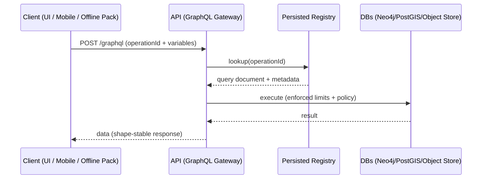

# Persisted GraphQL Operations 🧾⚡


> [!IMPORTANT]
> **This folder is the “allow-list” contract registry** for GraphQL operations used by KFM clients (Web UI, mobile, offline packs, federation clients).  
> If an operation isn’t here (and in the generated manifest), it **must not** run from public clients. 🔒

<details>
<summary><b>📌 Table of Contents</b></summary>

- [What this folder is](#what-this-folder-is)
- [Why persisted queries in KFM](#why-persisted-queries-in-kfm)
- [Directory layout](#directory-layout)
- [Operation rules](#operation-rules)
- [How to add a new persisted operation](#how-to-add-a-new-persisted-operation)
- [Manifest format](#manifest-format)
- [Client request shape](#client-request-shape)
- [Server enforcement](#server-enforcement)
- [Governance, privacy, and query auditing](#governance-privacy-and-query-auditing)
- [Performance notes](#performance-notes)
- [Versioning and deprecation](#versioning-and-deprecation)
- [Troubleshooting](#troubleshooting)
- [Design references](#design-references)

</details>

---

## What this folder is
KFM exposes **REST + GraphQL** through a stateless API layer (FastAPI) to support an interactive React UI (MapLibre/Cesium), Story Nodes, timeline navigation, and Focus Mode (AI) workflows. Persisted operations make that interface:

- **Contract-first** 🧩 (UI and API evolve safely together)
- **Governance-friendly** 🛡️ (whitelist + policy gates + auditability)
- **Performance-stable** ⚡ (cacheable IDs, predictable shapes, controlled cost)
- **Federation-ready** 🌐 (portable operations across “Frontier Matrix” instances)

This directory contains the **source-of-truth** GraphQL documents that are allowed to run from clients.

---

## Why persisted queries in KFM
KFM’s GraphQL is powerful for traversing the knowledge graph (Person → Events → Places, Dataset → STAC → Assets, etc.), but power comes with risk:

- GraphQL can be **expensive** (deep recursion, huge lists) if unconstrained.
- Some domains are **sensitive** (privacy, cultural protocols, protected locations).
- KFM emphasizes **provenance-first** workflows (FAIR/CARE, STAC/DCAT/PROV, “map behind the map”).

Persisted queries are one of the strongest “fail-closed” controls:

✅ Only known operations run  
✅ Each operation can be reviewed + costed + tagged (sensitivity, cache TTL, offline eligibility)  
✅ Requests become **auditable** at the operation ID level  
✅ Shapes stay stable for the UI, story engine, offline packs, and future AR clients

---

## Directory layout
> [!NOTE]
> The exact subfolders may vary by repo evolution. This layout is the **recommended contract structure** for KFM.

```text
📁 api/
  📁 contracts/
    📁 graphql/
      📁 persisted/
        📄 README.md                        👈 you are here
        📁 operations/                      👈 human-authored .graphql docs (source of truth)
          📁 catalog/
          📁 graph/
          📁 map/
          📁 story/
          📁 ai/
          📁 realtime/
        📁 generated/                       👈 machine-generated outputs (committed)
          📄 persisted-manifest.json
          📄 persisted-manifest.sha256
          📄 types.ts                       (optional) typed client bindings
        📁 tests/                           👈 validation + policy checks
          📄 persisted-ops.test.*
```

---

## Operation rules
### ✅ Naming conventions
- **Operation name:** `PascalCase` (e.g., `DatasetById`, `SearchDatasets`, `FocusModeSubgraph`)
- **File name:** match operation name (e.g., `DatasetById.graphql`)
- **Folder:** by domain/use-case (`catalog/`, `map/`, `story/`, `ai/`, `realtime/`)

### ✅ GraphQL hygiene rules (must)
- **Always paginate lists** (`first/after` or equivalent)
- Avoid unbounded nested traversal (graph depth is controlled)
- No introspection operations from clients
- Prefer “URLs to assets” over huge payloads:
  - e.g., return STAC asset `href` for COG/PMTiles/GeoParquet rather than raw blobs

### ✅ Contract metadata (recommended)
Persisted operations should carry lightweight metadata for governance + tooling. Embed as a header comment block:

```graphql
# @kfm.persisted
# owner: ui-platform
# purpose: Dataset details panel + provenance drawer
# sensitivity: PUBLIC|RESTRICTED|SENSITIVE
# cache: 5m
# offlinePack: true|false
# maxDepth: 6
query DatasetById($id: ID!) {
  dataset(id: $id) {
    id
    title
    description
    license
    stac {
      assets { key href type }
    }
    relations {
      derivedFrom { id }
    }
  }
}
```

> [!TIP]
> Treat this like “data contracts,” but for **query shapes**.

---

## How to add a new persisted operation
### 1) Create the operation
Add a `.graphql` file under `operations/<domain>/`.

**Example** (graph traversal use-case):
```graphql
# @kfm.persisted
# owner: ui-platform
# purpose: Person page graph explorer (Person → Events → Places)
# sensitivity: PUBLIC
# cache: 10m
# offlinePack: true
# maxDepth: 6
query PersonByName($name: String!) {
  person(name: $name) {
    name
    events {
      title
      date
      locations { name }
    }
  }
}
```

### 2) Run the generator (manifest + types)
Your repo should provide a build step that:
- validates `.graphql` parses
- normalizes the document (strip ignored chars / stable print)
- computes a **SHA-256 ID**
- writes/updates the deterministic manifest
- (optional) generates typed bindings for clients

> [!NOTE]
> Command names vary by repo. Use whichever is standard in this workspace:
> - `pnpm graphql:persist`
> - `npm run graphql:persist`
> - `make graphql-persist`
> - `python -m api.scripts.graphql.persist`

### 3) Commit generated outputs
Commit:
- `generated/persisted-manifest.json`
- `generated/persisted-manifest.sha256`
- (optional) `generated/types.ts`

### 4) Add/adjust tests
Ensure:
- operation is included in manifest
- operation passes policy gates (depth/cost/sensitivity constraints)
- operation response shape is stable for UI

---

## Manifest format
The manifest is a deterministic registry mapping **operation IDs** to query documents + metadata.

Example (illustrative):
```json
{
  "manifestVersion": 1,
  "generatedAt": "2026-01-24T00:00:00Z",
  "operations": [
    {
      "id": "sha256:2e7d2c03a9507ae265ecf5b5356885a53393a2029d241394997265a1a25aefc6",
      "name": "DatasetById",
      "type": "query",
      "domain": "catalog",
      "sensitivity": "PUBLIC",
      "cacheTtlSeconds": 300,
      "offlinePackEligible": true
    }
  ]
}
```

### Determinism 🧷
KFM prefers deterministic builds and provenance-friendly manifests:
- stable ordering
- canonical formatting
- hash-based IDs
- optional signing/attestation in future supply-chain workflows

---

## Client request shape
KFM clients should send **only an operation ID** (and variables), not raw GraphQL text in production.

### Option A: Apollo-style `extensions.persistedQuery`
```json
{
  "operationName": "DatasetById",
  "variables": { "id": "kfm.ks.landcover.2020" },
  "extensions": {
    "persistedQuery": {
      "version": 1,
      "sha256Hash": "2e7d2c03a9507ae265ecf5b5356885a53393a2029d241394997265a1a25aefc6"
    }
  }
}
```

### Option B: Header-based operation ID
```http
POST /graphql
X-KFM-Operation-Id: sha256:2e7d2c03...
Content-Type: application/json
```

---

## Server enforcement
> [!IMPORTANT]
> **Production should be “persisted-only.”** This is aligned with KFM’s “fail closed” governance philosophy.

Recommended server behavior:
- Unknown operation ID → **reject**
- Known operation ID → load query text from registry and execute
- Apply:
  - depth limit
  - complexity/cost limit
  - pagination requirement
  - sensitivity/role filters
  - rate limits

### Sequence (high level)


---

## Governance, privacy, and query auditing
KFM operates in domains where “just because you *can* query something” doesn’t mean you should.

### Policy gates ✅
Persisted operations should be checked at review + CI:
- schema validity
- STAC/DCAT/PROV completeness where relevant
- license presence
- sensitivity classification
- provenance expectations (especially for AI outputs)

### Privacy & inference control 🕵️‍♀️
Even aggregated outputs can leak sensitive information through repeated querying (“inference attacks”). Persisted operations support:

- **Query allow-listing** (only approved aggregations exist)
- **Query auditing** (operation-level logging + anomaly detection)
- **Output controls** (rounding, suppression, k-anonymity thresholds, DP noise where appropriate)

> [!NOTE]
> Persisted queries are not a silver bullet—pair them with policy-as-code and data governance.

---

## Performance notes
### Cache strategy ⚡
Persisted IDs give stable cache keys:
- CDN/proxy caching (when safe)
- server-side response caching (TTL by operation)
- dataloader batching inside resolvers

### Geospatial payload best practice 🗺️
For map/3D experiences:
- return **asset references** (COG/PMTiles/3D Tiles/GeoParquet) not giant arrays
- return bounding boxes + summary stats + URLs
- use REST endpoints for raw tile delivery if needed

### Offline packs 📦
Offline packs bundle:
- pre-rendered tiles
- cached story content
- cached catalog metadata
Persisted queries should declare `offlinePackEligible` so pack builders know what to prefetch safely.

---

## Versioning and deprecation
### Contract stability rules 🧱
- **Do not break** existing operations silently.
- Prefer additive evolution (new fields, optional args).
- For breaking changes: create a new operation (e.g., `DatasetByIdV2`) and deprecate the old one.

### Deprecation checklist ✅
- mark deprecated in metadata
- keep for a defined window (release-based)
- migrate clients
- remove only after audit confirms no usage

---

## Troubleshooting
### “Unknown persisted operation” ❌
- client is on a newer/older manifest than server
- generator didn’t run or manifest wasn’t committed
- operation name/id mismatch

### “Query too deep / too expensive” 🧨
- add pagination
- reduce nested traversal
- split into smaller operations
- ensure the UI uses follow-up calls intentionally

### “Sensitive data exposure risk” 🚨
- reclassify the operation sensitivity
- restrict fields at resolver level
- aggregate + obfuscate (rounding/suppression/thresholding)
- add policy gate tests

---

## Design references
These documents shaped the persisted-query contract approach (architecture, UI, AI, data intake, governance, and research library):

- 📘 **KFM – Comprehensive Technical Documentation**
- 🏗️ **KFM – Comprehensive Architecture, Features, and Design**
- 🧭🤖 **KFM – AI System Overview**
- 🖥️ **KFM – Comprehensive UI System Overview**
- 📥 **KFM Data Intake – Technical & Design Guide**
- 🌟 **KFM – Latest Ideas & Future Proposals**
- 💡 **Innovative Concepts to Evolve KFM**
- 🧠 **AI Concepts & more** (research portfolio)
- 🗺️ **Maps / Google Maps / Virtual Worlds / Archaeological CG / Geospatial WebGL** (research portfolio)
- 🧰 **Various Programming Languages & Resources** (research portfolio)
- 📊 **Data Management / Architectures / Data Science / Bayesian Methods** (research portfolio)
- 🧪 **Additional Project Ideas** (future proposals and system hardening)

> [!TIP]
> If you’re implementing tooling: keep it deterministic, policy-driven, and provenance-friendly. KFM’s “living atlas” only works if the contract layer is trustworthy.
