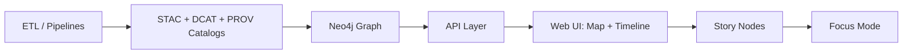

# 🧩 JSON Schema Contracts (API + Content) — `api/contracts/jsonschema/`


> ✅ **North star:** If it shows up in **the UI** or **Focus Mode**, it must be **traceable to cataloged sources** and **provable processing** — no “mystery layers.” 🧾🧠🗺️

---

## 📌 What this folder is

This directory holds **JSON Schema** contracts used to validate KFM “boundary artifacts” and shared payloads across the stack:

- 📦 **Catalog boundary artifacts** (STAC / DCAT / PROV profiles + KFM extensions)
- 🧠 **Story / Focus Mode** payloads (machine-ingestible narratives, context bundles, citations)
- 🗺️ **UI configuration** (layer registries, map/timeline layer configs, story-to-layer bindings)
- 🔌 **API payloads** (REST request/response envelopes, shared DTOs, pagination, errors)
- 🧪 **Telemetry + run manifests** (pipelines, AI runs, audits, governance checks)

These schemas exist so we can **fail fast** (and fail safe) in:
- local dev validation 🧰
- CI gates ✅
- policy-as-code evaluation ⚖️
- runtime input/output validation 🔒

---

## 🧱 Contract boundaries in KFM (why schemas matter)

KFM treats contracts as *first-class artifacts* — each stage consumes the **validated outputs** of the stage before it.



### ✅ Non‑negotiables (in practice)
- **Catalogs first:** publish STAC/DCAT/PROV *before* graph/UI/story usage.
- **Graph references catalogs:** graph stores IDs/refs, not huge payload blobs.
- **API is the enforcement boundary:** redaction, classification, rate limits, schema validation.
- **UI reads from API only:** no hidden data files, no bypass queries.
- **AI outputs are evidence artifacts:** they must be stored + cataloged + PROV-traced.

---

## 🗂️ Suggested folder layout

> If you’re building this directory out from scratch, this layout mirrors KFM’s subsystem contracts and keeps `$ref`s easy to manage.

```text
api/contracts/jsonschema/
├── 📄 README.md
├── 📁 _shared/                      # cross-domain shared types
│   ├── 📄 envelope.schema.json       # API response envelope
│   ├── 📄 problem.schema.json        # error/problem details
│   ├── 📄 pagination.schema.json
│   └── 📄 identifiers.schema.json
├── 📁 catalogs/                      # boundary artifacts
│   ├── 📁 stac/                      # STAC + KFM STAC Profile extensions
│   ├── 📁 dcat/                      # DCAT + KFM DCAT Profile extensions
│   └── 📁 prov/                      # PROV + KFM PROV Profile extensions
├── 📁 graph/                         # graph-facing contracts (ids, labels, migrations)
├── 📁 api/                           # request/response bodies not covered in OpenAPI gen
├── 📁 storynodes/                    # Story Node payloads + references
├── 📁 focusmode/                     # Focus Mode Q&A + citation bundles
├── 📁 ui/                            # map/layer configuration contracts
└── 📁 telemetry/                     # run manifests, audits, governance reports
```

---

## 📚 Schema index (what to look for)

### 📦 Catalog contracts
Schemas that enforce KFM’s required metadata + cross‑linking:

- **STAC**: collections/items/assets + KFM-required extensions (dataset ID, classification, provenance links)
- **DCAT**: dataset/distributions for discoverability, licensing, sovereignty/sensitivity fields
- **PROV**: run bundles for reproducibility (inputs → activities → outputs), agents, parameters, confidence

### 🧠 Story / Focus Mode contracts
- **Story Node**: machine-ingestible narrative that references catalog IDs for every claim/media
- **Focus Mode bundle**: curated evidence context + map/timeline state
- **Citations**: normalized citation objects (STAC/DCAT/PROV IDs, locators, confidence/uncertainty)

### 🗺️ UI contracts
- Layer registry items (id, title, style/config pointers, classification, time range)
- Map layer definitions (2D MapLibre) + optional 3D overlays (Cesium / 3D Tiles)
- Story-to-layer bindings (what layers activate per story step)

### 🔌 API contracts
- Request bodies that need stricter validation than OpenAPI auto-gen provides
- Response envelopes, pagination, standard errors (Problem Details-ish)
- Filtering/sorting schemas (bbox, time ranges, keyword filters, graph traversal constraints)

### 🧪 Telemetry & manifests
- Pipeline run manifests (inputs, outputs, versions, checksums)
- Governance checks (review gates triggered, policy results)
- AI run manifests (prompt IDs, tool calls, citations produced, safety checks)

---

## 🧬 Versioning & compatibility rules (SemVer for contracts)

> Schemas are contracts — **breaking the contract breaks downstream clients**.

### 1) Dataset versioning (data world)
- New or reprocessed dataset versions should **link back** using `prov:wasRevisionOf` (DCAT/PROV), ideally with a persistent identifier (DOI/ARK) when appropriate.

### 2) Graph versioning (structure world)
- Node labels / relationship types should remain backward compatible unless a deliberate migration is performed.

### 3) API versioning (client world)
- Breaking API changes require **a new versioned endpoint** or a negotiation strategy; keep old versions until sunset.

### 4) Release versioning (repo world)
- Major repo releases reflect structural shifts; minor/patch add features safely.

### Practical schema change policy
| Change type | Examples | Action |
|---|---|---|
| ✅ Backward compatible | Add optional fields, widen enums safely, add new schema files | **Minor/Patch** schema version bump |
| ⚠️ Risky | Tighten validation, new required fields | Treat as **breaking** unless dual-path supported |
| ❌ Breaking | Remove/rename fields, change types, restructure objects | **Major** schema version bump + keep old schema available |

---

## 🧑‍🎨 Schema authoring rules (house style)

### ✅ JSON Schema dialect
- Use **JSON Schema Draft 2020‑12** (preferred for `$defs`, modern evaluation keywords).

### ✅ `$id` + `$schema`
Every schema must declare:
- `$schema`: the draft URI
- `$id`: stable URI-like identifier (include major version)
- `title` + `description`
- clear examples (either in-schema or in the examples folder)

### ✅ Strict by default
- Use `additionalProperties: false` (or `unevaluatedProperties: false`) for stable objects.
- If extension is required, add an explicit extension field (example below).

### ✅ KFM vendor extension pattern
Prefer explicit namespacing for project-specific metadata:

```json
{
  "kfm:classification": "public",
  "kfm:dataset_id": "kfm.ks.example.dataset.v1",
  "kfm:sovereignty": {
    "restricted": false,
    "notes": "..."
  }
}
```

*(Exact fields depend on the relevant KFM profile for STAC/DCAT/PROV.)*

### ✅ Prefer `$ref` over copy/paste
- Common objects belong in `_shared/`
- Domain schemas should reference shared definitions

---

## ⚖️ Governance & safety hooks (why schemas include “policy fields”)

KFM uses **machine-checkable governance** and policy gates. JSON Schemas:
- require license + attribution fields
- require classification/sensitivity markers
- enforce “no unsourced output” patterns (citations required for Focus Mode / narratives)
- support OPA policy checks (fail merges that violate governance rules)

**Rule of thumb:**  
If an API response could expose sensitive data, the **API boundary** should:
1) validate output schema  
2) apply policy checks  
3) redact/label as needed  
4) return a contract-compliant payload  

---

## ✅ Validation (local + CI)

### Local validation options
Pick a validator that fits your toolchain:

**Option A: Node / AJV**
```bash
npx ajv-cli validate -s api/contracts/jsonschema/<schema>.schema.json -d <payload>.json --strict=true
```

**Option B: Python**
```bash
python -m jsonschema -i <payload>.json api/contracts/jsonschema/<schema>.schema.json
```

### CI expectations (minimum)
A contract-focused CI pass should include:

- ✅ Validate that every `*.schema.json` is valid JSON Schema
- ✅ Validate all examples against their schema
- ✅ Ensure `$ref` targets exist (no dangling references)
- ✅ Run policy-as-code checks (Conftest/OPA) over catalog artifacts and contracts
- ✅ Block merges when contracts break without version bumps

---

## ➕ Adding or changing a contract (recommended workflow)

1. 🧭 **Pick the boundary** (catalog / graph / API / UI / story / telemetry)
2. 🧱 Add or update the schema under the correct folder
3. 🧪 Add at least **one example** payload (good + failing examples are ideal)
4. 🔁 If breaking: introduce **v2** alongside **v1** (don’t silently mutate v1)
5. ⚖️ Update relevant policy tests (OPA/Conftest) if governance gates rely on fields
6. 📝 Update docs that point to the schema (Story Node templates, API docs, etc.)

**PR checklist (copy/paste):**
- [ ] Schema updated/added
- [ ] Examples added/updated
- [ ] Validation passes locally
- [ ] CI passes (schema + examples + policy gates)
- [ ] Version bump applied if breaking
- [ ] Changelog entry added (if applicable)

---

## 🧩 Patterns worth standardizing (starter set)

### 📦 API Envelope
A consistent envelope reduces client complexity:
- `data` for success payload
- `error` for failures
- `meta` for paging, timing, request IDs
- `provenance` for citation bundle references

### 🧭 GeoJSON outputs
If an endpoint returns geometry, standardize on:
- `Feature` / `FeatureCollection`
- consistent CRS expectations (usually EPSG:4326 unless explicitly stated)
- stable feature IDs (prefer catalog IDs)

### 🧾 Citation objects
Normalize citations so UI/Focus Mode can render them consistently:
- catalog IDs (STAC/DCAT/PROV) + optional URL/locator
- confidence/uncertainty fields where appropriate
- “derived/AI-generated” flags for evidence artifacts

---

## 🔗 Related KFM docs (high signal)

- 📘 `docs/MASTER_GUIDE_v13.md` (pipeline order + contracts + governance)
- 🧱 `docs/standards/KFM_STAC_PROFILE.md`
- 🧱 `docs/standards/KFM_DCAT_PROFILE.md`
- 🧱 `docs/standards/KFM_PROV_PROFILE.md`
- ⚖️ `api/scripts/policy/README.md` (policy gates; OPA/Conftest)
- 🧪 `docs/data/contracts/examples/README.md` (example payload patterns)

---

## 📚 Reference shelf (project materials)

These project files inform the “why” behind the contracts (architecture, AI constraints, UI rules, intake, governance, and future federation):

- 📄 *Kansas Frontier Matrix (KFM) – Comprehensive Technical Documentation*
- 📄 *Kansas Frontier Matrix (KFM) – Comprehensive Architecture, Features, and Design*
- 📄 *Kansas Frontier Matrix (KFM) – AI System Overview 🧭🤖*
- 📄 *Kansas Frontier Matrix – Comprehensive UI System Overview*
- 📄 *📚 Kansas Frontier Matrix (KFM) Data Intake – Technical & Design Guide*
- 📄 *Innovative Concepts to Evolve the Kansas Frontier Matrix (KFM)*
- 📄 *🌟 Kansas Frontier Matrix – Latest Ideas & Future Proposals*
- 📄 *Additional Project Ideas*
- 📦 *AI Concepts & more* (PDF portfolio)
- 📦 *Maps-GoogleMaps-VirtualWorlds-Archaeological-Computer Graphics-Geospatial-webgl* (PDF portfolio)
- 📦 *Various programming languages & resources 1* (PDF portfolio)
- 📦 *Data Managment-Theories-Architures-Data Science-Baysian Methods-Some Programming Ideas* (PDF portfolio)

---

## ❓ FAQ

### Why JSON Schema if FastAPI already generates OpenAPI?
OpenAPI is great for REST docs and client generation — but **JSON Schema** here is the reusable contract layer used by:
- catalogs
- run manifests
- UI config
- story/focus payloads
- policy checks

OpenAPI can *reference* these schemas, or be generated from the same Pydantic models — but the “contract-first” goal is to keep the canonical truth **reviewable and versioned**.

### Where do example payloads go?
If you don’t already have a home for examples, add one adjacent to contracts (or use the existing `docs/data/contracts/examples/` pattern). Examples are essential for regression-proof evolution ✅

---

🧭 **Rule to remember:** contracts are how KFM scales to new domains, new stories, new AI helpers, and even cross‑state federation — without losing trust. 🚀
