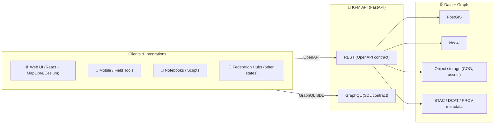

<!-- Path: api/contracts/openapi/README.md -->

# 🌾 OpenAPI Contracts — Kansas Frontier Matrix (KFM)


-orange)

> [!IMPORTANT]
> This folder is the **contract boundary** for KFM’s REST API. If an endpoint/field isn’t defined here, it isn’t a supported interface.  
> Contract-first design is a core KFM principle (stable interface, versioned changes, and contract tests). [oai_citation:0‡MARKDOWN_GUIDE_v13.md.gdoc](file-service://file-UYVruFXfueR8veHMUKeugU) [oai_citation:1‡Kansas Frontier Matrix (KFM) – Comprehensive Technical Documentation.docx](file-service://file-PaBDqECcJe7NbC8hvXNGDS)

---

## 🧭 What lives here

KFM is designed as an open-source geospatial knowledge & modeling hub that emphasizes **provenance-first**, open standards, and modular boundaries between UI ↔ API ↔ data/graph layers. [oai_citation:2‡Kansas Frontier Matrix (KFM) – Comprehensive Technical Documentation.docx](file-service://file-PaBDqECcJe7NbC8hvXNGDS) [oai_citation:3‡Audit of the Kansas Frontier Matrix (KFM) Repository.pdf](file-service://file-1RwSrWXaDb5fnJ5gZX5kS3)

This directory contains (or will contain) the OpenAPI definitions that describe KFM’s REST endpoints—documented so external users can integrate via standard HTTP tooling and so SDKs can be generated from the spec. [oai_citation:4‡Audit of the Kansas Frontier Matrix (KFM) Repository.pdf](file-service://file-1RwSrWXaDb5fnJ5gZX5kS3)

KFM also supports a **GraphQL endpoint** for flexible graph-oriented retrieval; OpenAPI here focuses on REST contracts only. [oai_citation:5‡Audit of the Kansas Frontier Matrix (KFM) Repository.pdf](file-service://file-1RwSrWXaDb5fnJ5gZX5kS3)

---

## 🔗 Quick links

- 📄 `./openapi.yaml` (or `./openapi.json`) — canonical contract (source of truth)
- 🧩 `./components/` — shared schemas, parameters, responses
- 🧪 `./examples/` — curated request/response examples (copy/paste-ready)
- 🛡️ `./policy/` — contract-facing governance rules (public vs internal, redaction rules, etc.)

> [!TIP]
> In the KFM v13 canonical layout, API contracts are grouped under a `contracts/` home (OpenAPI + GraphQL). [oai_citation:6‡MARKDOWN_GUIDE_v13.md.gdoc](file-service://file-UYVruFXfueR8veHMUKeugU)  
> This repo keeps OpenAPI under `api/contracts/openapi/` to make the boundary explicit inside the backend module.

---

## 🏗️ How this fits into KFM



- KFM’s architecture explicitly separates layers and keeps domain logic independent, with “well-defined APIs linking components.” [oai_citation:7‡Kansas Frontier Matrix (KFM) – Comprehensive Technical Documentation.docx](file-service://file-PaBDqECcJe7NbC8hvXNGDS)
- Backend stack described in KFM materials includes **FastAPI + PostGIS + Neo4j** and a modular, loosely-coupled approach. [oai_citation:8‡Audit of the Kansas Frontier Matrix (KFM) Repository.pdf](file-service://file-1RwSrWXaDb5fnJ5gZX5kS3)

---

## 📁 Recommended folder layout

```text
api/contracts/openapi/
├─ ✅📄 README.md                          # 👈 you are here 📌 How the OpenAPI contract is structured + build/validation workflow
├─ 📄 openapi.yaml                         # Canonical OpenAPI contract (preferred single entrypoint)
├─ 🧩 components/                          # Reusable building blocks referenced across the spec
│  ├─ 🧱 schemas/                          # JSON Schemas for domain models (request/response bodies)
│  ├─ 🎛️ parameters/                       # Shared parameters (pagination, bbox, time ranges, filters, ids)
│  ├─ 📦 responses/                        # Standard responses (error envelopes, common success wrappers)
│  └─ 🔐 securitySchemes/                  # Auth definitions (bearer, apiKey, oauth flows, etc.)
├─ 🧪 examples/                            # Examples used by docs/tests (must validate against schemas)
│  ├─ 📥 requests/                         # Example request payloads and parameter sets
│  └─ 📤 responses/                        # Example response payloads (success + error shapes)
├─ 🧬 overlays/                            # Optional overlays (e.g., public vs internal variants; patch/merge inputs)
│  ├─ 🌐 public.yaml                       # Public-facing overlay (hide internal endpoints/fields)
│  └─ 🔒 internal.yaml                     # Internal overlay (admin endpoints, extra debug fields)
└─ 🗓️ changelog/                           # Contract change notes (SemVer narrative per version)
   └─ 🗓️📄 v1.md                            # v1 change log (breaking/additive/fixes + migration notes)
```

> [!NOTE]
> KFM’s audit explicitly frames KFM as “data-as-a-service” with REST + OpenAPI documentation and predictable HTTP patterns. [oai_citation:9‡Audit of the Kansas Frontier Matrix (KFM) Repository.pdf](file-service://file-1RwSrWXaDb5fnJ5gZX5kS3)

---

## 🔁 Contract-first workflow (the golden path)

### 1) Design the contract before code
- Add/adjust **paths**, **schemas**, **examples**, and **error models** in OpenAPI.
- For anything non-trivial, also add a short “API Contract Extension” note (keeps intent + invariants clear). [oai_citation:10‡MARKDOWN_GUIDE_v13.md.gdoc](file-service://file-UYVruFXfueR8veHMUKeugU)

### 2) Implement endpoints to match
- Implement in FastAPI (or adapter layer) so runtime behavior conforms to the contract.
- Avoid “undocumented” fields/behaviors—contract drift is how integrations break.

### 3) Validate + test
- ✅ Run schema validation on the OpenAPI file
- ✅ Run integration tests (spin up API + test DB) to verify responses match contract behavior [oai_citation:11‡Kansas Frontier Matrix (KFM) – Comprehensive Technical Documentation.docx](file-service://file-PaBDqECcJe7NbC8hvXNGDS)
- ✅ Run contract tests (OpenAPI-driven) against the API surface

### 4) Policy-gate (governance)
KFM’s roadmap proposes machine-readable governance rules (Policy Pack) enforced in CI (OPA/Rego + Conftest) for FAIR/CARE, sensitive data handling, and redaction rules. [oai_citation:12‡🌟 Kansas Frontier Matrix – Latest Ideas & Future Proposals.docx](file-service://file-QrXwct2pX9kFpqgjtBiijR)

### 5) Version + release
- If you change the contract, you must document the change and bump the API version appropriately (see below).

---

## ✅ PR checklist (OpenAPI)

- [ ] Updated `openapi.yaml` (paths + request/response schemas)
- [ ] Added/updated examples in `examples/`
- [ ] Marked endpoints as **public** vs **internal** (and enforced policy)
- [ ] Confirmed backward compatibility (or version bump + deprecation plan)
- [ ] Added/updated tests (unit + integration + contract tests) [oai_citation:13‡Kansas Frontier Matrix (KFM) – Comprehensive Technical Documentation.docx](file-service://file-PaBDqECcJe7NbC8hvXNGDS)
- [ ] Provenance hooks included where needed (STAC/DCAT/PROV links) [oai_citation:14‡Audit of the Kansas Frontier Matrix (KFM) Repository.pdf](file-service://file-1RwSrWXaDb5fnJ5gZX5kS3)

---

## 🧩 Contract design conventions

### 🏷️ Paths, tags, and `operationId`
- Paths are **nouns**; verbs are behaviors (use POST for operations).
- Tags map to bounded contexts, e.g.:
  - `catalog`, `datasets`, `layers`, `tiles`, `graph`, `stories`, `simulations`, `analytics`, `auth`
- `operationId` must be stable (SDK generation depends on this).

### 📦 Envelope + error model (standardize everything)
Define a single KFM error schema (and reuse it everywhere):

```yaml
components:
  schemas:
    KfmError:
      type: object
      required: [error, message, trace_id]
      properties:
        error: { type: string }       # stable error code
        message: { type: string }     # human-readable
        trace_id: { type: string }    # log correlation
        details: { type: object, additionalProperties: true }
```

> [!WHY]
> KFM emphasizes transparency and traceability; stable error codes + trace IDs make issues debuggable without guesswork. [oai_citation:15‡Kansas Frontier Matrix (KFM) – Comprehensive Technical Documentation.docx](file-service://file-PaBDqECcJe7NbC8hvXNGDS)

---

## 🌍 Geospatial rules (KFM defaults)

KFM is explicitly committed to open geospatial standards:
- **GeoJSON** for vector responses
- **COG** (Cloud-Optimized GeoTIFF) for raster assets
- Prefer **WGS84** unless analysis requires otherwise
- Publish STAC records + provenance metadata (PROV-O JSON-LD) and index datasets via DCAT for discovery [oai_citation:16‡Audit of the Kansas Frontier Matrix (KFM) Repository.pdf](file-service://file-1RwSrWXaDb5fnJ5gZX5kS3)

### Coordinate system + geometry encoding
When geometry originates in PostGIS, keep the contract clear about output CRS and encoding. For example, transform to WGS84 and return GeoJSON geometry explicitly (common pattern shown below).

```sql
-- illustrative (PostGIS): transform to EPSG:4326 and encode as GeoJSON
SELECT ST_AsGeoJSON(ST_Transform(geom, 4326)) AS geometry
FROM ...
```

### Tiles and media types
Tile endpoints should declare correct `Content-Type` and caching semantics.

- Use efficient formats (PNG/JPEG/etc.) and document compression tradeoffs and expected usage (raster overlays, basemaps, previews).
- If you expose static map snapshots, declare dimensions and output formats clearly.

> [!TIP]
> Map design choices impact usability; even API-delivered styling/legends should be documented so maps remain interpretable and consistent across clients. [oai_citation:17‡Spectral Geometry of Graphs.pdf](file-service://file-DWxRbQDZGktGtiWtzAQxs8)

---

## 🧠 Analytics, stats, and uncertainty (don’t ship “naked numbers”)

KFM explicitly values rigorous analysis and validation (including uncertainty estimates). [oai_citation:18‡Audit of the Kansas Frontier Matrix (KFM) Repository.pdf](file-service://file-1RwSrWXaDb5fnJ5gZX5kS3)

### Frequentist outputs
If returning estimates from regression / statistical models, include:
- point estimate
- standard error
- confidence interval (level specified)
- degrees of freedom (if relevant)
- diagnostics metadata (when applicable)

Confidence intervals and hypothesis tests must be used carefully; multiple comparisons can inflate false positives, so contract expectations should discourage “p-value hunting” and document correction strategies when appropriate. [oai_citation:19‡Regression analysis using Python - slides-linear-regression.pdf](file-service://file-Ekbky5FwpaPHfZC2ttv6xR)

### Bayesian outputs
If returning Bayesian results, include credible intervals and clearly specify:
- prior family (at least at a high level)
- posterior summary and credible intervals

---

## 🧪 Modeling & simulation endpoints

KFM’s roadmap includes **deterministic scenario replay** tooling: fixed seeds, containerized tools, and a “virtual clock” so reruns are identical and auditable. [oai_citation:20‡🌟 Kansas Frontier Matrix – Latest Ideas & Future Proposals.docx](file-service://file-QrXwct2pX9kFpqgjtBiijR)

The broader KFM modeling posture aligns with robust uncertainty quantification (e.g., Monte Carlo sampling and UQ workflows).

### Recommended contract pattern for long-running jobs
Use an async job resource:

- `POST /simulations` → returns `202 Accepted` + `job_id`
- `GET /simulations/{job_id}` → returns status + progress + outputs
- `GET /simulations/{job_id}/artifacts` → returns signed URLs (COG, reports, etc.)
- Include `idempotency_key` support for safe retries (mirrors KFM’s idempotent/traceable agent design). [oai_citation:21‡🌟 Kansas Frontier Matrix – Latest Ideas & Future Proposals.docx](file-service://file-QrXwct2pX9kFpqgjtBiijR)

Include provenance + reproducibility fields:
- `run_uuid` (stable)
- `seed`
- `container_image` (digest)
- `inputs` (hashes/URIs)
- `outputs` (STAC item IDs, DCAT links)
- `prov` (PROV-O JSON-LD link)

> [!NOTE]
> KFM proposes emitting lineage events with stable run UUIDs as part of CI/ops observability—this same discipline should show up in modeling API contracts. [oai_citation:22‡🌟 Kansas Frontier Matrix – Latest Ideas & Future Proposals.docx](file-service://file-QrXwct2pX9kFpqgjtBiijR)

---

## 🕸️ Graph endpoints (knowledge graph isn’t “just another table”)

When exposing graph retrieval/analytics:
- Make node/edge types explicit
- Provide pagination strategies for traversals
- Document “graph measures” precisely (e.g., Laplacian-based measures, spectral features) when they are exposed via analytics endpoints

---

## 🔐 Security, privacy, and ethical defaults

KFM is guided by **digital humanism** and emphasizes privacy, accountability, and strong authentication as part of human-centered technology design. [oai_citation:23‡Introduction to Digital Humanism.pdf](file-service://file-HC311tLjkcn1yRbyTBLJQQ) [oai_citation:24‡Kansas Frontier Matrix (KFM) – Comprehensive Technical Documentation.docx](file-service://file-PaBDqECcJe7NbC8hvXNGDS)

### Input safety (defensive posture)
- Validate and sanitize inputs.
- Use parameterized queries to reduce injection risk (especially when building filter/search endpoints).
- Consider fuzzing as part of defensive testing to catch malformed input handling bugs.

> [!CAUTION]
> Security testing guidance is for **defensive** quality and awareness—no unauthorized testing on systems you don’t own or operate.

### Public vs internal surfaces
Model this directly in the contract:
- `x-kfm-visibility: public|internal`
- `x-kfm-sensitivity: none|licensed|personal|restricted`
- geometry generalization rules for sensitive layers (policy-gated) [oai_citation:25‡🌟 Kansas Frontier Matrix – Latest Ideas & Future Proposals.docx](file-service://file-QrXwct2pX9kFpqgjtBiijR)

---

## 🤝 Federation-ready by design

KFM’s roadmap anticipates federation with other “Frontier Matrix” hubs, which requires **standardizing APIs and schemas across implementations** and keeping contracts open and well documented. [oai_citation:26‡🌟 Kansas Frontier Matrix – Latest Ideas & Future Proposals.docx](file-service://file-QrXwct2pX9kFpqgjtBiijR) [oai_citation:27‡Kansas Frontier Matrix (KFM) – Comprehensive Technical Documentation.docx](file-service://file-PaBDqECcJe7NbC8hvXNGDS)

Practical implications for this OpenAPI contract:
- Avoid Kansas-specific naming in shared schemas where possible
- Use standards-first objects (STAC/DCAT/PROV) so partners can interoperate [oai_citation:28‡Audit of the Kansas Frontier Matrix (KFM) Repository.pdf](file-service://file-1RwSrWXaDb5fnJ5gZX5kS3)
- Keep versioning strict (breakage kills federation)

---

## ⚡ Performance + scalability notes (contract-visible)

- Explicit pagination everywhere (avoid “unbounded list” responses)
- Cache headers for tiles and immutable artifacts
- Prefer batch endpoints for high-latency workflows
- Design queries with “edge-case-first” thinking; compilation/caching strategies matter in future hardware scenarios and large data workloads.

---

## 🔢 Versioning & deprecation

### Versioning rule of thumb
- **PATCH**: documentation clarifications / examples / non-breaking schema relaxations
- **MINOR**: additive changes (new endpoints, new optional fields)
- **MAJOR**: breaking changes (remove/rename fields, tighten schemas, change meaning)

### Deprecation contract
- Mark endpoints/fields with `deprecated: true`
- Provide a replacement link and removal date
- Keep deprecated behavior working through at least one minor cycle (unless a security issue forces faster action)

---

## 🧾 Naming conventions (IDs and metadata)

- Prefer stable resource IDs over mutable names.
- Dataset IDs should follow a documented, consistent pattern (KFM materials mention a pattern like `kfm.ks.topic.year_range.v#`). [oai_citation:29‡Audit of the Kansas Frontier Matrix (KFM) Repository.pdf](file-service://file-1RwSrWXaDb5fnJ5gZX5kS3)
- Treat citations/provenance links as first-class response fields (not “documentation only”). [oai_citation:30‡Kansas Frontier Matrix (KFM) – Comprehensive Technical Documentation.docx](file-service://file-PaBDqECcJe7NbC8hvXNGDS)

---

## 📚 Project grounding & design bibliography (why these rules exist)

<details>
<summary>📌 Core KFM documents (architecture + governance)</summary>

- **Audit of the Kansas Frontier Matrix (KFM) Repository** — open standards (GeoJSON/COG/STAC/DCAT/PROV), OpenAPI docs, REST + GraphQL posture [oai_citation:31‡Audit of the Kansas Frontier Matrix (KFM) Repository.pdf](file-service://file-1RwSrWXaDb5fnJ5gZX5kS3) [oai_citation:32‡Audit of the Kansas Frontier Matrix (KFM) Repository.pdf](file-service://file-1RwSrWXaDb5fnJ5gZX5kS3)  
   [oai_citation:33‡Audit of the Kansas Frontier Matrix (KFM) Repository.pdf](file-service://file-1RwSrWXaDb5fnJ5gZX5kS3)
- **KFM – Comprehensive Technical Documentation** — modular architecture, QA expectations, human-centered + evidence-backed AI posture [oai_citation:34‡Kansas Frontier Matrix (KFM) – Comprehensive Technical Documentation.docx](file-service://file-PaBDqECcJe7NbC8hvXNGDS) [oai_citation:35‡Kansas Frontier Matrix (KFM) – Comprehensive Technical Documentation.docx](file-service://file-PaBDqECcJe7NbC8hvXNGDS)  
   [oai_citation:36‡Kansas Frontier Matrix (KFM) – Comprehensive Technical Documentation.docx](file-service://file-PaBDqECcJe7NbC8hvXNGDS)
- **🌟 Latest Ideas & Future Proposals** — federation, deterministic sim-run, provenance integration, policy pack & CI gates [oai_citation:37‡🌟 Kansas Frontier Matrix – Latest Ideas & Future Proposals.docx](file-service://file-QrXwct2pX9kFpqgjtBiijR) [oai_citation:38‡🌟 Kansas Frontier Matrix – Latest Ideas & Future Proposals.docx](file-service://file-QrXwct2pX9kFpqgjtBiijR)  
   [oai_citation:39‡🌟 Kansas Frontier Matrix – Latest Ideas & Future Proposals.docx](file-service://file-QrXwct2pX9kFpqgjtBiijR)
- **Master Guide v13 / Markdown Guide** — contract-first doctrine, canonical contract homes, API boundary expectations [oai_citation:40‡MARKDOWN_GUIDE_v13.md.gdoc](file-service://file-UYVruFXfueR8veHMUKeugU) [oai_citation:41‡Kansas Frontier Matrix (KFM) – Comprehensive Technical Documentation.docx](file-service://file-PaBDqECcJe7NbC8hvXNGDS)

</details>

<details>
<summary>📚 Reference library (used to strengthen contract conventions)</summary>

- **Modeling & uncertainty**: NASA-grade modeling guide (Monte Carlo / UQ)  
- **Experimental rigor**: Master Coder Protocol (variables, controlled experiments) [oai_citation:42‡Scientific Modeling and Simulation_ A Comprehensive NASA-Grade Guide.pdf](file-service://file-LuWF23hffNAZJaZm2Gzvcd)
- **Stats & analysis**: understanding stats + regression slides + Think Bayes (confidence vs credible intervals; multiple testing discipline) [oai_citation:43‡Regression analysis using Python - slides-linear-regression.pdf](file-service://file-Ekbky5FwpaPHfZC2ttv6xR)
- **Geo engineering**: PostGIS→GeoJSON + CRS transformation patterns and JSONB usage patterns in PostgreSQL
- **Data interoperability**: FAIR principles in data spaces
- **Remote sensing**: Earth Engine as cloud-distributed compute + API-driven workflows
- **Graph analytics**: Laplacian foundations for spectral graph measures
- **Optimization**: structured formulation of optimization problems (design variables, objective, constraints)
- **Client reality**: responsive/mobile constraints [oai_citation:44‡Spectral Geometry of Graphs.pdf](file-service://file-DWxRbQDZGktGtiWtzAQxs8), WebGL/3D visualization context, and mobile mapping shifts [oai_citation:45‡Spectral Geometry of Graphs.pdf](file-service://file-DWxRbQDZGktGtiWtzAQxs8)
- **Security & privacy**: digital humanism framing for privacy + accountability [oai_citation:46‡Introduction to Digital Humanism.pdf](file-service://file-HC311tLjkcn1yRbyTBLJQQ); defensive testing/fuzzing concepts

</details>

---

## 🧭 Next steps (suggested)

1) Add `openapi.yaml` (if missing) and split reusable schemas into `components/schemas/`  
2) Add at least 1 “golden-path” example per major module (catalog, layers, tiles, graph, simulations)  
3) Add contract tests in CI + policy gate checks for public/internal boundaries and sensitive data rules [oai_citation:47‡🌟 Kansas Frontier Matrix – Latest Ideas & Future Proposals.docx](file-service://file-QrXwct2pX9kFpqgjtBiijR)

---
