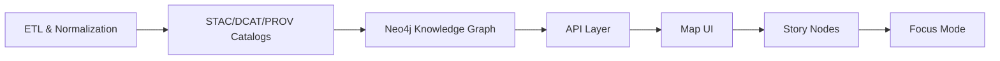

# 🧾 KFM Contract Schemas (JSON Schema)


> 📍 **You are here:** `api/contracts/schemas/`  
> 🎯 **Goal:** Keep KFM data + API payloads *predictable, validated, and evolvable* via explicit schemas.

---

## ✨ What this folder is

This directory is KFM’s **schema registry**: a set of **machine-validated contracts** (JSON Schema) that define the shape of:

- 🌍 **Geospatial payloads** (e.g., GeoJSON features / collections, extents, geometry metadata)
- 📦 **Catalog metadata** (STAC / DCAT / PROV profiles & extensions)
- 🧠 **Knowledge Graph payloads** (graph entity references, query result envelopes)
- 🎬 **Story + Focus artifacts** (Story Node metadata, Focus Mode context bundles)
- 📈 **Telemetry & audit events** (interaction logs, governance signals, pipeline run summaries)
- 🛡️ **Policy-sensitive outputs** (redaction-aware response envelopes, classification tags)

**Schemas in this folder are treated like API surface area.**  
If a client can see it, this folder should be able to validate it ✅

---

## 🧭 KFM contract boundaries (why schemas matter)

KFM is built as a governed pipeline where each stage hands off to the next using **contract artifacts**. This folder is one of the key “boundary walls” that prevents drift and accidental breaking changes.



**Rule of thumb:**  
> If it crosses a boundary (pipeline → catalog, catalog → graph, graph → API, API → UI), it must have a contract. 📜

---

## 📁 Recommended layout

> If your repo already has a different layout, keep it—but try to converge toward something like this so schemas remain findable.

```text
api/contracts/schemas/ 🧾
├─ README.md ✅ (this file)
├─ core/ 🧱
│  ├─ id.v1.schema.json
│  ├─ error.v1.schema.json
│  ├─ pagination.v1.schema.json
│  └─ time-range.v1.schema.json
├─ geo/ 🗺️
│  ├─ geojson-feature.v1.schema.json
│  ├─ geojson-featurecollection.v1.schema.json
│  ├─ bbox.v1.schema.json
│  └─ tilejson.v1.schema.json
├─ catalog/ 📦
│  ├─ stac/ 🛰️
│  ├─ dcat/ 🗂️
│  └─ prov/ 🧬
├─ graph/ 🕸️
│  ├─ entity-ref.v1.schema.json
│  ├─ query-result.v1.schema.json
│  └─ traversal.v1.schema.json
├─ story/ 🎬
│  ├─ story-node-metadata.v1.schema.json
│  ├─ story-node-config.v1.schema.json
│  └─ citation.v1.schema.json
├─ focus/ 🎯
│  ├─ context-bundle.v1.schema.json
│  └─ answer-with-citations.v1.schema.json
├─ telemetry/ 📈
│  ├─ ui-event.v1.schema.json
│  ├─ access-audit.v1.schema.json
│  └─ pipeline-run.v1.schema.json
└─ examples/ 🧪
   ├─ geojson-featurecollection.example.json
   ├─ stac-item.example.json
   └─ focus-context-bundle.example.json
```

---

## 🧱 Schema authoring conventions

### 1) JSON Schema version & compatibility
Use a modern JSON Schema dialect consistently across this folder.

✅ Recommended header shape:

```json
{
  "$schema": "https://json-schema.org/draft/2020-12/schema",
  "$id": "urn:kfm:schema:geo:geojson-featurecollection:v1",
  "title": "GeoJSON FeatureCollection (KFM)",
  "type": "object"
}
```

### 2) File naming
Use **kebab-case** + **explicit major version** in the filename:

- ✅ `geojson-featurecollection.v1.schema.json`
- ✅ `story-node-metadata.v2.schema.json`
- ❌ `GeoJsonSchema.json`
- ❌ `feature_collection_final.json`

### 3) $ref discipline
Prefer **re-using** shared primitives over re-defining them:

- `core/id...` is reused by graph entities, story nodes, telemetry events, etc.
- `geo/bbox...` is reused by STAC items, map requests, and query filters.

### 4) “Closed by default” objects
When feasible, make payloads strict:

- Prefer `additionalProperties: false`
- Prefer `required: [...]` for invariants
- Prefer `oneOf/anyOf` for controlled unions

> ⚠️ Exception: metadata “extension points” (STAC extensions, flexible tags) may need an explicit `properties` + “namespaced” open fields strategy.

### 5) Examples are not optional
Every schema should ship with at least **one example** under `examples/` that CI can validate.

---

## 🔁 Versioning & deprecation policy

Schemas are **contracts**, so they must evolve safely.

### ✅ Non-breaking changes (no version bump)
- Adding **optional** fields
- Adding new enum values **only if clients treat unknown safely**
- Loosening constraints (rare; usually not ideal)

### 🚨 Breaking changes (new major schema)
- Renaming or removing fields
- Tightening validation in a way that rejects previously valid payloads
- Changing meanings of fields (even if the name stays the same)

**Pattern:**
- Keep the old major schema around (for compatibility)
- Introduce `*.v2.schema.json`
- Update OpenAPI / GraphQL types to reference the new schema
- Add contract tests for both (until v1 is formally sunset)

---

## 🔌 How these schemas plug into the API layer

### REST (FastAPI / OpenAPI)
- FastAPI generates OpenAPI automatically, but **schemas must still be explicit** for payload stability.
- OpenAPI components can reference these schemas (directly or via build/bundle step).

Example (illustrative):

```yaml
components:
  schemas:
    FeatureCollection:
      $ref: ./schemas/geo/geojson-featurecollection.v1.schema.json
```

### GraphQL
GraphQL SDL is its own contract—but the **payload envelopes** and **serialized exports** should still validate against JSON Schema when they are stored, cached, or published.

---

## 🧪 Validation (local + CI)

### Local validation ideas
Pick whichever tooling fits your stack (Node or Python):

**Node (AJV CLI):**
```bash
npx ajv-cli validate \
  -s api/contracts/schemas/geo/geojson-featurecollection.v1.schema.json \
  -d api/contracts/schemas/examples/geojson-featurecollection.example.json
```

**Python (check-jsonschema):**
```bash
python -m pip install check-jsonschema
check-jsonschema \
  --schemafile api/contracts/schemas/geo/geojson-featurecollection.v1.schema.json \
  api/contracts/schemas/examples/geojson-featurecollection.example.json
```

### CI expectations (recommended)
Automate:
- ✅ JSON Schema validation for all examples
- ✅ Schema linting (IDs, titles, consistent draft)
- ✅ API contract tests (golden request/response fixtures)
- ✅ Policy/security scans (secrets, sensitive fields, classification downgrades)

---

## 🎬 Story Nodes & Focus Mode: special rules

Story + Focus payloads are “trust surfaces.” Treat their schemas as stricter than typical API payloads.

**Minimum expectations for Story/Focus schemas:**
- Every factual claim can be linked to a citation object ✅
- Every entity reference can resolve to a stable graph ID 🕸️
- “Fact vs interpretation” fields are explicit 🧠
- Any AI-generated text is clearly flagged 🤖

> 🧩 If it can be displayed in Focus Mode, it must be provenance-linked.

---

## 🗺️ Geospatial payload guidelines

KFM serves geospatial data in multiple shapes (GeoJSON, tiles, packaged artifacts). Schema strategy:

- **GeoJSON**: validate structure + required properties + CRS assumptions (when applicable)
- **Tiles**: validate TileJSON metadata and tile endpoint descriptors
- **Packaged layers**: validate metadata for multi-format publishing (e.g., analysis format + visualization format)

---

## 🛡️ Security & governance notes (schema-level)

Schemas can’t solve security alone, but they *can* prevent common foot-guns:

- Disallow unbounded strings where IDs are expected
- Use explicit formats for timestamps / UUIDs / URIs
- Validate filter objects to avoid “query-by-string” injection patterns
- Encode **classification** and **redaction** signals into response envelopes

---

## ✅ Checklist: adding a new schema

- [ ] Put it in the right folder (`core/`, `geo/`, `catalog/`, `story/`, etc.)
- [ ] Add `$schema`, `$id`, `title`, `description`
- [ ] Add at least one example under `examples/`
- [ ] Reuse shared `$ref` definitions (don’t duplicate)
- [ ] Decide: strict object (`additionalProperties: false`) or explicit extension point
- [ ] Add / update contract tests
- [ ] Update OpenAPI/GraphQL contracts if the schema is user-facing
- [ ] Confirm backwards compatibility or introduce a new major version

---

## 📚 Reference Shelf (project-wide context)

<details>
<summary><b>📦 Included project library (why KFM has to handle many data shapes)</b></summary>

KFM schemas exist to support a wide surface area: geospatial catalogs, knowledge graphs, statistics/ML outputs, simulation artifacts, mapping UI payloads, and secure API boundaries.

Topics represented in the project library include:
- 🛰️ Remote sensing & Earth Engine workflows
- 🗺️ Map design, mobile mapping, and web mapping (WebGL/Cesium/MapLibre)
- 🧮 Statistics, regression, Bayesian reasoning, experimental design
- 🧠 Graph theory / spectral graph analysis
- 🧱 Scalable data management & streaming/event processing
- 🛡️ Secure systems + ethical hacking awareness
- 🤝 Digital humanism + AI governance / law considerations

</details>

---

## 🧩 TL;DR

**Schemas here are not “nice-to-have.” They’re the guardrails.**  
If we keep these contracts clean, versioned, and validated, the entire KFM pipeline stays stable—even as we add new datasets, new stories, and new capabilities. 🚀

